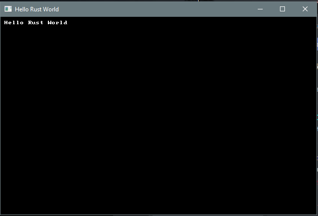

# Chapter 1 : Hello Rust

---

***About this tutorial***

*This tutorial is free and open source, and all code uses the MIT license - so you are free to do with it as you like. My hope is that you will enjoy the tutorial, and make great games!*

*If you enjoy this and would like me to keep writing, please consider supporting [my Patreon](https://www.patreon.com/blackfuture).*

---


This tutorial will get you started with Rust development, and RLTK - The *RogueLike Took Kit* - we'll be using to provide console output.

## Getting Rust

On most platforms, [rustup](https://rustup.rs/) is enough to get you a working Rust toolchain. On Windows, it's an easy download - and you get a working Rust environment when it is done. On Unix-derived systems (such as Linux, and OS X) it provides some command-line instructions to install the environment.

Once it is installed, verify that it is working by typing `cargo --version` on your command line. You should see something like `cargo 1.36.0 (c4fcfb725 2019-05-15)` (the version will change over time).

## Getting comfortable with a development environment

You want to make a directory/folder for your development work. You'll also want a text editor. I'm a fan of [Visual Studio Code](https://code.visualstudio.com/), but you can use whatever you are comfortable with. If you do use Visual Studio Code, I recommend the following extensions:

* `Better TOML` : makes reading toml files nice; Rust uses them a lot
* `C/C++` : uses the C++ debugger system to debug Rust code
* `Rust (rls)` : not the fastest, but thorough syntax highlighting and error checking as you go.

Once you've picked your environment, open up an editor and navigate to your new folder (in VS Code, `File -> Open Folder` and choose the folder).

## Creating a project

Now that you are in your chosen folder, you want to open a terminal/console window there. In VS Code, this is `Terminal -> New Terminal`. Otherwise, open a command line as normal and `cd` to your folder.

Rust has a built-in package manager called `cargo`. Cargo can make project templates for you! So to create your new project, type `cargo init hellorust`. After a moment, a new folder has appeared in your project - titled `hellorust`.
It will contain the following files and directories:

```
src\main.rs
Cargo.toml
.gitignore
```

These are:

* The `.gitignore` is handy if you are using git - it stops you from accidentally putting files into the git repository that don't need to be there. If you aren't using git, you can ignore it.
* `src\main.rs` is a simple Rust "hello world" program source.
* `Cargo.toml` defines your project, and how it should be built.

Go ahead and type `cargo run`. After some compilation, if everything is working you will be greeted with "Hello World" on your terminal.

## Setup Cargo.toml

The auto-generated Cargo file will look like this:

```toml
[package]
name = "helloworld"
version = "0.1.0"
authors = ["Your name if it knows it"]
edition = "2018"

# See more keys and their definitions at https://doc.rust-lang.org/cargo/reference/manifest.html

[dependencies]
```

Go ahead and make sure that your name is correct! Next, we're going to ask Cargo to use RLTK - the Roguelike toolkit library. Rust makes this very easy. Adjust the `dependencies` section to look like this:

```toml
[dependencies]
rltk = { git = "https://github.com/thebracket/rltk_rs" }
```

We're telling it that the package is named `rltk` and giving it a Github location to pull from.

## Hello Rust - RLTK Style!

Go ahead and replace the contents of `src\main.rs` with:

```rust
extern crate rltk;
use rltk::{Rltk, GameState, Console};

struct State {}
impl GameState for State {
    fn tick(&mut self, ctx : &mut Rltk) {
        ctx.cls();
        ctx.print(1, 1, "Hello Rust World");
    }
}

fn main() {
    let context = Rltk::init_simple8x8(80, 50, "Hello Rust World", "resources");
    let gs = State{ };
    rltk::main_loop(context, gs);
}
```

Now create a new folder called `resources`. RLTK needs a few files to run, and this is where we put them. Download [resources.zip](./resources.zip), and unzip it into this folder. Be careful to have `resources/backing.fs` (etc.) and not `resources/resources/backing.fs`.

Save, and go back to the terminal. Type `cargo run`, and you will be greeted with a console window showing `Hello Rust`.



## Playing with the tutorials

TODO: Git glone, and how to build and use the tutorials in this package.

---

Copyright (C) 2019, Herbert Wolverson.

---