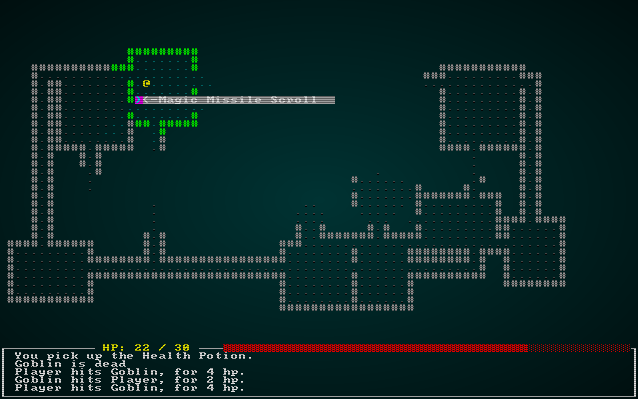

# Ranged Scrolls and Targeting

---

***About this tutorial***

*This tutorial is free and open source, and all code uses the MIT license - so you are free to do with it as you like. My hope is that you will enjoy the tutorial, and make great games!*

*If you enjoy this and would like me to keep writing, please consider supporting [my Patreon](https://www.patreon.com/blackfuture).*

---

In the last chapter, we added items and inventory - and a single item type, a health potion. Now we'll add a second item type: *a scroll of magic missile*, that lets you zap an entity at range.

# Using components to describe what an item *does*

In the last chapter, we pretty much wrote code to ensure that all items were healing potions. That got things going, but isn't very flexible. So we'll start by breaking down items into a few more component types. We'll start with a simple *flag* component, `Consumable`:

```rust
#[derive(Component, Debug)]
pub struct Consumable {}
```

Having this item indicates that using it destroys it (consumed on use). So we replace the always-called `entities.delete(useitem.item).expect("Delete failed");` in our `PotionUseSystem` (which we rename `ItemUseSystem`!) with:

```rust
let consumable = consumables.get(useitem.item);
match consumable {
    None => {}
    Some(_) => {
        entities.delete(useitem.item).expect("Delete failed");
    }
}
```

This is quite simple: check if the component *has* a `Consumable` tag, and destroy it if it does. Likewise, we can replace the `Potion` section with a `ProvidesHealing` to indicate that this is what the potion actually does. In `components.rs`:

```rust
#[derive(Component, Debug)]
pub struct ProvidesHealing {
    pub heal_amount : i32
}
```

And in our `ItemUseSystem`:
```rust
let item_heals = healing.get(useitem.item);
match item_heals {
    None => {}
    Some(healer) => {
        stats.hp = i32::min(stats.max_hp, stats.hp + healer.heal_amount);
        if entity == *player_entity {
            gamelog.entries.insert(0, format!("You drink the {}, healing {} hp.", names.get(useitem.item).unwrap().name, healer.heal_amount));
        }
    }
}
```

Drawing that together, our code for creating a potion (in `spawner.rs`) looks like this:

```rust
fn health_potion(ecs: &mut World, x: i32, y: i32) {
    ecs.create_entity()
        .with(Position{ x, y })
        .with(Renderable{
            glyph: rltk::to_cp437('¡'),
            fg: RGB::named(rltk::MAGENTA),
            bg: RGB::named(rltk::BLACK),
            render_order: 2
        })
        .with(Name{ name : "Health Potion".to_string() })
        .with(Item{})
        .with(Consumable{})
        .with(ProvidesHealing{ heal_amount: 8 })
        .build();
}
```

So we're describing where it is, what it looks like, its name, denoting that it is an item, consumed on use, and provides 8 points of healing. This is nice and descriptive - and future items can mix/match. As we add components, the item system will become more and more flexible.

# Describing Ranged Magic Missile Scrolls

We'll want to add a few more components! In `components.rs` (and registered in `main.rs`):
```rust
#[derive(Component, Debug)]
pub struct Ranged {
    pub range : i32
}

#[derive(Component, Debug)]
pub struct InflictsDamage {
    pub damage : i32
}
```

This in turn lets us write a `magic_missile_scroll` function in `spawner.rs`, which effectively describes the scroll:

```rust
fn magic_missile_scroll(ecs: &mut World, x: i32, y: i32) {
    ecs.create_entity()
        .with(Position{ x, y })
        .with(Renderable{
            glyph: rltk::to_cp437(')'),
            fg: RGB::named(rltk::CYAN),
            bg: RGB::named(rltk::BLACK),
            render_order: 2
        })
        .with(Name{ name : "Magic Missile Scroll".to_string() })
        .with(Item{})
        .with(Consumable{})
        .with(Ranged{ range: 6 })
        .with(InflictsDamage{ damage: 8 })
        .build();
}
```

That neatly lays out the properties of what makes it tick: it has a position, an appearance, a name, it's an item that is destroyed on use, it has a range of 6 tiles and inflicts 8 points of damage. That's what I like about components: after a while, it sounds more like you are describing a blueprint for a device than writing many lines of code!

We'll go ahead and add them into the spawn list:
```rust
fn random_item(ecs: &mut World, x: i32, y: i32) {
    let roll :i32;
    {
        let mut rng = ecs.write_resource::<RandomNumberGenerator>();
        roll = rng.roll_dice(1, 2);
    }
    match roll {
        1 => { health_potion(ecs, x, y) }
        _ => { magic_missile_scroll(ecs, x, y) }
    }
}
```

Replace the call to `health_potion` in the item spawning code with a call to `random_item`.

If you run the program (with `cargo run`) now, you'll find scrolls as well as potions lying around. The components system already provides quite a bit of functionality:

* You can see them rendered on the map (thanks to the `Renderable` and `Position`)
* You can pick them up and drop them (thank to `Item`)
* You can list them in your inventory
* You can call `use` on them, and they are destroyed: but nothing happens.



# Implementing ranged damage for items

We want magic missile to be targeted: you activate it, and then have to select a victim. This will be another input mode, so we once again extend `RunState` in `main.rs`:

```rust
#[derive(PartialEq, Copy, Clone)]
pub enum RunState { AwaitingInput, PreRun, PlayerTurn, MonsterTurn, ShowInventory, ShowDropItem, 
    ShowTargeting { range : i32, item : Entity} }
```

We'll extend our handler for `ShowInventory` in `main.rs` to handle items that are ranged and induce a mode switch:
```rust
RunState::ShowInventory => {
    let result = gui::show_inventory(self, ctx);
    match result.0 {
        gui::ItemMenuResult::Cancel => newrunstate = RunState::AwaitingInput,
        gui::ItemMenuResult::NoResponse => {}
        gui::ItemMenuResult::Selected => {
            let item_entity = result.1.unwrap();
            let is_ranged = self.ecs.read_storage::<Ranged>();
            let is_item_ranged = is_ranged.get(item_entity);
            if let Some(is_item_ranged) = is_item_ranged {
                newrunstate = RunState::ShowTargeting{ range: is_item_ranged.range, item: item_entity };
            } else {
                let mut intent = self.ecs.write_storage::<WantsToUseItem>();
                intent.insert(*self.ecs.fetch::<Entity>(), WantsToUseItem{ item: item_entity }).expect("Unable to insert intent");
                newrunstate = RunState::PlayerTurn;
            }
        }
    }
}
```

So now in `main.rs`, where we match the appropriate game mode, we can stub in:
```rust
RunState::ShowTargeting{range, item} => {
    let target = gui::ranged_target(self, ctx, range);
}
```

That naturally leads to actually writing `gui::ranged_target`. This looks complicated, but it's actually quite straightforward:

```rust
pub fn ranged_target(gs : &mut State, ctx : &mut Rltk, range : i32) -> (ItemMenuResult, Option<Point>) {
    let player_entity = gs.ecs.fetch::<Entity>();
    let player_pos = gs.ecs.fetch::<Point>();
    let viewsheds = gs.ecs.read_storage::<Viewshed>();

    ctx.print_color(5, 0, RGB::named(rltk::YELLOW), RGB::named(rltk::BLACK), "Select Target:");

    // Highlight available target cells
    let mut available_cells = Vec::new();
    let visible = viewsheds.get(*player_entity);
    if let Some(visible) = visible {
        // We have a viewshed
        for idx in visible.visible_tiles.iter() {
            let distance = rltk::DistanceAlg::Pythagoras.distance2d(*player_pos, *idx);
            if distance <= range as f32 {
                ctx.set_bg(idx.x, idx.y, RGB::named(rltk::BLUE));
                available_cells.push(idx);
            }
        }
    } else {
        return (ItemMenuResult::Cancel, None);
    }

    // Draw mouse cursor
    let mouse_pos = ctx.mouse_pos();
    let mut valid_target = false;
    for idx in available_cells.iter() { if idx.x == mouse_pos.0 && idx.y == mouse_pos.1 { valid_target = true; } }
    if valid_target {
        ctx.set_bg(mouse_pos.0, mouse_pos.1, RGB::named(rltk::CYAN));
        if ctx.left_click {
            return (ItemMenuResult::Selected, Some(Point::new(mouse_pos.0, mouse_pos.1)));
        }
    } else {
        ctx.set_bg(mouse_pos.0, mouse_pos.1, RGB::named(rltk::RED));
        if ctx.left_click {
            return (ItemMenuResult::Cancel, None);
        }
    }

    (ItemMenuResult::NoResponse, None)
}
```

So we start by obtaining the player's location and viewshed, and iterating cells they can see. We check the range of the cell versus the range of the item, and if it is in range - we highlight the cell in blue. We also maintain a list of what cells are possible to target. Then, we get the mouse position; if it is pointing at a valid target, we light it up in cyan - otherwise we use red. If you click a valid cell, it returns targeting information for where you are aiming - otherwise, it cancels.

Now we extend our `ShowTargeting` code to handle this:

```rust
RunState::ShowTargeting{range, item} => {
    let result = gui::ranged_target(self, ctx, range);
    match result.0 {
        gui::ItemMenuResult::Cancel => newrunstate = RunState::AwaitingInput,
        gui::ItemMenuResult::NoResponse => {}
        gui::ItemMenuResult::Selected => {
            let mut intent = self.ecs.write_storage::<WantsToUseItem>();
            intent.insert(*self.ecs.fetch::<Entity>(), WantsToUseItem{ item, target: result.1 }).expect("Unable to insert intent");
            newrunstate = RunState::PlayerTurn;
        }
    }
}
```

What's this `target`? I added another field to `WantsToUseItem` in `components.rs`:
```rust
#[derive(Component, Debug, ConvertSaveload, Clone)]
pub struct WantsToUseItem {
    pub item : Entity,
    pub target : Option<rltk::Point>
}
```

So now when you receive a `WantsToUseItem`, you can now that the *user* is the owning entity, the *item* is the `item` field, and it is aimed at `target` - if there is one (targeting doesn't make much sense for healing potions!).

So now we can add another condition to our `ItemUseSystem`:
```rust
// If it inflicts damage, apply it to the target cell
let item_damages = inflict_damage.get(useitem.item);
match item_damages {
    None => {}
    Some(damage) => {
        let target_point = useitem.target.unwrap();
        let idx = map.xy_idx(target_point.x, target_point.y);
        used_item = false;
        for mob in map.tile_content[idx].iter() {
            suffer_damage.insert(*mob, SufferDamage{ amount : damage.damage }).expect("Unable to insert");
            if entity == *player_entity {
                let mob_name = names.get(*mob).unwrap();
                let item_name = names.get(useitem.item).unwrap();
                gamelog.entries.insert(0, format!("You use {} on {}, inflicting {} hp.", item_name.name, mob_name.name, damage.damage));
            }

            used_item = true;
        }
    }
}
```

This checks to see if we have an `InflictsDamage` component on the item - and if it does, applies the damage to everyone in the targeted cell.

If you `cargo run` the game, you can now blast entities with your magic missile scrolls!

# Introducing Area of Effect

We'll add another scroll type - *Fireball*. It's an old favorite, and introduces AoE - *Area of Effect* - damage. We'll start by adding a component to indicate our intent:
```rust
#[derive(Component, Debug)]
pub struct AreaOfEffect {
    pub radius : i32
}
```

We'll extend the `random_item` function in `spawner.rs` to offer it as an option:
```rust
fn random_item(ecs: &mut World, x: i32, y: i32) {
    let roll :i32;
    {
        let mut rng = ecs.write_resource::<RandomNumberGenerator>();
        roll = rng.roll_dice(1, 3);
    }
    match roll {
        1 => { health_potion(ecs, x, y) }
        2 => { fireball_scroll(ecs, x, y) }
        _ => { magic_missile_scroll(ecs, x, y) }
    }
}
```

So now we can write a `fireball_scroll` function to actually spawn them. This is a lot like the other items:
```rust
fn fireball_scroll(ecs: &mut World, x: i32, y: i32) {
    ecs.create_entity()
        .with(Position{ x, y })
        .with(Renderable{
            glyph: rltk::to_cp437(')'),
            fg: RGB::named(rltk::ORANGE),
            bg: RGB::named(rltk::BLACK),
            render_order: 2
        })
        .with(Name{ name : "Fireball Scroll".to_string() })
        .with(Item{})
        .with(Consumable{})
        .with(Ranged{ range: 6 })
        .with(InflictsDamage{ damage: 20 })
        .with(AreaOfEffect{ radius: 3 })
        .build();
}
```

Notice that it's basically the same - but we're adding an `AreaOfEffect` component to indicate that it is what we want. If you were to `cargo run` now, you'd see Fireball scrolls in the game - and they would inflict damage on a single entity. Clearly, we must fix that!

In our `UseItemSystem`, we'll build a new section to figure out a list of targets for an effect:

```rust
// Targeting
let mut targets : Vec<Entity> = Vec::new();
match useitem.target {
    None => { targets.push( *player_entity ); }
    Some(target) => {
        let area_effect = aoe.get(useitem.item);
        match area_effect {
            None => {
                // Single target in tile
                let idx = map.xy_idx(target.x, target.y);
                for mob in map.tile_content[idx].iter() {
                    targets.push(*mob);
                }
            }
            Some(area_effect) => {
                // AoE
                let mut blast_tiles = rltk::field_of_view(target, area_effect.radius, &*map);
                blast_tiles.retain(|p| p.x > 0 && p.x < map.width-1 && p.y > 0 && p.y < map.height-1 );
                for tile_idx in blast_tiles.iter() {
                    let idx = map.xy_idx(tile_idx.x, tile_idx.y);
                    for mob in map.tile_content[idx].iter() {
                        targets.push(*mob);
                    }
                }
            }
        }
    }
}
```

This says "if there is no target, apply it to the player". If there *is* a target, check to see if it is an Area of Effect event; if it is - plot a viewshed from that point of the appropriate radius, and add every entity in the target area. If it isn't, we just get the entities in the target tile.

So now we need to make the effect code generic. We don't want to assume that effects are independent; later on, we may decide that zapping something with a scroll has all manner of effects! So for healing, it looks like this:
```rust
// If it heals, apply the healing
let item_heals = healing.get(useitem.item);
match item_heals {
    None => {}
    Some(healer) => {
        for target in targets.iter() {
            let stats = combat_stats.get_mut(*target);
            if let Some(stats) = stats {
                stats.hp = i32::min(stats.max_hp, stats.hp + healer.heal_amount);
                if entity == *player_entity {
                    gamelog.entries.insert(0, format!("You use the {}, healing {} hp.", names.get(useitem.item).unwrap().name, healer.heal_amount));
                }
            }                        
        }
    }
}
```

The damage code is actually simplified, since we've already calculated targets:
```rust
// If it inflicts damage, apply it to the target cell
let item_damages = inflict_damage.get(useitem.item);
match item_damages {
    None => {}
    Some(damage) => {
        used_item = false;
        for mob in targets.iter() {
            suffer_damage.insert(*mob, SufferDamage{ amount : damage.damage }).expect("Unable to insert");
            if entity == *player_entity {
                let mob_name = names.get(*mob).unwrap();
                let item_name = names.get(useitem.item).unwrap();
                gamelog.entries.insert(0, format!("You use {} on {}, inflicting {} hp.", item_name.name, mob_name.name, damage.damage));
            }

            used_item = true;
        }
    }
}
```

If you `cargo run` the project now, you can use magic missile scrolls, fireball scrolls and health potions. 

# Confusion Scrolls

Let's add another item - confusion scrolls. These will target a single entity at range, and make them Confused for a few turns - during which time they will do nothing. We'll start by describing what we want in the item spawning code:

```rust
fn confusion_scroll(ecs: &mut World, x: i32, y: i32) {
    ecs.create_entity()
        .with(Position{ x, y })
        .with(Renderable{
            glyph: rltk::to_cp437(')'),
            fg: RGB::named(rltk::PINK),
            bg: RGB::named(rltk::BLACK),
            render_order: 2
        })
        .with(Name{ name : "Confusion Scroll".to_string() })
        .with(Item{})
        .with(Consumable{})
        .with(Ranged{ range: 6 })
        .with(Confusion{ turns: 4 })
        .build();
}
```

We'll also add it to the item choices:
```rust
fn random_item(ecs: &mut World, x: i32, y: i32) {
    let roll :i32;
    {
        let mut rng = ecs.write_resource::<RandomNumberGenerator>();
        roll = rng.roll_dice(1, 4);
    }
    match roll {
        1 => { health_potion(ecs, x, y) }
        2 => { fireball_scroll(ecs, x, y) }
        3 => { confusion_scroll(ecs, x, y) }
        _ => { magic_missile_scroll(ecs, x, y) }
    }
}
```

We'll add a new component (and register it!):
```rust
#[derive(Component, Debug)]
pub struct Confusion {
    pub turns : i32
}
```

That's enough to have them appear, be triggerable and cause targeting to happen - but nothing will happen when it is used. We'll add the ability to pass along confusion to the `ItemUseSystem`:

```rust
// Can it pass along confusion? Note the use of scopes to escape from the borrow checker!
let mut add_confusion = Vec::new();
{
    let causes_confusion = confused.get(useitem.item);
    match causes_confusion {
        None => {}
        Some(confusion) => {
            used_item = false;
            for mob in targets.iter() {
                add_confusion.push((*mob, confusion.turns ));
                if entity == *player_entity {
                    let mob_name = names.get(*mob).unwrap();
                    let item_name = names.get(useitem.item).unwrap();
                    gamelog.entries.insert(0, format!("You use {} on {}, confusing them.", item_name.name, mob_name.name));
                }
            }
        }
    }
}
for mob in add_confusion.iter() {
    confused.insert(mob.0, Confusion{ turns: mob.1 }).expect("Unable to insert status");
}
```

Alright! Now we can *add* the `Confused` status to anything. We should update the `monster_ai_system` to use it. Replace the loop with:

```rust
for (entity, mut viewshed,_monster,mut pos) in (&entities, &mut viewshed, &monster, &mut position).join() {
    let mut can_act = true;

    let is_confused = confused.get_mut(entity);
    if let Some(i_am_confused) = is_confused {
        i_am_confused.turns -= 1;
        if i_am_confused.turns < 1 {
            confused.remove(entity);
        }
        can_act = false;
    }

    if can_act {
        let distance = rltk::DistanceAlg::Pythagoras.distance2d(Point::new(pos.x, pos.y), *player_pos);
        if distance < 1.5 {
            wants_to_melee.insert(entity, WantsToMelee{ target: *player_entity }).expect("Unable to insert attack");
        }
        else if viewshed.visible_tiles.contains(&*player_pos) {
            // Path to the player
            let path = rltk::a_star_search(
                map.xy_idx(pos.x, pos.y) as i32, 
                map.xy_idx(player_pos.x, player_pos.y) as i32, 
                &mut *map
            );
            if path.success && path.steps.len()>1 {
                let mut idx = map.xy_idx(pos.x, pos.y);
                map.blocked[idx] = false;
                pos.x = path.steps[1] % map.width;
                pos.y = path.steps[1] / map.width;
                idx = map.xy_idx(pos.x, pos.y);
                map.blocked[idx] = true;
                viewshed.dirty = true;
            }
        }
    }
}
```

If this sees a `Confused` component, it decrements the timer. If the timer hits 0, it removes it. It then returns, making the monster

**The source code for this chapter may be found [here](https://github.com/thebracket/rustrogueliketutorial/tree/master/chapter-10-ranged)**

[Run this chapter's example with web assembly, in your browser (WebGL2 required)](http://bfnightly.bracketproductions.com/rustbook/wasm/chapter-10-ranged/)

---

Copyright (C) 2019, Herbert Wolverson.

---