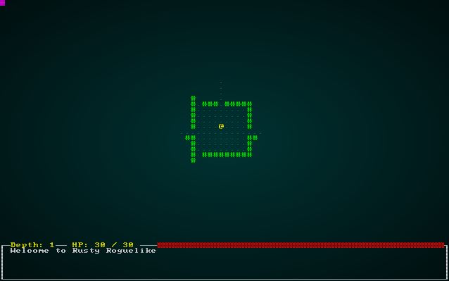
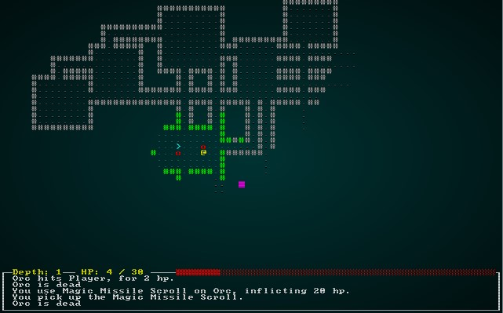
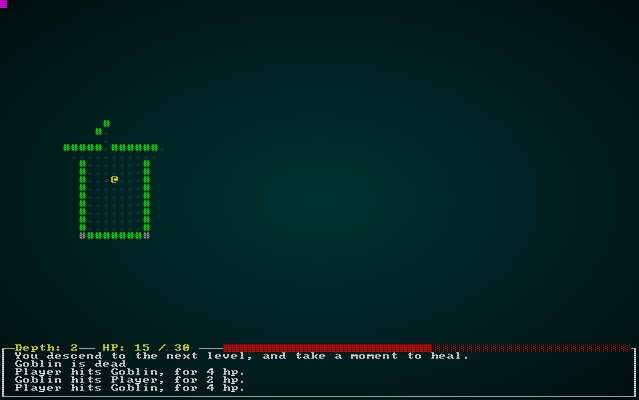

# Delving Deeper

---

***About this tutorial***

*This tutorial is free and open source, and all code uses the MIT license - so you are free to do with it as you like. My hope is that you will enjoy the tutorial, and make great games!*

*If you enjoy this and would like me to keep writing, please consider supporting [my Patreon](https://www.patreon.com/blackfuture).*

---

We have all the basics of a dungeon crawler now, but only having a single level is a big limitation! This chapter will introduce depth, with a new dungeon being spawned on each level down. We'll track the player's depth, and encourage ever-deeper exploration. What could possibly go wrong for the player?

# Indicating - and storing - depth

We'll start by adding the current depth to the map. In `map.rs`, we adjust the `Map` structure to include an integer for depth:

```rust
#[derive(Default, Serialize, Deserialize, Clone)]
pub struct Map {
    pub tiles : Vec<TileType>,
    pub rooms : Vec<Rect>,
    pub width : i32,
    pub height : i32,
    pub revealed_tiles : Vec<bool>,
    pub visible_tiles : Vec<bool>,
    pub blocked : Vec<bool>,
    pub depth : i32,

    #[serde(skip_serializing)]
    #[serde(skip_deserializing)]
    pub tile_content : Vec<Vec<Entity>>
}
```

`i32` is a primitive type, and automatically handled by `Serde` - the serialization library. So adding it here automatically adds it to our game save/load mechanism. Our map creation code also needs to indicate that we are on level 1 of the map. We want to be able to use the map generator for additional levels, so we add in a parameter also. The updated function looks like this:

```rust
pub fn new_map_rooms_and_corridors(new_depth : i32) -> Map {
    let mut map = Map{
        tiles : vec![TileType::Wall; MAPCOUNT],
        rooms : Vec::new(),
        width : MAPWIDTH as i32,
        height: MAPHEIGHT as i32,
        revealed_tiles : vec![false; MAPCOUNT],
        visible_tiles : vec![false; MAPCOUNT],
        blocked : vec![false; MAPCOUNT],
        tile_content : vec![Vec::new(); MAPCOUNT],
        depth: new_depth
    };
    ...
```

We call this from the setup code in `main.rs`, so we need to amend the call to the dungeon builder also:

```rust
let map : Map = Map::new_map_rooms_and_corridors(1);
```

That's it! Our maps now know about depth. You'll want to delete any `savegame.json` files you have lying around, since we've changed the format - loading will fail.

# Showing the player their map depth

We'll modify the player's heads-up-display to indicate the current map depth. In `gui.rs`, inside the `draw_ui` function, we add the following:

```rust
let map = ecs.fetch::<Map>();
let depth = format!("Depth: {}", map.depth);
ctx.print_color(2, 43, RGB::named(rltk::YELLOW), RGB::named(rltk::BLACK), &depth);
```

If you `cargo run` the project now, you'll see that we are showing you your current depth:



# Adding down stairs

In `map.rs`, we have an enumeration - `TileType` - that lists the available tile types. We want to add a new one: down stairs. Modify the enumeration like this:

```rust
#[derive(PartialEq, Copy, Clone, Serialize, Deserialize)]
pub enum TileType {
    Wall, Floor, DownStairs
}
```

We also want to be able to render the stairs. `map.rs` contains `draw_map`, and adding a tile type is a relatively simple task:

```rust
match tile {
    TileType::Floor => {
        glyph = rltk::to_cp437('.');
        fg = RGB::from_f32(0.0, 0.5, 0.5);
    }
    TileType::Wall => {
        glyph = rltk::to_cp437('#');
        fg = RGB::from_f32(0., 1.0, 0.);
    }
    TileType::DownStairs => {
        glyph = rltk::to_cp437('>');
        fg = RGB::from_f32(0., 1.0, 1.0);
    }
}
```

Lastly, we should place the down stairs. We place the up stairs in the center of the *first* room the map generates - so we'll place the stairs in the center of the *last* room! Going back to `new_map_rooms_and_corridors` in `map.rs`, we modify it like this:

```rust
pub fn new_map_rooms_and_corridors(new_depth : i32) -> Map {
    let mut map = Map{
        tiles : vec![TileType::Wall; MAPCOUNT],
        rooms : Vec::new(),
        width : MAPWIDTH as i32,
        height: MAPHEIGHT as i32,
        revealed_tiles : vec![false; MAPCOUNT],
        visible_tiles : vec![false; MAPCOUNT],
        blocked : vec![false; MAPCOUNT],
        tile_content : vec![Vec::new(); MAPCOUNT],
        depth: new_depth
    };

    const MAX_ROOMS : i32 = 30;
    const MIN_SIZE : i32 = 6;
    const MAX_SIZE : i32 = 10;

    let mut rng = RandomNumberGenerator::new();

    for i in 0..MAX_ROOMS {
        let w = rng.range(MIN_SIZE, MAX_SIZE);
        let h = rng.range(MIN_SIZE, MAX_SIZE);
        let x = rng.roll_dice(1, map.width - w - 1) - 1;
        let y = rng.roll_dice(1, map.height - h - 1) - 1;
        let new_room = Rect::new(x, y, w, h);
        let mut ok = true;
        for other_room in map.rooms.iter() {
            if new_room.intersect(other_room) { ok = false }
        }
        if ok {
            map.apply_room_to_map(&new_room);

            if !map.rooms.is_empty() {
                let (new_x, new_y) = new_room.center();
                let (prev_x, prev_y) = map.rooms[map.rooms.len()-1].center();
                if rng.range(0,2) == 1 {
                    map.apply_horizontal_tunnel(prev_x, new_x, prev_y);
                    map.apply_vertical_tunnel(prev_y, new_y, new_x);
                } else {
                    map.apply_vertical_tunnel(prev_y, new_y, prev_x);
                    map.apply_horizontal_tunnel(prev_x, new_x, new_y);
                }
            }

            map.rooms.push(new_room);
        }
    }

    let stairs_position = map.rooms[map.rooms.len()-1].center();
    let stairs_idx = map.xy_idx(stairs_position.0, stairs_position.1);
    map.tiles[stairs_idx] = TileType::DownStairs;

    map
}
```

If you `cargo run` the project now, and run around a bit - you can find a set of down stairs! They don't do anything yet, but they are on the map.



# Actually going down a level

In `player.rs`, we have a big `match` statement that handles user input. Lets bind going to the next level to the `period` key (on US keyboards, that's `>` without the shift). Add this to the `match`:

```rust
// Level changes
VirtualKeyCode::Period => {
    if try_next_level(&mut gs.ecs) {
        return RunState::NextLevel;
    }
}
```

Of course, now we need to implement `try_next_level`:

```rust
pub fn try_next_level(ecs: &mut World) -> bool {
    let player_pos = ecs.fetch::<Point>();
    let map = ecs.fetch::<Map>();
    let player_idx = map.xy_idx(player_pos.x, player_pos.y);
    if map.tiles[player_idx] == TileType::DownStairs {
        true
    } else {
        let mut gamelog = ecs.fetch_mut::<GameLog>();
        gamelog.entries.push("There is no way down from here.".to_string());
        false
    }
}
```

The eagle-eyed programmer will notice that we returned a new `RunState` - `NextLevel`. Since that doesn't exist yet, we'll open `main.rs` and implement it:

```rust
#[derive(PartialEq, Copy, Clone)]
pub enum RunState { AwaitingInput, 
    PreRun, 
    PlayerTurn, 
    MonsterTurn, 
    ShowInventory, 
    ShowDropItem, 
    ShowTargeting { range : i32, item : Entity},
    MainMenu { menu_selection : gui::MainMenuSelection },
    SaveGame,
    NextLevel
}
```

Your IDE is by now complaining that we haven't actually *implemented* the new `RunState`! So we go into our ever-growing state handler in `main.rs` and add:

```rust
RunState::NextLevel => {
    self.goto_next_level();                
    newrunstate = RunState::PreRun;
}
```

We'll add a new `impl` section for `State`, so we can attach methods to it. We're first going to create a helper method:

```rust
impl State {
    fn entities_to_remove_on_level_change(&mut self) -> Vec<Entity> {
        let entities = self.ecs.entities();
        let player = self.ecs.read_storage::<Player>();
        let backpack = self.ecs.read_storage::<InBackpack>();
        let player_entity = self.ecs.fetch::<Entity>();

        let mut to_delete : Vec<Entity> = Vec::new();
        for entity in entities.join() {
            let mut should_delete = true;

            // Don't delete the player
            let p = player.get(entity);
            if let Some(_p) = p {
                should_delete = false;
            }

            // Don't delete the player's equipment
            let bp = backpack.get(entity);
            if let Some(bp) = bp {
                if bp.owner == *player_entity {
                    should_delete = false;
                }
            }

            if should_delete { 
                to_delete.push(entity);
            }
        }

        to_delete
    }
}
```

When we go to the next level, we want to delete *all* the entities - *except* for the player and whatever equipment the player has. This helper function queries the ECS to obtain a list of entities for deletion. It's a bit long-winded, but relatively straightforward: we make a vector, and then iterate all entities. If the entity is the player, we mark it as `should_delete=false`. If it is in a backpack (having the `InBackpack` component), we check to see if the owner is the player - and if it is, we don't delete it.

Armed with that, we go to create the `goto_next_level` function, also inside the `State` implementation:

```rust
fn goto_next_level(&mut self) {
    // Delete entities that aren't the player or his/her equipment
    let to_delete = self.entities_to_remove_on_level_change();
    for target in to_delete {
        self.ecs.delete_entity(target).expect("Unable to delete entity");
    }

    // Build a new map and place the player
    let worldmap;
    {
        let mut worldmap_resource = self.ecs.write_resource::<Map>();
        let current_depth = worldmap_resource.depth;
        *worldmap_resource = Map::new_map_rooms_and_corridors(current_depth + 1);
        worldmap = worldmap_resource.clone();
    }

    // Spawn bad guys
    for room in worldmap.rooms.iter().skip(1) {
        spawner::spawn_room(&mut self.ecs, room);
    }

    // Place the player and update resources
    let (player_x, player_y) = worldmap.rooms[0].center();
    let mut player_position = self.ecs.write_resource::<Point>();
    *player_position = Point::new(player_x, player_y);
    let mut position_components = self.ecs.write_storage::<Position>();
    let player_entity = self.ecs.fetch::<Entity>();
    let player_pos_comp = position_components.get_mut(*player_entity);
    if let Some(player_pos_comp) = player_pos_comp {
        player_pos_comp.x = player_x;
        player_pos_comp.y = player_y;
    }

    // Mark the player's visibility as dirty
    let mut viewshed_components = self.ecs.write_storage::<Viewshed>();
    let vs = viewshed_components.get_mut(*player_entity);
    if let Some(vs) = vs {
        vs.dirty = true;
    }        

    // Notify the player and give them some health
    let mut gamelog = self.ecs.fetch_mut::<gamelog::GameLog>();
    gamelog.entries.push("You descend to the next level, and take a moment to heal.".to_string());
    let mut player_health_store = self.ecs.write_storage::<CombatStats>();
    let player_health = player_health_store.get_mut(*player_entity);
    if let Some(player_health) = player_health {
        player_health.hp = i32::max(player_health.hp, player_health.max_hp / 2);
    }
}
```

This is a long function, but does everything we need. Lets break it down step-by-step:

1. We use the helper function we just wrote to obtain a list of entities to delete, and ask the ECS to dispose of them.
2. We create a `worldmap` variable, and enter a new scope. Otherwise, we get issues with immutable vs. mutable borrowing of the ECS.
3. In this scope, we obtain a writable reference to the resource for the current `Map`. We get the current level, and replace the map with a new one - with `current_depth + 1` as the new depth. We then store a *clone* of this in the outer variable and exit the scope (avoiding any borrowing/lifetime issues).
4. Now we use the same code we used in the initial setup to spawn bad guys and items in each room.
5. Now we obtain the location of the first room, and update our resources for the player to set his/her location to the center of it. We also grab the player's `Position` component and update it.
6. We obtain the player's `Viewshed` component, since it will be out of date now that the entire map has changed around him/her! We mark it as dirty - and will let the various systems take care of the rest.
7. We give the player a log entry that they have descended to the next level.
8. We obtain the player's health component, and if their health is less than 50% - boost it to half.

If you `cargo run` the project now, you can run around and descend levels. Your depth indicator goes up - telling you that you are doing something right!



# Wrapping Up

This chapter was a bit easier than the last couple! You can now descend through an effectively infinite (it's really bounded by the size of a 32-bit integer, but good luck getting through that many levels) dungeon. We've seen how the ECS can help, and how our serialization work readily expands to include new features like this one as we add to the project.

**The source code for this chapter may be found [here](https://github.com/thebracket/rustrogueliketutorial/tree/master/chapter-12-delvingdeeper)**

[Run this chapter's example with web assembly, in your browser (WebGL2 required)](http://bfnightly.bracketproductions.com/rustbook/wasm/chapter-12-delvingdeeper/)

---

Copyright (C) 2019, Herbert Wolverson.

---