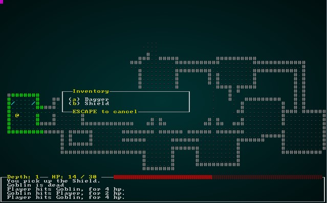
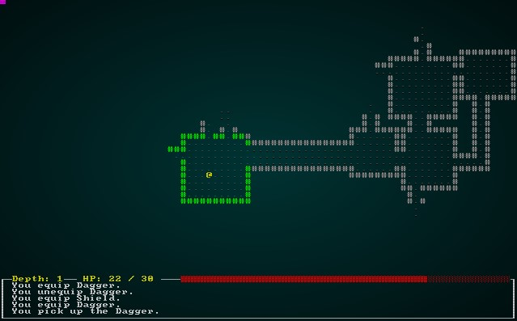

# Equipping The Player

---

***About this tutorial***

*This tutorial is free and open source, and all code uses the MIT license - so you are free to do with it as you like. My hope is that you will enjoy the tutorial, and make great games!*

*If you enjoy this and would like me to keep writing, please consider supporting [my Patreon](https://www.patreon.com/blackfuture).*

---

Now that we have a dungeon with increasing difficulty, it's time to start giving the player some ways to improve their performance! In this chapter, we'll start with the most basic of human tasks: equipping a weapon and shield.

# Adding some items you can wear/wield

We already have a lot of the item system in place, so we'll build upon the foundation from previous chapters. Just using components we already have, we can start with the following in `spawners.rs`:

```rust
fn dagger(ecs: &mut World, x: i32, y: i32) {
    ecs.create_entity()
        .with(Position{ x, y })
        .with(Renderable{
            glyph: rltk::to_cp437('/'),
            fg: RGB::named(rltk::CYAN),
            bg: RGB::named(rltk::BLACK),
            render_order: 2
        })
        .with(Name{ name : "Dagger".to_string() })
        .with(Item{})
        .marked::<SimpleMarker<SerializeMe>>()
        .build();
}

fn shield(ecs: &mut World, x: i32, y: i32) {
    ecs.create_entity()
        .with(Position{ x, y })
        .with(Renderable{
            glyph: rltk::to_cp437('('),
            fg: RGB::named(rltk::CYAN),
            bg: RGB::named(rltk::BLACK),
            render_order: 2
        })
        .with(Name{ name : "Shield".to_string() })
        .with(Item{})
        .marked::<SimpleMarker<SerializeMe>>()
        .build();
}
```

In both cases, we're making a new entity. We give it a `Position`, because it has to start somewhere on the map. We assign a `Renderable`, set to appropriate CP437/ASCII glyphs. We give them a name, and mark them as items. We can add them to the spawn table like this:

```rust
fn room_table(map_depth: i32) -> RandomTable {
    RandomTable::new()
        .add("Goblin", 10)
        .add("Orc", 1 + map_depth)
        .add("Health Potion", 7)
        .add("Fireball Scroll", 2 + map_depth)
        .add("Confusion Scroll", 2 + map_depth)
        .add("Magic Missile Scroll", 4)
        .add("Dagger", 3)
        .add("Shield", 3)
}
```

We can also include them in the system that actually spawns them quite readily:

```rust
// Actually spawn the monsters
for spawn in spawn_points.iter() {
    let x = (*spawn.0 % MAPWIDTH) as i32;
    let y = (*spawn.0 / MAPWIDTH) as i32;

    match spawn.1.as_ref() {
        "Goblin" => goblin(ecs, x, y),
        "Orc" => orc(ecs, x, y),
        "Health Potion" => health_potion(ecs, x, y),
        "Fireball Scroll" => fireball_scroll(ecs, x, y),
        "Confusion Scroll" => confusion_scroll(ecs, x, y),
        "Magic Missile Scroll" => magic_missile_scroll(ecs, x, y),
        "Dagger" => dagger(ecs, x, y),
        "Shield" => shield(ecs, x, y),
        _ => {}
    }
}
```

If you `cargo run` the project now, you can run around and eventually find a dagger or shield. You might consider raising the spawn frequency from 3 to a really big number while you test! Since we've added the `Item` tag, you can pick up and drop these items when you find them.



## Equipping The Item

Daggers and shields aren't too useful if you can't use them! So lets make them equippable.

### Equippable Component

We need a way to indicate that an item can be equipped. You've probably guessed by now, but we add a new component! In `components.rs`, we add:

```rust
#[derive(PartialEq, Copy, Clone, Serialize, Deserialize)]
pub enum EquipmentSlot { Melee, Shield }

#[derive(Component, Serialize, Deserialize, Clone)]
pub struct Equippable {
    pub slot : EquipmentSlot
}
```

We also have to remember to register it in a few places, now that we have serialization support (from chapter 11). In `main.rs`, we add it to the list of registered components:

```rust
gs.ecs.register::<Equippable>();
```

In `saveload_system.rs`, we add it to both sets of component lists:
```rust
serialize_individually!(ecs, serializer, data, Position, Renderable, Player, Viewshed, Monster, 
    Name, BlocksTile, CombatStats, SufferDamage, WantsToMelee, Item, Consumable, Ranged, InflictsDamage, 
    AreaOfEffect, Confusion, ProvidesHealing, InBackpack, WantsToPickupItem, WantsToUseItem,
    WantsToDropItem, SerializationHelper, Equippable
);
```
```rust
deserialize_individually!(ecs, de, d, Position, Renderable, Player, Viewshed, Monster, 
    Name, BlocksTile, CombatStats, SufferDamage, WantsToMelee, Item, Consumable, Ranged, InflictsDamage, 
    AreaOfEffect, Confusion, ProvidesHealing, InBackpack, WantsToPickupItem, WantsToUseItem,
    WantsToDropItem, SerializationHelper, Equippable
);
```

Finally, we should add the `Equippable` component to our `dagger` and `shield` functions in `spawner.rs`:
```rust
fn dagger(ecs: &mut World, x: i32, y: i32) {
    ecs.create_entity()
        .with(Position{ x, y })
        .with(Renderable{
            glyph: rltk::to_cp437('/'),
            fg: RGB::named(rltk::CYAN),
            bg: RGB::named(rltk::BLACK),
            render_order: 2
        })
        .with(Name{ name : "Dagger".to_string() })
        .with(Item{})
        .with(Equippable{ slot: EquipmentSlot::Melee })
        .marked::<SimpleMarker<SerializeMe>>()
        .build();
}

fn shield(ecs: &mut World, x: i32, y: i32) {
    ecs.create_entity()
        .with(Position{ x, y })
        .with(Renderable{
            glyph: rltk::to_cp437('('),
            fg: RGB::named(rltk::CYAN),
            bg: RGB::named(rltk::BLACK),
            render_order: 2
        })
        .with(Name{ name : "Shield".to_string() })
        .with(Item{})
        .with(Equippable{ slot: EquipmentSlot::Shield })
        .marked::<SimpleMarker<SerializeMe>>()
        .build();
}
```

### Making items equippable

Generally, having a shield in your backpack doesn't help much (obvious "how did you fit it in there?" questions aside - like many games, we'll gloss over that one!) - so you have to be able to pick one to equip. We'll start by making another component, `Equipped`. This works in a similar fashion to `InBackpack` - it indicates that an entity is holding it. Unlike `InBackpack`, it will indicate what slot is in use. Here's the basic `Equipped` component, in `components.rs`:

```rust
// See wrapper below for serialization
#[derive(Component)]
pub struct Equipped {
    pub owner : Entity,
    pub slot : EquipmentSlot
}
```

Just like before, we need to register it in `main.rs`, and include it in the serialization and deserialization lists in `saveload_system.rs`. Since this includes an `Entity`, we'll also have a to include wrapper/helper code to make serialization work. The wrapper is a lot like others we've written - it converts `Equipped` into a tuple for save, and back again for loading:

```rust
// Equipped wrapper
#[derive(Serialize, Deserialize, Clone)]
pub struct EquippedData<M>(M, EquipmentSlot);

impl<M: Marker + Serialize> ConvertSaveload<M> for Equipped
where
    for<'de> M: Deserialize<'de>,
{
    type Data = EquippedData<M>;
    type Error = NoError;

    fn convert_into<F>(&self, mut ids: F) -> Result<Self::Data, Self::Error>
    where
        F: FnMut(Entity) -> Option<M>,
    {
        let marker = ids(self.owner).unwrap();
        Ok(EquippedData(marker, self.slot))
    }

    fn convert_from<F>(data: Self::Data, mut ids: F) -> Result<Self, Self::Error>
    where
        F: FnMut(M) -> Option<Entity>,
    {
        let entity = ids(data.0).unwrap();
        Ok(Equipped{owner: entity, slot : data.1})
    }
}
```

### Actually equipping the item

Now we want to make it possible to actually equip the item. Doing so will automatically unequip any item in the same slot. We'll do this through the same interface we already have for using items, so we don't have disparate menus everywhere. Open `inventory_system.rs`, and we'll edit `ItemUseSystem`. We'll start by expanding the list of systems we are referencing:

```rust
impl<'a> System<'a> for ItemUseSystem {
    #[allow(clippy::type_complexity)]
    type SystemData = ( ReadExpect<'a, Entity>,
                        WriteExpect<'a, GameLog>,
                        ReadExpect<'a, Map>,
                        Entities<'a>,
                        WriteStorage<'a, WantsToUseItem>,
                        ReadStorage<'a, Name>,
                        ReadStorage<'a, Consumable>,
                        ReadStorage<'a, ProvidesHealing>,
                        ReadStorage<'a, InflictsDamage>,
                        WriteStorage<'a, CombatStats>,
                        WriteStorage<'a, SufferDamage>,
                        ReadStorage<'a, AreaOfEffect>,
                        WriteStorage<'a, Confusion>,
                        ReadStorage<'a, Equippable>,
                        WriteStorage<'a, Equipped>,
                        WriteStorage<'a, InBackpack>
                      );

    fn run(&mut self, data : Self::SystemData) {
        let (player_entity, mut gamelog, map, entities, mut wants_use, names, 
            consumables, healing, inflict_damage, mut combat_stats, mut suffer_damage, 
            aoe, mut confused, equippable, mut equipped, mut backpack) = data;
```

Now, after target acquisition, add the following block:

```rust
// If it is equippable, then we want to equip it - and unequip whatever else was in that slot
let item_equippable = equippable.get(useitem.item);
match item_equippable {
    None => {}
    Some(can_equip) => {
        let target_slot = can_equip.slot;
        let target = targets[0];

        // Remove any items the target has in the item's slot
        let mut to_unequip : Vec<Entity> = Vec::new();
        for (item_entity, already_equipped, name) in (&entities, &equipped, &names).join() {
            if already_equipped.owner == target && already_equipped.slot == target_slot {
                to_unequip.push(item_entity);
                if target == *player_entity {
                    gamelog.entries.insert(0, format!("You unequip {}.", name.name));
                }
            }
        }
        for item in to_unequip.iter() {
            equipped.remove(*item);
            backpack.insert(*item, InBackpack{ owner: target }).expect("Unable to insert backpack entry");
        }

        // Wield the item
        equipped.insert(useitem.item, Equipped{ owner: target, slot: target_slot }).expect("Unable to insert equipped component");
        backpack.remove(useitem.item);
        if target == *player_entity {
            gamelog.entries.insert(0, format!("You equip {}.", names.get(useitem.item).unwrap().name));
        }
    }
}
```

This starts by matching to see if we *can* equip the item. If we can, it looks up the target slot for the item and looks to see if there is already an item in that slot. If there, it moves it to the backpack. Lastly, it adds an `Equipped` component to the item entity with the owner (the player right now) and the appropriate slot.

Lastly, you may remember that when the player moves to the next level we delete a lot of entities. We want to include `Equipped` by the player as a reason to keep an item in the ECS. In `main.rs`, we modify `entities_to_remove_on_level_change` as follows:

```rust
fn entities_to_remove_on_level_change(&mut self) -> Vec<Entity> {
    let entities = self.ecs.entities();
    let player = self.ecs.read_storage::<Player>();
    let backpack = self.ecs.read_storage::<InBackpack>();
    let player_entity = self.ecs.fetch::<Entity>();
    let equipped = self.ecs.read_storage::<Equipped>();

    let mut to_delete : Vec<Entity> = Vec::new();
    for entity in entities.join() {
        let mut should_delete = true;

        // Don't delete the player
        let p = player.get(entity);
        if let Some(_p) = p {
            should_delete = false;
        }

        // Don't delete the player's equipment
        let bp = backpack.get(entity);
        if let Some(bp) = bp {
            if bp.owner == *player_entity {
                should_delete = false;
            }
        }

        let eq = equipped.get(entity);
        if let Some(eq) = eq {
            if eq.owner == *player_entity {
                should_delete = false;
            }
        }

        if should_delete { 
            to_delete.push(entity);
        }
    }

    to_delete
}
```

If you `cargo run` the project now, you can run around picking up the new items - and you can equip them. They don't *do* anything, yet - but at least you can swap them in and out. The game log will show equipping and unequipping.



### Granting combat bonuses

Logically, a shield should provide some protection against incoming damage - and being stabbed with a dagger should hurt more than being punched! To facilitate this, we'll add some more components (this should be a familiar song by now). In `components.rs`:

```rust
#[derive(Component, Serialize, Deserialize, Clone)]
pub struct MeleePowerBonus {
    pub power : i32
}

#[derive(Component, Serialize, Deserialize, Clone)]
pub struct DefenseBonus {
    pub defense : i32
}
```

We also need to remember to register them in `main.rs`, and `saveload_system.rs`. We can then modify our code in `spawner.rs` to add these components to the right items:

```rust
fn dagger(ecs: &mut World, x: i32, y: i32) {
    ecs.create_entity()
        .with(Position{ x, y })
        .with(Renderable{
            glyph: rltk::to_cp437('/'),
            fg: RGB::named(rltk::CYAN),
            bg: RGB::named(rltk::BLACK),
            render_order: 2
        })
        .with(Name{ name : "Dagger".to_string() })
        .with(Item{})
        .with(Equippable{ slot: EquipmentSlot::Melee })
        .with(MeleePowerBonus{ power: 2 })
        .marked::<SimpleMarker<SerializeMe>>()
        .build();
}

fn shield(ecs: &mut World, x: i32, y: i32) {
    ecs.create_entity()
        .with(Position{ x, y })
        .with(Renderable{
            glyph: rltk::to_cp437('('),
            fg: RGB::named(rltk::CYAN),
            bg: RGB::named(rltk::BLACK),
            render_order: 2
        })
        .with(Name{ name : "Shield".to_string() })
        .with(Item{})
        .with(Equippable{ slot: EquipmentSlot::Shield })
        .with(DefenseBonus{ defense: 1 })
        .marked::<SimpleMarker<SerializeMe>>()
        .build();
}
```

Notice how we've added the component to each? Now we need to modify the `melee_combat_system` to apply these bonuses. We do this by adding some additional ECS queries to our system:

```rust
impl<'a> System<'a> for MeleeCombatSystem {
    #[allow(clippy::type_complexity)]
    type SystemData = ( Entities<'a>,
                        WriteExpect<'a, GameLog>,
                        WriteStorage<'a, WantsToMelee>,
                        ReadStorage<'a, Name>,
                        ReadStorage<'a, CombatStats>,
                        WriteStorage<'a, SufferDamage>,
                        ReadStorage<'a, MeleePowerBonus>,
                        ReadStorage<'a, DefenseBonus>,
                        ReadStorage<'a, Equipped>
                      );

    fn run(&mut self, data : Self::SystemData) {
        let (entities, mut log, mut wants_melee, names, combat_stats, mut inflict_damage, melee_power_bonuses, defense_bonuses, equipped) = data;

        for (entity, wants_melee, name, stats) in (&entities, &wants_melee, &names, &combat_stats).join() {
            if stats.hp > 0 {
                let mut offensive_bonus = 0;
                for (_item_entity, power_bonus, equipped_by) in (&entities, &melee_power_bonuses, &equipped).join() {
                    if equipped_by.owner == entity {
                        offensive_bonus += power_bonus.power;
                    }
                }

                let target_stats = combat_stats.get(wants_melee.target).unwrap();
                if target_stats.hp > 0 {
                    let target_name = names.get(wants_melee.target).unwrap();

                    let mut defensive_bonus = 0;
                    for (_item_entity, defense_bonus, equipped_by) in (&entities, &defense_bonuses, &equipped).join() {
                        if equipped_by.owner == wants_melee.target {
                            defensive_bonus += defense_bonus.defense;
                        }
                    }

                    let damage = i32::max(0, (stats.power + offensive_bonus) - (target_stats.defense + defensive_bonus));
```

This is a big chunk of code, so lets go through it:

1. We've added `MeleePowerBonus`, `DefenseBonus` and `Equipped` readers to the system.
2. Once we've determined that the attacker is alive, we set `offensive_bonus` to 0.
3. We iterate all entities that have a `MeleePowerBonus` and an `Equipped` entry. If they are equipped by the attacker, we add their power bonus to `offensive_bonus`.
4. Once we've determined that the defender is alive, we set `defensive_bonus` to 0.
5. We iterate all entities that have a `DefenseBonus` and an `Equipped` entry. If they are equipped by the target, we add their defense to the `defense_bonus`.
6. When we calculate damage, we add the offense bonus to the power side - and add the defense bonus to the defense side.

If you `cargo run` now, you'll find that using your dagger makes you hit harder - and using your shield makes you suffer less damage.

### Unequipping the item

Now that you can equip items, and remove the by swapping, you may want to stop holding an item and return it to your backpack. In a game as simple as this one, this isn't *strictly* necessary - but it is a good option to have for the future. We'll bind the `R` key to *remove* an item, since that key is available. In `player.rs`, add this to the input code:

```rust
VirtualKeyCode::R => return RunState::ShowRemoveItem,
```

Now we add `ShowRemoveItem` to `RunState` in `main.rs`:

```rust
#[derive(PartialEq, Copy, Clone)]
pub enum RunState { AwaitingInput, 
    PreRun, 
    PlayerTurn, 
    MonsterTurn, 
    ShowInventory, 
    ShowDropItem, 
    ShowTargeting { range : i32, item : Entity},
    MainMenu { menu_selection : gui::MainMenuSelection },
    SaveGame,
    NextLevel,
    ShowRemoveItem
}
```

And we add a handler for it in `tick`:

```rust
RunState::ShowRemoveItem => {
    let result = gui::remove_item_menu(self, ctx);
    match result.0 {
        gui::ItemMenuResult::Cancel => newrunstate = RunState::AwaitingInput,
        gui::ItemMenuResult::NoResponse => {}
        gui::ItemMenuResult::Selected => {
            let item_entity = result.1.unwrap();
            let mut intent = self.ecs.write_storage::<WantsToRemoveItem>();
            intent.insert(*self.ecs.fetch::<Entity>(), WantsToRemoveItem{ item: item_entity }).expect("Unable to insert intent");
            newrunstate = RunState::PlayerTurn;
        }
    }
}
```

We'll implement a new component in `components.rs` (see the source code for the serialization handler; it's a cut-and-paste of the handler for wanting to drop an item, with the names changed):

```rust
#[derive(Component, Debug)]
pub struct WantsToRemoveItem {
    pub item : Entity
}
```

As usual, it has to be registered in `main.rs` and `saveload_system.rs`.

Now in `gui.rs`, we'll implement `remove_item_menu`. It's almost exactly the same as the item dropping menu, but changing what is queries and the heading (it'd be a great idea to make these into more generic functions some time!):

```rust
pub fn remove_item_menu(gs : &mut State, ctx : &mut Rltk) -> (ItemMenuResult, Option<Entity>) {
    let player_entity = gs.ecs.fetch::<Entity>();
    let names = gs.ecs.read_storage::<Name>();
    let backpack = gs.ecs.read_storage::<Equipped>();
    let entities = gs.ecs.entities();

    let inventory = (&backpack, &names).join().filter(|item| item.0.owner == *player_entity );
    let count = inventory.count();

    let mut y = (25 - (count / 2)) as i32;
    ctx.draw_box(15, y-2, 31, (count+3) as i32, RGB::named(rltk::WHITE), RGB::named(rltk::BLACK));
    ctx.print_color(18, y-2, RGB::named(rltk::YELLOW), RGB::named(rltk::BLACK), "Remove Which Item?");
    ctx.print_color(18, y+count as i32+1, RGB::named(rltk::YELLOW), RGB::named(rltk::BLACK), "ESCAPE to cancel");

    let mut equippable : Vec<Entity> = Vec::new();
    let mut j = 0;
    for (entity, _pack, name) in (&entities, &backpack, &names).join().filter(|item| item.1.owner == *player_entity ) {
        ctx.set(17, y, RGB::named(rltk::WHITE), RGB::named(rltk::BLACK), rltk::to_cp437('('));
        ctx.set(18, y, RGB::named(rltk::YELLOW), RGB::named(rltk::BLACK), 97+j as u8);
        ctx.set(19, y, RGB::named(rltk::WHITE), RGB::named(rltk::BLACK), rltk::to_cp437(')'));

        ctx.print(21, y, &name.name.to_string());
        equippable.push(entity);
        y += 1;
        j += 1;
    }

    match ctx.key {
        None => (ItemMenuResult::NoResponse, None),
        Some(key) => {
            match key {
                VirtualKeyCode::Escape => { (ItemMenuResult::Cancel, None) }
                _ => { 
                    let selection = rltk::letter_to_option(key);
                    if selection > -1 && selection < count as i32 {
                        return (ItemMenuResult::Selected, Some(equippable[selection as usize]));
                    }  
                    (ItemMenuResult::NoResponse, None)
                }
            }
        }
    }
}
```

Next, we should extend `inventory_system.rs` to support removing items. Fortunately, this is a very simple system:

```rust
pub struct ItemRemoveSystem {}

impl<'a> System<'a> for ItemRemoveSystem {
    #[allow(clippy::type_complexity)]
    type SystemData = ( 
                        Entities<'a>,
                        WriteStorage<'a, WantsToRemoveItem>,
                        WriteStorage<'a, Equipped>,
                        WriteStorage<'a, InBackpack>
                      );

    fn run(&mut self, data : Self::SystemData) {
        let (entities, mut wants_remove, mut equipped, mut backpack) = data;

        for (entity, to_remove) in (&entities, &wants_remove).join() {
            equipped.remove(to_remove.item);
            backpack.insert(to_remove.item, InBackpack{ owner: entity }).expect("Unable to insert backpack");
        }

        wants_remove.clear();
    }
}
```

Lastly, we add it to the systems in `main.rs`:

```rust
let mut gs = State {
    ecs: World::new(),
    systems : DispatcherBuilder::new()
        .with(MapIndexingSystem{}, "map_indexing_system", &[])
        .with(VisibilitySystem{}, "visibility_system", &[])
        .with(MonsterAI{}, "monster_ai", &["visibility_system", "map_indexing_system"])
        .with(MeleeCombatSystem{}, "melee_combat", &["monster_ai"])
        .with(DamageSystem{}, "damage", &["melee_combat"])
        .with(ItemCollectionSystem{}, "pickup", &["melee_combat"])
        .with(ItemUseSystem{}, "potions", &["melee_combat"])
        .with(ItemDropSystem{}, "drop_items", &["melee_combat"])
        .with(ItemRemoveSystem{}, "remove_items", &["melee_combat"])
        .build(),
};
```

Now if you `cargo run`, you can pick up a dagger or shield and equip it. Then you can press `R` to remove it.


The death screen
We're done!

**The source code for this chapter may be found [here](https://github.com/thebracket/rustrogueliketutorial/tree/master/chapter-14-gear)**

---

Copyright (C) 2019, Herbert Wolverson.

---