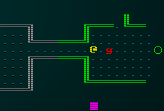
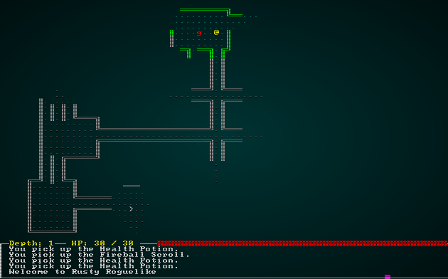
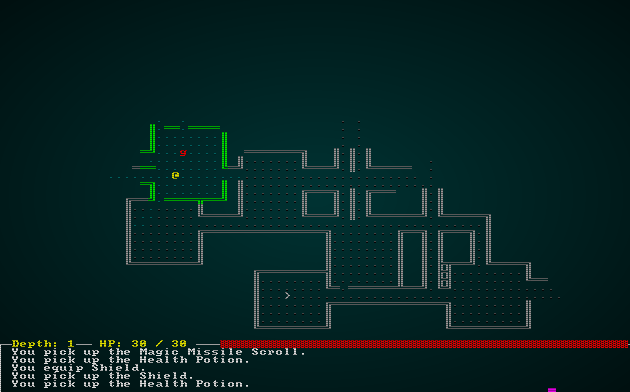

# Particle Effects in ASCII

---

***About this tutorial***

*This tutorial is free and open source, and all code uses the MIT license - so you are free to do with it as you like. My hope is that you will enjoy the tutorial, and make great games!*

*If you enjoy this and would like me to keep writing, please consider supporting [my Patreon](https://www.patreon.com/blackfuture).*

---

There's no real visual feedback for your actions - you hit something, and it either goes away, or it doesn't. Bloodstains give a good impression of what *previously* happened in a location - but it would be nice to give some sort of instant reaction to your actions. These need to be fast, non-blocking (so you don't have to wait for the animation to finish to keep playing), and not too intrusive. Particles are a good fit for this, so we'll implement a simple ASCII/CP437 particle system.

## Particle component

As usual, we'll start out by thinking about what a particle *is*. Typically it has a position, something to render, and a lifetime (so it goes away). We've already written two out of three of those, so lets go ahead and create a `ParticleLifetime` component. In `components.rs`:

```rust
#[derive(Component, Serialize, Deserialize, Clone)]
pub struct ParticleLifetime {
    pub lifetime_ms : f32
}
```

We have to register this in all the usual places: `main.rs` and `saveload_system.rs` (twice).

## Grouping particle code together

We'll make a new file, `particle_system.rs`. It won't be a regular system, because we need access to the RLTK `Context` object - but it will have to provide services to other systems.

The first thing to support is making particles vanish after their lifetime. So we start with the following in `particle_system.rs`:

```rust
use specs::prelude::*;
use super::{ Rltk, ParticleLifetime};

pub fn cull_dead_particles(ecs : &mut World, ctx : &Rltk) {
    let mut dead_particles : Vec<Entity> = Vec::new();
    {
        // Age out particles
        let mut particles = ecs.write_storage::<ParticleLifetime>();
        let entities = ecs.entities();
        for (entity, mut particle) in (&entities, &mut particles).join() {
            particle.lifetime_ms -= ctx.frame_time_ms;
            if particle.lifetime_ms < 0.0 {
                dead_particles.push(entity);
            }
        }                    
    }
    for dead in dead_particles.iter() {
        ecs.delete_entity(*dead).expect("Particle will not die");
    } 
}
```

Then we modify the render loop in `main.rs` to call it:

```rust
ctx.cls();        
particle_system::cull_dead_particles(&mut self.ecs, ctx);
```

## Spawning particles via a service

Let's extend `particle_system.rs` to offer a builder system: you obtain a `ParticleBuilder` and add requests to it, and then create your particles as a batch together. We'll offer the particle system as a *resource* - so it's available anywhere. This avoids having to add much intrusive code into each system, and lets us handle the actual particle spawning as a single (fast) batch.

Our basic `ParticleBuilder` looks like this. We haven't done anything to actually *add* any particles yet, but this provides the requestor service:

```rust
struct ParticleRequest {
    x: i32,
    y: i32,
    fg: RGB,
    bg: RGB,
    glyph: u8,
    lifetime: f32
}

pub struct ParticleBuilder {
    requests : Vec<ParticleRequest>
}

impl ParticleBuilder {
    #[allow(clippy::new_without_default)]
    pub fn new() -> ParticleBuilder {
        ParticleBuilder{ requests : Vec::new() }
    }

    pub fn request(&mut self, x:i32, y:i32, fg: RGB, bg:RGB, glyph: u8, lifetime: f32) {
        self.requests.push(
            ParticleRequest{
                x, y, fg, bg, glyph, lifetime
            }
        );
    }
}
```

In `main.rs`, we'll turn it into a *resource*:

```rust
gs.ecs.insert(particle_system::ParticleBuilder::new());
```

Now, we'll return to `particle_system.rs` and build an actual system to spawn particles. The system looks like this:

```rust
pub struct ParticleSpawnSystem {}

impl<'a> System<'a> for ParticleSpawnSystem {
    #[allow(clippy::type_complexity)]
    type SystemData = ( 
                        Entities<'a>,
                        WriteStorage<'a, Position>,
                        WriteStorage<'a, Renderable>,
                        WriteStorage<'a, ParticleLifetime>,
                        WriteExpect<'a, ParticleBuilder>
                      );

    fn run(&mut self, data : Self::SystemData) {
        let (entities, mut positions, mut renderables, mut particles, mut particle_builder) = data;
        for new_particle in particle_builder.requests.iter() {
            let p = entities.create();
            positions.insert(p, Position{ x: new_particle.x, y: new_particle.y }).expect("Unable to inser position");
            renderables.insert(p, Renderable{ fg: new_particle.fg, bg: new_particle.bg, glyph: new_particle.glyph, render_order: 0 }).expect("Unable to insert renderable");
            particles.insert(p, ParticleLifetime{ lifetime_ms: new_particle.lifetime }).expect("Unable to insert lifetime");
        }

        particle_builder.requests.clear();
    }
}
```

This is a very simple service: it iterates the requests, and creates an entity for each particle with the component parameters from the request. Then it clears the builder list. The last step is to add it to the system schedule in `main.rs`:

```rust
impl State {
    fn run_systems(&mut self) {
        let mut vis = VisibilitySystem{};
        vis.run_now(&self.ecs);
        let mut mob = MonsterAI{};
        mob.run_now(&self.ecs);
        let mut mapindex = MapIndexingSystem{};
        mapindex.run_now(&self.ecs);
        let mut melee = MeleeCombatSystem{};
        melee.run_now(&self.ecs);
        let mut damage = DamageSystem{};
        damage.run_now(&self.ecs);
        let mut pickup = ItemCollectionSystem{};
        pickup.run_now(&self.ecs);
        let mut itemuse = ItemUseSystem{};
        itemuse.run_now(&self.ecs);
        let mut drop_items = ItemDropSystem{};
        drop_items.run_now(&self.ecs);
        let mut item_remove = ItemRemoveSystem{};
        item_remove.run_now(&self.ecs);
        let mut particles = particle_system::ParticleSpawnSystem{};
        particles.run_now(&self.ecs);

        self.ecs.maintain();
    }
}
```

We've made it depend upon likely particle spawners. We'll have to be a little careful to avoid accidentally making it concurrent with anything that might add to it.

## Actually spawning some particles for combat

Lets start by spawning a particle whenever someone attacks. Open up `melee_combat_system.rs`, and we'll add `ParticleBuilder` to the list of requested resources for the system. First, the includes:

```rust
use super::{CombatStats, WantsToMelee, Name, SufferDamage, gamelog::GameLog, MeleePowerBonus, DefenseBonus, Equipped,
    particle_system::ParticleBuilder, Position};
```

Then, a `WriteExpect` to be able to write to the resource:

```rust
type SystemData = ( Entities<'a>,
    WriteExpect<'a, GameLog>,
    WriteStorage<'a, WantsToMelee>,
    ReadStorage<'a, Name>,
    ReadStorage<'a, CombatStats>,
    WriteStorage<'a, SufferDamage>,
    ReadStorage<'a, MeleePowerBonus>,
    ReadStorage<'a, DefenseBonus>,
    ReadStorage<'a, Equipped>,
    WriteExpect<'a, ParticleBuilder>,
    ReadStorage<'a, Position>
);
```

And the expanded list of resources for the `run` method itself:
```rust
let (entities, mut log, mut wants_melee, names, combat_stats, mut inflict_damage, 
    melee_power_bonuses, defense_bonuses, equipped, mut particle_builder, positions) = data;
```

Finally, we'll add the request:

```rust
let pos = positions.get(wants_melee.target);
if let Some(pos) = pos {
    particle_builder.request(pos.x, pos.y, rltk::RGB::named(rltk::ORANGE), rltk::RGB::named(rltk::BLACK), rltk::to_cp437('‼'), 200.0);
}

let damage = i32::max(0, (stats.power + offensive_bonus) - (target_stats.defense + defensive_bonus));
```

If you `cargo run` now, you'll see a relatively subtle particle feedback to show that melee combat occurred. This definitely helps with the *feel* of gameplay, and is sufficiently non-intrusive that we aren't making our other systems too confusing.



## Adding effects to item use

It would be great to add similar effects to item use, so lets do it! In `inventory_system.rs`, we'll expand the `ItemUseSystem` introduction to include the `ParticleBuilder`:

```rust
impl<'a> System<'a> for ItemUseSystem {
    #[allow(clippy::type_complexity)]
    type SystemData = ( ReadExpect<'a, Entity>,
                        WriteExpect<'a, GameLog>,
                        ReadExpect<'a, Map>,
                        Entities<'a>,
                        WriteStorage<'a, WantsToUseItem>,
                        ReadStorage<'a, Name>,
                        ReadStorage<'a, Consumable>,
                        ReadStorage<'a, ProvidesHealing>,
                        ReadStorage<'a, InflictsDamage>,
                        WriteStorage<'a, CombatStats>,
                        WriteStorage<'a, SufferDamage>,
                        ReadStorage<'a, AreaOfEffect>,
                        WriteStorage<'a, Confusion>,
                        ReadStorage<'a, Equippable>,
                        WriteStorage<'a, Equipped>,
                        WriteStorage<'a, InBackpack>,
                        WriteExpect<'a, ParticleBuilder>,
                        ReadStorage<'a, Position>
                      );

    #[allow(clippy::cognitive_complexity)]
    fn run(&mut self, data : Self::SystemData) {
        let (player_entity, mut gamelog, map, entities, mut wants_use, names, 
            consumables, healing, inflict_damage, mut combat_stats, mut suffer_damage, 
            aoe, mut confused, equippable, mut equipped, mut backpack, mut particle_builder, positions) = data;
```

We'll start by showing a heart when you drink a healing potion. In the *healing* section:
```rust
stats.hp = i32::min(stats.max_hp, stats.hp + healer.heal_amount);
if entity == *player_entity {
    gamelog.entries.insert(0, format!("You use the {}, healing {} hp.", names.get(useitem.item).unwrap().name, healer.heal_amount));
}
used_item = true;

let pos = positions.get(*target);
if let Some(pos) = pos {
    particle_builder.request(pos.x, pos.y, rltk::RGB::named(rltk::GREEN), rltk::RGB::named(rltk::BLACK), rltk::to_cp437('♥'), 200.0);
}
```

We can use a similar effect for confusion - only with a magenta question mark. In the *confusion* section:
```rust
gamelog.entries.insert(0, format!("You use {} on {}, confusing them.", item_name.name, mob_name.name));

let pos = positions.get(*mob);
if let Some(pos) = pos {
    particle_builder.request(pos.x, pos.y, rltk::RGB::named(rltk::MAGENTA), rltk::RGB::named(rltk::BLACK), rltk::to_cp437('?'), 200.0);
}
```

We should also use a particle to indicate that damage was inflicted. In the *damage* section of the system:

```rust
gamelog.entries.insert(0, format!("You use {} on {}, inflicting {} hp.", item_name.name, mob_name.name, damage.damage));

let pos = positions.get(*mob);
if let Some(pos) = pos {
    particle_builder.request(pos.x, pos.y, rltk::RGB::named(rltk::RED), rltk::RGB::named(rltk::BLACK), rltk::to_cp437('‼'), 200.0);
}
```

Lastly, if an effect hits a whole area (for example, a fireball) it would be good to indicate what the area is. In the *targeting* section of the system, add:

```rust
for mob in map.tile_content[idx].iter() {
    targets.push(*mob);
}
particle_builder.request(tile_idx.x, tile_idx.y, rltk::RGB::named(rltk::ORANGE), rltk::RGB::named(rltk::BLACK), rltk::to_cp437('░'), 200.0);
```

That wasn't too hard, was it? If you `cargo run` your project now, you'll see various visual effects firing.



## Adding an indicator for missing a turn due to confusion

Lastly, we'll repeat the confused effect on monsters when it is their turn and they skip due to being confused. This should make it less confusing as to why they stand around. In `monster_ai_system.rs`, we first modify the system header to request the appropriate helper:

```rust
impl<'a> System<'a> for MonsterAI {
    #[allow(clippy::type_complexity)]
    type SystemData = ( WriteExpect<'a, Map>,
                        ReadExpect<'a, Point>,
                        ReadExpect<'a, Entity>,
                        ReadExpect<'a, RunState>,
                        Entities<'a>,
                        WriteStorage<'a, Viewshed>, 
                        ReadStorage<'a, Monster>,
                        WriteStorage<'a, Position>,
                        WriteStorage<'a, WantsToMelee>,
                        WriteStorage<'a, Confusion>,
                        WriteExpect<'a, ParticleBuilder>);

    fn run(&mut self, data : Self::SystemData) {
        let (mut map, player_pos, player_entity, runstate, entities, mut viewshed, 
            monster, mut position, mut wants_to_melee, mut confused, mut particle_builder) = data;
```

Then we add in a request at the end of the confusion test:

```rust
can_act = false;

particle_builder.request(pos.x, pos.y, rltk::RGB::named(rltk::MAGENTA), 
                    rltk::RGB::named(rltk::BLACK), rltk::to_cp437('?'), 200.0);
```

We don't need to worry about getting the `Position` component here, because we already get it as part of the loop. If you `cargo run` your project now, and find a confusion scroll - you have visual feedback as to why a goblin isn't chasing you anymore:



## Wrap Up

That's it for visual effects for now. We've given the game a much more visceral feel, with feedback given for actions. That's a big improvement, and goes a long way to modernizing an ASCII interface!


**The source code for this chapter may be found [here](https://github.com/thebracket/rustrogueliketutorial/tree/master/chapter-18-particles)**

[Run this chapter's example with web assembly, in your browser (WebGL2 required)](http://bfnightly.bracketproductions.com/rustbook/wasm/chapter-18-particles/)

---

Copyright (C) 2019, Herbert Wolverson.

---
