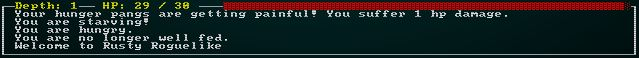
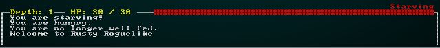
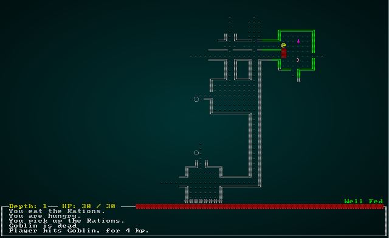

# Adding a hunger clock and food

---

***About this tutorial***

*This tutorial is free and open source, and all code uses the MIT license - so you are free to do with it as you like. My hope is that you will enjoy the tutorial, and make great games!*

*If you enjoy this and would like me to keep writing, please consider supporting [my Patreon](https://www.patreon.com/blackfuture).*

---

Hunger clocks are a controversial feature of a lot of roguelikes. They can really irritate the player if you are spending all of your time looking for food, but they also drive you forward - so you can't sit around without exploring more. Resting to heal becomes more of a risk/reward system, in particular. This chapter will implement a basic hunger clock for the player.

## Adding a hunger clock component

We'll be adding a hunger clock to the player, so the first step is to make a component to represent it. In `components.rs`:

```rust
#[derive(Serialize, Deserialize, Copy, Clone, PartialEq)]
pub enum HungerState { WellFed, Normal, Hungry, Starving }

#[derive(Component, Serialize, Deserialize, Clone)]
pub struct HungerClock {
    pub state : HungerState,
    pub duration : i32
}
```

As with all components, it needs to be registered in `main.rs` and `saveload_system.rs`. In `spawners.rs`, we'll extend the `player` function to add a hunger clock to the player:

```rust
pub fn player(ecs : &mut World, player_x : i32, player_y : i32) -> Entity {
    ecs
        .create_entity()
        .with(Position { x: player_x, y: player_y })
        .with(Renderable {
            glyph: rltk::to_cp437('@'),
            fg: RGB::named(rltk::YELLOW),
            bg: RGB::named(rltk::BLACK),
            render_order: 0
        })
        .with(Player{})
        .with(Viewshed{ visible_tiles : Vec::new(), range: 8, dirty: true })
        .with(Name{name: "Player".to_string() })
        .with(CombatStats{ max_hp: 30, hp: 30, defense: 2, power: 5 })
        .with(HungerClock{ state: HungerState::WellFed, duration: 20 })
        .marked::<SimpleMarker<SerializeMe>>()
        .build()
}
```

There's now a hunger clock component in place, but it doesn't *do* anything!

## Adding a hunger system

We'll make a new file, `hunger_system.rs` and implement a hunger clock system. It's quite straightforward:

```rust
use specs::prelude::*;
use super::{HungerClock, RunState, HungerState, SufferDamage, gamelog::GameLog};

pub struct HungerSystem {}

impl<'a> System<'a> for HungerSystem {
    #[allow(clippy::type_complexity)]
    type SystemData = ( 
                        Entities<'a>,
                        WriteStorage<'a, HungerClock>,
                        ReadExpect<'a, Entity>, // The player
                        ReadExpect<'a, RunState>,
                        WriteStorage<'a, SufferDamage>,
                        WriteExpect<'a, GameLog>
                      );

    fn run(&mut self, data : Self::SystemData) {
        let (entities, mut hunger_clock, player_entity, runstate, mut inflict_damage, mut log) = data;

        for (entity, mut clock) in (&entities, &mut hunger_clock).join() {
            let mut proceed = false;

            match *runstate {
                RunState::PlayerTurn => {
                    if entity == *player_entity {
                        proceed = true;
                    }
                }
                RunState::MonsterTurn => {
                    if entity != *player_entity {
                        proceed = true;
                    }
                }
                _ => proceed = false
            }

            if proceed {
                clock.duration -= 1;
                if clock.duration < 1 {
                    match clock.state {
                        HungerState::WellFed => {
                            clock.state = HungerState::Normal;
                            clock.duration = 200;
                            if entity == *player_entity {
                                log.entries.insert(0, "You are no longer well fed.".to_string());
                            }
                        }
                        HungerState::Normal => {
                            clock.state = HungerState::Hungry;
                            clock.duration = 200;
                            if entity == *player_entity {
                                log.entries.insert(0, "You are hungry.".to_string());
                            }
                        }
                        HungerState::Hungry => {
                            clock.state = HungerState::Starving;
                            clock.duration = 200;
                            if entity == *player_entity {
                                log.entries.insert(0, "You are starving!".to_string());
                            }
                        }
                        HungerState::Starving => {
                            // Inflict damage from hunger
                            if entity == *player_entity {
                                log.entries.insert(0, "Your hunger pangs are getting painful! You suffer 1 hp damage.".to_string());
                            }
                            inflict_damage.insert(entity, SufferDamage{ amount: 1 }).expect("Unable to do damage");  
                        }
                    }
                }
            }
        }
    }
}
```

It works by iterating all entities that have a `HungerClock`. If they are the player, it only takes effect in the `PlayerTurn` state; likewise, if they are a monster, it only takes place in their turn (in case we want hungry monsters later!). The duration of the current state is reduced on each run-through. If it hits 0, it moves one state down - or if you are starving, damages you.

Now we need to add it to the list of systems running in `main.rs`:

```rust
impl State {
    fn run_systems(&mut self) {
        let mut mapindex = MapIndexingSystem{};
        mapindex.run_now(&self.ecs);
        let mut vis = VisibilitySystem{};
        vis.run_now(&self.ecs);
        let mut mob = MonsterAI{};
        mob.run_now(&self.ecs);
        let mut melee = MeleeCombatSystem{};
        melee.run_now(&self.ecs);
        let mut damage = DamageSystem{};
        damage.run_now(&self.ecs);
        let mut pickup = ItemCollectionSystem{};
        pickup.run_now(&self.ecs);
        let mut itemuse = ItemUseSystem{};
        itemuse.run_now(&self.ecs);
        let mut drop_items = ItemDropSystem{};
        drop_items.run_now(&self.ecs);
        let mut item_remove = ItemRemoveSystem{};
        item_remove.run_now(&self.ecs);
        let mut hunger = hunger_system::HungerSystem{};
        hunger.run_now(&self.ecs);
        let mut particles = particle_system::ParticleSpawnSystem{};
        particles.run_now(&self.ecs);

        self.ecs.maintain();
    }
}
```

If you `cargo run` now, and hit wait a *lot* - you'll starve to death.



## Displaying the status

It would be nice to *know* your hunger state! We'll modify `draw_ui` in `gui.rs` to show it:

```rust
pub fn draw_ui(ecs: &World, ctx : &mut Rltk) {
    ctx.draw_box(0, 43, 79, 6, RGB::named(rltk::WHITE), RGB::named(rltk::BLACK));

    let combat_stats = ecs.read_storage::<CombatStats>();
    let players = ecs.read_storage::<Player>();
    let hunger = ecs.read_storage::<HungerClock>();
    for (_player, stats, hc) in (&players, &combat_stats, &hunger).join() {
        let health = format!(" HP: {} / {} ", stats.hp, stats.max_hp);
        ctx.print_color(12, 43, RGB::named(rltk::YELLOW), RGB::named(rltk::BLACK), &health);

        ctx.draw_bar_horizontal(28, 43, 51, stats.hp, stats.max_hp, RGB::named(rltk::RED), RGB::named(rltk::BLACK));

        match hc.state {
            HungerState::WellFed => ctx.print_color(71, 42, RGB::named(rltk::GREEN), RGB::named(rltk::BLACK), "Well Fed"),
            HungerState::Normal => {}
            HungerState::Hungry => ctx.print_color(71, 42, RGB::named(rltk::ORANGE), RGB::named(rltk::BLACK), "Hungry"),
            HungerState::Starving => ctx.print_color(71, 42, RGB::named(rltk::RED), RGB::named(rltk::BLACK), "Starving"),
        }
    }
    ...
```

If you `cargo run` your project, this gives quite a pleasant display:


## Adding in food

It's all well and good starving to death, but players will find it frustrating if they always start do die after 620 turns (and suffer consequences before that! 620 may sound like a lot, but it's common to use a few hundred moves on a level, and we aren't trying to make food the primary game focus). We'll introduce a new item, `Rations`. We have most of the components needed for this already, but we need a new one to indicate that an item `ProvidesFood`. In `components.rs`:

```rust
#[derive(Component, Debug, Serialize, Deserialize, Clone)]
pub struct ProvidesFood {}
```

We will, as always, need to register this in `main.rs` and `saveload_system.rs`.

Now, in `spawner.rs` we'll create a new function to make rations:

```rust
fn rations(ecs: &mut World, x: i32, y: i32) {
    ecs.create_entity()
        .with(Position{ x, y })
        .with(Renderable{
            glyph: rltk::to_cp437('%'),
            fg: RGB::named(rltk::GREEN),
            bg: RGB::named(rltk::BLACK),
            render_order: 2
        })
        .with(Name{ name : "Rations".to_string() })
        .with(Item{})
        .with(ProvidesFood{})
        .with(Consumable{})
        .marked::<SimpleMarker<SerializeMe>>()
        .build();
}
```

We'll also add it to the spawn table (quite common):

```rust
fn room_table(map_depth: i32) -> RandomTable {
    RandomTable::new()
        .add("Goblin", 10)
        .add("Orc", 1 + map_depth)
        .add("Health Potion", 7)
        .add("Fireball Scroll", 2 + map_depth)
        .add("Confusion Scroll", 2 + map_depth)
        .add("Magic Missile Scroll", 4)
        .add("Dagger", 3)
        .add("Shield", 3)
        .add("Longsword", map_depth - 1)
        .add("Tower Shield", map_depth - 1)
        .add("Rations", 10)
}
```

And to the spawn code:
```rust
match spawn.1.as_ref() {
    "Goblin" => goblin(ecs, x, y),
    "Orc" => orc(ecs, x, y),
    "Health Potion" => health_potion(ecs, x, y),
    "Fireball Scroll" => fireball_scroll(ecs, x, y),
    "Confusion Scroll" => confusion_scroll(ecs, x, y),
    "Magic Missile Scroll" => magic_missile_scroll(ecs, x, y),
    "Dagger" => dagger(ecs, x, y),
    "Shield" => shield(ecs, x, y),
    "Longsword" => longsword(ecs, x, y),
    "Tower Shield" => tower_shield(ecs, x, y),
    "Rations" => rations(ecs, x, y),
    _ => {}
}
```

If you `cargo run` now, you will encounter rations that you can pickup and drop. You can't, however, eat them! We'll add that to `inventory_system.rs`. Here's the relevant portion (see the tutorial source for the full version):

```rust
// It it is edible, eat it!
let item_edible = provides_food.get(useitem.item);
match item_edible {
    None => {}
    Some(_) => {
        used_item = true;
        let target = targets[0];
        let hc = hunger_clocks.get_mut(target);
        if let Some(hc) = hc {
            hc.state = HungerState::WellFed;
            hc.duration = 20;
            gamelog.entries.insert(0, format!("You eat the {}.", names.get(useitem.item).unwrap().name));
        }
    }
}
```

If you `cargo run` now, you can run around - find rations, and eat them to reset the hunger clock!



## Adding a bonus for being well fed

It would be nice if being `Well Fed` does something! We'll give you a temporary +1 to your power when you are fed. This encourages the player to eat - even though they don't have to (sneakily making it harder to survive on lower levels as food becomes less plentiful). In `melee_combat_system.rs` we add:

```rust
let hc = hunger_clock.get(entity);
if let Some(hc) = hc {
    if hc.state == HungerState::WellFed {
        offensive_bonus += 1;
    }
}
```

And that's it! You get a +1 power bonus for being full of rations.

## Preventing healing when hungry or starving

As another benefit to food, we'll prevent you from wait-healing while hungry or starving (this also balances the healing system we added earlier). In `player.rs`, we modify `skip_turn`:

```rust
let hunger_clocks = ecs.read_storage::<HungerClock>();
let hc = hunger_clocks.get(*player_entity);
if let Some(hc) = hc {
    match hc.state {
        HungerState::Hungry => can_heal = false,
        HungerState::Starving => can_heal = false,
        _ => {}
    }
}

if can_heal {
```

## Wrap-Up

We now have a working hunger clock system. You may want to tweak the durations to suit your taste (or skip it completely if it isn't your cup of tea) - but it's a mainstay of the genre, so it's good to have it included in the tutorials.

**The source code for this chapter may be found [here](https://github.com/thebracket/rustrogueliketutorial/tree/master/chapter-19-food)**

---

Copyright (C) 2019, Herbert Wolverson.

---
