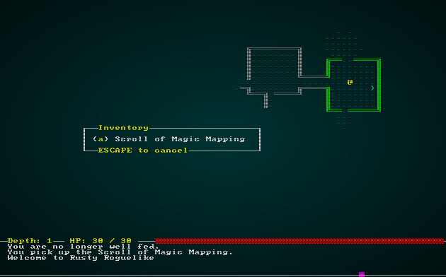
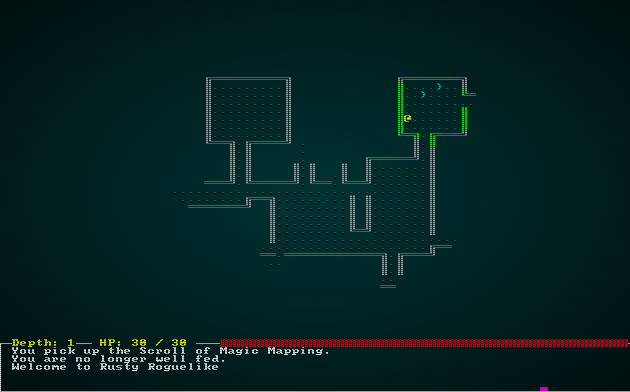

# Magic Mapping

---

***About this tutorial***

*This tutorial is free and open source, and all code uses the MIT license - so you are free to do with it as you like. My hope is that you will enjoy the tutorial, and make great games!*

*If you enjoy this and would like me to keep writing, please consider supporting [my Patreon](https://www.patreon.com/blackfuture).*

---

A really common item in roguelikes is the *scroll of magic mapping*. You read it, and the dungeon is revealed. Fancier roguelikes have nice graphics for it. In this chapter, we'll start by making it work - and then make it pretty!

## Adding a magic map component

We have everything we need except for an indicator that an item is a scroll (or any other item, really) of magic mapping. So in `components.rs` we'll add a component for it:

```rust
#[derive(Component, Debug, Serialize, Deserialize, Clone)]
pub struct MagicMapper {}
```

As always, we need to register it in `main.rs` and `saveload_system.rs`. We'll head over to `spawners.rs` and create a new function for it, as well as adding it to the loot tables:

```rust
fn magic_mapping_scroll(ecs: &mut World, x: i32, y: i32) {
    ecs.create_entity()
        .with(Position{ x, y })
        .with(Renderable{
            glyph: rltk::to_cp437(')'),
            fg: RGB::named(rltk::CYAN3),
            bg: RGB::named(rltk::BLACK),
            render_order: 2
        })
        .with(Name{ name : "Scroll of Magic Mapping".to_string() })
        .with(Item{})
        .with(MagicMapper{})
        .with(Consumable{})
        .marked::<SimpleMarker<SerializeMe>>()
        .build();
}
```

And the loot table:

```rust
fn room_table(map_depth: i32) -> RandomTable {
    RandomTable::new()
        .add("Goblin", 10)
        .add("Orc", 1 + map_depth)
        .add("Health Potion", 7)
        .add("Fireball Scroll", 2 + map_depth)
        .add("Confusion Scroll", 2 + map_depth)
        .add("Magic Missile Scroll", 4)
        .add("Dagger", 3)
        .add("Shield", 3)
        .add("Longsword", map_depth - 1)
        .add("Tower Shield", map_depth - 1)
        .add("Rations", 10)
        .add("Magic Mapping Scroll", 400)
}
```

Notice that we've given it a weight of 400 - absolutely ridiculous. We'll fix it later, for now we *really* want to spawn the scroll so that we can test it! Lastly, we add it to the actual spawn function:

```rust
match spawn.1.as_ref() {
    "Goblin" => goblin(ecs, x, y),
    "Orc" => orc(ecs, x, y),
    "Health Potion" => health_potion(ecs, x, y),
    "Fireball Scroll" => fireball_scroll(ecs, x, y),
    "Confusion Scroll" => confusion_scroll(ecs, x, y),
    "Magic Missile Scroll" => magic_missile_scroll(ecs, x, y),
    "Dagger" => dagger(ecs, x, y),
    "Shield" => shield(ecs, x, y),
    "Longsword" => longsword(ecs, x, y),
    "Tower Shield" => tower_shield(ecs, x, y),
    "Rations" => rations(ecs, x, y),
    "Magic Mapping Scroll" => magic_mapping_scroll(ecs, x, y),
    _ => {}
}
```

If you were to `cargo run` now, you'd likely find scrolls you can pick up - but they won't do anything.

## Mapping the level - the simple version

We'll modify `inventory_system.rs` to detect if you just used a mapping scroll, and reveal the whole map:

```rust
// If its a magic mapper...
let is_mapper = magic_mapper.get(useitem.item);
match is_mapper {
    None => {}
    Some(_) => {
        used_item = true;
        for r in map.revealed_tiles.iter_mut() {
            *r = true;
        }
        gamelog.entries.insert(0, "The map is revealed to you!".to_string());
    }
}
```

There are some framework changes also (see the source); we've done this often enough, I don't think it needs repeating here again. If you `cargo run` the project now, find a scroll (they are *everywhere*) and use it - the map is instantly revealed:



## Making it pretty

While the code presented there is effective, it isn't visually attractive. It's nice to include fluff in games, and let the user be pleasantly surprised by the beauty of an ASCII terminal from time to time! We'll start by modifying `inventory_system.rs` again:

```rust
// If its a magic mapper...
let is_mapper = magic_mapper.get(useitem.item);
match is_mapper {
    None => {}
    Some(_) => {
        used_item = true;
        gamelog.entries.insert(0, "The map is revealed to you!".to_string());
        *runstate = RunState::MagicMapReveal{ row : 0};
    }
}
```

Notice that instead of modifying the map, we are just changing the game state to mapping mode. We don't actually support doing that yet, so lets go into the state mapper in `main.rs` and modify `PlayerTurn` to handle it:

```rust
RunState::PlayerTurn => {
    self.systems.dispatch(&self.ecs);
    self.ecs.maintain();
    match *self.ecs.fetch::<RunState>() {
        RunState::MagicMapReveal{ .. } => newrunstate = RunState::MagicMapReveal{ row: 0 },
        _ => newrunstate = RunState::MonsterTurn
    }                
}
```

While we're here, lets add the state to `RunState`:

```rust
#[derive(PartialEq, Copy, Clone)]
pub enum RunState { AwaitingInput, 
    PreRun, 
    PlayerTurn, 
    MonsterTurn, 
    ShowInventory, 
    ShowDropItem, 
    ShowTargeting { range : i32, item : Entity},
    MainMenu { menu_selection : gui::MainMenuSelection },
    SaveGame,
    NextLevel,
    ShowRemoveItem,
    GameOver,
    MagicMapReveal { row : i32 }
}
```

We also add some logic to the tick loop for the new state:

```rust
RunState::MagicMapReveal{row} => {
    let mut map = self.ecs.fetch_mut::<Map>();
    for x in 0..MAPWIDTH {
        let idx = map.xy_idx(x as i32,row);
        map.revealed_tiles[idx] = true;
    }
    if row as usize == MAPHEIGHT-1 {
        newrunstate = RunState::MonsterTurn;
    } else {
        newrunstate = RunState::MagicMapReveal{ row: row+1 };
    }
}
```

This is pretty straightforward: it reveals the tiles on the current row, and then if we haven't hit the bottom of the map - it adds to row. If we have, it returns to where we were - `MonsterTurn`. If you `cargo run` now, find a magic mapping scroll and use it, the map fades in nicely:



## Wrap Up

This was a relatively quick chapter, but we now have another staple of the roguelike genre: magic mapping.


**The source code for this chapter may be found [here](https://github.com/thebracket/rustrogueliketutorial/tree/master/chapter-20-magicmapping)**

---

Copyright (C) 2019, Herbert Wolverson.

---