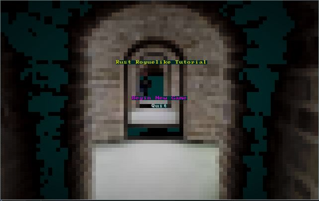
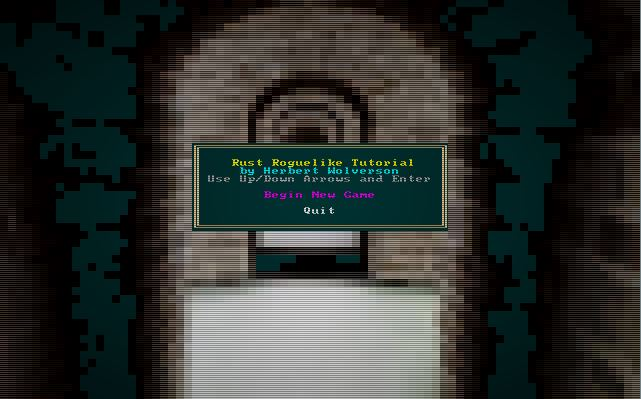

# REX Paint Main Menu

---

***About this tutorial***

*This tutorial is free and open source, and all code uses the MIT license - so you are free to do with it as you like. My hope is that you will enjoy the tutorial, and make great games!*

*If you enjoy this and would like me to keep writing, please consider supporting [my Patreon](https://www.patreon.com/blackfuture).*

---

Our main menu is really boring, and not a good way to attract players! This chapter will spice it up a bit.

## REX Paint

Grid Sage Games (the amazing u/Kyzrati on Reddit) provide a lovely tool for Codepage 437 image editing called [REX Paint](https://www.gridsagegames.com/rexpaint/index.html). RLTK has built-in support for using the output from this editor. As they used to say on the BBC's old kids show *Blue Peter* - here's one I made earlier.


I cheated a bit; I found a CC0 image, resized it to 80x50 in the GIMP, and used a [tool I wrote years](https://github.com/thebracket/png2rex) ago to convert the PNG to a REX Paint file. Still, I like the result. You can find the REX Paint file in the `resources` folder.

## Loading REX Assets

We'll introduce a new file, `rex_assets.rs` to store our REX sprites. The file looks like this:

```rust
use rltk::{rex::XpFile};

rltk::embedded_resource!(SMALL_DUNGEON, "../../resources/SmallDungeon_80x50.xp");

pub struct RexAssets {
    pub menu : XpFile
}

impl RexAssets {
    #[allow(clippy::new_without_default)]
    pub fn new() -> RexAssets {
        rltk::link_resource!(SMALL_DUNGEON, "../../resources/SmallDungeon_80x50.xp");

        RexAssets{
            menu : XpFile::from_resource("../../resources/SmallDungeon_80x50.xp").unwrap()
        }
    }
}
```

Very simple - it defines a structure, and loads the dungeon graphic into it when `new` is called. We'll also insert it into Specs as a resource so we can access our sprites anywhere. There are some new concepts here:

1. We're using `rltk::embedded_resource!` to include the file in our binary. This gets around having to ship the binary with your executable (and makes life easier in `wasm` land).
2. `#[allow(clippy::new_without_default)]` tells the linter to stop telling me to write a default implementation, when we don't need one!
3. `rltk::link_resource!` is the second-half the the embedded resource; the first stores it in memory, this one tells RLTK where to find it.
4. `menu : XpFile::from_resource("../../resources/SmallDungeon_80x50.xp").unwrap()` loads the Rex paint file from memory.

In `main.rs`:

```rust
gs.ecs.insert(rex_assets::RexAssets::new());
```

Now we open up `gui.rs` and find the `main_menu` function. We'll add two lines before we start printing menu content:

```rust
let assets = gs.ecs.fetch::<RexAssets>();
ctx.render_xp_sprite(&assets.menu, 0, 0);
```

The result (`cargo run` to see it) is a good start at a menu!



## Improving the look of the menu - adding a box and borders

To make it look a little snazzier, we'll work on spacing - and add a box for the menu and text. Replace the current title rendering code with:

```rust
ctx.draw_box_double(24, 18, 31, 10, RGB::named(rltk::WHEAT), RGB::named(rltk::BLACK));
ctx.print_color_centered(20, RGB::named(rltk::YELLOW), RGB::named(rltk::BLACK), "Rust Roguelike Tutorial");
ctx.print_color_centered(21, RGB::named(rltk::CYAN), RGB::named(rltk::BLACK), "by Herbert Wolverson");
ctx.print_color_centered(22, RGB::named(rltk::GRAY), RGB::named(rltk::BLACK), "Use Up/Down Arrows and Enter");
```

If you `cargo run` now, your menu looks like this:



That's quite a bit better!

## Fixing the spacing

You'll notice that if you don't have a saved game to load, there is an annoying gap between menu items. This is an easy fix, by keeping track of the `y` position we have used while we render the menu. Here's the new menu rendering code:

```rust
let mut y = 24;
    if let RunState::MainMenu{ menu_selection : selection } = *runstate {
        if selection == MainMenuSelection::NewGame {
            ctx.print_color_centered(y, RGB::named(rltk::MAGENTA), RGB::named(rltk::BLACK), "Begin New Game");
        } else {
            ctx.print_color_centered(y, RGB::named(rltk::WHITE), RGB::named(rltk::BLACK), "Begin New Game");
        }
        y += 1;

        if save_exists {
            if selection == MainMenuSelection::LoadGame {
                ctx.print_color_centered(y, RGB::named(rltk::MAGENTA), RGB::named(rltk::BLACK), "Load Game");
            } else {
                ctx.print_color_centered(y, RGB::named(rltk::WHITE), RGB::named(rltk::BLACK), "Load Game");
            }
            y += 1;
        }

        if selection == MainMenuSelection::Quit {
            ctx.print_color_centered(y, RGB::named(rltk::MAGENTA), RGB::named(rltk::BLACK), "Quit");
        } else {
            ctx.print_color_centered(y, RGB::named(rltk::WHITE), RGB::named(rltk::BLACK), "Quit");
        }
    ...
```

If you `cargo run` now, it looks better:


**The source code for this chapter may be found [here](https://github.com/thebracket/rustrogueliketutorial/tree/master/chapter-21-rexmenu)**

---

Copyright (C) 2019, Herbert Wolverson.

---