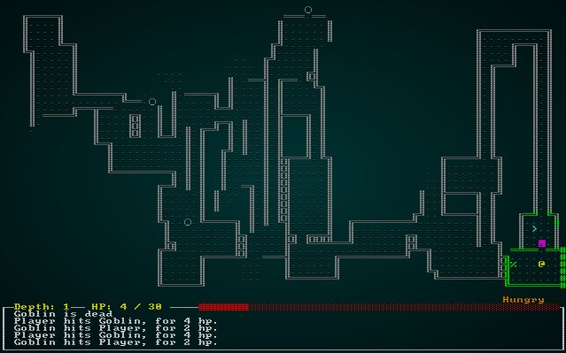

# BSP Room Dungeons (beta quality)

---

***About this tutorial***

*This tutorial is free and open source, and all code uses the MIT license - so you are free to do with it as you like. My hope is that you will enjoy the tutorial, and make great games!*

*If you enjoy this and would like me to keep writing, please consider supporting [my Patreon](https://www.patreon.com/blackfuture).*

---

So far, we've really just had one map design. It's different every time (unless you hit a repeat random seed), which is a great start - but the world of procedural generation leaves so many more possibilities. Over the next few chapters, we'll start building a few different map types.

## Refactoring the builder - Defining an Interface

Up until now, all of our map generation code has sat in the `map.rs` file. That's fine for a single style, but what if we want to have lots of styles? This is the perfect time to create a proper builder system! If you look at the map generation code in `main.rs`, we have the beginnings of an interface defined:

* We call `Map::new_map_rooms_and_corridors`, which builds a set of rooms.
* We pass that to `spawner::spawn_room` to populate each room.
* We then place the player in the first room.

To better organize our code, we'll make a *module*. Rust lets you make a directory, with a file in it called `mod.rs` - and that directory is now a module. Modules are exposed through `mod` and `pub mod`, and provide a way to keep parts of your code together. The `mod.rs` file provides an *interface* - that is, a list of what is provided by the module, and how to interact with it. Other files in the module can do whatever they want, safely isolated from the rest of the code.

So, we'll create a directory (off of `src`) called `map_builders`. In that directory, we'll create an empty file called `mod.rs`. We're trying to define an interface, so we'll start with a skeleton. In `mod.rs`:

```rust
use super::Map;

trait MapBuilder {
    fn build(new_depth: i32) -> Map;
}
```

The use of `trait` is new! A trait is like an *interface* in other languages: you are saying that any other type can *implement* the trait, and can then be treated as a variable of that type. [Rust by Example](https://doc.rust-lang.org/stable/rust-by-example/trait.html) has a great section on traits, as does [The Rust Book](https://doc.rust-lang.org/beta/book/ch10-02-traits.html). What we're stating is that anything can declare itself to be a `MapBuilder` - and that includes a promise that they will provide a `build` function that takes in an ECS `World` object, and returns a map.

Open up `map.rs`, and add a new function - called, appropriately enough, `new`:

```rust
/// Generates an empty map, consisting entirely of solid walls
pub fn new(new_depth : i32) -> Map {
    Map{
        tiles : vec![TileType::Wall; MAPCOUNT],
        rooms : Vec::new(),
        width : MAPWIDTH as i32,
        height: MAPHEIGHT as i32,
        revealed_tiles : vec![false; MAPCOUNT],
        visible_tiles : vec![false; MAPCOUNT],
        blocked : vec![false; MAPCOUNT],
        tile_content : vec![Vec::new(); MAPCOUNT],
        depth: new_depth,
        bloodstains: HashSet::new()
    }
}
```

We'll need this for other map generators, and it makes sense for a `Map` to know how to return a new one as a constructor - without having to encapsulate all the logic for map layout. The idea is that any `Map` will work basically the same way, irrespective of how we've decided to populate it.

Now we'll create a new file, also inside the `map_builders` directory. We'll call it `simple_map.rs` - and it'll be where we put the existing map generation system. We'll also put a skeleton in place here:

```rust
use super::MapBuilder;
use super::Map;
use specs::prelude::*;

pub struct SimpleMapBuilder {}

impl MapBuilder for SimpleMapBuilder {
    fn build(new_depth: i32) -> Map {
        Map::new(new_depth)
    }
}
```

This simply returns an unusable, solid map. We'll flesh out the details in a bit - lets get the interface working, first.

Now, back in `map_builders/mod.rs` we add a public function. For now, it just calls the builder in `SimpleMapBuilder`:

```rust
pub fn build_random_map(new_depth: i32) -> Map {
    SimpleMapBuilder::build(new_depth)
}
```

Finally, we'll tell `main.rs` to actually include the module:

```rust
pub mod map_builders;
```

Ok, so that was a fair amount of work to not actually *do* anything - but we've gained a clean interface offering map creation (via a single function), and setup a *trait* to require that our map builders work in a similar fashion. That's a good start.

## Fleshing out the Simple Map Builder

Now we start moving functionality out of `map.rs` into our `SimpleMapBuilder`. We'll start by adding *another* file to `map_builders` - `common.rs`. This will hold functions that used to be part of the map, and are now commonly used when building.

The file looks like this:

```rust
use super::{Map, Rect, TileType};
use std::cmp::{max, min};

pub fn apply_room_to_map(map : &mut Map, room : &Rect) {
    for y in room.y1 +1 ..= room.y2 {
        for x in room.x1 + 1 ..= room.x2 {
            let idx = map.xy_idx(x, y);
            map.tiles[idx] = TileType::Floor;
        }
    }
}

pub fn apply_horizontal_tunnel(map : &mut Map, x1:i32, x2:i32, y:i32) {
    for x in min(x1,x2) ..= max(x1,x2) {
        let idx = map.xy_idx(x, y);
        if idx > 0 && idx < map.width as usize * map.height as usize {
            map.tiles[idx as usize] = TileType::Floor;
        }
    }
}

pub fn apply_vertical_tunnel(map : &mut Map, y1:i32, y2:i32, x:i32) {
    for y in min(y1,y2) ..= max(y1,y2) {
        let idx = map.xy_idx(x, y);
        if idx > 0 && idx < map.width as usize * map.height as usize {
            map.tiles[idx as usize] = TileType::Floor;
        }
    }
}
```

These are exactly the same as the functions from `map.rs`, but with `map` passed as a mutable reference (so you are working on the original, rather than a new one) and all vestiges of `self` gone. These are *free functions* - that is, they are functions available from anywhere, not tied to a type. The `pub fn` means they are public *within the module* - unless we add `pub use` to the module itself, they aren't passed out of the module to the main program. This helps keeps code organized.

Now that we have these helpers, we can start porting the map builder itself. In `simple_map.rs`, we start by fleshing out the `build` function a bit:

```rust
impl MapBuilder for SimpleMapBuilder {
    fn build(new_depth: i32) -> Map {
        let mut map = Map::new(new_depth);
        SimpleMapBuilder::rooms_and_corridors(&mut map);
        map
    }
}
```

We're calling a new function, `rooms_and_corridors`. Lets build it:

```rust
impl SimpleMapBuilder {
    fn rooms_and_corridors(map : &mut Map) {
        const MAX_ROOMS : i32 = 30;
        const MIN_SIZE : i32 = 6;
        const MAX_SIZE : i32 = 10;

        let mut rng = RandomNumberGenerator::new();

        for _i in 0..MAX_ROOMS {
            let w = rng.range(MIN_SIZE, MAX_SIZE);
            let h = rng.range(MIN_SIZE, MAX_SIZE);
            let x = rng.roll_dice(1, map.width - w - 1) - 1;
            let y = rng.roll_dice(1, map.height - h - 1) - 1;
            let new_room = Rect::new(x, y, w, h);
            let mut ok = true;
            for other_room in map.rooms.iter() {
                if new_room.intersect(other_room) { ok = false }
            }
            if ok {
                apply_room_to_map(map, &new_room);

                if !map.rooms.is_empty() {
                    let (new_x, new_y) = new_room.center();
                    let (prev_x, prev_y) = map.rooms[map.rooms.len()-1].center();
                    if rng.range(0,1) == 1 {
                        apply_horizontal_tunnel(map, prev_x, new_x, prev_y);
                        apply_vertical_tunnel(map, prev_y, new_y, new_x);
                    } else {
                        apply_vertical_tunnel(map, prev_y, new_y, prev_x);
                        apply_horizontal_tunnel(map, prev_x, new_x, new_y);
                    }
                }

                map.rooms.push(new_room);
            }
        }

        let stairs_position = map.rooms[map.rooms.len()-1].center();
        let stairs_idx = map.xy_idx(stairs_position.0, stairs_position.1);
        map.tiles[stairs_idx] = TileType::DownStairs;
    }
}
```

You'll notice that this is built as a *method* attached to the `SimpleMapBuilder` structure. It isn't part of the trait, so we can't define it there - but we want to keep it separated from other builders, which might have their own functions. The code itself should look eerily familiar: it's the same as the generator in `map.rs`, but with `map` as a variable rather than being generated inside the function.

This is only the first half of generation, but it's a good start! Now go to `map.rs`, and *delete* the entire `new_map_rooms_and_corridors` function. Also delete the ones we replicated in `common.rs`. The `map.rs` file looks much cleaner now, without any references to map building strategy! Of course, your compiler/IDE is probably telling you that we've broken a bunch of stuff. That's ok - and a normal part of "refactoring" - the process of changing code to be easier to work with.

There are three lines in `main.rs` that are now flagged by the compiler.

* We can replace `*worldmap_resource = Map::new_map_rooms_and_corridors(current_depth + 1);` with `*worldmap_resource = map_builders::build_random_map(current_depth + 1);`.
* `*worldmap_resource = Map::new_map_rooms_and_corridors(1);` can become `*worldmap_resource = map_builders::build_random_map(1);`.
* `let map : Map = Map::new_map_rooms_and_corridors(1);` transforms to `let map : Map = map_builders::build_random_map(1);`.

If you `cargo run` now, you'll notice: the game is exactly the same! That's good: we've successfully *refactored* functionality out of `Map` and into `map_builders`.

## Placing the Player

If you look in `main.rs`, pretty much every time we build a map - we then look for the first room, and use it to place the player. It's quite possible that we won't want to use the same strategy in future maps, so we should indicate where the player goes when we build the map. Lets expand our interface in `map_builders/mod.rs` to also return a position:

```rust
trait MapBuilder {
    fn build(new_depth: i32) -> (Map, Position);
}

pub fn build_random_map(new_depth: i32) -> (Map, Position) {
    SimpleMapBuilder::build(new_depth)
}
```

Notice that we're using a *tuple* to return two values at once. We've talked about those earlier, but this is a great example of why they are useful! We now need to go into `simple_map` to make the `build` function actually return the correct data. The definition of `build` in `simple_map.rs` now looks like this:

```rust
fn build(new_depth: i32) -> (Map, Position) {
    let mut map = Map::new(new_depth);
    let playerpos = SimpleMapBuilder::rooms_and_corridors(&mut map);
    (map, playerpos)
}
```

We'll update the signature of `rooms_and_corridors`:

```rust
fn rooms_and_corridors(map : &mut Map) -> Position {
```

And we'll add a last line to return the center of room 0:

```rust
let start_pos = map.rooms[0].center();
Position{ x: start_pos.0, y: start_pos.1 }
```

This has, *of course*, broken the code we updated in `main.rs`. We can quickly take care of that! The first error can be taken care of with the following code:

```rust
// Build a new map and place the player
let worldmap;
let current_depth;
let player_start;
{
    let mut worldmap_resource = self.ecs.write_resource::<Map>();
    current_depth = worldmap_resource.depth;
    let (newmap, start) = map_builders::build_random_map(current_depth + 1);
    *worldmap_resource = newmap;
    player_start = start;
    worldmap = worldmap_resource.clone();
}

// Spawn bad guys
for room in worldmap.rooms.iter().skip(1) {
    spawner::spawn_room(&mut self.ecs, room, current_depth+1);
}

// Place the player and update resources
let (player_x, player_y) = (player_start.x, player_start.y);
```

Notice how we use [destructuring](https://aminb.gitbooks.io/rust-for-c/content/destructuring/index.html) to retrieve both the map and the start position from the builder. We then put these in the appropriate places. Since assignment in Rust is a *move* operation, this is pretty efficient - and the compiler can get rid of temporary assignments for us.

We do the same again on the second error (around line 369). It's almost exactly the same code, so feel free to check the [source code for this chapter](https://github.com/thebracket/rustrogueliketutorial/tree/master/chapter-23-bsproom-dungeons) if you are stuck.

Lastly, the final error can be simply replaced like this:

```rust
let (map, player_start) = map_builders::build_random_map(1);
let (player_x, player_y) = (player_start.x, player_start.y);
```

Alright, lets `cargo run` that puppy! If all went well, then... nothing has changed. We've made a significant gain, however: our map building strategy now determines the player's starting point on a level, not the map itself.

## Cleaning up room spawning

It's quite possible that we won't *have* the concept of rooms in some map designs, so we also want to move spawning to be a function of the map builder. We'll add a generic spawner to the interface in `map_builders/mod.rs`:

```rust
trait MapBuilder {
    fn build(new_depth: i32) -> (Map, Position);
    fn spawn(map : &Map, ecs : &mut World, new_depth: i32);
}
```

Simple enough: it requires the ECS (since we're adding entities) and the map. We'll also add a public function, `spawn` to provide an external interface to layout out the monsters:

```rust
pub fn spawn(map : &mut Map, ecs : &mut World, new_depth: i32) {
    SimpleMapBuilder::spawn(map, ecs, new_depth);
}
```

Now we open `simple_map.rs` and actually *implement* `spawn`. Fortunately, it's very simple:

```rust
fn spawn(map : &mut Map, ecs : &mut World) {
    for room in map.rooms.iter().skip(1) {
        spawner::spawn_room(ecs, room, 1);
    }
}
```

Now, we can go into `main.rs` and find every time we loop through calling `spawn_room` and replace it with a call to `map_builders::spawn`.

Once again, `cargo run` should give you the same game we've been looking at for 22 chapters!

## Implementing a new map - subdivided BSP

Now that we have a framework to *allow* us to make a new map, lets do so! Nethack started out using a relatively simple map generation system that still produces satisfying maps. You subdivide your map rectangle into ever-smaller rectangles, sub-dividing each rectangle in turn - until you hit a minimum size. Then you randomly join them together to give a more interesting map.

We'll start by making a new file in `map_builders` - `bsp_dungeon.rs`. A skeleton implementation of a new builder goes here:

```rust
use super::{MapBuilder, Map, Rect, apply_room_to_map, 
    apply_horizontal_tunnel, apply_vertical_tunnel, TileType,
    Position, spawner};
use rltk::RandomNumberGenerator;
use specs::prelude::*;

pub struct BspDungeonBuilder {}

impl MapBuilder for BspDungeonBuilder {
    fn build(new_depth: i32) -> (Map, Position) {
        let mut map = Map::new(new_depth);
        (map, Position{x:0, y:0})
    }

    fn spawn(map : &Map, ecs : &mut World, new_depth: i32) {
        for room in map.rooms.iter().skip(1) {
            spawner::spawn_room(ecs, room, new_depth);
        }
    }
}
```

This makes an unusable map - but gives us a starting point. We'll modify `mod.rs` to always use *this* builder, while we work on it:

```rust
pub fn build_random_map(new_depth: i32) -> (Map, Position) {
    BspDungeonBuilder::build(new_depth)
}

pub fn spawn(map : &Map, ecs : &mut World, new_depth: i32) {
    BspDungeonBuilder::spawn(map, ecs, new_depth);
}
```

We'll worry about swapping out map types later. Onto making the map! Note that this implementation is ported from my C++ game, *One Knight in the Dungeon*. We'll start with room generation:

```rust
fn build(new_depth: i32) -> (Map, Position) {
    let mut map = Map::new(new_depth);
    let mut rng = RandomNumberGenerator::new();

    let mut rects : Vec<Rect> = Vec::new(); // Vector to hold our rectangles as we divide
    rects.push( Rect::new(2, 2, map.width-5, map.height-5) ); // Start with a single map-sized rectangle
    let first_room = rects[0];
    add_subrects(&mut rects, first_room); // Divide the first room

    // Up to 240 times, we get a random rectangle and divide it. If its possible to squeeze a
    // room in there, we place it and add it to the rooms list.
    let mut n_rooms = 0;
    while n_rooms < 240 {
        let rect = get_random_rect(&mut rects, &mut rng);
        let candidate = get_random_sub_rect(rect, &mut rng);

        if is_possible(&mut map, candidate) {
            apply_room_to_map(&mut map, &candidate);
            map.rooms.push(candidate);
            add_subrects(&mut rects, rect);
        }

        n_rooms += 1;
    }
    let player_start = map.rooms[0].center();
    (map, Position{ x : player_start.0, y : player_start.1 })
}
```

So what on Earth does this do?

1. We start by initializing a new map and random number generator to use.
2. We create a new vector of `Rect` structures.
3. We create the "first room" - which is really the whole map. We've trimmed a bit to add some padding to the sides of the map.
4. We call `add_subrects`, passing it the rectangle list - and the first room. We'll implement that in a minute, but what it does is: it divides the rectangle into four quadrants, and adds each of the quadrants to the rectangle list.
5. Now we setup a room counter, so we don't infinitely loop.
6. While that counter is less than 240 (a relatively arbitrary limit that gives fun results):
    1. We call `get_random_rect` to retrieve a random rectangle from the rectangles list.
    2. We call `get_random_sub_rect` using this rectangle as an outer boundary. It creates a random room from 3 to 10 tiles in size (on each axis), somewhere within the parent rectangle.
    3. We ask `is_possible` if the candidate can be drawn to the map; every tile must be within the map boundaries, and not already a room. If it IS possible:
        1. We mark it on the map.
        2. We add it to the rooms list.
        3. We call `add_subrects` to sub-divide the rectangle we just used (not the candidate!).

If you `cargo run` now, you will be in a room with no exits. That's a great start.

Now, we sort the rooms by left coordinate. You don't *have* to do this, but it helps make connected rooms line up.

```rust
map.rooms.sort_by(|a,b| a.x1.cmp(&b.x1) );
```

`sort_by` takes a *closure* - that is, an inline function (known as a "lambda" in other languages) as a parameter. You could specify a whole other function if you wanted to, or implement traits on `Rect` to make it sortable - but this is easy enough. It sorts by comparing the `x1` value of each rectangle.

Now we'll add some corridors:

```rust
for i in 0..map.rooms.len()-1 {
    let room = map.rooms[i];
    let next_room = map.rooms[i+1];
    let start_x = room.x1 + (rng.roll_dice(1, i32::abs(room.x1 - room.x2))-1);
    let start_y = room.y1 + (rng.roll_dice(1, i32::abs(room.y1 - room.y2))-1);
    let end_x = next_room.x1 + (rng.roll_dice(1, i32::abs(next_room.x1 - next_room.x2))-1);
    let end_y = next_room.y1 + (rng.roll_dice(1, i32::abs(next_room.y1 - next_room.y2))-1);
    draw_corridor(&mut map, start_x, start_y, end_x, end_y);
}
```

This iterates the rooms list, ignoring the last one. It fetches the current room, and the next one in the list and calculates a random location (`start_x`/`start_y` and `end_x`/`end_y`) within each room. It then calls the mysterious `draw_corridor` function with these coordinates. Draw corridor adds a line from the start to the end, using only north/south or east/west (it can give 90-degree bends). It won't give you a staggered, hard to navigate perfect line like Bresenham would.

Finally, we need to wrap up and create the exit:

```rust
let stairs = map.rooms[map.rooms.len()-1].center();
let stairs_idx = map.xy_idx(stairs.0, stairs.1);
map.tiles[stairs_idx] = TileType::DownStairs;
```

We place the exit in the last room, guaranteeing that the poor player has a ways to walk.

If you `cargo run` now, you'll see something like this:

.

We have a different dungeon, this one quite suited to sewers or similar.

## Randomizing the dungeon per level

Rather than *always* using the BSP sewer algorithm, we would like to sometimes use one or the other. In `map_builders/mod.rs`, replace the `build` function:

```rust
pub fn build_random_map(new_depth: i32) -> (Map, Position) {
    let mut rng = rltk::RandomNumberGenerator::new();
    let builder = rng.roll_dice(1, 2);
    match builder {
        1 => SimpleMapBuilder::build(new_depth),
        _ => BspDungeonBuilder::build(new_depth)
    }    
}
```

Now when you play, it's a coin toss what type of map you encounter. The `spawn` functions for the types are the same - so we're not going to worry about map builder state until the next chapter.

## Wrap-Up

You've refactored your map building into a new module, and built a simple BSP (Binary Space Partitioning) based map. The game randomly picks a map type, and you have more variety. The next chapter will further refactor map generation, and introduce another technique.

**The source code for this chapter may be found [here](https://github.com/thebracket/rustrogueliketutorial/tree/master/chapter-23-bsproom-dungeons)**


[Run this chapter's example with web assembly, in your browser (WebGL2 required)](http://bfnightly.bracketproductions.com/rustbook/wasm/chapter-23-bsproom-dungeons/)
---

Copyright (C) 2019, Herbert Wolverson.

---