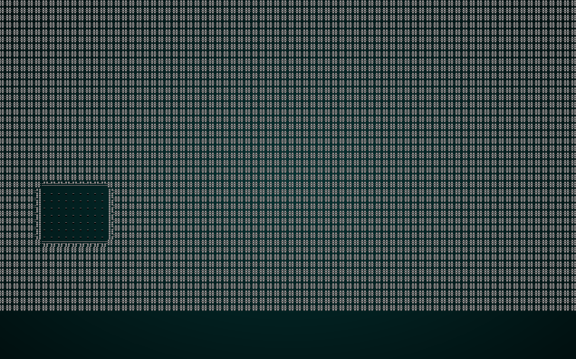

# Map Construction Test Harness

---

***About this tutorial***

*This tutorial is free and open source, and all code uses the MIT license - so you are free to do with it as you like. My hope is that you will enjoy the tutorial, and make great games!*

*If you enjoy this and would like me to keep writing, please consider supporting [my Patreon](https://www.patreon.com/blackfuture).*

---

As we're diving into generating new and interesting maps, it would be helpful to provide a way to *see* what the algorithms are doing. This chapter will build a test harness to accomplish this, and extend the `SimpleMapBuilder` from the previous chapter to support it. This is going to be a relatively large task, and we'll learn some new techniques along the way!

## Cleaning up map creation - Do Not Repeat Yourself

In `main.rs`, we essentially have the same code three times. When the program starts, we insert a map into the world. When we change level, or finish the game - we do the same. The last two have different semantics (since we're updating the world rather than inserting for the first time) - but it's basically redundant repetition.

We'll start by changing the first one to insert *placeholder* values rather than the actual values we intend to use. This way, the `World` has the slots for the data - it just isn't all that useful yet. Here's a version with the old code commented out:

```rust
gs.ecs.insert(SimpleMarkerAllocator::<SerializeMe>::new());

gs.ecs.insert(Map::new(1));
gs.ecs.insert(Point::new(0, 0));
gs.ecs.insert(rltk::RandomNumberGenerator::new());

/*let mut builder = map_builders::random_builder(1);
builder.build_map();
let player_start = builder.get_starting_position();
let map = builder.get_map();
let (player_x, player_y) = (player_start.x, player_start.y);
builder.spawn_entities(&mut gs.ecs);
gs.ecs.insert(map);
gs.ecs.insert(Point::new(player_x, player_y));*/

let player_entity = spawner::player(&mut gs.ecs, 0, 0);
gs.ecs.insert(player_entity);
```

So instead of building the map, we put a placeholder into the `World` resources. That's obviously not very useful for actually starting the game, so we also need a function to do the actual building and update the resources. Not entirely coincidentally, that function is the same as the other two places from which we currently update the map! In other words, we can roll those into this function, too. So in the implementation of `State`, we add:

```rust
fn generate_world_map(&mut self, new_depth : i32) {
    let mut builder = map_builders::random_builder(new_depth);
    builder.build_map();
    let player_start;
    {
        let mut worldmap_resource = self.ecs.write_resource::<Map>();
        *worldmap_resource = builder.get_map();
        player_start = builder.get_starting_position();
    }

    // Spawn bad guys
    builder.spawn_entities(&mut self.ecs);

    // Place the player and update resources
    let (player_x, player_y) = (player_start.x, player_start.y);
    let mut player_position = self.ecs.write_resource::<Point>();
    *player_position = Point::new(player_x, player_y);
    let mut position_components = self.ecs.write_storage::<Position>();
    let player_entity = self.ecs.fetch::<Entity>();
    let player_pos_comp = position_components.get_mut(*player_entity);
    if let Some(player_pos_comp) = player_pos_comp {
        player_pos_comp.x = player_x;
        player_pos_comp.y = player_y;
    }

    // Mark the player's visibility as dirty
    let mut viewshed_components = self.ecs.write_storage::<Viewshed>();
    let vs = viewshed_components.get_mut(*player_entity);
    if let Some(vs) = vs {
        vs.dirty = true;
    } 
}
```

Now we can get rid of the commented out code, and simplify our first call quite a bit:

```rust
gs.ecs.insert(Map::new(1));
gs.ecs.insert(Point::new(0, 0));
gs.ecs.insert(rltk::RandomNumberGenerator::new());
let player_entity = spawner::player(&mut gs.ecs, 0, 0);
gs.ecs.insert(player_entity);
gs.ecs.insert(RunState::MainMenu{ menu_selection: gui::MainMenuSelection::NewGame });
gs.ecs.insert(gamelog::GameLog{ entries : vec!["Welcome to Rusty Roguelike".to_string()] });
gs.ecs.insert(particle_system::ParticleBuilder::new());
gs.ecs.insert(rex_assets::RexAssets::new());

gs.generate_world_map(1);
```

We can also go to the various parts of the code that call the same code we just added to `generate_world_map` and greatly simplify them by using the new function. We can replace `goto_next_level` with:

```rust
fn goto_next_level(&mut self) {
    // Delete entities that aren't the player or his/her equipment
    let to_delete = self.entities_to_remove_on_level_change();
    for target in to_delete {
        self.ecs.delete_entity(target).expect("Unable to delete entity");
    }

    // Build a new map and place the player
    let current_depth;
    {
        let worldmap_resource = self.ecs.fetch::<Map>();
        current_depth = worldmap_resource.depth;
    }
    self.generate_world_map(current_depth + 1);

    // Notify the player and give them some health
    let player_entity = self.ecs.fetch::<Entity>();
    let mut gamelog = self.ecs.fetch_mut::<gamelog::GameLog>();
    gamelog.entries.insert(0, "You descend to the next level, and take a moment to heal.".to_string());
    let mut player_health_store = self.ecs.write_storage::<CombatStats>();
    let player_health = player_health_store.get_mut(*player_entity);
    if let Some(player_health) = player_health {
        player_health.hp = i32::max(player_health.hp, player_health.max_hp / 2);
    }
}
```

Likewise, we can clean up `game_over_cleanup`:

```rust
fn game_over_cleanup(&mut self) {
    // Delete everything
    let mut to_delete = Vec::new();
    for e in self.ecs.entities().join() {
        to_delete.push(e);
    }
    for del in to_delete.iter() {
        self.ecs.delete_entity(*del).expect("Deletion failed");
    }

    // Spawn a new player
    {
        let player_entity = spawner::player(&mut self.ecs, 0, 0);
        let mut player_entity_writer = self.ecs.write_resource::<Entity>();
        *player_entity_writer = player_entity;
    }

    // Build a new map and place the player
    self.generate_world_map(1);                                          
}
```

And there we go - `cargo run` gives the same game we've had for a while, and we've cut out a bunch of code. Refactors that make things smaller rock!

## Making a generator

It's surprisingly difficult to combine two paradigms, sometimes:

* The graphical "tick" nature of RLTK (and the underlying GUI environment) encourages you to do everything fast, in one fell swoop.
* Actually visualizing progress while you generate a map encourages you to run in lots of phases as a "state machine", yielding map results along the way.

My first thought was to use *coroutines*, specifically [Generators](https://doc.rust-lang.org/beta/unstable-book/language-features/generators.html). They really are ideal for this type of thing: you can write code in a function that runs synchronously (in order) and "yields" values as the computation continues. I even went so far as to get a working implementation - but it required *nightly* support (unstable, unfinished Rust) and didn't play nicely with web assembly. So I scrapped it. There's a lesson here: sometimes the tooling isn't quite ready for what you really want!

Instead, I decided to go with a more traditional route. Maps can take a "snapshot" while they generate, and that big pile of snapshots can be played frame-by-frame in the visualizer. This isn't quite as nice as a coroutine, but it works and is stable. Those are desirable traits!

To get started, we should make sure that visualizing map generation is entirely optional. When you ship your game to players, you probably don't want to show them the whole map while they get started - but while you are working on map algorithms, it's very valuable. So towards the top of `main.rs`, we add a constant:

```rust
const SHOW_MAPGEN_VISUALIZER : bool = true;
```

A *constant* is just that: a variable that cannot change once the program has started. Rust makes read-only constants pretty easy, and the compiler generally optimizes them out completely since the value is known ahead of time. In this case, we're stating that a `bool` called `SHOW_MAPGEN_VISUALIZER` is `true`. The idea is that we can set it to `false` when we don't want to display our map generation progress.

With that in place, it's time to add snapshot support to our map builder interface. In `map_builders/mod.rs` we extend the interface a bit:

```rust
pub trait MapBuilder {
    fn build_map(&mut self);
    fn spawn_entities(&mut self, ecs : &mut World);
    fn get_map(&self) -> Map;
    fn get_starting_position(&self) -> Position;
    fn get_snapshot_history(&self) -> Vec<Map>;
    fn take_snapshot(&mut self);
}
```

Notice the new entries: `get_snapshot_history` and `take_snapshot`. The former will be used to ask the generator for its history of map frames; the latter tells generators to support taking snapshots (and leaves it up to them how they do it). 

This is a good time to mention one *major* difference between Rust and C++ (and other languages that provide Object Oriented Programming support). Rust traits *do not* support adding variables to the trait signature. So you can't include a `history : Vec<Map>` within the trait, even if that's exactly what you're using to store the snapshot in all the implementations. I honestly don't know why this is the case, but it's workable - just an odd departure from OOP norms.

Inside `simple_map.rs`, we need to implement these methods for our `SimpleMapBuilder`. We start by adding supporting variables to our `struct`:

```rust
pub struct SimpleMapBuilder {
    map : Map,
    starting_position : Position,
    depth: i32,
    rooms: Vec<Rect>,
    history: Vec<Map>
}
```

Notice that we've added `history: Vec<Map>` to the structure. It's what it says on the tin: a vector (resizable array) of `Map` structures. The idea is that we'll keep adding copies of the map into it for each "frame" of map generation.

Onto the trait implementations:

```rust
fn get_snapshot_history(&self) -> Vec<Map> {
    self.history.clone()
}
```

This is *very* simple: we return a copy of the history vector to the caller. We also need:

```rust
fn take_snapshot(&mut self) {
    if SHOW_MAPGEN_VISUALIZER {
        let mut snapshot = self.map.clone();
        for v in snapshot.revealed_tiles.iter_mut() {
            *v = true;
        }
        self.history.push(snapshot);
    }
}
```

We first check to see if we're using the snapshot feature (no point in wasting memory if we aren't!). If we are, we take a copy of the current map, iterate every `revealed_tiles` cell and set it to `true` (so the map render will display everything, including inaccessible walls), and add it to the history list.

We can now call `self.take_snapshot()` at any point during map generation, and it gets added as a frame to the map generator. In `simple_map.rs` we add a couple of calls after we add rooms or corridors:

```rust
...
if ok {
    apply_room_to_map(&mut self.map, &new_room);
    self.take_snapshot();

    if !self.rooms.is_empty() {
        let (new_x, new_y) = new_room.center();
        let (prev_x, prev_y) = self.rooms[self.rooms.len()-1].center();
        if rng.range(0,1) == 1 {
            apply_horizontal_tunnel(&mut self.map, prev_x, new_x, prev_y);
            apply_vertical_tunnel(&mut self.map, prev_y, new_y, new_x);
        } else {
            apply_vertical_tunnel(&mut self.map, prev_y, new_y, prev_x);
            apply_horizontal_tunnel(&mut self.map, prev_x, new_x, new_y);
        }
    }

    self.rooms.push(new_room);
    self.take_snapshot();
}
...
```

## Rendering the visualizer

Visualizing map development is another *game state*, so we add it to our `RunState` enumeration in `main.rs`:

```rust
#[derive(PartialEq, Copy, Clone)]
pub enum RunState { AwaitingInput, 
    PreRun, 
    PlayerTurn, 
    MonsterTurn, 
    ShowInventory, 
    ShowDropItem, 
    ShowTargeting { range : i32, item : Entity},
    MainMenu { menu_selection : gui::MainMenuSelection },
    SaveGame,
    NextLevel,
    ShowRemoveItem,
    GameOver,
    MagicMapReveal { row : i32 },
    MapGeneration
}
```

Visualization actually requires a few variables, but I ran into a problem: one of the variables really should be the *next* state to which we transition after visualizing. We might be building a new map from one of three sources (new game, game over, next level) - and they have different states following the generation. Unfortunately, you can't put a second `RunState` into the first one - Rust gives you cycle errors, and it won't compile. You *can* use a `Box<RunState>` - but that doesn't work with `RunState` deriving from `Copy`! I fought this for a while, and settled on adding to `State` instead:

```rust
pub struct State {
    pub ecs: World,
    mapgen_next_state : Option<RunState>,
    mapgen_history : Vec<Map>,
    mapgen_index : usize,
    mapgen_timer : f32
}
```

We've added:

* `mapgen_next_state` - which is where the game should go next.
* `mapgen_history` - a copy of the map history frames to play.
* `mapgen_index` - how far through the history we are during playback.
* `mapgen_timer` - used for frame timing during playback.

Since we've modified `State`, we also have to modify our creation of the `State` object:

```rust
let mut gs = State {
    ecs: World::new(),
    mapgen_next_state : Some(RunState::MainMenu{ menu_selection: gui::MainMenuSelection::NewGame }),
    mapgen_index : 0,
    mapgen_history: Vec::new(),
    mapgen_timer: 0.0
};
```

We've made the next state the same as the starting state we have been using: so the game will render map creation and then go to the menu. We can change our initial state to `MapGeneration`:

```rust
gs.ecs.insert(RunState::MapGeneration{} );
```

Now we need to implement the renderer. In our `tick` function, we add the following state:

```rust
match newrunstate {
    RunState::MapGeneration => {
        if !SHOW_MAPGEN_VISUALIZER {
            newrunstate = self.mapgen_next_state.unwrap();
        }
        ctx.cls();                
        draw_map(&self.mapgen_history[self.mapgen_index], ctx);

        self.mapgen_timer += ctx.frame_time_ms;
        if self.mapgen_timer > 300.0 {
            self.mapgen_timer = 0.0;
            self.mapgen_index += 1;
            if self.mapgen_index == self.mapgen_history.len() {
                newrunstate = self.mapgen_next_state.unwrap();
            }
        }
    }
    ...
```

This is relatively straight-forward:

1. If the visualizer isn't enabled, simply transition to the next state immediately.
2. Clear the screen.
3. Call `draw_map`, with the map history from our state - at the current frame.
4. Add the frame duration to the `mapgen_timer`, and if it is greater than 300ms:
    1. Set the timer back to 0.
    2. Increment the frame counter.
    3. If the frame counter has reached the end of our history, transition to the next game state.

The eagle-eyed reader will have noticed a subtle change here. `draw_map` didn't used to take a `map` - it would pull it from the ECS! In `map.rs`, the beginning of `draw_map` changes to:

```rust
pub fn draw_map(map : &Map, ctx : &mut Rltk) {
```

Our regular call to `draw_map` in `tick` also changes to:

```rust
draw_map(&self.ecs.fetch::<Map>(), ctx);
```

This is a tiny change that allowed us to render whatever `Map` structure we need!

Lastly, we need to actually give the visualizer some data to render. We adjust `generate_world_map` to reset the various `mapgen_` variables, clear the history, and retrieve the snapshot history once it has run:

```rust
fn generate_world_map(&mut self, new_depth : i32) {
        self.mapgen_index = 0;
        self.mapgen_timer = 0.0;
        self.mapgen_history.clear();
        let mut builder = map_builders::random_builder(new_depth);
        builder.build_map();
        self.mapgen_history = builder.get_snapshot_history();
        let player_start;
        {
            let mut worldmap_resource = self.ecs.write_resource::<Map>();
            *worldmap_resource = builder.get_map();
            player_start = builder.get_starting_position();
        }
```

If you `cargo run` the project now, you get to watch the simple map generator build your level before you start.



## Wrap-Up

This finishes building the test harness - you can watch maps spawn, which should make generating maps (the topic of the next few chapters) a lot more intuitive.

**The source code for this chapter may be found [here](https://github.com/thebracket/rustrogueliketutorial/tree/master/chapter-24-map-testing)**


[Run this chapter's example with web assembly, in your browser (WebGL2 required)](http://bfnightly.bracketproductions.com/rustbook/wasm/chapter-24-map-testing/)
---

Copyright (C) 2019, Herbert Wolverson.

---