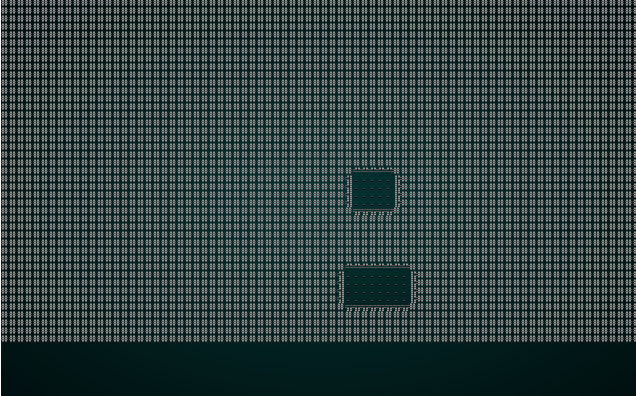
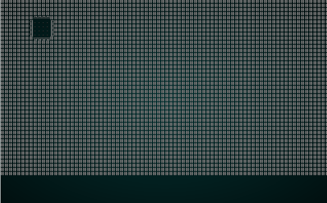

# BSP Room Dungeons

---

***About this tutorial***

*This tutorial is free and open source, and all code uses the MIT license - so you are free to do with it as you like. My hope is that you will enjoy the tutorial, and make great games!*

*If you enjoy this and would like me to keep writing, please consider supporting [my Patreon](https://www.patreon.com/blackfuture).*

---

A popular method of map generation uses "binary space partition" to sub-divide your map into rectangles of varying size, and then link the resulting rooms together into corridors. You can go a *long* way with this method: Nethack uses it extensively, Dungeon Crawl: Stone Soup uses it sometimes, and my project - One Knight in the Dungeon - uses it for sewer levels. This chapter will use the visualizer from the previous chapter to walk you through using this technique.

## Implementing a new map - subdivided BSP, the boilerplate

We'll start by making a new file in `map_builders` - `bsp_dungeon.rs`. We start by making the basic `BspDungeonBuilder` struct:

```rust
pub struct BspDungeonBuilder {
    map : Map,
    starting_position : Position,
    depth: i32,
    rooms: Vec<Rect>,
    history: Vec<Map>,
    rects: Vec<Rect>
}
```

This is basically the same as the one from `SimpleMapBuilder` - and we've kept the `rooms` vector, because this method uses a concept of rooms as well. We've added a `rects` vector: the algorithm uses this a lot, so it's helpful to make it available throughout the implementation. We'll see why it's needed shortly.

Now we implement the `MapBuilder` trait to the type:

```rust
impl MapBuilder for BspDungeonBuilder {
    fn get_map(&self) -> Map {
        self.map.clone()
    }

    fn get_starting_position(&self) -> Position {
        self.starting_position.clone()
    }

    fn get_snapshot_history(&self) -> Vec<Map> {
        self.history.clone()
    }

    fn build_map(&mut self)  {
        // We should do something here
    }

    fn spawn_entities(&mut self, ecs : &mut World) {
        for room in self.rooms.iter().skip(1) {
            spawner::spawn_room(ecs, room, self.depth);
        }
    }

    fn take_snapshot(&mut self) {
        if SHOW_MAPGEN_VISUALIZER {
            let mut snapshot = self.map.clone();
            for v in snapshot.revealed_tiles.iter_mut() {
                *v = true;
            }
            self.history.push(snapshot);
        }
    }
}
```

This is also pretty much the same as `SimpleMapBuilder`, but `build_map` has a comment reminding us to write some code. If you ran the generator right now, you'd get a solid blob of walls - and no content whatsoever.

We also need to implement a *constructor* for `BspMapBuilder`. Once again, it's basically the same as `SimpleMapBuilder`:

```rust
impl BspDungeonBuilder {
    pub fn new(new_depth : i32) -> BspDungeonBuilder {
        BspDungeonBuilder{
            map : Map::new(new_depth),
            starting_position : Position{ x: 0, y : 0 },
            depth : new_depth,
            rooms: Vec::new(),
            history: Vec::new(),
            rects: Vec::new()
        }
    }
}
```

Lastly, we'll open `map_builders/mod.rs` and change the `random_builder` function to always return our new map type:

```rust
pub fn random_builder(new_depth: i32) -> Box<dyn MapBuilder> {
    // Note that until we have a second map type, this isn't even slighlty random
    Box::new(BspDungeonBuilder::new(new_depth))
}
```

Once again, this isn't in the slightest bit random - but it's far easier to develop a feature that always runs, rather than keeping trying until it picks the one we want to debug!

## Building the map creator

We'll worry about swapping out map types later. Onto making the map! Note that this implementation is ported from my C++ game, *One Knight in the Dungeon*. We'll start with room generation. Inside our `impl BspMapBuilder`, we add a new function:

```rust
fn build(&mut self) {
    let mut rng = RandomNumberGenerator::new();

    self.rects.clear();
    self.rects.push( Rect::new(2, 2, self.map.width-5, self.map.height-5) ); // Start with a single map-sized rectangle
    let first_room = self.rects[0];
    self.add_subrects(first_room); // Divide the first room

    // Up to 240 times, we get a random rectangle and divide it. If its possible to squeeze a
    // room in there, we place it and add it to the rooms list.
    let mut n_rooms = 0;
    while n_rooms < 240 {
        let rect = self.get_random_rect(&mut rng);
        let candidate = self.get_random_sub_rect(rect, &mut rng);

        if self.is_possible(candidate) {
            apply_room_to_map(&mut self.map, &candidate);
            self.rooms.push(candidate);
            self.add_subrects(rect);
            self.take_snapshot();
        }

        n_rooms += 1;
    }
    let start = self.rooms[0].center();
    self.starting_position = Position{ x: start.0, y: start.1 };
}
```

So what on Earth does this do?

1. We clear the `rects` structure we created as part of the builder. This will be used to store rectangles derived from the overall map.
2. We create the "first room" - which is really the whole map. We've trimmed a bit to add some padding to the sides of the map.
3. We call `add_subrects`, passing it the rectangle list - and the first room. We'll implement that in a minute, but what it does is: it divides the rectangle into four quadrants, and adds each of the quadrants to the rectangle list.
4. Now we setup a room counter, so we don't infinitely loop.
5. While that counter is less than 240 (a relatively arbitrary limit that gives fun results):
    1. We call `get_random_rect` to retrieve a random rectangle from the rectangles list.
    2. We call `get_random_sub_rect` using this rectangle as an outer boundary. It creates a random room from 3 to 10 tiles in size (on each axis), somewhere within the parent rectangle.
    3. We ask `is_possible` if the candidate can be drawn to the map; every tile must be within the map boundaries, and not already a room. If it IS possible:
        1. We mark it on the map.
        2. We add it to the rooms list.
        3. We call `add_subrects` to sub-divide the rectangle we just used (not the candidate!).

There's quite a few support functions in play here, so lets go through them.

```rust
fn add_subrects(&mut self, rect : Rect) {
    let width = i32::abs(rect.x1 - rect.x2);
    let height = i32::abs(rect.y1 - rect.y2);
    let half_width = i32::max(width / 2, 1);
    let half_height = i32::max(height / 2, 1);

    self.rects.push(Rect::new( rect.x1, rect.y1, half_width, half_height ));
    self.rects.push(Rect::new( rect.x1, rect.y1 + half_height, half_width, half_height ));
    self.rects.push(Rect::new( rect.x1 + half_width, rect.y1, half_width, half_height ));
    self.rects.push(Rect::new( rect.x1 + half_width, rect.y1 + half_height, half_width, half_height ));
}
```

The function `add_subrects` is core to the BSP (Binary Space Partition) approach: it takes a rectangle, and divides the width and height in half. It then creates four new rectangles, one for each quadrant of the original. These are added to the `rects` list. Graphically:

```
###############        ###############
#             #        #  1   +   2  #
#             #        #      +      #
#      0      #   ->   #+++++++++++++#
#             #        #   3  +   4  #
#             #        #      +      #
###############        ###############
```

Next up is `get_random_rect`:

```rust
fn get_random_rect(&mut self, rng : &mut RandomNumberGenerator) -> Rect {
    if self.rects.len() == 1 { return self.rects[0]; }
    let idx = (rng.roll_dice(1, self.rects.len() as i32)-1) as usize;
    self.rects[idx]
}
```

This is a simple function. If there is only one rectangle in the `rects` list, it returns the first one. Otherwise, it rolls a dice for of `1d(size of rects list)` and returns the rectangle found at the random index.

Next up is `get_random_sub_rect`:

```rust
fn get_random_sub_rect(&self, rect : Rect, rng : &mut RandomNumberGenerator) -> Rect {
    let mut result = rect;
    let rect_width = i32::abs(rect.x1 - rect.x2);
    let rect_height = i32::abs(rect.y1 - rect.y2);

    let w = i32::max(3, rng.roll_dice(1, i32::min(rect_width, 10))-1) + 1;
    let h = i32::max(3, rng.roll_dice(1, i32::min(rect_height, 10))-1) + 1;

    result.x1 += rng.roll_dice(1, 6)-1;
    result.y1 += rng.roll_dice(1, 6)-1;
    result.x2 = result.x1 + w;
    result.y2 = result.y1 + h;

    result
}
```

So this takes a rectangle as the parameter, and makes a mutable copy to use as the result. It calculates the width and height of the rectangle, and then produces a *random* width and height inside that rectangle - but no less than 3 tiles in size and no more than 10 on each dimension. You can tweak those numbers to change your desired room size. It then shunts the rectangle a bit, to provide some random placement (otherwise, it would always be against the sides of the sub-rectangle). Finally, it returns the result. Graphically:

```
###############        ########
#             #        #   1  #
#             #        #      #
#      0      #   ->   ########
#             #
#             #
###############
```

Finally, the `is_possible` function:

```rust
fn is_possible(&self, rect : Rect) -> bool {
    let mut expanded = rect;
    expanded.x1 -= 2;
    expanded.x2 += 2;
    expanded.y1 -= 2;
    expanded.y2 += 2;

    let mut can_build = true;

    for y in expanded.y1 ..= expanded.y2 {
        for x in expanded.x1 ..= expanded.x2 {
            if x > self.map.width-2 { can_build = false; }
            if y > self.map.height-2 { can_build = false; }
            if x < 1 { can_build = false; }
            if y < 1 { can_build = false; }
            if can_build {
                let idx = self.map.xy_idx(x, y);
                if self.map.tiles[idx] != TileType::Wall { 
                    can_build = false; 
                }
            }
        }
    }

    can_build
}
```

This is a little more complicated, but makes sense when you break it down:

1. Take a rectangle as a target, representing the room we are looking at.
2. Create a mutable copy of the rectangle called `expanded`. We then expand the rectangle out by 2 tiles in each direction, to prevent rooms from overlapping.
3. We iterate every `x` and `y` coordinate in the rectangle:
    1. If `x` or `y` are out of the map boundaries, we mark `can_build` as `false` - this won't work.
    2. If we still *can* build it, we look at the existing map - if it isn't a solid wall, then we've overlapped an existing room, and mark that we can't build.
4. We return the result of `can_build`.

So now that we've implemented all of these, the overall algorithm is more obvious:

1. We start with a single rectangle covering the entire map.
2. We sub-divide it, so now our map has 5 rectangles - one for each quadrant, one for the map as a whole.
3. We use a counter to ensure that we don't loop forever (we'll reject a lot of rooms). While we can still add rooms, we:
    1. Obtain a random rectangle from the rectangles list. Initially, this will be one of the quadrants - or the whole map. This list will keep growing as we add subdivisions.
    2. We generate a random sub-rectangle inside this rectangle.
    3. We look to see if that's a possible room. If it is, we:
        1. Apply the room to the map (build it).
        2. Add it to the rooms list.
        3. Sub-divide the *new* rectangle into quadrants and add those to our rectangles list.
        4. Store a snapshot for the visualizer.

This tends to give a nice spread of rooms, and they are guaranteed not to overlap. Very Nethack like!

If you `cargo run` now, you will be in a room with no exits. You'll get to watch rooms appear around the map in the visualizer. That's a great start.




## Adding in corridors

Now, we sort the rooms by left coordinate. You don't *have* to do this, but it helps make connected rooms line up.

```rust
self.rooms.sort_by(|a,b| a.x1.cmp(&b.x1) );
```

`sort_by` takes a *closure* - that is, an inline function (known as a "lambda" in other languages) as a parameter. You could specify a whole other function if you wanted to, or implement traits on `Rect` to make it sortable - but this is easy enough. It sorts by comparing the `x1` value of each rectangle.

Now we'll add some corridors:

```rust
// Now we want corridors
for i in 0..self.rooms.len()-1 {
    let room = self.rooms[i];
    let next_room = self.rooms[i+1];
    let start_x = room.x1 + (rng.roll_dice(1, i32::abs(room.x1 - room.x2))-1);
    let start_y = room.y1 + (rng.roll_dice(1, i32::abs(room.y1 - room.y2))-1);
    let end_x = next_room.x1 + (rng.roll_dice(1, i32::abs(next_room.x1 - next_room.x2))-1);
    let end_y = next_room.y1 + (rng.roll_dice(1, i32::abs(next_room.y1 - next_room.y2))-1);
    self.draw_corridor(start_x, start_y, end_x, end_y);
    self.take_snapshot();
}
```

This iterates the rooms list, ignoring the last one. It fetches the current room, and the next one in the list and calculates a random location (`start_x`/`start_y` and `end_x`/`end_y`) within each room. It then calls the mysterious `draw_corridor` function with these coordinates. Draw corridor adds a line from the start to the end, using only north/south or east/west (it can give 90-degree bends). It won't give you a staggered, hard to navigate perfect line like Bresenham would. We also take a snapshot.

The `draw_corridor` function is quite simple:

```rust
fn draw_corridor(&mut self, x1:i32, y1:i32, x2:i32, y2:i32) {
    let mut x = x1;
    let mut y = y1;

    while x != x2 || y != y2 {
        if x < x2 {
            x += 1;
        } else if x > x2 {
            x -= 1;
        } else if y < y2 {
            y += 1;
        } else if y > y2 {
            y -= 1;
        }

        let idx = self.map.xy_idx(x, y);
        self.map.tiles[idx] = TileType::Floor;
    }
}
```

It takes a start and end point, and creates mutable `x` and `y` variables equal to the starting location. Then it keeps going until `x` and `y` match end end of the line. For each iteration, if `x` is less than the ending `x` - it goes left. If `x` is greater than the ending `x` - it goes right. Same for `y`, but with up and down. This gives straight corridors with a single corner.

## Don't forget the stairs (I nearly did!)

Finally, we need to wrap up and create the exit:

```rust
// Don't forget the stairs
let stairs = self.rooms[self.rooms.len()-1].center();
let stairs_idx = self.map.xy_idx(stairs.0, stairs.1);
self.map.tiles[stairs_idx] = TileType::DownStairs;
```

We place the exit in the last room, guaranteeing that the poor player has a ways to walk.

If you `cargo run` now, you'll see something like this:

.

## Randomizing the dungeon per level

Rather than *always* using the BSP sewer algorithm, we would like to sometimes use one or the other. In `map_builders/mod.rs`, replace the `build` function:

```rust
pub fn random_builder(new_depth: i32) -> Box<dyn MapBuilder> {
    let mut rng = rltk::RandomNumberGenerator::new();
    let builder = rng.roll_dice(1, 2);
    match builder {
        1 => Box::new(BspDungeonBuilder::new(new_depth)),
        _ => Box::new(SimpleMapBuilder::new(new_depth))
    }
}
```

Now when you play, it's a coin toss what type of map you encounter. The `spawn` functions for the types are the same - so we're not going to worry about map builder state until the next chapter.

## Wrap-Up

You've refactored your map building into a new module, and built a simple BSP (Binary Space Partitioning) based map. The game randomly picks a map type, and you have more variety. The next chapter will further refactor map generation, and introduce another technique.

**The source code for this chapter may be found [here](https://github.com/thebracket/rustrogueliketutorial/tree/master/chapter-25-bsproom-dungeons)**


[Run this chapter's example with web assembly, in your browser (WebGL2 required)](http://bfnightly.bracketproductions.com/rustbook/wasm/chapter-25-bsproom-dungeons/)
---

Copyright (C) 2019, Herbert Wolverson.

---