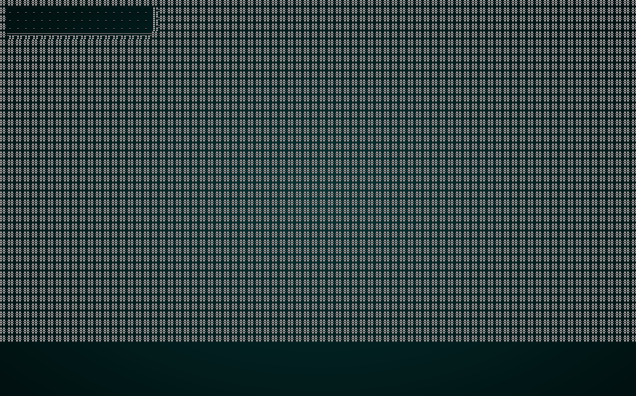
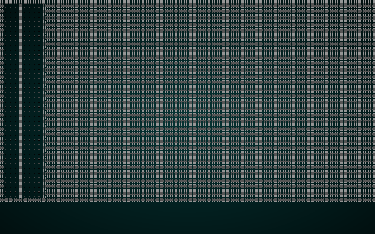

# BSP Interior Design

---

***About this tutorial***

*This tutorial is free and open source, and all code uses the MIT license - so you are free to do with it as you like. My hope is that you will enjoy the tutorial, and make great games!*

*If you enjoy this and would like me to keep writing, please consider supporting [my Patreon](https://www.patreon.com/blackfuture).*

---

In the last chapter, we used binary space partition (BSP) to build a dungeon with rooms. BSP is flexible, and can help you with a lot of problems; in this example, we're going to modify BSP to design an interior dungeon - completely inside a rectangular structure (for example, a castle) and with no wasted space other than interior walls.

The code for this chapter is converted from *One Knight in the Dungeon*'s prison levels.

## Scaffolding

We'll start by making a new file, `map_builders/bsp_interior.rs` and putting in the same initial boilerplate that we used in the previous chapter:

```rust
use super::{MapBuilder, Map, Rect, apply_room_to_map, 
    TileType, Position, spawner, SHOW_MAPGEN_VISUALIZER};
use rltk::RandomNumberGenerator;
use specs::prelude::*;

pub struct BspInteriorBuilder {
    map : Map,
    starting_position : Position,
    depth: i32,
    rooms: Vec<Rect>,
    history: Vec<Map>,
    rects: Vec<Rect>
}

impl MapBuilder for BspInteriorBuilder {
    fn get_map(&self) -> Map {
        self.map.clone()
    }

    fn get_starting_position(&self) -> Position {
        self.starting_position.clone()
    }

    fn get_snapshot_history(&self) -> Vec<Map> {
        self.history.clone()
    }

    fn build_map(&mut self)  {
        // We should do something here
    }

    fn spawn_entities(&mut self, ecs : &mut World) {
        for room in self.rooms.iter().skip(1) {
            spawner::spawn_room(ecs, room, self.depth);
        }
    }

    fn take_snapshot(&mut self) {
        if SHOW_MAPGEN_VISUALIZER {
            let mut snapshot = self.map.clone();
            for v in snapshot.revealed_tiles.iter_mut() {
                *v = true;
            }
            self.history.push(snapshot);
        }
    }
}

impl BspInteriorBuilder {
    pub fn new(new_depth : i32) -> BspInteriorBuilder {
        BspInteriorBuilder{
            map : Map::new(new_depth),
            starting_position : Position{ x: 0, y : 0 },
            depth : new_depth,
            rooms: Vec::new(),
            history: Vec::new(),
            rects: Vec::new()
        }
    }
}
```

We'll also change our random builder function in `map_builders/mod.rs` to once again lie to the user and always "randomly" pick the new algorithm:

```rust
pub fn random_builder(new_depth: i32) -> Box<dyn MapBuilder> {
    /*let mut rng = rltk::RandomNumberGenerator::new();
    let builder = rng.roll_dice(1, 2);
    match builder {
        1 => Box::new(BspDungeonBuilder::new(new_depth)),
        _ => Box::new(SimpleMapBuilder::new(new_depth))
    }*/
    Box::new(BspInteriorBuilder::new(new_depth))
}
```

## Subdividing into rooms

We're not going to achieve a *perfect* subdivision due to rounding issues, but we can get pretty close. Certainly good enough for a game! We put together a `build` function that is quite similar to the one from the previous chapter:

```rust
fn build(&mut self) {
    let mut rng = RandomNumberGenerator::new();

    self.rects.clear();
    self.rects.push( Rect::new(1, 1, self.map.width-2, self.map.height-2) ); // Start with a single map-sized rectangle
    let first_room = self.rects[0];
    self.add_subrects(first_room, &mut rng); // Divide the first room

    let rooms = self.rects.clone();
    for r in rooms.iter() {
        let room = *r;
        //room.x2 -= 1;
        //room.y2 -= 1;
        self.rooms.push(room);
        for y in room.y1 .. room.y2 {
            for x in room.x1 .. room.x2 {
                let idx = self.map.xy_idx(x, y);
                if idx > 0 && idx < ((self.map.width * self.map.height)-1) as usize {
                    self.map.tiles[idx] = TileType::Floor;
                }
            }
        }
        self.take_snapshot();
    }

    let start = self.rooms[0].center();
    self.starting_position = Position{ x: start.0, y: start.1 };
}
```

Lets look at what this does:

1. We create a new random number generator.
2. We clear the `rects` list, and add a rectangle covering the whole map we intend to use.
3. We call a magical function `add_subrects` on this rectangle. More on that in a minute.
4. We copy the rooms list, to avoid borring issues.
5. For each room, we add it to the rooms list - and carve it out of the map. We also take a snapshot.
6. We start the player in the first room.

The `add_subrects` function in this case does all the hard work:

```rust
fn add_subrects(&mut self, rect : Rect, rng : &mut RandomNumberGenerator) {
    // Remove the last rect from the list
    if !self.rects.is_empty() {
        self.rects.remove(self.rects.len() - 1);
    }

    // Calculate boundaries
    let width  = rect.x2 - rect.x1;
    let height = rect.y2 - rect.y1;
    let half_width = width / 2;
    let half_height = height / 2;

    let split = rng.roll_dice(1, 4);

    if split <= 2 {
        // Horizontal split
        let h1 = Rect::new( rect.x1, rect.y1, half_width-1, height );
        self.rects.push( h1 );
        if half_width > MIN_ROOM_SIZE { self.add_subrects(h1, rng); }
        let h2 = Rect::new( rect.x1 + half_width, rect.y1, half_width, height );
        self.rects.push( h2 );
        if half_width > MIN_ROOM_SIZE { self.add_subrects(h2, rng); }
    } else {
        // Vertical split
        let v1 = Rect::new( rect.x1, rect.y1, width, half_height-1 );
        self.rects.push(v1);
        if half_height > MIN_ROOM_SIZE { self.add_subrects(v1, rng); }
        let v2 = Rect::new( rect.x1, rect.y1 + half_height, width, half_height );
        self.rects.push(v2);
        if half_height > MIN_ROOM_SIZE { self.add_subrects(v2, rng); }
    }
}
```

Lets take a look at what this function does:

1. If the `rects` list isn't empty, we remove the last item from the list. This has the effect of removing the last rectangle we added - so when we start, we are removing the rectangle covering the *whole* map. Later on, we are removing a rectangle because we are dividing it. This way, we won't have overlaps.
2. We calculate the width and height of the rectangle, and well as half of the width and height.
3. We roll a dice. There's a 50% chance of a horizontal or vertical split.
4. If we're splitting horizontally:
    1. We make `h1` - a new rectangle. It covers the left half of the parent rectangle.
    2. We add `h1` to the `rects` list.
    3. If `half_width` is bigger than `MIN_ROOM_SIZE`, we recursively call `add_subrects` again, with `h1` as the target rectangle.
    4. We make `h2` - a new rectangle covering the right side of the parent rectangle.
    5. We add `h2` to the `rects` list.
    6. If `half_width` is bigger than `MIN_ROOM_SIZE`, we recursively call `add_subrects` again, with `h2` as the target rectangle.
5. If we're splitting vertically, it's the same as (4) - but with top and bottom rectangles.

Conceptually, this starts with a rectangle:
```
#################################
#                               #
#                               #
#                               #
#                               #
#                               #
#                               #
#                               #
#                               #
#                               #
#################################
```

A horizontal split would yield the following:

```
#################################
#              #                #
#              #                #
#              #                #
#              #                #
#              #                #
#              #                #
#              #                #
#              #                #
#              #                #
#################################
```

The next split might be vertical:

```
#################################
#              #                #
#              #                #
#              #                #
#              #                #
################                #
#              #                #
#              #                #
#              #                #
#              #                #
#################################
```

This repeats until we have a lot of small rooms.

You can `cargo run` the code right now, to see the rooms appearing.



## Adding some doorways

It's all well and good to have rooms, but without doors connecting them it's not going to be a very fun experience! Fortunately, the *exact same code* from the previous chapter will work here, also.

```rust
// Now we want corridors
for i in 0..self.rooms.len()-1 {
    let room = self.rooms[i];
    let next_room = self.rooms[i+1];
    let start_x = room.x1 + (rng.roll_dice(1, i32::abs(room.x1 - room.x2))-1);
    let start_y = room.y1 + (rng.roll_dice(1, i32::abs(room.y1 - room.y2))-1);
    let end_x = next_room.x1 + (rng.roll_dice(1, i32::abs(next_room.x1 - next_room.x2))-1);
    let end_y = next_room.y1 + (rng.roll_dice(1, i32::abs(next_room.y1 - next_room.y2))-1);
    self.draw_corridor(start_x, start_y, end_x, end_y);
    self.take_snapshot();
}
```

This in turn calls the unchanged `draw_corridor` function:

```rust
fn draw_corridor(&mut self, x1:i32, y1:i32, x2:i32, y2:i32) {
    let mut x = x1;
    let mut y = y1;

    while x != x2 || y != y2 {
        if x < x2 {
            x += 1;
        } else if x > x2 {
            x -= 1;
        } else if y < y2 {
            y += 1;
        } else if y > y2 {
            y -= 1;
        }

        let idx = self.map.xy_idx(x, y);
        self.map.tiles[idx] = TileType::Floor;
    }
}
```

## Don't forget the stairs (I nearly did, AGAIN!)

Finally, we need to wrap up and create the exit:

```rust
// Don't forget the stairs
let stairs = self.rooms[self.rooms.len()-1].center();
let stairs_idx = self.map.xy_idx(stairs.0, stairs.1);
self.map.tiles[stairs_idx] = TileType::DownStairs;
```

We place the exit in the last room, guaranteeing that the poor player has a ways to walk.

If you `cargo run` now, you'll see something like this:

.

## Restoring randomness - again

Lastly, we go back to `map_builders/mod.rs` and edit our `random_builder` to once gain provide a random dungeon per level:

```rust
pub fn random_builder(new_depth: i32) -> Box<dyn MapBuilder> {
    let mut rng = rltk::RandomNumberGenerator::new();
    let builder = rng.roll_dice(1, 3);
    match builder {
        1 => Box::new(BspDungeonBuilder::new(new_depth)),
        2 => Box::new(BspInteriorBuilder::new(new_depth)),
        _ => Box::new(SimpleMapBuilder::new(new_depth))
    }
}
```

## Wrap Up

This type of dungeon can represent an interior, maybe of a space ship, a castle, or even a home. You can tweak dimensions, door placement, and bias the splitting as you see fit - but you'll get a map that makes most of the available space usable by the game. It's probably worth being sparing with these levels (or incorporating them into other levels) - they can lack variety, even though they are random.

**The source code for this chapter may be found [here](https://github.com/thebracket/rustrogueliketutorial/tree/master/chapter-26-bsp-interiors)**


[Run this chapter's example with web assembly, in your browser (WebGL2 required)](https://bfnightly.bracketproductions.com/rustbook/wasm/chapter-26-bsp-interiors/)
---

Copyright (C) 2019, Herbert Wolverson.

---