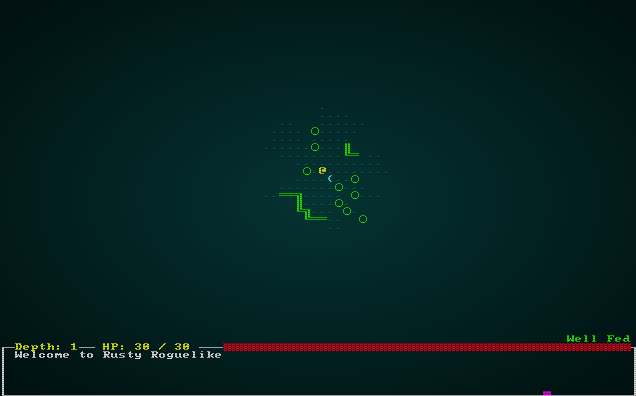

# Cellular Automata Maps

---

***About this tutorial***

*This tutorial is free and open source, and all code uses the MIT license - so you are free to do with it as you like. My hope is that you will enjoy the tutorial, and make great games!*

*If you enjoy this and would like me to keep writing, please consider supporting [my Patreon](https://www.patreon.com/blackfuture).*

---

Sometimes, you need a break from rectangular rooms. You might want a nice, organic looking cavern; a winding forest trail, or a spooky quarry. *One Knight in the Dungeon* uses cellular automata for this purpose, inspired by [this excellent article](http://www.roguebasin.com/index.php?title=Cellular_Automata_Method_for_Generating_Random_Cave-Like_Levels). This chapter will help you create natural looking maps.

## Scaffolding

Once again, we're going to take a bunch of code from the previous tutorial and re-use it for the new generator. Create a new file, `map_builders/cellular_automata.rd` and place the following in it:

```rust
use super::{MapBuilder, Map, Rect, apply_room_to_map, 
    TileType, Position, spawner, SHOW_MAPGEN_VISUALIZER};
use rltk::RandomNumberGenerator;
use specs::prelude::*;

const MIN_ROOM_SIZE : i32 = 8;

pub struct CellularAutomataBuilder {
    map : Map,
    starting_position : Position,
    depth: i32,
    history: Vec<Map>
}

impl MapBuilder for CellularAutomataBuilder {
    fn get_map(&self) -> Map {
        self.map.clone()
    }

    fn get_starting_position(&self) -> Position {
        self.starting_position.clone()
    }

    fn get_snapshot_history(&self) -> Vec<Map> {
        self.history.clone()
    }

    fn build_map(&mut self)  {
        //self.build(); - we should write this
    }

    fn spawn_entities(&mut self, ecs : &mut World) {
        // We need to rewrite this, too.
    }

    fn take_snapshot(&mut self) {
        if SHOW_MAPGEN_VISUALIZER {
            let mut snapshot = self.map.clone();
            for v in snapshot.revealed_tiles.iter_mut() {
                *v = true;
            }
            self.history.push(snapshot);
        }
    }
}

impl CellularAutomataBuilder {
    pub fn new(new_depth : i32) -> CellularAutomataBuilder {
        CellularAutomataBuilder{
            map : Map::new(new_depth),
            starting_position : Position{ x: 0, y : 0 },
            depth : new_depth,
            history: Vec::new(),
        }
    }
}
```

Once again, we'll make the name `random_builder` a lie and only return the one we're working on:

```rust
pub fn random_builder(new_depth: i32) -> Box<dyn MapBuilder> {
    /*let mut rng = rltk::RandomNumberGenerator::new();
    let builder = rng.roll_dice(1, 3);
    match builder {
        1 => Box::new(BspDungeonBuilder::new(new_depth)),
        2 => Box::new(BspInteriorBuilder::new(new_depth)),
        _ => Box::new(SimpleMapBuilder::new(new_depth))
    }*/
    Box::new(CellularAutomataBuilder::new(new_depth))
}
```

## Putting together the basic map

The first step is to make the map completely chaotic, with about 55% of tiles being solid. You can tweak that number for different effects, but I quite like the result. Here's the `build` function:

```rust
fn build(&mut self) {
        let mut rng = RandomNumberGenerator::new();

        // First we completely randomize the map, setting 55% of it to be floor.
        for y in 1..self.map.height-1 {
            for x in 1..self.map.width-1 {
                let roll = rng.roll_dice(1, 100);
                let idx = self.map.xy_idx(x, y);
                if roll > 55 { self.map.tiles[idx] = TileType::Floor } 
                else { self.map.tiles[idx] = TileType::Wall }
            }
        }
        self.take_snapshot();
}
```

This makes a *mess* of an unusable level. Walls and floors everywhere with no rhyme or reason to them - and utterly unplayable. That's ok, because *cellular automata* is designed to make a level out of noise. It works by iterating each cell, counting the number of neighbors, and turning walls into floors or walls based on density. Here's a working builder:

```rust
fn build(&mut self) {
    let mut rng = RandomNumberGenerator::new();

    // First we completely randomize the map, setting 55% of it to be floor.
    for y in 1..self.map.height-1 {
        for x in 1..self.map.width-1 {
            let roll = rng.roll_dice(1, 100);
            let idx = self.map.xy_idx(x, y);
            if roll > 55 { self.map.tiles[idx] = TileType::Floor } 
            else { self.map.tiles[idx] = TileType::Wall }
        }
    }
    self.take_snapshot();

    // Now we iteratively apply cellular automata rules
    for _i in 0..15 {
        let mut newtiles = self.map.tiles.clone();

        for y in 1..self.map.height-1 {
            for x in 1..self.map.width-1 {
                let idx = self.map.xy_idx(x, y);
                let mut neighbors = 0;
                if self.map.tiles[idx - 1] == TileType::Wall { neighbors += 1; }
                if self.map.tiles[idx + 1] == TileType::Wall { neighbors += 1; }
                if self.map.tiles[idx - self.map.width as usize] == TileType::Wall { neighbors += 1; }
                if self.map.tiles[idx + self.map.width as usize] == TileType::Wall { neighbors += 1; }
                if self.map.tiles[idx - (self.map.width as usize - 1)] == TileType::Wall { neighbors += 1; }
                if self.map.tiles[idx - (self.map.width as usize + 1)] == TileType::Wall { neighbors += 1; }
                if self.map.tiles[idx + (self.map.width as usize - 1)] == TileType::Wall { neighbors += 1; }
                if self.map.tiles[idx + (self.map.width as usize + 1)] == TileType::Wall { neighbors += 1; }

                if neighbors > 4 || neighbors == 0 {
                    newtiles[idx] = TileType::Wall;
                }
                else {
                    newtiles[idx] = TileType::Floor;
                }
            }
        }

        self.map.tiles = newtiles.clone();
        self.take_snapshot();
    }
}
```

This is actually very simple:

1. We randomize the map, as above.
2. We count from 0 to 9, for 10 iterations of the algorithm.
3. For each iteration:
    1. We take a copy of the map tiles, placing it into `newtiles`. We do this so we aren't writing to the tiles we are counting, which gives a very odd map.
    2. We iterate every cell on the map, and count the number of tiles neighboring the tile that are walls.
    3. If there are more than 4, or zero, neighboring walls - then the tile (in `newtiles`) becomes a wall. Otherwise, it becomes a floor.
    4. We copy the `newtiles` back into the `map`.
    5. We take a snapshot.

This is a *very* simple algorithm - but produces quite beautiful results. Here it is in action:

.

## Picking a starting point

Picking a starting point for the player is a little more difficult than it has been in previous chapters. We don't have a list of rooms to query! Instead, we'll start in the middle and move left until we hit some open space. The code for this is quite simple:

```rust
// Find a starting point; start at the middle and walk left until we find an open tile
self.starting_position = Position{ x: self.map.width / 2, y : self.map.height / 2 };
let mut start_idx = self.map.xy_idx(self.starting_position.x, self.starting_position.y);
while self.map.tiles[start_idx] != TileType::Floor {
    self.starting_position.x -= 1;
    start_idx = self.map.xy_idx(self.starting_position.x, self.starting_position.y);
}
```

## Placing an exit - and culling unreachable areas

We want the exit to be quite a way away from the player. We also don't want to keep areas that the player absolutely can't reach. Fortunately, the process to find an exit and the process to find orphans are quite similar. We can use a *Dijkstra Map*. If you haven't already read it, I recommend reading [The Incredible Power of Dijkstra Maps](http://www.roguebasin.com/index.php?title=The_Incredible_Power_of_Dijkstra_Maps). Fortunately, RLTK implements a very fast version of Dijkstra for you, so you won't have to fight with the algorithm. Here's the code:

```rust
// Find all tiles we can reach from the starting point
let map_starts : Vec<usize> = vec![start_idx];
let dijkstra_map = rltk::DijkstraMap::new(self.map.width, self.map.height, &map_starts , &self.map, 200.0);
let mut exit_tile = (0, 0.0f32);
for (i, tile) in self.map.tiles.iter_mut().enumerate() {
    if *tile == TileType::Floor {
        let distance_to_start = dijkstra_map.map[i];
        // We can't get to this tile - so we'll make it a wall
        if distance_to_start == std::f32::MAX {
            *tile = TileType::Wall;
        } else {
            // If it is further away than our current exit candidate, move the exit
            if distance_to_start > exit_tile.1 {
                exit_tile.0 = i;
                exit_tile.1 = distance_to_start;
            }
        }
    }
}
self.take_snapshot();

self.map.tiles[exit_tile.0] = TileType::DownStairs;
self.take_snapshot();
```

This is a dense piece of code that does a lot, lets walk through it:

1. We create a vector called `map_starts` and give it a single value: the tile index on which the player starts. Dijkstra maps can have multiple starting points (distance 0), so this has to be a vector even though there is only one choice.
2. We ask RLTK to make a Dijkstra Map for us. It has dimensions that match the main map, uses the starts, has read access to the map itself, and we'll stop counting at 200 steps (a safety feature in case of runaways!)
3. We set an `exit_tile` `tuple` to `0` and `0.0`. The first zero is the tile index of the exit, the second zero is the distance to the exit.
4. We iterate the map tiles, using Rust's *awesome* enumerate feature. By adding `.enumerate()` to the end of a range iteration, it adds the cell index as the first parameter in a tuple. We then de-structure to obtain both the tile and the index.
5. If the tile is a floor,
6. We obtain the distance to the starting point from the Dijkstra map.
7. If the distance is the maximum value for an `f32` (a marker the Dijkstra map uses for "unreachable"), then it doesn't need to be a floor at all - nobody can get there. So we turn it into a wall.
8. If the distance is greater than the distance in our `exit_tile` tuple, we store both the new distance and the new tile index.
9. Once we've visited every tile, we take a snapshot to show the removed area.
10. We set the tile at the `exit_tile` (most distant *reachable* tile) to be a downward staircase.

If you `cargo run`, you actually have quite a playable map now! There's just one problem: there are no other entities on the map.

## Populating our cave: freeing the spawn system from rooms.

If we were feeling lazy, we could simply iterate the map - find open spaces and have a random chance to spawn something. But that's not really very much fun. It makes more sense for monsters to be grouped together, with some "dead spaces" so you can catch your breath (and regain some health).

As a first step, we're going to revisit how we spawn entities. Right now, pretty much everything that isn't the player arrives into the world via the `spawner.rs`-provided `spawn_room` function. It has served us well up to now, but we want to be a bit more flexible; we might want to spawn in corridors, we might want to spawn in semi-open areas that don't fit a rectangle, and so on. Also, a look over `spawn_room` shows that it does several things in one function - which isn't the best design. A final objective is to *keep* the `spawn_room` *interface* available - so we can still use it, but to also offer more detailed options.

The first thing we'll do is separate out the actual spawning:

```rust
/// Spawns a named entity (name in tuple.1) at the location in (tuple.0)
fn spawn_entity(ecs: &mut World, spawn : &(&usize, &String)) {
    let x = (*spawn.0 % MAPWIDTH) as i32;
    let y = (*spawn.0 / MAPWIDTH) as i32;

    match spawn.1.as_ref() {
        "Goblin" => goblin(ecs, x, y),
        "Orc" => orc(ecs, x, y),
        "Health Potion" => health_potion(ecs, x, y),
        "Fireball Scroll" => fireball_scroll(ecs, x, y),
        "Confusion Scroll" => confusion_scroll(ecs, x, y),
        "Magic Missile Scroll" => magic_missile_scroll(ecs, x, y),
        "Dagger" => dagger(ecs, x, y),
        "Shield" => shield(ecs, x, y),
        "Longsword" => longsword(ecs, x, y),
        "Tower Shield" => tower_shield(ecs, x, y),
        "Rations" => rations(ecs, x, y),
        "Magic Mapping Scroll" => magic_mapping_scroll(ecs, x, y),
        "Bear Trap" => bear_trap(ecs, x, y),
        _ => {}
    }
}
```

Now we can replace the last `for` loop in `spawn_room` with the following:

```rust
// Actually spawn the monsters
for spawn in spawn_points.iter() {
    spawn_entity(ecs, &spawn);
}
```

Now, we'll replace `spawn_room` with a simplified version that calls our theoretical function:

```rust
pub fn spawn_room(ecs: &mut World, room : &Rect, map_depth: i32) {
    let mut possible_targets : Vec<usize> = Vec::new();
    { // Borrow scope - to keep access to the map separated
        let map = ecs.fetch::<Map>();
        for y in room.y1 + 1 .. room.y2 {
            for x in room.x1 + 1 .. room.x2 {
                let idx = map.xy_idx(x, y);
                if map.tiles[idx] == TileType::Floor {
                    possible_targets.push(idx);
                }
            }
        }
    }

    spawn_region(ecs, &possible_targets, map_depth);
}
```

This function maintains the same interface/signature as the previous call - so our old code will still work. Instead of actually spawning anything, it builds a vector of all of the tiles in the room (checking that they are floors - something we didn't do before; monsters in walls is no longer possible!). It then calls a new function, `spawn_region` that accepts a similar signature - but wants a list of available tiles into which it *can* spawn things. Here's the new function:

```rust
pub fn spawn_region(ecs: &mut World, area : &[usize], map_depth: i32) {
    let spawn_table = room_table(map_depth);
    let mut spawn_points : HashMap<usize, String> = HashMap::new();
    let mut areas : Vec<usize> = Vec::from(area);

    // Scope to keep the borrow checker happy
    {
        let mut rng = ecs.write_resource::<RandomNumberGenerator>();
        let num_spawns = i32::min(areas.len() as i32, rng.roll_dice(1, MAX_MONSTERS + 3) + (map_depth - 1) - 3);
        if num_spawns == 0 { return; }

        for _i in 0 .. num_spawns {
            let array_index = if areas.len() == 1 { 0usize } else { (rng.roll_dice(1, areas.len() as i32)-1) as usize };
            let map_idx = areas[array_index];
            spawn_points.insert(map_idx, spawn_table.roll(&mut rng));
            areas.remove(array_index);
        }
    }

    // Actually spawn the monsters
    for spawn in spawn_points.iter() {
        spawn_entity(ecs, &spawn);
    }
}
```

This is similar to the previous spawning code, but not quite the same (although the results are basically the same!). We'll go through it, just to be sure we understand what we're doing:

1. We obtain a spawn table for the current map depth.
2. We setup a `HashMap` called `spawn_points`, listing pairs of data (map index and name tag) for everything we've decided to spawn.
3. We create a new `Vector` of areas, copied from the passed in *slice*. (A slice is a "view" of an array or vector). We're making a new one so we aren't modifying the parent area list. The caller *might* want to use that data for something else, and it's good to avoid changing people's data without asking. Changing data without warning is called a "side effect", and it's good to avoid them in general (unless you actually *want* them).
4. We make a new scope, because Rust doesn't like us using the ECS to obtain the random number generator, and then using it later to spawn entities. The scope makes Rust "forget" our first borrow as soon as it ends.
5. We obtain a random number generator from the ECS.
6. We calculate the number of entities to spawn. This is the same random function as we used before, but we've added an `i32::min` call: we want the smaller of EITHER the number of available tiles, OR the random calculation. This way, we'll never try to spawn more entities than we have room for.
7. If the number to spawn is zero, we bail out of the function (nothing to do, here!).
8. Repeating for zero to the number of spawns (minus 1 - we're not using an *inclusive* range):
    1. We pick an `array_index` from areas. If there is only one entry, we use it. Otherwise, we roll a dice (from 1 to the number of entries, subtract one because the array is zero-based).
    2. The `map_idx` (location in the map tiles array) is the *value* located at the `array_index` index of the array. So we obtain that.
    3. We insert a spawn into the `spawn_points` map, listing both the index and a random roll on the spawn table.
    4. We remove the entry we just used from `areas` - that way, we *can't* accidentally pick it again. Note that we're not checking to see if the array is empty: in step 6 above, we guaranteed that we won't spawn more entities than we have room for, so (at least in theory) that particular bug can't happen!

The best way to test this is to uncomment out the `random_builder` code (and comment the `CellularAutomataBuilder` entry) and give it a go. It should play just like before. Once you've tested it, go back to always spawning the map type we're working on.

## Grouped placement in our map - Enter the Voronoi!

[Voronoi Diagrams](https://en.wikipedia.org/wiki/Voronoi_diagram#targetText=In%20mathematics%2C%20a%20Voronoi%20diagram,specific%20subset%20of%20the%20plane.) are a wonderfully useful piece of math. Given a group of points, it builds a diagram of regions surrounding each point (which could be random, or might mean something; that's the beauty of math, it's up to you!) - with no empty space. We'd like to do something similar for our maps: subdivide the map into random regions, and spawn *inside* those regions. Fortunately, RLTK provides a type of *noise* to help with that: cellular noise.

First of all, what *is* noise. "Noise" in this case doesn't refer to the loud heavy metal you accidentally pipe out of your patio speakers at 2am while wondering what a stereo receiver you found in your new house does (true story...); it refers to random data - like the noise on old analog TVs if you didn't tune to a station (ok, I'm showing my age there). Like most things random, there's lots of ways to make it not-really-random and group it into useful patterns. A noise library provides lots of types of noise. [Perlin/Simplex noise](https://bfnightly.bracketproductions.com/wasmtest/ex12/) makes really good approximations of landscapes. White noise looks like someone randomly threw paint at a piece of paper. *Cellular Noise* randomly places points on a grid, and then plots Voronoi diagrams around them. We're interested in the latter.

This is a somewhat complicated way to do things, so we'll take it a step at a time. Lets start by adding a structure to store generated areas into our `CellularAutomataBuilder` structure:

```rust
pub struct CellularAutomataBuilder {
    map : Map,
    starting_position : Position,
    depth: i32,
    history: Vec<Map>,
    noise_areas : HashMap<i32, Vec<usize>>
}
```

In `new`, we also have to initialize it:

```rust
impl CellularAutomataBuilder {
    pub fn new(new_depth : i32) -> CellularAutomataBuilder {
        CellularAutomataBuilder{
            map : Map::new(new_depth),
            starting_position : Position{ x: 0, y : 0 },
            depth : new_depth,
            history: Vec::new(),
            noise_areas : HashMap::new()
        }
    }
    ...
```

The idea here is that we have a `HashMap` (dictionary in other languages) keyed on the ID number of an area. The area consists of a `vector` of tile ID numbers. Ideally, we'd generate 20-30 distinct areas all with spaces to spawn entities into.

Here's the next section of the `build` code:

```rust
// Now we build a noise map for use in spawning entities later
let mut noise = rltk::FastNoise::seeded(rng.roll_dice(1, 65536) as u64);
noise.set_noise_type(rltk::NoiseType::Cellular);
noise.set_frequency(0.08);
noise.set_cellular_distance_function(rltk::CellularDistanceFunction::Manhattan);

for y in 1 .. self.map.height-1 {
    for x in 1 .. self.map.width-1 {
        let idx = self.map.xy_idx(x, y);
        if self.map.tiles[idx] == TileType::Floor {
            let cell_value_f = noise.get_noise(x as f32, y as f32) * 10240.0;
            let cell_value = cell_value_f as i32;

            if self.noise_areas.contains_key(&cell_value) {
                self.noise_areas.get_mut(&cell_value).unwrap().push(idx);
            } else {
                self.noise_areas.insert(cell_value, vec![idx]);
            }
        }
    }
}
```

Since this is quite complicated, lets walk through it:

1. We create a new `FastNoise` object, from RLTK's port of Auburns' excellent `FastNoise` library.
2. We specify that we want *Cellular* noise. That's the same as Voronoi noise in this case.
3. We specify a frequency of `0.08`. This number was found by playing with different values!
4. We specify the `Manhattan` distance function. There are three to choose from, and they give differing shapes. Manhattan tends to favor elongated shapes, which I like for this purpose. Try all three and see what you like.
5. We iterate the whole map:
    1. We get the `idx` of the tile, in the map's `tiles` vectors.
    2. We check to make sure it's a floor - and skip if it isn't.
    3. We query `FastNoise` for a noise value for the coordinates (converting them to `f32` floating point numbers, because the library likes floats). We multiply by `10240.0` because the default is *very small numbers* - and this brings it up into a reasonable range.
    4. We convert the result to an integer.
    5. If the `noise_areas` map contains the area number we just generated, we add the tile index to the vector.
    6. If the `noise_areas` map DOENS'T contain the area number we just generated, we make a new vector of tile indices with the map index number in it.

This generates between 20 and 30 areas quite consistently, and they only contain valid floor tiles. So the last remaining job is to actually *spawn* some entities. We update our `spawn_entities` function:

```rust
fn spawn_entities(&mut self, ecs : &mut World) {
    for area in self.noise_areas.iter() {
        spawner::spawn_region(ecs, area.1, self.depth);
    }
}
```

This is quite simple: it iterates through each area, and calls the new `spawn_region` with the vector of available map tiles for that region.

The game is now quite playable on these new maps:

.

## Restoring randomness

Once again, we should restore randomness to our map building. In `map_builders/mod.rs`:

```rust
pub fn random_builder(new_depth: i32) -> Box<dyn MapBuilder> {
    let mut rng = rltk::RandomNumberGenerator::new();
    let builder = rng.roll_dice(1, 4);
    match builder {
        1 => Box::new(BspDungeonBuilder::new(new_depth)),
        2 => Box::new(BspInteriorBuilder::new(new_depth)),
        3 => Box::new(CellularAutomataBuilder::new(new_depth)),
        _ => Box::new(SimpleMapBuilder::new(new_depth))
    }
}
```

## Wrap-Up

We've made a pretty nice map generator, and fixed our dependency upon rooms. Cellular Automata are a *really* flexible algorithm, and can be used for all kinds of organic looking maps. With a bit of tweaking to the rules, you can make a really large variety of maps.

**The source code for this chapter may be found [here](https://github.com/thebracket/rustrogueliketutorial/tree/master/chapter-27-cellular-automata)**


[Run this chapter's example with web assembly, in your browser (WebGL2 required)](https://bfnightly.bracketproductions.com/rustbook/wasm/chapter-27-cellular-automata/)
---

Copyright (C) 2019, Herbert Wolverson.

---