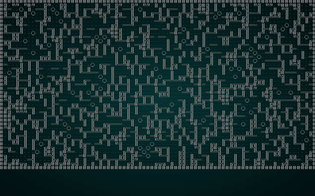

# Drunkard's Walk Maps

---

***About this tutorial***

*This tutorial is free and open source, and all code uses the MIT license - so you are free to do with it as you like. My hope is that you will enjoy the tutorial, and make great games!*

*If you enjoy this and would like me to keep writing, please consider supporting [my Patreon](https://www.patreon.com/blackfuture).*

---

Ever wondered what would happen if an Umber Hulk (or other tunneling creature) got *really* drunk, and went on a dungeon craving bender? The *Drunkard's Walk* algorithm answers the question - or more precisely, what would happen if a *whole bunch* of monsters had far too much to drink. As crazy it sounds, this is a good way to make organic dungeons.

## Initial scaffolding

As usual, we'll start with scaffolding from the previous map tutorials. We've done it enough that it should be old hat by now! In `map_builders/drunkard.rs`, build a new `DrunkardsWalkBuilder` class. We'll keep the zone-based placement from Cellular Automata - but remove the map building code. Here's the scaffolding:

```rust
use super::{MapBuilder, Map,  
    TileType, Position, spawner, SHOW_MAPGEN_VISUALIZER};
use rltk::RandomNumberGenerator;
use specs::prelude::*;
use std::collections::HashMap;

pub struct DrunkardsWalkBuilder {
    map : Map,
    starting_position : Position,
    depth: i32,
    history: Vec<Map>,
    noise_areas : HashMap<i32, Vec<usize>>
}

impl MapBuilder for DrunkardsWalkBuilder {
    fn get_map(&self) -> Map {
        self.map.clone()
    }

    fn get_starting_position(&self) -> Position {
        self.starting_position.clone()
    }

    fn get_snapshot_history(&self) -> Vec<Map> {
        self.history.clone()
    }

    fn build_map(&mut self)  {
        self.build();
    }

    fn spawn_entities(&mut self, ecs : &mut World) {
        for area in self.noise_areas.iter() {
            spawner::spawn_region(ecs, area.1, self.depth);
        }
    }

    fn take_snapshot(&mut self) {
        if SHOW_MAPGEN_VISUALIZER {
            let mut snapshot = self.map.clone();
            for v in snapshot.revealed_tiles.iter_mut() {
                *v = true;
            }
            self.history.push(snapshot);
        }
    }
}

impl DrunkardsWalkBuilder {
    pub fn new(new_depth : i32) -> DrunkardsWalkBuilder {
        DrunkardsWalkBuilder{
            map : Map::new(new_depth),
            starting_position : Position{ x: 0, y : 0 },
            depth : new_depth,
            history: Vec::new(),
            noise_areas : HashMap::new()
        }
    }

    #[allow(clippy::map_entry)]
    fn build(&mut self) {
        let mut rng = RandomNumberGenerator::new();

        // Set a central starting point
        self.starting_position = Position{ x: self.map.width / 2, y: self.map.height / 2 };
        let start_idx = self.map.xy_idx(self.starting_position.x, self.starting_position.y);

        // Find all tiles we can reach from the starting point
        let map_starts : Vec<i32> = vec![start_idx as i32];
        let dijkstra_map = rltk::DijkstraMap::new(self.map.width, self.map.height, &map_starts , &self.map, 200.0);
        let mut exit_tile = (0, 0.0f32);
        for (i, tile) in self.map.tiles.iter_mut().enumerate() {
            if *tile == TileType::Floor {
                let distance_to_start = dijkstra_map.map[i];
                // We can't get to this tile - so we'll make it a wall
                if distance_to_start == std::f32::MAX {
                    *tile = TileType::Wall;
                } else {
                    // If it is further away than our current exit candidate, move the exit
                    if distance_to_start > exit_tile.1 {
                        exit_tile.0 = i;
                        exit_tile.1 = distance_to_start;
                    }
                }
            }
        }
        self.take_snapshot();

        // Place the stairs
        self.map.tiles[exit_tile.0] = TileType::DownStairs;
        self.take_snapshot();

        // Now we build a noise map for use in spawning entities later
        let mut noise = rltk::FastNoise::seeded(rng.roll_dice(1, 65536) as u64);
        noise.set_noise_type(rltk::NoiseType::Cellular);
        noise.set_frequency(0.08);
        noise.set_cellular_distance_function(rltk::CellularDistanceFunction::Manhattan);

        for y in 1 .. self.map.height-1 {
            for x in 1 .. self.map.width-1 {
                let idx = self.map.xy_idx(x, y);
                if self.map.tiles[idx] == TileType::Floor {
                    let cell_value_f = noise.get_noise(x as f32, y as f32) * 10240.0;
                    let cell_value = cell_value_f as i32;

                    if self.noise_areas.contains_key(&cell_value) {
                        self.noise_areas.get_mut(&cell_value).unwrap().push(idx);
                    } else {
                        self.noise_areas.insert(cell_value, vec![idx]);
                    }
                }
            }
        }
    }
}

```

We've kept a lot of the work from the Cellular Automata chapter, since it can help us here also. We also go into `map_builders/mod.rs` and once again force the "random" system to pick our new code:

```rust
pub fn random_builder(new_depth: i32) -> Box<dyn MapBuilder> {
    /*let mut rng = rltk::RandomNumberGenerator::new();
    let builder = rng.roll_dice(1, 4);
    match builder {
        1 => Box::new(BspDungeonBuilder::new(new_depth)),
        2 => Box::new(BspInteriorBuilder::new(new_depth)),
        3 => Box::new(CellularAutomotaBuilder::new(new_depth)),
        _ => Box::new(SimpleMapBuilder::new(new_depth))
    }*/
    Box::new(DrunkardsWalkBuilder::new(new_depth))
}
```

## Don't Repeat Yourself (The DRY principle)

Since we're re-using the exact code from Cellular Automata, we should take the common code and put it into `map_builders/common.rs`. This saves typing, saves the compiler from repeatedly remaking the same code (increasing your program size). So in `common.rs`, we refactor the common code into some functions. In `common.rs`, we create a new function - `remove_unreachable_areas_returning_most_distant`:

```rust
/// Searches a map, removes unreachable areas and returns the most distant tile.
pub fn remove_unreachable_areas_returning_most_distant(map : &mut Map, start_idx : usize) -> usize {
    let map_starts : Vec<i32> = vec![start_idx as i32];
    let dijkstra_map = rltk::DijkstraMap::new(map.width, map.height, &map_starts , map, 200.0);
    let mut exit_tile = (0, 0.0f32);
    for (i, tile) in map.tiles.iter_mut().enumerate() {
        if *tile == TileType::Floor {
            let distance_to_start = dijkstra_map.map[i];
            // We can't get to this tile - so we'll make it a wall
            if distance_to_start == std::f32::MAX {
                *tile = TileType::Wall;
            } else {
                // If it is further away than our current exit candidate, move the exit
                if distance_to_start > exit_tile.1 {
                    exit_tile.0 = i;
                    exit_tile.1 = distance_to_start;
                }
            }
        }
    }

    exit_tile.0
}
```

We'll make a second function, `generate_voronoi_spawn_regions`:

```rust
/// Generates a Voronoi/cellular noise map of a region, and divides it into spawn regions.
#[allow(clippy::map_entry)]
pub fn generate_voronoi_spawn_regions(map: &Map, rng : &mut rltk::RandomNumberGenerator) -> HashMap<i32, Vec<usize>> {
    let mut noise_areas : HashMap<i32, Vec<usize>> = HashMap::new();
    let mut noise = rltk::FastNoise::seeded(rng.roll_dice(1, 65536) as u64);
    noise.set_noise_type(rltk::NoiseType::Cellular);
    noise.set_frequency(0.08);
    noise.set_cellular_distance_function(rltk::CellularDistanceFunction::Manhattan);

    for y in 1 .. map.height-1 {
        for x in 1 .. map.width-1 {
            let idx = map.xy_idx(x, y);
            if map.tiles[idx] == TileType::Floor {
                let cell_value_f = noise.get_noise(x as f32, y as f32) * 10240.0;
                let cell_value = cell_value_f as i32;

                if noise_areas.contains_key(&cell_value) {
                    noise_areas.get_mut(&cell_value).unwrap().push(idx);
                } else {
                    noise_areas.insert(cell_value, vec![idx]);
                }
            }
        }
    }

    noise_areas
}
```

Plugging these into our `build` function lets us reduce the boilerplate section considerably:

```rust
// Find all tiles we can reach from the starting point
let exit_tile = remove_unreachable_areas_returning_most_distant(&mut self.map, start_idx);
self.take_snapshot();

// Place the stairs
self.map.tiles[exit_tile] = TileType::DownStairs;
self.take_snapshot();

// Now we build a noise map for use in spawning entities later
self.noise_areas = generate_voronoi_spawn_regions(&self.map, &mut rng);
```

In the example, I've gone back to the `cellular_automata` section and done the same.

This is basically the same code we had before (hence, it isn't explained here), but wrapped in a function (and taking a mutable map reference - so it changes the map you give it, and the starting point as parameters).

## Walking Drunkards

The basic idea behind the algorithm is simple:

1. Pick a central starting point, and convert it to a floor.
2. We count how much of the map is floor space, and iterate until we have converted a percentage (we use 50% in the example) of the map to floors.
    1. Spawn a drunkard at the starting point. The drunkard has a "lifetime" and a "position".
    2. While the drunkard is still alive:
        1. Decrement the drunkard's lifetime (I like to think that they pass out and sleep).
        2. Roll a 4-sided dice.
            1. If we rolled a 1, move the drunkard North.
            2. If we rolled a 2, move the drunkard South.
            3. If we rolled a 3, move the drunkard East.
            4. If we rolled a 4, move the drunkard West.
        3. The tile on which the drunkard landed becomes a floor.

That's really all there is to it: we keep spawning drunkards until we have sufficient map coverage. Here's an implementation:

```rust
// Set a central starting point
self.starting_position = Position{ x: self.map.width / 2, y: self.map.height / 2 };
let start_idx = self.map.xy_idx(self.starting_position.x, self.starting_position.y);
self.map.tiles[start_idx] = TileType::Floor;

let total_tiles = self.map.width * self.map.height;
let desired_floor_tiles = (total_tiles / 2) as usize;
let mut floor_tile_count = self.map.tiles.iter().filter(|a| **a == TileType::Floor).count();
let mut digger_count = 0;
let mut active_digger_count = 0;

while floor_tile_count  < desired_floor_tiles {
    let mut did_something = false;
    let mut drunk_x = self.starting_position.x;
    let mut drunk_y = self.starting_position.y;
    let mut drunk_life = 400;

    while drunk_life > 0 {
        let drunk_idx = self.map.xy_idx(drunk_x, drunk_y);
        if self.map.tiles[drunk_idx] == TileType::Wall {
            did_something = true;
        }
        self.map.tiles[drunk_idx] = TileType::DownStairs;

        let stagger_direction = rng.roll_dice(1, 4);
        match stagger_direction {
            1 => { if drunk_x > 2 { drunk_x -= 1; } }
            2 => { if drunk_x < self.map.width-2 { drunk_x += 1; } }
            3 => { if drunk_y > 2 { drunk_y -=1; } }
            _ => { if drunk_y < self.map.height-2 { drunk_y += 1; } }
        }

        drunk_life -= 1;
    }
    if did_something { 
        self.take_snapshot(); 
        active_digger_count += 1;
    }

    digger_count += 1;
    for t in self.map.tiles.iter_mut() {
        if *t == TileType::DownStairs {
            *t = TileType::Floor;
        }
    }
    floor_tile_count = self.map.tiles.iter().filter(|a| **a == TileType::Floor).count();
}
println!("{} dwarves gave up their sobriety, of whom {} actually found a wall.", digger_count, active_digger_count);
```

This implementation expands a lot of things out, and could be *much* shorter - but for clarity, we've left it large and obvious. We've also made a bunch of things into variables that could be constants - it's easier to read, and is designed to be easy to "play" with values. It also prints a status update to the console, showing what happened.

If you `cargo run` now, you'll get a pretty nice open map:

.


**The source code for this chapter may be found [here](https://github.com/thebracket/rustrogueliketutorial/tree/master/chapter-28-drunkards-walk)**


[Run this chapter's example with web assembly, in your browser (WebGL2 required)](http://bfnightly.bracketproductions.com/rustbook/wasm/chapter-28-drunkards-walk/)
---

Copyright (C) 2019, Herbert Wolverson.

---