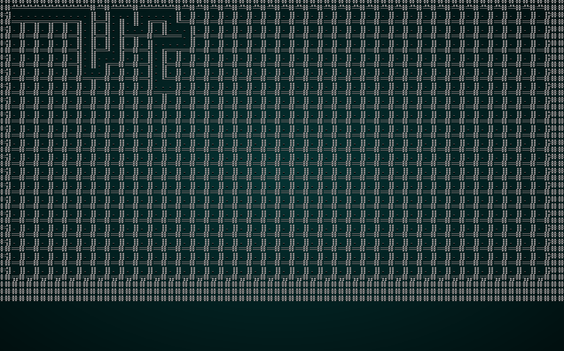

# Maze/Labyrinth Generation

---

***About this tutorial***

*This tutorial is free and open source, and all code uses the MIT license - so you are free to do with it as you like. My hope is that you will enjoy the tutorial, and make great games!*

*If you enjoy this and would like me to keep writing, please consider supporting [my Patreon](https://www.patreon.com/blackfuture).*

---

A mainstay of dungeon crawl games is the good old-fashioned labyrinth, often featuring a Minotaur. Dungeon Crawl: Stone Soup has a literal minotaur labyrinth, Tome 4 has sand-worm mazes, One Knight has an elven hedge maze. These levels can be annoying for the player, and should be used sparingly: a lot of players don't really enjoy the tedium of exploring to find an exit. This chapter will show you how to make a labyrinth!

## Scaffolding

Once again, we'll use the previous chapter as scaffolding - and set our "random" builder to use the new design. In `map_builders/maze.rs`, place the following code:

```rust
use super::{MapBuilder, Map,  
    TileType, Position, spawner, SHOW_MAPGEN_VISUALIZER,
    remove_unreachable_areas_returning_most_distant, generate_voronoi_spawn_regions};
use rltk::RandomNumberGenerator;
use specs::prelude::*;
use std::collections::HashMap;

pub struct MazeBuilder {
    map : Map,
    starting_position : Position,
    depth: i32,
    history: Vec<Map>,
    noise_areas : HashMap<i32, Vec<usize>>
}

impl MapBuilder for MazeBuilder {
    fn get_map(&self) -> Map {
        self.map.clone()
    }

    fn get_starting_position(&self) -> Position {
        self.starting_position.clone()
    }

    fn get_snapshot_history(&self) -> Vec<Map> {
        self.history.clone()
    }

    fn build_map(&mut self)  {
        self.build();
    }

    fn spawn_entities(&mut self, ecs : &mut World) {
        for area in self.noise_areas.iter() {
            spawner::spawn_region(ecs, area.1, self.depth);
        }
    }

    fn take_snapshot(&mut self) {
        if SHOW_MAPGEN_VISUALIZER {
            let mut snapshot = self.map.clone();
            for v in snapshot.revealed_tiles.iter_mut() {
                *v = true;
            }
            self.history.push(snapshot);
        }
    }
}

impl MazeBuilder {
    pub fn new(new_depth : i32) -> MazeBuilder {
        MazeBuilder{
            map : Map::new(new_depth),
            starting_position : Position{ x: 0, y : 0 },
            depth : new_depth,
            history: Vec::new(),
            noise_areas : HashMap::new()
        }
    }

    #[allow(clippy::map_entry)]
    fn build(&mut self) {
        let mut rng = RandomNumberGenerator::new();        

        // Find a starting point; start at the middle and walk left until we find an open tile
        self.starting_position = Position{ x: self.map.width / 2, y : self.map.height / 2 };
        let mut start_idx = self.map.xy_idx(self.starting_position.x, self.starting_position.y);
        while self.map.tiles[start_idx] != TileType::Floor {
            self.starting_position.x -= 1;
            start_idx = self.map.xy_idx(self.starting_position.x, self.starting_position.y);
        }
        self.take_snapshot();

        // Find all tiles we can reach from the starting point
        let exit_tile = remove_unreachable_areas_returning_most_distant(&mut self.map, start_idx);
        self.take_snapshot();

        // Place the stairs
        self.map.tiles[exit_tile] = TileType::DownStairs;
        self.take_snapshot();

        // Now we build a noise map for use in spawning entities later
        self.noise_areas = generate_voronoi_spawn_regions(&self.map, &mut rng);
    }
}
```

And in `random_builder` (`map_builders/mod.rs`):

```rust
pub fn random_builder(new_depth: i32) -> Box<dyn MapBuilder> {
    /*let mut rng = rltk::RandomNumberGenerator::new();
    let builder = rng.roll_dice(1, 7);
    match builder {
        1 => Box::new(BspDungeonBuilder::new(new_depth)),
        2 => Box::new(BspInteriorBuilder::new(new_depth)),
        3 => Box::new(CellularAutomataBuilder::new(new_depth)),
        4 => Box::new(DrunkardsWalkBuilder::open_area(new_depth)),
        5 => Box::new(DrunkardsWalkBuilder::open_halls(new_depth)),
        6 => Box::new(DrunkardsWalkBuilder::winding_passages(new_depth)),
        _ => Box::new(SimpleMapBuilder::new(new_depth))
    }*/
    Box::new(MazeBuilder::new(new_depth))
}
```

## Actually building a maze

There are lots of good maze building algorithms out there, all guaranteed to give you a perfectly solvable maze. In *One Knight in the Dungeon*, I based my maze building code off of a relatively standard implementation - [Cyucelen's mazeGenerator](https://github.com/cyucelen/mazeGenerator/). It's an interesting algorithm because - like a lot of maze algorithms - it assumes that walls are part of the tile grid, rather than having separate wall entities. That isn't going to work for the type of tile map we are using, so we generate the grid at *half* the resolution of the actual map, and generate walls based upon wall adjacency information in the grid.

The algorithm started as C++ code with pointers everywhere, and took a bit of time to port. The most basic structure in the algorithm: the `Cell`. Cells are tiles on the map:

```rust
const TOP : usize = 0;
const RIGHT : usize = 1;
const BOTTOM : usize = 2;
const LEFT : usize = 3;

#[derive(Copy, Clone)]
struct Cell {
    row: i32,
    column: i32,
    walls: [bool; 4],
    visited: bool,
}
```

We define four constants: TOP, RIGHT, BOTTOM and LEFT and assign them to the numbers `0..3`. We use these whenever the algorithm wants to refer to a direction. Looking at `Cell`, it is relatively simple:

* `row` and `column` define where the cell is on the map.
* `walls` is an `array`, with a `bool` for each of the directions we've defined. Rust [arrays](https://doc.rust-lang.org/std/primitive.array.html) (static, you can't resize them like a `vector`) are defined with the syntax `[TYPE ; NUMBER_OF_ELEMENTS]`. Most of the time we just use vectors because we like the dynamic sizing; in this case, the number of elements is known ahead of time, so using the lower-overhead type makes sense.
* `visited` - a bool indicating whether we've previously looked at the cell.

Cell also defines some methods. The first is its constructor:

```rust
impl Cell {
    fn new(row: i32, column: i32) -> Cell {
        Cell{
            row,
            column,
            walls: [true, true, true, true],
            visited: false
        }
    }
    ...
```

This is a simple constructor: it makes a cell with walls in each direction, and not previously visited. Cells also define a function called `remove_walls`:

```rust
unsafe fn remove_walls(&mut self, next : *mut Cell) {
    let x = self.column - (*(next)).column;
    let y = self.row - (*(next)).row;

    if x == 1 {
        self.walls[LEFT] = false;
        (*(next)).walls[RIGHT] = false;
    }
    else if x == -1 {
        self.walls[RIGHT] = false;
        (*(next)).walls[LEFT] = false;
    }
    else if y == 1 {
        self.walls[TOP] = false;
        (*(next)).walls[BOTTOM] = false;
    }
    else if y == -1 {
        self.walls[BOTTOM] = false;
        (*(next)).walls[TOP] = false;
    }
}
```

Uh oh, there's some new stuff here: 

* The *terrifying* looking `unsafe` keyword says "this function uses code that Rust cannot prove to be memory-safe". In other words, it is the Rust equivalent of typing `here be dragons`.
* We need the `unsafe` flag because of `next : *mut Cell`. We've not used a *raw pointer* before - we're into C/C++ land, now! The syntax is relatively straightforward; the `*` indicates that it is a *pointer* (rather than a reference). The `mut` indicates that we can change the contents (that's what makes it unsafe; Rust can't verify that the pointer is actually valid, so if we change something we might really break things!), and it *points to* a `Cell`. A *reference* is actually a type of pointer; it points to a variable, and if you access it - you are reading the variable to which it points (so there's only one copy existing). With a reference, you can change the value with `*myref = 1` - the `*` *dereferences* the reference, giving you the original area of memory. Rust can check that this is valid with the borrow checker. More on this in a moment.
* We set `x` to be *our* `column` value, minus the `column` value of the cell we are pointing at. The `(*(next)).column` is *horrible* syntax, and should discourage anyone from using pointers (I think that's the point). The first parentheses indicate that we're modifying the type; the `*` dereferences the pointer encased in the final set of parentheses. Since we're changing a value pointed to by a pointer, this is inherently *unsafe* (and makes the function not compile if we don't use the `unsafe` flag), and also means: *BE REALLY CAREFUL*.
* We do the same with `y` - but with `row` values.
* If `x` is equal to 1, then the pointer's column must be greater than our column value. In other words, the `next` cell is to the *right* of our current location. So we remove the wall to the right.
* Likewise, if `x` is `-1`, then we must be going *left* - so we remove the wall to the right.
* Once again, if `y` is `1`, we must be going up. So we remove the walls to the top.
* Finally, if `y` is `-1`, we must be going down - so we remove the walls below us.

Whew! `Cell` is done. Now to actually *use* it. In our maze algorithm, `Cell` is part of `Grid`. Here's the basic `Grid` definition:

```rust
struct Grid<'a> {
    width: i32,
    height: i32,
    cells: Vec<Cell>,
    backtrace: Vec<usize>,
    current: usize,
    rng : &'a mut RandomNumberGenerator
}
```

Some commentary on `Grid`:

* The `<'a>` is a *lifetime* specifier. We have to specify one so that Rust's borrow checker can ensure that the `Grid` will not expire before we delete the `RandomNumberGenerator`. Because we're passing a *mutable reference* to the caller's RNG, Rust needs this to ensure that the RNG doesn't go away before we're finished with it. This type of bug often affects C/C++ users, so Rust made it *really* hard to mess up. Unfortunately, the price of making it hard to get wrong is some ugly syntax!
* We have a `width` and `height` defining the size of the maze.
* Cells are just a `Vector` of the `Cell` type we defined earlier.
* `backtrace` is used by the algorithm for recursively back-tracking to ensure that every cell has been processed. It's just a `vector` of cell indices - the index into the `cells` vector.
* `current` is used by the algorithm to tell which `Cell` we're currently working with.
* `rng` is the reason for the ugly lifetime stuff; we want to use the random number generator built in the `build` function, so we store a reference to it here. Because obtaining a random number changes the content of the variable, we have to store a mutable reference. The really ugly `&'a mut` indicates that it is a reference, with the lifetime `'a` (defined above) and is mutable/changeable.

`Grid` implements quite a few methods. First up, the constructor:

```rust
impl<'a> Grid<'a> {
    fn new(width: i32, height:i32, rng: &mut RandomNumberGenerator) -> Grid {
        let mut grid = Grid{
            width,
            height,
            cells: Vec::new(),
            backtrace: Vec::new(),
            current: 0,
            rng
        };

        for row in 0..height {
            for column in 0..width {
                grid.cells.push(Cell::new(row, column));
            }
        }

        grid
    }
    ...
```

Notice that once again we had to use some ugly syntax for the lifetime! The constructor itself is quite simple: it makes a new `Grid` structure with the specified `width` and `height`, a new `vector` of cells, a new (empty) `backtrace` vector, sets `current` to `0` and stores the random number generator reference. Then it iterates the rows and columns of the grid, pushing new `Cell` structures to the `cells` vector, numbered by their location.

The `Grid` also implements `calculate_index`:

```rust
fn calculate_index(&self, row: i32, column: i32) -> i32 {
    if row < 0 || column < 0 || column > self.width-1 || row > self.height-1 {
        -1
    } else {
        column + (row * self.width)
    }
}
```

This is very similar to our `map`'s `xy_idx` function: it takes a row and column coordinate, and returns the array index at which one can find the cell. It also does some bounds checking, and returns `-1` if the coordinates are invalid. Next, we provide `get_available_neighbors`:

```rust
fn get_available_neighbors(&self) -> Vec<usize> {
    let mut neighbors : Vec<usize> = Vec::new();

    let current_row = self.cells[self.current].row;
    let current_column = self.cells[self.current].column;

    let neighbor_indices : [i32; 4] = [
        self.calculate_index(current_row -1, current_column),
        self.calculate_index(current_row, current_column + 1),
        self.calculate_index(current_row + 1, current_column),
        self.calculate_index(current_row, current_column - 1)
    ];

    for i in neighbor_indices.iter() {
        if *i != -1 && !self.cells[*i as usize].visited {
            neighbors.push(*i as usize);
        }
    }

    neighbors
}
```

This function provides the available exits from the `current` cell. It works by obtaining the `row` and `column` coordinates of the current cell, and then puts a call to `calculate_index` into an array (corresponding to the directions we defined with `Cell`). It finally iterates the array, and if the values are valid (greater than `-1`), *and we haven't been there before* (the `visited` check) it pushes them into the `neighbors` list. It then returns `neighbors`. A call to this for any cell address will return a `vector` listing all of the adjacent cells to which we can travel (ignoring walls). We first use this in `find_next_cell`:

```rust
fn find_next_cell(&mut self) -> Option<usize> {
    let neighbors = self.get_available_neighbors();
    if !neighbors.is_empty() {
        if neighbors.len() == 1 {
            return Some(neighbors[0]);
        } else {
            return Some(neighbors[(self.rng.roll_dice(1, neighbors.len() as i32)-1) as usize]);
        }
    }
    None
}
```

This function is interesting in that it returns an `Option`. It's possible that there is nowhere to go from the current cell - in which case it returns `None`. Otherwise, it returns `Some` with the array index of the next destination. It works by:

* Obtain a list of neighbors for the current cell.
* If there are neighbors:
    * If there is only one neighbor, return it.
    * If there are multiple neighbors, pick one and random and return it.
* If there are no neighbors, return `None`.

We use this from `generate_maze`:

```rust
fn generate_maze(&mut self, generator : &mut MazeBuilder) {
    loop {
        self.cells[self.current].visited = true;
        let next = self.find_next_cell();

        match next {
            Some(next) => {
                self.cells[next].visited = true;
                self.backtrace.insert(0, self.current);
                unsafe {
                    let next_cell : *mut Cell = &mut self.cells[next];
                    let current_cell = &mut self.cells[self.current];
                    current_cell.remove_walls(next_cell);
                }
                self.current = next;
            }
            None => {
                if !self.backtrace.is_empty() {
                    self.current = self.backtrace[0];
                    self.backtrace.remove(0);
                } else {
                    break;
                }
            }
        }

        self.copy_to_map(&mut generator.map);
        generator.take_snapshot();    
    }
}
```

So now we're onto the actual algorithm! Lets step through it to understand how it works:

1. We start with a `loop`. We haven't used one of these before (you can read about them [here](https://doc.rust-lang.org/rust-by-example/flow_control/loop.html)). Basically, a `loop` runs *forever* - until it hits a `break` statement.
2. We set the value of `visited` in the `current` cell to `true`.
3. We add the current cell to the beginning of the `backtrace` list.
4. We call `find_next_cell` and set its index in the variable `next`. If this is our first run, we'll get a random direction from the starting cell. Otherwise, we get an exit from the `current` cell we're visiting.
5. If `next` has a value, then:
    1. Get a *pointer* to the `next_cell`. If you remember, `remove_walls` takes a pointer. This is *why* we jump through those hoops: the borrow checker *really* doesn't like us borrowing values from two elements of the array at once. So to keep it happy, we use a *pointer*.
    2. We also obtain a reference to the *current* cell.
    3. We call `remove_walls` on the *current* cell, referencing the *next* cell. The good news is that we're being careful, so we can be sure that we aren't going to hit a null pointer error. Rust cannot know that, so we use the `unsafe` block to indicate that we know what we're doing!
6. If `next` does *not* have a value (it's equal to `None`), we:
    1. If `backtrace` isn't empty, we set `current` to the first value in the `backtrace` list.
    2. If `backtrace` *is* empty, we've finished - so we `break` out of the loop.
7. Finally, we call `copy_to_map` - which copies the maze to the map (more on that below), and take a snapshot for the iterative map generation renderer.

So why does that work?

* The first few iterations will get a non-visited neighbor, carving a clear path through the maze. Each step along the way, the cell we've visited is added to `backtrace`. This is effectively a drunken walk through the maze, but ensuring that we cannot return to a cell.
* When we hit a point at which we have no neighbors (we've hit the end of the maze), the algorithm will change `current` to the first entry in our `backtrace` list. It will then randomly walk *from there*, filling in more cells.
* If *that* point can't go anywhere, it works back up the `backtrace` list.
* This repeats until every cell has been visited, meaning that `backtrace` and `neighbors` are both empty. We're done!

The best way to understand this is to watch it in action:

.

Finally, there's the `copy_to_map` function:

```rust
fn copy_to_map(&self, map : &mut Map) {
    // Clear the map
    for i in map.tiles.iter_mut() { *i = TileType::Wall; }

    for cell in self.cells.iter() {
        let x = cell.column + 1;
        let y = cell.row + 1;
        let idx = map.xy_idx(x * 2, y * 2);

        map.tiles[idx] = TileType::Floor;
        if !cell.walls[TOP] { map.tiles[idx - map.width as usize] = TileType::Floor }
        if !cell.walls[RIGHT] { map.tiles[idx + 1] = TileType::Floor }
        if !cell.walls[BOTTOM] { map.tiles[idx + map.width as usize] = TileType::Floor }
        if !cell.walls[LEFT] { map.tiles[idx - 1] = TileType::Floor }
    }
}
```

This is where the mismatch between `Grid/Cell` and our map format is resolved: each `Cell` in the maze structure can have walls in any of the four major directions. Our map doesn't work that way: walls aren't part of a tile, they *are* a tile. So we double the size of the `Grid`, and write carve floors where walls aren't present. Lets walk through this function:

1. We set all cells in the map to be a solid wall.
2. For each cell in the grid, we:
    1. Calculate `x` as the cell's `column` value, plus one.
    2. Calculate `y` as the cell's `row` value, plus one.
    3. Set `idx` to `map.xy_idx` of DOUBLE the `x` and `y` values: so spread each cell out.
    4. We set the map tile at `idx` to be a floor.
    5. If the `Cell` we're referencing does *not* have a `TOP` wall, we set the map tile above our `idx` tile to be a floor.
    6. We repeat that for the other directions.

## Speeding up the generator

We're wasting a *lot* of time by snapshotting at every iteration - we're building a *huge* list of snapshot maps. That was great for learning the algorithm, but simply takes too long when playing the game. We'll modify our `generate_maze` function to count iterations, and only log every 10th:

```rust
fn generate_maze(&mut self, generator : &mut MazeBuilder) {
    let mut i = 0;
    loop {
        self.cells[self.current].visited = true;
        let next = self.find_next_cell();

        match next {
            Some(next) => {
                self.cells[next].visited = true;
                self.backtrace.insert(0, self.current);
                unsafe {
                    let next_cell : *mut Cell = &mut self.cells[next];
                    let current_cell = &mut self.cells[self.current];
                    current_cell.remove_walls(next_cell);
                }
                self.current = next;
            }
            None => {
                if !self.backtrace.is_empty() {
                    self.current = self.backtrace[0];
                    self.backtrace.remove(0);
                } else {
                    break;
                }
            }
        }

        if i % 50 == 0 {
            self.copy_to_map(&mut generator.map);
            generator.take_snapshot();    
        }
        i += 1;
    }
}
```

This brings the generator up to a reasonable speed, and you can still watch the maze develop.

## Finding the exit

Fortunately, our current algorithm *will* start you at `Cell` (1,1) - which corresponds to map location (2,2). So in `build`, we can easily specify a starting point:

```rust
self.starting_position = Position{ x: 2, y : 2 };
let start_idx = self.map.xy_idx(self.starting_position.x, self.starting_position.y);
self.take_snapshot();
```

We can then use the same code we've used in the last two examples to find an exit:

```rust
// Find all tiles we can reach from the starting point
let exit_tile = remove_unreachable_areas_returning_most_distant(&mut self.map, start_idx);
self.take_snapshot();

// Place the stairs
self.map.tiles[exit_tile] = TileType::DownStairs;
self.take_snapshot();

// Now we build a noise map for use in spawning entities later
self.noise_areas = generate_voronoi_spawn_regions(&self.map, &mut rng);
```

This is also a *great* test of the library's Dijkstra map code. It can solve a maze very quickly!

## Restoring the randomness

Once again, we should restore `random_builder` to be random:

```rust
pub fn random_builder(new_depth: i32) -> Box<dyn MapBuilder> {
    let mut rng = rltk::RandomNumberGenerator::new();
    let builder = rng.roll_dice(1, 8);
    match builder {
        1 => Box::new(BspDungeonBuilder::new(new_depth)),
        2 => Box::new(BspInteriorBuilder::new(new_depth)),
        3 => Box::new(CellularAutomataBuilder::new(new_depth)),
        4 => Box::new(DrunkardsWalkBuilder::open_area(new_depth)),
        5 => Box::new(DrunkardsWalkBuilder::open_halls(new_depth)),
        6 => Box::new(DrunkardsWalkBuilder::winding_passages(new_depth)),
        7 => Box::new(MazeBuilder::new(new_depth)),
        _ => Box::new(SimpleMapBuilder::new(new_depth))
    }    
}
```

## Wrap-Up

In this chapter, we've built a maze. It's a guaranteed solvable maze, so there's no risk of a level that you can't beat. You still have to use this type of map with caution: they make good one-off maps, and can *really* annoy players!

**The source code for this chapter may be found [here](https://github.com/thebracket/rustrogueliketutorial/tree/master/chapter-29-mazes)**


[Run this chapter's example with web assembly, in your browser (WebGL2 required)](http://bfnightly.bracketproductions.com/rustbook/wasm/chapter-29-mazes/)
---

Copyright (C) 2019, Herbert Wolverson.

---