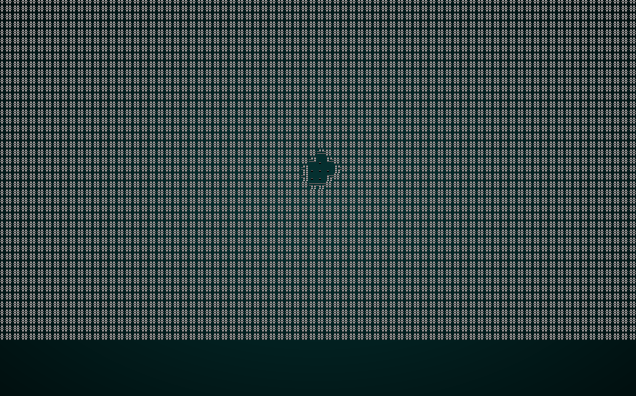
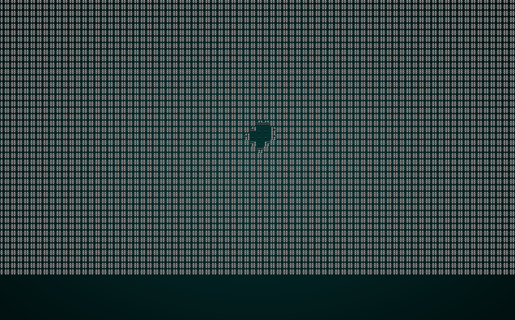
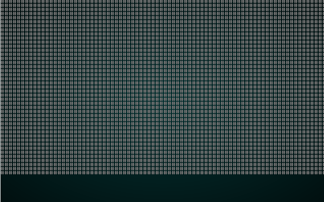
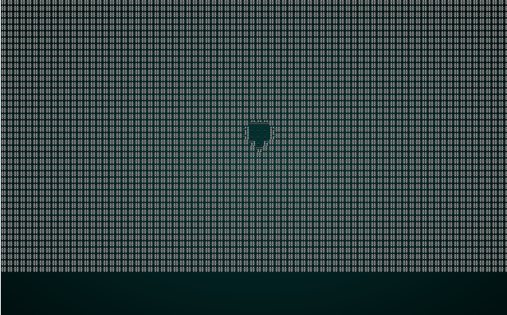

# Diffusion-Limited Aggregation

---

***About this tutorial***

*This tutorial is free and open source, and all code uses the MIT license - so you are free to do with it as you like. My hope is that you will enjoy the tutorial, and make great games!*

*If you enjoy this and would like me to keep writing, please consider supporting [my Patreon](https://www.patreon.com/blackfuture).*

---

Diffusion-Limited Aggregation (DLA) is a fancy name for a constrained form of the drunken walk. It makes organic looking maps, with more of an emphasis on a central area and "arms" coming out of it. With some tricks, it can be made to look quite alien - or quite real. See this [excellent article on Rogue Basin](http://www.roguebasin.com/index.php?title=Diffusion-limited_aggregation).

## Scaffolding

We'll create a new file, `map_builders/dla.rs` and put the scaffolding in from previous projects. We'll name the builder `DLABuilder`. We'll also keep the voronoi spawn code, it will work fine for this application. Rather than repeat the scaffolding code blocks from previous chapters, we'll jump straight in. If you get stuck, you can check the source code for this chapter [here](https://github.com/thebracket/rustrogueliketutorial/tree/master/chapter-30-dla).

## Algorithm Tuning Knobs

In the last chapter, we introduced the idea of adding parameters to our builder. We'll do the same again for DLA - there's a few algorithm variants that can produce different map styles. We'll introduce the following enumerations:

```rust
#[derive(PartialEq, Copy, Clone)]
pub enum DLAAlgorithm { WalkInwards, WalkOutwards, CentralAttractor }

#[derive(PartialEq, Copy, Clone)]
pub enum DLASymmetry { None, Horizontal, Vertical, Both }
```

Our builder will include one more, *brush size*:

```rust
pub struct DLABuilder {
    map : Map,
    starting_position : Position,
    depth: i32,
    history: Vec<Map>,
    noise_areas : HashMap<i32, Vec<usize>>,
    algorithm : DLAAlgorithm,
    brush_size: i32,
    symmetry: DLASymmetry,
    floor_percent: f32
}
```

This should be pretty self-explanatory by now if you've been through the other chapters:

* We're supporting three algorithms, `WalkInwards`, `WalkOutwards`, `CentralAttractor`. We'll cover these in detail shortly.
* We've added `symmetry`, which can be either `None`, `Horizontal`, `Vertical` or `Both`. Symmetry can be used to make some beautiful results with this algorithm, and we'll cover that later in the article.
* We've also added `brush_size`, which specifies how many floor tiles we "paint" onto the map in one go. We'll look at this at the end of the chapter.
* We've included `floor_percent` from the Drunkard's Walk chapter.

Our `new` function needs to include these parameters:

```rust
pub fn new(new_depth : i32) -> DLABuilder {
    DLABuilder{
        map : Map::new(new_depth),
        starting_position : Position{ x: 0, y : 0 },
        depth : new_depth,
        history: Vec::new(),
        noise_areas : HashMap::new(),
        algorithm: DLAAlgorithm::WalkInwards,
        brush_size: 1,
        symmetry: DLASymmetry::None,
        floor_percent: 0.25
    }
}
```

We'll make some type constructors once we've mastered the algorithms and their variants!

## Walking Inwards

The most basic form of Diffusion-Limited Aggregation works like this:

1. Dig a "seed" area around your central starting point.
2. While the number of floor tiles is less than your desired total:
    1. Select a starting point at random for your digger.
    2. Use the "drunkard's walk" algorithm to move randomly.
    3. If the digger hit a floor tile, then the *previous* tile they were in also becomes a floor and the digger stops.

Very simple, and not too hard to implement:

```rust
fn build(&mut self) {
    let mut rng = RandomNumberGenerator::new();

    // Carve a starting seed
    self.starting_position = Position{ x: self.map.width/2, y : self.map.height/2 };
    let start_idx = self.map.xy_idx(self.starting_position.x, self.starting_position.y);
    self.take_snapshot();
    self.map.tiles[start_idx] = TileType::Floor;
    self.map.tiles[start_idx-1] = TileType::Floor;
    self.map.tiles[start_idx+1] = TileType::Floor;
    self.map.tiles[start_idx-self.map.width as usize] = TileType::Floor;
    self.map.tiles[start_idx+self.map.width as usize] = TileType::Floor;

    // Random walker
    let total_tiles = self.map.width * self.map.height;
    let desired_floor_tiles = (self.floor_percent * total_tiles as f32) as usize;
    let mut floor_tile_count = self.map.tiles.iter().filter(|a| **a == TileType::Floor).count();
    while floor_tile_count  < desired_floor_tiles {

        match self.algorithm {
            DLAAlgorithm::WalkInwards => {
                let mut digger_x = rng.roll_dice(1, self.map.width - 3) + 1;
                let mut digger_y = rng.roll_dice(1, self.map.height - 3) + 1;
                let mut prev_x = digger_x;
                let mut prev_y = digger_y;
                let mut digger_idx = self.map.xy_idx(digger_x, digger_y);
                while self.map.tiles[digger_idx] == TileType::Wall {
                    prev_x = digger_x;
                    prev_y = digger_y;
                    let stagger_direction = rng.roll_dice(1, 4);
                    match stagger_direction {
                        1 => { if digger_x > 2 { digger_x -= 1; } }
                        2 => { if digger_x < self.map.width-2 { digger_x += 1; } }
                        3 => { if digger_y > 2 { digger_y -=1; } }
                        _ => { if digger_y < self.map.height-2 { digger_y += 1; } }
                    }
                    digger_idx = self.map.xy_idx(digger_x, digger_y);
                }
                self.paint(prev_x, prev_y);
            }
            _ => {}
            ...
```

The only new thing here is the call to `paint`. We'll be extending it later (to handle brush sizes), but here's a temporary implementation:

```rust
fn paint(&mut self, x: i32, y: i32) {
    let digger_idx = self.map.xy_idx(x, y);
    self.map.tiles[digger_idx] = TileType::Floor;
}
```

If you `cargo run` this, you will get a pretty cool looking dungeon:

.

## Walking outwards

A second variant of this algorithm reverses part of the process:

1. Dig a "seed" area around your central starting point.
2. While the number of floor tiles is less than your desired total:
    1. Set the digger to the starting central location.
    2. Use the "drunkard's walk" algorithm to move randomly.
    3. If the digger hit a wall tile, then that tile becomes a floor - and the digger stops.

So instead of marching inwards, our brave diggers are marching outwards. Implementing this is quite simple, and can be added to the `match` sequence of algorithms in `build`:

```rust
...
DLAAlgorithm::WalkOutwards => {
    let mut digger_x = self.starting_position.x;
    let mut digger_y = self.starting_position.y;
    let mut digger_idx = self.map.xy_idx(digger_x, digger_y);
    while self.map.tiles[digger_idx] == TileType::Floor {
        let stagger_direction = rng.roll_dice(1, 4);
        match stagger_direction {
            1 => { if digger_x > 2 { digger_x -= 1; } }
            2 => { if digger_x < self.map.width-2 { digger_x += 1; } }
            3 => { if digger_y > 2 { digger_y -=1; } }
            _ => { if digger_y < self.map.height-2 { digger_y += 1; } }
        }
        digger_idx = self.map.xy_idx(digger_x, digger_y);
    }
    self.paint(digger_x, digger_y);
}
_ => {}
```

There aren't any new concepts in this code, and if you understood Drunkard's Walk - it should be pretty self explanatory. If you adjust the constructor to use it, and call `cargo run` it looks pretty good:

.

## Central Attractor

This variant is again very similar, but slightly different. Instead of moving randomly, your particles path from a random point towards the middle:

1. Dig a "seed" area around your central starting point.
2. While the number of floor tiles is less than your desired total:
    1. Select a starting point at random for your digger.
    2. Plot a line to the center of the map, and keep it.
    3. Traverse the line. If the digger hit a floor tile, then the *previous* tile they were in also becomes a floor and the digger stops.

Again, this is relatively easy to implement:

```rust
...
DLAAlgorithm::CentralAttractor => {
    let mut digger_x = rng.roll_dice(1, self.map.width - 3) + 1;
    let mut digger_y = rng.roll_dice(1, self.map.height - 3) + 1;
    let mut prev_x = digger_x;
    let mut prev_y = digger_y;
    let mut digger_idx = self.map.xy_idx(digger_x, digger_y);

    let mut path = rltk::line2d(
        rltk::LineAlg::Bresenham, 
        rltk::Point::new( digger_x, digger_y ), 
        rltk::Point::new( self.starting_position.x, self.starting_position.y )
    );

    while self.map.tiles[digger_idx] == TileType::Wall && !path.is_empty() {
        prev_x = digger_x;
        prev_y = digger_y;
        digger_x = path[0].x;
        digger_y = path[0].y;
        path.remove(0);
        digger_idx = self.map.xy_idx(digger_x, digger_y);
    }
    self.paint(prev_x, prev_y);
}
```

If you adjust the constructor to use this algorithm, and `cargo run` the project you get a map that is more focused around a central point:

.

## Implementing Symmetry

```
Tyger Tyger, burning bright, 
In the forests of the night; 
What immortal hand or eye, 
Could frame thy fearful symmetry?
```
(William Blake, The Tyger)

Symmetry can transform a random map into something that looks designed - but quite alien. It often looks quite insectoid or reminiscent of a *Space Invaders* enemy. This can make for some fun-looking levels!

Lets modify the `paint` function to handle symmetry:

```rust
fn paint(&mut self, x: i32, y:i32) {
    match self.symmetry {
        DLASymmetry::None => self.apply_paint(x, y),
        DLASymmetry::Horizontal => {
            let center_x = self.map.width / 2;
            if x == center_x {
                self.apply_paint(x, y);                    
            } else {
                let dist_x = i32::abs(center_x - x);
                self.apply_paint(center_x + dist_x, y);
                self.apply_paint(center_x - dist_x, y);
            }
        }
        DLASymmetry::Vertical => {
            let center_y = self.map.height / 2;
            if y == center_y {
                self.apply_paint(x, y);
            } else {
                let dist_y = i32::abs(center_y - y);
                self.apply_paint(x, center_y + dist_y);
                self.apply_paint(x, center_y - dist_y);
            }
        }
        DLASymmetry::Both => {
            let center_x = self.map.width / 2;
            let center_y = self.map.height / 2;
            if x == center_x && y == center_y {
                self.apply_paint(x, y);
            } else {
                let dist_x = i32::abs(center_x - x);
                self.apply_paint(center_x + dist_x, y);
                self.apply_paint(center_x - dist_x, y);
                let dist_y = i32::abs(center_y - y);
                self.apply_paint(x, center_y + dist_y);
                self.apply_paint(x, center_y - dist_y);
            }
        }
    }
```

This is a longer function that it really needs to be, in the name of clarity. Here's how it works:

1. We `match` on the current symmetry setting.
2. If it is `None`, we simply call `apply_paint` with the destination tile.
3. If it is `Horizontal`:
    1. We check to see if we are *on* the tile - if we are, just apply the paint once.
    2. Otherwise, obtain the horizontal distance from the center.
    3. Paint at `center_x - distance` and `center_x + distance` to paint symmetrically on the `x` axis.
4. If it is `Vertical`:
    1. We check to see if we are *on* the tile - if we are, just apply the paint once (this helps with odd numbers of tiles by reducing rounding issues).
    2. Otherwise, obtain the vertical distance from the center.
    3. Paint at `center_y - distance` and `center_y + distance`.
5. If it is `Both` - then do both steps.

You'll notice that we're calling `apply_paint` rather than actually painting. That's because we've also implemented `brush_size`:

```rust
fn apply_paint(&mut self, x: i32, y: i32) {
    match self.brush_size {
        1 => {
            let digger_idx = self.map.xy_idx(x, y);
            self.map.tiles[digger_idx] = TileType::Floor;
        }

        _ => {
            let half_brush_size = self.brush_size / 2;
            for brush_y in y-half_brush_size .. y+half_brush_size {
                for brush_x in x-half_brush_size .. x+half_brush_size {
                    if brush_x > 1 && brush_x < self.map.width-1 && brush_y > 1 && brush_y < self.map.height-1 {
                        let idx = self.map.xy_idx(brush_x, brush_y);
                        self.map.tiles[idx] = TileType::Floor;
                    }
                }
            }
        }
    }
}
```

This is quite simple:

1. If brush size is 1, we just paint a floor tile.
2. Otherwise, we loop through the brush size - and paint, performing bounds-checking to ensure we aren't painting off the map.

In your constructor, use the `CentralAttractor` algorithm - and enable symmetry with `Horizontal`. If you `cargo run` now, you get a map not unlike a cranky insectoid:

.

## Playing with Brush Sizes

Using a larger brush is ensures that you don't get too many 1x1 areas (that can be fiddly to navigate), and gives a more planned look to the map. Now that we've already implemented brush size, modify your constructor like this:

```rust
pub fn new(new_depth : i32) -> DLABuilder {
    DLABuilder{
        map : Map::new(new_depth),
        starting_position : Position{ x: 0, y : 0 },
        depth : new_depth,
        history: Vec::new(),
        noise_areas : HashMap::new(),
        algorithm: DLAAlgorithm::WalkInwards,
        brush_size: 2,
        symmetry: DLASymmetry::None,
        floor_percent: 0.25
    }
}
```

With this simple change, our map looks much more open:

.

## Providing a few constructors

Rather than pollute the `random_builder` function with algorithm details, we'll make constructors for each of the major algorithms we used in this chapter:

```rust
pub fn walk_inwards(new_depth : i32) -> DLABuilder {
    DLABuilder{
        map : Map::new(new_depth),
        starting_position : Position{ x: 0, y : 0 },
        depth : new_depth,
        history: Vec::new(),
        noise_areas : HashMap::new(),
        algorithm: DLAAlgorithm::WalkInwards,
        brush_size: 1,
        symmetry: DLASymmetry::None,
        floor_percent: 0.25
    }
}

pub fn walk_outwards(new_depth : i32) -> DLABuilder {
    DLABuilder{
        map : Map::new(new_depth),
        starting_position : Position{ x: 0, y : 0 },
        depth : new_depth,
        history: Vec::new(),
        noise_areas : HashMap::new(),
        algorithm: DLAAlgorithm::WalkOutwards,
        brush_size: 2,
        symmetry: DLASymmetry::None,
        floor_percent: 0.25
    }
}

pub fn central_attractor(new_depth : i32) -> DLABuilder {
    DLABuilder{
        map : Map::new(new_depth),
        starting_position : Position{ x: 0, y : 0 },
        depth : new_depth,
        history: Vec::new(),
        noise_areas : HashMap::new(),
        algorithm: DLAAlgorithm::CentralAttractor,
        brush_size: 2,
        symmetry: DLASymmetry::None,
        floor_percent: 0.25
    }
}

pub fn insectoid(new_depth : i32) -> DLABuilder {
    DLABuilder{
        map : Map::new(new_depth),
        starting_position : Position{ x: 0, y : 0 },
        depth : new_depth,
        history: Vec::new(),
        noise_areas : HashMap::new(),
        algorithm: DLAAlgorithm::CentralAttractor,
        brush_size: 2,
        symmetry: DLASymmetry::Horizontal,
        floor_percent: 0.25
    }
}
```

## Randomizing the map builder, once again

Now we can modify `random_builder` in `map_builders/mod.rs` to actually be random once more - and offer even more types of map!

```rust
pub fn random_builder(new_depth: i32) -> Box<dyn MapBuilder> {
    let mut rng = rltk::RandomNumberGenerator::new();
    let builder = rng.roll_dice(1, 12);
    match builder {
        1 => Box::new(BspDungeonBuilder::new(new_depth)),
        2 => Box::new(BspInteriorBuilder::new(new_depth)),
        3 => Box::new(CellularAutomataBuilder::new(new_depth)),
        4 => Box::new(DrunkardsWalkBuilder::open_area(new_depth)),
        5 => Box::new(DrunkardsWalkBuilder::open_halls(new_depth)),
        6 => Box::new(DrunkardsWalkBuilder::winding_passages(new_depth)),
        7 => Box::new(MazeBuilder::new(new_depth)),
        8 => Box::new(DLABuilder::walk_inwards(new_depth)),
        9 => Box::new(DLABuilder::walk_outwards(new_depth)),
        10 => Box::new(DLABuilder::central_attractor(new_depth)),
        11 => Box::new(DLABuilder::insectoid(new_depth)),
        _ => Box::new(SimpleMapBuilder::new(new_depth))
    }
}
```

## Wrap-up

This chapter has introduced another, very flexible, map builder for your arsenal. Great for making maps that feel like they were carved from the rock (or hewn from the forest, mined from the asteroid, etc.), it's another great way to introduce variety into your game.

**The source code for this chapter may be found [here](https://github.com/thebracket/rustrogueliketutorial/tree/master/chapter-30-dla)**


[Run this chapter's example with web assembly, in your browser (WebGL2 required)](https://bfnightly.bracketproductions.com/rustbook/wasm/chapter-30-dla/)
---

Copyright (C) 2019, Herbert Wolverson.

---