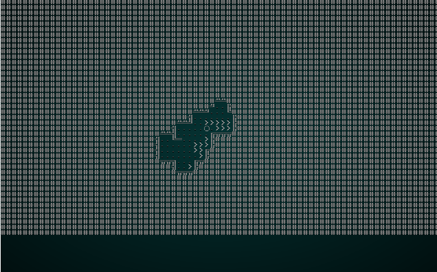
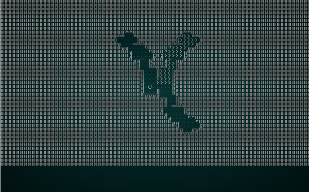

# Adding Symmetry and Brush Size as Library Functions

---

***About this tutorial***

*This tutorial is free and open source, and all code uses the MIT license - so you are free to do with it as you like. My hope is that you will enjoy the tutorial, and make great games!*

*If you enjoy this and would like me to keep writing, please consider supporting [my Patreon](https://www.patreon.com/blackfuture).*

---

In the previous chapter on Diffusion-Limited Aggregation, we introduced two new concepts for map building: *symmetry* and *brush size*. These readily apply to other algorithms, so we're going to take a moment to move them into library functions (in `map_builders/common.rs`), make them generic, and demonstrate how they can alter the Drunkard's Walk.

## Building the library versions

We'll start by moving the `DLASymmetry` enumeration out of `dla.rs` and into `common.rs`. We'll also change its name, since we are no longer binding it to a specific algorithm:

```rust
#[derive(PartialEq, Copy, Clone)]
pub enum Symmetry { None, Horizontal, Vertical, Both }
```

At the end of `common.rs`, we can add the following:

```rust
pub fn paint(map: &mut Map, mode: Symmetry, brush_size: i32, x: i32, y:i32) {
    match mode {
        Symmetry::None => apply_paint(map, brush_size, x, y),
        Symmetry::Horizontal => {
            let center_x = map.width / 2;
            if x == center_x {
                apply_paint(map, brush_size, x, y);                    
            } else {
                let dist_x = i32::abs(center_x - x);
                apply_paint(map, brush_size, center_x + dist_x, y);
                apply_paint(map, brush_size, center_x - dist_x, y);
            }
        }
        Symmetry::Vertical => {
            let center_y = map.height / 2;
            if y == center_y {
                apply_paint(map, brush_size, x, y);
            } else {
                let dist_y = i32::abs(center_y - y);
                apply_paint(map, brush_size, x, center_y + dist_y);
                apply_paint(map, brush_size, x, center_y - dist_y);
            }
        }
        Symmetry::Both => {
            let center_x = map.width / 2;
            let center_y = map.height / 2;
            if x == center_x && y == center_y {
                apply_paint(map, brush_size, x, y);
            } else {
                let dist_x = i32::abs(center_x - x);
                apply_paint(map, brush_size, center_x + dist_x, y);
                apply_paint(map, brush_size, center_x - dist_x, y);
                let dist_y = i32::abs(center_y - y);
                apply_paint(map, brush_size, x, center_y + dist_y);
                apply_paint(map, brush_size, x, center_y - dist_y);
            }
        }
    }
}

fn apply_paint(map: &mut Map, brush_size: i32, x: i32, y: i32) {
    match brush_size {
        1 => {
            let digger_idx = map.xy_idx(x, y);
            map.tiles[digger_idx] = TileType::Floor;
        }

        _ => {
            let half_brush_size = brush_size / 2;
            for brush_y in y-half_brush_size .. y+half_brush_size {
                for brush_x in x-half_brush_size .. x+half_brush_size {
                    if brush_x > 1 && brush_x < map.width-1 && brush_y > 1 && brush_y < map.height-1 {
                        let idx = map.xy_idx(brush_x, brush_y);
                        map.tiles[idx] = TileType::Floor;
                    }
                }
            }
        }
    }
}
```

This shouldn't be a surprise: it's the *exact* same code we had in `dla.rs` - but with the `&mut self` removed and instead taking parameters.

## Modifying dla.rs to use it

It's relatively simple to modify `dla.rs` to use it. Replace all `DLASymmetry` references with `Symmetry`. Replace all calls to `self.paint(x, y)` with `paint(&mut self.map, self.symmetry, self.brush_size, x, y);`. You can check the source code to see the changes - no need to repeat them all here. Make sure to include `paint` and `Symmetry` in the list of included functions at the top, too.

Like a lot of refactoring, the proof of the pudding is that if you `cargo run` your code - nothing has changed! We won't bother with a screenshot to show that it's the same as last time!

## Modifying Drunkard's Walk to use it

We'll start by modifying the `DrunkardSettings` struct to accept the two new features:

```rust
pub struct DrunkardSettings {
    pub spawn_mode : DrunkSpawnMode,
    pub drunken_lifetime : i32,
    pub floor_percent: f32,
    pub brush_size: i32,
    pub symmetry: Symmetry
}
```

The compiler will complain that we aren't setting these in our constructors, so we'll add some default values:

```rust
pub fn open_area(new_depth : i32) -> DrunkardsWalkBuilder {
    DrunkardsWalkBuilder{
        map : Map::new(new_depth),
        starting_position : Position{ x: 0, y : 0 },
        depth : new_depth,
        history: Vec::new(),
        noise_areas : HashMap::new(),
        settings : DrunkardSettings{
            spawn_mode: DrunkSpawnMode::StartingPoint,
            drunken_lifetime: 400,
            floor_percent: 0.5,
            brush_size: 1,
            symmetry: Symmetry::None
        }
    }
}
```

We need to make similar changes to the other constructors - just adding `brush_size` and `symmetry` to each of the `DrunkardSettings` builders.

We also need to replace the line:

```rust
self.map.tiles[drunk_idx] = TileType::DownStairs;
```

With:

```rust
paint(&mut self.map, self.settings.symmetry, self.settings.brush_size, drunk_x, drunk_y);
self.map.tiles[drunk_idx] = TileType::DownStairs;
```

The double-draw retains the function of adding `>` symbols to show you the walker's path, while retaining the overdraw of the paint function.

## Making a wider-carving drunk

To test this out, we'll add a new constructor to `drunkard.rs`:

```rust
pub fn fat_passages(new_depth : i32) -> DrunkardsWalkBuilder {
    DrunkardsWalkBuilder{
        map : Map::new(new_depth),
        starting_position : Position{ x: 0, y : 0 },
        depth : new_depth,
        history: Vec::new(),
        noise_areas : HashMap::new(),
        settings : DrunkardSettings{
            spawn_mode: DrunkSpawnMode::Random,
            drunken_lifetime: 100,
            floor_percent: 0.4,
            brush_size: 2,
            symmetry: Symmetry::None
        }
    }
}
```

We'll also quickly modify `random_builder` in `map_builders/mod.rs` to showcase this one:

```rust
pub fn random_builder(new_depth: i32) -> Box<dyn MapBuilder> {
    /*let mut rng = rltk::RandomNumberGenerator::new();
    let builder = rng.roll_dice(1, 12);
    match builder {
        1 => Box::new(BspDungeonBuilder::new(new_depth)),
        2 => Box::new(BspInteriorBuilder::new(new_depth)),
        3 => Box::new(CellularAutomotaBuilder::new(new_depth)),
        4 => Box::new(DrunkardsWalkBuilder::open_area(new_depth)),
        5 => Box::new(DrunkardsWalkBuilder::open_halls(new_depth)),
        6 => Box::new(DrunkardsWalkBuilder::winding_passages(new_depth)),
        7 => Box::new(MazeBuilder::new(new_depth)),
        8 => Box::new(DLABuilder::walk_inwards(new_depth)),
        9 => Box::new(DLABuilder::walk_outwards(new_depth)),
        10 => Box::new(DLABuilder::central_attractor(new_depth)),
        11 => Box::new(DLABuilder::insectoid(new_depth)),
        _ => Box::new(SimpleMapBuilder::new(new_depth))
    }*/
    Box::new(DrunkardsWalkBuilder::fat_passages(new_depth))
}
```

This shows an immediate change in the map generation:

.

Notice how the "fatter" digging area gives more open halls. It also runs in half the time, since we exhaust the desired floor count *much* more quickly.

## Adding Symmetry

Like DLA, symmetrical drunkards can make interesting looking maps. We'll add one more constructor:

```rust
pub fn fearful_symmetry(new_depth : i32) -> DrunkardsWalkBuilder {
    DrunkardsWalkBuilder{
        map : Map::new(new_depth),
        starting_position : Position{ x: 0, y : 0 },
        depth : new_depth,
        history: Vec::new(),
        noise_areas : HashMap::new(),
        settings : DrunkardSettings{
            spawn_mode: DrunkSpawnMode::Random,
            drunken_lifetime: 100,
            floor_percent: 0.4,
            brush_size: 1,
            symmetry: Symmetry::Both
        }
    }
}
```

We also modify our `random_builder` function to use it:

```rust
pub fn random_builder(new_depth: i32) -> Box<dyn MapBuilder> {
    /*let mut rng = rltk::RandomNumberGenerator::new();
    let builder = rng.roll_dice(1, 12);
    match builder {
        1 => Box::new(BspDungeonBuilder::new(new_depth)),
        2 => Box::new(BspInteriorBuilder::new(new_depth)),
        3 => Box::new(CellularAutomotaBuilder::new(new_depth)),
        4 => Box::new(DrunkardsWalkBuilder::open_area(new_depth)),
        5 => Box::new(DrunkardsWalkBuilder::open_halls(new_depth)),
        6 => Box::new(DrunkardsWalkBuilder::winding_passages(new_depth)),
        7 => Box::new(MazeBuilder::new(new_depth)),
        8 => Box::new(DLABuilder::walk_inwards(new_depth)),
        9 => Box::new(DLABuilder::walk_outwards(new_depth)),
        10 => Box::new(DLABuilder::central_attractor(new_depth)),
        11 => Box::new(DLABuilder::insectoid(new_depth)),
        _ => Box::new(SimpleMapBuilder::new(new_depth))
    }*/
    Box::new(DrunkardsWalkBuilder::fearful_symmetry(new_depth))
}
```

`cargo run` will render results something like these:

.

Notice how the symmetry is applied (really fast - we're blasting out the floor tiles, now!) - and then unreachable areas are culled, getting rid of part of the map. This is quite a nice map!

## Restoring Randomness Once More

Once again, we add our new algorithms to the `random_builder` function in `map_builders/mod.rs`:

```rust
pub fn random_builder(new_depth: i32) -> Box<dyn MapBuilder> {
    let mut rng = rltk::RandomNumberGenerator::new();
    let builder = rng.roll_dice(1, 14);
    match builder {
        1 => Box::new(BspDungeonBuilder::new(new_depth)),
        2 => Box::new(BspInteriorBuilder::new(new_depth)),
        3 => Box::new(CellularAutomotaBuilder::new(new_depth)),
        4 => Box::new(DrunkardsWalkBuilder::open_area(new_depth)),
        5 => Box::new(DrunkardsWalkBuilder::open_halls(new_depth)),
        6 => Box::new(DrunkardsWalkBuilder::winding_passages(new_depth)),
        7 => Box::new(DrunkardsWalkBuilder::fat_passages(new_depth)),
        8 => Box::new(DrunkardsWalkBuilder::fearful_symmetry(new_depth)),
        9 => Box::new(MazeBuilder::new(new_depth)),
        10 => Box::new(DLABuilder::walk_inwards(new_depth)),
        11 => Box::new(DLABuilder::walk_outwards(new_depth)),
        12 => Box::new(DLABuilder::central_attractor(new_depth)),
        13 => Box::new(DLABuilder::insectoid(new_depth)),
        _ => Box::new(SimpleMapBuilder::new(new_depth))
    }
}
```

We're up to 14 algorithms, now! We have an increasingly varied game!

## Wrap-Up

This chapter has demonstrated a very useful tool for the game programmer: finding a handy algorithm, making it generic, and using it in other parts of your code. It's rare to guess exactly what you need up-front (and there's a *lot* to be said for "you won't need it" - implementing things when you *do* need them), so it's a valuable weapon in our arsenal to be able to quickly refactor our code for reuse.

**The source code for this chapter may be found [here](https://github.com/thebracket/rustrogueliketutorial/tree/master/chapter-31-symmetry)**


[Run this chapter's example with web assembly, in your browser (WebGL2 required)](http://bfnightly.bracketproductions.com/rustbook/wasm/chapter-31-symmetry/)
---

Copyright (C) 2019, Herbert Wolverson.

---