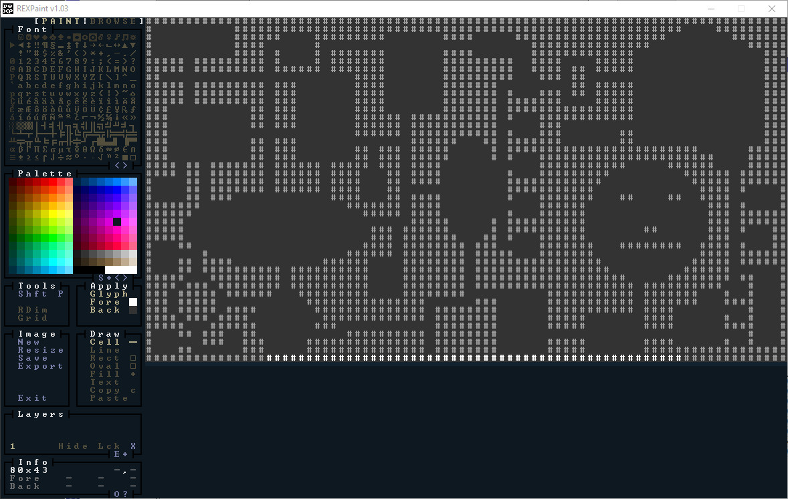
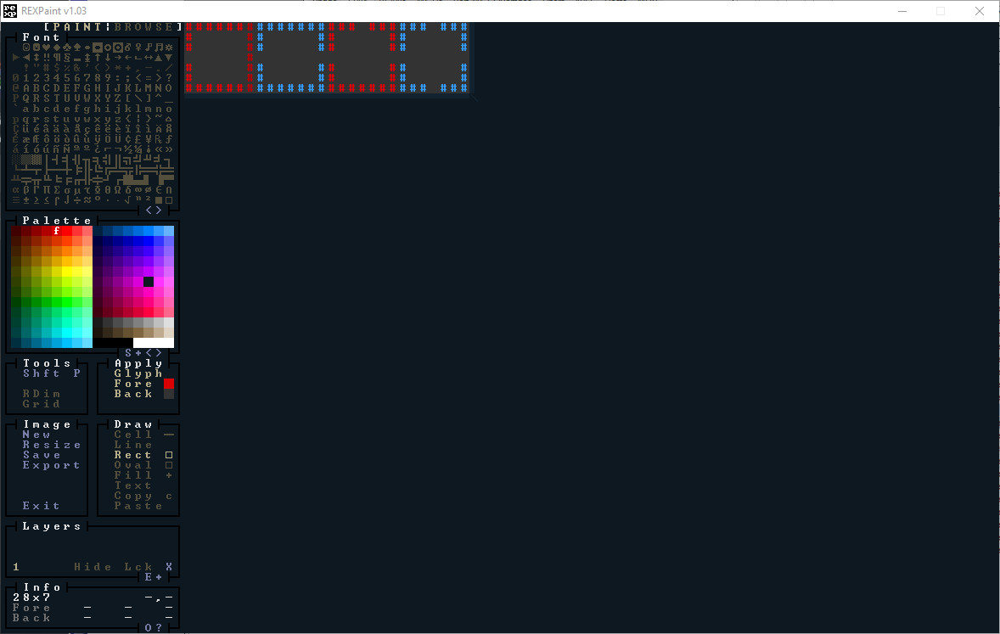
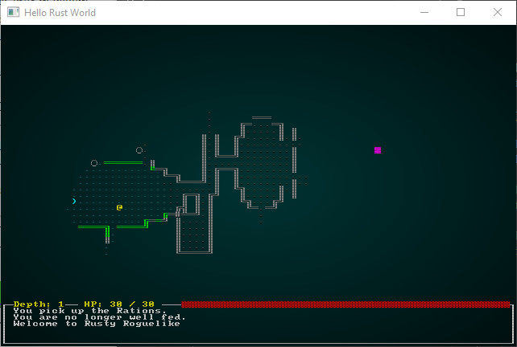
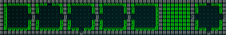
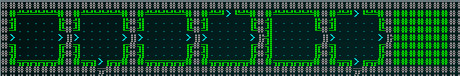
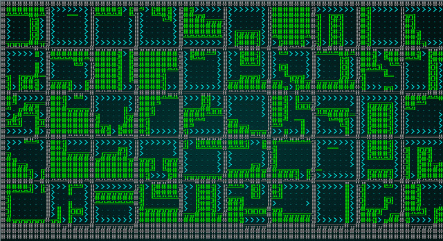

# Waveform Collapse

---

***About this tutorial***

*This tutorial is free and open source, and all code uses the MIT license - so you are free to do with it as you like. My hope is that you will enjoy the tutorial, and make great games!*

*If you enjoy this and would like me to keep writing, please consider supporting [my Patreon](https://www.patreon.com/blackfuture).*

---

A few years ago, *Waveform Collapse* (WFC) exploded onto the procedural generation scene. Apparently magical, it took images in - and made a similar image. Demos showed it spitting out great looking game levels, and the amazing Caves of Qud started using it for generating fun levels. The canonical demonstrations - along with the original algorithm in C# and various explanatory links/ports - may be [found here](https://github.com/mxgmn/WaveFunctionCollapse).

In this chapter, we're going to implement Waveform Collapse from scratch - and apply it to making fun Roguelike levels. Note that there is a crate with the original algorithm available (`wfc`, accompanied by `wfc-image`); it seemed pretty good in testing, but I had problems making it work with Web Assembly. I also didn't feel that I was really *teaching* the algorithm by saying "just import this". It's a longer chapter, but by the end you should feel comfortable with the algorithm.

## So what does WFC really do?

Waveform Collapse is unlike the map generation algorithms we've used so far in that it doesn't actually *make* maps. It takes source data in (we'll use other maps!), scans them, and builds a new map featuring elements made exclusively from the source data. It operates in a few phases:

1. It reads the incoming data. In the original implementation, this was a PNG file. In our implementation, this is a `Map` structure like others we've worked with; we'll also implement a REX Paint reader to load maps.
2. It divides the source image into "tiles", and optionally makes more tiles by mirroring the tiles it reads along one or two axes.
3. It either loads or builds a "constraints" graph. This is a set of rules specifying which tiles can go next to each other. In an image, this may be derived from tile adjacency. In a Roguelike map, connectivity of exits is a good metric. For a tile-based game, you might carefully build a layout of what can go where.
4. It then divides the output image into tile-sized chunks, and sets them all to "empty". The first tile placed will be pretty random, and then it selects areas and examines tile data that is already known - placing down tiles that are compatible with what is already there. Eventually, it's placed all of the tiles - and you have a map/image!

The name "Waveform Collapse" refers to the Quantum Physics idea that a particle may have not actually *have* a state until you look at it. In the algorithm, tiles don't really *coalesce* into being until you pick one to examine. So there is a slight similarity to Quantum Physics. In reality, though - the name is a triumph of marketing. The algorithm is what is known as a *solver* - given a set of constraints, it iterates through possible solutions until the constraints are *solved*. This isn't a new concept - [Prolog](https://en.wikipedia.org/wiki/Prolog) is an entire programming language based around this idea, and it first hit the scene in 1972. So in a way, it's older than me!

## Getting started: Rust support for complex modules

All our previous algorithms were small enough to fit into one source code file, without too much paging around to find the relevant bit of code. Waveform Collapse is complicated enough that it deserves to be broken into multiple files - in much the same was as the `map_builders` module was broken into a `module` - WFC will be divided into its own `module`. The module will still live inside `map_builders` - so in a way it's really a *sub-module*.

Rust makes it pretty easy to break any module into multiple files: you create a directory inside the *parent* module, and put a file in it called `mod.rs`. You can then put more files in the folder, and so long as you enable them (with `mod myfile`) and use the contents (with `use myfile::MyElement`) it works just like a single file.

So to get started, inside your `map_builders` directory - make a new directory called `waveform_collapse`. Add a file, `mod.rs` into it. You should have a source tree like this:

```
\ src
   \ map_builders
      \ waveform_collapse
         + mod.rs
      bsp_dungeon.rs
      (etc)
   main.rs
   (etc)
```

We'll populate `mod.rs` with a skeletal implementation similar to previous chapters:

```rust
use super::{MapBuilder, Map, TileType, Position, spawner, SHOW_MAPGEN_VISUALIZER,
    generate_voronoi_spawn_regions, remove_unreachable_areas_returning_most_distant};
use rltk::RandomNumberGenerator;
use specs::prelude::*;

pub struct WaveformCollapseBuilder {
    map : Map,
    starting_position : Position,
    depth: i32,
    history: Vec<Map>,
    noise_areas : HashMap<i32, Vec<usize>>
}

impl MapBuilder for WaveformCollapseBuilder {
    fn get_map(&self) -> Map {
        self.map.clone()
    }

    fn get_starting_position(&self) -> Position {
        self.starting_position.clone()
    }

    fn get_snapshot_history(&self) -> Vec<Map> {
        self.history.clone()
    }

    fn build_map(&mut self)  {
        self.build();
    }

    fn spawn_entities(&mut self, ecs : &mut World) {
        for area in self.noise_areas.iter() {
            spawner::spawn_region(ecs, area.1, self.depth);
        }
    }

    fn take_snapshot(&mut self) {
        if SHOW_MAPGEN_VISUALIZER {
            let mut snapshot = self.map.clone();
            for v in snapshot.revealed_tiles.iter_mut() {
                *v = true;
            }
            self.history.push(snapshot);
        }
    }
}

impl WaveformCollapseBuilder {
    pub fn new(new_depth : i32) -> WaveformCollapseBuilder {
        WaveformCollapseBuilder{
            map : Map::new(new_depth),
            starting_position : Position{ x: 0, y : 0 },
            depth : new_depth,
            history: Vec::new(),
            noise_areas : HashMap::new()
        }
    }    

    fn build(&mut self) {
        let mut rng = RandomNumberGenerator::new();

        // TODO: Builder goes here

        // Find a starting point; start at the middle and walk left until we find an open tile
        self.starting_position = Position{ x: self.map.width / 2, y : self.map.height / 2 };
        /*let mut start_idx = self.map.xy_idx(self.starting_position.x, self.starting_position.y);
        while self.map.tiles[start_idx] != TileType::Floor {
            self.starting_position.x -= 1;
            start_idx = self.map.xy_idx(self.starting_position.x, self.starting_position.y);
        }*/
        self.take_snapshot();

        // Find all tiles we can reach from the starting point
        let exit_tile = remove_unreachable_areas_returning_most_distant(&mut self.map, start_idx);
        self.take_snapshot();

        // Place the stairs
        self.map.tiles[exit_tile] = TileType::DownStairs;
        self.take_snapshot();

        // Now we build a noise map for use in spawning entities later
        self.noise_areas = generate_voronoi_spawn_regions(&self.map, &mut rng);
    }

}
```

We'll also modify `map_builders/mod.rs`'s `random_builder` function to always return the algorithm we're currently working with:

```rust
pub fn random_builder(new_depth: i32) -> Box<dyn MapBuilder> {
    /*
    let mut rng = rltk::RandomNumberGenerator::new();
    let builder = rng.roll_dice(1, 16);
    match builder {
        1 => Box::new(BspDungeonBuilder::new(new_depth)),
        2 => Box::new(BspInteriorBuilder::new(new_depth)),
        3 => Box::new(CellularAutomotaBuilder::new(new_depth)),
        4 => Box::new(DrunkardsWalkBuilder::open_area(new_depth)),
        5 => Box::new(DrunkardsWalkBuilder::open_halls(new_depth)),
        6 => Box::new(DrunkardsWalkBuilder::winding_passages(new_depth)),
        7 => Box::new(DrunkardsWalkBuilder::fat_passages(new_depth)),
        8 => Box::new(DrunkardsWalkBuilder::fearful_symmetry(new_depth)),
        9 => Box::new(MazeBuilder::new(new_depth)),
        10 => Box::new(DLABuilder::walk_inwards(new_depth)),
        11 => Box::new(DLABuilder::walk_outwards(new_depth)),
        12 => Box::new(DLABuilder::central_attractor(new_depth)),
        13 => Box::new(DLABuilder::insectoid(new_depth)),
        14 => Box::new(VoronoiCellBuilder::pythagoras(new_depth)),
        15 => Box::new(VoronoiCellBuilder::manhattan(new_depth)),
        _ => Box::new(SimpleMapBuilder::new(new_depth))
    }*/
    Box::new(WaveformCollapseBuilder::new(new_depth))
}
```

This will give you an empty map (all walls) if you `cargo run` it - but it's a good starting point.

## Loading the source image - REX Paint

You may remember back in [section 2](chapter_21.html) we loaded a REX Paint file to use as the main menu screen. We're going to do similar here, but we're going to turn it into a playable map. It's a deliberately odd map to help illustrate what you can do with this algorithm. Here's the original in REX Paint:

.

I've tried to include some interesting shapes, a silly face, and plenty of corridors and different sized rooms. Here's a second REX Paint file, designed to be more like the old board game [The Sorcerer's Cave](https://en.wikipedia.org/wiki/The_Sorcerer%27s_Cave), of which the algorithm reminds me - tiles with 1 exit, 2 exits, 3 exits and 4. It would be easy to make these prettier, but we'll keep it simple for demonstration purposes.

.

These files are found in the `resources` directory, as `wfc-demo1.xp` and `wfc-demo2.xp`. One thing I love about REX Paint: the files are *tiny* (102k and 112k respectively). To make accessing them easier - and avoid having to ship them with the executable when you publish your finished game, we'll *embed* them into our game. We did this previously for the main menu. Modify `rex_assets.xp` to include the new files:

```rust
use rltk::{rex::XpFile};

rltk::embedded_resource!(SMALL_DUNGEON, "../../resources/SmallDungeon_80x50.xp");
rltk::embedded_resource!(WFC_DEMO_IMAGE1, "../../resources/wfc-demo1.xp");
rltk::embedded_resource!(WFC_DEMO_IMAGE2, "../../resources/wfc-demo2.xp");

pub struct RexAssets {
    pub menu : XpFile
}

impl RexAssets {
    #[allow(clippy::new_without_default)]
    pub fn new() -> RexAssets {
        rltk::link_resource!(SMALL_DUNGEON, "../../resources/SmallDungeon_80x50.xp");
        rltk::link_resource!(WFC_DEMO_IMAGE1, "../../resources/wfc-demo1.xp");
        rltk::link_resource!(WFC_DEMO_IMAGE2, "../../resources/wfc-demo2.xp");

        RexAssets{
            menu : XpFile::from_resource("../../resources/SmallDungeon_80x50.xp").unwrap()
        }
    }
}
```

Finally, we should *load* the map itself! Inside the `waveform_collapse` directory, make a new file: `image_loader.rs`:

```rust
use rltk::rex::XpFile;
use super::{Map, TileType};

/// Loads a RexPaint file, and converts it into our map format
pub fn load_rex_map(new_depth: i32, xp_file : &XpFile) -> Map {
    let mut map : Map = Map::new(new_depth);

    for layer in &xp_file.layers {
        for y in 0..layer.height {
            for x in 0..layer.width {
                let cell = layer.get(x, y).unwrap();
                if x < map.width as usize && y < map.height as usize {
                    let idx = map.xy_idx(x as i32, y as i32);
                    match cell.ch {
                        32 => map.tiles[idx] = TileType::Floor, // #
                        35 => map.tiles[idx] = TileType::Wall, // #
                        _ => {}
                    }
                }
            }
        }
    }

    map
}
```

This is really simple, and if you remember the main menu graphic tutorial it should be quite self-explanatory. This function:

1. Accepts arguments for `new_depth` (because maps want it) and a *reference* to an `XpFile` - a REX Paint map. It will be made completely solid, walls everywhere by the constructor.
2. It creates a new map, using the `new_depth` parameter.
3. For each *layer* in the REX Paint file (there should be only one at this point):
    1. For each `y` and `x` on that layer:
        1. Load the tile information for that coordinate.
        2. Ensure that we're within the map boundaries (in case we have a mismatch in sizes).
        3. Calculate the `tiles` index for the cell.
        4. Match on the cell glyph; if its a `#` (35) we place a wall, if its a space (32) we place a floor.

Now we can modify our `build` function (in `mod.rs`) to load the map:

```rust
fn build(&mut self) {
    let mut rng = RandomNumberGenerator::new();

    self.map = load_rex_map(self.depth, &rltk::rex::XpFile::from_resource("../../resources/wfc-demo1.xp").unwrap());
    self.take_snapshot();

    // Find a starting point; start at the middle and walk left until we find an open tile
    self.starting_position = Position{ x: self.map.width / 2, y : self.map.height / 2 };
    ...
```

At the top, we have to tell it to *use* the new `image_loader` file:

```rust
mod image_loader;
use image_loader::*;
```

Note that we're *not* putting `pub` in front of these: we're using them, but not exposing them outside of the module. This helps us keep our code clean, and our compile times short!

In and of itself, this is cool - we can now load any REX Paint designed level and play it! If you `cargo run` now, you'll find that you can play the new map:

.

We'll make use of this in later chapters for *vaults*, *prefabs* and *pre-designed levels* - but for now, we'll just use it as source data for later in the Waveform Collapse implementation.

## Carving up our map into tiles

We discussed earlier that WFC works by carving the original image into chunks/tiles, and optionally flipping them in different directions. It does this as the first part of building *constraints* - how the map can be laid out. So now we need to start carving up our image.

We'll start by picking a tile size (we're going to call it `chunk_size`). We'll make it a constant for now (it'll become tweakable later), and start with a size of `7` - because that was the size of the tiles in our second REX demo file. We'll also call a function we'll write in a moment:

```rust
fn build(&mut self) {
    let mut rng = RandomNumberGenerator::new();

    const CHUNK_SIZE :i32 = 7;

    self.map = load_rex_map(self.depth, &rltk::rex::XpFile::from_resource("../../resources/wfc-demo2.xp").unwrap());
    self.take_snapshot();

    let patterns = build_patterns(&self.map, CHUNK_SIZE, true, true);
    ...
```

Since we're dealing with *constraints*, we'll make a new file in our `map_builders/waveform_collapse` directory - `constraints.rs`. We're going to make a function called `build_patterns`:

```rust
use super::{TileType, Map};
use std::collections::HashSet;

pub fn build_patterns(map : &Map, chunk_size: i32, include_flipping: bool, dedupe: bool) -> Vec<Vec<TileType>> {
    let chunks_x = map.width / chunk_size;
    let chunks_y = map.height / chunk_size;
    let mut patterns = Vec::new();

    for cy in 0..chunks_y {
        for cx in 0..chunks_x {
            // Normal orientation
            let mut pattern : Vec<TileType> = Vec::new();
            let start_x = cx * chunk_size;
            let end_x = (cx+1) * chunk_size;
            let start_y = cy * chunk_size;
            let end_y = (cy+1) * chunk_size;

            for y in start_y .. end_y {
                for x in start_x .. end_x {
                    let idx = map.xy_idx(x, y);
                    pattern.push(map.tiles[idx]);
                }
            }
            patterns.push(pattern);

            if include_flipping {
                // Flip horizontal
                pattern = Vec::new();
                for y in start_y .. end_y {
                    for x in start_x .. end_x {
                        let idx = map.xy_idx(end_x - (x+1), y);
                        pattern.push(map.tiles[idx]);
                    }
                }
                patterns.push(pattern);

                // Flip vertical
                pattern = Vec::new();
                for y in start_y .. end_y {
                    for x in start_x .. end_x {
                        let idx = map.xy_idx(x, end_y - (y+1));
                        pattern.push(map.tiles[idx]);
                    }
                }
                patterns.push(pattern);

                // Flip both
                pattern = Vec::new();
                for y in start_y .. end_y {
                    for x in start_x .. end_x {
                        let idx = map.xy_idx(end_x - (x+1), end_y - (y+1));
                        pattern.push(map.tiles[idx]);
                    }
                }
                patterns.push(pattern);
            }
        }
    }

    // Dedupe
    if dedupe {
        println!("Pre de-duplication, there are {} patterns", patterns.len());
        let set: HashSet<Vec<TileType>> = patterns.drain(..).collect(); // dedup
        patterns.extend(set.into_iter());
        println!("There are {} patterns", patterns.len());
    }

    patterns
}
```

That's quite the mouthful of a function, so let's walk through it:

1. At the top, we're importing some items from elsewhere in the project: `Map`, `TileType`, and the built-in collection `HashMap`.
2. We declare our `build_patterns` function, with parameters for a *reference* to the source map, the `chunk_size` to use (tile size), and *flags* (`bool` variables) for `include_flipping` and `dedupe`. These indicate which features we'd like to use when reading the source map. We're returning a `vector`, containing a series of `vector`s of different `TileType`s. The outer container holds each *pattern*. The inner vector holds the `TileType`s that make up the pattern itself.
3. We determine how many chunks there are in each direction and store it in `chunks_x` and `chunks_y`.
4. We create a new `vector` called `patterns`. This will hold the result of the function; we don't declare it's type, because Rust is smart enough to see that we're returning it at the end of the function - and can figure out what type it is for us.
5. We iterate every vertical chunk in the variable `cy`:
    1. We iterate every horizontal chunk in the variable `cx`:
        1. We make a new `vector` to hold this pattern.
        2. We calculate `start_x`, `end_x`, `start_y` and `end_y` to hold the four corner coordinates of this chunk - on the original map.
        3. We iterate the pattern in `y`/`x` order (to match our map format), read in the `TileType` of each map tile within the chunk, and add it to the pattern.
        4. We push the pattern to the `patterns` result vector.
        5. If `include_flipping` is set to `true` (because we'd like to flip our tiles, making more tiles!):
            1. Repeat iterating `y`/`x` in different orders, giving 3 more tiles. Each is added to the `patterns` result vector.
6. If `dedupe` is set, then we are "de-duplicating" the pattern buffer. Basically, removing any pattern that occurs more than once. This is good for a map with lots of wasted space, if you don't want to make an equally sparse result map. We de-duplicate by adding the patterns into a `HashMap` (which can only store one of each entry) and then reading it back out again.

For this to compile, we have to make `TileType` know how to convert itself into a *hash*. `HashMap` uses "hashes" (basically a checksum of the contained values) to determine if an entry is unique, and to help find it. In `map.rs`, we can simply add one more derived attribute to the `TileType` enumeration:

```rust
#[derive(PartialEq, Eq, Hash, Copy, Clone, Serialize, Deserialize)]
pub enum TileType {
    Wall, Floor, DownStairs
}
```

This code should get you every 7x7 tile within your source file - but it'd be *great* to be able to prove that it works! As Reagan's speech-writer once wrote, *Trust - But Verify*. In `constraints.rs`, we'll add another function: `render_pattern_to_map`:

```rust
fn render_pattern_to_map(map : &mut Map, pattern: &Vec<TileType>, chunk_size: i32, start_x : i32, start_y: i32) {
    let mut i = 0usize;
    for tile_y in 0..chunk_size {
        for tile_x in 0..chunk_size {
            let map_idx = map.xy_idx(start_x + tile_x, start_y + tile_y);
            map.tiles[map_idx] = pattern[i];
            map.visible_tiles[map_idx] = true;
            i += 1;
        }
    }
}
```

This is pretty simple: iterate the pattern, and copy to a location on the map - offset by the `start_x` and `start_y` coordinates. Note that we're also marking the tile as `visible` - this will make the renderer display our tiles in color.

Now we just need to display our tiles as part of the `snapshot` system. In `waveform_collapse/mod.rs` add a new function as part of the *implementation* of `WaveformCollapseBuilder` (underneath `build`). It's a *member* function because it needs access to the `take_snapshot` command:

```rust
fn render_tile_gallery(&mut self, patterns: &Vec<Vec<TileType>>, chunk_size: i32) {
    self.map = Map::new(0);
    let mut counter = 0;
    let mut x = 1;
    let mut y = 1;
    while counter < patterns.len() {
        render_pattern_to_map(&mut self.map, &patterns[counter], chunk_size, x, y);

        x += chunk_size + 1;
        if x + chunk_size > self.map.width {
            // Move to the next row
            x = 1;
            y += chunk_size + 1;

            if y + chunk_size > self.map.height {
                // Move to the next page
                self.take_snapshot();
                self.map = Map::new(0);

                x = 1;
                y = 1;
            }
        }

        counter += 1;
    }
    self.take_snapshot();
}
```

Now, we need to call it. In `build`:

```rust
let patterns = build_patterns(&self.map, CHUNK_SIZE, true, true);
self.render_tile_gallery(&patterns, CHUNK_SIZE);
```

Also, comment out some code so that it doesn't crash from not being able to find a starting point:

```rust
let mut start_idx = self.map.xy_idx(self.starting_position.x, self.starting_position.y);
/*while self.map.tiles[start_idx] != TileType::Floor {
    self.starting_position.x -= 1;
    start_idx = self.map.xy_idx(self.starting_position.x, self.starting_position.y);
}*/
```

If you `cargo run` now, it'll show you the tile patterns from map sample 2:

.

Notice how *flipping* has given us multiple variants of each tile. If we change the image loading code to load `wfc-demo1` (by changing the loader to `self.map = load_rex_map(self.depth, &rltk::rex::XpFile::from_resource("../../resources/wfc-demo1.xp").unwrap());`), we get chunks of our hand-drawn map:

.

## Building the constraints matrix

Now we need to begin to tell the algorithm how it *can* place tiles next to one another. We could go for a simple "what's next to it on the original image?" algorithm, but that would ignore a key factor in roguelike maps: connectivity. We're far more interested in the ability to go from *point A* to *point B* than we are in overall aesthetics! So we need to write a *constraint builder* that takes into account *connectivity*.

We'll start by extending `builder` in `mod.rs` to call a hypothetical function we'll implement in a second:

```rust
let patterns = build_patterns(&self.map, CHUNK_SIZE, true, true);
self.render_tile_gallery(&patterns, CHUNK_SIZE);
let constraints = patterns_to_constaints(patterns, CHUNK_SIZE);
```

This gives us the signature of a new method, `patterns_to_constraints` to add to `constraints.rs`. We're also going to need a new type and a helper function. We'll use these in other places, so we're going to add a new file to the `waveform_collapse` folder - `common.rs`.

```rust
use super::TileType;

#[derive(PartialEq, Eq, Hash, Clone)]
pub struct MapChunk {
    pub pattern : Vec<TileType>,
    pub exits: [Vec<bool>; 4],
    pub has_exits: bool,
    pub compatible_with: [Vec<usize>; 4]
}

pub fn tile_idx_in_chunk(chunk_size: i32, x:i32, y:i32) -> usize {
    ((y * chunk_size) + x) as usize
}
```

We're defining `MapChunk` to be a structure, containing the actual pattern, a structure of *exits* (more on that in a moment), a `bool` to say we have *any* exits, and a structure called `compatible_with` (more on that in a second, too). We're also defining `tile_idx_in_chunk` - which is just like `map.xy_idx` - but constrained to a small tile type.

Now we'll write `patterns_to_constraints` in `constraints.rs`:

```rust
pub fn patterns_to_constaints(patterns: Vec<Vec<TileType>>, chunk_size : i32) -> Vec<MapChunk> {
    // Move into the new constraints object
    let mut constraints : Vec<MapChunk> = Vec::new();
    for p in patterns {
        let mut new_chunk = MapChunk{
            pattern: p,
            exits: [ Vec::new(), Vec::new(), Vec::new(), Vec::new() ],
            has_exits : true,
            compatible_with: [ Vec::new(), Vec::new(), Vec::new(), Vec::new() ]
        };
        for exit in new_chunk.exits.iter_mut() {
            for _i in 0..chunk_size {
                exit.push(false);
            }
        }

        let mut n_exits = 0;
        for x in 0..chunk_size {
            // Check for north-bound exits            
            let north_idx = tile_idx_in_chunk(chunk_size, x, 0);
            if new_chunk.pattern[north_idx] == TileType::Floor {
                new_chunk.exits[0][x as usize] = true;
                n_exits += 1;
            }

            // Check for south-bound exits
            let south_idx = tile_idx_in_chunk(chunk_size, x, chunk_size-1);
            if new_chunk.pattern[south_idx] == TileType::Floor {
                new_chunk.exits[1][x as usize] = true;
                n_exits += 1;
            }

            // Check for west-bound exits
            let west_idx = tile_idx_in_chunk(chunk_size, 0, x);
            if new_chunk.pattern[west_idx] == TileType::Floor {
                new_chunk.exits[2][x as usize] = true;
                n_exits += 1;
            }

            // Check for east-bound exits
            let east_idx = tile_idx_in_chunk(chunk_size, chunk_size-1, x);
            if new_chunk.pattern[east_idx] == TileType::Floor {
                new_chunk.exits[3][x as usize] = true;
                n_exits += 1;
            }
        }

        if n_exits == 0 {
            new_chunk.has_exits = false;
        }

        constraints.push(new_chunk);
    }

    // Build compatibility matrix
    let ch = constraints.clone();
    for c in constraints.iter_mut() {
        for (j,potential) in ch.iter().enumerate() {
            // If there are no exits at all, it's compatible
            if !c.has_exits || !potential.has_exits {
                for compat in c.compatible_with.iter_mut() {
                    compat.push(j);
                }
            } else {
                // Evaluate compatibilty by direction
                for (direction, exit_list) in c.exits.iter_mut().enumerate() {
                    let opposite;
                    match direction {
                        0 => opposite = 1, // Our North, Their South
                        1 => opposite = 0, // Our South, Their North
                        2 => opposite = 3, // Our West, Their East
                        _ => opposite = 2 // Our East, Their West
                    }

                    let mut it_fits = false;
                    let mut has_any = false;
                    for (slot, can_enter) in exit_list.iter().enumerate() {
                        if *can_enter {
                            has_any = true;
                            if potential.exits[opposite][slot] {
                                it_fits = true;
                            }
                        }
                    }
                    if it_fits {
                        c.compatible_with[direction].push(j);
                    }
                    if !has_any {
                        // There's no exits on this side, we don't care what goes there
                        for compat in c.compatible_with.iter_mut() {
                            compat.push(j);
                        }
                    }
                }
            }
        }
    }

    constraints
}
```

This is a *really big function*, but clearly broken down into sections. Let's take the time to walk through what it actually *does*:

1. It accepts a first parameter, `patterns` as `Vec<Vec<TileType>>` - the type we used to build our patterns. A second parameter, `chunk_size` is the same as we've used before. It returns a `vector` of the new `MapChunk` type. A `MapChunk` is a *pattern*, but with additional exit and compatibility information added to it. So we're promising that given a set of pattern graphics, we're going to *add* all the navigation information to it and return the patterns as a set of chunks.
2. It makes a new `Vec` of type `MapChunk` called `constraints`. This is our *result* - we'll be adding to it, and returning it to the caller at the end.
3. Now we iterate every *pattern* in `patterns`, calling it `p` (to save typing). For each pattern:
    1. We make a new `MapChunk`. The `pattern` field gets a copy of our pattern. `exits` is an *array* (fixed size set; in this case of size 4) of vectors, so we insert 4 empty vectors into it. `compatible_with` is also an array of vectors, so we set those to new - empty - vectors. We set `has_exits` to `true` - we'll set that later.
    2. We iterate from 0 to `chunk_size`, and add `false` into each `exits` field of the new map chunk. The `exits` structure represents one entry per possible direction (North, South, West, East) - so it needs one entry per size of the chunk to represent each possible exit tile in that direction. We'll check for actual connectivity later - for now, we just want placeholders for each direction.
    3. We set `n_exits` to 0, and make it *mutable* - so we can add to it later. We'll be counting the total number of exits on the way through.
    4. We iterate `x` from 0 to `chunk_size`, and for each value of `x`:
        1. We check for north-bound exits. These are always at the location `(x, 0)` within the chunk - so we calculate the tile index to check as `tile_idx_in_chunk(chunk_size, x, 0)`. If that tile is a floor, we add one to `n_exits` and set `new_chunk.exits[0][x]` to `true`.
        2. We do the same for south-bound exits. These are always at the location `(x, chunk_size-1)`, so we calculate the chunk index to be `tile_idx_in_chunk(chunk_size, x, chunk_size-1)`. If that tile is a floor, we add one to `n_exits` and set `new_chunks.exits[1][x]` to `true`.
        3. We do the same again for west-bound, which are at location `(0,x)`.
        4. We do the same again for east-bound, which are at location `(chunk_size-1,0)`.
    5. If `n_exits` is 0, we set `new_chunk.has_exits` to 0 - there's no way in or out of this chunk!
    6. We push `new_chunk` to the `constraints` result vector.
4. Now it's time to build a compatibility matrix! The idea here is to match which tiles can be placed to which *other* tiles, by matching exits on adjacent edges.
5. To avoid borrow-checker issues, we take a copy of the existing constraints with `let ch = constraints.clone();`. Rust isn't a big fan of both reading from and writing to the same `vector` at once - so this avoids us having to do a dance to keep it separated.
6. For each `constraint` in or results vector `constraints`, named `c` we:
    1. Iterate every constraint in `ch`, our copy of the constraints vector, as `potential`. We add an enumerator, `j` to tell us how it is indexed.
        1. If neither `c` (the constraint we are editing) or `potential` (the constraint we are examining) has exits, then we make it compatible with *everything*. We do this to increase the chances of a map being successfully resolved and still featuring these tiles (otherwise, they would never be chosen). To add compatibility with everything, we add `j` to the `compatibile_with` structure for *all four directions*. So `c` can be placed next to `potential` in *any* direction.
        2. Otherwise, we iterate through all four exit directions on `c`:
            1. We set `opposite` to the reciprocal of the direction we're evaluating; so North goes to South, East to West, etc.
            2. We setup two mutable variables, `it_fits` and `has_any` - and set both to `false`. We'll use these in the next steps. `it_fits` means that there are one or more matching exits between `c`'s exit tiles and `potential`'s entry tiles. `has_any` means that `c` has *any* exits at all in this direction. We distinguish between the two because if there are *no* exits in that direction, we don't care what the neighbor is - we can't affect it. If there *are* exits, then we only want to be compatible with tiles *you can actually visit*.
            3. We iterate `c`'s *exits*, keeping both a `slot` (the tile number we are evaluating) and the value of the `exit` tile (`can_enter`). You'll remember that we've set these to `true` if they are a floor - and `false` otherwise - so we're iterating possible exits.
                1. If `can_enter` is `true`, then we set `has_any` to true - it has an exit in that direction.
                2. We check `potential_exits.exits[opposite][slot]` - that is that *matching* exit on the other tile, in the *opposite* direction to the way we're going. If there is a match-up, then you can go from tile `c` to tile `potential` in our current `direction`! That lets us set `it_fits` to true.
            4. If `it_fits` is `true`, then there is a compatibility between the tiles: we add `j` to `c`'s `compatible_with` vector for the current direction.
            5. If `has_any` is `false`, then we don't care about adjacency in this direction - so we add `j` to the compatibility matrix for all directions, just like we did for a tile with no exits.
7. Finally, we return our `constraints` results vector.

That's quite a complicated algorithm, so we don't really want to *trust* that I got it right. We'll verify exit detection by adjusting our tile gallery code to show exits. In `build`, tweak the rendering order and what we're passing to `render_tile_gallery`:

```rust
let patterns = build_patterns(&self.map, CHUNK_SIZE, true, true);
let constraints = patterns_to_constaints(patterns, CHUNK_SIZE);
self.render_tile_gallery(&constraints, CHUNK_SIZE);
```

We also need to modify `render_tile_gallery`:

```rust
fn render_tile_gallery(&mut self, constraints: &Vec<MapChunk>, chunk_size: i32) {
    self.map = Map::new(0);
    let mut counter = 0;
    let mut x = 1;
    let mut y = 1;
    while counter < constraints.len() {
        render_pattern_to_map(&mut self.map, &constraints[counter], chunk_size, x, y);

        x += chunk_size + 1;
        if x + chunk_size > self.map.width {
            // Move to the next row
            x = 1;
            y += chunk_size + 1;

            if y + chunk_size > self.map.height {
                // Move to the next page
                self.take_snapshot();
                self.map = Map::new(0);

                x = 1;
                y = 1;
            }
        }

        counter += 1;
    }
    self.take_snapshot();
}
```

This requires that we modify our `render_pattern_to_map` function, also:

```rust
pub fn render_pattern_to_map(map : &mut Map, chunk: &MapChunk, chunk_size: i32, start_x : i32, start_y: i32) {
    let mut i = 0usize;
    for tile_y in 0..chunk_size {
        for tile_x in 0..chunk_size {
            let map_idx = map.xy_idx(start_x + tile_x, start_y + tile_y);
            map.tiles[map_idx] = chunk.pattern[i];
            map.visible_tiles[map_idx] = true;
            i += 1;
        }
    }

    for (x,northbound) in chunk.exits[0].iter().enumerate() {
        if *northbound {
            let map_idx = map.xy_idx(start_x + x as i32, start_y);
            map.tiles[map_idx] = TileType::DownStairs;
        }
    }
    for (x,southbound) in chunk.exits[1].iter().enumerate() {
        if *southbound {
            let map_idx = map.xy_idx(start_x + x as i32, start_y + chunk_size -1);
            map.tiles[map_idx] = TileType::DownStairs;
        }
    }
    for (x,westbound) in chunk.exits[2].iter().enumerate() {
        if *westbound {
            let map_idx = map.xy_idx(start_x, start_y + x as i32);
            map.tiles[map_idx] = TileType::DownStairs;
        }
    }
    for (x,eastbound) in chunk.exits[2].iter().enumerate() {
        if *eastbound {
            let map_idx = map.xy_idx(start_x + chunk_size - 1, start_y + x as i32);
            map.tiles[map_idx] = TileType::DownStairs;
        }
    }
}
```

Now that we have the demo framework running, we can `cargo run` the project - and see the tiles from `wfc-demo2.xp` correctly highlighting the exits:

.

The `wfc-demo1.xp` exits are also highlighted:

.

That's great! Our exit finder is working correctly.

## Building the Solver

Do you remember the old books of logic problems you used to be able to buy for long trips? "Fred is a lawyer, Mary is a doctor, and Jim is unemployed. Fred can't sit next to unemployed people, because he's snooty. Mary likes everyone. How should you arrange their seating?" This is an example of the type of *constrained problem* a *solver* is designed to help with. Building our map is no different - we're reading the *constraints* matrix (which we built above) to determine which tiles we can place in any given area. Because it's a roguelike, and we want something different every time, we want to inject some randomness - and get a *different* but *valid* map every time.

Let's extend our `build` function to call a hypothetical solver:

```rust
let patterns = build_patterns(&self.map, CHUNK_SIZE, true, true);
let constraints = patterns_to_constaints(patterns, CHUNK_SIZE);
self.render_tile_gallery(&constraints, CHUNK_SIZE);
        
self.map = Map::new(self.depth);
loop {
    let mut solver = Solver::new(constraints.clone(), CHUNK_SIZE, &self.map);
    while !solver.iteration(&mut self.map, &mut rng) {
        self.take_snapshot();
    }
    self.take_snapshot();
    if solver.possible { break; } // If it has hit an impossible condition, try again
}
```

We make a freshly solid map (since we've been using it for rendering tile demos, and don't want to pollute the final map with a demo gallery!). Then we `loop` (the Rust loop that runs forever until something calls `break`). Inside that loop, we create a solver for a copy of the `constraints` matrix (we copy it in case we have to go through repeatedly; otherwise, we'd have to `move` it in and `move` it out again). We repeatedly call the solver's `iteration` function, taking a snapshot each time - until it reports that it is done. If the `solver` gave up and said it wasn't possible, we try again.

We'll start by adding `solver.rs` to our `waveform_collapse` directory. The solver needs to keep its own state: that is, as it iterates through, it needs to know how far it has come. We'll support this by making `Solver` into a struct:

```rust
pub struct Solver {
    constraints: Vec<MapChunk>,
    chunk_size : i32,
    chunks : Vec<Option<usize>>,
    chunks_x : usize,
    chunks_y : usize,
    remaining : Vec<(usize, i32)>, // (index, # neighbors)
    pub possible: bool
}
```

It stores the `constraints` we've been building, the `chunk_size` we're using, the `chunks` we're resolving (more on that in a second), the number of chunks it can fit onto the target map (`chunks_x`, and `chunks_y`), a `remaining` vector (more on that, too), and a `possible` indicator to indicate whether or not it gave up.

`chunks` is a vector of `Option<usize>`. The `usize` value is the index of the chunk. It's an *option* because we may not have filled it in, yet - so it might be `None` or `Some(usize)`. This nicely represents the "quantum waveform collapse" nature of the problem - it either exists or it doesn't, and we don't know until we look at it!

`remaining` is a vector of *all* of the chunks, with their index. It's a `tuple` - we store the chunk index in the first entry, and the number of *existing* neighbors in the second. We'll use that to help decide which chunk to fill in next, and remove it from the `remaining` list when we've added one.

We'll need to *implement* methods for `Solver`, too. `new` is a basic constructor:

```rust
impl Solver {
    pub fn new(constraints: Vec<MapChunk>, chunk_size: i32, map : &Map) -> Solver {
        let chunks_x = (map.width / chunk_size) as usize;
        let chunks_y = (map.height / chunk_size) as usize;
        let mut remaining : Vec<(usize, i32)> = Vec::new();
        for i in 0..(chunks_x*chunks_y) {
            remaining.push((i, 0));
        }

        Solver {
            constraints,
            chunk_size,
            chunks: vec![None; chunks_x * chunks_y],
            chunks_x,
            chunks_y,
            remaining,
            possible: true
        }
    }
    ...
```

It calculates the size (for `chunks_x` and `chunks_y`), fills `remaining` with every tile and no neighbors, and `chunks` with `None` values. This sets us up for our solving run! We also need a helper function called `chunk_idx`:

```rust
fn chunk_idx(&self, x:usize, y:usize) -> usize {
    ((y * self.chunks_x) + x) as usize
}
```

This is a lot like `xy_idx` in `map`, or `tile_idx_in_chunk` in `common` - but is constrained by the number of chunks we can fit onto our map. We'll also rely on `count_neighbors`:

```rust
fn count_neighbors(&self, chunk_x:usize, chunk_y:usize) -> i32 {
    let mut neighbors = 0;

    if chunk_x > 0 {
        let left_idx = self.chunk_idx(chunk_x-1, chunk_y);
        match self.chunks[left_idx] {
            None => {}
            Some(_) => {
                neighbors += 1;
            }
        }
    }

    if chunk_x < self.chunks_x-1 {
        let right_idx = self.chunk_idx(chunk_x+1, chunk_y);
        match self.chunks[right_idx] {
            None => {}
            Some(_) => {
                neighbors += 1;
            }
        }
    }

    if chunk_y > 0 {
        let up_idx = self.chunk_idx(chunk_x, chunk_y-1);
        match self.chunks[up_idx] {
            None => {}
            Some(_) => {
                neighbors += 1;
            }
        }
    }

    if chunk_y < self.chunks_y-1 {
        let down_idx = self.chunk_idx(chunk_x, chunk_y+1);
        match self.chunks[down_idx] {
            None => {}
            Some(_) => {
                neighbors += 1;
            }
        }
    }
    neighbors
}
```

This function could be a *lot* smaller, but I've left it spelling out every step for clarity. It looks at a chunk, and determines if it has a *created* (not set to `None`) chunk to the North, South, East and West.

Finally, we get to the `iteration` function - which does the hard work:

```rust
pub fn iteration(&mut self, map: &mut Map, rng : &mut super::RandomNumberGenerator) -> bool {
    if self.remaining.is_empty() { return true; }

    // Populate the neighbor count of the remaining list
    let mut remain_copy = self.remaining.clone();
    let mut neighbors_exist = false;
    for r in remain_copy.iter_mut() {
        let idx = r.0;
        let chunk_x = idx % self.chunks_x;
        let chunk_y = idx / self.chunks_x;
        let neighbor_count = self.count_neighbors(chunk_x, chunk_y);
        if neighbor_count > 0 { neighbors_exist = true; }
        *r = (r.0, neighbor_count);
    }
    remain_copy.sort_by(|a,b| b.1.cmp(&a.1));
    self.remaining = remain_copy;

    // Pick a random chunk we haven't dealt with yet and get its index, remove from remaining list
    let remaining_index = if !neighbors_exist { 
        (rng.roll_dice(1, self.remaining.len() as i32)-1) as usize
    } else {
        0usize
    };
    let chunk_index = self.remaining[remaining_index].0;
    self.remaining.remove(remaining_index);

    let chunk_x = chunk_index % self.chunks_x;
    let chunk_y = chunk_index / self.chunks_x;

    let mut neighbors = 0;
    let mut options : Vec<Vec<usize>> = Vec::new();

    if chunk_x > 0 {
        let left_idx = self.chunk_idx(chunk_x-1, chunk_y);
        match self.chunks[left_idx] {
            None => {}
            Some(nt) => {
                neighbors += 1;
                options.push(self.constraints[nt].compatible_with[3].clone());
            }
        }
    }

    if chunk_x < self.chunks_x-1 {
        let right_idx = self.chunk_idx(chunk_x+1, chunk_y);
        match self.chunks[right_idx] {
            None => {}
            Some(nt) => {
                neighbors += 1;
                options.push(self.constraints[nt].compatible_with[2].clone());
            }
        }
    }

    if chunk_y > 0 {
        let up_idx = self.chunk_idx(chunk_x, chunk_y-1);
        match self.chunks[up_idx] {
            None => {}
            Some(nt) => {
                neighbors += 1;
                options.push(self.constraints[nt].compatible_with[1].clone());
            }
        }
    }

    if chunk_y < self.chunks_y-1 {
        let down_idx = self.chunk_idx(chunk_x, chunk_y+1);
        match self.chunks[down_idx] {
            None => {}
            Some(nt) => {
                neighbors += 1;
                options.push(self.constraints[nt].compatible_with[0].clone());
            }
        }
    }

    if neighbors == 0 {
        // There is nothing nearby, so we can have anything!
        let new_chunk_idx = (rng.roll_dice(1, self.constraints.len() as i32)-1) as usize;
        self.chunks[chunk_index] = Some(new_chunk_idx);
        let left_x = chunk_x as i32 * self.chunk_size as i32;
        let right_x = (chunk_x as i32+1) * self.chunk_size as i32;
        let top_y = chunk_y as i32 * self.chunk_size as i32;
        let bottom_y = (chunk_y as i32+1) * self.chunk_size as i32;


        let mut i : usize = 0;
        for y in top_y .. bottom_y {
            for x in left_x .. right_x {
                let mapidx = map.xy_idx(x, y);
                let tile = self.constraints[new_chunk_idx].pattern[i];
                map.tiles[mapidx] = tile;
                i += 1;
            }
        }
    }
    else {
        // There are neighbors, so we try to be compatible with them
        let mut options_to_check : HashSet<usize> = HashSet::new();
        for o in options.iter() {
            for i in o.iter() {
                options_to_check.insert(*i);
            }
        }

        let mut possible_options : Vec<usize> = Vec::new();
        for new_chunk_idx in options_to_check.iter() {
            let mut possible = true;
            for o in options.iter() {
                if !o.contains(new_chunk_idx) { possible = false; }
            }
            if possible {
                possible_options.push(*new_chunk_idx);
            }
        }

        if possible_options.is_empty() {
            println!("Oh no! It's not possible!");
            self.possible = false;
            return true;
        } else {
            let new_chunk_idx = if possible_options.len() == 1 { 0 } 
                else { rng.roll_dice(1, possible_options.len() as i32)-1 };

            self.chunks[chunk_index] = Some(new_chunk_idx as usize);
            let left_x = chunk_x as i32 * self.chunk_size as i32;
            let right_x = (chunk_x as i32+1) * self.chunk_size as i32;
            let top_y = chunk_y as i32 * self.chunk_size as i32;
            let bottom_y = (chunk_y as i32+1) * self.chunk_size as i32;


            let mut i : usize = 0;
            for y in top_y .. bottom_y {
                for x in left_x .. right_x {
                    let mapidx = map.xy_idx(x, y);
                    let tile = self.constraints[new_chunk_idx as usize].pattern[i];
                    map.tiles[mapidx] = tile;
                    i += 1;
                }
            }
        }
    }

    false
}
```

This is another *really big* function, but once again that's because I tried to keep it easy to read. Let's walk through the algorithm:

1. If there is nothing left in `remaining`, we return that we have completed the map. `possible` is true, because we actually finished the problem.
2. We take a `clone` of `remaining` to avoid borrow checker issues.
3. We iterate our copy of `remaining`, and for each remaining chunk:
    1. We determine it's `x` and `y` location from the chunk index.
    2. We call `count_neighbors` to determine how many (if any) neighboring chunks have been resolved.
    3. If any neighbors were found, we set `neighbors_exist` to true - telling the algorithm that it has run at least once.
    4. We update the copy of the `remaining` list to include the same index as before, and the new neighbor count.
4. We sort our copy of `remaining` by the number of neighbors, descending - so the chunk with the most neighbors is first.
5. We copy our clone of `remaining` back to our actual `remaining` list.
6. We want to create a new variable, `remaining_index` - to indicate which chunk we're going to work on, and where it is in the `remaining` vector. If we haven't made any tiles yet, we pick our starting point at random. Otherwise, we pick the first entry in the `remaining` list - which will be the one with the most neighbors.
7. We obtain `chunk_idx` from the `remaining list` at the selected index, and remove that chunk from the list.
8. Now we calculate `chunk_x` and `chunk_y` to tell us where it is on the new map.
9. We set a mutable variable, `neighbors` to 0; we'll be counting neighbors again.
10. We create a mutable variable called `Options`. It has the rather strange type `Vec<Vec<usize>>` - it is a vector of vectors, each of which contains an array index (`usize`). We'll be storing compatible options for each direction in here - so we need the outer vector for directions, and the inner vector for options. These index the `constraints` vector.
11. If it isn't the left-most chunk on the map, it may have a chunk to the west - so we calculate the index of *that* chunk. If a chunk to the west exists (isn't `None`), then we add it's *east* bound `compatible_with` list to our `Options` vector. We increment `neighbors` to indicate that we found a neighbor.
12. We repeat for the east - if it isn't the right-most chunk on the map. We increment `neighbors` to indicate that we found a neighbor.
13. We repeat for the south - if it isn't the bottom chunk on the map. We increment `neighbors` to indicate that we found a neighbor.
14. We repeat for the north - if it isn't the top chunk on the map. We increment `neighbors` to indicate that we found a neighbor.
15. If there are no neighbors, we:
    1. Find a random tile from `constraints`.
    2. Figure out the bounds of where we are placing the tile in `left_x`, `right_x`, `top_y`, and `bottom_y`.
    3. Copy the selected tile to the map.
16. If there *are* neighbors, we:
    1. Insert *all* of the options from each direction into a `HashSet`. We used `HashSet` to de-duplicate our tiles earlier, and this is what we're doing here: we're removing all duplicate options, so we don't evaluate them repeatedly.
    2. We make a new vector called `possible_options`. For each option in the `HashSet`:
        1. Set a mutable variable called `possible` to `true`.
        2. Check each directions' `options`, and if it is compatible with its neighbors preferences - add it to `possible_options`.
    3. If `possible_options` is empty - then we've hit a brick wall, and can't add any more tiles. We set `possible` to false in the parent structure and bail out!
    4. Otherwise, we pick a random entry from `possible_options` and draw it to the map.

So while it's a *long* function, it isn't a really *complicated* one. It looks for possible combinations for each iteration, and tries to apply them - giving up and returning failure if it can't find one.

The caller is already taking snapshots of each iteration, so if we `cargo run` the project with our `wfc-test1.xp` file we get something like this:


**The source code for this chapter may be found [here](https://github.com/thebracket/rustrogueliketutorial/tree/master/chapter-33-wfc)**


[Run this chapter's example with web assembly, in your browser (WebGL2 required)](http://bfnightly.bracketproductions.com/rustbook/wasm/chapter-33-wfc/)
---

Copyright (C) 2019, Herbert Wolverson.

---