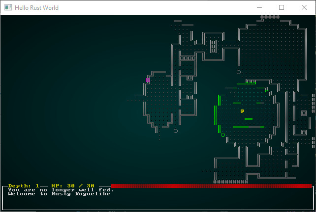
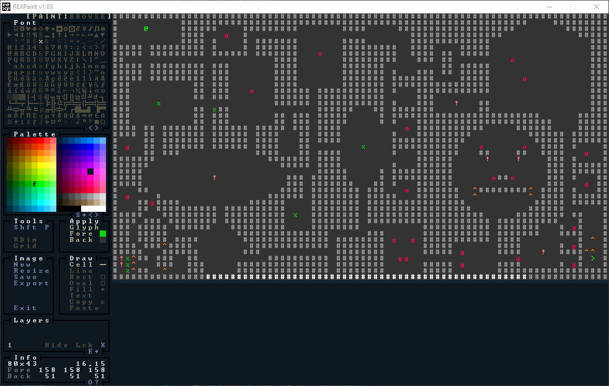
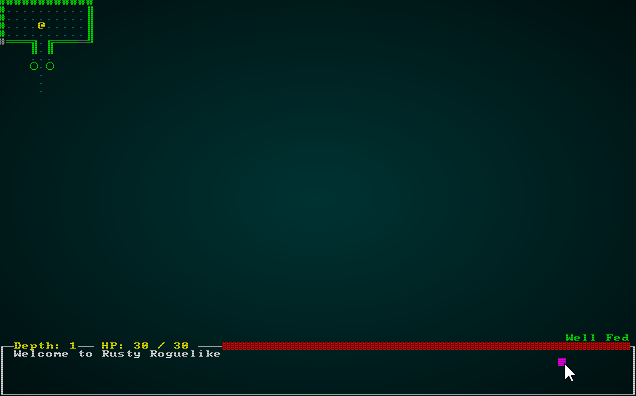
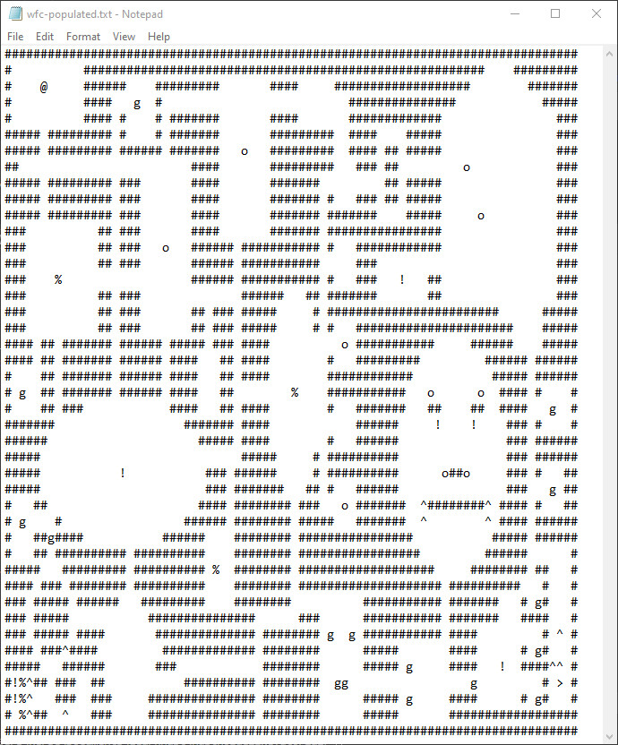
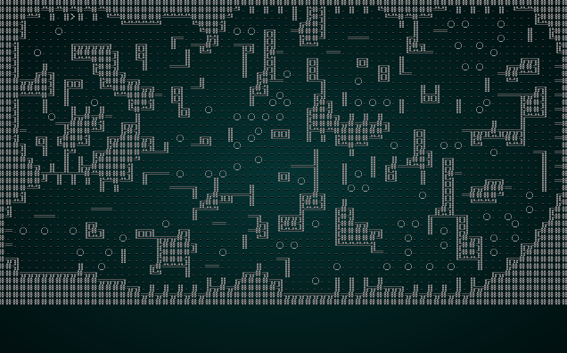
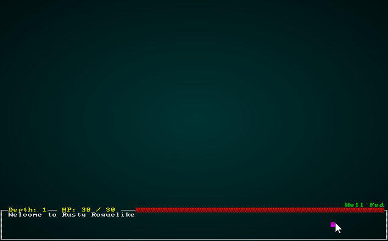

# Prefabricated Levels and Level Sections

---

***About this tutorial***

*This tutorial is free and open source, and all code uses the MIT license - so you are free to do with it as you like. My hope is that you will enjoy the tutorial, and make great games!*

*If you enjoy this and would like me to keep writing, please consider supporting [my Patreon](https://www.patreon.com/blackfuture).*

[](https://pragprog.com/titles/hwrust/hands-on-rust/)

---

Despite being essentially pseudorandom (that is, random - but constrained in a way that makes for a fun, cohesive game), *many* roguelikes feature some hand-crafted content. Typically, these can be divided into a few categories:

* Hand-crafted *levels* - the whole level is premade, the content static. These are typically used very sparingly, for big set-piece battles essential to the story.
* Hand-crafted *level sections* - some of the level is randomly created, but a large part is pre-made. For example, a fortress might be a "set piece", but the dungeon leading up to it is random. Dungeon Crawl Stone Soup uses these extensively - you sometimes run into areas that you recognize because they are prefabricated - but the dungeon around them is clearly random. Cogmind uses these for parts of the caves (I'll avoid spoilers). Caves of Qud has a few set-piece levels that appear to be built around a number of prefabricated parts. Some systems call this mechanism "vaults" - but the name can also apply to the third category.
* Hand-crafted *rooms* (also called Vaults in some cases). The level is largely random, but when sometimes a room fits a *vault* - so you put one there.

The first category is special and should be used sparingly (otherwise, your players will just learn an optimal strategy and power on through it - and may become bored from lack of variety). The other categories benefit from either providing *lots* of vaults (so there's a ton of content to sprinkle around, meaning the game doesn't feel too similar each time you play) or being *rare* - so you only occasionally see them (for the same reason).

## Some Clean Up

In the [Wave Function Collapse chapter](./chapter_33.md), we loaded a pre-made level - without any entities (those are added later). It's not really very nice to hide a map loader inside WFC - since that isn't it's primary purpose - so we'll start by removing it:

We'll start by deleting the file `map_builders/waveform_collapse/image_loader.rs`. We'll be building a better one in a moment.

Now we edit the start of `mod.rs` in ``map_builders/waveform_collapse`:

```rust
use super::{MapBuilder, Map, TileType, Position, spawner, SHOW_MAPGEN_VISUALIZER,
    generate_voronoi_spawn_regions, remove_unreachable_areas_returning_most_distant};
use rltk::RandomNumberGenerator;
use specs::prelude::*;
use std::collections::HashMap;
mod common;
use common::*;
mod constraints;
use constraints::*;
mod solver;
use solver::*;

/// Provides a map builder using the Wave Function Collapse algorithm.
pub struct WaveformCollapseBuilder {
    map : Map,
    starting_position : Position,
    depth: i32,
    history: Vec<Map>,
    noise_areas : HashMap<i32, Vec<usize>>,
    derive_from : Option<Box<dyn MapBuilder>>
}
...

impl WaveformCollapseBuilder {
    /// Generic constructor for waveform collapse.
    /// # Arguments
    /// * new_depth - the new map depth
    /// * derive_from - either None, or a boxed MapBuilder, as output by `random_builder`
    pub fn new(new_depth : i32, derive_from : Option<Box<dyn MapBuilder>>) -> WaveformCollapseBuilder {
        WaveformCollapseBuilder{
            map : Map::new(new_depth),
            starting_position : Position{ x: 0, y : 0 },
            depth : new_depth,
            history: Vec::new(),
            noise_areas : HashMap::new(),
            derive_from
        }
    }
    
    /// Derives a map from a pre-existing map builder.
    /// # Arguments
    /// * new_depth - the new map depth
    /// * derive_from - either None, or a boxed MapBuilder, as output by `random_builder`
    pub fn derived_map(new_depth: i32, builder: Box<dyn MapBuilder>) -> WaveformCollapseBuilder {
        WaveformCollapseBuilder::new(new_depth, Some(builder))
    }
    ...
```

We've removed all references to `image_loader`, removed the test map constructor, and removed the ugly mode enumeration. WFC is now exactly what it says on the tin, and nothing else. Lastly, we'll modify `random_builder` to not use the test map anymore:

```rust
pub fn random_builder(new_depth: i32) -> Box<dyn MapBuilder> {
    let mut rng = rltk::RandomNumberGenerator::new();
    let builder = rng.roll_dice(1, 16);
    let mut result : Box<dyn MapBuilder>;
    match builder {
        1 => { result = Box::new(BspDungeonBuilder::new(new_depth)); }
        2 => { result = Box::new(BspInteriorBuilder::new(new_depth)); }
        3 => { result = Box::new(CellularAutomataBuilder::new(new_depth)); }
        4 => { result = Box::new(DrunkardsWalkBuilder::open_area(new_depth)); }
        5 => { result = Box::new(DrunkardsWalkBuilder::open_halls(new_depth)); }
        6 => { result = Box::new(DrunkardsWalkBuilder::winding_passages(new_depth)); }
        7 => { result = Box::new(DrunkardsWalkBuilder::fat_passages(new_depth)); }
        8 => { result = Box::new(DrunkardsWalkBuilder::fearful_symmetry(new_depth)); }
        9 => { result = Box::new(MazeBuilder::new(new_depth)); }
        10 => { result = Box::new(DLABuilder::walk_inwards(new_depth)); }
        11 => { result = Box::new(DLABuilder::walk_outwards(new_depth)); }
        12 => { result = Box::new(DLABuilder::central_attractor(new_depth)); }
        13 => { result = Box::new(DLABuilder::insectoid(new_depth)); }
        14 => { result = Box::new(VoronoiCellBuilder::pythagoras(new_depth)); }
        15 => { result = Box::new(VoronoiCellBuilder::manhattan(new_depth)); }
        _ => { result = Box::new(SimpleMapBuilder::new(new_depth)); }
    }

    if rng.roll_dice(1, 3)==1 {
        result = Box::new(WaveformCollapseBuilder::derived_map(new_depth, result));
    }

    result
}
```

## Skeletal Builder

We'll start with a very basic skeleton, similar to those used before. We'll make a new file, `prefab_builder.rs` in `map_builders`:

```rust
use super::{MapBuilder, Map, TileType, Position, spawner, SHOW_MAPGEN_VISUALIZER,
    remove_unreachable_areas_returning_most_distant};
use rltk::RandomNumberGenerator;
use specs::prelude::*;

pub struct PrefabBuilder {
    map : Map,
    starting_position : Position,
    depth: i32,
    history: Vec<Map>,
}

impl MapBuilder for PrefabBuilder {
    fn get_map(&self) -> Map {
        self.map.clone()
    }

    fn get_starting_position(&self) -> Position {
        self.starting_position.clone()
    }

    fn get_snapshot_history(&self) -> Vec<Map> {
        self.history.clone()
    }

    fn build_map(&mut self)  {
        self.build();
    }

    fn spawn_entities(&mut self, ecs : &mut World) {
    }

    fn take_snapshot(&mut self) {
        if SHOW_MAPGEN_VISUALIZER {
            let mut snapshot = self.map.clone();
            for v in snapshot.revealed_tiles.iter_mut() {
                *v = true;
            }
            self.history.push(snapshot);
        }
    }
}

impl PrefabBuilder {
    pub fn new(new_depth : i32) -> PrefabBuilder {
        PrefabBuilder{
            map : Map::new(new_depth),
            starting_position : Position{ x: 0, y : 0 },
            depth : new_depth,
            history : Vec::new()
        }
    }

    fn build(&mut self) {
    }
}
```

## Prefab builder mode 1 - hand-crafted levels

We're going to support multiple modes for the prefab-builder, so lets bake that in at the beginning. In `prefab_builder.rs`:

```rust
#[derive(PartialEq, Clone)]
#[allow(dead_code)]
pub enum PrefabMode { 
    RexLevel{ template : &'static str }
}

pub struct PrefabBuilder {
    map : Map,
    starting_position : Position,
    depth: i32,
    history: Vec<Map>,
    mode: PrefabMode
}
```

This is new - an `enum` with variables? This works because under the hood, Rust enumerations are actually *unions*. They can hold whatever you want to put in there, and the type is sized to hold the largest of the options. It's best used sparingly in tight code, but for things like configuration it is a very clean way to pass in data. We should also update the constructor to create the new types:

```rust
impl PrefabBuilder {
    #[allow(dead_code)]
    pub fn new(new_depth : i32) -> PrefabBuilder {
        PrefabBuilder{
            map : Map::new(new_depth),
            starting_position : Position{ x: 0, y : 0 },
            depth : new_depth,
            history : Vec::new(),
            mode : PrefabMode::RexLevel{ template : "../../resources/wfc-demo1.xp" }
        }
    }
    ...
```

Including the map template path in the mode makes for easier reading, even if it is slightly more complicated. We're not filling the `PrefabBuilder` with variables for all of the options we *might* use - we're keeping them separated. That's generally good practice - it makes it much more obvious to someone who reads your code what's going on.

Now we'll re-implement the map reader we previously deleted from `image_loader.rs` - only we'll add it as a member function for `PrefabBuilder`, and use the enclosing class features rather than passing `Map` and `new_depth` in and out:

```rust
#[allow(dead_code)]
fn load_rex_map(&mut self, path: &str) {
    let xp_file = rltk::rex::XpFile::from_resource(path).unwrap();

    for layer in &xp_file.layers {
        for y in 0..layer.height {
            for x in 0..layer.width {
                let cell = layer.get(x, y).unwrap();
                if x < self.map.width as usize && y < self.map.height as usize {
                    let idx = self.map.xy_idx(x as i32, y as i32);
                    match (cell.ch as u8) as char {
                        ' ' => self.map.tiles[idx] = TileType::Floor, // space
                        '#' => self.map.tiles[idx] = TileType::Wall, // #
                        _ => {}
                    }
                }
            }
        }
    }
}
```

That's pretty straightforward, more or less a direct port of the one form the Wave Function Collapse chapter. Now lets start making our `build` function:

```rust
fn build(&mut self) {
    match self.mode {
        PrefabMode::RexLevel{template} => self.load_rex_map(&template)
    }

    // Find a starting point; start at the middle and walk left until we find an open tile
    self.starting_position = Position{ x: self.map.width / 2, y : self.map.height / 2 };
    let mut start_idx = self.map.xy_idx(self.starting_position.x, self.starting_position.y);
    while self.map.tiles[start_idx] != TileType::Floor {
        self.starting_position.x -= 1;
        start_idx = self.map.xy_idx(self.starting_position.x, self.starting_position.y);
    }
    self.take_snapshot();
}
```

Notice that we've copied over the find starting point code; we'll improve that at some point, but for now it ensures you can play your level. We *haven't* spawned anything - so you will be alone in the level. There's also a slightly different usage of `match` here - we're using the variable in the enum. The code `PrefabMode::RexLevel{template}` says "match `RexLevel`, but with *any* value of `template` - and make that value available via the name `template` in the match scope". You could use `_` to match any value if you didn't want to *access* it. [Rust's pattern matching system](https://doc.rust-lang.org/book/ch18-03-pattern-syntax.html) is really impressive - you can do a *lot* with it!

Lets modify our `random_builder` function to always call this type of map (so we don't have to test over and over in the hopes of getting the one we want!). In `map_builders/mod.rs`:

```rust
pub fn random_builder(new_depth: i32) -> Box<dyn MapBuilder> {
    /*
    let mut rng = rltk::RandomNumberGenerator::new();
    let builder = rng.roll_dice(1, 16);
    let mut result : Box<dyn MapBuilder>;
    match builder {
        1 => { result = Box::new(BspDungeonBuilder::new(new_depth)); }
        2 => { result = Box::new(BspInteriorBuilder::new(new_depth)); }
        3 => { result = Box::new(CellularAutomataBuilder::new(new_depth)); }
        4 => { result = Box::new(DrunkardsWalkBuilder::open_area(new_depth)); }
        5 => { result = Box::new(DrunkardsWalkBuilder::open_halls(new_depth)); }
        6 => { result = Box::new(DrunkardsWalkBuilder::winding_passages(new_depth)); }
        7 => { result = Box::new(DrunkardsWalkBuilder::fat_passages(new_depth)); }
        8 => { result = Box::new(DrunkardsWalkBuilder::fearful_symmetry(new_depth)); }
        9 => { result = Box::new(MazeBuilder::new(new_depth)); }
        10 => { result = Box::new(DLABuilder::walk_inwards(new_depth)); }
        11 => { result = Box::new(DLABuilder::walk_outwards(new_depth)); }
        12 => { result = Box::new(DLABuilder::central_attractor(new_depth)); }
        13 => { result = Box::new(DLABuilder::insectoid(new_depth)); }
        14 => { result = Box::new(VoronoiCellBuilder::pythagoras(new_depth)); }
        15 => { result = Box::new(VoronoiCellBuilder::manhattan(new_depth)); }
        _ => { result = Box::new(SimpleMapBuilder::new(new_depth)); }
    }

    if rng.roll_dice(1, 3)==1 {
        result = Box::new(WaveformCollapseBuilder::derived_map(new_depth, result));
    }

    result*/

    Box::new(PrefabBuilder::new(new_depth))
}
```

If you `cargo run` your project now, you can run around the (otherwise deserted) demo map:

.

## Populating the test map with prefabbed entities

Let's pretend that our test map is some sort of super-duper end-game map. We'll take a copy and call it `wfc-populated.xp`. Then we'll splat a bunch of monster and item glyphs around it:

.

The color coding is completely optional, but I put it in for clarity. You'll see we have an `@` to indicate the player start, a `>` to indicate the exit, and a bunch of `g` goblins, `o` orcs, `!` potions, `%` rations and `^` traps. Not too bad a map, really.

We'll add `wfc-populated.xp` to our `resources` folder, and extend `rex_assets.rs` to load it:

```rust
use rltk::{rex::XpFile};

rltk::embedded_resource!(SMALL_DUNGEON, "../../resources/SmallDungeon_80x50.xp");
rltk::embedded_resource!(WFC_DEMO_IMAGE1, "../../resources/wfc-demo1.xp");
rltk::embedded_resource!(WFC_POPULATED, "../../resources/wfc-populated.xp");

pub struct RexAssets {
    pub menu : XpFile
}

impl RexAssets {
    #[allow(clippy::new_without_default)]
    pub fn new() -> RexAssets {
        rltk::link_resource!(SMALL_DUNGEON, "../../resources/SmallDungeon_80x50.xp");
        rltk::link_resource!(WFC_DEMO_IMAGE1, "../../resources/wfc-demo1.xp");
        rltk::link_resource!(WFC_POPULATED, "../../resources/wfc-populated.xp");

        RexAssets{
            menu : XpFile::from_resource("../../resources/SmallDungeon_80x50.xp").unwrap()
        }
    }
}
```

We also want to be able to list out spawns that are required by the map. Looking in `spawner.rs`, we have an established `tuple` format for how we pass spawns - so we'll use it in the struct:

```rust
#[allow(dead_code)]
pub struct PrefabBuilder {
    map : Map,
    starting_position : Position,
    depth: i32,
    history: Vec<Map>,
    mode: PrefabMode,
    spawns: Vec<(usize, String)>
}
```

Now we'll modify our constructor to *use* the new map, and initialize `spawns`:

```rust
impl PrefabBuilder {
    #[allow(dead_code)]
    pub fn new(new_depth : i32) -> PrefabBuilder {
        PrefabBuilder{
            map : Map::new(new_depth),
            starting_position : Position{ x: 0, y : 0 },
            depth : new_depth,
            history : Vec::new(),
            mode : PrefabMode::RexLevel{ template : "../../resources/wfc-populated.xp" },
            spawns: Vec::new()
        }
    }
    ...
```

To make use of the function in `spawner.rs` that accepts this type of data, we need to make it *public*. So we open up the file, and add the word `pub` to the function signature:

```rust
/// Spawns a named entity (name in tuple.1) at the location in (tuple.0)
pub fn spawn_entity(ecs: &mut World, spawn : &(&usize, &String)) {
    ...
```

We'll then modify our `PrefabBuilder`'s `spawn_entities` function to make use of this data:

```rust
fn spawn_entities(&mut self, ecs : &mut World) {
    for entity in self.spawns.iter() {
        spawner::spawn_entity(ecs, &(&entity.0, &entity.1));
    }
}
```

We do a bit of a dance with references just to work with the previous function signature (and not have to change it, which would change lots of other code). So far, so good - it reads the `spawn` list, and requests that everything in the list be placed onto the map. Now would be a good time to add something to the list! We'll want to modify our `load_rex_map` to handle the new data:

```rust
 #[allow(dead_code)]
fn load_rex_map(&mut self, path: &str) {
    let xp_file = rltk::rex::XpFile::from_resource(path).unwrap();

    for layer in &xp_file.layers {
        for y in 0..layer.height {
            for x in 0..layer.width {
                let cell = layer.get(x, y).unwrap();
                if x < self.map.width as usize && y < self.map.height as usize {
                    let idx = self.map.xy_idx(x as i32, y as i32);
                    // We're doing some nasty casting to make it easier to type things like '#' in the match
                    match (cell.ch as u8) as char {
                        ' ' => self.map.tiles[idx] = TileType::Floor,
                        '#' => self.map.tiles[idx] = TileType::Wall,
                        '@' => {
                            self.map.tiles[idx] = TileType::Floor;
                            self.starting_position = Position{ x:x as i32, y:y as i32 };
                        }
                        '>' => self.map.tiles[idx] = TileType::DownStairs,
                        'g' => {
                            self.map.tiles[idx] = TileType::Floor;
                            self.spawns.push((idx, "Goblin".to_string()));
                        }
                        'o' => {
                            self.map.tiles[idx] = TileType::Floor;
                            self.spawns.push((idx, "Orc".to_string()));
                        }
                        '^' => {
                            self.map.tiles[idx] = TileType::Floor;
                            self.spawns.push((idx, "Bear Trap".to_string()));
                        }
                        '%' => {
                            self.map.tiles[idx] = TileType::Floor;
                            self.spawns.push((idx, "Rations".to_string()));
                        }
                        '!' => {
                            self.map.tiles[idx] = TileType::Floor;
                            self.spawns.push((idx, "Health Potion".to_string()));
                        }
                        _ => {
                            rltk::console::log(format!("Unknown glyph loading map: {}", (cell.ch as u8) as char));
                        }
                    }
                }
            }
        }
    }
}
```

This recognizes the extra glyphs, and prints a warning to the console if we've loaded one we forgot to handle. Note that for entities, we're setting the tile to `Floor` and *then* adding the entity type. That's because we can't overlay two glyphs on the same tile - but it stands to reason that the entity is *standing* on a floor.

Lastly, we need to modify our `build` function to not move the exit and the player. We simply wrap the fallback code in an `if` statement to detect if we've set a `starting_position` (we're going to require that if you set a start, you also set an exit):

```rust
fn build(&mut self) {
    match self.mode {
        PrefabMode::RexLevel{template} => self.load_rex_map(&template)
    }
    self.take_snapshot();

    // Find a starting point; start at the middle and walk left until we find an open tile
    if self.starting_position.x == 0 {
        self.starting_position = Position{ x: self.map.width / 2, y : self.map.height / 2 };
        let mut start_idx = self.map.xy_idx(self.starting_position.x, self.starting_position.y);
        while self.map.tiles[start_idx] != TileType::Floor {
            self.starting_position.x -= 1;
            start_idx = self.map.xy_idx(self.starting_position.x, self.starting_position.y);
        }
        self.take_snapshot();

        // Find all tiles we can reach from the starting point
        let exit_tile = remove_unreachable_areas_returning_most_distant(&mut self.map, start_idx);
        self.take_snapshot();

        // Place the stairs
        self.map.tiles[exit_tile] = TileType::DownStairs;
        self.take_snapshot();
    }
}
```

If you `cargo run` the project now, you start in the specified location - and entities spawn around you.

.

## Rex-free prefabs

It's possible that you don't like Rex Paint (don't worry, I won't tell Kyzrati!), maybe you are on a platform that doesn't support it - or maybe you'd just like to not have to rely on an external tool. We'll extend our reader to *also* support string output for maps. This will be handy later when we get to small room prefabs/vaults.

I cheated a bit, and opened the `wfc-populated.xp` file in Rex and typed `ctrl-t` to save in `TXT` format. That gave me a nice `Notepad` friendly map file:

.

I also realized that `prefab_builder` was going to outgrow a single file! Fortunately, Rust makes it pretty easy to turn a module into a multi-file monster. In `map_builders`, I made a new directory called `prefab_builder`. I then moved `prefab_builder.rs` into it, and renamed it `mod.rs`. The game compiles and runs exactly as before.

Make a new file in your `prefab_builder` folder, and name it `prefab_levels.rs`. We'll paste in the map definition, and decorate it a bit:

```rust
#[derive(PartialEq, Copy, Clone)]
pub struct PrefabLevel {
    pub template : &'static str,
    pub width : usize,
    pub height: usize
}

pub const WFC_POPULATED : PrefabLevel = PrefabLevel{
    template : LEVEL_MAP,
    width: 80,
    height: 43
};

const LEVEL_MAP : &str = 
"
################################################################################
#          ########################################################    #########
#    @     ######    #########       ####     ###################        #######
#          ####   g  #                          ###############            #####
#          #### #    # #######       ####       #############                ###
##### ######### #    # #######       #########  ####    #####                ###
##### ######### ###### #######   o   #########  #### ## #####                ###
##                        ####       #########   ### ##         o            ###
##### ######### ###       ####       #######         ## #####                ###
##### ######### ###       ####       ####### #   ### ## #####                ###
##### ######### ###       ####       ####### #######    #####     o          ###
###          ## ###       ####       ####### ################                ###
###          ## ###   o   ###### ########### #   ############                ###
###          ## ###       ###### ###########     ###                         ###
###    %                  ###### ########### #   ###   !   ##                ###
###          ## ###              ######   ## #######       ##                ###
###          ## ###       ## ### #####     # ########################      #####
###          ## ###       ## ### #####     # #   ######################    #####
#### ## ####### ###### ##### ### ####          o ###########     ######    #####
#### ## ####### ###### ####   ## ####        #   #########         ###### ######
#    ## ####### ###### ####   ## ####        ############           ##### ######
# g  ## ####### ###### ####   ##        %    ###########   o      o  #### #    #
#    ## ###            ####   ## ####        #   #######   ##    ##  ####   g  #
#######                  ####### ####            ######     !    !    ### #    #
######                     ##### ####        #   ######               ### ######
#####                            #####     # ##########               ### ######
#####           !           ### ######     # ##########      o##o     ### #   ##
#####                       ### #######   ## #   ######               ###   g ##
#   ##                     #### ######## ###   o #######  ^########^ #### #   ##
# g    #                 ###### ######## #####   #######  ^        ^ #### ######
#   ##g####           ######    ######## ################           ##### ######
#   ## ########## ##########    ######## #################         ######      #
#####   ######### ########## %  ######## ###################     ######## ##   #
#### ### ######## ##########    ######## #################### ##########   #   #
### ##### ######   #########    ########          ########### #######   # g#   #
### #####           ###############      ###      ########### #######   ####   #
### ##### ####       ############## ######## g  g ########### ####         # ^ #
#### ###^####         ############# ########      #####       ####      # g#   #
#####   ######       ###            ########      ##### g     ####   !  ####^^ #
#!%^## ###  ##           ########## ########  gg                 g         # > #
#!%^   ###  ###     ############### ########      ##### g     ####      # g#   #
# %^##  ^   ###     ############### ########      #####       ##################
################################################################################
";
```

So we start by defining a new `struct` type: `PrefabLevel`. This holds a map template, a width and a height. Then we make a constant, `WFC_POPULATED` and create an always-available level definition in it. Lastly, we paste our Notepad file into a new constant, currently called `MY_LEVEL`. This is a big string, and will be stored like any other string.

Lets modify the `mode` to also allow this type:

```rust
#[derive(PartialEq, Copy, Clone)]
#[allow(dead_code)]
pub enum PrefabMode { 
    RexLevel{ template : &'static str },
    Constant{ level : prefab_levels::PrefabLevel }
}
```

We'll modify our `build` function to also handle this `match` pattern:

```rust
fn build(&mut self) {
    match self.mode {
        PrefabMode::RexLevel{template} => self.load_rex_map(&template),
        PrefabMode::Constant{level} => self.load_ascii_map(&level)
    }
    self.take_snapshot();
    ...
```

And modify our constructor to use it:

```rust
impl PrefabBuilder {
    #[allow(dead_code)]
    pub fn new(new_depth : i32) -> PrefabBuilder {
        PrefabBuilder{
            map : Map::new(new_depth),
            starting_position : Position{ x: 0, y : 0 },
            depth : new_depth,
            history : Vec::new(),
            mode : PrefabMode::Constant{level : prefab_levels::WFC_POPULATED},
            spawns: Vec::new()
        }
    }
```

Now we need to create a loader that can handle it. We'll modify our `load_rex_map` to share some code with it, so we aren't typing everything repeatedly - and make our new `load_ascii_map` function:

```rust
fn char_to_map(&mut self, ch : char, idx: usize) {
    match ch {
        ' ' => self.map.tiles[idx] = TileType::Floor,
        '#' => self.map.tiles[idx] = TileType::Wall,
        '@' => {
            let x = idx as i32 % self.map.width;
            let y = idx as i32 / self.map.width;
            self.map.tiles[idx] = TileType::Floor;
            self.starting_position = Position{ x:x as i32, y:y as i32 };
        }
        '>' => self.map.tiles[idx] = TileType::DownStairs,
        'g' => {
            self.map.tiles[idx] = TileType::Floor;
            self.spawns.push((idx, "Goblin".to_string()));
        }
        'o' => {
            self.map.tiles[idx] = TileType::Floor;
            self.spawns.push((idx, "Orc".to_string()));
        }
        '^' => {
            self.map.tiles[idx] = TileType::Floor;
            self.spawns.push((idx, "Bear Trap".to_string()));
        }
        '%' => {
            self.map.tiles[idx] = TileType::Floor;
            self.spawns.push((idx, "Rations".to_string()));
        }
        '!' => {
            self.map.tiles[idx] = TileType::Floor;
            self.spawns.push((idx, "Health Potion".to_string()));
        }
        _ => {
            rltk::console::log(format!("Unknown glyph loading map: {}", (ch as u8) as char));
        }
    }
}

#[allow(dead_code)]
fn load_rex_map(&mut self, path: &str) {
    let xp_file = rltk::rex::XpFile::from_resource(path).unwrap();

    for layer in &xp_file.layers {
        for y in 0..layer.height {
            for x in 0..layer.width {
                let cell = layer.get(x, y).unwrap();
                if x < self.map.width as usize && y < self.map.height as usize {
                    let idx = self.map.xy_idx(x as i32, y as i32);
                    // We're doing some nasty casting to make it easier to type things like '#' in the match
                    self.char_to_map(cell.ch as u8 as char, idx);
                }
            }
        }
    }
}

#[allow(dead_code)]
fn load_ascii_map(&mut self, level: &prefab_levels::PrefabLevel) {
    // Start by converting to a vector, with newlines removed
    let mut string_vec : Vec<char> = level.template.chars().filter(|a| *a != '\r' && *a !='\n').collect();
    for c in string_vec.iter_mut() { if *c as u8 == 160u8 { *c = ' '; } }

    let mut i = 0;
    for ty in 0..level.height {
        for tx in 0..level.width {
            if tx < self.map.width as usize && ty < self.map.height as usize {
                let idx = self.map.xy_idx(tx as i32, ty as i32);
                self.char_to_map(string_vec[i], idx);
            }
            i += 1;
        }
    }
}
```

The first thing to notice is that the giant `match` in `load_rex_map` is now a function - `char_to_map`. Since we're using the functionality more than once, this is good practice: now we only have to fix it once if we messed it up! Otherwise, `load_rex_map` is pretty much the same. Our new function is `load_ascii_map`. It starts with some ugly code that bears explanation:

1. `let mut string_vec : Vec<char> = level.template.chars().filter(|a| *a != '\r' && *a !='\n').collect();` is a common Rust pattern, but isn't really self-explanatory at all. It *chains* methods together, in left-to-right order. So it's really a big collection of instructions glued together:
    1. `let mut string_vec : Vec<char>` is just saying "make a variable named `string_vec`, or the type `Vec<char>` and let me edit it.
    2. `level.template` is the string in which our level template lives.
    3. `.chars()` turns the string into an *iterator* - the same as when we've previously typed `myvector.iter()`.
    4. `.filter(|a| *a != '\r' && *a !='\n')` is interesting. Filters take a lambda function in, and *keep* any entries that return `true`. So in this case, we're stripping out `\r` and `\n` - the two newline characters. We'll keep everything else.
    5. `.collect()` says "take the results of everything before me, and put them into a vector."
2. We then mutably iterate the string vector, and turn the character `160` into spaces. I honestly have *no* idea why the text is reading spaces as character 160 and not 32, but we'll roll with it and just convert it.
3. We then iterate `y` from `0` to the specified height.
    1. We then iterate `x` from `0` to the specified width.
        1. If the `x` and `y` values are within the map we're creating, we calculate the `idx` for the map tile - and call our `char_to_map` function to translate it.

If you `cargo run` now, you'll see *exactly* the same as before - but instead of loading the Rex Paint file, we've loaded it from the constant ASCII in `prefab_levels.rs`.

## Building a level section

*Your brave adventurer emerges from the twisting tunnels, and comes across the walls of an ancient underground fortification!* That's the stuff of great D&D stories, and also an occasional occurrence in games such as Dungeon Crawl: Stone Soup. It's quite likely that what actually happened is *your brave adventurer emerges from a procedurally generated map and finds a level section prefab!*

We'll extend our mapping system to explicitly support this: a regular builder makes a map, and then a *sectional prefab* replaces part of the map with your exciting premade content. We'll start by making a new file (in `map_builders/prefab_builder`) called `prefab_sections.rs`, and place a description of what we want:

```rust
#[allow(dead_code)]
#[derive(PartialEq, Copy, Clone)]
pub enum HorizontalPlacement { Left, Center, Right }

#[allow(dead_code)]
#[derive(PartialEq, Copy, Clone)]
pub enum VerticalPlacement { Top, Center, Bottom }

#[allow(dead_code)]
#[derive(PartialEq, Copy, Clone)]
pub struct PrefabSection {
    pub template : &'static str,
    pub width : usize,
    pub height: usize,
    pub placement : (HorizontalPlacement, VerticalPlacement)
}

#[allow(dead_code)]
pub const UNDERGROUND_FORT : PrefabSection = PrefabSection{
    template : RIGHT_FORT,
    width: 15,
    height: 43,
    placement: ( HorizontalPlacement::Right, VerticalPlacement::Top )
};

#[allow(dead_code)]
const RIGHT_FORT : &str = "
     #         
  #######      
  #     #      
  #     #######
  #  g        #
  #     #######
  #     #      
  ### ###      
    # #        
    # #        
    # ##       
    ^          
    ^          
    # ##       
    # #        
    # #        
    # #        
    # #        
  ### ###      
  #     #      
  #     #      
  #  g  #      
  #     #      
  #     #      
  ### ###      
    # #        
    # #        
    # #        
    # ##       
    ^          
    ^          
    # ##       
    # #        
    # #        
    # #        
  ### ###      
  #     #      
  #     #######
  #  g        #
  #     #######
  #     #      
  #######      
     #         
";
```

So we have `RIGHT_FORT` as a string, describing a fortification we might encounter. We've built a structure, `PrefabSection` which includes placement hints, and a constant for our actual fort (`UNDERGROUND_FORT`) specifying that we'd like to be at the right of the map, at the top (the vertical doesn't really matter in this example, because it is the full size of the map).

Level *sections* are different from builders we've made before, because they take a *completed* map - and *replace* part of it. We've done something similar with Wave Function Collapse, so we'll adopt a similar pattern. We'll start by modifying our `PrefabBuilder` to know about the new type of map decoration:

```rust
#[derive(PartialEq, Copy, Clone)]
#[allow(dead_code)]
pub enum PrefabMode { 
    RexLevel{ template : &'static str },
    Constant{ level : prefab_levels::PrefabLevel },
    Sectional{ section : prefab_sections::PrefabSection }
}

#[allow(dead_code)]
pub struct PrefabBuilder {
    map : Map,
    starting_position : Position,
    depth: i32,
    history: Vec<Map>,
    mode: PrefabMode,
    spawns: Vec<(usize, String)>,
    previous_builder : Option<Box<dyn MapBuilder>>
}
```

As much as I'd *love* to put the `previous_builder` into the enum, I kept running into lifetime problems. Perhaps there's a way to do it (and some kind reader will help me out?), but for now I've put it into `PrefabBuilder`. The requested map section is in the parameter, however. We also update our constructor to use this type of map:

```rust
impl PrefabBuilder {
    #[allow(dead_code)]
    pub fn new(new_depth : i32, previous_builder : Option<Box<dyn MapBuilder>>) -> PrefabBuilder {
        PrefabBuilder{
            map : Map::new(new_depth),
            starting_position : Position{ x: 0, y : 0 },
            depth : new_depth,
            history : Vec::new(),
            mode : PrefabMode::Sectional{ section: prefab_sections::UNDERGROUND_FORT },
            spawns: Vec::new(),
            previous_builder
        }
    }
    ...
```

Over in `map_builders/mod.rs`'s `random_builder`, we'll modify the builder to *first* run a Cellular Automata map, and *then* apply the sectional:

```rust
Box::new(
    PrefabBuilder::new(
        new_depth, 
        Some(
            Box::new(
                CellularAutomataBuilder::new(new_depth)
            )
        )
    )
)
```

This could be one line, but I've separated it out due to the sheer number of parentheses.

Next, we update our `match` statement (in `build()`) to actually *call* the builder:

```rust
fn build(&mut self) {
    match self.mode {
        PrefabMode::RexLevel{template} => self.load_rex_map(&template),
        PrefabMode::Constant{level} => self.load_ascii_map(&level),
        PrefabMode::Sectional{section} => self.apply_sectional(&section)
    }
    self.take_snapshot();
    ...
```

Now, we'll write `apply_sectional`:

```rust
pub fn apply_sectional(&mut self, section : &prefab_sections::PrefabSection) {
    // Build the map
    let prev_builder = self.previous_builder.as_mut().unwrap();
    prev_builder.build_map();
    self.starting_position = prev_builder.get_starting_position();
    self.map = prev_builder.get_map().clone();
    self.take_snapshot();

    use prefab_sections::*;

    let string_vec = PrefabBuilder::read_ascii_to_vec(section.template);
    
    // Place the new section
    let chunk_x;
    match section.placement.0 {
        HorizontalPlacement::Left => chunk_x = 0,
        HorizontalPlacement::Center => chunk_x = (self.map.width / 2) - (section.width as i32 / 2),
        HorizontalPlacement::Right => chunk_x = (self.map.width-1) - section.width as i32
    }

    let chunk_y;
    match section.placement.1 {
        VerticalPlacement::Top => chunk_y = 0,
        VerticalPlacement::Center => chunk_y = (self.map.height / 2) - (section.height as i32 / 2),
        VerticalPlacement::Bottom => chunk_y = (self.map.height-1) - section.height as i32
    }
    println!("{},{}", chunk_x, chunk_y);

    let mut i = 0;
    for ty in 0..section.height {
        for tx in 0..section.width {
            if tx < self.map.width as usize && ty < self.map.height as usize {
                let idx = self.map.xy_idx(tx as i32 + chunk_x, ty as i32 + chunk_y);
                self.char_to_map(string_vec[i], idx);
            }
            i += 1;
        }
    }
    self.take_snapshot();
}
```

This a lot like other code we've written, but lets step through it anyway:

1. `let prev_builder = self.previous_builder.as_mut().unwrap();` is quite the mouthful. The previous builder is an `Option` - but if we're calling this code, it *has* to have a value. So we want to `unwrap` it (which will panic and crash if there is no value), but we can't! The borrow checker will complain if we just call `previous_builder.unwrap` - so we have to inject an `as_mut()` in there, which `Option` provides for just this purpose.
2. We call `build_map` on the previous builder, to construct the base map.
3. We copy the starting position from the previous builder to our new builder.
4. We copy the map from the previous builder to our self (the new builder).
5. We call `read_ascii_to_vec`, which is the same as the string-to-vector code from the level example; we've actually updated the level example to use it also, in the source code.
6. We create two variables, `chunk_x` and `chunk_y` and query the section's placement preference to determine where to put the new chunk.
7. We iterate the section just like when we were iterating a level earlier - but adding `chunk_x` to `tx` and `chunk_y` to `ty` to offset the section inside the level.

If you `cargo run` the example now, you'll see a map built with a cave - and a fortification to the right.

.

You may also notice that there aren't any entities at all, outside of the prefab area!

## Adding entities to sectionals

Spawning and determining spawn points have been logically separated, to help keep the map generation code clean. Different maps can have their own strategies for placing entities, so there isn't a straightforward method to simply suck in the data from the previous algorithms and add to it. There should be, and it should enable filtering and all manner of tweaking with later "meta-map builders" (such as WFC or this one). We've stumbled upon a clue for a good interface in the code that places entities in prefabs: the spawn system already supports `tuples` of `(position, type string)`. We'll use that as the basis for the new setup.

We'll start by opening up `map_builders/mod.rs` and editing the `MapBuilder` trait:

```rust
pub trait MapBuilder {
    fn build_map(&mut self);
    fn get_map(&self) -> Map;
    fn get_starting_position(&self) -> Position;
    fn get_snapshot_history(&self) -> Vec<Map>;
    fn take_snapshot(&mut self);
    fn get_spawn_list(&self) -> &Vec<(usize, String)>;

    fn spawn_entities(&mut self, ecs : &mut World) {
        for entity in self.get_spawn_list().iter() {
            spawner::spawn_entity(ecs, &(&entity.0, &entity.1));
        }
    }
}
```

Congratulations, half your source code just turned red in your IDE. That's the danger of changing a base interface - you wind up implementing it *everywhere*. Also, the setup of `spawn_entities` has changed - there is now a *default implementation*. Implementers of the trait can *override it* if they want to - but otherwise they don't actually need to write it anymore. Since everything *should* be available via the `get_spawn_list` function, the trait has everything it needs to provide that implementation.

We'll go back to `simple_map` and update it to obey the new trait rules. We'll extend the `SimpleMapBuiler` structure to feature a spawn list:

```rust
pub struct SimpleMapBuilder {
    map : Map,
    starting_position : Position,
    depth: i32,
    rooms: Vec<Rect>,
    history: Vec<Map>,
    spawn_list: Vec<(usize, String)>
}
```

The `get_spawn_list` implementation is trivial:

```rust
fn get_spawn_list(&self) -> &Vec<(usize, String)> {
    &self.spawn_list
}
```

Now for the fun part. Previously, we didn't consider spawning until the call to `spawn_entities`. Lets remind ourselves what it does (it's been a while!):

```rust
fn spawn_entities(&mut self, ecs : &mut World) {
    for room in self.rooms.iter().skip(1) {
        spawner::spawn_room(ecs, room, self.depth);
    }
}
```

It iterates all the rooms, and spawns entities inside the rooms. We're using that pattern a lot, so it's time to visit `spawn_room` in `spawner.rs`. We'll modify it to spawn *into* a `spawn_list` rather than directly onto the map. So we open up `spawner.rs`, and modify `spawn_room` and `spawn_region` (since they are intertwined, we'll fix them together):

```rust
/// Fills a room with stuff!
pub fn spawn_room(map: &Map, rng: &mut RandomNumberGenerator, room : &Rect, map_depth: i32, spawn_list : &mut Vec<(usize, String)>) {
    let mut possible_targets : Vec<usize> = Vec::new();
    { // Borrow scope - to keep access to the map separated
        for y in room.y1 + 1 .. room.y2 {
            for x in room.x1 + 1 .. room.x2 {
                let idx = map.xy_idx(x, y);
                if map.tiles[idx] == TileType::Floor {
                    possible_targets.push(idx);
                }
            }
        }
    }

    spawn_region(map, rng, &possible_targets, map_depth, spawn_list);
}

/// Fills a region with stuff!
pub fn spawn_region(map: &Map, rng: &mut RandomNumberGenerator, area : &[usize], map_depth: i32, spawn_list : &mut Vec<(usize, String)>) {
    let spawn_table = room_table(map_depth);
    let mut spawn_points : HashMap<usize, String> = HashMap::new();
    let mut areas : Vec<usize> = Vec::from(area);

    // Scope to keep the borrow checker happy
    {
        let num_spawns = i32::min(areas.len() as i32, rng.roll_dice(1, MAX_MONSTERS + 3) + (map_depth - 1) - 3);
        if num_spawns == 0 { return; }

        for _i in 0 .. num_spawns {
            let array_index = if areas.len() == 1 { 0usize } else { (rng.roll_dice(1, areas.len() as i32)-1) as usize };

            let map_idx = areas[array_index];
            spawn_points.insert(map_idx, spawn_table.roll(rng));
            areas.remove(array_index);
        }
    }

    // Actually spawn the monsters
    for spawn in spawn_points.iter() {
        spawn_list.push((*spawn.0, spawn.1.to_string()));
    }
}
```

You'll notice that the biggest change is taking a mutable reference to the `spawn_list` in each function, and instead of *actually* spawning the entity - we defer the operation by pushing the spawn information into the `spawn_list` vector at the end. Instead of passing in the ECS, we're passing in the `Map` and `RandomNumberGenerator`.

Going back to `simple_map.rs`, we move the spawning code into the end of `build`:

```rust
...
self.starting_position = Position{ x: start_pos.0, y: start_pos.1 };

// Spawn some entities
for room in self.rooms.iter().skip(1) {
    spawner::spawn_room(&self.map, &mut rng, room, self.depth, &mut self.spawn_list);
}
```

We can now *delete* `SimpleMapBuilder`'s implementation of `spawn_entities` - the default will work fine.

The same changes can be made to all of the builders that rely on room spawning; for brevity, I won't spell them all out here - you can find them in the source code. The various builders that use Voronoi diagrams are similarly simple to update. For example, Cellular Automata. Add the `spawn_list` to the builder structure, and add a `spawn_list : Vec::new()` into the constructor. Move the monster spawning from `spawn_entities` into the end of `build` and delete the function. Copy the `get_spawn_list` from the other implementations. We changed the region spawning code a little, so here's the implementation from `cellular_automata.rs`:

```rust
// Now we build a noise map for use in spawning entities later
self.noise_areas = generate_voronoi_spawn_regions(&self.map, &mut rng);

// Spawn the entities
for area in self.noise_areas.iter() {
    spawner::spawn_region(&self.map, &mut rng, area.1, self.depth, &mut self.spawn_list);
}
```

Once again, it's rinse and repeat on the other Voronoi spawn algorithms. I've done the work in the source code for you, if you'd like to take a peek.

### Jump to here if refactoring is boring!

SO - now that we've refactored our spawn system, how do we *use* it inside our `PrefabBuilder`? We can add one line to our `apply_sectional` function and get all of the entities from the previous map. You could simply copy it, but that's probably not what you *want*; you need to filter out entities inside the new prefab, both to make room for new ones and to ensure that the spawning makes sense. We'll also need to rearrange a little to keep the borrow checker happy. Here's the function now:

```rust
pub fn apply_sectional(&mut self, section : &prefab_sections::PrefabSection) {
    use prefab_sections::*;

    let string_vec = PrefabBuilder::read_ascii_to_vec(section.template);
    
    // Place the new section
    let chunk_x;
    match section.placement.0 {
        HorizontalPlacement::Left => chunk_x = 0,
        HorizontalPlacement::Center => chunk_x = (self.map.width / 2) - (section.width as i32 / 2),
        HorizontalPlacement::Right => chunk_x = (self.map.width-1) - section.width as i32
    }

    let chunk_y;
    match section.placement.1 {
        VerticalPlacement::Top => chunk_y = 0,
        VerticalPlacement::Center => chunk_y = (self.map.height / 2) - (section.height as i32 / 2),
        VerticalPlacement::Bottom => chunk_y = (self.map.height-1) - section.height as i32
    }

    // Build the map
    let prev_builder = self.previous_builder.as_mut().unwrap();
    prev_builder.build_map();
    self.starting_position = prev_builder.get_starting_position();
    self.map = prev_builder.get_map().clone();        
    for e in prev_builder.get_spawn_list().iter() {
        let idx = e.0;
        let x = idx as i32 % self.map.width;
        let y = idx as i32 / self.map.width;
        if x < chunk_x || x > (chunk_x + section.width as i32) ||
            y < chunk_y || y > (chunk_y + section.height as i32) {
                self.spawn_list.push(
                    (idx, e.1.to_string())
                )
            }
    }        
    self.take_snapshot();        

    let mut i = 0;
    for ty in 0..section.height {
        for tx in 0..section.width {
            if tx > 0 && tx < self.map.width as usize -1 && ty < self.map.height as usize -1 && ty > 0 {
                let idx = self.map.xy_idx(tx as i32 + chunk_x, ty as i32 + chunk_y);
                self.char_to_map(string_vec[i], idx);
            }
            i += 1;
        }
    }
    self.take_snapshot();
}
```

If you `cargo run` now, you'll face enemies in both sections of the map.

.

## Wrap Up

In this chapter, we've covered quite a bit of ground:

* We can load Rex Paint levels, complete with hand-placed entities and play them.
* We can define ASCII premade maps in our game, and play them (removing the requirement to use Rex Paint).
* We can load level *sectionals*, and apply them to the level.
* We can adjust the spawns from previous levels in the builder chain.

...

**The source code for this chapter may be found [here](https://github.com/thebracket/rustrogueliketutorial/tree/master/chapter-34-vaults)**


[Run this chapter's example with web assembly, in your browser (WebGL2 required)](https://bfnightly.bracketproductions.com/rustbook/wasm/chapter-34-vaults/)
---

Copyright (C) 2019, Herbert Wolverson.

---
