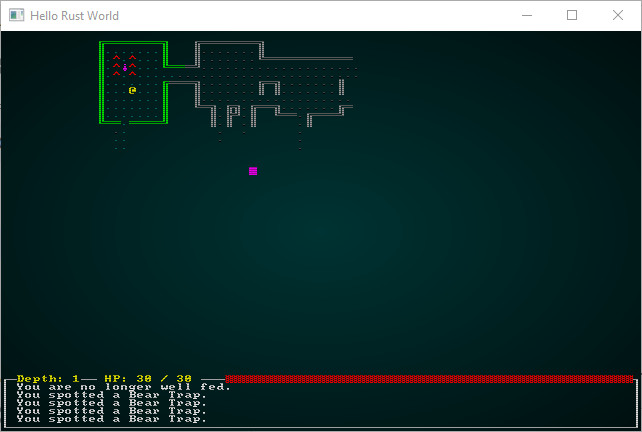

# Room Vaults

---

***About this tutorial***

*This tutorial is free and open source, and all code uses the MIT license - so you are free to do with it as you like. My hope is that you will enjoy the tutorial, and make great games!*

*If you enjoy this and would like me to keep writing, please consider supporting [my Patreon](https://www.patreon.com/blackfuture).*

---

The last chapter was getting overly long, so it was broken into two. In the previous chapter, we learned how to load prefabricated maps and map sections, modified the spawn system so that *meta-builders* could affect the spawn patterns from the previous builder, and demonstrated integration of whole map chunks into levels. In this chapter, we'll explode *room vaults* - prefabricated content that integrates itself into your level. So you might hand-craft some rooms, and have them seamlessly fit into your existing map.

## Designing a room: Totally Not A Trap

The life of a roguelike developer is part programmer, part interior decorator (in a weirdly Gnome Mad Scientist fashion). We've already designed whole levels and level sections, so it isn't a huge leap to designing rooms. Lets go ahead and build a few pre-designed rooms.

We'll make a new file in `map_builders/prefab_builders` called `prefab_rooms.rs`. We'll insert a relatively iconic map feature into it:

```rust
#[allow(dead_code)]
#[derive(PartialEq, Copy, Clone)]
pub struct PrefabRoom {
    pub template : &'static str,
    pub width : usize,
    pub height: usize,
    pub first_depth: i32,
    pub last_depth: i32
}

#[allow(dead_code)]
pub const TOTALLY_NOT_A_TRAP : PrefabRoom = PrefabRoom{
    template : TOTALLY_NOT_A_TRAP_MAP,
    width: 5,
    height: 5,
    first_depth: 0,
    last_depth: 100
};

#[allow(dead_code)]
const TOTALLY_NOT_A_TRAP_MAP : &str = "
     
 ^^^ 
 ^!^ 
 ^^^ 
     
";
```

If you look at the ASCII, you'll see a classic piece of map design: a health potion completely surrounded by traps. Since the traps are hidden by default, we're relying on the player to think "well, that doesn't look suspicious at all"! Not that there are spaces all around the content - there's a 1-tile *gutter* all around it. This ensures that any 5x5 room into which the vault is placed will still be traversable. We're also introducing `first_depth` and `last_depth` - these are the levels at which the vault *might* be applied; for the sake of introduction, we'll pick 0..100 - which should be every level, unless you are a *really* dedicated play-tester!

## Placing the not-a-trap room

We'll start by adding another *mode* to the `PrefabBuiler` system:

```rust
#[derive(PartialEq, Copy, Clone)]
#[allow(dead_code)]
pub enum PrefabMode { 
    RexLevel{ template : &'static str },
    Constant{ level : prefab_levels::PrefabLevel },
    Sectional{ section : prefab_sections::PrefabSection },
    RoomVaults
}
```

We're not going to add any parameters *yet* - by the end of the chapter, we'll have it integrated into a broader system for placing vaults. We'll update our constructor to use this type of placement:

```rust
impl PrefabBuilder {
    #[allow(dead_code)]
    pub fn new(new_depth : i32, previous_builder : Option<Box<dyn MapBuilder>>) -> PrefabBuilder {
        PrefabBuilder{
            map : Map::new(new_depth),
            starting_position : Position{ x: 0, y : 0 },
            depth : new_depth,
            history : Vec::new(),
            mode : PrefabMode::RoomVaults,
            previous_builder,
            spawn_list : Vec::new()
        }
    }
    ...
```

And we'll teach our `match` function in `build` to use it:

```rust
fn build(&mut self) {
    match self.mode {
        PrefabMode::RexLevel{template} => self.load_rex_map(&template),
        PrefabMode::Constant{level} => self.load_ascii_map(&level),
        PrefabMode::Sectional{section} => self.apply_sectional(&section),
        PrefabMode::RoomVaults => self.apply_room_vaults()
    }
    self.take_snapshot();
    ...
```

That leaves the next logical step being to write `apply_room_vaults`. Our objective is to scan the incoming map (from a different builder, even a previous iteration of this one!) for appropriate places into which we *can* place a vault, and add it to the map. We'll also want to remove any spawned creatures from the vault area - so the vaults remain hand-crafted and aren't interfered with by random spawning.

We'll be re-using our "create previous iteration" code from `apply_sectional` - so lets rewrite it into a more generic form:

```rust
fn apply_previous_iteration<F>(&mut self, mut filter: F) 
    where F : FnMut(i32, i32, &(usize, String)) -> bool
{
    // Build the map
    let prev_builder = self.previous_builder.as_mut().unwrap();
    prev_builder.build_map();
    self.starting_position = prev_builder.get_starting_position();
    self.map = prev_builder.get_map().clone();   
    for e in prev_builder.get_spawn_list().iter() {
        let idx = e.0;
        let x = idx as i32 % self.map.width;
        let y = idx as i32 / self.map.width;
        if filter(x, y, e) {
            self.spawn_list.push(
                (idx, e.1.to_string())
            )
        }
    }        
    self.take_snapshot(); 
}
```

There's a lot of new Rust here! Lets walk through it: 

1. You'll notice that we've added a *template* type to the function. `fn apply_previous_iteration<F>`. This specifies that we don't know exactly what `F` is when we write the function.
2. The second parameter (`mut filter: F`) is also of type `F`. So we're telling the function signature to accept the template type as the parameter.
3. Before the opening curly bracket, we've added a `where` clause. This [type of clause](https://doc.rust-lang.org/book/ch10-02-traits.html) can be used to *limit* what it accepted by the generic type. In this case, we're saying that `F` *must* be an `FnMut`. An `FnMut` is a *function pointer* that is allowed to change state (mutable; if it were immutable it'd be an `Fn`). We then specify the parameters of the function, and its return type. Inside the function, we can now treat `filter` like a function - even though we haven't actually written one. We're requiring that function accept two `i32` (integers), and a `tuple` of `(usize, String)`. The latter should look familiar - its our spawn list format. The first two are the `x` and `y` coordinates of the spawn - we're passing that to save the caller from doing the math each time.
4. We then run the `prev_builder` code we wrote in the [previous chapter](./chapter_34.md) - it builds the map and obtains the map data itself, along with the `spawn_list` from the previous algorithm.
5. We then iterate through the spawn list, and calculate the x/y coordinates and map index for each entity. We call `filter` with this information, and if it returns `true` we add it to *our* `spawn_list`.
6. Lastly, we take a snapshot of the map so you can see the step in action.

That sounds really complicated, but most of what it as done is allow us to replace the following code in `apply_sectional`:

```rust
// Build the map
let prev_builder = self.previous_builder.as_mut().unwrap();
prev_builder.build_map();
self.starting_position = prev_builder.get_starting_position();
self.map = prev_builder.get_map().clone();        
for e in prev_builder.get_spawn_list().iter() {
    let idx = e.0;
    let x = idx as i32 % self.map.width;
    let y = idx as i32 / self.map.width;
    if x < chunk_x || x > (chunk_x + section.width as i32) ||
        y < chunk_y || y > (chunk_y + section.height as i32) {
            self.spawn_list.push(
                (idx, e.1.to_string())
            )
        }
}        
self.take_snapshot();
```

We can replace it with a more generic call:

```rust
// Build the map
self.apply_previous_iteration(|x,y,e| {
    x < chunk_x || x > (chunk_x + section.width as i32) || y < chunk_y || y > (chunk_y + section.height as i32)
}); 
```

This is interesting: we're passing in a *closure* - a lambda function to the `filter`. It receives `x`, `y`, and `e` from the previous map's `spawn_list` for each entity. In this case, we're checking against `chunk_x`, `chunk_y`, `section.width` and `section.height` to see if the entity is inside our sectional. You've probably noticed that we didn't declare these anywhere in the lambda function; we are relying on *capture* - you can call a lambda and reference other variables that are *in its scope* - and it can reference them as if they were its own. This is a *very* powerful feature, and you can [learn about it here](https://doc.rust-lang.org/book/ch13-01-closures.html).

## Room Vaults

Let's start building `apply_room_vaults`. We'll take it step-by-step, and work our way through. We'll start with the function signature:

```rust
fn apply_room_vaults(&mut self) {
    use prefab_rooms::*;
    let mut rng = RandomNumberGenerator::new();
```

Simple enough: no parameters other than mutable membership of the builder. It is going to be referring to types in `prefab_rooms`, so rather than type that every time an in-function `using statement` imports the names to the local namespace to save your fingers. We'll also need a random number generator, so we make one as we have before. Next up:

```rust
// Apply the previous builder, and keep all entities it spawns (for now)
self.apply_previous_iteration(|_x,_y,_e| true);
```

We use the code we just wrote to apply the previous map. The `filter` we're passing in this time always returns true: keep all the entities for now. Next:

```rust
// Note that this is a place-holder and will be moved out of this function
let master_vault_list = vec![TOTALLY_NOT_A_TRAP];

// Filter the vault list down to ones that are applicable to the current depth
let possible_vaults : Vec<&PrefabRoom> = master_vault_list
    .iter()
    .filter(|v| { self.depth >= v.first_depth && self.depth <= v.last_depth })
    .collect();

if possible_vaults.is_empty() { return; } // Bail out if there's nothing to build

let vault_index = if possible_vaults.len() == 1 { 0 } else { (rng.roll_dice(1, possible_vaults.len() as i32)-1) as usize };
let vault = possible_vaults[vault_index];
```

We make a vector of all possible vault types - there's currently only one, but when we have more they go in here. This isn't really ideal, but we'll worry about making it a global resource later. We then make a `possible_vaults` list by taking the `master_vault_list` and *filtering* it to only include those whose `first_depth` and `last_depth` line up with the requested dungeon depth. The `iter().filter(...).collect()` pattern has been described before, and it's a very powerful way to quickly extract what you need from a vector. If there are no possible vaults, we `return` out of the function - nothing to do here! Finally, we use another pattern we've used before: we pick a vault to create by selecting a random member of the `possible_vaults` vector.

Next up:

```rust
// We'll make a list of places in which the vault could fit
let mut vault_positions : Vec<Position> = Vec::new();

let mut idx = 0usize;
loop {
    let x = (idx % self.map.width as usize) as i32;
    let y = (idx / self.map.width as usize) as i32;

    // Check that we won't overflow the map
    if x > 1 
        && (x+vault.width as i32) < self.map.width-2
        && y > 1 
        && (y+vault.height as i32) < self.map.height-2
    {

        let mut possible = true;
        for ty in 0..vault.height as i32 {
            for tx in 0..vault.width as i32 {

                let idx = self.map.xy_idx(tx + x, ty + y);
                if self.map.tiles[idx] != TileType::Floor {
                    possible = false;
                }
            }
        }

        if possible {
            vault_positions.push(Position{ x,y });
            break;
        }

    }

    idx += 1;
    if idx >= self.map.tiles.len()-1 { break; }
}
```

There's quite a bit of code in this section (which determines all the places a the vault might fit). Lets walk through it:

1. We make a new vector of `Position`s. This will contain all the possible places in which we *could* spawn our vault.
2. We set `idx` to `0` - we plan to iterate through the whole map.
3. We start a `loop` - the Rust loop type that doesn't exit until you call `break`.
    1. We calculate `x` and `y` to know where we are on the map.
    2. We do an overflow check; `x` needs to be greater than 1, and `x+1` needs to be less than the map width. We check the same with `y` and the map height. If we're within the bounds:
        1. We set `possible` to true.
        2. We iterate every tile on the map in the range `(x .. x+vault width), (y .. y + vault height)` - if any tile isn't a floor, we set `possible` to `false`.
        3. If it *is* possible to place the vault here, we add the position to our `vault_positions` vector from step 1.
    3. We increment `idx` by 1.
    4. If we've run out of map, we break out of the loop.

In other words, we quickly scan the *whole map* for everywhere we *could* put the vault - and make a list of possible placements. We then:

```rust
if !vault_positions.is_empty() {
    let pos_idx = if vault_positions.len()==1 { 0 } else { (rng.roll_dice(1, vault_positions.len() as i32)-1) as usize };
    let pos = &vault_positions[pos_idx];

    let chunk_x = pos.x;
    let chunk_y = pos.y;

    let string_vec = PrefabBuilder::read_ascii_to_vec(vault.template);
    let mut i = 0;
    for ty in 0..vault.height {
        for tx in 0..vault.width {
            let idx = self.map.xy_idx(tx as i32 + chunk_x, ty as i32 + chunk_y);
            self.char_to_map(string_vec[i], idx);
            i += 1;
        }
    }
    self.take_snapshot();
}
```

So if there *are* any valid positions for the vault, we:

1. Pick a random entry in the `vault_positions` vector - this is where we will place the vault.
2. Use `read_ascii_to_vec` to read in the ASCII, just like we did in prefabs and sectionals.
3. Iterate the vault data and use `char_to_map` to place it - just like we did before.

Putting it all together, you have the following function:

```rust
fn apply_room_vaults(&mut self) {
    use prefab_rooms::*;
    let mut rng = RandomNumberGenerator::new();

    // Apply the previous builder, and keep all entities it spawns (for now)
    self.apply_previous_iteration(|_x,_y,_e| true);

    // Note that this is a place-holder and will be moved out of this function
    let master_vault_list = vec![TOTALLY_NOT_A_TRAP];

    // Filter the vault list down to ones that are applicable to the current depth
    let possible_vaults : Vec<&PrefabRoom> = master_vault_list
        .iter()
        .filter(|v| { self.depth >= v.first_depth && self.depth <= v.last_depth })
        .collect();

    if possible_vaults.is_empty() { return; } // Bail out if there's nothing to build

    let vault_index = if possible_vaults.len() == 1 { 0 } else { (rng.roll_dice(1, possible_vaults.len() as i32)-1) as usize };
    let vault = possible_vaults[vault_index];

    // We'll make a list of places in which the vault could fit
    let mut vault_positions : Vec<Position> = Vec::new();

    let mut idx = 0usize;
    loop {
        let x = (idx % self.map.width as usize) as i32;
        let y = (idx / self.map.width as usize) as i32;

        // Check that we won't overflow the map
        if x > 1 
            && (x+vault.width as i32) < self.map.width-2
            && y > 1 
            && (y+vault.height as i32) < self.map.height-2
        {

            let mut possible = true;
            for ty in 0..vault.height as i32 {
                for tx in 0..vault.width as i32 {

                    let idx = self.map.xy_idx(tx + x, ty + y);
                    if self.map.tiles[idx] != TileType::Floor {
                        possible = false;
                    }
                }
            }

            if possible {
                vault_positions.push(Position{ x,y });
                break;
            }

        }

        idx += 1;
        if idx >= self.map.tiles.len()-1 { break; }
    }

    if !vault_positions.is_empty() {
        let pos_idx = if vault_positions.len()==1 { 0 } else { (rng.roll_dice(1, vault_positions.len() as i32)-1) as usize };
        let pos = &vault_positions[pos_idx];

        let chunk_x = pos.x;
        let chunk_y = pos.y;

        let string_vec = PrefabBuilder::read_ascii_to_vec(vault.template);
        let mut i = 0;
        for ty in 0..vault.height {
            for tx in 0..vault.width {
                let idx = self.map.xy_idx(tx as i32 + chunk_x, ty as i32 + chunk_y);
                self.char_to_map(string_vec[i], idx);
                i += 1;
            }
        }
        self.take_snapshot();
    }
}
```

It's more likely that a square vault will fit in rectangular rooms, so we'll pop over to `map_builders/mod.rs` and slightly adjust the `random_builder` to use the original simple map algorithm for the base map:

```rust
Box::new(
    PrefabBuilder::new(
        new_depth, 
        Some(
            Box::new(
                SimpleMapBuilder::new(new_depth)
            )
        )
    )
)
```

If you `cargo run` now, the vault will probably be placed on your map. Here's a screenshot of a run in which I found it:

.

## Filtering out entities

## Room Vaults as Part of the World

## It's Turtles (Or Meta-Builders) All The Way Down

## Restoring Randomness

...

**The source code for this chapter may be found [here](https://github.com/thebracket/rustrogueliketutorial/tree/master/chapter-35-vaults2)**


[Run this chapter's example with web assembly, in your browser (WebGL2 required)](http://bfnightly.bracketproductions.com/rustbook/wasm/chapter-35-vaults2/)
---

Copyright (C) 2019, Herbert Wolverson.

---