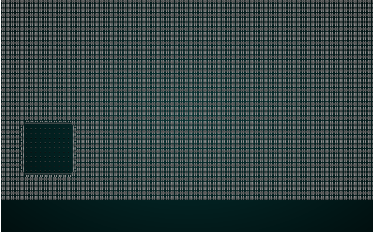
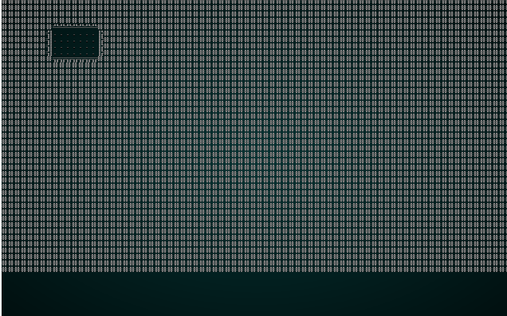
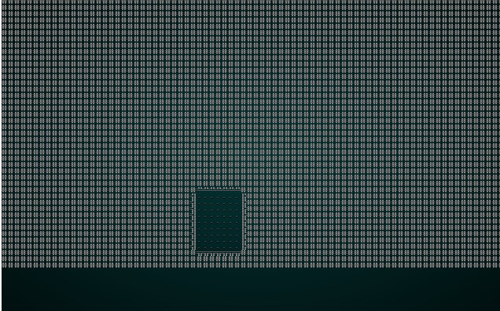
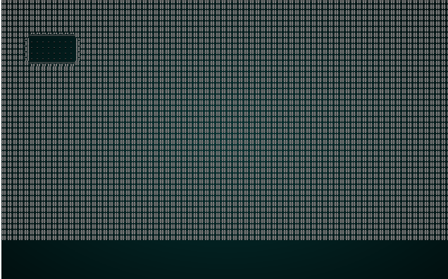
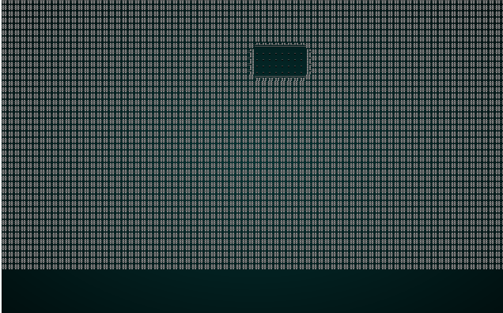
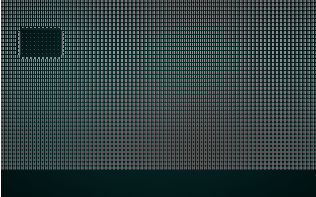
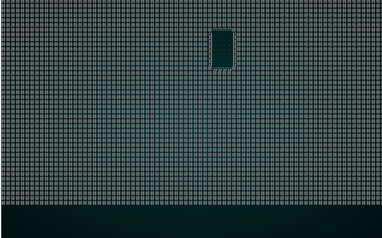

# Fun With Layers

---

***About this tutorial***

*This tutorial is free and open source, and all code uses the MIT license - so you are free to do with it as you like. My hope is that you will enjoy the tutorial, and make great games!*

*If you enjoy this and would like me to keep writing, please consider supporting [my Patreon](https://www.patreon.com/blackfuture).*

---

Now that we have a nice, clean layering system we'll take the opportunity to play with it a bit. This chapter is a collection of fun things you can do with layers, and will introduce a few new layer types. It's meant to whet your appetite to write more: the sky really is the limit!

## Existing Algorithms as Meta-Builders

Let's start by adjusting some of our existing algorithms to be useful as filters.

### Applying Cellular Automata as a meta-builder

When we wrote the Cellular Automata system, we aimed for a generic cavern builder. The algorithm is capable of quite a bit more than that - each iteration is basically a "meta builder" running on the previous iteration. A simple tweak allows it to *also* be a meta-builder that only runs a single iteration. 

We'll start by moving the code for a single iteration into its own function:

```rust
fn apply_iteration(&mut self, build_data : &mut BuilderMap) {
    let mut newtiles = build_data.map.tiles.clone();

    for y in 1..build_data.map.height-1 {
        for x in 1..build_data.map.width-1 {
            let idx = build_data.map.xy_idx(x, y);
            let mut neighbors = 0;
            if build_data.map.tiles[idx - 1] == TileType::Wall { neighbors += 1; }
            if build_data.map.tiles[idx + 1] == TileType::Wall { neighbors += 1; }
            if build_data.map.tiles[idx - build_data.map.width as usize] == TileType::Wall { neighbors += 1; }
            if build_data.map.tiles[idx + build_data.map.width as usize] == TileType::Wall { neighbors += 1; }
            if build_data.map.tiles[idx - (build_data.map.width as usize - 1)] == TileType::Wall { neighbors += 1; }
            if build_data.map.tiles[idx - (build_data.map.width as usize + 1)] == TileType::Wall { neighbors += 1; }
            if build_data.map.tiles[idx + (build_data.map.width as usize - 1)] == TileType::Wall { neighbors += 1; }
            if build_data.map.tiles[idx + (build_data.map.width as usize + 1)] == TileType::Wall { neighbors += 1; }

            if neighbors > 4 || neighbors == 0 {
                newtiles[idx] = TileType::Wall;
            }
            else {
                newtiles[idx] = TileType::Floor;
            }
        }
    }

    build_data.map.tiles = newtiles.clone();
    build_data.take_snapshot();
}
```

The `build` function is easily modified to call this on each iteration:

```rust
// Now we iteratively apply cellular automata rules
for _i in 0..15 {
    self.apply_iteration(build_data);
}
```

Finally, we'll add an implementation of `MetaMapBuilder` to the mix:

```rust
impl MetaMapBuilder for CellularAutomataBuilder {
    #[allow(dead_code)]
    fn build_map(&mut self, _rng: &mut rltk::RandomNumberGenerator, build_data : &mut BuilderMap) {
        self.apply_iteration(build_data);
    }
}
```

See how we're calling a single iteration, instead of replacing the whole map? This shows how we can apply the cellular automata *rules* to the map - and change the resultant character quite a bit.

Now lets modify `map_builders/mod.rs`'s `random_builder` to force it to use this as an example:

```rust
pub fn random_builder(new_depth: i32, rng: &mut rltk::RandomNumberGenerator) -> BuilderChain {
    let mut builder = BuilderChain::new(new_depth);
    builder.start_with(VoronoiCellBuilder::pythagoras());
    builder.with(CellularAutomataBuilder::new());
    builder.with(AreaStartingPosition::new(XStart::CENTER, YStart::CENTER));
    builder.with(CullUnreachable::new());
    builder.with(VoronoiSpawning::new());
    builder.with(DistantExit::new());
    builder
}
```

If you `cargo run` the project now, you'll see something like this:

.

### Eroding a boxy map with drunken dwarves

The Drunken Walk algorithm can also make a nice post-processing effect, with very minimal modification. In `drunkard.rs`, simply add the following:

```rust
impl MetaMapBuilder for DrunkardsWalkBuilder {
    #[allow(dead_code)]
    fn build_map(&mut self, rng: &mut rltk::RandomNumberGenerator, build_data : &mut BuilderMap) {
        self.build(rng, build_data);
    }
}
```

You can test it by once again modifying `random_builder`:

```rust
let mut builder = BuilderChain::new(new_depth);
builder.start_with(SimpleMapBuilder::new());
builder.with(DrunkardsWalkBuilder::winding_passages());
builder.with(AreaStartingPosition::new(XStart::CENTER, YStart::CENTER));
builder.with(CullUnreachable::new());
builder.with(VoronoiSpawning::new());
builder.with(DistantExit::new());
builder
```

If you `cargo run` the project, you'll see something like this:

.

Notice how the initial boxy design now looks a bit more natural, because drunken dwarves have carved out sections of the map!

### Attacking your boxy map with Diffusion-Limited Aggregation

DLA can also be modified to erode an existing, boxy map. Simply add the `MetaBuilder` trait to `dla.rs`:

```rust
impl MetaMapBuilder for DLABuilder {
    #[allow(dead_code)]
    fn build_map(&mut self, rng: &mut rltk::RandomNumberGenerator, build_data : &mut BuilderMap) {
        self.build(rng, build_data);
    }
}
```

We'll also add a new mode, `heavy_erosion` - it's the same as "walk inwards", but wants a greater percentage of floor space:

```rust
#[allow(dead_code)]
pub fn heavy_erosion() -> Box<DLABuilder> {
    Box::new(DLABuilder{
        algorithm: DLAAlgorithm::WalkInwards,
        brush_size: 2,
        symmetry: Symmetry::None,
        floor_percent: 0.35,
    })
}
```

And modify your `random_builder` test harness:

```rust
let mut builder = BuilderChain::new(new_depth);
builder.start_with(SimpleMapBuilder::new());
builder.with(DLABuilder::heavy_erosion());
builder.with(AreaStartingPosition::new(XStart::CENTER, YStart::CENTER));
builder.with(CullUnreachable::new());
builder.with(VoronoiSpawning::new());
builder.with(DistantExit::new());
builder
```

If you `cargo run` the project, you'll see something like this:

.

## Some New Meta-Builders

There's also plenty of scope to write new map filters. We'll explore a few of the more interesting ones in this section. Pretty much anything you might use as an image filter in a program like Photoshop (or the GIMP!) could be adapted for this purpose. How useful a given filter is remains an open/interesting question!

### Eroding rooms

Nethack-style boxy rooms make for very early-D&D type play, but people often remark that they aren't all that visually pleasing or interesting. One way to keep the basic room style, but get a more organic look, is to run drunkard's walk *inside* each room. I like to call this "exploding the room" - because it looks a bit like you set off dynamite in each room. In `map_builders/`, make a new file `room_exploder.rs`:

```rust
use super::{MetaMapBuilder, BuilderMap, TileType, paint, Symmetry, Rect};
use rltk::RandomNumberGenerator;

pub struct RoomExploder {}

impl MetaMapBuilder for RoomExploder {
    fn build_map(&mut self, rng: &mut rltk::RandomNumberGenerator, build_data : &mut BuilderMap)  {
        self.build(rng, build_data);
    }
}

impl RoomExploder {
    #[allow(dead_code)]
    pub fn new() -> Box<RoomExploder> {
        Box::new(RoomExploder{})
    }

    fn build(&mut self, rng : &mut RandomNumberGenerator, build_data : &mut BuilderMap) {
        let rooms : Vec<Rect>;
        if let Some(rooms_builder) = &build_data.rooms {
            rooms = rooms_builder.clone();
        } else {
            panic!("Room Explosions require a builder with room structures");
        }

        for room in rooms.iter() {
            let start = room.center();
            let n_diggers = rng.roll_dice(1, 20)-5;
            if n_diggers > 0 {
                for _i in 0..n_diggers {
                    let mut drunk_x = start.0;
                    let mut drunk_y = start.1;

                    let mut drunk_life = 20;
                    let mut did_something = false;

                    while drunk_life > 0 {
                        let drunk_idx = build_data.map.xy_idx(drunk_x, drunk_y);
                        if build_data.map.tiles[drunk_idx] == TileType::Wall {
                            did_something = true;
                        }
                        paint(&mut build_data.map, Symmetry::None, 1, drunk_x, drunk_y);
                        build_data.map.tiles[drunk_idx] = TileType::DownStairs;

                        let stagger_direction = rng.roll_dice(1, 4);
                        match stagger_direction {
                            1 => { if drunk_x > 2 { drunk_x -= 1; } }
                            2 => { if drunk_x < build_data.map.width-2 { drunk_x += 1; } }
                            3 => { if drunk_y > 2 { drunk_y -=1; } }
                            _ => { if drunk_y < build_data.map.height-2 { drunk_y += 1; } }
                        }

                        drunk_life -= 1;
                    }
                    if did_something { 
                        build_data.take_snapshot();
                    }

                    for t in build_data.map.tiles.iter_mut() {
                        if *t == TileType::DownStairs {
                            *t = TileType::Floor;
                        }
                    }
                }
            }
        }
    }
}
```

There's nothing too surprising in this code: it takes the *rooms* list from the parent build data, and then iterates each room. A random number (which can be zero) of *drunkards* is then run from the center of each room, with a short lifespan, carving out the edges of each room. You can test this with the following `random_builder` code:

```rust
let mut builder = BuilderChain::new(new_depth);
builder.start_with(BspDungeonBuilder::new());
builder.with(RoomExploder::new());
builder.with(AreaStartingPosition::new(XStart::CENTER, YStart::CENTER));
builder.with(CullUnreachable::new());
builder.with(VoronoiSpawning::new());
builder.with(DistantExit::new());
builder
```

.

### Rounding Room Corners

Another quick and easy way to make a boxy map look less rectangular is to smooth the corners a bit. Add `room_corner_rounding.rs` to `map_builders/`:

```rust
use super::{MetaMapBuilder, BuilderMap, TileType, Rect};
use rltk::RandomNumberGenerator;

pub struct RoomCornerRounder {}

impl MetaMapBuilder for RoomCornerRounder {
    fn build_map(&mut self, rng: &mut rltk::RandomNumberGenerator, build_data : &mut BuilderMap)  {
        self.build(rng, build_data);
    }
}

impl RoomCornerRounder {
    #[allow(dead_code)]
    pub fn new() -> Box<RoomCornerRounder> {
        Box::new(RoomCornerRounder{})
    }

    fn fill_if_corner(&mut self, x: i32, y: i32, build_data : &mut BuilderMap) {
        let w = build_data.map.width;
        let h = build_data.map.height;
        let idx = build_data.map.xy_idx(x, y);
        let mut neighbor_walls = 0;
        if x > 0 && build_data.map.tiles[idx-1] == TileType::Wall { neighbor_walls += 1; }
        if y > 0 && build_data.map.tiles[idx-w as usize] == TileType::Wall { neighbor_walls += 1; }
        if x < w-2 && build_data.map.tiles[idx+1] == TileType::Wall { neighbor_walls += 1; }
        if y < h-2 && build_data.map.tiles[idx+w as usize] == TileType::Wall { neighbor_walls += 1; }

        if neighbor_walls == 2 {
            build_data.map.tiles[idx] = TileType::Wall;
        }
    }

    fn build(&mut self, _rng : &mut RandomNumberGenerator, build_data : &mut BuilderMap) {
        let rooms : Vec<Rect>;
        if let Some(rooms_builder) = &build_data.rooms {
            rooms = rooms_builder.clone();
        } else {
            panic!("Room Rounding require a builder with room structures");
        }

        for room in rooms.iter() {
            self.fill_if_corner(room.x1+1, room.y1+1, build_data);
            self.fill_if_corner(room.x2, room.y1+1, build_data);
            self.fill_if_corner(room.x1+1, room.y2, build_data);
            self.fill_if_corner(room.x2, room.y2, build_data);

            build_data.take_snapshot();
        }
    }
}
```

The boilerplate (repeated code) should look familiar by now, so we'll focus on the algorithm in `build`:

1. We obtain a list of rooms, and `panic!` if there aren't any.
2. For each of the 4 corners of the room, we call a new function `fill_if_corner`.
3. `fill_if_corner` counts each of the neighboring tiles to see if it is a wall. If there are exactly 2 walls, then this tile is eligible to become a corner - so we fill in a wall.

You can try it out with the following `random_builder` code:

```rust
let mut builder = BuilderChain::new(new_depth);
builder.start_with(BspDungeonBuilder::new());
builder.with(RoomCornerRounder::new());
builder.with(AreaStartingPosition::new(XStart::CENTER, YStart::CENTER));
builder.with(CullUnreachable::new());
builder.with(VoronoiSpawning::new());
builder.with(DistantExit::new());
builder
```

The result (if you `cargo run`) should be something like this:

.

## Decoupling Rooms and Corridors

There's a fair amount of shared code between BSP room placement and "simple map" room placement - but with different corridor decision-making. What if we were to de-couple the stages - so the room algorithms decide where the rooms go, another algorithm draws them (possibly changing how they are drawn), and a third algorithm places corridors? Our improved framework supports this with just a bit of algorithm tweaking.

Here's `simple_map.rs` with the corridor code removed:

```rust
use super::{InitialMapBuilder, BuilderMap, Rect, apply_room_to_map, 
    apply_horizontal_tunnel, apply_vertical_tunnel };
use rltk::RandomNumberGenerator;

pub struct SimpleMapBuilder {}

impl InitialMapBuilder for SimpleMapBuilder {
    #[allow(dead_code)]
    fn build_map(&mut self, rng: &mut rltk::RandomNumberGenerator, build_data : &mut BuilderMap) {
        self.build_rooms(rng, build_data);
    }
}

impl SimpleMapBuilder {
    #[allow(dead_code)]
    pub fn new() -> Box<SimpleMapBuilder> {
        Box::new(SimpleMapBuilder{})
    }

    fn build_rooms(&mut self, rng : &mut RandomNumberGenerator, build_data : &mut BuilderMap) {
        const MAX_ROOMS : i32 = 30;
        const MIN_SIZE : i32 = 6;
        const MAX_SIZE : i32 = 10;
        let mut rooms : Vec<Rect> = Vec::new();

        for i in 0..MAX_ROOMS {
            let w = rng.range(MIN_SIZE, MAX_SIZE);
            let h = rng.range(MIN_SIZE, MAX_SIZE);
            let x = rng.roll_dice(1, build_data.map.width - w - 1) - 1;
            let y = rng.roll_dice(1, build_data.map.height - h - 1) - 1;
            let new_room = Rect::new(x, y, w, h);
            let mut ok = true;
            for other_room in rooms.iter() {
                if new_room.intersect(other_room) { ok = false }
            }
            if ok {
                apply_room_to_map(&mut build_data.map, &new_room);
                build_data.take_snapshot();

                rooms.push(new_room);
                build_data.take_snapshot();
            }
        }
        build_data.rooms = Some(rooms);
    }
}
```

Other than renaming `rooms_and_corridors` to just `build_rooms`, the only change is removing the dice roll to place corridors.

Lets make a new file, `map_builders/rooms_corridors_dogleg.rs`. This is where we place the corridors. For now, we'll use the same algorithm we just removed from `SimpleMapBuilder`:

```rust
use super::{MetaMapBuilder, BuilderMap, Rect, apply_horizontal_tunnel, apply_vertical_tunnel };
use rltk::RandomNumberGenerator;

pub struct DoglegCorridors {}

impl MetaMapBuilder for DoglegCorridors {
    #[allow(dead_code)]
    fn build_map(&mut self, rng: &mut rltk::RandomNumberGenerator, build_data : &mut BuilderMap) {
        self.corridors(rng, build_data);
    }
}

impl DoglegCorridors {
    #[allow(dead_code)]
    pub fn new() -> Box<DoglegCorridors> {
        Box::new(DoglegCorridors{})
    }

    fn corridors(&mut self, rng : &mut RandomNumberGenerator, build_data : &mut BuilderMap) {
        let rooms : Vec<Rect>;
        if let Some(rooms_builder) = &build_data.rooms {
            rooms = rooms_builder.clone();
        } else {
            panic!("Dogleg Corridors require a builder with room structures");
        }

        for (i,room) in rooms.iter().enumerate() {
            if i > 0 {
                let (new_x, new_y) = room.center();
                let (prev_x, prev_y) = rooms[i as usize -1].center();
                if rng.range(0,2) == 1 {
                    apply_horizontal_tunnel(&mut build_data.map, prev_x, new_x, prev_y);
                    apply_vertical_tunnel(&mut build_data.map, prev_y, new_y, new_x);
                } else {
                    apply_vertical_tunnel(&mut build_data.map, prev_y, new_y, prev_x);
                    apply_horizontal_tunnel(&mut build_data.map, prev_x, new_x, new_y);
                }
                build_data.take_snapshot();
            }
        }
    }
}
```

Again - this is the code we just removed, but placed into a new builder by itself. So there's really nothing new. We can adjust `random_builder` to test this code:

```rust
let mut builder = BuilderChain::new(new_depth);
builder.start_with(SimpleMapBuilder::new());
builder.with(DoglegCorridors::new());
builder.with(RoomBasedSpawner::new());
builder.with(RoomBasedStairs::new());
builder.with(RoomBasedStartingPosition::new());
builder
```

Testing it with `cargo run` should show you that rooms are built, and then corridors:

.

### Same again with BSP Dungeons

It's easy to do the same to our `BSPDungeonBuilder`. In `bsp_dungeon.rs`, we also trim out the corridor code. We'll just include the `build` function for brevity:

```rust
fn build(&mut self, rng : &mut RandomNumberGenerator, build_data : &mut BuilderMap) {
        let mut rooms : Vec<Rect> = Vec::new();
        self.rects.clear();
        self.rects.push( Rect::new(2, 2, build_data.map.width-5, build_data.map.height-5) ); // Start with a single map-sized rectangle
        let first_room = self.rects[0];
        self.add_subrects(first_room); // Divide the first room

        // Up to 240 times, we get a random rectangle and divide it. If its possible to squeeze a
        // room in there, we place it and add it to the rooms list.
        let mut n_rooms = 0;
        while n_rooms < 240 {
            let rect = self.get_random_rect(rng);
            let candidate = self.get_random_sub_rect(rect, rng);

            if self.is_possible(candidate, &build_data.map) {
                apply_room_to_map(&mut build_data.map, &candidate);
                rooms.push(candidate);
                self.add_subrects(rect);
                build_data.take_snapshot();
            }

            n_rooms += 1;
        }

        build_data.rooms = Some(rooms);
    }
```

We'll also move our BSP corridor code into a new builder, *without* the room sorting (we'll be touching on sorting in the next heading!). Create the new file `map_builders/rooms_corridors_bsp.rs`:

```rust
use super::{MetaMapBuilder, BuilderMap, Rect, draw_corridor };
use rltk::RandomNumberGenerator;

pub struct BspCorridors {}

impl MetaMapBuilder for BspCorridors {
    #[allow(dead_code)]
    fn build_map(&mut self, rng: &mut rltk::RandomNumberGenerator, build_data : &mut BuilderMap) {
        self.corridors(rng, build_data);
    }
}

impl BspCorridors {
    #[allow(dead_code)]
    pub fn new() -> Box<BspCorridors> {
        Box::new(BspCorridors{})
    }

    fn corridors(&mut self, rng : &mut RandomNumberGenerator, build_data : &mut BuilderMap) {
        let rooms : Vec<Rect>;
        if let Some(rooms_builder) = &build_data.rooms {
            rooms = rooms_builder.clone();
        } else {
            panic!("BSP Corridors require a builder with room structures");
        }

        for i in 0..rooms.len()-1 {
            let room = rooms[i];
            let next_room = rooms[i+1];
            let start_x = room.x1 + (rng.roll_dice(1, i32::abs(room.x1 - room.x2))-1);
            let start_y = room.y1 + (rng.roll_dice(1, i32::abs(room.y1 - room.y2))-1);
            let end_x = next_room.x1 + (rng.roll_dice(1, i32::abs(next_room.x1 - next_room.x2))-1);
            let end_y = next_room.y1 + (rng.roll_dice(1, i32::abs(next_room.y1 - next_room.y2))-1);
            draw_corridor(&mut build_data.map, start_x, start_y, end_x, end_y);
            build_data.take_snapshot();
        }
    }
}
```

Again, this *is* the corridor code from `BspDungeonBuilder` - just fitted into its own builder stage. You can prove that it works by modifying `random_builder` once again:

```rust
let mut builder = BuilderChain::new(new_depth);
builder.start_with(BspDungeonBuilder::new());
builder.with(BspCorridors::new());
builder.with(RoomBasedSpawner::new());
builder.with(RoomBasedStairs::new());
builder.with(RoomBasedStartingPosition::new());
builder
```

If you `cargo run` it, you'll see something like this:

.

That *looks* like it works - but if you pay close attention, you'll see why we sorted the rooms in the original algorithm: there's lots of overlap between rooms/corridors, and corridors don't trend towards the shortest path. This was deliberate - we need to make a `RoomSorter` builder, to give us some more map-building options. Lets create `map_builders/room_sorter.rs`:

```rust
use super::{MetaMapBuilder, BuilderMap };
use rltk::RandomNumberGenerator;

pub struct RoomSorter {}

impl MetaMapBuilder for RoomSorter {
    #[allow(dead_code)]
    fn build_map(&mut self, rng: &mut rltk::RandomNumberGenerator, build_data : &mut BuilderMap) {
        self.sorter(rng, build_data);
    }
}

impl RoomSorter {
    #[allow(dead_code)]
    pub fn new() -> Box<RoomSorter> {
        Box::new(RoomSorter{})
    }

    fn sorter(&mut self, _rng : &mut RandomNumberGenerator, build_data : &mut BuilderMap) {
        build_data.rooms.as_mut().unwrap().sort_by(|a,b| a.x1.cmp(&b.x1) );
    }
}
```

This is *exactly* the same sorting we used before, and we can test it by inserting it into our builder sequence:

```rust
let mut builder = BuilderChain::new(new_depth);
builder.start_with(BspDungeonBuilder::new());
builder.with(RoomSorter::new());
builder.with(BspCorridors::new());
builder.with(RoomBasedSpawner::new());
builder.with(RoomBasedStairs::new());
builder.with(RoomBasedStartingPosition::new());
builder
```

If you `cargo run` it, you'll see something like this:

.

That's better - we've restored the look and feel of our BSP Dungeon Builder!

## More Room Sorting Options

Breaking the sorter into its own step is only really useful if we're going to come up with some different ways to sort the rooms! We're currently sorting by the left-most entry - giving a map that gradually works its way East, but jumps around.

Lets add an `enum` to give us more sorting options:

```rust
use super::{MetaMapBuilder, BuilderMap };
use rltk::RandomNumberGenerator;

pub enum RoomSort { LEFTMOST }

pub struct RoomSorter {
    sort_by : RoomSort
}

impl MetaMapBuilder for RoomSorter {
    #[allow(dead_code)]
    fn build_map(&mut self, rng: &mut rltk::RandomNumberGenerator, build_data : &mut BuilderMap) {
        self.sorter(rng, build_data);
    }
}

impl RoomSorter {
    #[allow(dead_code)]
    pub fn new(sort_by : RoomSort) -> Box<RoomSorter> {
        Box::new(RoomSorter{ sort_by })
    }

    fn sorter(&mut self, _rng : &mut RandomNumberGenerator, build_data : &mut BuilderMap) {
        match self.sort_by {
            RoomSort::LEFTMOST => build_data.rooms.as_mut().unwrap().sort_by(|a,b| a.x1.cmp(&b.x1) )
        }
    }
}
```

Simple enough: we store the sorting algorithm we wish to use in the structure, and `match` on it when it comes time to execute.

Lets add `RIGHTMOST` - which will simply reverse the sort:

```rust
pub enum RoomSort { LEFTMOST, RIGHTMOST }
...
fn sorter(&mut self, _rng : &mut RandomNumberGenerator, build_data : &mut BuilderMap) {
    match self.sort_by {
        RoomSort::LEFTMOST => build_data.rooms.as_mut().unwrap().sort_by(|a,b| a.x1.cmp(&b.x1) ),
        RoomSort::RIGHTMOST => build_data.rooms.as_mut().unwrap().sort_by(|a,b| b.x2.cmp(&a.x2) )
    }
}
```

That's so simple it's basically cheating! Lets add TOPMOST and BOTTOMMOST as well, for completeness of this type of sort:

```rust
#[allow(dead_code)]
pub enum RoomSort { LEFTMOST, RIGHTMOST, TOPMOST, BOTTOMMOST }
...
fn sorter(&mut self, _rng : &mut RandomNumberGenerator, build_data : &mut BuilderMap) {
    match self.sort_by {
        RoomSort::LEFTMOST => build_data.rooms.as_mut().unwrap().sort_by(|a,b| a.x1.cmp(&b.x1) ),
        RoomSort::RIGHTMOST => build_data.rooms.as_mut().unwrap().sort_by(|a,b| b.x2.cmp(&a.x2) ),
        RoomSort::TOPMOST => build_data.rooms.as_mut().unwrap().sort_by(|a,b| a.y1.cmp(&b.y1) ),
        RoomSort::BOTTOMMOST => build_data.rooms.as_mut().unwrap().sort_by(|a,b| b.y2.cmp(&a.y2) )
    }
}
```

Here's BOTTOMMOST in action:

.

See how that changes the character of the map without really changing the structure? It's amazing what you can do with little tweaks!

We'll add another sort, CENTRAL. This time, we're sorting by *distance* from the map center:

```rust
#[allow(dead_code)]
pub enum RoomSort { LEFTMOST, RIGHTMOST, TOPMOST, BOTTOMMOST, CENTRAL }
...
fn sorter(&mut self, _rng : &mut RandomNumberGenerator, build_data : &mut BuilderMap) {
    match self.sort_by {
        RoomSort::LEFTMOST => build_data.rooms.as_mut().unwrap().sort_by(|a,b| a.x1.cmp(&b.x1) ),
        RoomSort::RIGHTMOST => build_data.rooms.as_mut().unwrap().sort_by(|a,b| b.x2.cmp(&a.x2) ),
        RoomSort::TOPMOST => build_data.rooms.as_mut().unwrap().sort_by(|a,b| a.y1.cmp(&b.y1) ),
        RoomSort::BOTTOMMOST => build_data.rooms.as_mut().unwrap().sort_by(|a,b| b.y2.cmp(&a.y2) ),
        RoomSort::CENTRAL => {
            let map_center = rltk::Point::new( build_data.map.width / 2, build_data.map.height / 2 );
            let center_sort = |a : &Rect, b : &Rect| {
                let a_center = a.center();
                let a_center_pt = rltk::Point::new(a_center.0, a_center.1);
                let b_center = b.center();
                let b_center_pt = rltk::Point::new(b_center.0, b_center.1);
                let distance_a = rltk::DistanceAlg::Pythagoras.distance2d(a_center_pt, map_center);
                let distance_b = rltk::DistanceAlg::Pythagoras.distance2d(b_center_pt, map_center);
                distance_a.partial_cmp(&distance_b).unwrap()
            };

            build_data.rooms.as_mut().unwrap().sort_by(center_sort);
        }
    }
}
```

You can modify your `random_builder` function to use this:

```rust
let mut builder = BuilderChain::new(new_depth);
builder.start_with(BspDungeonBuilder::new());
builder.with(RoomSorter::new(RoomSort::CENTRAL));
builder.with(BspCorridors::new());
builder.with(RoomBasedSpawner::new());
builder.with(RoomBasedStairs::new());
builder.with(RoomBasedStartingPosition::new());
builder
```

And `cargo run` will give you something like this:

.

Notice how all roads now lead to the middle - for a *very* connected map!

## Cleaning up our random builder

Now that we're getting towards the end of this section (not there yet!), lets take the time to really take advantage of what we've built so far. We're going to completely restructure the way we're selecting a random build pattern.

Room-based spawning isn't as embarrassingly predictable as it used to be, now. So lets make a function that exposes all of the room variety we've built so far:

```rust
fn random_room_builder(rng: &mut rltk::RandomNumberGenerator, builder : &mut BuilderChain) {
    let build_roll = rng.roll_dice(1, 3);
    match build_roll {
        1 => builder.start_with(SimpleMapBuilder::new()),
        2 => builder.start_with(BspDungeonBuilder::new()),
        _ => builder.start_with(BspInteriorBuilder::new())
    }

    // BSP Interior still makes holes in the walls
    if build_roll != 3 {
        // Sort by one of the 5 available algorithms
        let sort_roll = rng.roll_dice(1, 5);
        match sort_roll {
            1 => builder.with(RoomSorter::new(RoomSort::LEFTMOST)),
            2 => builder.with(RoomSorter::new(RoomSort::RIGHTMOST)),
            3 => builder.with(RoomSorter::new(RoomSort::TOPMOST)),
            4 => builder.with(RoomSorter::new(RoomSort::BOTTOMMOST)),
            _ => builder.with(RoomSorter::new(RoomSort::CENTRAL)),
        }

        let corridor_roll = rng.roll_dice(1, 2);
        match corridor_roll {
            1 => builder.with(DoglegCorridors::new()),
            _ => builder.with(BspCorridors::new())
        }

        let modifier_roll = rng.roll_dice(1, 6);
        match modifier_roll {
            1 => builder.with(RoomExploder::new()),
            2 => builder.with(RoomCornerRounder::new()),
            _ => {}
        }
    }

    let start_roll = rng.roll_dice(1, 2);
    match start_roll {
        1 => builder.with(RoomBasedStartingPosition::new()),
        _ => {
            let (start_x, start_y) = random_start_position(rng);
            builder.with(AreaStartingPosition::new(start_x, start_y));
        }
    }

    let exit_roll = rng.roll_dice(1, 2);
    match exit_roll {
        1 => builder.with(RoomBasedStairs::new()),
        _ => builder.with(DistantExit::new())
    }

    let spawn_roll = rng.roll_dice(1, 2);
    match spawn_roll {
        1 => builder.with(RoomBasedSpawner::new()),
        _ => builder.with(VoronoiSpawning::new())
    }
}
```

That's a big function, so we'll step through it. It's quite simple, just really spread out and full of branches:

1. We roll 1d3, and pick from BSP Interior, Simple and BSP Dungeon map builders.
2. If we didn't pick BSP Interior (which does a lot of stuff itself), we:
    1. Randomly pick a room sorting algorithm.
    2. Randomly pick one of the two corridor algorithms we now have.
    3. Randomly pick (or ignore) a room exploder or corner-rounder.
3. We randomly choose between a Room-based starting position, and an area-based starting position. For the latter, call `random_start_position` to pick between 3 X-axis and 3 Y-axis starting positions to favor.
4. We randomly choose between a Room-based stairs placement and a "most distant from the start" exit.
5. We randomly choose between Voronoi-area spawning and room-based spawning.

So that function is all about rolling dice, and making a map! It's a *lot* of combinations, even ignoring the thousands of possible layouts that can come from each starting builder. There are:

```
2 <starting rooms with options> * 5 <sort> * 2 <corridor> * 3 <modifier> = 60 basic room options.
+1 for BSP Interior Dungeons = 61 room options.
*2 <starting position options> = 122 room options.
*2 <exit placements> = 244 room options.
*2 <spawn options> = 488 room options!
```

So this function is offering **488 possible builder combinations!**.

Now we'll create a function for the non-room spawners:

```rust
fn random_shape_builder(rng: &mut rltk::RandomNumberGenerator, builder : &mut BuilderChain) {
    let builder_roll = rng.roll_dice(1, 16);
    match builder_roll {
        1 => builder.start_with(CellularAutomataBuilder::new()),
        2 => builder.start_with(DrunkardsWalkBuilder::open_area()),
        3 => builder.start_with(DrunkardsWalkBuilder::open_halls()),
        4 => builder.start_with(DrunkardsWalkBuilder::winding_passages()),
        5 => builder.start_with(DrunkardsWalkBuilder::fat_passages()),
        6 => builder.start_with(DrunkardsWalkBuilder::fearful_symmetry()),
        7 => builder.start_with(MazeBuilder::new()),
        8 => builder.start_with(DLABuilder::walk_inwards()),
        9 => builder.start_with(DLABuilder::walk_outwards()),
        10 => builder.start_with(DLABuilder::central_attractor()),
        11 => builder.start_with(DLABuilder::insectoid()),
        12 => builder.start_with(VoronoiCellBuilder::pythagoras()),
        13 => builder.start_with(VoronoiCellBuilder::manhattan()),
        _ => builder.start_with(PrefabBuilder::constant(prefab_builder::prefab_levels::WFC_POPULATED)),
    }

    // Set the start to the center and cull
    builder.with(AreaStartingPosition::new(XStart::CENTER, YStart::CENTER));
    builder.with(CullUnreachable::new());

    // Now set the start to a random starting area
    let (start_x, start_y) = random_start_position(rng);
    builder.with(AreaStartingPosition::new(start_x, start_y));

    // Setup an exit and spawn mobs
    builder.with(VoronoiSpawning::new());
    builder.with(DistantExit::new());
}
```

This is similar to what we've done before, but with a twist: we now place the player centrally, cull unreachable areas, and *then* place the player in a random location. It's likely that the middle of a generated map is quite connected - so this gets rid of dead space, and minimizes the likelihood of starting in an "orphaned" section and culling the map down to just a few tiles.

This also provides a lot of combinations, but not quite as many.

```
14 basic room options
*1 Spawn option
*1 Exit option
*6 Starting options
= 84 options.
```

So this function is offering **84 room builder combinations**.

Finally, we pull it all together in `random_builder`:

```rust
pub fn random_builder(new_depth: i32, rng: &mut rltk::RandomNumberGenerator) -> BuilderChain {
    let mut builder = BuilderChain::new(new_depth);
    let type_roll = rng.roll_dice(1, 2);
    match type_roll {
        1 => random_room_builder(rng, &mut builder),
        _ => random_shape_builder(rng, &mut builder)
    }

    if rng.roll_dice(1, 3)==1 {
        builder.with(WaveformCollapseBuilder::new());
    }

    if rng.roll_dice(1, 20)==1 {
        builder.with(PrefabBuilder::sectional(prefab_builder::prefab_sections::UNDERGROUND_FORT));
    }

    builder.with(PrefabBuilder::vaults());

    builder
}
```

This is relatively straightforward. We randomly pick either a *room* or a *shape* builder, as defined above. There's a 1 in 3 chance we'll then run `Wave Function Collapse` on it, and a 1 in 20 chance that we'll add a sectional to it. Finally, we try to spawn any vaults we might want to use.

So how does our total combinatorial explosion look? Pretty good at this point:

```
488 possible room builders +
84 possible shape builders =
572 builder combinations.

We might run Wave Function Collapse, giving another 2 options:
*2 = 1,144

We might add a sectional:
*2 = 2,288
```

So we now have **2,288 possible builder combinations**, just from the last few chapters. Combine that with a random seed, and it's increasingly unlikely that a player will see the exact same combination of maps on a run twice.

...

**The source code for this chapter may be found [here](https://github.com/thebracket/rustrogueliketutorial/tree/master/chapter-37-layers2)**


[Run this chapter's example with web assembly, in your browser (WebGL2 required)](https://bfnightly.bracketproductions.com/rustbook/wasm/chapter-37-layers2/)
---

Copyright (C) 2019, Herbert Wolverson.

---
