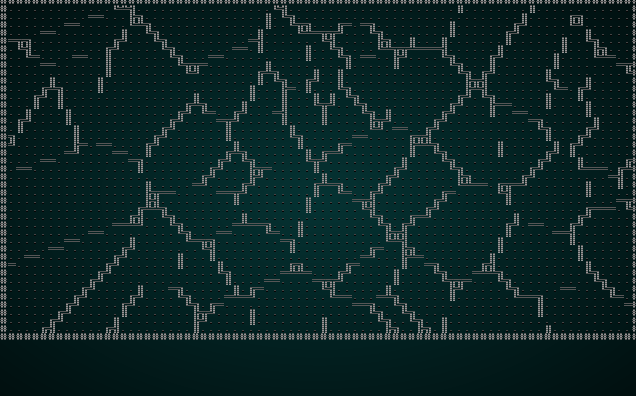
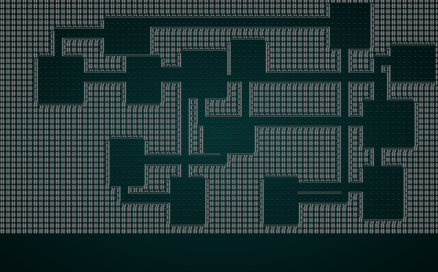
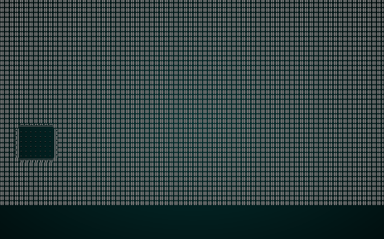

# Fun With Layers

---

***About this tutorial***

*This tutorial is free and open source, and all code uses the MIT license - so you are free to do with it as you like. My hope is that you will enjoy the tutorial, and make great games!*

*If you enjoy this and would like me to keep writing, please consider supporting [my Patreon](https://www.patreon.com/blackfuture).*

---

Now that we have a nice, clean layering system we'll take the opportunity to play with it a bit. This chapter is a collection of fun things you can do with layers, and will introduce a few new layer types. It's meant to whet your appetite to write more: the sky really is the limit!

## Existing Algorithms as Meta-Builders

Let's start by adjusting some of our existing algorithms to be useful as filters.

### Applying Cellular Automata as a meta-builder

When we wrote the Cellular Automata system, we aimed for a generic cavern builder. The algorithm is capable of quite a bit more than that - each iteration is basically a "meta builder" running on the previous iteration. A simple tweak allows it to *also* be a meta-builder that only runs a single iteration. 

We'll start by moving the code for a single iteration into its own function:

```rust
fn apply_iteration(&mut self, build_data : &mut BuilderMap) {
    let mut newtiles = build_data.map.tiles.clone();

    for y in 1..build_data.map.height-1 {
        for x in 1..build_data.map.width-1 {
            let idx = build_data.map.xy_idx(x, y);
            let mut neighbors = 0;
            if build_data.map.tiles[idx - 1] == TileType::Wall { neighbors += 1; }
            if build_data.map.tiles[idx + 1] == TileType::Wall { neighbors += 1; }
            if build_data.map.tiles[idx - build_data.map.width as usize] == TileType::Wall { neighbors += 1; }
            if build_data.map.tiles[idx + build_data.map.width as usize] == TileType::Wall { neighbors += 1; }
            if build_data.map.tiles[idx - (build_data.map.width as usize - 1)] == TileType::Wall { neighbors += 1; }
            if build_data.map.tiles[idx - (build_data.map.width as usize + 1)] == TileType::Wall { neighbors += 1; }
            if build_data.map.tiles[idx + (build_data.map.width as usize - 1)] == TileType::Wall { neighbors += 1; }
            if build_data.map.tiles[idx + (build_data.map.width as usize + 1)] == TileType::Wall { neighbors += 1; }

            if neighbors > 4 || neighbors == 0 {
                newtiles[idx] = TileType::Wall;
            }
            else {
                newtiles[idx] = TileType::Floor;
            }
        }
    }

    build_data.map.tiles = newtiles.clone();
    build_data.take_snapshot();
}
```

The `build` function is easily modified to call this on each iteration:

```rust
// Now we iteratively apply cellular automota rules
for _i in 0..15 {
    self.apply_iteration(build_data);
}
```

Finally, we'll add an implementation of `MetaMapBuilder` to the mix:

```rust
impl MetaMapBuilder for CellularAutomotaBuilder {
    #[allow(dead_code)]
    fn build_map(&mut self, _rng: &mut rltk::RandomNumberGenerator, build_data : &mut BuilderMap) {
        self.apply_iteration(build_data);
    }
}
```

See how we're calling a single iteration, instead of replacing the whole map? This shows how we can apply the cellular automata *rules* to the map - and change the resultant character quite a bit.

Now lets modify `map_builders/mod.rs`'s `random_builder` to force it to use this as an example:

```rust
pub fn random_builder(new_depth: i32, rng: &mut rltk::RandomNumberGenerator) -> BuilderChain {
    let mut builder = BuilderChain::new(new_depth);
    builder.start_with(VoronoiCellBuilder::pythagoras());
    builder.with(CellularAutomotaBuilder::new());
    builder.with(AreaStartingPosition::new(XStart::CENTER, YStart::CENTER));
    builder.with(CullUnreachable::new());
    builder.with(VoronoiSpawning::new());
    builder.with(DistantExit::new());
    builder
}
```

If you `cargo run` the project now, you'll see something like this:

.

### Eroding a boxy map with drunken dwarves

The Drunken Walk algorithm can also make a nice post-processing effect, with very minimal modification. In `drunkard.rs`, simply add the following:

```rust
impl MetaMapBuilder for DrunkardsWalkBuilder {
    #[allow(dead_code)]
    fn build_map(&mut self, rng: &mut rltk::RandomNumberGenerator, build_data : &mut BuilderMap) {
        self.build(rng, build_data);
    }
}
```

You can test it by once again modifying `random_builder`:

```rust
let mut builder = BuilderChain::new(new_depth);
builder.start_with(SimpleMapBuilder::new());
builder.with(DrunkardsWalkBuilder::winding_passages());
builder.with(AreaStartingPosition::new(XStart::CENTER, YStart::CENTER));
builder.with(CullUnreachable::new());
builder.with(VoronoiSpawning::new());
builder.with(DistantExit::new());
builder
```

If you `cargo run` the project, you'll see something like this:

.

Notice how the initial boxy design now looks a bit more natural, because drunken dwarves have carved out sections of the map!

### Attacking your boxy map with Diffusion-Limited Aggregation

DLA can also be modified to erode an existing, boxy map. Simply add the `MetaBuilder` trait to `dla.rs`:

```rust
impl MetaMapBuilder for DLABuilder {
    #[allow(dead_code)]
    fn build_map(&mut self, rng: &mut rltk::RandomNumberGenerator, build_data : &mut BuilderMap) {
        self.build(rng, build_data);
    }
}
```

We'll also add a new mode, `heavy_erosion` - it's the same as "walk inwards", but wants a greater percentage of floor space:

```rust
#[allow(dead_code)]
pub fn heavy_erosion() -> Box<DLABuilder> {
    Box::new(DLABuilder{
        algorithm: DLAAlgorithm::WalkInwards,
        brush_size: 2,
        symmetry: Symmetry::None,
        floor_percent: 0.35,
    })
}
```

And modify your `random_builder` test harness:

```rust
let mut builder = BuilderChain::new(new_depth);
builder.start_with(SimpleMapBuilder::new());
builder.with(DLABuilder::heavy_erosion());
builder.with(AreaStartingPosition::new(XStart::CENTER, YStart::CENTER));
builder.with(CullUnreachable::new());
builder.with(VoronoiSpawning::new());
builder.with(DistantExit::new());
builder
```

If you `cargo run` the project, you'll see something like this:

.

## Some New Meta-Builders

There's also plenty of scope to write new map filters...

## Playing with placement

...

**The source code for this chapter may be found [here](https://github.com/thebracket/rustrogueliketutorial/tree/master/chapter-37-layers2)**


[Run this chapter's example with web assembly, in your browser (WebGL2 required)](http://bfnightly.bracketproductions.com/rustbook/wasm/chapter-37-layers2/)
---

Copyright (C) 2019, Herbert Wolverson.

---