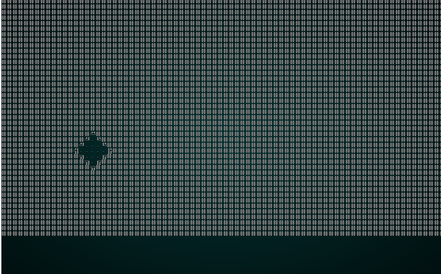
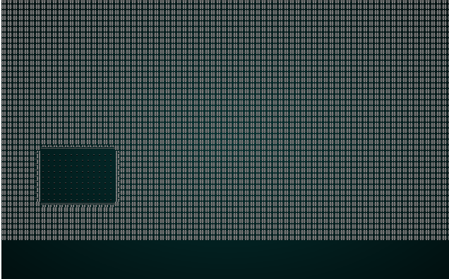

# Improved room building

---

***About this tutorial***

*This tutorial is free and open source, and all code uses the MIT license - so you are free to do with it as you like. My hope is that you will enjoy the tutorial, and make great games!*

*If you enjoy this and would like me to keep writing, please consider supporting [my Patreon](https://www.patreon.com/blackfuture).*

---

In the last chapter, we abstracted out room *layout* - but kept the actual placement of the rooms the same: they are always rectangles, although this can be mitigated with room explosion and corner rounding. This chapter will add the ability to use rooms of different shapes.

## Rectangle Room Builder

First, we'll make a builder that accepts a set of *rooms* as input, and outputs those rooms as rectangles on the map - exactly like the previous editions. We'll also modify `SimpleMapBuilder` and `BspDungeonBuilder` to not duplicate the functionality.

We'll make a new file, `map_builders/room_draw.rs`:

```rust
use super::{MetaMapBuilder, BuilderMap, TileType, Rect};
use rltk::RandomNumberGenerator;

pub struct RoomDrawer {}

impl MetaMapBuilder for RoomDrawer {
    fn build_map(&mut self, rng: &mut rltk::RandomNumberGenerator, build_data : &mut BuilderMap)  {
        self.build(rng, build_data);
    }
}

impl RoomDrawer {
    #[allow(dead_code)]
    pub fn new() -> Box<RoomDrawer> {
        Box::new(RoomDrawer{})
    }

    fn build(&mut self, _rng : &mut RandomNumberGenerator, build_data : &mut BuilderMap) {
        let rooms : Vec<Rect>;
        if let Some(rooms_builder) = &build_data.rooms {
            rooms = rooms_builder.clone();
        } else {
            panic!("Room Rounding require a builder with room structures");
        }

        for room in rooms.iter() {
            for y in room.y1 +1 ..= room.y2 {
                for x in room.x1 + 1 ..= room.x2 {
                    let idx = build_data.map.xy_idx(x, y);
                    if idx > 0 && idx < ((build_data.map.width * build_data.map.height)-1) as usize {
                        build_data.map.tiles[idx] = TileType::Floor;
                    }
                }
            }
            build_data.take_snapshot();
        }
    }
}
```

This is the same drawing functionality found in `common.rs`'s `apply_room_to_map` - wrapped in the same meta-builder functionality we've used in the last couple of chapters. Nothing too surprising here!

In `bsp_dungeon.rs`, simply remove the line referencing `apply_room_to_map`. You can also remove `take_snapshot` - since we aren't applying anything to the map yet:

```rust
if self.is_possible(candidate, &build_data.map, &rooms) {
    rooms.push(candidate);
    self.add_subrects(rect);
}
```

We'll also have to update `is_possible` to check the rooms list rather than reading the live map (to which we haven't written anything):

```rust
fn is_possible(&self, rect : Rect, build_data : &BuilderMap, rooms: &Vec<Rect>) -> bool {
    let mut expanded = rect;
    expanded.x1 -= 2;
    expanded.x2 += 2;
    expanded.y1 -= 2;
    expanded.y2 += 2;

    let mut can_build = true;

    for r in rooms.iter() {
        if r.intersect(&rect) { can_build = false; }
    }

    for y in expanded.y1 ..= expanded.y2 {
        for x in expanded.x1 ..= expanded.x2 {
            if x > build_data.map.width-2 { can_build = false; }
            if y > build_data.map.height-2 { can_build = false; }
            if x < 1 { can_build = false; }
            if y < 1 { can_build = false; }
            if can_build {
                let idx = build_data.map.xy_idx(x, y);
                if build_data.map.tiles[idx] != TileType::Wall { 
                    can_build = false; 
                }
            }
        }
    }

    can_build
}
```

Likewise, in `simple_map.rs` - just remove the `apply_room_to_map` and `take_snapshot` calls:

```rust
if ok {
    rooms.push(new_room);
}
```

Nothing is using `apply_room_to_map` in `common.rs` anymore - so we can delete that too!

Lastly, modify `random_builder` in `map_builders/mod.rs` to test our code:

```rust
pub fn random_builder(new_depth: i32, rng: &mut rltk::RandomNumberGenerator) -> BuilderChain {
    /*let mut builder = BuilderChain::new(new_depth);
    let type_roll = rng.roll_dice(1, 2);
    match type_roll {
        1 => random_room_builder(rng, &mut builder),
        _ => random_shape_builder(rng, &mut builder)
    }

    if rng.roll_dice(1, 3)==1 {
        builder.with(WaveformCollapseBuilder::new());
    }

    if rng.roll_dice(1, 20)==1 {
        builder.with(PrefabBuilder::sectional(prefab_builder::prefab_sections::UNDERGROUND_FORT));
    }

    builder.with(PrefabBuilder::vaults());

    builder*/

    let mut builder = BuilderChain::new(new_depth);
    builder.start_with(SimpleMapBuilder::new());
    builder.with(RoomDrawer::new());
    builder.with(RoomSorter::new(RoomSort::LEFTMOST));
    builder.with(BspCorridors::new());
    builder.with(RoomBasedSpawner::new());
    builder.with(RoomBasedStairs::new());
    builder.with(RoomBasedStartingPosition::new());
    builder
}
```

If you `cargo run` the project, you'll see our simple map builder run - just like before.

## Circular Rooms

Simply moving the draw code out of the algorithm cleans things up, but doesn't gain us anything new. So we'll look at adding a few shape options for rooms. We'll start by moving the draw code out of the main loop and into its own function. Modify `room_draw.rs` as follows:

```rust
fn rectangle(&mut self, build_data : &mut BuilderMap, room : &Rect) {
    for y in room.y1 +1 ..= room.y2 {
        for x in room.x1 + 1 ..= room.x2 {
            let idx = build_data.map.xy_idx(x, y);
            if idx > 0 && idx < ((build_data.map.width * build_data.map.height)-1) as usize {
                build_data.map.tiles[idx] = TileType::Floor;
            }
        }
    }
}

fn build(&mut self, _rng : &mut RandomNumberGenerator, build_data : &mut BuilderMap) {
    let rooms : Vec<Rect>;
    if let Some(rooms_builder) = &build_data.rooms {
        rooms = rooms_builder.clone();
    } else {
        panic!("Room Drawing require a builder with room structures");
    }

    for room in rooms.iter() {
        self.rectangle(build_data, room);
        build_data.take_snapshot();
    }
}
```

Once again, if you feel like testing it - `cargo run` will give you similar results to last time. Lets add a second room shape - circular rooms:

```rust
fn circle(&mut self, build_data : &mut BuilderMap, room : &Rect) {
    let radius = i32::min(room.x2 - room.x1, room.y2 - room.y1) as f32 / 2.0;
    let center = room.center();
    let center_pt = rltk::Point::new(center.0, center.1);
    for y in room.y1 ..= room.y2 {
        for x in room.x1 ..= room.x2 {
            let idx = build_data.map.xy_idx(x, y);
            let distance = rltk::DistanceAlg::Pythagoras.distance2d(center_pt, rltk::Point::new(x, y));
            if idx > 0 
                && idx < ((build_data.map.width * build_data.map.height)-1) as usize 
                && distance <= radius
            {
                build_data.map.tiles[idx] = TileType::Floor;
            }
        }
    }
}
```

Now replace your call to `rectangle` with `circle`, type `cargo run` and enjoy the new room type:

.

## Picking a shape at random

It would be nice for round rooms to be an *occasional* feature. So we'll modify our `build` function to make roughly one quarter of rooms round:

```rust
fn build(&mut self, rng : &mut RandomNumberGenerator, build_data : &mut BuilderMap) {
    let rooms : Vec<Rect>;
    if let Some(rooms_builder) = &build_data.rooms {
        rooms = rooms_builder.clone();
    } else {
        panic!("Room Drawing require a builder with room structures");
    }

    for room in rooms.iter() {
        let room_type = rng.roll_dice(1,4);
        match room_type {
            1 => self.circle(build_data, room),
            _ => self.rectangle(build_data, room)
        }
        build_data.take_snapshot();
    }
}
```

If you `cargo run` the project now, you'll see something like this:

.

## Restoring randomness

In `map_builders/mod.rs` uncomment the code and remove the test harness:

```rust
pub fn random_builder(new_depth: i32, rng: &mut rltk::RandomNumberGenerator) -> BuilderChain {
    let mut builder = BuilderChain::new(new_depth);
    let type_roll = rng.roll_dice(1, 2);
    match type_roll {
        1 => random_room_builder(rng, &mut builder),
        _ => random_shape_builder(rng, &mut builder)
    }

    if rng.roll_dice(1, 3)==1 {
        builder.with(WaveformCollapseBuilder::new());
    }

    if rng.roll_dice(1, 20)==1 {
        builder.with(PrefabBuilder::sectional(prefab_builder::prefab_sections::UNDERGROUND_FORT));
    }

    builder.with(PrefabBuilder::vaults());

    builder
}
```

In `random_room_builder`, we add in the room drawing:

```rust
...
let sort_roll = rng.roll_dice(1, 5);
match sort_roll {
    1 => builder.with(RoomSorter::new(RoomSort::LEFTMOST)),
    2 => builder.with(RoomSorter::new(RoomSort::RIGHTMOST)),
    3 => builder.with(RoomSorter::new(RoomSort::TOPMOST)),
    4 => builder.with(RoomSorter::new(RoomSort::BOTTOMMOST)),
    _ => builder.with(RoomSorter::new(RoomSort::CENTRAL)),
}

builder.with(RoomDrawer::new());

let corridor_roll = rng.roll_dice(1, 2);
match corridor_roll {
    1 => builder.with(DoglegCorridors::new()),
    _ => builder.with(BspCorridors::new())
}
...
```

You can now get the full gamut of random room creation - but with the occasional round instead of rectangular room. That adds a bit more variety to the mix.

...

**The source code for this chapter may be found [here](https://github.com/thebracket/rustrogueliketutorial/tree/master/chapter-38-rooms)**


[Run this chapter's example with web assembly, in your browser (WebGL2 required)](https://bfnightly.bracketproductions.com/rustbook/wasm/chapter-38-rooms/)
---

Copyright (C) 2019, Herbert Wolverson.

---