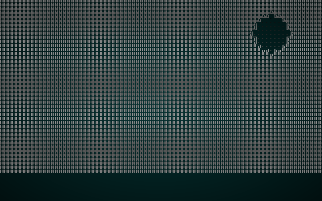
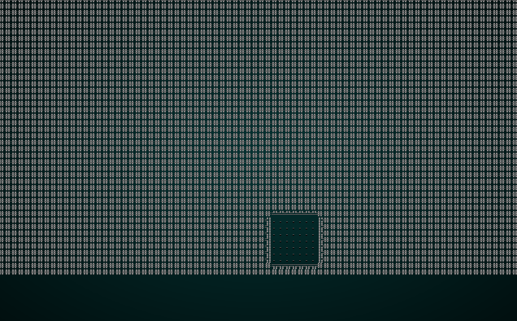
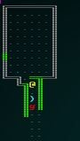

# Improved corridors

---

***About this tutorial***

*This tutorial is free and open source, and all code uses the MIT license - so you are free to do with it as you like. My hope is that you will enjoy the tutorial, and make great games!*

*If you enjoy this and would like me to keep writing, please consider supporting [my Patreon](https://www.patreon.com/blackfuture).*

---

Our corridor generation so far has been quite primitive, featuring overlaps - and unless you use Voronoi spawning, nothing in them. This chapter will try to offer a few more generation strategies (in turn providing even more map variety), and allow hallways to contain entities.

## New corridor strategy: nearest neighbor

One way to make a map feel more natural is to build hallways between near neighbors. This reduces (but doesn't eliminate) overlaps, and looks more like something that someone might actually *build*. We'll make a new file, `map_builders/rooms_corridors_nearest.rs`:

```rust
use super::{MetaMapBuilder, BuilderMap, Rect, draw_corridor };
use rltk::RandomNumberGenerator;
use std::collections::HashSet;

pub struct NearestCorridors {}

impl MetaMapBuilder for NearestCorridors {
    #[allow(dead_code)]
    fn build_map(&mut self, rng: &mut rltk::RandomNumberGenerator, build_data : &mut BuilderMap) {
        self.corridors(rng, build_data);
    }
}

impl NearestCorridors {
    #[allow(dead_code)]
    pub fn new() -> Box<NearestCorridors> {
        Box::new(NearestCorridors{})
    }

    fn corridors(&mut self, _rng : &mut RandomNumberGenerator, build_data : &mut BuilderMap) {
        let rooms : Vec<Rect>;
        if let Some(rooms_builder) = &build_data.rooms {
            rooms = rooms_builder.clone();
        } else {
            panic!("Nearest Corridors require a builder with room structures");
        }

        let mut connected : HashSet<usize> = HashSet::new();
        for (i,room) in rooms.iter().enumerate() {
            let mut room_distance : Vec<(usize, f32)> = Vec::new();
            let room_center = room.center();
            let room_center_pt = rltk::Point::new(room_center.0, room_center.1);
            for (j,other_room) in rooms.iter().enumerate() {
                if i != j && !connected.contains(&j) {
                    let other_center = other_room.center();
                    let other_center_pt = rltk::Point::new(other_center.0, other_center.1);
                    let distance = rltk::DistanceAlg::Pythagoras.distance2d(
                        room_center_pt,
                        other_center_pt
                    );
                    room_distance.push((j, distance));
                }
            }

            if !room_distance.is_empty() {
                room_distance.sort_by(|a,b| a.1.partial_cmp(&b.1).unwrap() );
                let dest_center = rooms[room_distance[0].0].center();
                draw_corridor(
                    &mut build_data.map,
                    room_center.0, room_center.1,
                    dest_center.0, dest_center.1
                );
                connected.insert(i);
                build_data.take_snapshot();
            }
        }
    }
}
```

There's some boilerplate with which you should be familiar by now, so lets walk through the `corridors` function:

1. We start by obtaining the `rooms` list, and `panic!` if there isn't one.
2. We make a new `HashSet` named `connected`. We'll add rooms to this as they gain exits, so as to avoid linking repeatedly to the same room.
3. For each room, we retrieve an "enumeration" called `i` (the index number in the vector) and the `room`:
    1. We create a new vector called `room_distance`. It stores tuples containing the room being considered's index and a floating point number that will store its distance to the current room.
    2. We calculate the center of the room, and store it in a `Point` from RLTK (for compatibility with the distance algorithms).
    3. For every room, we retrieve an enumeration called `j` (it's customary to use `i` and `j` for counters, presumably dating back to the days in which longer variable names were expensive!), and the `other_room`.
        1. If `i` and `j` are equal, we are looking at a corridor to/from the same room. We don't want to do that, so we skip it!
        2. Likewise, if the `other_room`'s index (`j`) is in our `connected` set, then we don't want to evaluate it either - so we skip that.
        3. We calculate the distance from the outer room (`room`/`i`) to the room we are evaluating (`other_room`/`j`).
        4. We push the distance and the `j` index into `room_distance`.
    4. If the list for `room_distance` is empty, we skip ahead. Otherwise:
    5. We use `sort_by` to sort the `room_distance` vector, with the shortest distance being closest.
    6. Then we use the `draw_corridor` function to draw a corridor from the center of the current `room` to the closest room (index `0` in `room_distance`)

Lastly, we'll modify `random_builder` in `map_builders/mod.rs` to use this algorithm:

```rust
pub fn random_builder(new_depth: i32, rng: &mut rltk::RandomNumberGenerator) -> BuilderChain {
    /*
    let mut builder = BuilderChain::new(new_depth);
    let type_roll = rng.roll_dice(1, 2);
    match type_roll {
        1 => random_room_builder(rng, &mut builder),
        _ => random_shape_builder(rng, &mut builder)
    }

    if rng.roll_dice(1, 3)==1 {
        builder.with(WaveformCollapseBuilder::new());
    }

    if rng.roll_dice(1, 20)==1 {
        builder.with(PrefabBuilder::sectional(prefab_builder::prefab_sections::UNDERGROUND_FORT));
    }

    builder.with(PrefabBuilder::vaults());

    builder*/

    let mut builder = BuilderChain::new(new_depth);
    builder.start_with(SimpleMapBuilder::new());
    builder.with(RoomDrawer::new());
    builder.with(RoomSorter::new(RoomSort::LEFTMOST));
    builder.with(NearestCorridors::new());
    builder.with(RoomBasedSpawner::new());
    builder.with(RoomBasedStairs::new());
    builder.with(RoomBasedStartingPosition::new());
    builder
}
```

This gives nicely connected maps, with sensibly short corridor distances. If you `cargo run` the project, you should see something like this:

.

Overlapping corridors *can* still happen, but it is now quite unlikely.

## Corridors with Bresenham Lines

Instead of dog-legging around a corner, we can draw corridors as a straight line. This is a little more irritating for the player to navigate (more corners to navigate), but can give a pleasing effect. We'll create a new file, `map_builders/rooms_corridors_lines.rs`:

```rust
use super::{MetaMapBuilder, BuilderMap, Rect, TileType };
use rltk::RandomNumberGenerator;
use std::collections::HashSet;

pub struct StraightLineCorridors {}

impl MetaMapBuilder for StraightLineCorridors {
    #[allow(dead_code)]
    fn build_map(&mut self, rng: &mut rltk::RandomNumberGenerator, build_data : &mut BuilderMap) {
        self.corridors(rng, build_data);
    }
}

impl StraightLineCorridors {
    #[allow(dead_code)]
    pub fn new() -> Box<StraightLineCorridors> {
        Box::new(StraightLineCorridors{})
    }

    fn corridors(&mut self, _rng : &mut RandomNumberGenerator, build_data : &mut BuilderMap) {
        let rooms : Vec<Rect>;
        if let Some(rooms_builder) = &build_data.rooms {
            rooms = rooms_builder.clone();
        } else {
            panic!("Straight Line Corridors require a builder with room structures");
        }

        let mut connected : HashSet<usize> = HashSet::new();
        for (i,room) in rooms.iter().enumerate() {
            let mut room_distance : Vec<(usize, f32)> = Vec::new();
            let room_center = room.center();
            let room_center_pt = rltk::Point::new(room_center.0, room_center.1);
            for (j,other_room) in rooms.iter().enumerate() {
                if i != j && !connected.contains(&j) {
                    let other_center = other_room.center();
                    let other_center_pt = rltk::Point::new(other_center.0, other_center.1);
                    let distance = rltk::DistanceAlg::Pythagoras.distance2d(
                        room_center_pt,
                        other_center_pt
                    );
                    room_distance.push((j, distance));
                }
            }

            if !room_distance.is_empty() {
                room_distance.sort_by(|a,b| a.1.partial_cmp(&b.1).unwrap() );
                let dest_center = rooms[room_distance[0].0].center();
                let line = rltk::line2d(
                    rltk::LineAlg::Bresenham, 
                    room_center_pt, 
                    rltk::Point::new(dest_center.0, dest_center.1)
                );
                for cell in line.iter() {
                    let idx = build_data.map.xy_idx(cell.x, cell.y);
                    build_data.map.tiles[idx] = TileType::Floor;
                }
                connected.insert(i);
                build_data.take_snapshot();
            }
        }
    }
}
```

This is almost the same as the previous one, but instead of calling `draw_corridor` we use RLTK's line function to plot a line from the center of the source and destination rooms. We then mark each tile along the line as a floor. If you modify your `random_builder` to use this:

```rust
let mut builder = BuilderChain::new(new_depth);
builder.start_with(SimpleMapBuilder::new());
builder.with(RoomDrawer::new());
builder.with(RoomSorter::new(RoomSort::LEFTMOST));
builder.with(StraightLineCorridors::new());
builder.with(RoomBasedSpawner::new());
builder.with(RoomBasedStairs::new());
builder.with(RoomBasedStartingPosition::new());
builder
```

Then `cargo run` your project, you will see something like this:

.

## Storing corridor locations

We might want to do something with our corridor locations in the future, so lets store them. In `map_builders/mod.rs`, lets add a container to store our corridor locations. We'll make it an `Option`, so as to preserve compatibility with map types that don't use the concept:

```rust
pub struct BuilderMap {
    pub spawn_list : Vec<(usize, String)>,
    pub map : Map,
    pub starting_position : Option<Position>,
    pub rooms: Option<Vec<Rect>>,
    pub corridors: Option<Vec<Vec<usize>>>,
    pub history : Vec<Map>
}
```

We also need to adjust the constructor to ensure that `corridors` isn't forgotten:

```rust
impl BuilderChain {
    pub fn new(new_depth : i32) -> BuilderChain {
        BuilderChain{
            starter: None,
            builders: Vec::new(),
            build_data : BuilderMap {
                spawn_list: Vec::new(),
                map: Map::new(new_depth),
                starting_position: None,
                rooms: None,
                corridors: None,
                history : Vec::new()
            }
        }
    }
    ...
```

Now in `common.rs`, lets modify our corridor functions to return corridor placement information:

```rust
pub fn apply_horizontal_tunnel(map : &mut Map, x1:i32, x2:i32, y:i32) -> Vec<usize> {
    let mut corridor = Vec::new();
    for x in min(x1,x2) ..= max(x1,x2) {
        let idx = map.xy_idx(x, y);
        if idx > 0 && idx < map.width as usize * map.height as usize && map.tiles[idx as usize] != TileType::Floor {
            map.tiles[idx as usize] = TileType::Floor;
            corridor.push(idx as usize);
        }
    }
    corridor
}

pub fn apply_vertical_tunnel(map : &mut Map, y1:i32, y2:i32, x:i32) -> Vec<usize> {
    let mut corridor = Vec::new();
    for y in min(y1,y2) ..= max(y1,y2) {
        let idx = map.xy_idx(x, y);
        if idx > 0 && idx < map.width as usize * map.height as usize && map.tiles[idx as usize] != TileType::Floor {
            corridor.push(idx);
            map.tiles[idx as usize] = TileType::Floor;
        }
    }
    corridor
}

pub fn draw_corridor(map: &mut Map, x1:i32, y1:i32, x2:i32, y2:i32) -> Vec<usize> {
    let mut corridor = Vec::new();
    let mut x = x1;
    let mut y = y1;

    while x != x2 || y != y2 {
        if x < x2 {
            x += 1;
        } else if x > x2 {
            x -= 1;
        } else if y < y2 {
            y += 1;
        } else if y > y2 {
            y -= 1;
        }

        let idx = map.xy_idx(x, y);
        if map.tiles[idx] != TileType::Floor {
            corridor.push(idx);
            map.tiles[idx] = TileType::Floor;
        }
    }

    corridor
}
```

Notice that they are essentially unchanged, but now return a vector of tile indices - and only add to them if the tile being modified is a floor? That will give us definitions for each leg of a corridor. Now we need to modify the corridor drawing algorithms to store this information. In `rooms_corridors_bsp.rs`, modify the `corridors` function to do this:

```rust
...
let mut corridors : Vec<Vec<usize>> = Vec::new();
for i in 0..rooms.len()-1 {
    let room = rooms[i];
    let next_room = rooms[i+1];
    let start_x = room.x1 + (rng.roll_dice(1, i32::abs(room.x1 - room.x2))-1);
    let start_y = room.y1 + (rng.roll_dice(1, i32::abs(room.y1 - room.y2))-1);
    let end_x = next_room.x1 + (rng.roll_dice(1, i32::abs(next_room.x1 - next_room.x2))-1);
    let end_y = next_room.y1 + (rng.roll_dice(1, i32::abs(next_room.y1 - next_room.y2))-1);
    let corridor = draw_corridor(&mut build_data.map, start_x, start_y, end_x, end_y);
    corridors.push(corridor);
    build_data.take_snapshot();
}
build_data.corridors = Some(corridors);
...
```

We do the same again in `rooms_corridors_dogleg.rs`:

```rust
...
let mut corridors : Vec<Vec<usize>> = Vec::new();
for (i,room) in rooms.iter().enumerate() {
    if i > 0 {
        let (new_x, new_y) = room.center();
        let (prev_x, prev_y) = rooms[rooms.len()-1].center();
        if rng.range(0,1) == 1 {
            let mut c1 = apply_horizontal_tunnel(&mut build_data.map, prev_x, new_x, prev_y);
            let mut c2 = apply_vertical_tunnel(&mut build_data.map, prev_y, new_y, new_x);
            c1.append(&mut c2);
            corridors.push(c1);
        } else {
            let mut c1 = apply_vertical_tunnel(&mut build_data.map, prev_y, new_y, prev_x);
            let mut c2 = apply_horizontal_tunnel(&mut build_data.map, prev_x, new_x, new_y);
            c1.append(&mut c2);
            corridors.push(c1);
        }
        build_data.take_snapshot();
    }
}
build_data.corridors = Some(corridors);
...
```

You'll notice that we append the second leg of the corridor to the first, so we treat it as one long corridor rather than two hallways. We need to apply the same change to our newly minted `rooms_corridors_lines.rs`:

```rust
fn corridors(&mut self, _rng : &mut RandomNumberGenerator, build_data : &mut BuilderMap) {
    let rooms : Vec<Rect>;
    if let Some(rooms_builder) = &build_data.rooms {
        rooms = rooms_builder.clone();
    } else {
        panic!("Straight Line Corridors require a builder with room structures");
    }

    let mut connected : HashSet<usize> = HashSet::new();
    let mut corridors : Vec<Vec<usize>> = Vec::new();
    for (i,room) in rooms.iter().enumerate() {
        let mut room_distance : Vec<(usize, f32)> = Vec::new();
        let room_center = room.center();
        let room_center_pt = rltk::Point::new(room_center.0, room_center.1);
        for (j,other_room) in rooms.iter().enumerate() {
            if i != j && !connected.contains(&j) {
                let other_center = other_room.center();
                let other_center_pt = rltk::Point::new(other_center.0, other_center.1);
                let distance = rltk::DistanceAlg::Pythagoras.distance2d(
                    room_center_pt,
                    other_center_pt
                );
                room_distance.push((j, distance));
            }
        }

        if !room_distance.is_empty() {
            room_distance.sort_by(|a,b| a.1.partial_cmp(&b.1).unwrap() );
            let dest_center = rooms[room_distance[0].0].center();
            let line = rltk::line2d(
                rltk::LineAlg::Bresenham, 
                room_center_pt, 
                rltk::Point::new(dest_center.0, dest_center.1)
            );
            let mut corridor = Vec::new();
            for cell in line.iter() {
                let idx = build_data.map.xy_idx(cell.x, cell.y);
                if build_data.map.tiles[idx] != TileType::Floor {
                    build_data.map.tiles[idx] = TileType::Floor;
                    corridor.push(idx);
                }
            }
            corridors.push(corridor);
            connected.insert(i);
            build_data.take_snapshot();
        }
    }
    build_data.corridors = Some(corridors);
}
```

We'll also do the same in `rooms_corridors_nearest.rs`:

```rust
fn corridors(&mut self, _rng : &mut RandomNumberGenerator, build_data : &mut BuilderMap) {
    let rooms : Vec<Rect>;
    if let Some(rooms_builder) = &build_data.rooms {
        rooms = rooms_builder.clone();
    } else {
        panic!("Nearest Corridors require a builder with room structures");
    }

    let mut connected : HashSet<usize> = HashSet::new();
    let mut corridors : Vec<Vec<usize>> = Vec::new();
    for (i,room) in rooms.iter().enumerate() {
        let mut room_distance : Vec<(usize, f32)> = Vec::new();
        let room_center = room.center();
        let room_center_pt = rltk::Point::new(room_center.0, room_center.1);
        for (j,other_room) in rooms.iter().enumerate() {
            if i != j && !connected.contains(&j) {
                let other_center = other_room.center();
                let other_center_pt = rltk::Point::new(other_center.0, other_center.1);
                let distance = rltk::DistanceAlg::Pythagoras.distance2d(
                    room_center_pt,
                    other_center_pt
                );
                room_distance.push((j, distance));
            }
        }

        if !room_distance.is_empty() {
            room_distance.sort_by(|a,b| a.1.partial_cmp(&b.1).unwrap() );
            let dest_center = rooms[room_distance[0].0].center();
            let corridor = draw_corridor(
                &mut build_data.map,
                room_center.0, room_center.1,
                dest_center.0, dest_center.1
            );
            connected.insert(i);
            build_data.take_snapshot();
            corridors.push(corridor);
        }
    }
    build_data.corridors = Some(corridors);
}
```

## Ok, we have corridor data - now what?

One obvious use is to be able to spawn entities inside corridors. We'll make the new `room_corridor_spawner.rs` to do just that:

```rust
use super::{MetaMapBuilder, BuilderMap, spawner};
use rltk::RandomNumberGenerator;

pub struct CorridorSpawner {}

impl MetaMapBuilder for CorridorSpawner {
    fn build_map(&mut self, rng: &mut rltk::RandomNumberGenerator, build_data : &mut BuilderMap)  {
        self.build(rng, build_data);
    }
}

impl CorridorSpawner {
    #[allow(dead_code)]
    pub fn new() -> Box<CorridorSpawner> {
        Box::new(CorridorSpawner{})
    }

    fn build(&mut self, rng : &mut RandomNumberGenerator, build_data : &mut BuilderMap) {
        if let Some(corridors) = &build_data.corridors {
            for c in corridors.iter() {
                let depth = build_data.map.depth;
                spawner::spawn_region(&build_data.map, 
                    rng, 
                    &c, 
                    depth, 
                    &mut build_data.spawn_list);
            }
        } else {
            panic!("Corridor Based Spawning only works after corridors have been created");
        }
    }
}
```

This was based off of `room_based_spawner.rs` - copy/pasted and changed the names! Then the `if let` for `rooms` was replaced with `corridors` and instead of spawning per room - we pass the corridor to `spawn_region`. Entities now spawn in the hallways.

You can test this by adding the spawner to your `random_builder`:

```rust
let mut builder = BuilderChain::new(new_depth);
builder.start_with(SimpleMapBuilder::new());
builder.with(RoomDrawer::new());
builder.with(RoomSorter::new(RoomSort::LEFTMOST));
builder.with(StraightLineCorridors::new());
builder.with(RoomBasedSpawner::new());
builder.with(CorridorSpawner::new());
builder.with(RoomBasedStairs::new());
builder.with(RoomBasedStartingPosition::new());
builder
```

Once you are playing, you can now find entities inside your corridors:

.

## Restoring Randomness

Once again, it's the end of a sub-section - so we'll make `random_builder` random once more, but utilizing our new stuff!

Start by uncommenting the code in `random_builder`, and removing the test harness:

```rust
pub fn random_builder(new_depth: i32, rng: &mut rltk::RandomNumberGenerator) -> BuilderChain {
    let mut builder = BuilderChain::new(new_depth);
    let type_roll = rng.roll_dice(1, 2);
    match type_roll {
        1 => random_room_builder(rng, &mut builder),
        _ => random_shape_builder(rng, &mut builder)
    }

    if rng.roll_dice(1, 3)==1 {
        builder.with(WaveformCollapseBuilder::new());
    }

    if rng.roll_dice(1, 20)==1 {
        builder.with(PrefabBuilder::sectional(prefab_builder::prefab_sections::UNDERGROUND_FORT));
    }

    builder.with(PrefabBuilder::vaults());

    builder
}
```

Since everything we've worked on here has been *room* based, we'll also modify `random_room_builder` to include it. We'll expand the corridor related section:

```rust
let corridor_roll = rng.roll_dice(1, 4);
match corridor_roll {
    1 => builder.with(DoglegCorridors::new()),
    2 => builder.with(NearestCorridors::new()),
    3 => builder.with(StraightLineCorridors::new()),
    _ => builder.with(BspCorridors::new())
}

let cspawn_roll = rng.roll_dice(1, 2);
if cspawn_roll == 1 {
    builder.with(CorridorSpawner::new());
}
```

So we've added an equal chance of straight-line corridors and nearest-neighbor corridors, and 50% of the time it will spawn entities in hallways.

...

**The source code for this chapter may be found [here](https://github.com/thebracket/rustrogueliketutorial/tree/master/chapter-39-halls)**


[Run this chapter's example with web assembly, in your browser (WebGL2 required)](http://bfnightly.bracketproductions.com/rustbook/wasm/chapter-39-halls/)
---

Copyright (C) 2019, Herbert Wolverson.

---