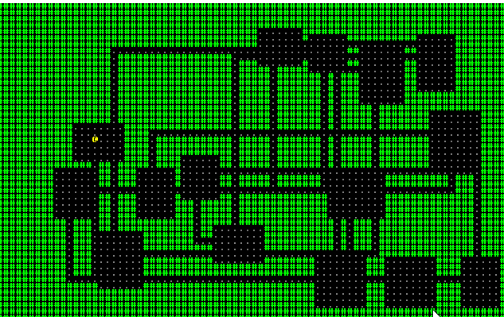

# Chapter 4 - A More Interesting Map

---

***About this tutorial***

*This tutorial is free and open source, and all code uses the MIT license - so you are free to do with it as you like. My hope is that you will enjoy the tutorial, and make great games!*

*If you enjoy this and would like me to keep writing, please consider supporting [my Patreon](https://www.patreon.com/blackfuture).*

---

In this chapter, we'll make a more interesting map. It will be room-based, and look a bit like many of the earlier roguelikes such as Moria - but with less complexity. It will also provide a great starting point for placing monsters!

## Cleaning up

We're going to start by cleaning up our code a bit, and utilizing separate files. As projects gain in complexity/size, it's a good idea to start keeping them as a clean set of files/modules, so we can quickly find what we're looking for (and improve compilation times, sometimes).

If you look at the [source code for this chapter](https://github.com/thebracket/rustrogueliketutorial/tree/master/chapter-04-newmap), you'll see that we've broken out a lot of functionality into individual files. When you make a new file in Rust, it automatically becomes a *module*. You then have to tell Rust to use these modules, so `main.rs` has gained a few `mod map` and similar, followed by `pub use map::*`. This says "import the module map, and then use - and make available to other modules - its public contents".

We've also made a bunch of `struct` into `pub struct`, and added `pub` to their members. If you *don't* do this, then the structure remains internal to that module only - and you can't use it in other parts of the code. This is the same as putting a `public:` C++ line in a class definition, and exporting the type in the header. Rust makes it a bit cleaner, and no need to write things twice!

## Making a more interesting map

We'll start by renaming `new_map` (now in `map.rs`) to `new_map_test`. We'll stop using it, but keep it around for a bit - it's a decent way to test our map code! We'll also use Rust's documentation tags to publish what this function does, in case we forget later:

```rust
/// Makes a map with solid boundaries and 400 randomly placed walls. No guarantees that it won't
/// look awful.
pub fn new_map_test() -> Vec<TileType> {
    ...
}
```

So now, in the spirit of the [original libtcod tutorial](http://rogueliketutorials.com/tutorials/tcod/part-3/), we'll start making a map. Our goal is to randomly place rooms, and join them together with corridors.

## Making a couple of rectangular rooms

We'll start with a new function:

```rust
pub fn new_map_rooms_and_corridors() -> Vec<TileType> {
    let mut map = vec![TileType::Wall; 80*50];

    map
}
```

This makes a solid 80x50 map, with walls on all tiles - you can't move! We've kept the function signature, so changing the map we want to use in `main.rs` just requires changing `gs.ecs.insert(new_map_test());` to `gs.ecs.insert(new_map_rooms_and_corridors());`.

Since this algorithm makes heavy use of rectangles, and a `Rect` type - we'll start by making one in `rect.rs`. We'll include some utility functions that will be useful later on in this chapter:

```rust
pub struct Rect {
    pub x1 : i32,
    pub x2 : i32,
    pub y1 : i32,
    pub y2 : i32
}

impl Rect {
    pub fn new(x:i32, y: i32, w:i32, h:i32) -> Rect {
        Rect{x1:x, y1:y, x2:x+w, y2:y+h}
    }

    // Returns true if this overlaps with other
    pub fn intersect(&self, other:&Rect) -> bool {
        self.x1 <= other.x2 && self.x2 >= other.x1 && self.y1 <= other.y2 && self.y2 >= other.y1
    }

    pub fn center(&self) -> (i32, i32) {
        ((self.x1 + self.x2)/2, (self.y1 + self.y2)/2)
    }
}
```

We'll also make a new function to apply a room to a map:

```rust
fn apply_room_to_map(room : &Rect, map: &mut [TileType]) {
    for y in room.y1 +1 ..= room.y2 {
        for x in room.x1 + 1 ..= room.x2 {
            map[xy_idx(x, y)] = TileType::Floor;
        }
    }
}
```

With these two bits of code, we can create a new rectangle anywhere with `Rect::new(x, y, width, height)`. We can add it to the map as floors with `apply_room_to_map(rect, map)`. That's enough to add a couple of test rooms. Our map function now looks like this:

```rust
pub fn new_map_rooms_and_corridors() -> Vec<TileType> {
    let mut map = vec![TileType::Wall; 80*50];

    let room1 = Rect::new(20, 15, 10, 15);
    let room2 = Rect::new(35, 15, 10, 15);

    apply_room_to_map(room1, &mut map);
    apply_room_to_map(room2, &mut map);

    map
}
```

If you `cargo run` your project, you'll see that we now have two rooms - not linked together.

## Making a corridor

Two disconnected rooms isn't much fun, so lets add a corridor between them. We're going to need some comparison functions, so we have to tell Rust to import them (at the top of `map.rs`): `use std::cmp::{max, min};`. Then we make two functions, for horizontal and vertical tunnels:

```rust
fn apply_horizontal_tunnel(map: &mut [TileType], x1:i32, x2:i32, y:i32) {
    for x in min(x1,x2) ..= max(x1,x2) {
        let idx = xy_idx(x, y);
        if idx > 0 && idx < 80*50 {
            map[idx as usize] = TileType::Floor;
        }
    }
}

fn apply_vertical_tunnel(map: &mut [TileType], y1:i32, y2:i32, x:i32) {
    for y in min(y1,y2) ..= max(y1,y2) {
        let idx = xy_idx(x, y);
        if idx > 0 && idx < 80*50 {
            map[idx as usize] = TileType::Floor;
        }
    }
}
```

Then we add a call, `apply_horizontal_tunnel(&mut map, 25, 40, 23);` to our map making function, and voila! We have a tunnel between the two rooms! If you run (`cargo run`) the project, you can walk between the two rooms - and not into walls. So our previous code is still working, but now it looks a bit more like a roguelike.

## Making a simple dungeon

Now we can use that to make a random dungeon. We'll modify our function as follows:

```rust
pub fn new_map_rooms_and_corridors() -> Vec<TileType> {
    let mut map = vec![TileType::Wall; 80*50];

    let mut rooms : Vec<Rect> = Vec::new();
    const MAX_ROOMS : i32 = 30;
    const MIN_SIZE : i32 = 6;
    const MAX_SIZE : i32 = 10;

    let mut rng = RandomNumberGenerator::new();

    for _i in 0..MAX_ROOMS {
        let w = rng.range(MIN_SIZE, MAX_SIZE);
        let h = rng.range(MIN_SIZE, MAX_SIZE);
        let x = rng.roll_dice(1, 80 - w - 1) - 1;
        let y = rng.roll_dice(1, 50 - h - 1) - 1;
        let new_room = Rect::new(x, y, w, h);
        let mut ok = true;
        for other_room in rooms.iter() {
            if new_room.intersect(other_room) { ok = false }
        }
        if ok {
            apply_room_to_map(&new_room, &mut map);        
            rooms.push(new_room);            
        }
    }

    map
}
```

There's quite a bit changed there:

* We've added `const` constants for the maximum number of rooms to make, and the minimum and maximum size of the rooms.
* We acquire a `RandomNumberGenerator` from RLTK (which required that we add to the `use` statement at the top of `map.rs`)
* We're randomly building a width and height.
* We're then placing the room randomly so that `x` and `y` are greater than 0 and less than the maximum map size minus one.
* We iterate through existing rooms, rejecting the new room if it overlaps with one we've already placed.
* If its ok, we apply it to the room.
* We're keeping rooms in a vector, although we aren't using it yet.

Running the project (`cargo run`) at this point will give you a selection of random rooms, with no corridors between them.

## Joining the rooms together

We now need to join the rooms together, with corridors. We'll add this to the `if ok` section of the map generator:

```rust
if ok {
    apply_room_to_map(&new_room, &mut map);

    if !rooms.is_empty() {
        let (new_x, new_y) = new_room.center();
        let (prev_x, prev_y) = rooms[rooms.len()-1].center();
        if rng.range(0,1) == 1 {
            apply_horizontal_tunnel(&mut map, prev_x, new_x, prev_y);
            apply_vertical_tunnel(&mut map, prev_y, new_y, new_x);
        } else {
            apply_vertical_tunnel(&mut map, prev_y, new_y, prev_x);
            apply_horizontal_tunnel(&mut map, prev_x, new_x, new_y);
        }
    }

    rooms.push(new_room);
}
```

1. So what does this do? It starts by looking to see if the `rooms` list is empty. If it is, then there is no previous room to join to - so we ignore it.
2. It gets the room's center, and stores it as `new_x` and `new_y`.
3. It gets the previous room in the vector's center, and stores it as `prev_x` and `prev_y`.
4. It rolls a dice, and half the time it draws a horizontal and then vertical tunnel - and half the time, the other way around.

Try `cargo run` now. It's really starting to look like a roguelike!

## Placing the player

Currently, the player always starts in the center of the map - which with the new generator, may not be a valid starting point! We *could* simply move the player to the center of the first room, but it's likely that our generator will need to know where all the rooms are - so we can put things in them - rather than just the player's location. So we'll modify our `new_map_rooms_and_corridors` function to also return the room list. So we change the method signature to: ```rust pub fn new_map_rooms_and_corridors() -> (Vec<Rect>, Vec<TileType>) {```, and the return statement to ```rust (rooms, map) ```

Our `main.rs` file also required adjustment, to get accept the new format. We change our `main` function in `main.rs` to:

```rust
fn main() {
    let context = Rltk::init_simple8x8(80, 50, "Hello Rust World", "../resources");
    let mut gs = State {
        ecs: World::new(),
        systems : DispatcherBuilder::new()
            .build()
    };
    gs.ecs.register::<Position>();
    gs.ecs.register::<Renderable>();
    gs.ecs.register::<Player>();

    let (rooms, map) = new_map_rooms_and_corridors();
    gs.ecs.insert(map);
    let (player_x, player_y) = rooms[0].center();

    gs.ecs
        .create_entity()
        .with(Position { x: player_x, y: player_y })
        .with(Renderable {
            glyph: rltk::to_cp437('@'),
            fg: RGB::named(rltk::YELLOW),
            bg: RGB::named(rltk::BLACK),
        })
        .with(Player{})
        .build();

    rltk::main_loop(context, gs);
}
```

This is mostly the same, but we are receiving *both* the rooms list and the map from `new_map_rooms_and_corridors`. We then place the player in the center of the first room.

## Wrapping Up - and supporting the numpad, and Vi keys

Now you have a map that looks like a roguelike, places the player in the first room, and lets you explore with the cursor keys. Not every keyboard *has* cursor keys that are readily accessible (some laptops require interesting key combinations for them). Lots of players like to steer with the numpad, but not every keyboard has one of those either - so we also support the directional keys from the text editor `vi`. This makes both hardcore UNIX users happy, and makes regular players happier.

We're not going to worry about diagonal movement yet. In `player.rs`, we change `player_input` to look like this:

```rust
pub fn player_input(gs: &mut State, ctx: &mut Rltk) {
    // Player movement
    match ctx.key {
        None => {} // Nothing happened
        Some(key) => match key {
            VirtualKeyCode::Left => try_move_player(-1, 0, &mut gs.ecs),
            VirtualKeyCode::Numpad4 => try_move_player(-1, 0, &mut gs.ecs),
            VirtualKeyCode::H => try_move_player(-1, 0, &mut gs.ecs),
            VirtualKeyCode::Right => try_move_player(1, 0, &mut gs.ecs),
            VirtualKeyCode::Numpad6 => try_move_player(1, 0, &mut gs.ecs),
            VirtualKeyCode::L => try_move_player(1, 0, &mut gs.ecs),
            VirtualKeyCode::Up => try_move_player(0, -1, &mut gs.ecs),
            VirtualKeyCode::Numpad8 => try_move_player(0, -1, &mut gs.ecs),
            VirtualKeyCode::K => try_move_player(0, -1, &mut gs.ecs),
            VirtualKeyCode::Down => try_move_player(0, 1, &mut gs.ecs),
            VirtualKeyCode::Numpad2 => try_move_player(0, 1, &mut gs.ecs),
            VirtualKeyCode::J => try_move_player(0, 1, &mut gs.ecs),
            _ => {}
        },
    }
}
```

You should now get something like this when you `cargo run` your project:



**The source code for this chapter may be found [here](https://github.com/thebracket/rustrogueliketutorial/tree/master/chapter-04-newmap)**

---

Copyright (C) 2019, Herbert Wolverson.

---