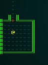
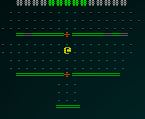
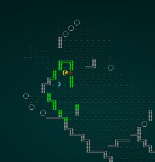
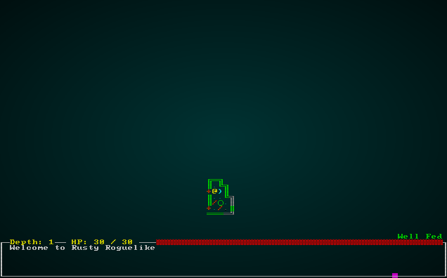

# Doors

---

***About this tutorial***

*This tutorial is free and open source, and all code uses the MIT license - so you are free to do with it as you like. My hope is that you will enjoy the tutorial, and make great games!*

*If you enjoy this and would like me to keep writing, please consider supporting [my Patreon](https://www.patreon.com/blackfuture).*

[](https://pragprog.com/titles/hwrust/hands-on-rust/)

---

*Doors and corners, that's where they get you*. If we're ever going to make Miller's (from *The Expanse* - probably my favorite sci-fi novel series of the moment) warning come true - it would be a good idea to *have* doors in the game. Doors are a staple of dungeon-bashing! We've waited this long to implement them so as to ensure that we have good places to put them.

## Doors are an entity, too

We'll start with simple, cosmetic doors that don't *do* anything at all. This will let us work on placing them appropriately, and then we can implement some door-related functionality. It's been a while since we added an entity type; fortunately, we have everything we need for cosmetic doors in the existing `components`. Open up `spawner.rs`, and refamiliarize yourself with it! Then we'll add a door spawner function:

```rust
fn door(ecs: &mut World, x: i32, y: i32) {
    ecs.create_entity()
        .with(Position{ x, y })
        .with(Renderable{
            glyph: rltk::to_cp437('+'),
            fg: RGB::named(rltk::CHOCOLATE),
            bg: RGB::named(rltk::BLACK),
            render_order: 2
        })
        .with(Name{ name : "Door".to_string() })
        .marked::<SimpleMarker<SerializeMe>>()
        .build();
}
```

So our cosmetic-only door is pretty simple: it has a glyph (`+` is traditional in many roguelikes), is brown, and it has a `Name` and a `Position`. That's really all we need to make them appear on the map! We'll also modify `spawn_entity` to know what to do when given a Door to spawn:

```rust
match spawn.1.as_ref() {
    "Goblin" => goblin(ecs, x, y),
    "Orc" => orc(ecs, x, y),
    "Health Potion" => health_potion(ecs, x, y),
    "Fireball Scroll" => fireball_scroll(ecs, x, y),
    "Confusion Scroll" => confusion_scroll(ecs, x, y),
    "Magic Missile Scroll" => magic_missile_scroll(ecs, x, y),
    "Dagger" => dagger(ecs, x, y),
    "Shield" => shield(ecs, x, y),
    "Longsword" => longsword(ecs, x, y),
    "Tower Shield" => tower_shield(ecs, x, y),
    "Rations" => rations(ecs, x, y),
    "Magic Mapping Scroll" => magic_mapping_scroll(ecs, x, y),
    "Bear Trap" => bear_trap(ecs, x, y),
    "Door" => door(ecs, x, y),
    _ => {}
}
```

We *won't* add doors to the spawn tables; it wouldn't make a lot of sense for them to randomly appear in rooms!

## Placing doors

We'll create a new *builder* (we're still in the map section, after all!) that can place doors. So in `map_builders`, make a new file: `door_placement.rs`:

```rust
use super::{MetaMapBuilder, BuilderMap };
use rltk::RandomNumberGenerator;

pub struct DoorPlacement {}

impl MetaMapBuilder for DoorPlacement {
    #[allow(dead_code)]
    fn build_map(&mut self, rng: &mut rltk::RandomNumberGenerator, build_data : &mut BuilderMap) {
        self.doors(rng, build_data);
    }
}

impl DoorPlacement {
    #[allow(dead_code)]
    pub fn new() -> Box<DoorPlacement> {
        Box::new(DoorPlacement{ })
    }

    fn doors(&mut self, _rng : &mut RandomNumberGenerator, _build_data : &mut BuilderMap) {
    }
}
```

This is an empty skeleton of a meta-builder. Let's deal with the easiest case first: when we have corridor data, that provides something of a blueprint as to where doors might fit. We'll start with a new function, `door_possible`:

```rust
fn door_possible(&self, build_data : &mut BuilderMap, idx : usize) -> bool {
    let x = idx % build_data.map.width as usize;
    let y = idx / build_data.map.width as usize;

    // Check for east-west door possibility
    if build_data.map.tiles[idx] == TileType::Floor &&
        (x > 1 && build_data.map.tiles[idx-1] == TileType::Floor) &&
        (x < build_data.map.width-2 && build_data.map.tiles[idx+1] == TileType::Floor) &&
        (y > 1 && build_data.map.tiles[idx - build_data.map.width as usize] == TileType::Wall) &&
        (y < build_data.map.height-2 && build_data.map.tiles[idx + build_data.map.width as usize] == TileType::Wall)
    {
        return true;
    }

    // Check for north-south door possibility
    if build_data.map.tiles[idx] == TileType::Floor &&
        (x > 1 && build_data.map.tiles[idx-1] == TileType::Wall) &&
        (x < build_data.map.width-2 && build_data.map.tiles[idx+1] == TileType::Wall) &&
        (y > 1 && build_data.map.tiles[idx - build_data.map.width as usize] == TileType::Floor) &&
        (y < build_data.map.height-2 && build_data.map.tiles[idx + build_data.map.width as usize] == TileType::Floor)
    {
        return true;
    }

    false
}
```

There really are only two places in which a door makes sense: with east-west open and north-south blocked, and vice versa. We don't want doors to appear in open areas. So this function checks for those conditions, and returns `true` if a door is possible - and `false` otherwise. Now we expand the `doors` function to scan corridors and put doors at their beginning:

```rust
fn doors(&mut self, _rng : &mut RandomNumberGenerator, build_data : &mut BuilderMap) {
    if let Some(halls_original) = &build_data.corridors {
        let halls = halls_original.clone(); // To avoid nested borrowing
        for hall in halls.iter() {
            if hall.len() > 2 { // We aren't interested in tiny corridors
                if self.door_possible(build_data, hall[0]) {
                    build_data.spawn_list.push((hall[0], "Door".to_string()));
                }
            }
        }
    }
}
```

We start by checking that there *is* corridor information to use. If there is, we take a copy (to make the borrow checker happy - otherwise we're borrowing twice into `halls`) and iterate it. Each entry is a hallway - a vector of tiles that make up that hall. We're only interested in halls with more than 2 entries - to avoid *really* short corridors with doors attached. So, if its long enough - we check to see if a door makes sense at index `0` of the hall; if it does, we add it to the spawn list.

We'll quickly modify `random_builder` again to create a case in which there are probably doors to spawn:

```rust
let mut builder = BuilderChain::new(new_depth);
builder.start_with(SimpleMapBuilder::new());
builder.with(RoomDrawer::new());
builder.with(RoomSorter::new(RoomSort::LEFTMOST));
builder.with(StraightLineCorridors::new());
builder.with(RoomBasedSpawner::new());
builder.with(CorridorSpawner::new());
builder.with(RoomBasedStairs::new());
builder.with(RoomBasedStartingPosition::new());
builder.with(DoorPlacement::new());
builder
```

We `cargo run` the project, and lo and behold - doors:

.

## What about other designs?

It's certainly possible to scan other maps tile-by-tile looking to see if there is a possibility of a door appearing. Lets do that:

```rust
if let Some(halls_original) = &build_data.corridors {
        let halls = halls_original.clone(); // To avoid nested borrowing
        for hall in halls.iter() {
            if hall.len() > 2 { // We aren't interested in tiny corridors
                if self.door_possible(build_data, hall[0]) {
                    build_data.spawn_list.push((hall[0], "Door".to_string()));
                }
            }
        }
    } else {        
        // There are no corridors - scan for possible places
        let tiles = build_data.map.tiles.clone();
        for (i, tile) in tiles.iter().enumerate() {
            if *tile == TileType::Floor && self.door_possible(build_data, i) {
                build_data.spawn_list.push((i, "Door".to_string()));
            }
        }
    }
}
```

Modify your `random_builder` to use a map without hallways:

```rust
let mut builder = BuilderChain::new(new_depth);
builder.start_with(BspInteriorBuilder::new());
builder.with(DoorPlacement::new());
builder.with(RoomBasedSpawner::new());
builder.with(RoomBasedStairs::new());
builder.with(RoomBasedStartingPosition::new());
builder
```

You can `cargo run` the project and see doors:

.

That worked rather well!

## Restore our random function

We'll but `random_builder` back to how it was, with one change: we'll add a door spawner as the final step:

```rust
pub fn random_builder(new_depth: i32, rng: &mut rltk::RandomNumberGenerator) -> BuilderChain {
    let mut builder = BuilderChain::new(new_depth);
    let type_roll = rng.roll_dice(1, 2);
    match type_roll {
        1 => random_room_builder(rng, &mut builder),
        _ => random_shape_builder(rng, &mut builder)
    }

    if rng.roll_dice(1, 3)==1 {
        builder.with(WaveformCollapseBuilder::new());
    }

    if rng.roll_dice(1, 20)==1 {
        builder.with(PrefabBuilder::sectional(prefab_builder::prefab_sections::UNDERGROUND_FORT));
    }

    builder.with(DoorPlacement::new());
    builder.with(PrefabBuilder::vaults());

    builder
}
```

Notice that we added it *before* we add vaults; that's deliberate - the vault gets the chance to spawn and remove any doors that would interfere with it.

## Making Doors Do Something

Doors have a few properties: when closed, they block movement and visibility. They can be opened (optionally requiring unlocking, but we're not going there yet), at which point you can see through them just fine.

Let's start by "blocking out" (suggesting!) some new components. In `spawner.rs`:

```rust
fn door(ecs: &mut World, x: i32, y: i32) {
    ecs.create_entity()
        .with(Position{ x, y })
        .with(Renderable{
            glyph: rltk::to_cp437('+'),
            fg: RGB::named(rltk::CHOCOLATE),
            bg: RGB::named(rltk::BLACK),
            render_order: 2
        })
        .with(Name{ name : "Door".to_string() })
        .with(BlocksTile{})
        .with(BlocksVisibility{})
        .with(Door{open: false})
        .marked::<SimpleMarker<SerializeMe>>()
        .build();
}
```

There are two new component types here!

* `BlocksVisibility` will do what it says - prevent you (and monsters) from seeing through it. It's nice to have this as a component rather than a special-case, because now you can make *anything* block visibility. A really big treasure chest, a giant or even a moving wall - it makes sense to be able to prevent seeing through them.
* `Door` - which denotes that it is a door, and will need its own handling.

Open up `components.rs` and we'll make these new components:

```rust
#[derive(Component, Debug, Serialize, Deserialize, Clone)]
pub struct BlocksVisibility {}

#[derive(Component, Debug, Serialize, Deserialize, Clone)]
pub struct Door { 
    pub open: bool 
}
```

*As with all components, don't forget to register them both in `main` and in `saveload_system.rs`*.

### Extending The Visibility System to Handle Entities Blocking Your View

Since field of view is handled by RLTK, which relies upon a `Map` trait - we need to extend our map class to handle the concept. Add a new field:

```rust
#[derive(Default, Serialize, Deserialize, Clone)]
pub struct Map {
    pub tiles : Vec<TileType>,
    pub width : i32,
    pub height : i32,
    pub revealed_tiles : Vec<bool>,
    pub visible_tiles : Vec<bool>,
    pub blocked : Vec<bool>,
    pub depth : i32,
    pub bloodstains : HashSet<usize>,
    pub view_blocked : HashSet<usize>,

    #[serde(skip_serializing)]
    #[serde(skip_deserializing)]
    pub tile_content : Vec<Vec<Entity>>
}
```

And update the constructor so it can't be forgotten:

```rust
pub fn new(new_depth : i32) -> Map {
    Map{
        tiles : vec![TileType::Wall; MAPCOUNT],
        width : MAPWIDTH as i32,
        height: MAPHEIGHT as i32,
        revealed_tiles : vec![false; MAPCOUNT],
        visible_tiles : vec![false; MAPCOUNT],
        blocked : vec![false; MAPCOUNT],
        tile_content : vec![Vec::new(); MAPCOUNT],
        depth: new_depth,
        bloodstains: HashSet::new(),
        view_blocked : HashSet::new()
    }
}
```

Now we'll update the `is_opaque` function (used by field-of-view) to include a check against it:

```rust
fn is_opaque(&self, idx:i32) -> bool {
    let idx_u = idx as usize;
    self.tiles[idx_u] == TileType::Wall || self.view_blocked.contains(&idx_u)
}
```

We'll also have to visit `visibility_system.rs` to populate this data. We'll need to extend the system's data to retrieve a little more:

```rust
type SystemData = ( WriteExpect<'a, Map>,
                        Entities<'a>,
                        WriteStorage<'a, Viewshed>, 
                        ReadStorage<'a, Position>,
                        ReadStorage<'a, Player>,
                        WriteStorage<'a, Hidden>,
                        WriteExpect<'a, rltk::RandomNumberGenerator>,
                        WriteExpect<'a, GameLog>,
                        ReadStorage<'a, Name>,
                        ReadStorage<'a, BlocksVisibility>);

    fn run(&mut self, data : Self::SystemData) {
        let (mut map, entities, mut viewshed, pos, player, 
            mut hidden, mut rng, mut log, names, blocks_visibility) = data;
        ...
```

Right after that, we'll loop through all entities that block visibility and set their index in the `view_blocked` `HashSet`:

```rust
map.view_blocked.clear();
for (block_pos, _block) in (&pos, &blocks_visibility).join() {
    let idx = map.xy_idx(block_pos.x, block_pos.y);
    map.view_blocked.insert(idx);
}
```

If you `cargo run` the project now, you'll see that doors now block line-of-sight:

.

### Handling Doors

Moving against a closed door should open it, and then you can pass freely through (we could add an `open` and `close` command - maybe we will later - but for now lets keep it simple). Open up `player.rs`, and we'll add the functionality to `try_move_player`:

```rust
...
let mut doors = ecs.write_storage::<Door>();
let mut blocks_visibility = ecs.write_storage::<BlocksVisibility>();
let mut blocks_movement = ecs.write_storage::<BlocksTile>();
let mut renderables = ecs.write_storage::<Renderable>();

for (entity, _player, pos, viewshed) in (&entities, &players, &mut positions, &mut viewsheds).join() {
    if pos.x + delta_x < 1 || pos.x + delta_x > map.width-1 || pos.y + delta_y < 1 || pos.y + delta_y > map.height-1 { return RunState::AwaitingInput; }
    let destination_idx = map.xy_idx(pos.x + delta_x, pos.y + delta_y);

    for potential_target in map.tile_content[destination_idx].iter() {
        let target = combat_stats.get(*potential_target);
        if let Some(_target) = target {
            wants_to_melee.insert(entity, WantsToMelee{ target: *potential_target }).expect("Add target failed");
            return;
        }
        let door = doors.get_mut(*potential_target);
        if let Some(door) = door {
            door.open = true;
            blocks_visibility.remove(*potential_target);
            blocks_movement.remove(*potential_target);
            let glyph = renderables.get_mut(*potential_target).unwrap();
            glyph.glyph = rltk::to_cp437('/');
            viewshed.dirty = true;
        }
    }
    ...
```

Let's walk through it:

1. We obtain write access to the storages for `Door`, `BlocksVisibility`, `BlocksTile` and `Renderable`.
2. We iterate potential targets in the movement tile, handling melee as before.
3. We also check if potential targets are a door. If they are:
    1. Set the door `open` variable to `true`.
    2. Remove the `BlocksVisibility` entry - you can see through it, now (and so can monsters!).
    3. Remove the `BlocksTile` entry - you can move through it, now (and so can everyone else!)
    4. Update the glyph to show an open doorway.
    5. We mark the viewshed as dirty, to now reveal what you can see through the door.

If you `cargo run` the project now, you get the desired functionality:

.

## Too many doors!

On the non-corridor maps, there is a slight problem when play-testing the door placement: there are doors *everywhere*. Lets reduce the frequency of door placement. We'll just add a little randomness:

```rust
fn doors(&mut self, rng : &mut RandomNumberGenerator, build_data : &mut BuilderMap) {
    if let Some(halls_original) = &build_data.corridors {
        let halls = halls_original.clone(); // To avoid nested borrowing
        for hall in halls.iter() {
            if hall.len() > 2 { // We aren't interested in tiny corridors
                if self.door_possible(build_data, hall[0]) {
                    build_data.spawn_list.push((hall[0], "Door".to_string()));
                }
            }
        }
    } else {        
        // There are no corridors - scan for possible places
        let tiles = build_data.map.tiles.clone();
        for (i, tile) in tiles.iter().enumerate() {
            if *tile == TileType::Floor && self.door_possible(build_data, i) && rng.roll_dice(1,3)==1 {
                build_data.spawn_list.push((i, "Door".to_string()));
            }
        }
    }
}
```

This gives a 1 in 3 chance of any *possible* door placement yielding a door. From playing the game, this feels about right. It may not work for you - so you can change it! You may even want to make it a parameter.

## Doors on top of other entities

Sometimes, a door spawns on top of another entity. It's rare, but it *can* happen. Lets prevent that issue from occurring. We can fix this with a quick scan of the spawn list in `door_possible`:

```rust
fn door_possible(&self, build_data : &mut BuilderMap, idx : usize) -> bool {
    let mut blocked = false;
    for spawn in build_data.spawn_list.iter() {
        if spawn.0 == idx { blocked = true; }
    }
    if blocked { return false; }
    ...
```

If speed becomes a concern, this would be easy to speed up (make a quick `HashSet` of occupied tiles, and query that instead of the whole list) - but we haven't really had any performance issues, and map building runs outside of the main loop (so it's once per level, not every frame) - so chances are that you don't need it.

## Addendum: Fixing WFC

In our `random_builder`, we've made a mistake! Wave Function Collapse changes the nature of maps, and should adjust spawn, entry and exit points. Here's the *correct* code:

```rust
if rng.roll_dice(1, 3)==1 {
        builder.with(WaveformCollapseBuilder::new());

        // Now set the start to a random starting area
        let (start_x, start_y) = random_start_position(rng);
        builder.with(AreaStartingPosition::new(start_x, start_y));

        // Setup an exit and spawn mobs
        builder.with(VoronoiSpawning::new());
        builder.with(DistantExit::new());
    }
```

## Wrap-Up

That's it for doors! There's definitely room for improvement in the future - but the feature is working. You can approach a door, and it blocks both movement and line-of-sight (so the occupants of the room won't bother you). Open it, and you can see through - and the occupants can see you back. Now it's open, you can travel through it. That's pretty close to the definition of a door!

...

**The source code for this chapter may be found [here](https://github.com/thebracket/rustrogueliketutorial/tree/master/chapter-40-doors)**


[Run this chapter's example with web assembly, in your browser (WebGL2 required)](https://bfnightly.bracketproductions.com/rustbook/wasm/chapter-40-doors)
---

Copyright (C) 2019, Herbert Wolverson.

---