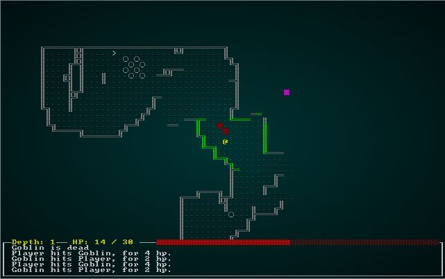
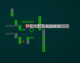
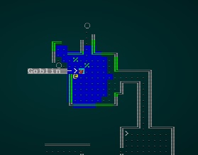
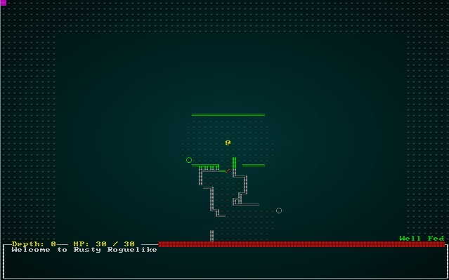
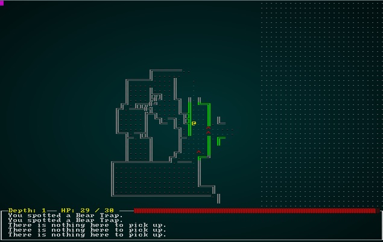
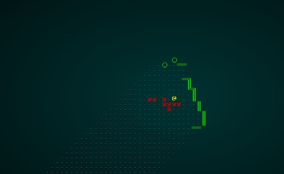

# Decoupling map size from terminal size

---

***About this tutorial***

*This tutorial is free and open source, and all code uses the MIT license - so you are free to do with it as you like. My hope is that you will enjoy the tutorial, and make great games!*

*If you enjoy this and would like me to keep writing, please consider supporting [my Patreon](https://www.patreon.com/blackfuture).*

[](https://pragprog.com/titles/hwrust/hands-on-rust/)

---

So far, we've firmly tied map size to terminal resolution. You have an 80x50 screen, and use a few lines for the user interface - so everything we've made is 80 tiles wide and 43 tiles high. As you've seen in previous chapters, you can do a *lot* with 3,440 tiles - but sometimes you want more (and sometimes you want less). You may also want a big, open world setting - but we're not going to go there yet! This chapter will start by decoupling the *camera* from the *map*, and then enable map size and screen size to differ. The difficult topic of resizing the user interface will be left for future development.

## Introducing a Camera

A common abstraction in games is to separate *what* you are viewing (the map and entities) from *how* you are viewing it - the camera. The camera typically follows your brave adventurer around the map, showing you the world from *their* point of view. In 3D games, the camera can be pretty complicated; in top-down roguelikes (viewing the map from above), it typically centers the view on the player's `@`.

Predictably enough, we'll start by making a new file: `camera.rs`. To enable it, add `pub mod camera` towards the top of `main.rs` (with the other module access).

We'll start out by making a function, `render_camera`, and doing some calculations we'll need:

```rust
use specs::prelude::*;
use super::{Map,TileType,Position,Renderable,Hidden};
use rltk::{Point, Rltk, RGB};

const SHOW_BOUNDARIES : bool = true;

pub fn render_camera(ecs: &World, ctx : &mut Rltk) {
    let map = ecs.fetch::<Map>();
    let player_pos = ecs.fetch::<Point>();
    let (x_chars, y_chars) = ctx.get_char_size();

    let center_x = (x_chars / 2) as i32;
    let center_y = (y_chars / 2) as i32;

    let min_x = player_pos.x - center_x;
    let max_x = min_x + x_chars as i32;
    let min_y = player_pos.y - center_y;
    let max_y = min_.y + y_chars as i32;
    ...
```

I've broken this down into steps to make it clear what's going on:

1. We create a constant, `SHOW_BOUNDARIES`. If true, we'll render a marker for out-of-bounds tiles so we know where the edges of the map are. Most of the time, this will be `false` (no need for the player to get that information), but it's very handy for debugging.
2. We start by retrieving the map from the ECS World.
3. We then retrieve the player's position from the ECS World.
4. We ask RLTK for the current console dimensions, in character space (so with an 8x8 font, `80x50`).
5. We calculate the center of the console.
6. We set `min_x` to the left-most tile, *relative to the player*. So the player's `x` position, minus the center of the console. This will center the `x` axis on the player.
7. We set `max_x` to the be `min_x` plus the console width - again, ensuring that the player is centered.
8. We do the same for `min_y` and `max_y`.

So we've established where the camera is in *world space* - that is, coordinates on the map itself. We've also established that with our *camera view*, that should be the center of the rendered area.

Now we'll render the actual map:

```rust
let map_width = map.width-1;
let map_height = map.height-1;

let mut y = 0;
for ty in min_y .. max_y {
    let mut x = 0;
    for tx in min_x .. max_x {
        if tx > 0 && tx < map_width && ty > 0 && ty < map_height {
            let idx = map.xy_idx(tx, ty);
            if map.revealed_tiles[idx] {
                let (glyph, fg, bg) = get_tile_glyph(idx, &*map);
                ctx.set(x, y, fg, bg, glyph);
            }
        } else if SHOW_BOUNDARIES {
            ctx.set(x, y, RGB::named(rltk::GRAY), RGB::named(rltk::BLACK), rltk::to_cp437('·'));                
        }
        x += 1;
    }
    y += 1;
}
```

This is similar to our old `draw_map` code, but a little more complicated. Lets walk through it:

1. We set `y` to 0; we're using `x` and `y` to represent actual *screen* coordinates.
2. We loop `ty` from `min_y` to `max_y`. We're using `tx` and `ty` for *map* coordinates - or "tile space" coordinates (hence the `t`).
    1. We set `x` to zero, because we're starting a new row on the screen.
    2. We loop from `min_x` to `max_x` in the variable `tx` - so we're covering the visible *tile space* in `tx`.
        1. We do a *clipping* check. We check that `tx` and `ty` are actually inside the *map* boundaries. It's quite likely that the player will visit the edge of the map, and you don't want to crash because they can see tiles that aren't in the map area!
        2. We calculate the `idx` (index) of the `tx/ty` position, telling us where on the map this screen location is.
        3. If it is revealed, we call the mysterious `get_tile_glyph` function for this index (more on that in a moment), and set the results on the screen.
        4. If the tile is off the map and `SHOW_BOUNDARIES` is `true` - we draw a dot.
        5. Regardless of clipping, we add 1 to `x` - we're moving to the next column.
    3. We add one to `y`, since we're now moving down the screen.
3. We've rendered a map!

That's actually quite simple - we're rendering what is effectively a window looking into part of the map, rather than the whole map - and centering the window on the player.

Next, we need to render our entities:

```rust
let positions = ecs.read_storage::<Position>();
let renderables = ecs.read_storage::<Renderable>();
let hidden = ecs.read_storage::<Hidden>();
let map = ecs.fetch::<Map>();

let mut data = (&positions, &renderables, !&hidden).join().collect::<Vec<_>>();
data.sort_by(|&a, &b| b.1.render_order.cmp(&a.1.render_order) );
for (pos, render, _hidden) in data.iter() {
    let idx = map.xy_idx(pos.x, pos.y);
    if map.visible_tiles[idx] { 
        let entity_screen_x = pos.x - min_x;
        let entity_screen_y = pos.y - min_y;
        if entity_screen_x > 0 && entity_screen_x < map_width && entity_screen_y > 0 && entity_screen_y < map_height {
            ctx.set(entity_screen_x, entity_screen_y, render.fg, render.bg, render.glyph);
        }
    }
}
```

If this looks familiar, it's because it's the *same* as the render code that used to live in `main.rs`. There are two major differences: we subtract `min_x` and `min_y` from the `x` and `y` coordinates, to line the entities up with our camera view. We also perform *clipping* on the coordinates - we won't try and render anything that isn't on the screen.

We previously referred to `get_tile_glyph`, so here it is:

```rust
fn get_tile_glyph(idx: usize, map : &Map) -> (rltk::FontCharType, RGB, RGB) {
    let glyph;
    let mut fg;
    let mut bg = RGB::from_f32(0., 0., 0.);

    match map.tiles[idx] {
        TileType::Floor => {
            glyph = rltk::to_cp437('.');
            fg = RGB::from_f32(0.0, 0.5, 0.5);
        }
        TileType::Wall => {
            let x = idx as i32 % map.width;
            let y = idx as i32 / map.width;
            glyph = wall_glyph(&*map, x, y);
            fg = RGB::from_f32(0., 1.0, 0.);
        }
        TileType::DownStairs => {
            glyph = rltk::to_cp437('>');
            fg = RGB::from_f32(0., 1.0, 1.0);
        }
    }
    if map.bloodstains.contains(&idx) { bg = RGB::from_f32(0.75, 0., 0.); }
    if !map.visible_tiles[idx] { 
        fg = fg.to_greyscale();
        bg = RGB::from_f32(0., 0., 0.); // Don't show stains out of visual range
    }

    (glyph, fg, bg)
}
```

This is very similar to the code from `draw_map` we wrote ages ago, but instead of drawing to the map it returns a glyph, foreground and background colors. It still handles bloodstains, greying out areas that you can't see, and calls `wall_glyph` for nice walls. We've simply copied `wall_glyph` over from `map.rs`:

```rust
fn wall_glyph(map : &Map, x: i32, y:i32) -> rltk::FontCharType {
    if x < 1 || x > map.width-2 || y < 1 || y > map.height-2 as i32 { return 35; }
    let mut mask : u8 = 0;

    if is_revealed_and_wall(map, x, y - 1) { mask +=1; }
    if is_revealed_and_wall(map, x, y + 1) { mask +=2; }
    if is_revealed_and_wall(map, x - 1, y) { mask +=4; }
    if is_revealed_and_wall(map, x + 1, y) { mask +=8; }

    match mask {
        0 => { 9 } // Pillar because we can't see neighbors
        1 => { 186 } // Wall only to the north
        2 => { 186 } // Wall only to the south
        3 => { 186 } // Wall to the north and south
        4 => { 205 } // Wall only to the west
        5 => { 188 } // Wall to the north and west
        6 => { 187 } // Wall to the south and west
        7 => { 185 } // Wall to the north, south and west
        8 => { 205 } // Wall only to the east
        9 => { 200 } // Wall to the north and east
        10 => { 201 } // Wall to the south and east
        11 => { 204 } // Wall to the north, south and east
        12 => { 205 } // Wall to the east and west
        13 => { 202 } // Wall to the east, west, and south
        14 => { 203 } // Wall to the east, west, and north
        15 => { 206 }  // ╬ Wall on all sides
        _ => { 35 } // We missed one?
    }
}

fn is_revealed_and_wall(map: &Map, x: i32, y: i32) -> bool {
    let idx = map.xy_idx(x, y);
    map.tiles[idx] == TileType::Wall && map.revealed_tiles[idx]
}
```

Finally, in `main.rs` find the following code:

```rust
...
RunState::GameOver{..} => {}
_ => {
    draw_map(&self.ecs.fetch::<Map>(), ctx);
    let positions = self.ecs.read_storage::<Position>();
    let renderables = self.ecs.read_storage::<Renderable>();
    let hidden = self.ecs.read_storage::<Hidden>();
    let map = self.ecs.fetch::<Map>();

    let mut data = (&positions, &renderables, !&hidden).join().collect::<Vec<_>>();
    data.sort_by(|&a, &b| b.1.render_order.cmp(&a.1.render_order) );
    for (pos, render, _hidden) in data.iter() {
        let idx = map.xy_idx(pos.x, pos.y);
        if map.visible_tiles[idx] { ctx.set(pos.x, pos.y, render.fg, render.bg, render.glyph) }
    }
    gui::draw_ui(&self.ecs, ctx);                
}
...
```

We can now replace that with a *much* shorter piece of code:

```rust
RunState::GameOver{..} => {}
_ => {
    camera::render_camera(&self.ecs, ctx);
    gui::draw_ui(&self.ecs, ctx);                
}
```

If you `cargo run` the project now, you'll see that we can still play - and the camera is centered on the player:

.

### Oops - we didn't move the tooltips or targeting!

If you play for a bit, you'll probably notice that tool-tips aren't working (they are still bound to the map coordinates). We should fix that! First of all, it's becoming obvious that the screen boundaries are something we'll need in more than just the drawing code, so lets break it into a separate function in `camera.rs`:

```rust
pub fn get_screen_bounds(ecs: &World, ctx : &mut Rltk) -> (i32, i32, i32, i32) {
    let player_pos = ecs.fetch::<Point>();
    let (x_chars, y_chars) = ctx.get_char_size();

    let center_x = (x_chars / 2) as i32;
    let center_y = (y_chars / 2) as i32;

    let min_x = player_pos.x - center_x;
    let max_x = min_x + x_chars as i32;
    let min_y = player_pos.y - center_y;
    let max_y = min_y + y_chars as i32;

    (min_x, max_x, min_y, max_y)
}

pub fn render_camera(ecs: &World, ctx : &mut Rltk) {
    let map = ecs.fetch::<Map>();
    let (min_x, max_x, min_y, max_y) = get_screen_bounds(ecs, ctx);
```

It's the *same* code from `render_camera` - just moved into a function. We've also extended `render_camera` to use the function, rather than repeating ourselves. Now we can go into `gui.rs` and edit `draw_tooltips` to use the camera position quite easily:

```rust
fn draw_tooltips(ecs: &World, ctx : &mut Rltk) {
    let (min_x, _max_x, min_y, _max_y) = camera::get_screen_bounds(ecs, ctx);
    let map = ecs.fetch::<Map>();
    let names = ecs.read_storage::<Name>();
    let positions = ecs.read_storage::<Position>();
    let hidden = ecs.read_storage::<Hidden>();

    let mouse_pos = ctx.mouse_pos();
    let mut mouse_map_pos = mouse_pos;
    mouse_map_pos.0 += min_x;
    mouse_map_pos.1 += min_y;
    if mouse_map_pos.0 >= map.width-1 || mouse_map_pos.1 >= map.height-1 || mouse_map_pos.0 < 1 || mouse_map_pos.1 < 1 
    { 
        return; 
    }
    if !map.visible_tiles[map.xy_idx(mouse_map_pos.0, mouse_map_pos.1)] { return; }
    let mut tooltip : Vec<String> = Vec::new();
    for (name, position, _hidden) in (&names, &positions, !&hidden).join() {
        if position.x == mouse_map_pos.0 && position.y == mouse_map_pos.1 {
            tooltip.push(name.name.to_string());
        }
    }
    ...
```

So our changes are:

1. At the beginning, we retrieve the screen boundaries with `camera::get_screen_bounds`. We aren't going to use the `max` variables, so we put an underscore before them to let Rust know that we're intentionally ignoring them.
2. After getting the `mouse_pos`, we make a new `mouse_map_pos` variable. It is equal to `mouse_pos`, but we *add* the `min_x` and `min_y` values - offsetting it to match the visible coordinates.
3. We extended our clipping to check all directions, so tooltips don't crash the game when you look at an area outside of the actual map because the viewport is at an extreme end of the map.
4. Our comparison for `position` now compares with `mouse_map_pos` rather than `mouse_pos`.
5. That's it - the rest can be unchanged.

If you `cargo run` now, tooltips will work:

.

## Fixing Targeting

If you play for a bit, you'll also notice if you try and use a *fireball* or similar effect - the targeting system is completely out of whack. It's still referencing the screen/map positions from when they were directly linked. So you see the *available* tiles, but they are in completely the wrong place! We should fix that, too.

In `gui.rs`, we'll edit the function `ranged_target`:

```rust
pub fn ranged_target(gs : &mut State, ctx : &mut Rltk, range : i32) -> (ItemMenuResult, Option<Point>) {
    let (min_x, max_x, min_y, max_y) = camera::get_screen_bounds(&gs.ecs, ctx);
    let player_entity = gs.ecs.fetch::<Entity>();
    let player_pos = gs.ecs.fetch::<Point>();
    let viewsheds = gs.ecs.read_storage::<Viewshed>();

    ctx.print_color(5, 0, RGB::named(rltk::YELLOW), RGB::named(rltk::BLACK), "Select Target:");

    // Highlight available target cells
    let mut available_cells = Vec::new();
    let visible = viewsheds.get(*player_entity);
    if let Some(visible) = visible {
        // We have a viewshed
        for idx in visible.visible_tiles.iter() {
            let distance = rltk::DistanceAlg::Pythagoras.distance2d(*player_pos, *idx);
            if distance <= range as f32 {
                let screen_x = idx.x - min_x;
                let screen_y = idx.y - min_y;
                if screen_x > 1 && screen_x < (max_x - min_x)-1 && screen_y > 1 && screen_y < (max_y - min_y)-1 {
                    ctx.set_bg(screen_x, screen_y, RGB::named(rltk::BLUE));
                    available_cells.push(idx);
                }
            }
        }
    } else {
        return (ItemMenuResult::Cancel, None);
    }

    // Draw mouse cursor
    let mouse_pos = ctx.mouse_pos();
    let mut mouse_map_pos = mouse_pos;
    mouse_map_pos.0 += min_x;
    mouse_map_pos.1 += min_y;
    let mut valid_target = false;
    for idx in available_cells.iter() { if idx.x == mouse_map_pos.0 && idx.y == mouse_map_pos.1 { valid_target = true; } }
    if valid_target {
        ctx.set_bg(mouse_pos.0, mouse_pos.1, RGB::named(rltk::CYAN));
        if ctx.left_click {
            return (ItemMenuResult::Selected, Some(Point::new(mouse_map_pos.0, mouse_map_pos.1)));
        }
    } else {
        ctx.set_bg(mouse_pos.0, mouse_pos.1, RGB::named(rltk::RED));
        if ctx.left_click {
            return (ItemMenuResult::Cancel, None);
        }
    }

    (ItemMenuResult::NoResponse, None)
}
```

This is fundamentally what we had before, with some changes:

1. We obtain the boundaries at the beginning, once again with `camera::get_screen_bounds`.
2. In our visible target tiles section, we're calculating `screen_x` and `screen_y` by taking the map index and *adding* our `min_x` and `min_y` values. We then check to see if it is on the screen, before drawing the targeting highlight at those locations.
3. We use the same `mouse_map_pos` calculation after calculating `mouse_pos`.
4. We then reference the `mouse_map_pos` when checking if a target is under the mouse, or selected.

If you `cargo run` now, targeting will work:

.

## Variable map sizes

Now that our map isn't directly linked to our screen, we can have maps of any size we want! A word of caution: if you go with a *huge* map, it will take your player a *really long time* to explore it all - and it becomes more and more challenging to ensure that all of the map is interesting enough to want to visit it.

### An easy start

Let's start with the simplest possible case: changing the size of the map globally. Go to `map.rs`, and find the constants `MAPWIDTH`, `MAPHEIGHT` and `MAPCOUNT`. Lets change them to a square map:

```rust
pub const MAPWIDTH : usize = 64;
pub const MAPHEIGHT : usize = 64;
pub const MAPCOUNT : usize = MAPHEIGHT * MAPWIDTH;
```

If you `cargo run` the project, it should work - we've been pretty good about using either `map.width`/`map.height` or these constants throughout the program. The algorithms run, and try to make a map for your use. Here's our player wandering a 64x64 map - note how the sides of the map are displayed as out-of-bounds:

.

### Harder: removing the constants

Now *delete* the three constants from `map.rs`, and watch your IDE paint the world red. Before we start fixing things, we'll add a bit more red:

```rust
/// Generates an empty map, consisting entirely of solid walls
pub fn new(new_depth : i32, width: i32, height: i32) -> Map {
    Map{
        tiles : vec![TileType::Wall; MAPCOUNT],
        width,
        height,
        revealed_tiles : vec![false; MAPCOUNT],
        visible_tiles : vec![false; MAPCOUNT],
        blocked : vec![false; MAPCOUNT],
        tile_content : vec![Vec::new(); MAPCOUNT],
        depth: new_depth,
        bloodstains: HashSet::new(),
        view_blocked : HashSet::new()
    }
}
```

Now creating a map requires that you specify a size as well as depth. We can make a start on fixing some errors by changing the constructor once more to *use* the specified size in creating the various vectors:

```rust
pub fn new(new_depth : i32, width: i32, height: i32) -> Map {
    let map_tile_count = (width*height) as usize;
    Map{
        tiles : vec![TileType::Wall; map_tile_count],
        width,
        height,
        revealed_tiles : vec![false; map_tile_count],
        visible_tiles : vec![false; map_tile_count],
        blocked : vec![false; map_tile_count],
        tile_content : vec![Vec::new(); map_tile_count],
        depth: new_depth,
        bloodstains: HashSet::new(),
        view_blocked : HashSet::new()
    }
}
```

`map.rs` also has an error in `draw_map`. Fortunately, it's an easy fix:

```rust
...
// Move the coordinates
x += 1;
if x > (map.width * map.height) as i32-1 {
    x = 0;
    y += 1;
}
...
```

`spawner.rs` is an equally easy fix. Remove `map::MAPWIDTH` from the list of `use` imports at the beginning, and find the `spawn_entity` function. We can obtain the map width from the ECS directly:

```rust
pub fn spawn_entity(ecs: &mut World, spawn : &(&usize, &String)) {
    let map = ecs.fetch::<Map>();
    let width = map.width as usize;
    let x = (*spawn.0 % width) as i32;
    let y = (*spawn.0 / width) as i32;
    std::mem::drop(map);
    ...
```

The issue in `saveload_system.rs` is also easy to fix. Around line 102, you can replace `MAPCOUNT` with `(worldmap.width * worldmap.height) as usize`:

```rust
...
let mut deleteme : Option<Entity> = None;
{
    let entities = ecs.entities();
    let helper = ecs.read_storage::<SerializationHelper>();
    let player = ecs.read_storage::<Player>();
    let position = ecs.read_storage::<Position>();
    for (e,h) in (&entities, &helper).join() {
        let mut worldmap = ecs.write_resource::<super::map::Map>();
        *worldmap = h.map.clone();
        worldmap.tile_content = vec![Vec::new(); (worldmap.height * worldmap.width) as usize];
        deleteme = Some(e);
    }
    ...
```

`main.rs` also needs some help. In `tick`, the `MagicMapReveal` code is a simple fix:

```rust
RunState::MagicMapReveal{row} => {
    let mut map = self.ecs.fetch_mut::<Map>();
    for x in 0..map.width {
        let idx = map.xy_idx(x as i32,row);
        map.revealed_tiles[idx] = true;
    }
    if row == map.height-1 {
        newrunstate = RunState::MonsterTurn;
    } else {
        newrunstate = RunState::MagicMapReveal{ row: row+1 };
    }
}
```

Down around line 451, we're also making a map with `map::new(1)`. We want to introduce a map size here, so we go with `map::new(1, 64, 64)` (the size doesn't really matter since we'll be replacing it with a map from a builder anyway).

Open up `player.rs` and you'll find that we've committed a real programming sin. We've hard-coded `79` and `49` as map boundaries for player movement! Let's fix that:

```rust
if !map.blocked[destination_idx] {
pos.x = min(map.width-1 , max(0, pos.x + delta_x));
pos.y = min(map.height-1, max(0, pos.y + delta_y));
```

Finally, expanding our `map_builders` folder reveals a few errors. We're going to introduce a couple more before we fix them! In `map_builders/mod.rs` we'll store the requested map size:

```rust
pub struct BuilderMap {
    pub spawn_list : Vec<(usize, String)>,
    pub map : Map,
    pub starting_position : Option<Position>,
    pub rooms: Option<Vec<Rect>>,
    pub corridors: Option<Vec<Vec<usize>>>,
    pub history : Vec<Map>,
    pub width: i32,
    pub height: i32
}
```

We'll then update the constructor to use it:

```rust
impl BuilderChain {
    pub fn new(new_depth : i32, width: i32, height: i32) -> BuilderChain {
        BuilderChain{
            starter: None,
            builders: Vec::new(),
            build_data : BuilderMap {
                spawn_list: Vec::new(),
                map: Map::new(new_depth, width, height),
                starting_position: None,
                rooms: None,
                corridors: None,
                history : Vec::new(),
                width,
                height
            }
        }
    }
```

We also need to adjust the signature for `random_builder` to accept a map size:

```rust
pub fn random_builder(new_depth: i32, rng: &mut rltk::RandomNumberGenerator, width: i32, height: i32) -> BuilderChain {
    let mut builder = BuilderChain::new(new_depth, width, height);
...
```

We'll also visit `map_builders/waveform_collapse/mod.rs` and make some fixes. Basically, all our references to `Map::new` need to include the new size.

Finally, go back to `main.rs` and around line 370 you'll find our call to `random_builder`. We need to add a width and height to it; for now, we'll use 64x64:

```rust
let mut builder = map_builders::random_builder(new_depth, &mut rng, 64, 64);
```

And that's it! If you `cargo run` the project now, you can roam a 64x64 map:

.

If you change that line to different sizes, you can roam a *huge* map:

```rust
let mut builder = map_builders::random_builder(new_depth, &mut rng, 128, 128);
```

Voila - you are roaming a huge map! A definite downside of a huge map, and rolling a largely open area is that sometimes it can be *really* difficult to survive:

.

## Revisiting draw_map for progressive map rendering.

If you keep the huge map, open `main.rs` and set `const SHOW_MAPGEN_VISUALIZER : bool = false;` to `true` - congratulations, you just crashed the game! That's because we never adjusted the `draw_map` function that we are using to verify map creation to handle maps of any size other than the original. Oops. This does bring up a problem: on an ASCII terminal we can't simply render the whole map and scale it down to fit. So we'll settle for rendering a portion of the map.

We'll add a new function to `camera.rs`:

```rust
pub fn render_debug_map(map : &Map, ctx : &mut Rltk) {
    let player_pos = Point::new(map.width / 2, map.height / 2);
    let (x_chars, y_chars) = ctx.get_char_size();

    let center_x = (x_chars / 2) as i32;
    let center_y = (y_chars / 2) as i32;

    let min_x = player_pos.x - center_x;
    let max_x = min_x + x_chars as i32;
    let min_y = player_pos.y - center_y;
    let max_y = min_y + y_chars as i32;

    let map_width = map.width-1;
    let map_height = map.height-1;

    let mut y = 0;
    for ty in min_y .. max_y {
        let mut x = 0;
        for tx in min_x .. max_x {
            if tx > 0 && tx < map_width && ty > 0 && ty < map_height {
                let idx = map.xy_idx(tx, ty);
                if map.revealed_tiles[idx] {
                    let (glyph, fg, bg) = get_tile_glyph(idx, &*map);
                    ctx.set(x, y, fg, bg, glyph);
                }
            } else if SHOW_BOUNDARIES {
                ctx.set(x, y, RGB::named(rltk::GRAY), RGB::named(rltk::BLACK), rltk::to_cp437('·'));                
            }
            x += 1;
        }
        y += 1;
    }
}
```

This is a lot like our regular map drawing, but we lock the camera to the middle of the map - and don't render entities.

In `main.rs`, replace the call to `draw_map` with:

```rust
if self.mapgen_index < self.mapgen_history.len() { camera::render_debug_map(&self.mapgen_history[self.mapgen_index], ctx); }
```

Now you can go into `map.rs` and remove `draw_map`, `wall_glyph` and `is_revealed_and_wall` completely.

## Wrap-Up

We'll set the map size back to something reasonable in `main.rs`:

```rust
let mut builder = map_builders::random_builder(new_depth, &mut rng, 80, 50);
```

And - we're done! In this chapter, we've made it possible to have any size of map you like. We've reverted to a "normal" size at the end - but we'll find this feature *very* useful in the future. We can scale maps up or down - and the system won't mind at all.

...

**The source code for this chapter may be found [here](https://github.com/thebracket/rustrogueliketutorial/tree/master/chapter-41-camera)**


[Run this chapter's example with web assembly, in your browser (WebGL2 required)](https://bfnightly.bracketproductions.com/rustbook/wasm/chapter-41-camera)
---

Copyright (C) 2019, Herbert Wolverson.

---