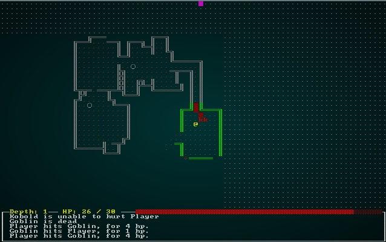

# Data-Driven Spawn Tables

---

***About this tutorial***

*This tutorial is free and open source, and all code uses the MIT license - so you are free to do with it as you like. My hope is that you will enjoy the tutorial, and make great games!*

*If you enjoy this and would like me to keep writing, please consider supporting [my Patreon](https://www.patreon.com/blackfuture).*

---

In the previous chapter, we moved spawning to be data-driven: you define your monsters, items and props in a JSON data file - and the spawn function becomes a parser that builds components based on your definitions. That gets you half-way to a data-driven world.

If you look at the ever-shrinking `spawner.rs` file, we have a hard-coded table for handling spawning:

```rust
fn room_table(map_depth: i32) -> RandomTable {
    RandomTable::new()
        .add("Goblin", 10)
        .add("Orc", 1 + map_depth)
        .add("Health Potion", 7)
        .add("Fireball Scroll", 2 + map_depth)
        .add("Confusion Scroll", 2 + map_depth)
        .add("Magic Missile Scroll", 4)
        .add("Dagger", 3)
        .add("Shield", 3)
        .add("Longsword", map_depth - 1)
        .add("Tower Shield", map_depth - 1)
        .add("Rations", 10)
        .add("Magic Mapping Scroll", 2)
        .add("Bear Trap", 5)
}
```

It's served us well for all these chapters, but sadly it's time to put it out to pasture. We'd like to be able to specify the spawn table in our JSON data - that way, we can add new entities to the data file and spawn list, and they appear in the game with no additional Rust coding (unless they need new features, in which case it's time to extend the engine).

## A JSON-based spawn table

Here's an example of how I'm envisioning our spawn table:

```json
"spawn_table" : [
    { "name" : "Goblin", "weight" : 10, "min_depth" : 0, "max_depth" : 100 }
],
```

So the `spawn_table` is an array, with each entry containing something that *can* be spawned. We're storing the *name* of the spawnable. We give it a *weight*, which corresponds to the same field in our current `RandomTable` structure. We've added a `min_depth` and `max_depth` - so this spawn line will only apply to a specified depth range of the dungeon.

That looks pretty good, so lets put all of our entities in:

```json
"spawn_table" : [
    { "name" : "Goblin", "weight" : 10, "min_depth" : 0, "max_depth" : 100 },
    { "name" : "Orc", "weight" : 1, "min_depth" : 0, "max_depth" : 100, "add_map_depth_to_weight" : true },
    { "name" : "Health Potion", "weight" : 7, "min_depth" : 0, "max_depth" : 100 },
    { "name" : "Fireball Scroll", "weight" : 2, "min_depth" : 0, "max_depth" : 100, "add_map_depth_to_weight" : true },
    { "name" : "Confusion Scroll", "weight" : 2, "min_depth" : 0, "max_depth" : 100, "add_map_depth_to_weight" : true },
    { "name" : "Magic Missile Scroll", "weight" : 4, "min_depth" : 0, "max_depth" : 100 },
    { "name" : "Dagger", "weight" : 3, "min_depth" : 0, "max_depth" : 100 },
    { "name" : "Shield", "weight" : 3, "min_depth" : 0, "max_depth" : 100 },
    { "name" : "Longsword", "weight" : 1, "min_depth" : 1, "max_depth" : 100 },
    { "name" : "Tower Shield", "weight" : 1, "min_depth" : 1, "max_depth" : 100 },
    { "name" : "Rations", "weight" : 10, "min_depth" : 0, "max_depth" : 100 },
    { "name" : "Magic Mapping Scroll", "weight" : 2, "min_depth" : 0, "max_depth" : 100 },
    { "name" : "Bear Trap", "weight" : 5, "min_depth" : 0, "max_depth" : 100 }
],
```

Notice that we've added `add_map_depth_to_weight` to allow us to indicate that things become more probable later on in the game. That lets us keep the variable weighting capability. We've also put *longsword* and *tower shield* only occurring after the first level.

That's pretty comprehensive (covers everything we have so far, and adds some capability), so lets make a new file `spawn_table_structs` in `raws` and define the classes required to read this data:

```rust
use serde::{Deserialize};
use super::{Renderable};

#[derive(Deserialize, Debug)]
pub struct SpawnTableEntry {
    pub name : String,
    pub weight : i32,
    pub min_depth: i32,
    pub max_depth: i32,
    pub add_map_depth_to_weight : Option<bool>
}
```

Open up `raws/mod.rs` and we'll add it to the `Raws` structure:

```rust
mod spawn_table_structs;
use spawn_table_structs::*;
...
#[derive(Deserialize, Debug)]
pub struct Raws {
    pub items : Vec<Item>,
    pub mobs : Vec<Mob>,
    pub props : Vec<Prop>,
    pub spawn_table : Vec<SpawnTableEntry>
}
```

We also need to add it to the constructor in `rawmaster.rs`:

```rust
pub fn empty() -> RawMaster {
    RawMaster {
        raws : Raws{ items: Vec::new(), mobs: Vec::new(), props: Vec::new(), spawn_table: Vec::new() },
        item_index : HashMap::new(),
        mob_index : HashMap::new(),
        prop_index : HashMap::new(),
    }
}
```

It's worth doing a quick `cargo run` now, just to be sure that the spawn table is loading without errors. It won't *do* anything yet, but it's always good to know that the data loads properly.

## Using the new spawn table

In `rawmaster.rs`, we're going to add a new function to build a random spawn table from our JSON data:

```rust
pub fn get_spawn_table_for_depth(raws: &RawMaster, depth: i32) -> RandomTable {
    use super::SpawnTableEntry;

    let available_options : Vec<&SpawnTableEntry> = raws.raws.spawn_table
        .iter()
        .filter(|a| depth >= a.min_depth && depth <= a.max_depth)
        .collect();
    
    let mut rt = RandomTable::new();
    for e in available_options.iter() {
        let mut weight = e.weight;
        if e.add_map_depth_to_weight.is_some() {
            weight += depth;
        }
        rt = rt.add(e.name.clone(), weight);
    }

    rt
}
```

This function is quite simple:

1. We obtain `raws.raws.spawn_table` - which is the master spawn table list.
2. We obtain an iterator with `iter()`.
3. We use `filter` to only include items that are within the requested map depth's range.
4. We `collect()` it into a vector of references to `SpawnTableEntry` lines.
5. We iterate all of the collected available options:
    1. We grab the weight.
    2. If the entry has an "add map depth to weight" requirement, we add that depth to that entry's weight.
    3. We add it to our `RandomTable`.

That's pretty straightforward! We can open up `spawner.rs` and modify our `RoomTable` function to use it:

```rust
fn room_table(map_depth: i32) -> RandomTable {
    get_spawn_table_for_depth(&RAWS.lock().unwrap(), map_depth)
}
```

Wow, that's a short function! It does the job, however. If you `cargo run` now, you'll be playing the game like before.

## Adding some sanity checks

We've now got the ability to add entities without touching our Rust code! Before we explore that, lets look at adding some "sanity checking" to the system to help avoid mistakes. We simply change the `load` function in `rawmaster.rs`:

```rust
pub fn load(&mut self, raws : Raws) {
    self.raws = raws;
    self.item_index = HashMap::new();
    let mut used_names : HashSet<String> = HashSet::new();
    for (i,item) in self.raws.items.iter().enumerate() {
        if used_names.contains(&item.name) {
            rltk::console::log(format!("WARNING -  duplicate item name in raws [{}]", item.name));
        }
        self.item_index.insert(item.name.clone(), i);
        used_names.insert(item.name.clone());
    }
    for (i,mob) in self.raws.mobs.iter().enumerate() {
        if used_names.contains(&mob.name) {
            rltk::console::log(format!("WARNING -  duplicate mob name in raws [{}]", mob.name));
        }
        self.mob_index.insert(mob.name.clone(), i);
        used_names.insert(mob.name.clone());
    }
    for (i,prop) in self.raws.props.iter().enumerate() {
        if used_names.contains(&prop.name) {
            rltk::console::log(format!("WARNING -  duplicate prop name in raws [{}]", prop.name));
        }
        self.prop_index.insert(prop.name.clone(), i);
        used_names.insert(prop.name.clone());
    }

    for spawn in self.raws.spawn_table.iter() {
        if !used_names.contains(&spawn.name) {
            rltk::console::log(format!("WARNING - Spawn tables references unspecified entity {}", spawn.name));
        }
    }
}
```

What are we doing here? We create `used_names` as a `HashSet`. Whenever we load something, we add it to the set. If it already exists? Then we've made a duplicate and bad things will happen - so we warn the user. Then we iterate the spawn table, and if we've references an entity name that hasn't been defined - we again warn the user.

These types of data-entry bugs are common, and won't actually crash the program. This sanity check ensures that we are at least warned about it before we proceed thinking that all is well. If you're paranoid (when programming, that's actually a good trait; there are plenty of people who *are* out to get you!), you could replace the `println!` with `panic!` and crash instead of just reminding the user. You may not want to do that if you like to `cargo run` often to see how you are doing!

## Benefitting from our data-driven architecture

Lets quickly add a new weapon and a new monster to the game. We can do this without touching the `Rust` code other than to recompile (embedding the changed file). In `spawns.json`, lets add a `Battleaxe` to the weapons list:

```json
{
    "name" : "Battleaxe",
    "renderable": {
        "glyph" : "¶",
        "fg" : "#FF55FF",
        "bg" : "#000000",
        "order" : 2
    },
    "weapon" : {
        "range" : "melee",
        "power_bonus" : 5
    }
},
```

We'll also add it into the spawn table:

```json
{ "name" : "Battleaxe", "weight" : 1, "min_depth" : 2, "max_depth" : 100 }
```

Let's also add a humble kobold. It's basically an even weaker goblin. We like kobolds, lets have lots of them!

```json
{
    "name" : "Kobold",
    "renderable": {
        "glyph" : "k",
        "fg" : "#FF0000",
        "bg" : "#000000",
        "order" : 1
    },
    "blocks_tile" : true,
    "stats" : {
        "max_hp" : 4,
        "hp" : 4,
        "defense" : 0,
        "power" : 2
    },
    "vision_range" : 4
}
```

So we'll also add this little critter to the spawn list:

```json
{ "name" : "Kobold", "weight" : 15, "min_depth" : 0, "max_depth" : 3 }
```
Notice that we make them *really* common - and stop harassing the player with them after level 3.

If you `cargo run` the project now, you'll find the new entities in the game:

.

## Wrap-Up

That's it for spawn tables! You've gained considerable power in these last two chapters - use it wisely. You can add in all manner of entities without having to write a line of Rust now, and could easily start to shape the game to what you want. In the next chapter, we'll begin doing just that.

**The source code for this chapter may be found [here](https://github.com/thebracket/rustrogueliketutorial/tree/master/chapter-46-raws2)**


[Run this chapter's example with web assembly, in your browser (WebGL2 required)](https://bfnightly.bracketproductions.com/rustbook/wasm/chapter-46-raws2)
---

Copyright (C) 2019, Herbert Wolverson.

---