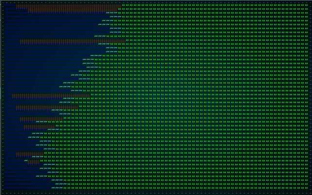
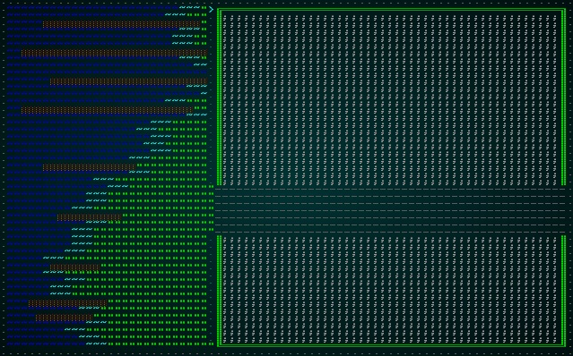
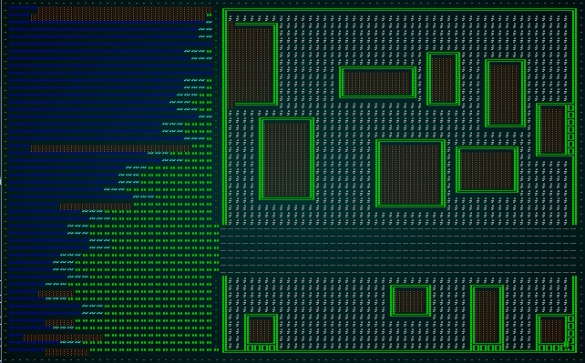
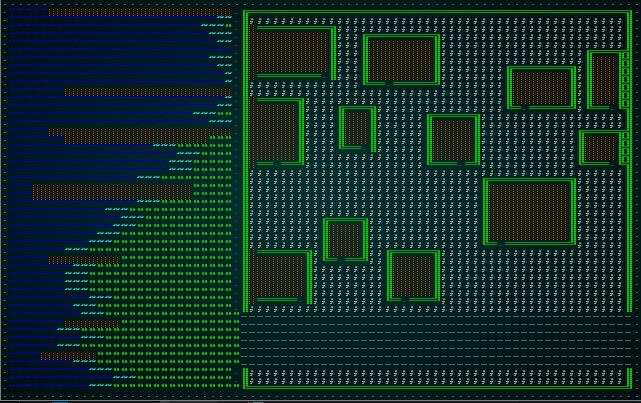
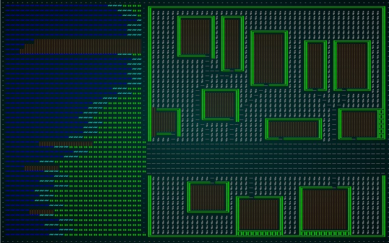
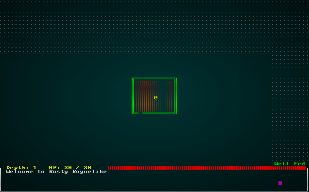

# Making the starting town

---

***About this tutorial***

*This tutorial is free and open source, and all code uses the MIT license - so you are free to do with it as you like. My hope is that you will enjoy the tutorial, and make great games!*

*If you enjoy this and would like me to keep writing, please consider supporting [my Patreon](https://www.patreon.com/blackfuture).*

---

## What is the town for?

Back in the [Design Document](./chapter_44.md) we decided: *The game starts in town. In town, there are only minimal enemies (pickpockets, thugs). You start in the to-be-named pub (tavern), armed only with a meager purse, minimal starting equipment, a stein of beer, a dried sausage, a backpack and a hangover. Town lets you visit various vendors.*

From a development point of view, this tells us a few things:

* The town has a *story* aspect, in that you start there and it ground the story - giving a starting point, a destiny (in this case a drunken promise to save the world). So the town implies a certain *cozy* starting point, implies some communication to help you understand *why* you are embarking on the life of an adventurer, and so on.
* The town has vendors. That won't make sense at this point, because we don't have a value/currency system - but we know that we need somewhere to put them.
* The town has a tavern/inn/pub - it's a starting location, but it's obviously important enough that it needs to *do* something!
* Elsewhere in the design document, we mention that you can *town portal* back to the settlement. This again implies a certain coziness/safety, and also implies that doing so is *useful* - so the services offered by the town need to retain their utility throughout the game.
* Finally, the town is the winning condition: once you've grabbed the Amulet of Yala - getting back to town lets you save the world. That implies that the town should have some sort of holy structure to which you have to return the amulet.
* The town is the first thing that new players will encounter - so it has to look alive and somewhat slick, or players will just close the window and try something else. It may also serve as a location for some tutorials.

This sort of discussion is essential to game design; you don't want to implement something just because you can (in most cases; big open world games relax that a bit). The town has a *purpose*, and that purpose guides its *design*.

## So what do we have to include in the town?

So that discussion lets us determine that the town must include:

* One or more merchants. We're not implementing the sale of goods yet, but they need a place to operate.
* Some friendly/neutral NPCs for color.
* A temple.
* A tavern.
* A place that town portals arrive.
* A way out to begin your adventure.

We can also think a little bit about what makes a town:

* There's generally a communication route (land or sea), otherwise the town won't prosper.
* Frequently, there's a market (surrounding villages use towns for commerce).
* There's almost certainly either a river or a deep natural water source.
* Towns typically have authority figures, visible at least as Guards or Watch.
* Towns also generally have a shady side.

## How do we want to generate our town?

We could go for a prefabricated town. This has the upside that the town can be tweaked until it's *just right*, and plays smoothly. It has the downside that getting out of the town becomes a purely mechanical step after the first couple of play-throughs ("runs"); look at Joppa in Caves of Qud - it became little more than a "grab the chest content, talk to these guys, and off you go" speed-bump start to an amazing game.

So - we want a procedurally generated town, but we want to keep it functional - and make it pretty. Not much to ask!

## Making some new tile types

From the above, it sounds like we are going to need some new tiles. The ones that spring to mind for a town are roads, grass, water (both deep and shallow), bridge, wooden floors, and building walls. One thing we can count on: we're going to add *lots* of new tile types as we progress, so we better take the time to make it a seamless experience up-front!

The `map.rs` could get quite complicated if we're not careful, so lets make it into its own module with a directory. We'll start by making a directory, `map/`. Then we'll move `map.rs` into it, and rename it `mod.rs`. Now, we'll take `TileType` out of `mod.rs` and put it into a new file - `tiletype.rs`:

```rust
use serde::{Serialize, Deserialize};

#[derive(PartialEq, Eq, Hash, Copy, Clone, Serialize, Deserialize)]
pub enum TileType {
    Wall, Floor, DownStairs
}
```

And in `mod.rs` we'll accept the module and share the public types it exposes:

```rust
mod tiletype;
pub use tiletype::TileType;
```

This hasn't gained us much yet... but now we can start supporting the various tile types. As we add functionality, you'll hopefully see why using a separate file makes it easier to find the relevant code:

```rust
#[derive(PartialEq, Eq, Hash, Copy, Clone, Serialize, Deserialize)]
pub enum TileType {
    Wall, 
    Floor, 
    DownStairs,
    Road,
    Grass,
    ShallowWater,
    DeepWater,
    WoodFloor,
    Bridge
}
```

This is only part of the picture, because now we need to handle a bunch of grunt-work: can you enter tiles of that type, do they block visibility, do they have a different cost for path-finding, and so on. We've also done a lot of "spawn if its a floor" code in our map builders; maybe that wasn't such a good idea if you can have multiple floor types? Anyway, the current `map.rs` provides some of what we need in order to satisfy the `BaseMap` trait for RLTK.

We'll make a few functions to help satisfy this requirement, while keeping our tile functionality in one place:

```rust
pub fn tile_walkable(tt : TileType) -> bool {
    match tt {
        TileType::Floor | TileType::DownStairs | TileType::Road | TileType::Grass |
        TileType::ShallowWater | TileType::WoodFloor | TileType::Bridge 
            => true,
        _ => false        
    }
}

pub fn tile_opaque(tt : TileType) -> bool {
    match tt {
        TileType::Wall => true,
        _ => false
    }
}
```

Now we'll go back into `mod.rs`, and import these - and make them public to anyone who wants them:

```rust
mod tiletype;
pub use tiletype::{TileType, tile_walkable, tile_opaque};
```

We also need to update some of our functions to use this functionality. We determine a lot of path-finding with the `blocked` system, so we need to update `populate_blocked` to handle the various types using the functions we just made:

```rust
pub fn populate_blocked(&mut self) {        
    for (i,tile) in self.tiles.iter_mut().enumerate() {
        self.blocked[i] = !tile_walkable(*tile);
    }
}
```

We also need to update our visibility determination code:

```rust
impl BaseMap for Map {
    fn is_opaque(&self, idx:i32) -> bool {
        let idx_u = idx as usize;
        if idx_u > 0 && idx_u < self.tiles.len() {
            tile_opaque(self.tiles[idx_u]) || self.view_blocked.contains(&idx_u)
        } else {
            true
        }
    }
    ...
```

Lastly, lets look at `get_available_exits`. This uses the blocked system to determine if an exit is *possible*, but so far we've hard-coded all of our costs. When there is just a floor and a wall to choose from, it is a pretty easy choice after all! Once we start offering choices, we might want to encourage certain behaviors. It would certainly look more realistic if people preferred to travel on the road than the grass, and *definitely* more realistic if they avoid standing in shallow water unless they need to. So we'll build a *cost* function (in `tiletype.rs`):

```rust
pub fn tile_cost(tt : TileType) -> f32 {
    match tt {
        TileType::Road => 0.8,
        TileType::Grass => 1.1,
        TileType::ShallowWater => 1.2,
        _ => 1.0
    }
}
```

Then we update our `get_available_exits` to use it:

```rust
fn get_available_exits(&self, idx:i32) -> Vec<(i32, f32)> {
    let mut exits : Vec<(i32, f32)> = Vec::new();
    let x = idx % self.width;
    let y = idx / self.width;
    let tt = self.tiles[idx as usize];

    // Cardinal directions
    if self.is_exit_valid(x-1, y) { exits.push((idx-1, tile_cost(tt))) };
    if self.is_exit_valid(x+1, y) { exits.push((idx+1, tile_cost(tt))) };
    if self.is_exit_valid(x, y-1) { exits.push((idx-self.width, tile_cost(tt))) };
    if self.is_exit_valid(x, y+1) { exits.push((idx+self.width, tile_cost(tt))) };

    // Diagonals
    if self.is_exit_valid(x-1, y-1) { exits.push(((idx-self.width)-1, tile_cost(tt) * 1.45)); }
    if self.is_exit_valid(x+1, y-1) { exits.push(((idx-self.width)+1, tile_cost(tt) * 1.45)); }
    if self.is_exit_valid(x-1, y+1) { exits.push(((idx+self.width)-1, tile_cost(tt) * 1.45)); }
    if self.is_exit_valid(x+1, y+1) { exits.push(((idx+self.width)+1, tile_cost(tt) * 1.45)); }

    exits
}
```
We've replaced all the costs of `1.0` with a call to our `tile_cost` function, and multiplied diagonals by 1.45 to encourage more natural looking movement.

## Fixing our camera

We also need to be able to render these tile types, so we open up `camera.rs` and add them to the `match` statement in `get_tile_glyph`:

```rust
fn get_tile_glyph(idx: usize, map : &Map) -> (u8, RGB, RGB) {
    let glyph;
    let mut fg;
    let mut bg = RGB::from_f32(0., 0., 0.);

    match map.tiles[idx] {
        TileType::Floor => { glyph = rltk::to_cp437('.'); fg = RGB::from_f32(0.0, 0.5, 0.5); }
        TileType::WoodFloor => { glyph = rltk::to_cp437('.'); fg = RGB::named(rltk::CHOCOLATE); }
        TileType::Wall => {
            let x = idx as i32 % map.width;
            let y = idx as i32 / map.width;
            glyph = wall_glyph(&*map, x, y);
            fg = RGB::from_f32(0., 1.0, 0.);
        }
        TileType::DownStairs => { glyph = rltk::to_cp437('>'); fg = RGB::from_f32(0., 1.0, 1.0); }
        TileType::Bridge => { glyph = rltk::to_cp437('.'); fg = RGB::named(rltk::CHOCOLATE); }
        TileType::Road => { glyph = rltk::to_cp437('~'); fg = RGB::named(rltk::GRAY); }
        TileType::Grass => { glyph = rltk::to_cp437('"'); fg = RGB::named(rltk::GREEN); }
        TileType::ShallowWater => { glyph = rltk::to_cp437('≈'); fg = RGB::named(rltk::CYAN); }
        TileType::DeepWater => { glyph = rltk::to_cp437('≈'); fg = RGB::named(rltk::NAVY_BLUE); }
    }
    if map.bloodstains.contains(&idx) { bg = RGB::from_f32(0.75, 0., 0.); }
    if !map.visible_tiles[idx] { 
        fg = fg.to_greyscale();
        bg = RGB::from_f32(0., 0., 0.); // Don't show stains out of visual range
    }

    (glyph, fg, bg)
}
```

## Starting to build our town

We want to stop making maps randomly, and instead start being a bit predictable in what we make. So when you start depth 1, you *always* get a town. In `map_builders/mod.rs`, we'll make a new function. For now, it'll just fall back to being random:

```rust
pub fn level_builder(new_depth: i32, rng: &mut rltk::RandomNumberGenerator, width: i32, height: i32) -> BuilderChain {
    random_builder(new_depth, rng, width, height)
}
```

Pop over to `main.rs` and change the builder function call to use our new function:

```rust
fn generate_world_map(&mut self, new_depth : i32) {
    self.mapgen_index = 0;
    self.mapgen_timer = 0.0;
    self.mapgen_history.clear();
    let mut rng = self.ecs.write_resource::<rltk::RandomNumberGenerator>();
    let mut builder = map_builders::level_builder(new_depth, &mut rng, 80, 50);
    ...
```

Now, we'll start fleshing out our `level_builder`; we want depth 1 to generate a town map - otherwise, we'll stick with random for now. We *also* want it to be obvious via a `match` statement how we're routing each level's procedural generation:

```rust
pub fn level_builder(new_depth: i32, rng: &mut rltk::RandomNumberGenerator, width: i32, height: i32) -> BuilderChain {
    println!("Depth: {}", new_depth);
    match new_depth {
        1 => town_builder(new_depth, rng, width, height),
        _ => random_builder(new_depth, rng, width, height)
    }
}
```

At the top of the `mod.rs` file, add:

```rust
mod town;
use town::town_builder;
```

And in a new file, `map_builders/town.rs` we'll begin our function:

```rust
use super::BuilderChain;

pub fn level_builder(new_depth: i32, rng: &mut rltk::RandomNumberGenerator, width: i32, height: i32) -> BuilderChain {
    let mut chain = BuilderChain::new(new_depth, width, height);
    chain.start_with(TownBuilder::new());
    let (start_x, start_y) = super::random_start_position(rng);
    chain.with(AreaStartingPosition::new(start_x, start_y));
    chain.with(DistantExit::new());
    chain
}
```

The `AreaStartingPosition` and `DistantExit` are temporary to get us valid start/end points. The meat is the call to `TownBuilder`. We haven't written that yet, so we'll work through step-by-step until we have a town we like!

Here's an empty skeleton to start with:

```rust
pub struct TownBuilder {}

impl InitialMapBuilder for TownBuilder {
    #[allow(dead_code)]
    fn build_map(&mut self, rng: &mut rltk::RandomNumberGenerator, build_data : &mut BuilderMap) {
        self.build_rooms(rng, build_data);
    }
}

impl TownBuilder {
    pub fn new() -> Box<TownBuilder> {
        Box::new(TownBuilder{})
    }

    pub fn build_rooms(&mut self, rng: &mut rltk::RandomNumberGenerator, build_data : &mut BuilderMap) {
    }
}
```

## Let's make a fishing town

Let's start by adding grass, water and piers to the region. We'll write the skeleton first:

```rust
pub fn build_rooms(&mut self, rng: &mut rltk::RandomNumberGenerator, build_data : &mut BuilderMap) {
        self.grass_layer(build_data);
        self.water_and_piers(rng, build_data);

        // Make visible for screenshot
        for t in build_data.map.visible_tiles.iter_mut() {
            *t = true;
        }
        build_data.take_snapshot();
    }
```

The function `grass_layer` is *really* simple: we replace everything with grass:

```rust
fn grass_layer(&mut self, build_data : &mut BuilderMap) {
    // We'll start with a nice layer of grass
    for t in build_data.map.tiles.iter_mut() {
        *t = TileType::Grass;
    }
    build_data.take_snapshot();
}
```

Adding water is more interesting. We don't want it to be the same each time, but we want to keep the same basic structure. Here's the code:

```rust
fn water_and_piers(&mut self, rng: &mut rltk::RandomNumberGenerator, build_data : &mut BuilderMap) {
    let mut n = (rng.roll_dice(1, 65535) as f32) / 65535f32;
    let mut water_width : Vec<i32> = Vec::new();
    for y in 0..build_data.height {
        let n_water = (f32::sin(n) * 10.0) as i32 + 14 + rng.roll_dice(1, 6);
        water_width.push(n_water);
        n += 0.1;
        for x in 0..n_water {
            let idx = build_data.map.xy_idx(x, y);
            build_data.map.tiles[idx] = TileType::DeepWater;
        }
        for x in n_water .. n_water+3 {
            let idx = build_data.map.xy_idx(x, y);
            build_data.map.tiles[idx] = TileType::ShallowWater;
        }
    }
    build_data.take_snapshot();

    // Add piers
    for _i in 0..rng.roll_dice(1, 4)+6 {
        let y = rng.roll_dice(1, build_data.height)-1;
        for x in 2 + rng.roll_dice(1, 6) .. water_width[y as usize] + 4 {
            let idx = build_data.map.xy_idx(x, y);
            build_data.map.tiles[idx] = TileType::WoodFloor;
        }
    }
    build_data.take_snapshot();
}
```

There's quite a bit going on here, so we'll step through:

1. We make `n` equal to a random floating point number between `0.0` and `1.0` by rolling a 65,535 sided dice (wouldn't it be nice if one of those existed?) and dividing by the maximum number.
2. We make a new vector called `water_width`. We'll store the number of water tiles on each row in here as we generate them.
3. For each `y` row down the map:
    1. We make `n_water`. This is the number of water tiles present. We start by taking the `sin` (Sine) of `n` (we randomized it to give a random gradient). Sin waves are great, they give a nice predictable curve and you can read anywhere along them to determine where the curve is. Since `sin` gives a number from -1 to 1, we multiply by 10 to give -10 to +10. We then add 14, guaranteeing between 4 and 24 tiles of water. To make it look jagged, we add a little bit of randomness also.
    2. We `push` this into the `water_width` vector, storing it for later.
    3. We add `0.1` to `n`, progressing along the sine wave.
    4. Then we iterate from 0 to `n_water` (as `x`) and write `DeepWater` tiles to the position of each water tile.
    5. We go from `n_water` to `n_water+3` to add some shallow water at the edge.
4. We take a snapshot so you can watch the map progression.
5. We iterate from 0 to 1d4+6 to generate between 10 and 14 piers.
    1. We pick `y` at random.
    2. We look up the water placement for that `y` value, and draw wooden floors starting at 2+1d6 to `water_width[y]+4` - giving a pier that extends out into the water for some way, and ends squarely on land.

If you `cargo run`, you'll see a map like this now:



## Adding town walls, gravel and a road

Now that we have some terrain, we should add some initial outline to the town. Extend the `build` function with another function call:

```rust
let (mut available_building_tiles, wall_gap_y) = self.town_walls(rng, build_data);
```

The function looks like this:

```rust
fn town_walls(&mut self, rng: &mut rltk::RandomNumberGenerator, build_data : &mut BuilderMap) 
    -> (HashSet<usize>, i32) 
{
    let mut available_building_tiles : HashSet<usize> = HashSet::new();
    let wall_gap_y = rng.roll_dice(1, build_data.height - 9) + 5;
    for y in 1 .. build_data.height-2 {
        if !(y > wall_gap_y-4 && y < wall_gap_y+4)  {
            let idx = build_data.map.xy_idx(30, y);
            build_data.map.tiles[idx] = TileType::Wall;
            build_data.map.tiles[idx-1] = TileType::Floor;
            let idx_right = build_data.map.xy_idx(build_data.width - 2, y);
            build_data.map.tiles[idx_right] = TileType::Wall;
            for x in 31 .. build_data.width-2 {
                let gravel_idx = build_data.map.xy_idx(x, y);
                build_data.map.tiles[gravel_idx] = TileType::Gravel;
                if y > 2 && y < build_data.height-1 {
                    available_building_tiles.insert(gravel_idx);
                }
            }
        } else {
            for x in 30 .. build_data.width {
                let road_idx = build_data.map.xy_idx(x, y);
                build_data.map.tiles[road_idx] = TileType::Road;
            }
        }
    }
    build_data.take_snapshot();

    for x in 30 .. build_data.width-1 {
        let idx_top = build_data.map.xy_idx(x, 1);
        build_data.map.tiles[idx_top] = TileType::Wall;
        let idx_bot = build_data.map.xy_idx(x, build_data.height-2);
        build_data.map.tiles[idx_bot] = TileType::Wall;
    }
    build_data.take_snapshot();

    (available_building_tiles, wall_gap_y)
}
```
Again, let's step through how this works:

1. We make a new `HashSet` called `available_building_tiles`. We'll be returning this so that other functions can use it later.
2. We set `wall_gap_y` to be a random `y` location on the map, between 6 and `map.height - 8`. We'll use this for the location of the road that runs through the town, and gates in the city walls.
3. We iterate the `y` axis on the map, skipping the very top and bottom-most tiles.
    1. If `y` is outside of the "wall gap" (8 tiles centered on `wall_gap_y`):
        1. We draw a wall tile at location `30,y` and a road at `29,y`. This gives a wall after the shore, and a clear gap in front of it (clearly they have lawn management employees!)
        2. We also draw a wall at the far east of the map.
        3. We fill the intervening area with gravel.
        4. For tiles that gained gravel, we add them to the `available_building_tiles` set.
    2. If it is *in* the gap, we draw a road.
4. Lastly we fill rows `1` and `height-2` with walls between 30 and `width-2`.

If you `cargo run` now, you have the outline of a town:



## Adding some buildings

A town without buildings is both rather pointless and rather unusual! So let's add some. We'll add another call to the builder function, this time passing the `available_building_tiles` structure we created:

```rust
let mut buildings = self.buildings(rng, build_data, &mut available_building_tiles);
```

The meat of the buildings code looks like this:

```rust
fn buildings(&mut self, 
    rng: &mut rltk::RandomNumberGenerator, 
    build_data : &mut BuilderMap, 
    available_building_tiles : &mut HashSet<usize>) 
-> Vec<(i32, i32, i32, i32)> 
{
    let mut buildings : Vec<(i32, i32, i32, i32)> = Vec::new();
    let mut n_buildings = 0;        
    while n_buildings < 12 {
        let bx = rng.roll_dice(1, build_data.map.width - 32) + 30;
        let by = rng.roll_dice(1, build_data.map.height)-2;
        let bw = rng.roll_dice(1, 8)+4;
        let bh = rng.roll_dice(1, 8)+4;
        let mut possible = true;
        for y in by .. by+bh {
            for x in bx .. bx+bw {
                if x < 0 || x > build_data.width-1 || y < 0 || y > build_data.height-1 {
                    possible = false;
                } else {
                    let idx = build_data.map.xy_idx(x, y);
                    if !available_building_tiles.contains(&idx) { possible = false; }
                }
            }
        }
        if possible {
            n_buildings += 1;
            buildings.push((bx, by, bw, bh));
            for y in by .. by+bh {
                for x in bx .. bx+bw {
                    let idx = build_data.map.xy_idx(x, y);
                    build_data.map.tiles[idx] = TileType::WoodFloor;
                    available_building_tiles.remove(&idx);
                    available_building_tiles.remove(&(idx+1));
                    available_building_tiles.remove(&(idx+build_data.width as usize));
                    available_building_tiles.remove(&(idx-1));
                    available_building_tiles.remove(&(idx-build_data.width as usize));
                }
            }
            build_data.take_snapshot();
        }
    }

    // Outline buildings
    let mut mapclone = build_data.map.clone();
    for y in 2..build_data.height-2 {
        for x in 32..build_data.width-2 {
            let idx = build_data.map.xy_idx(x, y);
            if build_data.map.tiles[idx] == TileType::WoodFloor {
                let mut neighbors = 0;
                if build_data.map.tiles[idx - 1] != TileType::WoodFloor { neighbors +=1; }
                if build_data.map.tiles[idx + 1] != TileType::WoodFloor { neighbors +=1; }
                if build_data.map.tiles[idx-build_data.width as usize] != TileType::WoodFloor { neighbors +=1; }
                if build_data.map.tiles[idx+build_data.width as usize] != TileType::WoodFloor { neighbors +=1; }
                if neighbors > 0 {
                    mapclone.tiles[idx] = TileType::Wall;
                }
            }
        }
    }
    build_data.map = mapclone;
    build_data.take_snapshot();
    buildings
}
```

Once again, lets walk through this algorithm:

1. We make a vector of tuples, each containing 4 integers. These are the building's `x` and `y` coordinates, along with its size in each dimension.
2. We make a variable `n_buildings` to store how many we've placed, and loop until we have 12. For each building:
    1. We pick a random `x` and `y` position, and a random `width` and `height` for the building.
    2. We set `possible` to `true` - and then loop over every tile in the candidate building location. If it isn't in the `available_building_tiles` set, we set `possible to false`.
    3. If `possible` is still true, we again loop over every tile - setting to be a `WoodenFloor`. We then remove that tile, and all four surrounding tiles from the `available_building_tiles` list - ensuring a gap between buildings. We also increment `n_buildings`, and add the building to a list of completed buildings.
3. Now we have 12 buildings, we take a copy of the map.
4. We loop over every tile on in the "town" part of the map.
    1. For each tile, we count the number of neighboring tiles that *aren't* a `WoodenFloor` (in all four directions).
    2. If the neighboring tile count is greater than zero, then we can place a wall here (because it must be the edge of a building). We write to our *copy* of the map - so as not to influence the check on subsequent tiles (otherwise, you'll have buildings replaced with walls).
5. We put the copy back into our map.
6. We return out list of placed buildings.

If you `cargo run` now, you'll see that we have buildings!



## Adding some doors

The buildings are great, but there are *no doors*. So you can't ever enter or exit them. We should fix that. Extend the builder function with another call:

```rust
let doors = self.add_doors(rng, build_data, &mut buildings, wall_gap_y);
```

The `add_doors` function looks like this:

```rust
fn add_doors(&mut self, 
    rng: &mut rltk::RandomNumberGenerator, 
    build_data : &mut BuilderMap, 
    buildings: &mut Vec<(i32, i32, i32, i32)>, 
    wall_gap_y : i32) 
    -> Vec<usize>
{
    let mut doors = Vec::new();
    for building in buildings.iter() {
        let door_x = building.0 + 1 + rng.roll_dice(1, building.2 - 3);
        let cy = building.1 + (building.3 / 2);
        let idx = if cy > wall_gap_y {
            // Door on the north wall
            build_data.map.xy_idx(door_x, building.1)
        } else {
            build_data.map.xy_idx(door_x, building.1 + building.3 - 1)
        };
        build_data.map.tiles[idx] = TileType::Floor;
        build_data.spawn_list.push((idx, "Door".to_string()));
        doors.push(idx);
    }
    build_data.take_snapshot();
    doors
}
```

This function is quite simple, but we'll step through it:

1. We make a new vector of door locations; we'll need it later.
2. For each building in our buildings list:
    1. Set `door_x` to a random point along the building's horizontal side, not including the corners.
    2. Calculate `cy` to be the center of the building.
    3. If `cy > wall_gap_y` (remember that one? Where the road is!), we place the door's `y` coordinate on the North side - so `building.1`. Otherwise, we place it on the south side - `building.1 + building.3 - 1` (`y` location plus height, minus one).
    4. We set the door tile to be a `Floor`.
    5. We add a `Door` to the spawn list.
    6. We add the door to the doors vector.
3. We return the doors vector.

If you `cargo run` now, you'll see doors appear for each building:



## Paths to doors

It would be nice to decorate the gravel with some paths to the various doors in the town. It makes sense - even wear and tear from walking to/from the buildings will erode a path. So we add another call to the builder function:

```rust
self.add_paths(build_data, &doors);
```

The `add_paths` function is a little long, but quite simple:

```rust
fn add_paths(&mut self,         
    build_data : &mut BuilderMap,
    doors : &[usize])
{
    let mut roads = Vec::new();
    for y in 0..build_data.height {
        for x in 0..build_data.width {
            let idx = build_data.map.xy_idx(x, y);
            if build_data.map.tiles[idx] == TileType::Road {
                roads.push(idx);
            }
        }
    }

    build_data.map.populate_blocked();
    for door_idx in doors.iter() {
        let mut nearest_roads : Vec<(usize, f32)> = Vec::new();
        let door_pt = rltk::Point::new( *door_idx as i32 % build_data.map.width as i32, *door_idx as i32 / build_data.map.width as i32 );
        for r in roads.iter() {
            nearest_roads.push((
                *r,
                rltk::DistanceAlg::PythagorasSquared.distance2d(
                    door_pt,
                    rltk::Point::new( *r as i32 % build_data.map.width, *r as i32 / build_data.map.width )
                )
            ));
        }
        nearest_roads.sort_by(|a,b| a.1.partial_cmp(&b.1).unwrap());

        let destination = nearest_roads[0].0;
        let path = rltk::a_star_search(*door_idx as i32, destination as i32, &mut build_data.map);
        if path.success {
            for step in path.steps.iter() {
                let idx = *step as usize;
                build_data.map.tiles[idx] = TileType::Road;
                roads.push(idx);
            }
        }
        build_data.take_snapshot();
    }
}
```

Let's walk through this:

1. We start by making a `roads` vector, storing the map indices of every road tile on the map. We gather this by quickly scanning the map and adding matching tiles to our list.
2. Then we iterate through all the doors we've placed:
    1. We make another vector (`nearest_roads`) containing an index and a float.
    2. We add each road, with its index and the calculated distance to the door.
    3. We sort the `nearest_roads` vector by the distances, ensuring that element `0` will be the closest road position. Not that we're doing this for each door: if the nearest road is one we've added to another door, it will choose that one.
    4. We call RLTK's *a star* pathing to find a route from the door to the nearest road.
    5. We iterate the path, writing a road tile at each location on the route. We also add it to the `roads` vector, so it will influence future paths.

If you `cargo run` now, you'll see a pretty decent start for a town:



## Start position and exit

We don't really want completely random start positions, nor an exit that is deliberately far away on this map. So we'll edit our `TownBuilder` constructor to remove the additional meta-builders that provide this:

```rust
pub fn town_builder(new_depth: i32, rng: &mut rltk::RandomNumberGenerator, width: i32, height: i32) -> BuilderChain {
    let mut chain = BuilderChain::new(new_depth, width, height);
    chain.start_with(TownBuilder::new());
    chain
}
```

Now we have to modify our `build` function to provide these instead. Placing the exit is easy - we want it to be to the East, on the road:

```rust
let exit_idx = build_data.map.xy_idx(build_data.width-5, wall_gap_y);
build_data.map.tiles[exit_idx] = TileType::DownStairs;
```

Placing the entrance is more difficult. We want the player to start their journey in the pub - but we haven't decided which building *is* the pub! We'll make the pub the largest building on the map. After all, it's the most important for the game! The following code will sort the buildings by size (in a `building_size` vector, with the first tuple element being the building's index and the second being it's "square tileage"):

```rust
let mut building_size : Vec<(usize, i32)> = Vec::new();
for (i,building) in buildings.iter().enumerate() {
    building_size.push((
        i,
        building.2 * building.3
    ));
}
building_size.sort_by(|a,b| b.1.cmp(&a.1));
```

Not that we sorted in *descending* order (by doing `b.cmp(&a)` rather than the other way around) - so the largest building is building `0`.

Now we can set the player's starting location:

```rust
// Start in the pub
let the_pub = &buildings[building_size[0].0];
build_data.starting_position = Some(Position{
    x : the_pub.0 + (the_pub.2 / 2),
    y : the_pub.1 + (the_pub.3 / 2)
});
```

If you `cargo run` now, you'll start in the pub - and be able to navigate an empty town to the exit:



## Wrap-Up

This chapter has walked through how to use what we know about map generation to make a *targeted* procedural generation project - a fishing town. There's a river to the west, a road, town walls, buildings, and paths. It doesn't look bad at all for a starting point!

It is completely devoid of NPCs, props and anything to do. We'll rectify that in the next chapter.

**The source code for this chapter may be found [here](https://github.com/thebracket/rustrogueliketutorial/tree/master/chapter-47-town1)**


[Run this chapter's example with web assembly, in your browser (WebGL2 required)](http://bfnightly.bracketproductions.com/rustbook/wasm/chapter-47-town1)
---

Copyright (C) 2019, Herbert Wolverson.

---