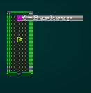
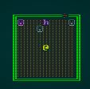
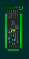

# Populating the starting town

---

***About this tutorial***

*This tutorial is free and open source, and all code uses the MIT license - so you are free to do with it as you like. My hope is that you will enjoy the tutorial, and make great games!*

*If you enjoy this and would like me to keep writing, please consider supporting [my Patreon](https://www.patreon.com/blackfuture).*

---

In the previous chapter, we built the layout of our town. In this chapter, we'll populate it with NPCs and Props. We'll introduce some new AI types to handle friendly or neutral NPCs, and begin placing merchants, townsfolk and other residents to make the town come alive. We'll also begin placing furniture and items to make the place feel less barren.

## Identifying the buildings

We're not making a real, full-sized down. There would be potentially hundreds of buildings, and the player would quickly grow bored trying to find the exit. Instead - we have 12 buildings. Looking at our design document, two of them are important:

* The Pub.
* The Temple.

That leaves 10 other locations that aren't really relevant, but we've implied that they will include vendors. Brainstorming a few vendors, it would make sense to have:

* A Blacksmith (for your weapon/armor needs).
* A clothier (for clothes, leather, and similar).
* An alchemist for potions, magical items and item identification.

So we're down to 5 more locations to fill! Lets make three of them into regular homes with residents, one into your house - complete with a nagging mother, and one into an abandoned house with a rodent issue. Rodent problems are a staple of fantasy games, and it might make for a good tutorial when we get that far.

You'll remember that we sorted our buildings by size, and decided that the largest is the pub. Let's extend that to tag each building. In `map_builders/town.rs`, look at the `build` function and we'll expand the building sorter. First, lets make an `enum` for our building types:

```rust
enum BuildingTag {
    Pub, Temple, Blacksmith, Clothier, Alchemist, PlayerHouse, Hovel, Abandoned, Unassigned
}
```

Next, we'll move our building sorter code into its own function (as part of `TownBuilder`):

```rust
fn sort_buildings(&mut self, buildings: &[(i32, i32, i32, i32)]) -> Vec<(usize, i32, BuildingTag)> 
{
    let mut building_size : Vec<(usize, i32, BuildingTag)> = Vec::new();
    for (i,building) in buildings.iter().enumerate() {
        building_size.push((
            i,
            building.2 * building.3,
            BuildingTag::Unassigned
        ));
    }
    building_size.sort_by(|a,b| b.1.cmp(&a.1));
    building_size[0].2 = BuildingTag::Pub;
    building_size[1].2 = BuildingTag::Temple;
    building_size[2].2 = BuildingTag::Blacksmith;
    building_size[3].2 = BuildingTag::Clothier;
    building_size[4].2 = BuildingTag::Alchemist;
    building_size[5].2 = BuildingTag::PlayerHouse;
    for b in building_size.iter_mut().skip(6) {
        b.2 = BuildingTag::Hovel;
    }
    let last_index = building_size.len()-1;
    building_size[last_index].2 = BuildingTag::Abandoned;
    building_size
}
```

This is the code we had before, with added `BuildingTag` entries. Once we've sorted by size, we assign the various building types - with the last one always being the abandoned house. This will ensure that we have all of our building types, and they are sorted in descending size order.

In the `build` function, replace your sort code with a call to the function - and a call to `building_factory`, which we'll write in a moment:

```rust
let building_size = self.sort_buildings(&buildings);
self.building_factory(rng, build_data, &buildings, &building_size);
```

Now we'll build a skeletal factory:

```rust
fn building_factory(&mut self, 
    rng: &mut rltk::RandomNumberGenerator, 
    build_data : &mut BuilderMap, 
    buildings: &[(i32, i32, i32, i32)], 
    building_index : &[(usize, i32, BuildingTag)]) 
{
    for (i,building) in buildings.iter().enumerate() {
        let build_type = &building_index[i].2;
        match build_type {
            _ => {}
        }
    }
}
```

## The Pub

So what would you expect to find in a pub early in the morning, when you awaken hung-over and surprised to discover that you've promised to save the world? A few ideas spring to mind:

* Other hung-over patrons, possibly asleep.
* A shady-as-can-be "lost" goods salesperson.
* A Barkeep, who probably wants you to go home.
* Tables, chairs, barrels.

We'll extend our factory function to have a `match` line to build the pub:

```rust
fn building_factory(&mut self, 
        rng: &mut rltk::RandomNumberGenerator, 
        build_data : &mut BuilderMap, 
        buildings: &[(i32, i32, i32, i32)], 
        building_index : &[(usize, i32, BuildingTag)]) 
    {
        for (i,building) in buildings.iter().enumerate() {
            let build_type = &building_index[i].2;
            match build_type {
                BuildingTag::Pub => self.build_pub(&building, build_data, rng),
                _ => {}
            }
        }
    }
```

And we'll start on the new function `build_pub`:

```rust
fn build_pub(&mut self, 
    building: &(i32, i32, i32, i32), 
    build_data : &mut BuilderMap, 
    rng: &mut rltk::RandomNumberGenerator) 
{
    // Place the player
    build_data.starting_position = Some(Position{
        x : building.0 + (building.2 / 2),
        y : building.1 + (building.3 / 2)
    });
    let player_idx = build_data.map.xy_idx(building.0 + (building.2 / 2), 
        building.1 + (building.3 / 2));

    // Place other items
    let mut to_place : Vec<&str> = vec!["Barkeep", "Shady Salesman", "Patron", "Patron", "Keg",
        "Table", "Chair", "Table", "Chair"];
    for y in building.1 .. building.1 + building.3 {
        for x in building.0 .. building.0 + building.2 {
            let idx = build_data.map.xy_idx(x, y);
            if build_data.map.tiles[idx] == TileType::WoodFloor && idx != player_idx && rng.roll_dice(1, 3)==1 && !to_place.is_empty() {
                let entity_tag = to_place[0];
                to_place.remove(0);
                build_data.spawn_list.push((idx, entity_tag.to_string()));
            }
        }
    }
}
```

Let's walk through this:

1. The function takes our building data, map information and random number generator as parameters.
2. Since we always start the player in the pub, we do that here. We can remove it from the `build` function.
3. We store the `player_idx` - we don't want to spawn anything on top of the player.
4. We make `to_place` - a list of string tags that we want in the bar. We'll worry about writing these in a bit.
5. We iterate `x` and `y` across the whole building.
    1. We calculate the map index of the building tile.
    2. If the building tile is a wooden floor, the map index is not the player map index, and a 1d3 roll comes up 1, we:
        1. Take the first tag from the `to_place` list, and remove it from the list (no duplicates unless we put it in twice).
        2. Add that tag to the `spawn_list` for the map, using the current tile tag.

That's pretty simple, and also parts are definitely generic enough to help with future buildings. If you were to run the project now, you'll see error messages such as: `WARNING: We don't know how to spawn [Barkeep]!`. That's because we haven't written them, yet. We need `spawns.json` to include all of the tags we're trying to spawn.

### Making non-hostile NPCs

Let's add an entry into `spawns.json` for our Barkeep. We'll introduce one new element - the `ai`:

```json
"mobs" : [
    {
        "name" : "Barkeep",
        "renderable": {
            "glyph" : "☺",
            "fg" : "#EE82EE",
            "bg" : "#000000",
            "order" : 1
        },
        "blocks_tile" : true,
        "stats" : {
            "max_hp" : 16,
            "hp" : 16,
            "defense" : 1,
            "power" : 4
        },
        "vision_range" : 4,
        "ai" : "bystander"
    },
```

To support the AI element, we need to open up `raws/mob_structs.rs` and edit `Mob`:

```rust
#[derive(Deserialize, Debug)]
pub struct Mob {
    pub name : String,
    pub renderable : Option<Renderable>,
    pub blocks_tile : bool,
    pub stats : MobStats,
    pub vision_range : i32,
    pub ai : String
}
```

We'll also need to add `"ai" : "melee"` to each other mob. Now open `raws/rawmaster.rs`, and we'll edit `spawn_named_mob` to support it. Replace the line `eb = eb.with(Monster{});` with:

```rust
match mob_template.ai.as_ref() {
    "melee" => eb = eb.with(Monster{}),
    "bystander" => eb = eb.with(Bystander{}),
    _ => {}
}
```

`Bystander` is a new component - so we need to open up `components.rs` and add it:

```rust
#[derive(Component, Debug, Serialize, Deserialize, Clone)]
pub struct Bystander {}
```

Then don't forget to register it in `main.rs` and `saveload_system.rs`!

If you `cargo run` now, you should see a smiling barkeep. He's resplendent in Purple (RGB `#EE82EE` from the JSON). Why purple? We're going to make vendors purple eventually (vendors are for a future chapter):



He won't react to you or *do* anything, but he's there. We'll add some behavior later in the chapter. For now, lets go ahead and add some other entities to `spawns.json` now that we support innocent bystanders (pro-tip: copy an existing entry and edit it; much easier than typing it all out again):

```json
{
    "name" : "Shady Salesman",
    "renderable": {
        "glyph" : "h",
        "fg" : "#EE82EE",
        "bg" : "#000000",
        "order" : 1
    },
    "blocks_tile" : true,
    "stats" : {
        "max_hp" : 16,
        "hp" : 16,
        "defense" : 1,
        "power" : 4
    },
    "vision_range" : 4,
    "ai" : "bystander"
},

{
    "name" : "Patron",
    "renderable": {
        "glyph" : "☺",
        "fg" : "#AAAAAA",
        "bg" : "#000000",
        "order" : 1
    },
    "blocks_tile" : true,
    "stats" : {
        "max_hp" : 16,
        "hp" : 16,
        "defense" : 1,
        "power" : 4
    },
    "vision_range" : 4,
    "ai" : "bystander"
},
```

If you `cargo run` now, the bar comes to life a bit more:



## Adding props

A pub with people and nothing for them to drink, sit on or eat at is a pretty shabby pub. I suppose we *could* argue that it's a real dive and the budget won't stretch to that, but that argument wears thin when you start adding other buildings. So we'll add some props to `spawns.json`:

```json
{
    "name" : "Keg",
    "renderable": {
        "glyph" : "φ",
        "fg" : "#AAAAAA",
        "bg" : "#000000",
        "order" : 2
    },
    "hidden" : false
},

{
    "name" : "Table",
    "renderable": {
        "glyph" : "╦",
        "fg" : "#AAAAAA",
        "bg" : "#000000",
        "order" : 2
    },
    "hidden" : false
},

{
    "name" : "Chair",
    "renderable": {
        "glyph" : "└",
        "fg" : "#AAAAAA",
        "bg" : "#000000",
        "order" : 2
    },
    "hidden" : false
}
```

If you `cargo run` now, you'll see some inert props littering the pub:



That's not amazing, but it already *feels* more alive!

**The source code for this chapter may be found [here](https://github.com/thebracket/rustrogueliketutorial/tree/master/chapter-48-town2)**


[Run this chapter's example with web assembly, in your browser (WebGL2 required)](http://bfnightly.bracketproductions.com/rustbook/wasm/chapter-48-town2)
---

Copyright (C) 2019, Herbert Wolverson.

---