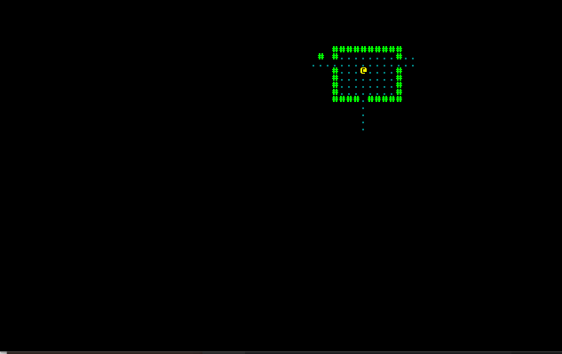

# Chapter 5 - Field of View

---

***About this tutorial***

*This tutorial is free and open source, and all code uses the MIT license - so you are free to do with it as you like. My hope is that you will enjoy the tutorial, and make great games!*

*If you enjoy this and would like me to keep writing, please consider supporting [my Patreon](https://www.patreon.com/blackfuture).*

---

We have a nicely drawn map, but it shows the whole dungeon! That reduces the usefulness of exploration - if we already know where everything is, why bother exploring? This chapter will add "field of view", and adjust rendering to show the parts of the map we've already discovered. It will also refactor the map into its own structure, rather than just a vector of tiles.

This chapter starts with the code from chapter 4.

# Map refactor

We'll keep map-related functions and data together, to keep things clear as we make an ever-more-complicated game. The bulk of this is creating a new `Map` structure, and moving our helper functions to its implementation.

```rust
use rltk::{ RGB, Rltk, RandomNumberGenerator };
use super::{Rect};
use std::cmp::{max, min};

#[derive(PartialEq, Copy, Clone)]
pub enum TileType {
    Wall, Floor
}

pub struct Map {
    pub tiles : Vec<TileType>,
    pub rooms : Vec<Rect>,
    pub width : i32,
    pub height : i32
}

impl Map {
    pub fn xy_idx(&self, x: i32, y: i32) -> usize {
        (y as usize * self.width as usize) + x as usize
    }

    fn apply_room_to_map(&mut self, room : &Rect) {
        for y in room.y1 +1 ..= room.y2 {
            for x in room.x1 + 1 ..= room.x2 {
                let idx = self.xy_idx(x, y);
                self.tiles[idx] = TileType::Floor;
            }
        }
    }

    fn apply_horizontal_tunnel(&mut self, x1:i32, x2:i32, y:i32) {
        for x in min(x1,x2) ..= max(x1,x2) {
            let idx = self.xy_idx(x, y);
            if idx > 0 && idx < self.width as usize * self.height as usize {
                self.tiles[idx as usize] = TileType::Floor;
            }
        }
    }

    fn apply_vertical_tunnel(&mut self, y1:i32, y2:i32, x:i32) {
        for y in min(y1,y2) ..= max(y1,y2) {
            let idx = self.xy_idx(x, y);
            if idx > 0 && idx < self.width as usize * self.height as usize {
                self.tiles[idx as usize] = TileType::Floor;
            }
        }
    }

    /// Makes a new map using the algorithm from http://rogueliketutorials.com/tutorials/tcod/part-3/
    /// This gives a handful of random rooms and corridors joining them together.
    pub fn new_map_rooms_and_corridors() -> Map {
        let mut map = Map{
            tiles : vec![TileType::Wall; 80*50],
            rooms : Vec::new(),
            width : 80,
            height: 50
        };

        const MAX_ROOMS : i32 = 30;
        const MIN_SIZE : i32 = 6;
        const MAX_SIZE : i32 = 10;

        let mut rng = RandomNumberGenerator::new();

        for i in 0..MAX_ROOMS {
            let w = rng.range(MIN_SIZE, MAX_SIZE);
            let h = rng.range(MIN_SIZE, MAX_SIZE);
            let x = rng.roll_dice(1, map.width - w - 1) - 1;
            let y = rng.roll_dice(1, map.height - h - 1) - 1;
            let new_room = Rect::new(x, y, w, h);
            let mut ok = true;
            for other_room in map.rooms.iter() {
                if new_room.intersect(other_room) { ok = false }
            }
            if ok {
                map.apply_room_to_map(&new_room);

                if !map.rooms.is_empty() {
                    let (new_x, new_y) = new_room.center();
                    let (prev_x, prev_y) = map.rooms[map.rooms.len()-1].center();
                    if rng.range(0,2) == 1 {
                        map.apply_horizontal_tunnel(prev_x, new_x, prev_y);
                        map.apply_vertical_tunnel(prev_y, new_y, new_x);
                    } else {
                        map.apply_vertical_tunnel(prev_y, new_y, prev_x);
                        map.apply_horizontal_tunnel(prev_x, new_x, new_y);
                    }
                }

                map.rooms.push(new_room);
            }
        }

        map
    }
}
```

There's changes in `main` and `player`, too - see the example source for all the details. This has cleaned up our code quite a bit - we can pass a `Map` around, instead of a vector. If we want to teach `Map` to do more things - we have a place to do so.

# The field-of-view component

Not just the player has limited visibility! Eventually, we'll want monsters to consider what they can see, too. So, since its reusable code, we'll make a `Viewshed` component. (I like the word *viewshed*; it comes from the cartography world - literally "what can I see from here?" - and perfectly describes our problem). We'll give each entity that has a *Viewshed* a list of tile indices they can see. In `components.rs` we add:

```rust
#[derive(Component)]
pub struct Viewshed {
    pub visible_tiles : Vec<rltk::Point>,
    pub range : i32
}
```

In `main.rs`, we tell the system about the new component:

```rust
gs.ecs.register::<Viewshed>();
```

Lastly, also in `main.rs` we'll give the `Player` a `Viewshed` component:

```rust
gs.ecs
    .create_entity()
    .with(Position { x: player_x, y: player_y })
    .with(Renderable {
        glyph: rltk::to_cp437('@'),
        fg: RGB::named(rltk::YELLOW),
        bg: RGB::named(rltk::BLACK),
    })
    .with(Player{})
    .with(Viewshed{ visible_tiles : Vec::new(), range : 8 })
    .build();
```

Player is getting quite complicated now - that's good, it shows what an ECS is good for!

# A new system: generic viewsheds

We'll start by defining a *system* to take care of this for us. We want this to be generic, so it works for anything that can benefit from knowing what it can see. We create a new file, `visibility_system.rs`:

```rust
use specs::prelude::*;
use super::{Viewshed, Position};

pub struct VisibilitySystem {}

impl<'a> System<'a> for VisibilitySystem {
    type SystemData = ( WriteStorage<'a, Viewshed>, 
                        WriteStorage<'a, Position>);

    fn run(&mut self, (mut viewshed, pos) : Self::SystemData) {
        for (viewshed,pos) in (&mut viewshed, &pos).join() {
        }
    }
}
```

Now we have to adjust `run_systems` in `main.rs` to actually call the system:

```rust
impl State {
    fn run_systems(&mut self) {
        let mut vis = VisibilitySystem{};
        vis.run_now(&self.ecs);
        self.ecs.maintain();
    }
}
```

We also have to tell `main.rs` to use the new module:

```rust
mod visibility_system;
use visibility_system::VisibilitySystem;
```

This doesn't actually *do* anything, yet - but we've added a system into the dispatcher, and as soon as we flesh out the code to actually plot the visibility, it will apply to every entity that has both a *Viewshed* and a *Position* component.

# Asking RLTK for a Viewshed: Trait Implementation

RLTK is written to not care about how you've chosen to lay out your map: I want it to be useful for anyone, and not everyone does maps the way this tutorial does. To act as a bridge between our map implementation and RLTK, it provides some *traits* for us to support. For this example, we need `BaseMap` and `Algorithm2D`. Don't worry, they are simple enough to implement.

In our `map.rs` file, we add the following:

```rust
impl Algorithm2D for Map {
    fn dimensions(&self) -> Point {
        Point::new(self.width, self.height)
    }
}
```

RLTK is able to figure out a lot of other traits from the `dimensions` function: point indexing (and it's reciprocal), bounds-checks, and similar. We use return the dimensions we're already using, `self.width` and `self.height`.

We also need to support `BaseMap`. We don't need all of it yet, so we're going to let it use defaults. In `map.rs`:

```rust
impl BaseMap for Map {
    fn is_opaque(&self, idx:usize) -> bool {
        self.tiles[idx as usize] == TileType::Wall
    }
}
```

`is_opaque` simply returns true if the tile is a wall, and false otherwise. This will have to be expanded if/when we add more types of tile, but works for now. We'll leave the rest of the trait on defaults for now (so no need to enter anything else).

# Asking RLTK for a Viewshed: The System

So going back to `visibility_system.rs`, we now have what we need to request a viewshed from RLTK. We extend our `visibility_system.rs` file to look like this:

```rust
use specs::prelude::*;
use super::{Viewshed, Position, Map};
use rltk::{field_of_view, Point};

pub struct VisibilitySystem {}

impl<'a> System<'a> for VisibilitySystem {
    type SystemData = ( ReadExpect<'a, Map>,
                        WriteStorage<'a, Viewshed>, 
                        WriteStorage<'a, Position>);

    fn run(&mut self, data : Self::SystemData) {
        let (map, mut viewshed, pos) = data;

        for (viewshed,pos) in (&mut viewshed, &pos).join() {
            viewshed.visible_tiles.clear();
            viewshed.visible_tiles = field_of_view(Point::new(pos.x, pos.y), viewshed.range, &*map);
            viewshed.visible_tiles.retain(|p| p.x >= 0 && p.x < map.width && p.y >= 0 && p.y < map.height );
        }
    }
}
```

There's quite a bit here, and the viewshed is actually the simplest part:

* We've added a `ReadExpect<'a, Map>` - meaning that the system should be passed our `Map` for use. We used `ReadExpect`, because not having a map is a failure.
* In the loop, we first clear the list of visible tiles.
* Then we call RLTK's `field_of_view` function, providing the starting point (the location of the entity, from `pos`), the range (from the viewshed), and a slightly convoluted "dereference, then get a reference" to unwrap `Map` from the ECS.
* Finally we use the vector's `retain` method to delete any entries that *don't* meet the criteria we specify. This is a *lambda* or *closure* - it iterates over the vector, passing `p` as a parameter. If p is inside the map boundaries, we keep it. This prevents other functions from trying to access a tile outside of the working map area.

This will now run every frame (which is overkill, more on that later) - and store a list of visible tiles.

# Rendering visibility - badly!

As a first try, we'll change our `draw_map` function to retrieve the map, and the player's viewshed. It will only draw tiles present in the viewshed:

```rust
pub fn draw_map(ecs: &World, ctx : &mut Rltk) {
    let mut viewsheds = ecs.write_storage::<Viewshed>();
    let mut players = ecs.write_storage::<Player>();
    let map = ecs.fetch::<Map>();

    for (_player, viewshed) in (&mut players, &mut viewsheds).join() {
        let mut y = 0;
        let mut x = 0;
        for tile in map.tiles.iter() {
            // Render a tile depending upon the tile type
            let pt = Point::new(x,y);
            if viewshed.visible_tiles.contains(&pt) {
                match tile {
                    TileType::Floor => {
                        ctx.set(x, y, RGB::from_f32(0.5, 0.5, 0.5), RGB::from_f32(0., 0., 0.), rltk::to_cp437('.'));
                    }
                    TileType::Wall => {
                        ctx.set(x, y, RGB::from_f32(0.0, 1.0, 0.0), RGB::from_f32(0., 0., 0.), rltk::to_cp437('#'));
                    }
                }
            }

            // Move the coordinates
            x += 1;
            if x > 79 {
                x = 0;
                y += 1;
            }
        }
    }
}
```

If you run the example now (`cargo run`), it will show you just what the player can see. There's no memory, and performance is quite awful - but it's there and about right.

It's clear that we're on the right track, but we need a more efficient way to do things. It would be nice if the player could remember the map as they see it, too.

# Expanding map to include revealed tiles

To simulate map memory, we'll extend our `Map` class to include a `revealed_tiles` structure. It's just a `bool` for each tile on the map - if true, then we know what's there. Our `Map` definition now looks like this:

```rust
#[derive(Default)]
pub struct Map {
    pub tiles : Vec<TileType>,
    pub rooms : Vec<Rect>,
    pub width : i32,
    pub height : i32,
    pub revealed_tiles : Vec<bool>
}
```

We also need to extend the function that fills the map to include the new type. In `new_rooms_and_corridors`, we extend the Map creation to:

```rust
let mut map = Map{
    tiles : vec![TileType::Wall; 80*50],
    rooms : Vec::new(),
    width : 80,
    height: 50,
    revealed_tiles : vec![false; 80*50]
};
```

That adds a `false` value for every tile.

We change the `draw_map` to look at this value, rather than iterating the component each time. The function now looks like this:

```rust
pub fn draw_map(ecs: &World, ctx : &mut Rltk) {
    let map = ecs.fetch::<Map>();

    let mut y = 0;
    let mut x = 0;
    for (idx,tile) in map.tiles.iter().enumerate() {
        // Render a tile depending upon the tile type
        if map.revealed_tiles[idx] {
            match tile {
                TileType::Floor => {
                    ctx.set(x, y, RGB::from_f32(0.5, 0.5, 0.5), RGB::from_f32(0., 0., 0.), rltk::to_cp437('.'));
                }
                TileType::Wall => {
                    ctx.set(x, y, RGB::from_f32(0.0, 1.0, 0.0), RGB::from_f32(0., 0., 0.), rltk::to_cp437('#'));
                }
            }
        }

        // Move the coordinates
        x += 1;
        if x > 79 {
            x = 0;
            y += 1;
        }
    }
}
```

This will render a black screen, because we're never setting any tiles to be revealed! So now we extend the `VisibilitySystem` to know how to mark tiles as revealed. To do this, it has to check to see if an entity is the player - and if it is, it updates the map's revealed status:

```rust
use specs::prelude::*;
use super::{Viewshed, Position, Map, Player};
use rltk::{field_of_view, Point};

pub struct VisibilitySystem {}

impl<'a> System<'a> for VisibilitySystem {
    type SystemData = ( WriteExpect<'a, Map>,
                        Entities<'a>,
                        WriteStorage<'a, Viewshed>, 
                        WriteStorage<'a, Position>,
                        ReadStorage<'a, Player>);

    fn run(&mut self, data : Self::SystemData) {
        let (mut map, entities, mut viewshed, pos, player) = data;

        for (ent,viewshed,pos) in (&entities, &mut viewshed, &pos).join() {
            viewshed.visible_tiles.clear();
            viewshed.visible_tiles = field_of_view(Point::new(pos.x, pos.y), viewshed.range, &*map);
            viewshed.visible_tiles.retain(|p| p.x >= 0 && p.x < map.width && p.y >= 0 && p.y < map.height );

            // If this is the player, reveal what they can see
            let p : Option<&Player> = player.get(ent);
            if let Some(p) = p {
                for vis in viewshed.visible_tiles.iter() {
                    let idx = map.xy_idx(vis.x, vis.y);
                    map.revealed_tiles[idx] = true;
                }
            }
        }
    }
}
```

The main changes here are that we're getting the Entities list along with components, and obtaining read-only access to the Players storage. We add those to the list of things to iterate in the list, and add a `let p : Option<&Player> = player.get(ent);` to see if this is the player. The rather cryptic `if let Some(p) = p` runs only if there is a `Player` component. Then we calculate the index, and mark it revealed.

If you run (`cargo run`) the project now, it is MASSIVELY faster than the previous version, and remembers where you've been.

# Speeding it up even more - recalculating visibility when we need to

It's still not as efficient as it could be! Lets only update viewsheds when we need to. Lets add a `dirty` flag to our `Viewshed` component:

```rust
#[derive(Component)]
pub struct Viewshed {
    pub visible_tiles : Vec<rltk::Point>,
    pub range : i32,
    pub dirty : bool
}
```

We'll also update the initialization in `main.rs` to say that the viewshed is, in fact, dirty: `.with(Viewshed{ visible_tiles : Vec::new(), range: 8, dirty: true })`.

Our system can be extended to check if the `dirty` flag is true, and only recalculate if it is - and set the `dirty` flag to false when it is done. Now we need to set the flag when the player moves - because what they can see has changed! We update `try_move_player` in `player.rs`:

```rust
pub fn try_move_player(delta_x: i32, delta_y: i32, ecs: &mut World) {
    let mut positions = ecs.write_storage::<Position>();
    let mut players = ecs.write_storage::<Player>();
    let mut viewsheds = ecs.write_storage::<Viewshed>();
    let map = ecs.fetch::<Map>();

    for (_player, pos, viewshed) in (&mut players, &mut positions, &mut viewsheds).join() {
        let destination_idx = map.xy_idx(pos.x + delta_x, pos.y + delta_y);
        if map.tiles[destination_idx] != TileType::Wall {
            pos.x = min(79 , max(0, pos.x + delta_x));
            pos.y = min(49, max(0, pos.y + delta_y));

            viewshed.dirty = true;
        }
    }
}
```

This should be pretty familiar by now: we've added `viewsheds` to get write storage, and included it in the list of component types we are iterating. Then one call sets the flag to `true` after a move.

The game now runs *very* fast once more, if you type `cargo run`.

# Greying out what we remember, but can't see

One more extension: we'd like to render the parts of the map we know are there but can't currently see. So we add a list of what tiles are currently visible to `Map`:

```rust
#[derive(Default)]
pub struct Map {
    pub tiles : Vec<TileType>,
    pub rooms : Vec<Rect>,
    pub width : i32,
    pub height : i32,
    pub revealed_tiles : Vec<bool>,
    pub visible_tiles : Vec<bool>
}
```

Our creation method also needs to know to add all false to it, just like before: `visible_tiles : vec![false; 80*50]`. Next, in our `VisibilitySystem` we clear the list of visible tiles before we begin iterating - and mark currently visible tiles as we find them. So our code to run when updating the viewshed looks like this:

```rust
if viewshed.dirty {
    viewshed.dirty = false;
    viewshed.visible_tiles.clear();
    viewshed.visible_tiles = field_of_view(Point::new(pos.x, pos.y), viewshed.range, &*map);
    viewshed.visible_tiles.retain(|p| p.x >= 0 && p.x < map.width && p.y >= 0 && p.y < map.height );

    // If this is the player, reveal what they can see
    let _p : Option<&Player> = player.get(ent);
    if let Some(_p) = _p {
        for t in map.visible_tiles.iter_mut() { *t = false };
        for vis in viewshed.visible_tiles.iter() {
            let idx = map.xy_idx(vis.x, vis.y);
            map.revealed_tiles[idx] = true;
            map.visible_tiles[idx] = true;
        }
    }
}
```

Now we adjust the `draw_map` function to handle revealed but not currently visible tiles differently. The new `draw_map` function looks like this:

```rust
pub fn draw_map(ecs: &World, ctx : &mut Rltk) {
    let map = ecs.fetch::<Map>();

    let mut y = 0;
    let mut x = 0;
    for (idx,tile) in map.tiles.iter().enumerate() {
        // Render a tile depending upon the tile type

        if map.revealed_tiles[idx] {
            let glyph;
            let mut fg;
            match tile {
                TileType::Floor => {
                    glyph = rltk::to_cp437('.');
                    fg = RGB::from_f32(0.0, 0.5, 0.5);
                }
                TileType::Wall => {
                    glyph = rltk::to_cp437('#');
                    fg = RGB::from_f32(0., 1.0, 0.);
                }
            }
            if !map.visible_tiles[idx] { fg = fg.to_greyscale() }
            ctx.set(x, y, fg, RGB::from_f32(0., 0., 0.), glyph);
        }

        // Move the coordinates
        x += 1;
        if x > 79 {
            x = 0;
            y += 1;
        }
    }
}
```

If you `cargo run` your project, you will now have visible tiles as slightly cyan floors and green walls - and grey as they move out of view. Performance should be great! Congratulations - you now have a nice, working field-of-view system.



**The source code for this chapter may be found [here](https://github.com/thebracket/rustrogueliketutorial/tree/master/chapter-05-fov)**

[Run this chapter's example with web assembly, in your browser (WebGL2 required)](https://bfnightly.bracketproductions.com/rustbook/wasm/chapter-05-fov/)

---

Copyright (C) 2019, Herbert Wolverson.

---
