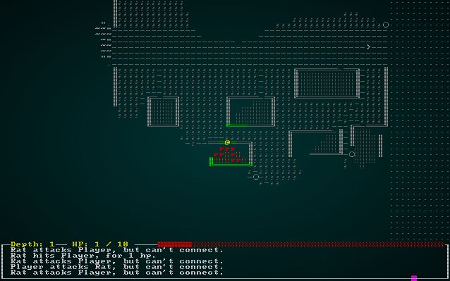

# Game Stats

---

***About this tutorial***

*This tutorial is free and open source, and all code uses the MIT license - so you are free to do with it as you like. My hope is that you will enjoy the tutorial, and make great games!*

*If you enjoy this and would like me to keep writing, please consider supporting [my Patreon](https://www.patreon.com/blackfuture).*

---

Up until now, we've had *very* primitive stats: power and defense. This doesn't give a lot of room for variation, nor does it live up to the Roguelike ideal of drowning the player in numbers (ok, that's an overstatement). In the design document, we mentioned wanting a D&D-like approach to game stats. That gives a *lot* of room to play with things, allowing items with various bonuses (and penalties), and should feel familiar to most people likely to play a game in this genre. It will also require some UI work, but we'll push the bulk of it off until the next chapter.

## The Basic 6 Stats - Condensed to 4

Anyone who has played D&D will know that characters - and in later editions, everyone else - has six attributes:

* *Strength*, governing how much you can carry, how hard you bash things, and your general physical capability.
* *Dexterity*, governing how fast you dodge things, how well you leap around acrobatically, and things like picking locks and aiming your bow.
* *Constitution*, governing how physically fit and healthy you are, adjusting your hit point total and helping to resist disease.
* *Intelligence* for how smart you are, helping with spells, reading things.
* *Wisdom* for how much common sense you have, as well as helpful interactions with deities.
* *Charisma* for how well you interact with others.

This is overkill for the game we're making. Intelligence and Wisdom don't need to be separate (Wisdom would end up being the "dump stat" everyone ditches to get points elsewhere!), and Charisma is really only useful for interacting with vendors since we aren't doing a lot of social interaction in-game. So we'll opt for a condensed set of attributes for this game:

* *Might*, governing your general ability to hit things.
* *Fitness*, your general health.
* *Quickness*, your general dexterity replacement.
* *Intelligence*, which really combines Intelligence and Wisdom in D&D terms.

This is a pretty common mix for other games. Let's open `components.rs` and make a new component to hold them:

```rust
#[derive(Debug, Serialize, Deserialize, Clone)]
pub struct Attribute {
    pub base : i32,
    pub modifiers : i32,
    pub bonus : i32
}

#[derive(Component, Debug, Serialize, Deserialize, Clone)]
pub struct Attributes {
    pub might : Attribute,
    pub fitness : Attribute,
    pub quickness : Attribute,
    pub intelligence : Attribute
}
```

So we make a structure for an attribute, and store three values:

* The *base* value, which is the completely unmodified value.
* The *modifiers* value, which represents any active bonuses or penalties to the attribute (and will have to be recomputed from time to time).
* The *bonus*, which is derived from the final modified value - and most of the time, is what we're actually going to use.

Don't forget to register `Attributes` in `main.rs` and `saveload_system.rs`. `Attribute` isn't actually a component - it's just used by one - so you *don't* have to register it.

### Giving the player some attributes

Now, we should give the player some attributes. We'll start simple, and give every attribute a value of 11 (we're using D&D-style 3-18, 3d6 generated attributes). In `spawner.rs`, modify the `player` function as follows:

```rust
pub fn player(ecs : &mut World, player_x : i32, player_y : i32) -> Entity {
    ecs
        .create_entity()
        .with(Position { x: player_x, y: player_y })
        .with(Renderable {
            glyph: rltk::to_cp437('@'),
            fg: RGB::named(rltk::YELLOW),
            bg: RGB::named(rltk::BLACK),
            render_order: 0
        })
        .with(Player{})
        .with(Viewshed{ visible_tiles : Vec::new(), range: 8, dirty: true })
        .with(Name{name: "Player".to_string() })
        .with(CombatStats{ max_hp: 30, hp: 30, defense: 2, power: 5 })
        .with(HungerClock{ state: HungerState::WellFed, duration: 20 })
        .with(Attributes{
            might: Attribute{ base: 11, modifiers: 0, bonus: 0 },
            fitness: Attribute{ base: 11, modifiers: 0, bonus: 0 },
            quickness: Attribute{ base: 11, modifiers: 0, bonus: 0 },
            intelligence: Attribute{ base: 11, modifiers: 0, bonus: 0 },
        })
        .marked::<SimpleMarker<SerializeMe>>()
        .build()
}
```

### Attributes for NPCs

We probably don't want to have to write out every single attribute for every NPC in the `spawns.json`, but we'd like to be able to do so if we *want* to. Take a normal NPC like the `Barkeep`. We could use the following syntax to indicate that he has "normal" attributes for everything, but is smarter than your average peasant:

```json
{
    "name" : "Barkeep",
    "renderable": {
        "glyph" : "☺",
        "fg" : "#EE82EE",
        "bg" : "#000000",
        "order" : 1
    },
    "blocks_tile" : true,
    "stats" : {
        "max_hp" : 16,
        "hp" : 16,
        "defense" : 1,
        "power" : 4
    },
    "vision_range" : 4,
    "ai" : "vendor",
    "attributes" : {
        "intelligence" : 13
    }
},
```

This pattern is powerful, because we can gloss-over the details of everyone who is basically scenery - but fill in as much detail as we want for important monsters! If you don't specify an attribute, it defaults to a middle-of-the-road value.

Let's extend the structs in `raws/mob_structs.rs` to support such a flexible format:

```rust
use serde::{Deserialize};
use super::{Renderable};

#[derive(Deserialize, Debug)]
pub struct Mob {
    pub name : String,
    pub renderable : Option<Renderable>,
    pub blocks_tile : bool,
    pub stats : MobStats,
    pub vision_range : i32,
    pub ai : String,
    pub quips : Option<Vec<String>>,
    pub attributes : MobAttributes
}

#[derive(Deserialize, Debug)]
pub struct MobStats {
    pub max_hp : i32,
    pub hp : i32,
    pub power : i32,
    pub defense : i32
}

#[derive(Deserialize, Debug)]
pub struct MobAttributes {
    pub might : Option<i32>,
    pub fitness : Option<i32>,
    pub quickness : Option<i32>,
    pub intelligence : Option<i32>
}
```

Notice that we're making `attributes` *required* - so you *have* to have one for the JSON to load. Then we're making all of the attribute values optional; if you don't specify them, we'll go with a nice, normal value.

Now lets open up `raws/rasmaster.rs` and modify `spawn_named_mob` to generate this data:

```rust
let mut attr = Attributes{
    might: Attribute{ base: 11, modifiers: 0, bonus: 0 },
    fitness: Attribute{ base: 11, modifiers: 0, bonus: 0 },
    quickness: Attribute{ base: 11, modifiers: 0, bonus: 0 },
    intelligence: Attribute{ base: 11, modifiers: 0, bonus: 0 },
};
if let Some(might) = mob_template.attributes.might { 
    attr.might = Attribute{ base: might, modifiers: 0, bonus: 0 }; 
}
if let Some(fitness) = mob_template.attributes.fitness { 
    attr.fitness = Attribute{ base: fitness, modifiers: 0, bonus: 0 }; 
}
if let Some(quickness) = mob_template.attributes.quickness { 
    attr.quickness = Attribute{ base: quickness, modifiers: 0, bonus: 0 }; 
}
if let Some(intelligence) = mob_template.attributes.intelligence { 
    attr.intelligence = Attribute{ base: intelligence, modifiers: 0, bonus: 0 }; 
}
eb = eb.with(attr);
```

This checks for the presence of each attribute in the JSON, and assigns it to the mob. 

## Attribute Bonuses

So far, so good - but what about the `bonus` field? A bonus of `0` for every value isn't right! We're going to need to do a *lot* of game system calculation - so we'll create a new file in the main project, `gamesystem.rs`:

```rust
pub fn attr_bonus(value: i32) -> i32 {
    (value-10)/2 // See: https://roll20.net/compendium/dnd5e/Ability%20Scores#content
}
```

This uses the standard D&D rules for determining an attribute bonus: subtract 10 and divide by 2. So our 11 will give a bonus of 0 - it's average. Our Barkeeper will have a bonus of 1 to intelligence rolls.

At the top of `main.rs`, add a `mod gamesystem` and a `pub use gamesystem::*` to make this module available everywhere.

Now modify the player spawn in `spawner.rs` to use it:

```rust
use crate::attr_bonus;
...
.with(Attributes{
    might: Attribute{ base: 11, modifiers: 0, bonus: attr_bonus(11) },
    fitness: Attribute{ base: 11, modifiers: 0, bonus: attr_bonus(11) },
    quickness: Attribute{ base: 11, modifiers: 0, bonus: attr_bonus(11) },
    intelligence: Attribute{ base: 11, modifiers: 0, bonus: attr_bonus(11) },
})
...
```

Do the same in `rawmaster.rs`:

```rust
use crate::attr_bonus; // At the top!
...
let mut attr = Attributes{
    might: Attribute{ base: 11, modifiers: 0, bonus: attr_bonus(11) },
    fitness: Attribute{ base: 11, modifiers: 0, bonus: attr_bonus(11) },
    quickness: Attribute{ base: 11, modifiers: 0, bonus: attr_bonus(11) },
    intelligence: Attribute{ base: 11, modifiers: 0, bonus: attr_bonus(11) },
};
if let Some(might) = mob_template.attributes.might { 
    attr.might = Attribute{ base: might, modifiers: 0, bonus: attr_bonus(might) }; 
}
if let Some(fitness) = mob_template.attributes.fitness { 
    attr.fitness = Attribute{ base: fitness, modifiers: 0, bonus: attr_bonus(fitness) }; 
}
if let Some(quickness) = mob_template.attributes.quickness { 
    attr.quickness = Attribute{ base: quickness, modifiers: 0, bonus: attr_bonus(quickness) }; 
}
if let Some(intelligence) = mob_template.attributes.intelligence { 
    attr.intelligence = Attribute{ base: intelligence, modifiers: 0, bonus: attr_bonus(intelligence) }; 
}
eb = eb.with(attr);
...
```

Before you compile/run the game, add a blank `attributes` entry to every mob in `spawns.json` to avoid errors. Here's an example:

```json
{
    "name" : "Shady Salesman",
    "renderable": {
        "glyph" : "h",
        "fg" : "#EE82EE",
        "bg" : "#000000",
        "order" : 1
    },
    "blocks_tile" : true,
    "stats" : {
        "max_hp" : 16,
        "hp" : 16,
        "defense" : 1,
        "power" : 4
    },
    "vision_range" : 4,
    "ai" : "vendor",
    "attributes" : {}
},
```

## Skills

Before we start to *use* attributes, we should consider the other element with which they go hand-in-hand: skills. For this game, we don't want to get too complicated with hundreds of skills; we'd *never* finish the tutorial! Instead, lets go with some very basic skills: melee, defense, and magic. We can always add more later (but taking them away can cause howls of derision from users!).

In `components.rs`, lets make a skill holding component:

```rust
#[derive(Debug, Serialize, Deserialize, Clone, Eq, PartialEq, Hash)]
pub enum Skill { Melee, Defense, Magic }

#[derive(Component, Debug, Serialize, Deserialize, Clone)]
pub struct Skills {
    pub skills : HashMap<Skill, i32>
}
```

So if we add skills, we'll need to add them to the `enum` in the future - but our basic `skills` structure can hold whatever skills we come up with. *Don't forget to add `Skills` (but not `Skill`) to `main.rs` and `saveload_system.rs` for registration!*

Open up `spawners.rs`, and lets give the `player` a skill of `1` in everything:

```rust
pub fn player(ecs : &mut World, player_x : i32, player_y : i32) -> Entity {
    let mut skills = Skills{ skills: HashMap::new() };
    skills.skills.insert(Skill::Melee, 1);
    skills.skills.insert(Skill::Defense, 1);
    skills.skills.insert(Skill::Magic, 1);

    ecs
        .create_entity()
        .with(Position { x: player_x, y: player_y })
        .with(Renderable {
            glyph: rltk::to_cp437('@'),
            fg: RGB::named(rltk::YELLOW),
            bg: RGB::named(rltk::BLACK),
            render_order: 0
        })
        .with(Player{})
        .with(Viewshed{ visible_tiles : Vec::new(), range: 8, dirty: true })
        .with(Name{name: "Player".to_string() })
        .with(CombatStats{ max_hp: 30, hp: 30, defense: 2, power: 5 })
        .with(HungerClock{ state: HungerState::WellFed, duration: 20 })
        .with(Attributes{
            might: Attribute{ base: 11, modifiers: 0, bonus: attr_bonus(11) },
            fitness: Attribute{ base: 11, modifiers: 0, bonus: attr_bonus(11) },
            quickness: Attribute{ base: 11, modifiers: 0, bonus: attr_bonus(11) },
            intelligence: Attribute{ base: 11, modifiers: 0, bonus: attr_bonus(11) },
        })
        .with(skills)
        .marked::<SimpleMarker<SerializeMe>>()
        .build()
}
```

For mobs, we'll also assume a skill of `1` in each skill unless otherwise specified. In `raws/mob_structs.rs`, update the `Mob`:

```rust
#[derive(Deserialize, Debug)]
pub struct Mob {
    pub name : String,
    pub renderable : Option<Renderable>,
    pub blocks_tile : bool,
    pub stats : MobStats,
    pub vision_range : i32,
    pub ai : String,
    pub quips : Option<Vec<String>>,
    pub attributes : MobAttributes,
    pub skills : Option<HashMap<String, i32>>
}
```

That allows us to omit it completely in many cases (no non-default skills), which will avoid hitting a mob with a penalty if we forget to give them a skill! The mob *can* have skills overridden, should we so wish. They have to line up with the `HashMap` structure. Let's give our Barkeep in `spawns.json` a skill bonus (it won't *do* anything, but it works as an example):

```json
{
    "name" : "Barkeep",
    "renderable": {
        "glyph" : "☺",
        "fg" : "#EE82EE",
        "bg" : "#000000",
        "order" : 1
    },
    "blocks_tile" : true,
    "stats" : {
        "max_hp" : 16,
        "hp" : 16,
        "defense" : 1,
        "power" : 4
    },
    "vision_range" : 4,
    "ai" : "vendor",
    "attributes" : {
        "intelligence" : 13
    },
    "skills" : {
        "Melee" : 2
    }
},
```

Let's modify our `raws/rawmaster.rs`'s `spawn_named_mob` function to *use* this data:

```rust
let mut skills = Skills{ skills: HashMap::new() };
skills.skills.insert(Skill::Melee, 1);
skills.skills.insert(Skill::Defense, 1);
skills.skills.insert(Skill::Magic, 1);
if let Some(mobskills) = &mob_template.skills {
    for sk in mobskills.iter() {
        match sk.0.as_str() {
            "Melee" => { skills.skills.insert(Skill::Melee, *sk.1); }
            "Defense" => { skills.skills.insert(Skill::Defense, *sk.1); }
            "Magic" => { skills.skills.insert(Skill::Magic, *sk.1); }
            _ => { rltk::console::log(format!("Unknown skill referenced: [{}]", sk.0)); }
        }
    }
}
eb = eb.with(skills);
```

## Making level, experience and health a component, adding Mana

In `components.rs`, go ahead and add another component (and then register it in `main.rs` and `saveload_system.rs`):

```rust
#[derive(Debug, Serialize, Deserialize, Clone)]
pub struct Pool {
    pub max: i32,
    pub current: i32
}

#[derive(Component, Debug, Serialize, Deserialize, Clone)]
pub struct Pools {
    pub hit_points : Pool,
    pub mana : Pool,
    pub xp : i32,
    pub level : i32
}
```

There is quite a bit there:

* We create a new type to represent a depletable resource, a `Pool`. Pools have a maximum and a current value. This represents getting injured, or using up your magical power; the maximum is unchanged, but the current value fluctuates.
* We use the `Pool` to store both `hit_points` and `mana`.
* We also store `xp` for "Experience Points".
* We store `level` for what level you (or the NPC) are.

We should define some defaults for these, and determine how your attributes affect them. In `gamesystem.rs`, we'll use the following functions:

```rust
pub fn attr_bonus(value: i32) -> i32 {
    (value-10)/2 // See: https://roll20.net/compendium/dnd5e/Ability%20Scores#content
}

pub fn player_hp_per_level(fitness: i32) -> i32 {
    10 + attr_bonus(fitness)
}

pub fn player_hp_at_level(fitness:i32, level:i32) -> i32 {
    player_hp_per_level(fitness) * level
}

pub fn npc_hp(fitness: i32, level: i32) -> i32 {
    let mut total = 1;
    for _i in 0..level {
        total += i32::max(1, 8 + attr_bonus(fitness));
    }
    total
}

pub fn mana_per_level(intelligence: i32) -> i32 {
    i32::max(1, 4 + attr_bonus(intelligence))
}

pub fn mana_at_level(intelligence: i32, level: i32) -> i32 {
    mana_per_level(intelligence) * level
}

pub fn skill_bonus(skill : Skill, skills: &Skills) -> i32 {
    if skills.skills.contains_key(&skill) {
        skills.skills[&skill]
    } else {
        -4
    }
}
```

If you've been following along, these should be *really* easy to understand: players get 10 HP per level, modified by their fitness attribute. NPCs get 8 per level, also modified by fitness - with a minimum of 1 per level (for bad rolls).

So in `spawner.rs`, we can modify the `player` function to fill in these pools for a starting character:

```rust
.with(Pools{
    hit_points : Pool{ 
        current: player_hp_at_level(11, 1), 
        max: player_hp_at_level(11, 1) 
    },
    mana: Pool{
        current: mana_at_level(11, 1),
        max: mana_at_level(11, 1)
    },
    xp: 0,
    level: 1
})
```

Likewise, we need to give NPCs the ability to have pools. At the very least, we have to add a `level` attribute to their definition - but lets make it optional, if omitted it goes with `1` (so you don't need to modify every single fluff NPC!). We'll also make optional `hp` and `mana` fields - so you can go with random defaults, or override them for an important monster. Here's `raws/mob_structs.rs` adjusted:

```rust
#[derive(Deserialize, Debug)]
pub struct Mob {
    pub name : String,
    pub renderable : Option<Renderable>,
    pub blocks_tile : bool,
    pub vision_range : i32,
    pub ai : String,
    pub quips : Option<Vec<String>>,
    pub attributes : MobAttributes,
    pub skills : Option<HashMap<String, i32>>,
    pub level : Option<i32>,
    pub hp : Option<i32>,
    pub mana : Option<i32>
}
```

We should also modify `spawn_named_mob` (from `raws/rawmaster.rs`) to include this:

```rust
let mut mob_fitness = 11;
let mut mob_int = 11;
let mut attr = Attributes{
    might: Attribute{ base: 11, modifiers: 0, bonus: attr_bonus(11) },
    fitness: Attribute{ base: 11, modifiers: 0, bonus: attr_bonus(11) },
    quickness: Attribute{ base: 11, modifiers: 0, bonus: attr_bonus(11) },
    intelligence: Attribute{ base: 11, modifiers: 0, bonus: attr_bonus(11) },
};
if let Some(might) = mob_template.attributes.might { 
    attr.might = Attribute{ base: might, modifiers: 0, bonus: attr_bonus(might) }; 
}
if let Some(fitness) = mob_template.attributes.fitness { 
    attr.fitness = Attribute{ base: fitness, modifiers: 0, bonus: attr_bonus(fitness) }; 
    mob_fitness = fitness;
}
if let Some(quickness) = mob_template.attributes.quickness { 
    attr.quickness = Attribute{ base: quickness, modifiers: 0, bonus: attr_bonus(quickness) }; 
}
if let Some(intelligence) = mob_template.attributes.intelligence { 
    attr.intelligence = Attribute{ base: intelligence, modifiers: 0, bonus: attr_bonus(intelligence) }; 
    mob_int = intelligence;
}
eb = eb.with(attr);

let mob_level = if mob_template.level.is_some() { mob_template.level.unwrap() } else { 1 };
let mob_hp = npc_hp(mob_fitness, mob_level);
let mob_mana = mana_at_level(mob_int, mob_level);

let pools = Pools{
    level: mob_level,
    xp: 0,
    hit_points : Pool{ current: mob_hp, max: mob_hp },
    mana: Pool{current: mob_mana, max: mob_mana}
};
eb = eb.with(pools);
```

We're capturing the relevant stats during their building, and calling the new functions to help build the NPC's Pools.

## Time to break stuff: delete the old stats!

In `components.rs`, delete `CombatStats`. You'll want to delete it in `main.rs` and `saveload_system.rs` as well. Watch your IDE paint the town red - we've used that quite a bit! Since we're enacting a new D&D-like system, it has to be done... this also gives us a chance to look at the places in which we're actually *using* it, and make some informed decisions.

If you don't want to follow all of these changes directly, or get confused (it happens to all of us!), the [source code for this chapter](https://bfnightly.bracketproductions.com/rustbook/wasm/chapter-50-stats) has the working versions.

Here are the simpler changes:

* In `mob_structs.rs` you can delete `MobStats` and its reference in `Mob`.
* In `rawmaster.rs`, delete the code assigning `CombatStats` to an NPC.
* In `spawns.json` you can delete all of the stat blocks.
* In `damage_system.rs` replace all references to `CombatStats` with `Pools`, and all references to `stats.hp` with `stats.hit_points.current` or `stats.hit_points.max` (for `max_hp`).
* In `inventory_system.rs`, replace all references to `CombatStats` with `Pools`, and replace the line referencing `max_hp` and `hp` with `stats.hit_points = i32::min(stats.hit_points.max, stats.hit_points.current + healer.heal_amount);`

And the less easy ones: 

In `player.rs` replace `CombatStats` with `Pools` - it'll serve the same purpose. Also, find the `can_heal` section and replace it with:

```rust
if can_heal {
    let mut health_components = ecs.write_storage::<Pools>();
    let pools = health_components.get_mut(*player_entity).unwrap();
    pools.hit_points.current = i32::min(pools.hit_points.current + 1, pools.hit_points.max);
}
```

In `main.rs` (line 345), we reference the player's health - they've changed dungeon level and we give them some hit points back. Let's stop being so nice and delete that altogether. The unkind code now reads like this:

```rust
let player_entity = self.ecs.fetch::<Entity>();
let mut gamelog = self.ecs.fetch_mut::<gamelog::GameLog>();
gamelog.entries.push("You descend to the next level.".to_string());
```

`gui.rs` is an easy fix. Replace the import for `CombatStats` with `Pools`; here's the relevant section:

```rust
...
use super::{Pools, Player, gamelog::GameLog, Map, Name, Position, State, InBackpack, 
    Viewshed, RunState, Equipped, HungerClock, HungerState, rex_assets::RexAssets,
    Hidden, camera };

pub fn draw_ui(ecs: &World, ctx : &mut Rltk) {
    ctx.draw_box(0, 43, 79, 6, RGB::named(rltk::WHITE), RGB::named(rltk::BLACK));

    let combat_stats = ecs.read_storage::<Pools>();
    let players = ecs.read_storage::<Player>();
    let hunger = ecs.read_storage::<HungerClock>();
    for (_player, stats, hc) in (&players, &combat_stats, &hunger).join() {
        let health = format!(" HP: {} / {} ", stats.hp, stats.max_hp);
        ctx.print_color(12, 43, RGB::named(rltk::YELLOW), RGB::named(rltk::BLACK), &health);

        ctx.draw_bar_horizontal(28, 43, 51, stats.hit_points.current, stats.hit_points.max, RGB::named(rltk::RED), RGB::named(rltk::BLACK));
...
```

## Updating the melee combat system.

We're down to one "red file" (files with errors), in `melee_combat_system.rs`, but they now relate to core game systems that relied upon the old system. We want to make that more like a D20 (D&D) game, so they should be replaced anyway.

That means it's time to discuss the combat system we *want*. Let's go with a very D&D-like (but not quite) setup:

1. We look to see what weapon the attacker is using. We'll need to determine if it is *Might* or *Quickness* based. If you are unarmed, we'll go with *Might*.
2. The attacker rolls 1d20 (a 20-sided dice).
3. If the roll is a natural, unmodified 20, it always hits.
4. A natural roll of 1 always misses.
5. The attacker adds the *attribute bonus* for either might or quickness, depending upon the weapon.
6. The attacker adds the *skill bonus*, equal to the number of points spent on the *Melee* skill.
7. The attacker adds any bonuses imparted by the weapon itself (in case it's magical).
8. The attacker adds any situational or status bonuses, which aren't implemented yet but are good to keep in mind.
9. If the total attack roll is equal to or greater than the target's *armor class*, then the target is hit and will sustain damage.

Armor Class is determined by:

1. Start with the base number 10.
2. Add the *Defense* skill.
3. Add the *armor bonus* for the equipped armor (not implemented yet! and shield).

Damage is then determined from the melee weapon:

1. The weapon will specify a die type and bonus (e.g. `1d6+1`); if there is no weapon equipped, then unarmed combat does `1d4`.
2. Add the attacker's *might* bonus.
3. Add the attacker's *melee* bonus.

So now that we've defined how it *should* work, we can start implementing it. Until we've revamped some equipment, it's going to be incomplete - but at least we can get it compiling.

Here's a replacement `melee_combat_system.rs` that does what we described:

```rust
extern crate specs;
use specs::prelude::*;
use super::{Attributes, Skills, WantsToMelee, Name, SufferDamage, gamelog::GameLog,
    particle_system::ParticleBuilder, Position, HungerClock, HungerState, Pools, skill_bonus, Skill};

pub struct MeleeCombatSystem {}

impl<'a> System<'a> for MeleeCombatSystem {
    #[allow(clippy::type_complexity)]
    type SystemData = ( Entities<'a>,
                        WriteExpect<'a, GameLog>,
                        WriteStorage<'a, WantsToMelee>,
                        ReadStorage<'a, Name>,
                        ReadStorage<'a, Attributes>,
                        ReadStorage<'a, Skills>,
                        WriteStorage<'a, SufferDamage>,
                        WriteExpect<'a, ParticleBuilder>,
                        ReadStorage<'a, Position>,
                        ReadStorage<'a, HungerClock>,
                        ReadStorage<'a, Pools>,
                        WriteExpect<'a, rltk::RandomNumberGenerator>
                      );

    fn run(&mut self, data : Self::SystemData) {
        let (entities, mut log, mut wants_melee, names, attributes, skills, mut inflict_damage, 
            mut particle_builder, positions, hunger_clock, pools, mut rng) = data;

        for (entity, wants_melee, name, attacker_attributes, attacker_skills, attacker_pools) in (&entities, &wants_melee, &names, &attributes, &skills, &pools).join() {
            // Are the attacker and defender alive? Only attack if they are
            let target_pools = pools.get(wants_melee.target).unwrap();
            let target_attributes = attributes.get(wants_melee.target).unwrap();
            let target_skills = skills.get(wants_melee.target).unwrap();
            if attacker_pools.hit_points.current > 0 && target_pools.hit_points.current > 0 {
                let target_name = names.get(wants_melee.target).unwrap();

                let natural_roll = rng.roll_dice(1, 20);
                let attribute_hit_bonus = attacker_attributes.might.bonus;
                let skill_hit_bonus = skill_bonus(Skill::Melee, &*attacker_skills);
                let weapon_hit_bonus = 0; // TODO: Once weapons support this
                let mut status_hit_bonus = 0;
                if let Some(hc) = hunger_clock.get(entity) { // Well-Fed grants +1
                    if hc.state == HungerState::WellFed {
                        status_hit_bonus += 1;
                    }
                }
                let modified_hit_roll = natural_roll + attribute_hit_bonus + skill_hit_bonus
                    + weapon_hit_bonus + status_hit_bonus;

                let base_armor_class = 10;
                let armor_quickness_bonus = target_attributes.quickness.bonus;
                let armor_skill_bonus = skill_bonus(Skill::Defense, &*target_skills);
                let armor_item_bonus = 0; // TODO: Once armor supports this
                let armor_class = base_armor_class + armor_quickness_bonus + armor_skill_bonus
                    + armor_item_bonus;

                if natural_roll != 1 && (natural_roll == 20 || modified_hit_roll > armor_class) {
                    // Target hit! Until we support weapons, we're going with 1d4
                    let base_damage = rng.roll_dice(1, 4);
                    let attr_damage_bonus = attacker_attributes.might.bonus;
                    let skill_damage_bonus = skill_bonus(Skill::Melee, &*attacker_skills);
                    let weapon_damage_bonus = 0;

                    let damage = i32::max(0, base_damage + attr_damage_bonus + skill_hit_bonus + 
                        skill_damage_bonus + weapon_damage_bonus);
                    SufferDamage::new_damage(&mut inflict_damage, wants_melee.target, damage);
                    log.entries.push(format!("{} hits {}, for {} hp.", &name.name, &target_name.name, damage));
                    if let Some(pos) = positions.get(wants_melee.target) {
                        particle_builder.request(pos.x, pos.y, rltk::RGB::named(rltk::ORANGE), rltk::RGB::named(rltk::BLACK), rltk::to_cp437('‼'), 200.0);
                    }
                } else  if natural_roll == 1 {
                    // Natural 1 miss
                    log.entries.push(format!("{} considers attacking {}, but misjudges the timing.", name.name, target_name.name));
                    if let Some(pos) = positions.get(wants_melee.target) {
                        particle_builder.request(pos.x, pos.y, rltk::RGB::named(rltk::BLUE), rltk::RGB::named(rltk::BLACK), rltk::to_cp437('‼'), 200.0);
                    }
                } else {
                    // Miss
                    log.entries.push(format!("{} attacks {}, but can't connect.", name.name, target_name.name));
                    if let Some(pos) = positions.get(wants_melee.target) {
                        particle_builder.request(pos.x, pos.y, rltk::RGB::named(rltk::CYAN), rltk::RGB::named(rltk::BLACK), rltk::to_cp437('‼'), 200.0);
                    }
                }
            }
        }

        wants_melee.clear();
    }
}
```

That's a lot of code, but it's very similar to the outline we created. Let's walk through it:

1. We carefully define a lot of the ECS resources to which we need access.
2. We iterate all entities that want to melee, and have a name, skills, attributes and pools.
3. We obtain the target's skills and pools.
4. We check that both attacker and target are alive, and skip if they aren't.
5. We get the target's name, which we'll need for logging.
6. We obtain a `natural_roll` by rolling 1d20.
7. We calculate the attribute hit bonus, referencing the attacker's *might* bonus.
8. We calculate the skill hit bonus, referencing the attacker's *melee* skill.
9. We set `weapon_hit_bonus` to 0, because we haven't implemented that yet.
10. We look to see if the attacker is *Well Fed* and give them a +1 situational bonus if they are.
11. We can now calculate `modified_hit_roll` by adding steps 6 through 10.
12. We set `base_armor_class` to 10.
13. We get the quickness bonus from the target, and set it as the `armor_quickness_bonus`.
14. We get the *defense* skill from the target, and set it as the `armor_skill_bonus`.
15. We set `armor_item_bonus` because we haven't implemented that yet.
16. We calculate the `armor_class` by adding steps 12 through 15.
17. If the `natural_roll` doesn't equal 1, and is either a 20 or `modified_hit_roll` is greater than or equal to `armor_class` - then the attacker has hit:
    1. Since we don't support combat items properly yet, we roll `1d4` for base damage.
    2. We add the attacker's *might* bonus.
    3. We add the attacker's *melee* skill.
    4. We send an `inflict_damage` message to the damage system, log the attack, and play an orange particle.
18. If the `natural_roll` is one, we mention that it was a spectacular miss and show a blue particle.
19. Otherwise, it was a normal miss - play a cyan particle and log the miss.

Finally, lets open `spawns.json` and make rats really weak. Otherwise, with no equipment you'll simply be murdered when you find them:

```json
{
    "name" : "Rat",
    "renderable": {
        "glyph" : "r",
        "fg" : "#FF0000",
        "bg" : "#000000",
        "order" : 1
    },
    "blocks_tile" : true,
    "vision_range" : 8,
    "ai" : "melee",
    "attributes" : {
        "Might" : 3,
        "Fitness" : 3
    },
    "skills" : {
        "Melee" : -1,
        "Defense" : -1
    }
},
```

You can `cargo run` now, jog to the down stair (it'll be on the right) or find the abandoned house, and engage in combat! It will still be rather lacking in content, due to not having implemented items yet - but the basics are there, and you can see the "d20" system in action. Combat is less deterministic, and may have some real tension rather than "chess tension".



## Wrap-Up

We've now implemented game stats and a simple D&D-like melee system. There's still more to do, and we'll get to the next phase - gear - in the following chapter.

**The source code for this chapter may be found [here](https://github.com/thebracket/rustrogueliketutorial/tree/master/chapter-50-stats)**


[Run this chapter's example with web assembly, in your browser (WebGL2 required)](https://bfnightly.bracketproductions.com/rustbook/wasm/chapter-50-stats)
---

Copyright (C) 2019, Herbert Wolverson.

---