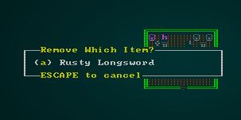
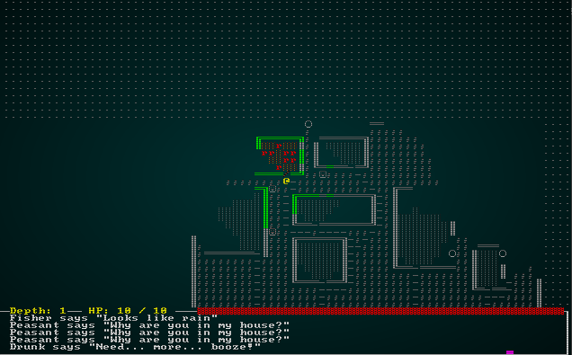

# Game Stats

---

***About this tutorial***

*This tutorial is free and open source, and all code uses the MIT license - so you are free to do with it as you like. My hope is that you will enjoy the tutorial, and make great games!*

*If you enjoy this and would like me to keep writing, please consider supporting [my Patreon](https://www.patreon.com/blackfuture).*

---

In the last chapter, we moved to a d20-style (D&D-like) combat system and attributes system. It's functional, but doesn't really give any opportunity to better your character through gear. Finding cool items, and painstakingly maximizing your efficiency is a bedrock of roguelike games - providing a lot of depth, and a feeling that while the game is random you can heavily influence it to get the results you desire.

## Parsing Dice Strings

We're going to find it very helpful to be able to read a string containing a D&D dice specification (e.g. `20d6+4`) and turn it into computer-friendly numbers. We'll use this a lot when reading the raw files, so we'll put it in there - but make it public in case we need it somewhere else.

Parsing out bit of text like that is a perfect job for *regular expressions*. These are supported in Rust via a crate, so we have to open up our `cargo.toml` and add `regex = "1.3.1"` to our `[dependencies]` section. Actually *teaching* regular expressions would be a book unto itself; it's a hugely complicated (and powerful) system, and has a tendency to look like a cat walked on your keyboard. Here's a regular expression that parses a `1d20+4` type of string:

```regexp
(\d+)d(\d+)([\+\-]\d+)?
```

What on *Earth* does that mean? 

* Each part contained in parentheses `(..)` is a *match group*. You're telling the regular expression that whatever is in those parentheses is important to you, and can be *captured* for reading.
* `\d` is regular-expression speak for "I expect a *digit* here".
* Adding a `+` means "there may be more than one digit here, keep reading until you hit something else.
* Therefore, the first `(\d+)` means "capture all the digits at the front of the string".
* The `d` outside of a group is a *literal* `d` character. So we separate the first set of numbers from subsequent parts with the letter `d`. Now we're up to `1d`.
* The next `(\d+)` works the same way - keep reading digits in, and capture them into the second group. So now we've read up to `1d20` and *captured* `1` and `20` in groups.
* The last group is a bit more confusing. `[..]` means "expect any one of these characters". The backslash (`\`) is *escaping* the subsequent character, meaning "+ or - can mean something in regular expression language; in this case, please just treat it as a symbol". So `[\+\-]` means "expect a plus or a minus here". Then we read however many digits are there.
* So now we've got `1d20+4` broken into `1`, `20`, and `4`.

It's entirely possible that we'll pass a dice type without a `+4`, e.g. `1d20`. In this case, the regex will match the `1` and the `20` - but the last group will be empty.

Here's the Rust for our function:

```rust
pub fn parse_dice_string(dice : &str) -> (i32, i32, i32) {
    lazy_static! {
        static ref DICE_RE : Regex = Regex::new(r"(\d+)d(\d+)([\+\-]\d+)?").unwrap();
    }
    let mut n_dice = 1;
    let mut die_type = 4;
    let mut die_bonus = 0;
    for cap in DICE_RE.captures_iter(dice) {
        if let Some(group) = cap.get(1) {
            n_dice = group.as_str().parse::<i32>().expect("Not a digit");
        }
        if let Some(group) = cap.get(2) {
            die_type = group.as_str().parse::<i32>().expect("Not a digit");
        }
        if let Some(group) = cap.get(3) {
            die_bonus = group.as_str().parse::<i32>().expect("Not a digit");
        }

    }
    (n_dice, die_type, die_bonus)
}
```

Well, that's as clear as mud. Let's walk through and try to decipher it a bit.

1. Regular expressions are *compiled* into their own internal format when first parsed by the Rust Regex library. We don't want to do this every time we try to read a dice string, so we take the advice of [the Rust Cookbook](https://rust-lang-nursery.github.io/rust-cookbook/text/regex.html) and bake reading the expression into a `lazy_static!` (like we used for globals). This way, it'll be parsed just once and the regular expression is ready to use when we need it.
2. We set some mutable variables to the different parts of the dice expression; the number of dice, their type (number of sides) and bonus (which will be negative for a penalty). We give them some defaults in case we have troubles reading the string (or parts thereof).
3. Now we use the `captures_iter` feature of the regex library; we pass it the string we are looking at, and it returns an iterator of all captures (complicated regular expressions might have lots of these). In our case, this returns one *capture* set, which may contain all of the *groups* we discussed above.
4. Now, it's possible that any of the groups won't exist. So we do an `if let` on each capture group. If it *does* exist, we retrieve the string with `as_str` and parse it into an integer - and assign it to the right part of the dice reader.
5. We return all the parts as a tuple.

## Defining melee weaponry

For now, there's no need to change consumables - the system works ok. We're going to focus on *equippable* items: those you can wield, wear or otherwise benefit from. Our previous definition of a "dagger" looked like this:

```json
{
    "name" : "Dagger",
    "renderable": {
        "glyph" : "/",
        "fg" : "#FFAAAA",
        "bg" : "#000000",
        "order" : 2
    },
    "weapon" : {
        "range" : "melee",
        "power_bonus" : 2
    }
},
```

The `power_bonus` is now outmoded; weapons don't work that way anymore. Instead, we want to be able to define D&D-like stats for them. Here's a modernized dagger:

```json
{
    "name" : "Dagger",
    "renderable": {
        "glyph" : "/",
        "fg" : "#FFAAAA",
        "bg" : "#000000",
        "order" : 2
    },
    "weapon" : {
        "range" : "melee",
        "attribute" : "Quickness",
        "base_damage" : "1d4",
        "hit_bonus" : 0
    }
},
```

To support this, in `raws/item_structs.rs` we change the `Weapon` struct:

```rust
#[derive(Deserialize, Debug)]
pub struct Weapon {
    pub range: String,
    pub attribute: String,
    pub base_damage: String,
    pub hit_bonus: i32
}
```

Now open `components.rs`, and we'll change `MeleePowerBonus` (and rename it from `main.rs` and `saveload_system.rs`). We're going to replace it with `MeleeWeapon` that captures these aspects, but in a more machine-friendly format (so we aren't parsing strings all the time):

```rust
#[derive(PartialEq, Copy, Clone, Serialize, Deserialize)]
pub enum WeaponAttribute { Might, Quickness }

#[derive(Component, Serialize, Deserialize, Clone)]
pub struct MeleeWeapon {
    pub attribute : WeaponAttribute,
    pub damage_n_dice : i32,
    pub damage_die_type : i32,
    pub damage_bonus : i32,
    pub hit_bonus : i32
}
```

We've condensed attribute into an `enum` (much faster to read), and broken `1d4+0` into meaning: (1) `damage_n_dice`, (4) `damage_die_type`, plus `damage_bonus`.

We'll also need to change `spawn_named_item` in `raws/rawmaster.rs`:

```rust
if let Some(weapon) = &item_template.weapon {
    eb = eb.with(Equippable{ slot: EquipmentSlot::Melee });
    let (n_dice, die_type, bonus) = parse_dice_string(&weapon.base_damage);
    let mut wpn = MeleeWeapon{
        attribute : WeaponAttribute::Might,
        damage_n_dice : n_dice,
        damage_die_type : die_type,
        damage_bonus : bonus,
        hit_bonus : weapon.hit_bonus
    };
    match weapon.attribute.as_str() {
        "Quickness" => wpn.attribute = WeaponAttribute::Quickness,
        _ => wpn.attribute = WeaponAttribute::Might
    }
    eb = eb.with(wpn);
}
```

That should be enough to read in our nicer weapons format, and have them usable in-game. 

## Starting with a weapon

If you go back to the design document, we stated that you start with some minimal equipment. We'll let you start with your father's rusty longsword. Let's add this to the `spawns.json` file:

```json
{
    "name" : "Rusty Longsword",
    "renderable": {
        "glyph" : "/",
        "fg" : "#BB77BB",
        "bg" : "#000000",
        "order" : 2
    },
    "weapon" : {
        "range" : "melee",
        "attribute" : "Might",
        "base_damage" : "1d8-1",
        "hit_bonus" : -1
    }
},
```

We've darkened the color a bit (it is rusty, after all) and added a `-1` penalty to the sword (to account for its condition). Now, we want it to start with the player. Currently in `spawners.rs`, our `player` function makes the player - and nothing else. We want him/her to start with some initial equipment. Currently, we only allow for spawning items *on the ground*; that won't do (you'd have to remember to pick it up when you start!) - so we'll expand our raw file spawning system to handle it (that's why we had the `SpawnType` enumeration in `mod/rawmaster.rs` - even if it only had one entry!). Let's add `Equipped` and `Carried` to that enum:

```rust
pub enum SpawnType {
    AtPosition { x: i32, y: i32 },
    Equipped { by: Entity, slot : EquipmentSlot },
    Carried { by: Entity }
}
```

We'll also need to update the `spawn_position` function to handle this:

```rust
fn spawn_position(pos : SpawnType, new_entity : EntityBuilder) -> EntityBuilder {
    let mut eb = new_entity;

    // Spawn in the specified location
    match pos {
        SpawnType::AtPosition{x,y} => {
            eb = eb.with(Position{ x, y });
        }
        SpawnType::Carried{by} => {
            eb = eb.with(InBackpack{ owner: by })
        }
        SpawnType::Equipped{by, slot} => {
            eb = eb.with(Equipped{ owner: by, slot })
        }
    }

    eb
}
```

So now we can update the `player` function in `spawners.rs` to start with a rusty longsword:

```rust
pub fn player(ecs : &mut World, player_x : i32, player_y : i32) -> Entity {
    let mut skills = Skills{ skills: HashMap::new() };
    skills.skills.insert(Skill::Melee, 1);
    skills.skills.insert(Skill::Defense, 1);
    skills.skills.insert(Skill::Magic, 1);

    let player = ecs
        .create_entity()
        .with(Position { x: player_x, y: player_y })
        .with(Renderable {
            glyph: rltk::to_cp437('@'),
            fg: RGB::named(rltk::YELLOW),
            bg: RGB::named(rltk::BLACK),
            render_order: 0
        })
        .with(Player{})
        .with(Viewshed{ visible_tiles : Vec::new(), range: 8, dirty: true })
        .with(Name{name: "Player".to_string() })
        .with(HungerClock{ state: HungerState::WellFed, duration: 20 })
        .with(Attributes{
            might: Attribute{ base: 11, modifiers: 0, bonus: attr_bonus(11) },
            fitness: Attribute{ base: 11, modifiers: 0, bonus: attr_bonus(11) },
            quickness: Attribute{ base: 11, modifiers: 0, bonus: attr_bonus(11) },
            intelligence: Attribute{ base: 11, modifiers: 0, bonus: attr_bonus(11) },
        })
        .with(skills)
        .with(Pools{
            hit_points : Pool{ 
                current: player_hp_at_level(11, 1), 
                max: player_hp_at_level(11, 1) 
            },
            mana: Pool{
                current: mana_at_level(11, 1),
                max: mana_at_level(11, 1)
            },
            xp: 0,
            level: 1
        })
        .marked::<SimpleMarker<SerializeMe>>()
        .build();

    // Starting equipment
    spawn_named_entity(
        &RAWS.lock().unwrap(), 
        ecs.create_entity(), 
        "Rusty Longsword", 
        SpawnType::Equipped{by : player, slot: EquipmentSlot::Melee}
    );

    player
}
```

The main changes here are that we put the new entity into a variable named `player`, before turning it. We then use that as the parameter for who is holding the "Rusty Longsword" we spawn via `spawn_named_entity`.

If you `cargo run` now, you'll start with a rusty longsword. It won't *work*, but you have it:



## Making the rusty longsword do some damage

We left a number of placeholders in the `melee_combat_system.rs`. Now, it's time to fill in the weapon gaps. Open up the file, and we'll first add some more types we need:

```rust
impl<'a> System<'a> for MeleeCombatSystem {
    #[allow(clippy::type_complexity)]
    type SystemData = ( Entities<'a>,
                        WriteExpect<'a, GameLog>,
                        WriteStorage<'a, WantsToMelee>,
                        ReadStorage<'a, Name>,
                        ReadStorage<'a, Attributes>,
                        ReadStorage<'a, Skills>,
                        WriteStorage<'a, SufferDamage>,
                        WriteExpect<'a, ParticleBuilder>,
                        ReadStorage<'a, Position>,
                        ReadStorage<'a, HungerClock>,
                        ReadStorage<'a, Pools>,
                        WriteExpect<'a, rltk::RandomNumberGenerator>,
                        ReadStorage<'a, Equipped>,
                        ReadStorage<'a, MeleeWeapon>
                      );

    fn run(&mut self, data : Self::SystemData) {
        let (entities, mut log, mut wants_melee, names, attributes, skills, mut inflict_damage, 
            mut particle_builder, positions, hunger_clock, pools, mut rng,
            equipped_items, meleeweapons) = data;
            ...
```

Then we'll add some code to put in the default weapon information, and then search for a replacement if the attacker has something equipped:

```rust
let mut weapon_info = MeleeWeapon{
    attribute : WeaponAttribute::Might,
    hit_bonus : 0,
    damage_n_dice : 1,
    damage_die_type : 4,
    damage_bonus : 0                    
};

for (wielded,melee) in (&equipped_items, &meleeweapons).join() {
    if wielded.owner == entity && wielded.slot == EquipmentSlot::Melee {
        weapon_info = melee.clone();
    }
}
```

That makes substituting in the weapon-dependent parts of the code quite easy:

```rust
let natural_roll = rng.roll_dice(1, 20);
let attribute_hit_bonus = if weapon_info.attribute == WeaponAttribute::Might 
    { attacker_attributes.might.bonus } 
    else { attacker_attributes.quickness.bonus};
let skill_hit_bonus = skill_bonus(Skill::Melee, &*attacker_skills);
let weapon_hit_bonus = weapon_info.hit_bonus;
```

We can also swap in the weapon's damage information:

```rust
let base_damage = rng.roll_dice(weapon_info.damage_n_dice, weapon_info.damage_die_type);
let attr_damage_bonus = attacker_attributes.might.bonus;
let skill_damage_bonus = skill_bonus(Skill::Melee, &*attacker_skills);
let weapon_damage_bonus = weapon_info.damage_bonus;
```

Now, if you `cargo run` the project you can use your sword to hack the rats into little pieces!



Oh - well that didn't go so well! We were hitting for plenty of damage, but the rats soon overwhelmed us - even doing default damage of `1d4` with a *might* penalty! As you saw in the recording, I tried to retreat with the intention of healing - and noticed that I was hungry (took too long to find the house!) and couldn't. Fortunately, we have everything we need to also add some food to the player's inventory. The design document states that you should be starting with a stein of beer and a dried sausage. Let's put those into `spawns.json`:

```json
{
    "name" : "Dried Sausage",
    "renderable": {
        "glyph" : "%",
        "fg" : "#00FF00",
        "bg" : "#000000",
        "order" : 2
    },
    "consumable" : {
        "effects" : { 
            "food" : ""
        }
    }
},

{
    "name" : "Beer",
    "renderable": {
        "glyph" : "!",
        "fg" : "#FF00FF",
        "bg" : "#000000",
        "order" : 2
    },
    "consumable" : {
        "effects" : { "provides_healing" : "4" }
    }
},
```

The sausage is a copy of "rations" - and cures hunger. The Beer is a super-weak health potion, but these would have been enough to defeat the rodent menace!

Let's modify `player` in `spawner.rs` to also include these in the player's backpack:

```rust
spawn_named_entity(
    &RAWS.lock().unwrap(), 
    ecs.create_entity(), 
    "Dried Sausage", 
    SpawnType::Carried{by : player}
);
spawn_named_entity(
    &RAWS.lock().unwrap(), 
    ecs.create_entity(), 
    "Beer", 
    SpawnType::Carried{by : player}
);
```

Now the player starts with a healing option, and a anti-hunger device (commonly known as food).

## But wait - we're naked, with only a sausage and some beer? I didn't think it was THAT sort of game?

Nobody in the game is currently wearing anything. That's probably ok for the rats, but we weren't envisioning a massively liberal society here for humans. More importantly, we also don't have any armor class bonuses if we don't have anything to wear!

In `components.rs`, we'll replace `DefenseBonus` with `Wearable` - and flesh it out a bit. (Don't forget to change the component in `main.rs` and `saveload_system.rs`):

```rust
#[derive(Component, Serialize, Deserialize, Clone)]
pub struct Wearable {
    pub armor_class : f32
}
```

That's a very simple change. Let's update our raw file reader in `raws/item_structs.rs` to reflect what we want:

```json
{
    "name" : "Shield",
    "renderable": {
        "glyph" : "[",
        "fg" : "#00AAFF",
        "bg" : "#000000",
        "order" : 2
    },
    "wearable" : {
        "slot" : "Shield",
        "armor_class" : 1.0
    }
},
```

We probably also want to support more equipment slots! In `components.rs`, we should update `EquipmentSlot` to handle more possible locations:

```rust
#[derive(PartialEq, Copy, Clone, Serialize, Deserialize)]
pub enum EquipmentSlot { Melee, Shield, Head, Torso, Legs, Feet, Hands }
```

We'll undoubtedly add more later, but that covers the basics. We need to update `raws/item_structs.rs` to reflect the changes:

```rust
#[derive(Deserialize, Debug)]
pub struct Item {
    pub name : String,
    pub renderable : Option<Renderable>,
    pub consumable : Option<Consumable>,
    pub weapon : Option<Weapon>,
    pub wearable : Option<Wearable>
}
...
#[derive(Deserialize, Debug)]
pub struct Wearable {
    pub armor_class: f32,
    pub slot : String
}
```

We'll want to expand our `spawn_named_item` code in `raws/rawmaster.rs` to handle the expanded options:

```rust
if let Some(wearable) = &item_template.wearable {
    let slot = match wearable.slot.as_str() {
        "Shield" => EquipmentSlot::Shield, 
        "Head" => EquipmentSlot::Head,
        "Torso" => EquipmentSlot::Torso, 
        "Legs" => EquipmentSlot::Legs, 
        "Feet" => EquipmentSlot::Feet, 
        "Hands" => EquipmentSlot::Hands,
        _ => EquipmentSlot::Melee
    };
    eb = eb.with(Equippable{ slot });
    eb = eb.with(Wearable{ slot, armor_class: wearable.armor_class });
}
```

Let's make a few more items in `spawns.json` to give the player something to wear:

```json
{
    "name" : "Stained Tunic",
    "renderable": {
        "glyph" : "[",
        "fg" : "#00FF00",
        "bg" : "#000000",
        "order" : 2
    },
    "wearable" : {
        "slot" : "Torso",
        "armor_class" : 0.1
    }
},

{
    "name" : "Torn Trousers",
    "renderable": {
        "glyph" : "[",
        "fg" : "#00FFFF",
        "bg" : "#000000",
        "order" : 2
    },
    "wearable" : {
        "slot" : "Legs",
        "armor_class" : 0.1
    }
},

{
    "name" : "Old Boots",
    "renderable": {
        "glyph" : "[",
        "fg" : "#FF9999",
        "bg" : "#000000",
        "order" : 2
    },
    "wearable" : {
        "slot" : "Legs",
        "armor_class" : 0.1
    }
}
```

Now we'll open up `spawner.rs` and add these items to the player:

```rust
spawn_named_entity(&RAWS.lock().unwrap(), ecs.create_entity(), "Rusty Longsword", 
    SpawnType::Equipped{by : player, slot: EquipmentSlot::Melee}
);
spawn_named_entity(&RAWS.lock().unwrap(), ecs.create_entity(), "Dried Sausage", 
    SpawnType::Carried{by : player}
);
spawn_named_entity(&RAWS.lock().unwrap(), ecs.create_entity(), "Beer", 
    SpawnType::Carried{by : player}
);
spawn_named_entity(&RAWS.lock().unwrap(), ecs.create_entity(), "Stained Tunic", 
    SpawnType::Equipped{by : player, slot: EquipmentSlot::Torso}
);
spawn_named_entity(&RAWS.lock().unwrap(), ecs.create_entity(), "Torn Trousers", 
    SpawnType::Equipped{by : player, slot: EquipmentSlot::Legs}
);
spawn_named_entity(&RAWS.lock().unwrap(), ecs.create_entity(), "Old Boots", 
    SpawnType::Equipped{by : player, slot: EquipmentSlot::Feet}
);
```

If you run the game now, checking your inventory and removing items will show you that you are starting correctly - with your stained shirt, torn trousers, old boots, beer, sausage and a rusty sword.

We still have one more thing to do with wearables; `melee_system.rs` needs to know how to calculate armor class. Fortunately, this is quite easy:

```rust
let mut armor_item_bonus_f = 0.0;
for (wielded,armor) in (&equipped_items, &wearables).join() {
    if wielded.owner == wants_melee.target {
        armor_item_bonus_f += armor.armor_class;
    }
}
let base_armor_class = 10;
let armor_quickness_bonus = target_attributes.quickness.bonus;
let armor_skill_bonus = skill_bonus(Skill::Defense, &*target_skills);
let armor_item_bonus = armor_item_bonus_f as i32;
```

We iterate through equipped armor, and add the bonus together for each item that is worn by the defender. Then we truncate the number down to an integer.

So why *are* we using floating point numbers? Classic D&D assigns armor values to complete sets of armor. So in 5th Edition, leather armor has an AC of 11 (plus dexterity). In our game, you can wear the pieces of leather armor separately - so we give them a value equivalent to *part* of the desired AC for a full set. Then we add them together, to handle piecemeal armor (you found a nice breastplate and only leather leggings, for example).

## Ok, so I'm wearing clothes - why isn't everyone else?

We've got far enough in implementing clothing and weaponry that we can start to give it to NPCs. Since the Barkeep is our favorite test victim, lets decorate his entry with how we'd *like* to spawn items:

```json
{
    "name" : "Barkeep",
    "renderable": {
        "glyph" : "☺",
        "fg" : "#EE82EE",
        "bg" : "#000000",
        "order" : 1
    },
    "blocks_tile" : true,
    "vision_range" : 4,
    "ai" : "vendor",
    "attributes" : {
        "intelligence" : 13
    },
    "skills" : {
        "Melee" : 2
    },
    "equipped" : [ "Cudgel", "Cloth Tunic", "Cloth Pants", "Slippers" ]
},
```

Easy enough: we've added an array called `equipped`, and list out everything we'd like the barkeep to wear. Of course, we now have to *write* those items.

```json
{
    "name" : "Cudgel",
    "renderable": {
        "glyph" : "/",
        "fg" : "#A52A2A",
        "bg" : "#000000",
        "order" : 2
    },
    "weapon" : {
        "range" : "melee",
        "attribute" : "Quickness",
        "base_damage" : "1d4",
        "hit_bonus" : 0
    }
},

{
    "name" : "Cloth Tunic",
    "renderable": {
        "glyph" : "[",
        "fg" : "#00FF00",
        "bg" : "#000000",
        "order" : 2
    },
    "wearable" : {
        "slot" : "Torso",
        "armor_class" : 0.1
    }
},

{
    "name" : "Cloth Pants",
    "renderable": {
        "glyph" : "[",
        "fg" : "#00FFFF",
        "bg" : "#000000",
        "order" : 2
    },
    "wearable" : {
        "slot" : "Legs",
        "armor_class" : 0.1
    }
},

{
    "name" : "Slippers",
    "renderable": {
        "glyph" : "[",
        "fg" : "#FF9999",
        "bg" : "#000000",
        "order" : 2
    },
    "wearable" : {
        "slot" : "Legs",
        "armor_class" : 0.1
    }
}
```

There's nothing *new* there, just data-entry. We need to modify our `raws/mob_structs.rs` file to accommodate giving NPCs equipment:

```rust
#[derive(Deserialize, Debug)]
pub struct Mob {
    pub name : String,
    pub renderable : Option<Renderable>,
    pub blocks_tile : bool,
    pub vision_range : i32,
    pub ai : String,
    pub quips : Option<Vec<String>>,
    pub attributes : MobAttributes,
    pub skills : Option<HashMap<String, i32>>,
    pub level : Option<i32>,
    pub hp : Option<i32>,
    pub mana : Option<i32>,
    pub equipped : Option<Vec<String>>
}
```

Again, easy enough - we optionally provide a list of strings (representing item name tags) to the mob. So we have to modify `spawn_named_mob` in `raws/rawmaster.rs` to handle this:

```rust

```

## What about natural attacks?

## Wrap-Up

**The source code for this chapter may be found [here](https://github.com/thebracket/rustrogueliketutorial/tree/master/chapter-51-gear)**


[Run this chapter's example with web assembly, in your browser (WebGL2 required)](http://bfnightly.bracketproductions.com/rustbook/wasm/chapter-51-gear)
---

Copyright (C) 2019, Herbert Wolverson.

---