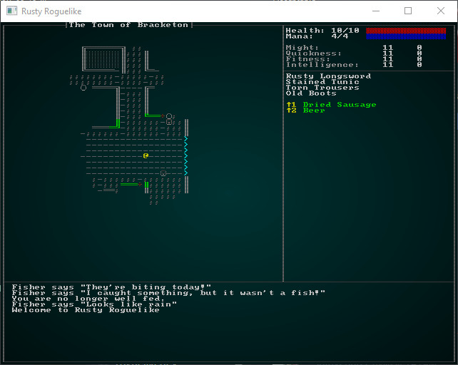
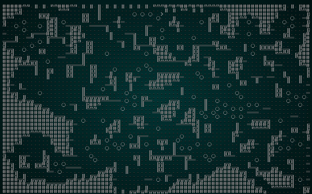
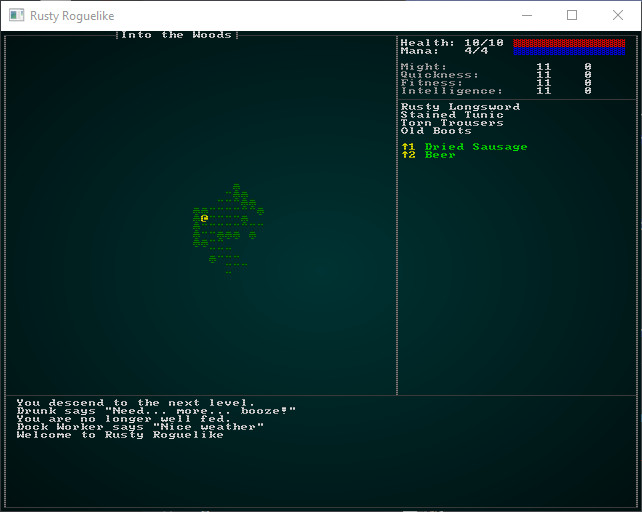
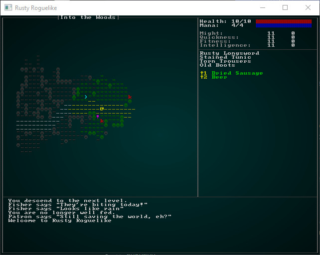
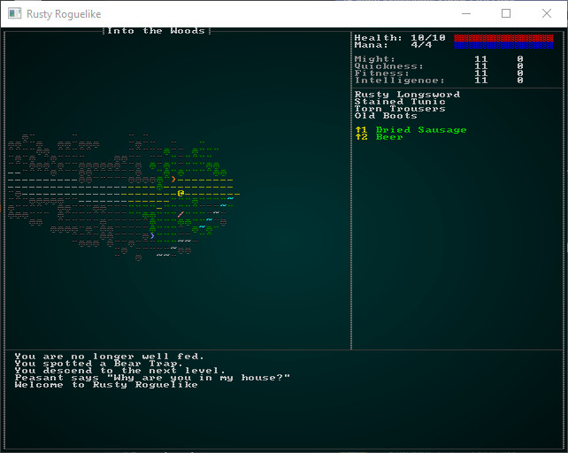
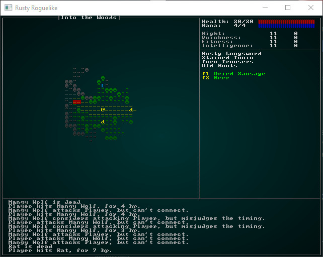
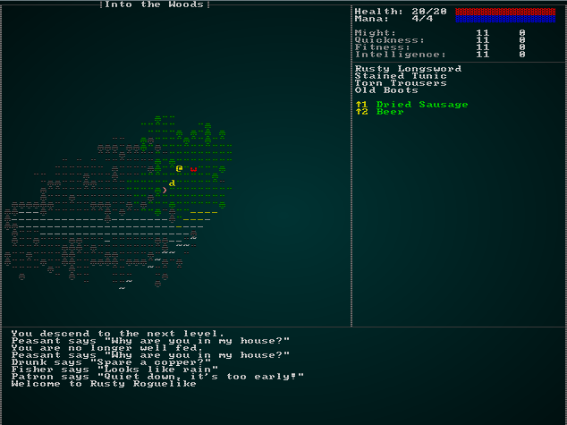
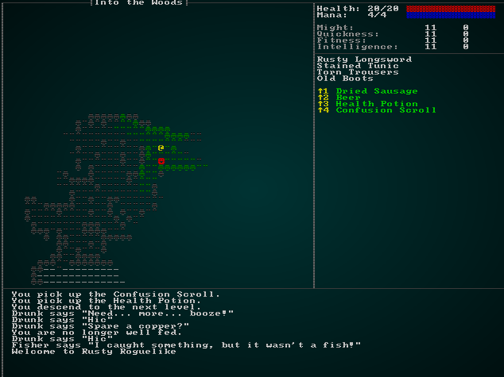

# Into the Woods!

---

***About this tutorial***

*This tutorial is free and open source, and all code uses the MIT license - so you are free to do with it as you like. My hope is that you will enjoy the tutorial, and make great games!*

*If you enjoy this and would like me to keep writing, please consider supporting [my Patreon](https://www.patreon.com/blackfuture).*

---

We've spend a few chapters improving the basic game, its interface, and the starting town. That's fun, and we could honestly keep improving it for *many* chapters - but it's a good idea when developing to see some real progress. Otherwise, you tend to get demotivated! So for this chapter, we're going to add the next level to the game, populate it, and tackle the concept of *themes* to differentiate levels.

## Into the woods!

Our design document says that we go from the town to a limestone cavern. That's a good start, but it's quite unlikely that you would transition from one to the other with nothing in-between; otherwise, *everyone* would go there! So we're going to add a forest next to the town of Bracketon, with a cave entrance to the main adventure. A road runs through the woods, which is where *everyone else* typically goes (those who aren't set on trying to save the world, which is most people!).

Let's start by moving the exit from Bracketon to cover the whole east side. In `town.rs`, find the line placing the exit (it's around line 36), and replace with:

```rust
for y in wall_gap_y-3 .. wall_gap_y + 4 {
    let exit_idx = build_data.map.xy_idx(build_data.width-2, y);
    build_data.map.tiles[exit_idx] = TileType::DownStairs;        
}
```

This fills the whole road out of town with exit tiles:



This has one primary advantage: it's *really* hard to miss!

## Building the woods

Now we want to start on the second level. In `map_builders/mod.rs` we have the function `level_builder`; lets add a new call in there for the second level:

```rust
pub fn level_builder(new_depth: i32, rng: &mut rltk::RandomNumberGenerator, width: i32, height: i32) -> BuilderChain {
    println!("Depth: {}", new_depth);
    match new_depth {
        1 => town_builder(new_depth, rng, width, height),
        2 => forest_builder(new_depth, rng, width, height),
        _ => random_builder(new_depth, rng, width, height)
    }
}
```

To implement this, we'll make a new file - `map_builders/forest.rs` and give it some placeholder content (just like we did for the town):

```rust
use super::{BuilderChain, CellularAutomataBuilder, XStart, YStart, AreaStartingPosition, 
    CullUnreachable, VoronoiSpawning, DistantExit};

pub fn forest_builder(new_depth: i32, _rng: &mut rltk::RandomNumberGenerator, width: i32, height: i32) -> BuilderChain {
    let mut chain = BuilderChain::new(new_depth, width, height, "Into the Woods");
    chain.start_with(CellularAutomataBuilder::new());
    chain.with(AreaStartingPosition::new(XStart::CENTER, YStart::CENTER));
    chain.with(CullUnreachable::new());
    chain.with(AreaStartingPosition::new(XStart::LEFT, YStart::CENTER));

    // Setup an exit and spawn mobs
    chain.with(VoronoiSpawning::new());
    chain.with(DistantExit::new());
    chain
}
```

Also, don't forget to add `mod forest; use forest::forest_builder` to your `map_builders/mod.rs` file! If you run this, you'll see that we have a basic cellular automata dungeon:



That's isn't really what we want... or is it? It does look a bit forest like in *shape* - but rendering it with wall graphics everywhere doesn't give the impression that you are in a forest.

## Themes

You *could* make all new tiles, and have the forest generator spit them out - but that's duplicating a lot of code just to change appearance. A better approach would be to support *themes*. So the town uses one look, the forest uses another - but they share basic functionality such as walls blocking movement. Now we reveal why we made `map` into a multi-file module: we're going to build a theming engine! Create a new file, `map/themes.rs` and we'll put in a default function and our existing tile selection code (from `camera.rs`):

```rust
use super::{Map, TileType};
use rltk::RGB;

pub fn tile_glyph(idx: usize, map : &Map) -> (u8, RGB, RGB) {
    let (glyph, mut fg, mut bg) = match map.depth {
        2 => get_forest_glyph(idx, map),
        _ => get_tile_glyph_default(idx, map)
    };

    if map.bloodstains.contains(&idx) { bg = RGB::from_f32(0.75, 0., 0.); }
    if !map.visible_tiles[idx] { 
        fg = fg.to_greyscale();
        bg = RGB::from_f32(0., 0., 0.); // Don't show stains out of visual range
    }

    (glyph, fg, bg)
}

fn get_tile_glyph_default(idx: usize, map : &Map) -> (u8, RGB, RGB) {
    let glyph;
    let fg;
    let bg = RGB::from_f32(0., 0., 0.);

    match map.tiles[idx] {
        TileType::Floor => { glyph = rltk::to_cp437('.'); fg = RGB::from_f32(0.0, 0.5, 0.5); }
        TileType::WoodFloor => { glyph = rltk::to_cp437('░'); fg = RGB::named(rltk::CHOCOLATE); }
        TileType::Wall => {
            let x = idx as i32 % map.width;
            let y = idx as i32 / map.width;
            glyph = wall_glyph(&*map, x, y);
            fg = RGB::from_f32(0., 1.0, 0.);
        }
        TileType::DownStairs => { glyph = rltk::to_cp437('>'); fg = RGB::from_f32(0., 1.0, 1.0); }
        TileType::Bridge => { glyph = rltk::to_cp437('.'); fg = RGB::named(rltk::CHOCOLATE); }
        TileType::Road => { glyph = rltk::to_cp437('≡'); fg = RGB::named(rltk::GRAY); }
        TileType::Grass => { glyph = rltk::to_cp437('"'); fg = RGB::named(rltk::GREEN); }
        TileType::ShallowWater => { glyph = rltk::to_cp437('~'); fg = RGB::named(rltk::CYAN); }
        TileType::DeepWater => { glyph = rltk::to_cp437('~'); fg = RGB::named(rltk::BLUE); }
        TileType::Gravel => { glyph = rltk::to_cp437(';'); fg = RGB::from_f32(0.5, 0.5, 0.5); }
    }

    (glyph, fg, bg)
}

fn wall_glyph(map : &Map, x: i32, y:i32) -> u8 {
    if x < 1 || x > map.width-2 || y < 1 || y > map.height-2 as i32 { return 35; }
    let mut mask : u8 = 0;

    if is_revealed_and_wall(map, x, y - 1) { mask +=1; }
    if is_revealed_and_wall(map, x, y + 1) { mask +=2; }
    if is_revealed_and_wall(map, x - 1, y) { mask +=4; }
    if is_revealed_and_wall(map, x + 1, y) { mask +=8; }

    match mask {
        0 => { 9 } // Pillar because we can't see neighbors
        1 => { 186 } // Wall only to the north
        2 => { 186 } // Wall only to the south
        3 => { 186 } // Wall to the north and south
        4 => { 205 } // Wall only to the west
        5 => { 188 } // Wall to the north and west
        6 => { 187 } // Wall to the south and west
        7 => { 185 } // Wall to the north, south and west
        8 => { 205 } // Wall only to the east
        9 => { 200 } // Wall to the north and east
        10 => { 201 } // Wall to the south and east
        11 => { 204 } // Wall to the north, south and east
        12 => { 205 } // Wall to the east and west
        13 => { 202 } // Wall to the east, west, and south
        14 => { 203 } // Wall to the east, west, and north
        _ => { 35 } // We missed one?
    }
}

fn is_revealed_and_wall(map: &Map, x: i32, y: i32) -> bool {
    let idx = map.xy_idx(x, y);
    map.tiles[idx] == TileType::Wall && map.revealed_tiles[idx]
}
```

In `map/mod.rs` add `mod themes; pub use themes::*` to add it to your project.

Now we'll modify `camera.rs` by deleting these functions, and importing the map themes instead. Delete `get_tile_glyph`, `wall_glyph` and `is_revealed_and_wall`. At the top, add `use crate::map::tile_glyph` and change the two render functions to use it:

```rust
let (glyph, fg, bg) = tile_glyph(idx, &*map);
```

This has two nice effects: your camera is now *just* a camera, and you have the ability to change your theme per level!

## Building a forest theme

In `themes.rs`, lets extend the `tile_glyph` function to branch to a separate forest theme for level 2:

```rust
pub fn tile_glyph(idx: usize, map : &Map) -> (u8, RGB, RGB) {
    match map.depth {
        2 => get_forest_glyph(idx, map),
        _ => get_tile_glyph_default(idx, map)
    }
}
```

Now, of course, we have to *write* `get_forest_glyph`:

```rust
fn get_forest_glyph(idx:usize, map: &Map) -> (u8, RGB, RGB) {
    let glyph;
    let fg;
    let bg = RGB::from_f32(0., 0., 0.);

    match map.tiles[idx] {
        TileType::Wall => { glyph = rltk::to_cp437('♣'); fg = RGB::from_f32(0.0, 0.6, 0.0); }
        TileType::Bridge => { glyph = rltk::to_cp437('.'); fg = RGB::named(rltk::CHOCOLATE); }
        TileType::Road => { glyph = rltk::to_cp437('≡'); fg = RGB::named(rltk::YELLOW); }
        TileType::Grass => { glyph = rltk::to_cp437('"'); fg = RGB::named(rltk::GREEN); }
        TileType::ShallowWater => { glyph = rltk::to_cp437('~'); fg = RGB::named(rltk::CYAN); }
        TileType::DeepWater => { glyph = rltk::to_cp437('~'); fg = RGB::named(rltk::BLUE); }
        TileType::Gravel => { glyph = rltk::to_cp437(';'); fg = RGB::from_f32(0.5, 0.5, 0.5); }
        TileType::DownStairs => { glyph = rltk::to_cp437('>'); fg = RGB::from_f32(0., 1.0, 1.0); }
        _ => { glyph = rltk::to_cp437('"'); fg = RGB::from_f32(0.0, 0.6, 0.0); }
    }

    (glyph, fg, bg)
}
```

`cargo run` now, and you'll see that the visual change made a *huge* difference - it now looks like a forest!



## Follow the yellow-brick road

We specified that a roads runs through the level, but we don't have a builder for that! Let's make one and add it to the builder chain. First, we'll modify the builder chain - get rid of the `DistantExit` part and add a new `YellowBrickRoad` stage:

```rust
pub fn forest_builder(new_depth: i32, _rng: &mut rltk::RandomNumberGenerator, width: i32, height: i32) -> BuilderChain {
    let mut chain = BuilderChain::new(new_depth, width, height, "Into the Woods");
    chain.start_with(CellularAutomataBuilder::new());
    chain.with(AreaStartingPosition::new(XStart::CENTER, YStart::CENTER));
    chain.with(CullUnreachable::new());
    chain.with(AreaStartingPosition::new(XStart::LEFT, YStart::CENTER));
    chain.with(VoronoiSpawning::new());
    chain.with(YellowBrickRoad::new());
    chain
}
```

Then we'll implement `YellowBrickRoad`:

```rust
pub struct YellowBrickRoad {}

impl MetaMapBuilder for YellowBrickRoad {
    fn build_map(&mut self, rng: &mut rltk::RandomNumberGenerator, build_data : &mut BuilderMap)  {
        self.build(rng, build_data);
    }
}

impl YellowBrickRoad {
    #[allow(dead_code)]
    pub fn new() -> Box<YellowBrickRoad> {
        Box::new(YellowBrickRoad{})
    }

    fn find_exit(&self, build_data : &mut BuilderMap, seed_x : i32, seed_y: i32) -> (i32, i32) {
        let mut available_floors : Vec<(usize, f32)> = Vec::new();
        for (idx, tiletype) in build_data.map.tiles.iter().enumerate() {
            if map::tile_walkable(*tiletype) {
                available_floors.push(
                    (
                        idx,
                        rltk::DistanceAlg::PythagorasSquared.distance2d(
                            rltk::Point::new(idx as i32 % build_data.map.width, idx as i32 / build_data.map.width),
                            rltk::Point::new(seed_x, seed_y)
                        )
                    )
                );
            }
        }
        if available_floors.is_empty() {
            panic!("No valid floors to start on");
        }

        available_floors.sort_by(|a,b| a.1.partial_cmp(&b.1).unwrap());

        let end_x = available_floors[0].0 as i32 % build_data.map.width;
        let end_y = available_floors[0].0 as i32 / build_data.map.width;
        (end_x, end_y)
    }

    fn paint_road(&self, build_data : &mut BuilderMap, x: i32, y: i32) {
        if x < 1 || x > build_data.map.width-2 || y < 1 || y > build_data.map.height-2 {
            return;
        }
        let idx = build_data.map.xy_idx(x, y);
        if build_data.map.tiles[idx] != TileType::DownStairs {
            build_data.map.tiles[idx] = TileType::Road;
        }
    }

    fn build(&mut self, rng : &mut RandomNumberGenerator, build_data : &mut BuilderMap) {
        let starting_pos = build_data.starting_position.as_ref().unwrap().clone();
        let start_idx = build_data.map.xy_idx(starting_pos.x, starting_pos.y);

        let (end_x, end_y) = self.find_exit(build_data, build_data.map.width - 2, build_data.map.height / 2);
        let end_idx = build_data.map.xy_idx(end_x, end_y);
        build_data.map.tiles[end_idx] = TileType::DownStairs;

        build_data.map.populate_blocked();
        let path = rltk::a_star_search(start_idx, end_idx, &mut build_data.map);
        //if !path.success {
        //    panic!("No valid path for the road");
        //}
        for idx in path.steps.iter() {
            let x = *idx as i32 % build_data.map.width;
            let y = *idx as i32 / build_data.map.width;
            self.paint_road(build_data, x, y);
            self.paint_road(build_data, x-1, y);
            self.paint_road(build_data, x+1, y);
            self.paint_road(build_data, x, y-1);
            self.paint_road(build_data, x, y+1);
        }
        build_data.take_snapshot();
    }
}
```

This builder combines a few concepts we've already implemented:

* `find_exit` is just like the `AreaStartingPoint` builder, but finds an area close to the provided "seed" location and returns it. We'll give it a central-east seed point, and use the result as a destination for the road, since we've started in the west.
* `paint_road` checks to see if a tile is within the map bounds, and if it isn't a down staircase - paints it as a road.
* `build` calls `a_star_search` to find an efficient path from west to east. It then paints a 3x3 road all along the path.

The result is a forest with a yellow road going to the East. Of course, there isn't *actually* an exit yet (and you are highly likely to be murdered by kobolds, goblins and orcs)!



## Adding an exit - and some breadcrumbs

Now we'll hide the exit somewhere in the north-east of the map - or the south-east, we'll pick randomly! Hiding it provides an element of exploration, but not giving the user a clue (especially when the road is essentially a red herring) as to the location is a good way to frustrate your players! We know that the destination is a limestone cave, and limestone caves generally happen because of water - so it stands to reason that there should be a water source in/around the cave. We'll add a stream to the map! Add the following to your `build` function:

```rust
// Place exit
let exit_dir = rng.roll_dice(1, 2);
let (seed_x, seed_y, stream_startx, stream_starty) = if exit_dir == 1 {
    (build_data.map.width-1, 1, 0, build_data.height-1)
} else {
    (build_data.map.width-1, build_data.height-1, 1, build_data.height-1)
};

let (stairs_x, stairs_y) = self.find_exit(build_data, seed_x, seed_y);
let stairs_idx = build_data.map.xy_idx(stairs_x, stairs_y);
build_data.take_snapshot();

let (stream_x, stream_y) = self.find_exit(build_data, stream_startx, stream_starty);
let stream_idx = build_data.map.xy_idx(stream_x, stream_y) as usize;
let stream = rltk::a_star_search(stairs_idx, stream_idx, &mut build_data.map);
for tile in stream.steps.iter() {
    if build_data.map.tiles[*tile as usize] == TileType::Floor {
        build_data.map.tiles[*tile as usize] = TileType::ShallowWater;
    }
}
build_data.map.tiles[stairs_idx] = TileType::DownStairs;
build_data.take_snapshot();
```

This randomly picks an exit location (from NE and SE), and then adds a stream in the opposite direction. Once again, we use path-finding to place the stream - so we don't disturb the overall layout too much. Then we place the exit stairs.

## But - I keep getting murdered by orcs!

We've left the default spawning to happen, with no concern for updating the monsters for our level! Our player is probably *very* low level, especially given that we won't implement levelling up until the next chapter. *ahem*. Anyway, we should introduce some beginner-friendly spawns and adjust the spawn locations of our other enemies. Take a look at `spawns.json` once again, and we'll go straight to the spawn tables at the top. We'll start by adjusting the `min_depth` entries for things we don't want to see yet:

```json
"spawn_table" : [
    { "name" : "Goblin", "weight" : 10, "min_depth" : 3, "max_depth" : 100 },
    { "name" : "Orc", "weight" : 1, "min_depth" : 3, "max_depth" : 100, "add_map_depth_to_weight" : true },
    { "name" : "Health Potion", "weight" : 7, "min_depth" : 0, "max_depth" : 100 },
    { "name" : "Fireball Scroll", "weight" : 2, "min_depth" : 0, "max_depth" : 100, "add_map_depth_to_weight" : true },
    { "name" : "Confusion Scroll", "weight" : 2, "min_depth" : 0, "max_depth" : 100, "add_map_depth_to_weight" : true },
    { "name" : "Magic Missile Scroll", "weight" : 4, "min_depth" : 0, "max_depth" : 100 },
    { "name" : "Dagger", "weight" : 3, "min_depth" : 0, "max_depth" : 100 },
    { "name" : "Shield", "weight" : 3, "min_depth" : 0, "max_depth" : 100 },
    { "name" : "Longsword", "weight" : 1, "min_depth" : 3, "max_depth" : 100 },
    { "name" : "Tower Shield", "weight" : 1, "min_depth" : 3, "max_depth" : 100 },
    { "name" : "Rations", "weight" : 10, "min_depth" : 0, "max_depth" : 100 },
    { "name" : "Magic Mapping Scroll", "weight" : 2, "min_depth" : 0, "max_depth" : 100 },
    { "name" : "Bear Trap", "weight" : 5, "min_depth" : 0, "max_depth" : 100 },
    { "name" : "Battleaxe", "weight" : 1, "min_depth" : 2, "max_depth" : 100 },
    { "name" : "Kobold", "weight" : 15, "min_depth" : 3, "max_depth" : 3 }
],
```

See how none of the monsters appear before depth 3? If you `cargo run` now, you'll have a "Monty Haul" (this was an old TV show about getting free stuff; it became a D&D term for "too easy, too much treasure") of a forest - free stuff everywhere and nary a bit of risk to be seen. We *want* the player to find some useful items, but we also want *some* risk! It's not much of a game if you just win every time!



## Adding some woodland beasties

What would you expect to find in a beginner-friendly wood? Probably rats, wolves, foxes, various edible-but-harmless wildlife (such as deer) and maybe some travelers. You might even encounter a bear, but it would be very scary at this level! We already have rats, so lets just add them to the spawn table:

```json
{ "name" : "Rat", "weight" : 15, "min_depth" : 2, "max_depth" : 3 }
```

We can add wolves by copy/pasting the rat and editing a bit:

```json
{
    "name" : "Mangy Wolf",
    "renderable": {
        "glyph" : "w",
        "fg" : "#FF0000",
        "bg" : "#000000",
        "order" : 1
    },
    "blocks_tile" : true,
    "vision_range" : 8,
    "ai" : "melee",
    "attributes" : {
        "Might" : 3,
        "Fitness" : 3
    },
    "skills" : {
        "Melee" : -1,
        "Defense" : -1
    },
    "natural" : {
        "armor_class" : 12,
        "attacks" : [
            { "name" : "bite", "hit_bonus" : 0, "damage" : "1d6" }
        ]   
    }
},
```

We'd like them to be less frequent than rats, so lets put them into the spawn table, too - but with a lower weight:

```json
{ "name" : "Mangy Wolf", "weight" : 13, "min_depth" : 2, "max_depth" : 3 }
```

We could make a nasty fox, too. Again, it's secretly quite rat-like!

```json
{
    "name" : "Fox",
    "renderable": {
        "glyph" : "f",
        "fg" : "#FF0000",
        "bg" : "#000000",
        "order" : 1
    },
    "blocks_tile" : true,
    "vision_range" : 8,
    "ai" : "melee",
    "attributes" : {
        "Might" : 3,
        "Fitness" : 3
    },
    "skills" : {
        "Melee" : -1,
        "Defense" : -1
    },
    "natural" : {
        "armor_class" : 11,
        "attacks" : [
            { "name" : "bite", "hit_bonus" : 0, "damage" : "1d4" }
        ]   
    }
},
```

And add the fox to the spawn table, too:

```json
{ "name" : "Fox", "weight" : 15, "min_depth" : 2, "max_depth" : 3 }
```

## It's still too hard - lets give the player more health!

Ok, so we're still getting murdered far too often. Let's give the poor player some more hit points! Open `gamesystem.rs` and edit `player_hp_at_level` to add 10 more HP:

```rust
pub fn player_hp_at_level(fitness:i32, level:i32) -> i32 {
    10 + (player_hp_per_level(fitness) * level)
}
```

In a real game, you'll find yourself tweaking this stuff a *lot* until you get the right feeling of balance!

## Adding in some harmless beasties

Not *everything* in a typical forest is trying to kill you (unless you live in Australia, I'm told). Let's start by making a deer and giving it `bystander` AI so it won't hurt anyone:

```json
{
    "name" : "Deer",
    "renderable": {
        "glyph" : "d",
        "fg" : "#FFFF00",
        "bg" : "#000000",
        "order" : 1
    },
    "blocks_tile" : true,
    "vision_range" : 8,
    "ai" : "bystander",
    "attributes" : {
        "Might" : 3,
        "Fitness" : 3
    },
    "skills" : {
        "Melee" : -1,
        "Defense" : -1
    },
    "natural" : {
        "armor_class" : 11,
        "attacks" : [
            { "name" : "bite", "hit_bonus" : 0, "damage" : "1d4" }
        ]   
    }
},
```

And adding it to the spawn table:

```json
{ "name" : "Deer", "weight" : 14, "min_depth" : 2, "max_depth" : 3 }
```

If you `cargo run` now, you'll encounter a plethora of life in the forest - and deer will roam randomly, not doing much.



## But Venison is Tasty!

The problem with making deer use the `bystander` system is that they roam stupidly, and neither you - nor the wolves - can eat them. On a larger level, you can't eat the wolves either (not that they would taste good). Nor can you sell their pelts, or otherwise profit from their slaughter!

It seems like there are really *three* issues here:

* When we kill things, they should (sometimes) drop loot for us to use.
* Deer need their own AI.
* Wolves need to want to eat deer, which probably requires that they have their own AI too.

### Loot Dropping

A good start would be that when we kill an entity, it has a chance to drop whatever it is carrying. Open up `damage_system.rs`, and we'll add a stage to `delete_the_dead` (after we determine who is dead, and before we delete them):

```rust
// Drop everything held by dead people
{
    let mut to_drop : Vec<(Entity, Position)> = Vec::new();
    let entities = ecs.entities();
    let mut equipped = ecs.write_storage::<Equipped>();
    let mut carried = ecs.write_storage::<InBackpack>();
    let mut positions = ecs.write_storage::<Position>();
    for victim in dead.iter() {        
        for (entity, equipped) in (&entities, &equipped).join() {
            if equipped.owner == *victim {
                // Drop their stuff
                let pos = positions.get(*victim);
                if let Some(pos) = pos {
                    to_drop.push((entity, pos.clone()));
                }
            }
        }
        for (entity, backpack) in (&entities, &carried).join() {
            if backpack.owner == *victim {
                // Drop their stuff
                let pos = positions.get(*victim);
                if let Some(pos) = pos {
                    to_drop.push((entity, pos.clone()));
                }
            }
        }
    }

    for drop in to_drop.iter() {
        equipped.remove(drop.0);
        carried.remove(drop.0);
        positions.insert(drop.0, drop.1.clone()).expect("Unable to insert position");
    }
}
```

So this code searches the `Equipped` and `InBackpack` component stores for the entity who died, and lists the entity's position and the item in a vector. It then iterates the vector, removing any `InBackpack` and `Equipped` tags from the item - and adding a position on the ground. The net result of this is that when someone dies - their stuff drops to the floor. That's a good start, although well-equipped entities may be leaving a *lot* of stuff lying around. We'll worry about that later.

So with this code, you *could* spawn everything you want an entity to drop as something they carry around. It would be a little odd, conceptually (I guess deer *do* carry around meat...) - but it'd work. However, we may not want *every* deer to drop the same thing. Enter: *Loot tables*!

### Loot Tables

It's nice to have a bit of control over what items drop where. There's a split in games between "wolves drop anything" (even armor!) and a more realistic "wolves drop pelts and meat". Loot tables let you make this determination yourself.

We'll start by opening up `spawns.json` and building a prototype for what we'd like our loot table structure to look like. We'll try to make it similar to the *spawn table* - so we can make use of the same `RandomTable` infrastructure. Here's what I came up with:

```json
"loot_tables" : [
    { "name" : "Animal",
      "drops" : [
          { "name" : "Hide", "weight" : 10 },
          { "name" : "Meat", "weight" : 10 }
      ]
    }
],
```

This is a little more complex than the spawn table, because we want to have *multiple* loot tables. So breaking this down:

* We have an outer container, `loot_tables` - which holds a number of tables.
* Tables have a `name` (to identify it) and a set of `drops` - items that can "drop" when the loot table is activated.
* Each entry in `drops` consists of a `name` (matching an item in the items list) and a `weight` - just like the weight for random spawns.

So really, it's multiple - named - tables inside a single array. Now we have to *read* it; we'll open up the `raws` directory and make a new file: `raws/loot_structs.rs`. This is designed to match the content of the loot tables structure:

```rust
use serde::{Deserialize};

#[derive(Deserialize, Debug)]
pub struct LootTable {
    pub name : String,
    pub drops : Vec<LootDrop>
}

#[derive(Deserialize, Debug)]
pub struct LootDrop {
    pub name : String,
    pub weight : i32
}
```

This is pretty much the same as the JSON version, just in Rust. Once again, we're describing the structure we're attempting to read, and letting `Serde` - the serialization library - handle converting between the two. Then we open up `raws/mod.rs` and add:

```rust
mod loot_structs;
use loot_structs::*;
```

At the top, and extend the `Raws` structure to include the loot table:

```rust
#[derive(Deserialize, Debug)]
pub struct Raws {
    pub items : Vec<Item>,
    pub mobs : Vec<Mob>,
    pub props : Vec<Prop>,
    pub spawn_table : Vec<SpawnTableEntry>,
    pub loot_tables : Vec<LootTable>
}
```

We need to add it to the constructor in `rawmaster.rs`, too:

```rust
impl RawMaster {
    pub fn empty() -> RawMaster {
        RawMaster {
            raws : Raws{ 
                items: Vec::new(), 
                mobs: Vec::new(), 
                props: Vec::new(), 
                spawn_table: Vec::new(),
                loot_tables: Vec::new()
            },
            item_index : HashMap::new(),
            mob_index : HashMap::new(),
            prop_index : HashMap::new(),
        }
    }
    ...
```

That's enough to *read* the loot tables - but we actually need to *use* them! We'll start by adding another index to `RawMaster` (in `raws/rawmaster.rs`):

```rust
pub struct RawMaster {
    raws : Raws,
    item_index : HashMap<String, usize>,
    mob_index : HashMap<String, usize>,
    prop_index : HashMap<String, usize>,
    loot_index : HashMap<String, usize>
}
```

We also have to add `loot_index : HashMap::new()` to the `RawMaster::new` function, and add a reader to the `load` function:

```rust
for (i,loot) in self.raws.loot_tables.iter().enumerate() {
    self.loot_index.insert(loot.name.clone(), i);
}
```

Next, we need to give mobs the *option* of having a loot table entry. So we open up `mob_structs.rs` and add it to the `Mob` struct:

```rust
#[derive(Deserialize, Debug)]
pub struct Mob {
    pub name : String,
    pub renderable : Option<Renderable>,
    pub blocks_tile : bool,
    pub vision_range : i32,
    pub ai : String,
    pub quips : Option<Vec<String>>,
    pub attributes : MobAttributes,
    pub skills : Option<HashMap<String, i32>>,
    pub level : Option<i32>,
    pub hp : Option<i32>,
    pub mana : Option<i32>,
    pub equipped : Option<Vec<String>>,
    pub natural : Option<MobNatural>,
    pub loot_table : Option<String>
}
```

We'll also need to add a new component, so in `components.rs` (and registered in `saveload_system.rs` and `main.rs`):

```rust
#[derive(Component, Debug, Serialize, Deserialize, Clone)]
pub struct LootTable {
    pub table : String
}
```

Then we'll go back to `rawmaster.rs` and look at the `spawn_named_mob` function. We need to add the ability to attach a `LootTable` component if the mob supports one:

```rust
if let Some(loot) = &mob_template.loot_table {
    eb = eb.with(LootTable{table: loot.clone()});
}
```

We've referred to two new items, so we need to add those into the `items` section of `spawns.json`:

```json
{
    "name" : "Meat",
    "renderable": {
        "glyph" : "%",
        "fg" : "#00FF00",
        "bg" : "#000000",
        "order" : 2
    },
    "consumable" : {
        "effects" : { 
            "food" : ""
        }
    }
},

{
    "name" : "Hide",
    "renderable": {
        "glyph" : "ß",
        "fg" : "#A52A2A",
        "bg" : "#000000",
        "order" : 2
    }
},
```

You'll notice that hide is completely useless at this point; we'll worry about that in a later chapter. Now, let's modify the `mangy wolf` and `deer` to have a loot table. It's as easy as adding a single line:

```json
"loot_table" : "Animal"
```

Now that's all in place - we actually need to spawn some loot when a creature dies! We need a way to roll for loot, so in `rawmaster.rs` we introduce a new function:

```rust
pub fn get_item_drop(raws: &RawMaster, rng : &mut rltk::RandomNumberGenerator, table: &str) -> Option<String> {
    if raws.loot_index.contains_key(table) {
        let mut rt = RandomTable::new();
        let available_options = &raws.raws.loot_tables[raws.loot_index[table]];
        for item in available_options.drops.iter() {
            rt = rt.add(item.name.clone(), item.weight);
        }
        return Some(rt.roll(rng));
    }

    None
}
```

This is pretty simple: we look to see if a table of the specified name exists, and return `None` if it doesn't. If it *does* exist, we make a table of names and weights from the raw file information - and roll to determine a randomly weighted result, which we then return. Now, we'll attach it to `delete_the_dead` in `damage_system.rs`:

```rust
// Drop everything held by dead people
let mut to_spawn : Vec<(String, Position)> = Vec::new();
{ // To avoid keeping hold of borrowed entries, use a scope
    let mut to_drop : Vec<(Entity, Position)> = Vec::new();
    let entities = ecs.entities();
    let mut equipped = ecs.write_storage::<Equipped>();
    let mut carried = ecs.write_storage::<InBackpack>();
    let mut positions = ecs.write_storage::<Position>();
    let loot_tables = ecs.read_storage::<LootTable>();
    let mut rng = ecs.write_resource::<rltk::RandomNumberGenerator>();
    for victim in dead.iter() {        
        let pos = positions.get(*victim);
        for (entity, equipped) in (&entities, &equipped).join() {
            if equipped.owner == *victim {
                // Drop their stuff
                if let Some(pos) = pos {
                    to_drop.push((entity, pos.clone()));
                }
            }
        }
        for (entity, backpack) in (&entities, &carried).join() {
            if backpack.owner == *victim {
                // Drop their stuff
                if let Some(pos) = pos {
                    to_drop.push((entity, pos.clone()));
                }
            }
        }

        if let Some(table) = loot_tables.get(*victim) {
            let drop_finder = crate::raws::get_item_drop(
                &crate::raws::RAWS.lock().unwrap(),
                &mut rng,
                &table.table
            );
            if let Some(tag) = drop_finder {
                if let Some(pos) = pos {
                    to_spawn.push((tag, pos.clone()));
                }                    
            }
        }
    }

    for drop in to_drop.iter() {
        equipped.remove(drop.0);
        carried.remove(drop.0);
        positions.insert(drop.0, drop.1.clone()).expect("Unable to insert position");
    }        
}

{
    for drop in to_spawn.iter() {
        crate::raws::spawn_named_item(
            &crate::raws::RAWS.lock().unwrap(), 
            ecs, 
            &drop.0, 
            crate::raws::SpawnType::AtPosition{x : drop.1.x, y: drop.1.y}
        );
    }
}
```

This is a bit messy. We start by creating a `to_spawn` vector, containing positions and names. Then, after we've finished moving items out of the backpack and equipped, we look to see if there is a loot table. If there is, *and* there is a position - we add both to the `to_spawn` list. Once we're done, we iterate the `to_spawn` list and call `spawn_named_item` for each result we found. The reason this is spread out like this is the borrow checker: we keep hold of `entities` while we're looking at dropping items, but `spawn_named_item` expects to temporarily (while it runs) own the world! So we have to wait until we're done before handing ownership over.

If you `cargo run` now, you can slay wolves and deer - and they drop meat and hide. That's a good improvement - you can actively hunt animals to ensure you have something to eat!



## Some Brigands - and they drop stuff!

Let's add a few brigands, and give them some minimal equipment. This gives the player an opportunity to loot some better equipment before they get to the next level, as well as more variety in the forest. Here's the NPC definition:

```json
{
    "name" : "Bandit",
    "renderable": {
        "glyph" : "☻",
        "fg" : "#FF0000",
        "bg" : "#000000",
        "order" : 1
    },
    "blocks_tile" : true,
    "vision_range" : 4,
    "ai" : "melee",
    "quips" : [ "Stand and deliver!", "Alright, hand it over" ],
    "attributes" : {},
    "equipped" : [ "Shortsword", "Shield", "Leather Armor", "Leather Boots" ]
},
```

Add them to the spawn table like this:

```json
{ "name" : "Bandit", "weight" : 9, "min_depth" : 2, "max_depth" : 3 }
```

We'll also have to define Short-sword, Leather Armor and Leather Boots since they are new! This should be old news by now:

```json
{
    "name" : "Shortsword",
    "renderable": {
        "glyph" : "/",
        "fg" : "#FFAAFF",
        "bg" : "#000000",
        "order" : 2
    },
    "weapon" : {
        "range" : "melee",
        "attribute" : "Might",
        "base_damage" : "1d6",
        "hit_bonus" : 0
    }
},

{
    "name" : "Leather Armor",
    "renderable": {
        "glyph" : "[",
        "fg" : "#00FF00",
        "bg" : "#000000",
        "order" : 2
    },
    "wearable" : {
        "slot" : "Torso",
        "armor_class" : 1.0
    }
},

{
    "name" : "Leather Boots",
    "renderable": {
        "glyph" : "[",
        "fg" : "#00FF00",
        "bg" : "#000000",
        "order" : 2
    },
    "wearable" : {
        "slot" : "Feet",
        "armor_class" : 0.2
    }
}
```

If you `cargo run` now, you can hopefully find a bandit - and killing them will drop their loot!



### Scared Deer and Hungry Wolves

We're doing pretty well in this chapter! We've got a whole new level to play, new monsters, new items, loot tables and NPCs dropping what they own when they die. There's still one thing that bugs me: you can't kill deer, and neither can the wolves. It's *really* unrealistic to expect a wolf to hang out with Bambi and not ruin the movie by eating him, and it's surprising that a deer wouldn't run away from both the player and the wolves.

Open up `components.rs` and we'll introduce two new components: `Carnivore` and `Herbivore` (and we won't forget to register them in `main.rs` and `saveload_system.rs`):

```rust
#[derive(Component, Debug, Serialize, Deserialize, Clone)]
pub struct Carnivore {}

#[derive(Component, Debug, Serialize, Deserialize, Clone)]
pub struct Herbivore {}
```

We'll also modify `spawn_named_mob` in `raws/rawmaster.rs` to let us spawn carnivores and herbivores as AI classes:

```rust
match mob_template.ai.as_ref() {
    "melee" => eb = eb.with(Monster{}),
    "bystander" => eb = eb.with(Bystander{}),
    "vendor" => eb = eb.with(Vendor{}),
    "carnivore" => eb = eb.with(Carnivore{}),
    "herbivore" => eb = eb.with(Herbivore{}),
    _ => {}
}
```

Now we'll make a new *system* to handle their AI, putting it into the file: `animal_ai_system.rs`:

```rust
extern crate specs;
use specs::prelude::*;
use super::{Viewshed, Herbivore, Carnivore, Item, Map, Position, WantsToMelee, RunState, 
    Confusion, particle_system::ParticleBuilder, EntityMoved};
extern crate rltk;
use rltk::{Point};

pub struct AnimalAI {}

impl<'a> System<'a> for AnimalAI {
    #[allow(clippy::type_complexity)]
    type SystemData = ( WriteExpect<'a, Map>,
                        ReadExpect<'a, Entity>,
                        ReadExpect<'a, RunState>,
                        Entities<'a>,
                        WriteStorage<'a, Viewshed>, 
                        ReadStorage<'a, Herbivore>,
                        ReadStorage<'a, Carnivore>,
                        ReadStorage<'a, Item>,
                        WriteStorage<'a, WantsToMelee>,
                        WriteStorage<'a, EntityMoved>,
                        WriteStorage<'a, Position> );

    fn run(&mut self, data : Self::SystemData) {
        let (mut map, player_entity, runstate, entities, mut viewshed, 
            herbivore, carnivore, item, mut wants_to_melee, mut entity_moved, mut position) = data;

        if *runstate != RunState::MonsterTurn { return; }

        // Herbivores run away a lot
        for (entity, mut viewshed, _herbivore, mut pos) in (&entities, &mut viewshed, &herbivore, &mut position).join() {
            let mut run_away_from : Vec<usize> = Vec::new();
            for other_tile in viewshed.visible_tiles.iter() {
                let view_idx = map.xy_idx(other_tile.x, other_tile.y);
                for other_entity in map.tile_content[view_idx].iter() {
                    // They don't run away from items
                    if item.get(*other_entity).is_none() {
                        run_away_from.push(view_idx);
                    }
                }
            }

            if !run_away_from.is_empty() {
                let my_idx = map.xy_idx(pos.x, pos.y);
                map.populate_blocked();
                let flee_map = rltk::DijkstraMap::new(map.width as usize, map.height as usize, &run_away_from, &*map, 100.0);
                let flee_target = rltk::DijkstraMap::find_highest_exit(&flee_map, my_idx, &*map);
                if let Some(flee_target) = flee_target {
                    if !map.blocked[flee_target as usize] {
                        map.blocked[my_idx] = false;
                        map.blocked[flee_target as usize] = true;
                        viewshed.dirty = true;
                        pos.x = flee_target as i32 % map.width;
                        pos.y = flee_target as i32 / map.width;
                        entity_moved.insert(entity, EntityMoved{}).expect("Unable to insert marker");
                    }
                }
            }
        }

        // Carnivores just want to eat everything
        for (entity, mut viewshed, _carnivore, mut pos) in (&entities, &mut viewshed, &carnivore, &mut position).join() {
            let mut run_towards : Vec<usize> = Vec::new();
            let mut attacked = false;
            for other_tile in viewshed.visible_tiles.iter() {
                let view_idx = map.xy_idx(other_tile.x, other_tile.y);
                for other_entity in map.tile_content[view_idx].iter() {
                    if herbivore.get(*other_entity).is_some() || *other_entity == *player_entity {
                        let distance = rltk::DistanceAlg::Pythagoras.distance2d(
                            Point::new(pos.x, pos.y),
                            *other_tile
                        );
                        if distance < 1.5 {
                            wants_to_melee.insert(entity, WantsToMelee{ target: *other_entity }).expect("Unable to insert attack");
                            attacked = true;
                        } else {
                            run_towards.push(view_idx);
                        }
                    }
                }
            }

            if !run_towards.is_empty() && !attacked {
                let my_idx = map.xy_idx(pos.x, pos.y);
                map.populate_blocked();
                let chase_map = rltk::DijkstraMap::new(map.width as usize, map.height as usize, &run_towards, &*map, 100.0);
                let chase_target = rltk::DijkstraMap::find_lowest_exit(&chase_map, my_idx, &*map);
                if let Some(chase_target) = chase_target {
                    if !map.blocked[chase_target as usize] {
                        map.blocked[my_idx] = false;
                        map.blocked[chase_target as usize] = true;
                        viewshed.dirty = true;
                        pos.x = chase_target as i32 % map.width;
                        pos.y = chase_target as i32 / map.width;
                        entity_moved.insert(entity, EntityMoved{}).expect("Unable to insert marker");
                    }
                }
            }
        }
    }
}
```

(We also need to add this to `run_systems` in `main.rs`). We've made a few systems already, so we'll gloss over some of it. The important part are the loops that cover herbivores and carnivores. They are basically the same - but with some logic flipped. Let's walk through herbivores:

1. We loop over entities that have a `Herbivore` component, as well as positions, and viewsheds.
2. We go through the herbivore's viewshed, looking at each tile they can see.
3. We iterate over the `tile_content` of the visible tile, and if it isn't an item (we don't need deer to run away from rations!) we add it to a `flee_from` list.
4. We use `flee_from` to build a Dijkstra Map, and pick the *highest* possible exit: meaning they want to get as far away from other entities as possible!
5. If it isn't blocked, we move them.

This has the nice effect that deer will spot you, and try to stay far away. They will do the same for everyone else on the map. If you can catch them, you can kill them and eat them - but they try their very best to escape.

The Carnivore loop is very similar:

1. We loop over entities that have a `Carnivore` component, as well as positions and viewsheds.
2. We go through the carnivore's viewshed, looking at what they can see.
3. We iterate over `tile_content` to see what's there; if it is a herbivore or the player, they add it to a `run_towards` list. They ALSO check distance: if they are adjacent, they initiate melee.
4. We use `run_towards` to build a Dijkstra map, and use `find_lowest_exit` to move *towards* the closest target.

This makes for a lively map: deer are running away, and wolves are trying to eat them. If a wolf is chasing you, you may be able to distract it with a deer and escape!

## Wrap-Up

This has been a large chapter, but we've added a whole level to the game! It has a map, a theme, loot tables, droppable items, new NPCs/monsters, two new AI categories, and demonstrates how Dijkstra Maps can make for realistic - but simple - AI. Whew!

In the next chapter, we'll change gear and look at adding some player progression.

**The source code for this chapter may be found [here](https://github.com/thebracket/rustrogueliketutorial/tree/master/chapter-53-woods)**


[Run this chapter's example with web assembly, in your browser (WebGL2 required)](http://bfnightly.bracketproductions.com/rustbook/wasm/chapter-53-woods)
---

Copyright (C) 2019, Herbert Wolverson.

---