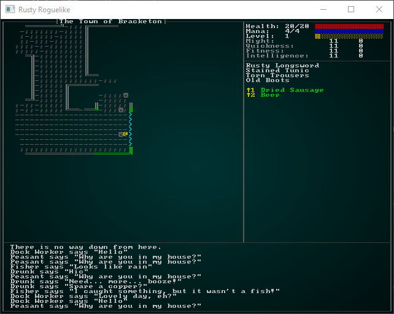
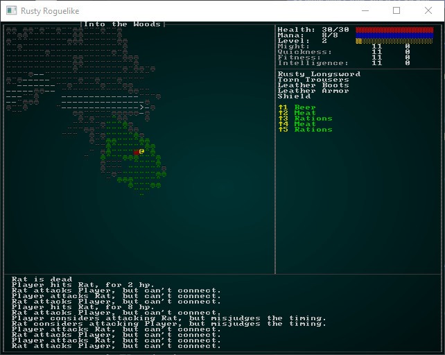
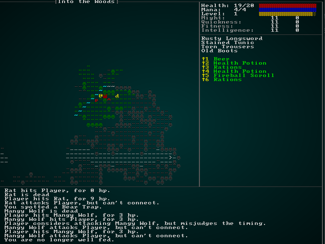

# Experience and Levelling

---

***About this tutorial***

*This tutorial is free and open source, and all code uses the MIT license - so you are free to do with it as you like. My hope is that you will enjoy the tutorial, and make great games!*

*If you enjoy this and would like me to keep writing, please consider supporting [my Patreon](https://www.patreon.com/blackfuture).*

---

So far, we've delved into the dungeon and really only improved ourselves by finding better gear. Swords, shields and armor with better stats - giving us a chance to survive stronger enemies. That's good, but only half of the equation typically found in roguelikes and RPGs; defeating enemies typically grants *experience points* - and those can be used to better your character.

The type of game we are making implies some guidelines:

* With permadeath, you can expect to die *a lot*. So managing your character's progression needs to be *simple* - so you don't spend a huge amount of time on it, only to have to do it all again.
* *Vertical progression* is a good thing: as you delve, you get stronger (allowing us to make stronger mobs). *Horizontal* progression largely defeats the point of permadeath; if you keep benefits between games, then the "each run is unique" aspect of roguelikes is compromised, and you can expect the fine fellows of `/r/roguelikes` on Reddit to complain!

## Gaining experience points

When you defeat something, you should gain XP. We'll go with a simple progression for now: you earn `100 XP * enemy level` each time you defeat something. This gives a bigger benefit to killing something tough - and a smaller (relative) benefit to hunting things down once you have out-levelled them. Additionally, we'll decide that you need `1,000 XP * Current Level` to advance to the next one.

We already have `level` and `xp` in our `Pools` component (you'd almost think that we were planning this chapter!). Let's start by modifying our GUI to display level progression. Open up `gui.rs`, and we'll add the following to `draw_ui`:

```rust
format!("Level:  {}", player_pools.level);
ctx.print_color(50, 3, white, black, &xp);
let xp_level_start = (player_pools.level-1) * 1000;
ctx.draw_bar_horizontal(64, 3, 14, player_pools.xp - xp_level_start, 1000, RGB::named(rltk::GOLD), RGB::named(rltk::BLACK));
```

This adds a gold bar to the screen for our current level progress, and shows our current level:



Now we should support actually *gaining* experience. We should start by tracking *where* damage came from. Open up `components.rs`, and we'll add a field to `SufferDamage`:

```rust
#[derive(Component, Debug, Serialize, Deserialize, Clone)]
pub struct SufferDamage {
    pub amount : i32,
    pub from_player: bool
}
```

We've added `from_player`. If the damage originated from the player - then we'll mark it as such. We don't really care about other entities gaining levels, so this is enough differentiation for now. A few places will now give compiler errors when they make `SufferDamage` components; in most cases you can add `from_player: false` to the creation to fix them. This is true for `hunger_system.rs`, `trigger_system.rs`. `inventory_system.rs` needs to use `from_player : true` - since right now only players can use items. `melee_combat_system.rs` needs a little more work to ensure you don't gain XP from other creatures killing one another (thanks, wolves!).

First, we need to add the player entity to the list of resource to which the system requests access:

```rust
...
ReadStorage<'a, NaturalAttackDefense>,
ReadExpect<'a, Entity>
);

    fn run(&mut self, data : Self::SystemData) {
        let (entities, mut log, mut wants_melee, names, attributes, skills, mut inflict_damage, 
            mut particle_builder, positions, hunger_clock, pools, mut rng,
            equipped_items, meleeweapons, wearables, natural, player_entity) = data;
...
```

Then we make the `from_player` conditional upon the attacking entity matching the player (all the way down on line 105):

```rust
inflict_damage.insert(wants_melee.target, 
    SufferDamage{ 
        amount: damage,
        from_player: entity == *player_entity
    }
).expect("Unable to insert damage component");
```

So that takes care of knowing where damage *came from*. We can now modify `damage_system.rs` to actually grant XP. Here's the updated system:

```rust
extern crate specs;
use specs::prelude::*;
use super::{Pools, SufferDamage, Player, Name, gamelog::GameLog, RunState, Position, Map,
    InBackpack, Equipped, LootTable, Attributes};
use crate::gamesystem::{player_hp_at_level, mana_at_level};

pub struct DamageSystem {}

impl<'a> System<'a> for DamageSystem {
    #[allow(clippy::type_complexity)]
    type SystemData = ( WriteStorage<'a, Pools>,
                        WriteStorage<'a, SufferDamage>,
                        ReadStorage<'a, Position>,
                        WriteExpect<'a, Map>,
                        Entities<'a>,
                        ReadExpect<'a, Entity>,
                        ReadStorage<'a, Attributes>
                         );

    fn run(&mut self, data : Self::SystemData) {
        let (mut stats, mut damage, positions, mut map, entities, player, attributes) = data;
        let mut xp_gain = 0;

        for (entity, mut stats, damage) in (&entities, &mut stats, &damage).join() {
            stats.hit_points.current -= damage.amount;
            let pos = positions.get(entity);
            if let Some(pos) = pos {
                let idx = map.xy_idx(pos.x, pos.y);
                map.bloodstains.insert(idx);
            }

            if stats.hit_points.current < 1 && damage.from_player {
                xp_gain += stats.level * 100;
            }
        }

        if xp_gain != 0 {
            let mut player_stats = stats.get_mut(*player).unwrap();
            let player_attributes = attributes.get(*player).unwrap();
            player_stats.xp += xp_gain;
            if player_stats.xp >= player_stats.level * 1000 {
                // We've gone up a level!
                player_stats.level += 1;
                player_stats.hit_points.max = player_hp_at_level(
                    player_attributes.fitness.base + player_attributes.fitness.modifiers, 
                    player_stats.level
                );
                player_stats.hit_points.current = player_stats.hit_points.max;
                player_stats.mana.max = mana_at_level(
                    player_attributes.intelligence.base + player_attributes.intelligence.modifiers, 
                    player_stats.level
                );
                player_stats.mana.current = player_stats.mana.max;
            }
        }

        damage.clear();
    }
}
```

So as we process damage, if it is *from* the player and slays the target - we add to the variable `xp_gain`. After we're done with the slaying, we check to see if `xp_gain` is non-zero; if it is, we obtain information about the player and grant them the XP. If they level up, we recalculate their hit points and mana.

You can `cargo run` now, and if you slay 10 beasties you will become level 2!



## Making the level-up more dramatic

It's a big deal - you levelled up, healed yourself and are ready to face the world on a whole new stratum! We should *make it look like a big deal*! The first thing we should do is announce the level up on the game log. In our previous level-up code, we can add:

```rust
WriteExpect<'a, GameLog>
                         );

    fn run(&mut self, data : Self::SystemData) {
        let (mut stats, mut damage, positions, mut map, entities, player, attributes, mut log) = data;
...
log.entries.push(format!("Congratulations, you are now level {}", player_stats.level));
```

Now at least we're *telling* the player, rather than just hoping they notice. That's still not much of a victory lap, so lets add some particle effects!

We'll first add two more data accessors:

```rust
WriteExpect<'a, ParticleBuilder>,
ReadExpect<'a, Position>
);

    fn run(&mut self, data : Self::SystemData) {
        let (mut stats, mut damage, positions, mut map, entities, player, attributes, 
            mut log, mut particles, player_pos) = data;
```

And we'll add a stream of gold above the player!

```rust
for i in 0..10 {
    if player_pos.y - i > 1 {
        particles.request(
            player_pos.x, 
            player_pos.y - i, 
            rltk::RGB::named(rltk::GOLD), 
            rltk::RGB::named(rltk::BLACK), 
            rltk::to_cp437('░'), 200.0
        );
    }
}
```



## What about skills?

We're not really *using* skills right now, other than giving the player a `+1` to a lot of things. So until we start using them, we'll leave this blank.

## Wrap-Up

So now you can go up levels! Huzzah!

**The source code for this chapter may be found [here](https://github.com/thebracket/rustrogueliketutorial/tree/master/chapter-54-xp)**


[Run this chapter's example with web assembly, in your browser (WebGL2 required)](http://bfnightly.bracketproductions.com/rustbook/wasm/chapter-54-xp)
---

Copyright (C) 2019, Herbert Wolverson.

---