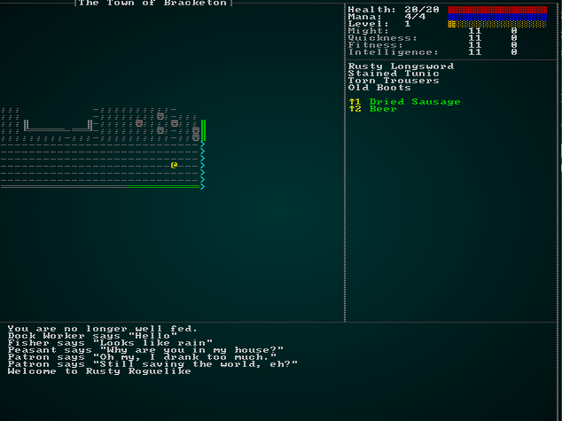

# Backtracking

---

***About this tutorial***

*This tutorial is free and open source, and all code uses the MIT license - so you are free to do with it as you like. My hope is that you will enjoy the tutorial, and make great games!*

*If you enjoy this and would like me to keep writing, please consider supporting [my Patreon](https://www.patreon.com/blackfuture).*

---

The design document talks about using *Town Portal* to return to town, which implies that *backtracking* is possible - that is, it's possible to return to levels. This is quite a common feature of games such as Dungeon Crawl: Stone Soup (in which it is standard procedure to leave items in a "stash" where hopefully the monsters won't find them).

If we're going to support going back and forth between levels (either via entrance/exit pairs, or through mechanisms such as teleports/portals), we need to adjust the way we handle levels and transitioning between them.

## A Master Dungeon Map

We'll start by making a structure to store *all* of our maps - the `MasterDungeonMap`. Make a new file, `map/dungeon.rs` and we'll start putting it together:

```rust
use std::collections::HashMap;
use serde::{Serialize, Deserialize};
use super::{Map};

#[derive(Default, Serialize, Deserialize, Clone)]
pub struct MasterDungeonMap {
    maps : HashMap<i32, Map>
}

impl MasterDungeonMap {
    pub fn new() -> MasterDungeonMap {
        MasterDungeonMap{ maps: HashMap::new() }
    }

    pub fn store_map(&mut self, map : &Map) {
        self.maps.insert(map.depth, map.clone());
    }

    pub fn get_map(&self, depth : i32) -> Option<Map> {
        if self.maps.contains_key(&depth) {
            let mut result = self.maps[&depth].clone();
            result.tile_content = vec![Vec::new(); (result.width * result.height) as usize];
            Some(result)
        } else {
            None
        }
    }
}
```

This is pretty easy to follow: the structure itself has a single, private (no `pub`) field - `maps`. It's a `HashMap` - a dictionary - of `Map` structures, indexed by the map depth. We provide a constructor for easy creation of the class (`new`), and functions to `store_map` (save a map) and `get_map` (retrieve one as an `Option`, with `None` indicating that we don't have one). We also added the `Serde` decorations to make the structure serializable - so you can save the game. We also remake the `tile_content` field, because we don't serialize it.

In `map/mod.rs`, you need to add a line: `pub mod dungeon;`. This tells the module to expose the dungeon to the world.

## Adding backwards exits

Let's add upwards staircases to the world. In `map/tiletype.rs` we add the new type:

```rust
#[derive(PartialEq, Eq, Hash, Copy, Clone, Serialize, Deserialize)]
pub enum TileType {
    Wall, 
    Floor, 
    DownStairs,
    Road,
    Grass,
    ShallowWater,
    DeepWater,
    WoodFloor,
    Bridge,
    Gravel,
    UpStairs
}
```

Then in themes.rs, we add a couple of missing patterns to render it (in each theme):

```rust
TileType::UpStairs => { glyph = rltk::to_cp437('<'); fg = RGB::from_f32(0., 1.0, 1.0); }
```

## Storing New Maps As We Make Them

Currently, whenever the player enters a new level we call `generate_world_map` in `main.rs` to make a new one from scratch. Instead, we'd like to have the whole dungeon map as a global resource - and reference it when we make new maps, using the *existing* one if possible. It's also pretty messy having this in `main.rs`, so we'll take this opportunity to refactor it into our map system.

We can start by adding a a `MasterDungeonMap` resource to the ECS `World`. In your `main` function, at the top of the `ecs.insert` calls, add a line to insert a `MasterDungeonMap` into the `World` (I've included the line after it so you can see where it goes):

```rust
gs.ecs.insert(map::MasterDungeonMap::new());
gs.ecs.insert(Map::new(1, 64, 64, "New Map"));
```

We want to reset the `MasterDungeonMap` whenever we start a new game, so we'll add the same line to `game_over_cleanup`:

```rust
fn game_over_cleanup(&mut self) {
    // Delete everything
    let mut to_delete = Vec::new();
    for e in self.ecs.entities().join() {
        to_delete.push(e);
    }
    for del in to_delete.iter() {
        self.ecs.delete_entity(*del).expect("Deletion failed");
    }

    // Spawn a new player
    {
        let player_entity = spawner::player(&mut self.ecs, 0, 0);
        let mut player_entity_writer = self.ecs.write_resource::<Entity>();
        *player_entity_writer = player_entity;
    }

    // Replace the world maps
    self.ecs.insert(map::MasterDungeonMap::new());

    // Build a new map and place the player
    self.generate_world_map(1, 0);
}
```

Now we'll simplify `generate_world_map` down to the basics:

```rust
fn generate_world_map(&mut self, new_depth : i32) {
    self.mapgen_index = 0;
    self.mapgen_timer = 0.0;
    self.mapgen_history.clear();
    let map_building_info = map::level_transition(&mut self.ecs, new_depth);
    if let Some(history) = map_building_info {
        self.mapgen_history = history;
    }
}
```

This function resets the builder information (which is good, because it's taking care of its own responsibilities - but not others), and asks a new function `map::level_transition` if it has history information. If it does, it stores it as the map building history; otherwise, it leaves the history empty.

In `map/dungeon.rs`, we'll build the outer function it is calling (and remember to add it to the `pub use` section in `map/mod.rs`!):

```rust
pub fn level_transition(ecs : &mut World, new_depth: i32) -> Option<Vec<Map>> {
    // Obtain the master dungeon map
    let dungeon_master = ecs.read_resource::<MasterDungeonMap>();

    // Do we already have a map?
    if dungeon_master.get_map(new_depth).is_some() {
        std::mem::drop(dungeon_master);
        transition_to_existing_map(ecs, new_depth);
        None
    } else {
        std::mem::drop(dungeon_master);
        Some(transition_to_new_map(ecs, new_depth))
    }
}
```

This function obtains the master map from the ECS World, and calls `get_map`. If there is one, it calls `transition_to_existing_map`. If there isn't, it calls `transition_to_new_map`. Note the `std::mem::drop` calls: obtaining `dungeon_master` from the World holds a "borrow" to it; we need to stop borrowing (drop it) before we pass the ECS on to the other functions, to avoid multiple reference issues.

The new function `transition_to_new_map` is the code from the old `generate_world_map` function, modified to not rely on `self`. It has one new section at the end:

```rust
fn transition_to_new_map(ecs : &mut World, new_depth: i32) -> Vec<Map> {
    let mut rng = ecs.write_resource::<rltk::RandomNumberGenerator>();
    let mut builder = level_builder(new_depth, &mut rng, 80, 50);
    builder.build_map(&mut rng);
    if new_depth > 1 {
        if let Some(pos) = &builder.build_data.starting_position {
            let up_idx = builder.build_data.map.xy_idx(pos.x, pos.y);
            builder.build_data.map.tiles[up_idx] = TileType::UpStairs;            
        }
    }
    let mapgen_history = builder.build_data.history.clone();
    let player_start;
    {
        let mut worldmap_resource = ecs.write_resource::<Map>();
        *worldmap_resource = builder.build_data.map.clone();
        player_start = builder.build_data.starting_position.as_mut().unwrap().clone();
    }

    // Spawn bad guys
    std::mem::drop(rng);
    builder.spawn_entities(ecs);

    // Place the player and update resources
    let (player_x, player_y) = (player_start.x, player_start.y);
    let mut player_position = ecs.write_resource::<Point>();
    *player_position = Point::new(player_x, player_y);
    let mut position_components = ecs.write_storage::<Position>();
    let player_entity = ecs.fetch::<Entity>();
    let player_pos_comp = position_components.get_mut(*player_entity);
    if let Some(player_pos_comp) = player_pos_comp {
        player_pos_comp.x = player_x;
        player_pos_comp.y = player_y;
    }

    // Mark the player's visibility as dirty
    let mut viewshed_components = ecs.write_storage::<Viewshed>();
    let vs = viewshed_components.get_mut(*player_entity);
    if let Some(vs) = vs {
        vs.dirty = true;
    }

    // Store the newly minted map
    let mut dungeon_master = ecs.write_resource::<MasterDungeonMap>();
    dungeon_master.store_map(&builder.build_data.map);

    mapgen_history
}
```

At the very end, it returns the building history. Before that, it obtains access to the new `MasterDungeonMap` system and adds the new map to the stored map list. We also add an "up" staircase to the starting position.

## Retrieving maps we've visited before

Now we need to handle loading up a previous map! It's time to flesh out `transition_to_existing_map`:

```rust
fn transition_to_existing_map(ecs: &mut World, new_depth: i32) {
    let dungeon_master = ecs.read_resource::<MasterDungeonMap>();
    let map = dungeon_master.get_map(new_depth).unwrap();
    let mut worldmap_resource = ecs.write_resource::<Map>();
    let player_entity = ecs.fetch::<Entity>();

    // Find the down stairs and place the player
    let w = map.width;
    for (idx, tt) in map.tiles.iter().enumerate() {
        if *tt == TileType::DownStairs {
            let mut player_position = ecs.write_resource::<Point>();
            *player_position = Point::new(idx as i32 % w, idx as i32 / w);
            let mut position_components = ecs.write_storage::<Position>();
            let player_pos_comp = position_components.get_mut(*player_entity);
            if let Some(player_pos_comp) = player_pos_comp {
                player_pos_comp.x = idx as i32 % w;
                player_pos_comp.y = idx as i32 / w;
            }
        }
    }

    *worldmap_resource = map;

    // Mark the player's visibility as dirty
    let mut viewshed_components = ecs.write_storage::<Viewshed>();
    let vs = viewshed_components.get_mut(*player_entity);
    if let Some(vs) = vs {
        vs.dirty = true;
    }
}
```

So this is quite simple: we get the map from the dungeon master list, and store it as the current map in the `World`. We scan the map for a down staircase, and put the player on it. We also mark the player's visibility as dirty, so it will be recalculated for the new map.

## Input for previous level

Now we need to handle the actual transition. Since we handle going down a level with `RunState::NextLevel`, we'll add a state for going back up:

```rust
#[derive(PartialEq, Copy, Clone)]
pub enum RunState { AwaitingInput, 
    PreRun, 
    PlayerTurn, 
    MonsterTurn, 
    ShowInventory, 
    ShowDropItem, 
    ShowTargeting { range : i32, item : Entity},
    MainMenu { menu_selection : gui::MainMenuSelection },
    SaveGame,
    NextLevel,
    PreviousLevel,
    ShowRemoveItem,
    GameOver,
    MagicMapReveal { row : i32 },
    MapGeneration
}
```

We'll also need to handle it in our state matching function. We'll basically copy the "next level" option:

```rust
RunState::PreviousLevel => {
    self.goto_previous_level();
    self.mapgen_next_state = Some(RunState::PreRun);
    newrunstate = RunState::MapGeneration;
}
```

We'll copy/paste `goto_next_level()` and `goto_previous_level()` and change some numbers around:

```rust
fn goto_previous_level(&mut self) {
    // Delete entities that aren't the player or his/her equipment
    let to_delete = self.entities_to_remove_on_level_change();
    for target in to_delete {
        self.ecs.delete_entity(target).expect("Unable to delete entity");
    }

    // Build a new map and place the player
    let current_depth;
    {
        let worldmap_resource = self.ecs.fetch::<Map>();
        current_depth = worldmap_resource.depth;
    }
    self.generate_world_map(current_depth - 1);

    // Notify the player and give them some health
    let mut gamelog = self.ecs.fetch_mut::<gamelog::GameLog>();
    gamelog.entries.insert(0, "You ascend to the previous level.".to_string());
}
```

Next, in `player.rs` (where we handle input) - we need to handle receiving the "go up" instruction. Again, we'll basically copy "go down":

```rust
VirtualKeyCode::Comma => {
    if try_previous_level(&mut gs.ecs) {
        return RunState::PreviousLevel;
    }
}
```

This in turn requires that we copy `try_next_level` and make `try_previous_level`:

```rust
pub fn try_previous_level(ecs: &mut World) -> bool {
    let player_pos = ecs.fetch::<Point>();
    let map = ecs.fetch::<Map>();
    let player_idx = map.xy_idx(player_pos.x, player_pos.y);
    if map.tiles[player_idx] == TileType::UpStairs {
        true
    } else {
        let mut gamelog = ecs.fetch_mut::<GameLog>();
        gamelog.entries.insert(0, "There is no way up from here.".to_string());
        false
    }
}
```

If you `cargo run` now, you can transition between maps. When you go back, however - it's a ghost town. There's *nobody* else on the level. Spooky, and the loss of your Mom should upset you!

## Entity freezing and unfreezing

If you think back to the first part of the tutorial, we spent some time making sure that we *delete* everything that isn't the player when we change level. It made sense: you'd never be coming back, so why waste memory on keeping them? Now that we're able to go back and forth, we need to keep track of where things are - so we can find them once again. We can also take this opportunity to clean up our transitions a bit - it's messy with all those functions!

Thinking about what we want to do, our objective is to store an entity's position *on another level*. So we need to store the level, as well as their `x/y` positions. Lets make a new component. In `components.rs` (and register in `main.rs` and `saveload_system.rs`):

```rust
#[derive(Component, Serialize, Deserialize, Clone)]
pub struct OtherLevelPosition {
    pub x: i32,
    pub y: i32,
    pub depth: i32
}
```

We can actually make a relatively simple function to adjust our entity state. In `map/dungeon.rs`, we'll make a new function:

```rust
pub fn freeze_level_entities(ecs: &mut World) {
    // Obtain ECS access
    let entities = ecs.entities();
    let mut positions = ecs.write_storage::<Position>();
    let mut other_level_positions = ecs.write_storage::<OtherLevelPosition>();
    let player_entity = ecs.fetch::<Entity>();
    let map_depth = ecs.fetch::<Map>().depth;

    // Find positions and make OtherLevelPosition
    let mut pos_to_delete : Vec<Entity> = Vec::new();
    for (entity, pos) in (&entities, &positions).join() {
        if entity != *player_entity {
            other_level_positions.insert(entity, OtherLevelPosition{ x: pos.x, y: pos.y, depth: map_depth }).expect("Insert fail");
            pos_to_delete.push(entity);
        }
    }

    // Remove positions
    for p in pos_to_delete.iter() {
        positions.remove(*p);
    }
}
```

This is another relatively simple function: we get access to various stores, and then iterate all entities that have a position. We check that it isn't the player (since they are handled differently); if they *aren't* - we add an `OtherLevelPosition` for them, and mark them in the `pos_to_delete` vector. Then we iterate the vector, and remove `Position` components from everyone whom we marked.

Restoring them to life (thawing) is quite easy, too:

```rust
pub fn thaw_level_entities(ecs: &mut World) {
    // Obtain ECS access
    let entities = ecs.entities();
    let mut positions = ecs.write_storage::<Position>();
    let mut other_level_positions = ecs.write_storage::<OtherLevelPosition>();
    let player_entity = ecs.fetch::<Entity>();
    let map_depth = ecs.fetch::<Map>().depth;

    // Find OtherLevelPosition
    let mut pos_to_delete : Vec<Entity> = Vec::new();
    for (entity, pos) in (&entities, &other_level_positions).join() {
        if entity != *player_entity && pos.depth == map_depth {
            positions.insert(entity, Position{ x: pos.x, y: pos.y }).expect("Insert fail");
            pos_to_delete.push(entity);
        }
    }

    // Remove positions
    for p in pos_to_delete.iter() {
        other_level_positions.remove(*p);
    }
}
```

This is basically the same function, but with the logic reversed! We *add* `Position` components, and *delete* `OtherLevelPosition` components.

In `main.rs`, we have a mess of `goto_next_level` and `goto_previous_level` functions. Lets replace them with one generic function that understands which way we are going:

```rust
fn goto_level(&mut self, offset: i32) {
    freeze_level_entities(&mut self.ecs);

    // Build a new map and place the player
    let current_depth = self.ecs.fetch::<Map>().depth;
    self.generate_world_map(current_depth + offset, offset);

    // Notify the player
    let mut gamelog = self.ecs.fetch_mut::<gamelog::GameLog>();
    gamelog.entries.insert(0, "You change level.".to_string());
}
```

This is a lot simpler - we call our new `freeze_level_entities` function, obtain the current depth, and call `generate_world_map` with the new depth. What's this? We're also passing the `offset`. We need to know which way you are going, otherwise you can complete whole levels by going back and then forward again - and being teleported to the "down" staircase! So we'll modify `generate_world_map` to take this parameter:

```rust
fn generate_world_map(&mut self, new_depth : i32, offset: i32) {
    self.mapgen_index = 0;
    self.mapgen_timer = 0.0;
    self.mapgen_history.clear();
    let map_building_info = map::level_transition(&mut self.ecs, new_depth, offset);
    if let Some(history) = map_building_info {
        self.mapgen_history = history;
    } else {
        map::thaw_level_entities(&mut self.ecs);
    }
}
```

Notice that we're basically calling the same code, but also passing `offset` to `level_transition` (more on that in a second). We also call `thaw` if we didn't make a new map. That way, new maps get new entities - old maps get the old ones.

You'll need to fix various calls to `generate_world_map`. You can pass `0` as the offset if you are making a new level. You'll also want to fix the two `match` entries for changing level:

```rust
RunState::NextLevel => {
    self.goto_level(1);
    self.mapgen_next_state = Some(RunState::PreRun);
    newrunstate = RunState::MapGeneration;
}
RunState::PreviousLevel => {
    self.goto_level(-1);
    self.mapgen_next_state = Some(RunState::PreRun);
    newrunstate = RunState::MapGeneration;
}
```

Lastly, we need to open up `dungeon.rs` and make a simple change to the level transition system to handle taking an offset:

```rust
pub fn level_transition(ecs : &mut World, new_depth: i32, offset: i32) -> Option<Vec<Map>> {
    // Obtain the master dungeon map
    let dungeon_master = ecs.read_resource::<MasterDungeonMap>();

    // Do we already have a map?
    if dungeon_master.get_map(new_depth).is_some() {
        std::mem::drop(dungeon_master);
        transition_to_existing_map(ecs, new_depth, offset);
        None
    } else {
        std::mem::drop(dungeon_master);
        Some(transition_to_new_map(ecs, new_depth))
    }
}
```

The only difference here is that we pass the offset to `transition_to_existing_map`. Here's that updated function:

```rust
fn transition_to_existing_map(ecs: &mut World, new_depth: i32, offset: i32) {
    let dungeon_master = ecs.read_resource::<MasterDungeonMap>();
    let map = dungeon_master.get_map(new_depth).unwrap();
    let mut worldmap_resource = ecs.write_resource::<Map>();
    let player_entity = ecs.fetch::<Entity>();    

    // Find the down stairs and place the player
    let w = map.width;
    let stair_type = if offset < 0 { TileType::DownStairs } else { TileType::UpStairs };
    for (idx, tt) in map.tiles.iter().enumerate() {
        if *tt == stair_type {
        ...
```

We updated the signature, and use it to determine where to place the player. If offset is less than 0, we want a down staircase - otherwise we want an up staircase.

You can `cargo run` now, and hop back and forth between levels to your heart's content - the entities on each level will be exactly where you left them!

## Saving/Loading the game

Now we need to include the dungeon master map in our save game; otherwise, reloading will keep the current map and generate a whole bunch of new ones - with invalid entity placement! We'll need to extend our serialization system to save the entire dungeon map, rather than just the current one.

We'll start in `components.rs`; you may remember that we had to make a special `SerializationHelper` to help us save the map as part of the game. It looks like this:

```rust
#[derive(Component, Serialize, Deserialize, Clone)]
pub struct SerializationHelper {
    pub map : super::map::Map
}
```

We'll need a *second* one, to store the `MasterDungeonMap`. It looks like this:

```rust
#[derive(Component, Serialize, Deserialize, Clone)]
pub struct DMSerializationHelper {
    pub map : super::map::MasterDungeonMap
}
```

In `main.rs`, we have to register it like other components:

```rust
gs.ecs.register::<DMSerializationHelper>();
```

And in `saveload.rs` we need to include it in the big lists of component types. Also in `saveload.rs`, we need to do the same trick to add it to the ECS World, save it, and then remove it that we used before:

```rust
pub fn save_game(ecs : &mut World) {
    // Create helper
    let mapcopy = ecs.get_mut::<super::map::Map>().unwrap().clone();
    let dungeon_master = ecs.get_mut::<super::map::MasterDungeonMap>().unwrap().clone();
    let savehelper = ecs
        .create_entity()
        .with(SerializationHelper{ map : mapcopy })
        .marked::<SimpleMarker<SerializeMe>>()
        .build();
    let savehelper2 = ecs
        .create_entity()
        .with(DMSerializationHelper{ map : dungeon_master })
        .marked::<SimpleMarker<SerializeMe>>()
        .build();

    // Actually serialize
    {
        let data = ( ecs.entities(), ecs.read_storage::<SimpleMarker<SerializeMe>>() );

        let writer = File::create("./savegame.json").unwrap();
        let mut serializer = serde_json::Serializer::new(writer);
        serialize_individually!(ecs, serializer, data, Position, Renderable, Player, Viewshed, Monster, 
            Name, BlocksTile, SufferDamage, WantsToMelee, Item, Consumable, Ranged, InflictsDamage, 
            AreaOfEffect, Confusion, ProvidesHealing, InBackpack, WantsToPickupItem, WantsToUseItem,
            WantsToDropItem, SerializationHelper, Equippable, Equipped, MeleeWeapon, Wearable,
            WantsToRemoveItem, ParticleLifetime, HungerClock, ProvidesFood, MagicMapper, Hidden,
            EntryTrigger, EntityMoved, SingleActivation, BlocksVisibility, Door, Bystander, Vendor,
            Quips, Attributes, Skills, Pools, NaturalAttackDefense, LootTable, Carnivore, Herbivore,
            OtherLevelPosition, DMSerializationHelper
        );
    }

    // Clean up
    ecs.delete_entity(savehelper).expect("Crash on cleanup");
    ecs.delete_entity(savehelper2).expect("Crash on cleanup");
}
```

Notice that we're making a *second* temporary entity - `savehelper2`. This ensures that the data is saved alongside all the other data. We remove it in the very last line. We also need to tweak our loader:

```rust
pub fn load_game(ecs: &mut World) {
    {
        // Delete everything
        let mut to_delete = Vec::new();
        for e in ecs.entities().join() {
            to_delete.push(e);
        }
        for del in to_delete.iter() {
            ecs.delete_entity(*del).expect("Deletion failed");
        }
    }

    let data = fs::read_to_string("./savegame.json").unwrap();
    let mut de = serde_json::Deserializer::from_str(&data);

    {
        let mut d = (&mut ecs.entities(), &mut ecs.write_storage::<SimpleMarker<SerializeMe>>(), &mut SimpleMarkerAllocator::<SerializeMe>::new());

        deserialize_individually!(ecs, de, d, Position, Renderable, Player, Viewshed, Monster, 
            Name, BlocksTile, SufferDamage, WantsToMelee, Item, Consumable, Ranged, InflictsDamage, 
            AreaOfEffect, Confusion, ProvidesHealing, InBackpack, WantsToPickupItem, WantsToUseItem,
            WantsToDropItem, SerializationHelper, Equippable, Equipped, MeleeWeapon, Wearable,
            WantsToRemoveItem, ParticleLifetime, HungerClock, ProvidesFood, MagicMapper, Hidden,
            EntryTrigger, EntityMoved, SingleActivation, BlocksVisibility, Door, Bystander, Vendor,
            Quips, Attributes, Skills, Pools, NaturalAttackDefense, LootTable, Carnivore, Herbivore,
            OtherLevelPosition, DMSerializationHelper
        );
    }

    let mut deleteme : Option<Entity> = None;
    let mut deleteme2 : Option<Entity> = None;
    {
        let entities = ecs.entities();
        let helper = ecs.read_storage::<SerializationHelper>();
        let helper2 = ecs.read_storage::<DMSerializationHelper>();
        let player = ecs.read_storage::<Player>();
        let position = ecs.read_storage::<Position>();
        for (e,h) in (&entities, &helper).join() {
            let mut worldmap = ecs.write_resource::<super::map::Map>();
            *worldmap = h.map.clone();
            worldmap.tile_content = vec![Vec::new(); (worldmap.height * worldmap.width) as usize];
            deleteme = Some(e);
        }
        for (e,h) in (&entities, &helper2).join() {
            let mut dungeonmaster = ecs.write_resource::<super::map::MasterDungeonMap>();
            *dungeonmaster = h.map.clone();
            deleteme2 = Some(e);
        }
        for (e,_p,pos) in (&entities, &player, &position).join() {
            let mut ppos = ecs.write_resource::<rltk::Point>();
            *ppos = rltk::Point::new(pos.x, pos.y);
            let mut player_resource = ecs.write_resource::<Entity>();
            *player_resource = e;
        }
    }
    ecs.delete_entity(deleteme.unwrap()).expect("Unable to delete helper");
    ecs.delete_entity(deleteme2.unwrap()).expect("Unable to delete helper");
}
```

So in this one, we added iterating through for the `MasterDungeonMap` helper, and adding it to the `World` as a resource - and then deleting the entity. It's just the same as we did for the `Map` - but for the `MasterDungeonMap`.

If you `cargo run` now, you can transition levels, save the game, and then transition again. Serialization works!

## More seamless transition

It's not very ergonomic to require that the player type keys that are only ever used once (for up/down stairs) when they encounter a stair-case. Not only that, but it's sometimes difficult with international keyboards to catch the right key-code! It would definitely be smoother if walking into a stair-case takes you to the stair's destination. At the same time, we could fix something that's been bugging me for a while: trying and failing to move costs a turn while you mindlessly plough into the wall!

Since `player.rs` is where we handle input, lets open it up. We're going to change `try_move_player` to return a `RunState`:

```rust
pub fn try_move_player(delta_x: i32, delta_y: i32, ecs: &mut World) -> RunState {
    let mut positions = ecs.write_storage::<Position>();
    let players = ecs.read_storage::<Player>();
    let mut viewsheds = ecs.write_storage::<Viewshed>();
    let entities = ecs.entities();
    let combat_stats = ecs.read_storage::<Attributes>();
    let map = ecs.fetch::<Map>();
    let mut wants_to_melee = ecs.write_storage::<WantsToMelee>();
    let mut entity_moved = ecs.write_storage::<EntityMoved>();
    let mut doors = ecs.write_storage::<Door>();
    let mut blocks_visibility = ecs.write_storage::<BlocksVisibility>();
    let mut blocks_movement = ecs.write_storage::<BlocksTile>();
    let mut renderables = ecs.write_storage::<Renderable>();
    let bystanders = ecs.read_storage::<Bystander>();
    let vendors = ecs.read_storage::<Vendor>();
    let mut result = RunState::AwaitingInput;

    let mut swap_entities : Vec<(Entity, i32, i32)> = Vec::new();

    for (entity, _player, pos, viewshed) in (&entities, &players, &mut positions, &mut viewsheds).join() {
        if pos.x + delta_x < 1 || pos.x + delta_x > map.width-1 || pos.y + delta_y < 1 || pos.y + delta_y > map.height-1 { return RunState::AwaitingInput; }
        let destination_idx = map.xy_idx(pos.x + delta_x, pos.y + delta_y);

        for potential_target in map.tile_content[destination_idx].iter() {
            let bystander = bystanders.get(*potential_target);
            let vendor = vendors.get(*potential_target);
            if bystander.is_some() || vendor.is_some() {
                // Note that we want to move the bystander
                swap_entities.push((*potential_target, pos.x, pos.y));

                // Move the player
                pos.x = min(map.width-1 , max(0, pos.x + delta_x));
                pos.y = min(map.height-1, max(0, pos.y + delta_y));
                entity_moved.insert(entity, EntityMoved{}).expect("Unable to insert marker");

                viewshed.dirty = true;
                let mut ppos = ecs.write_resource::<Point>();
                ppos.x = pos.x;
                ppos.y = pos.y;
                result = RunState::PlayerTurn;
            } else {
                let target = combat_stats.get(*potential_target);
                if let Some(_target) = target {
                    wants_to_melee.insert(entity, WantsToMelee{ target: *potential_target }).expect("Add target failed");
                    return RunState::PlayerTurn;
                }
            }
            let door = doors.get_mut(*potential_target);
            if let Some(door) = door {
                door.open = true;
                blocks_visibility.remove(*potential_target);
                blocks_movement.remove(*potential_target);
                let glyph = renderables.get_mut(*potential_target).unwrap();
                glyph.glyph = rltk::to_cp437('/');
                viewshed.dirty = true;
            }
        }

        if !map.blocked[destination_idx] {
            pos.x = min(map.width-1 , max(0, pos.x + delta_x));
            pos.y = min(map.height-1, max(0, pos.y + delta_y));
            entity_moved.insert(entity, EntityMoved{}).expect("Unable to insert marker");

            viewshed.dirty = true;
            let mut ppos = ecs.write_resource::<Point>();
            ppos.x = pos.x;
            ppos.y = pos.y;
            result = RunState::PlayerTurn;
        }
    }

    for m in swap_entities.iter() {
        let their_pos = positions.get_mut(m.0);
        if let Some(their_pos) = their_pos {
            their_pos.x = m.1;
            their_pos.y = m.2;
        }
    }

    result
}
```

This is essentially the same function as before, but we ensure that we return a `RunState` from it. If the player did in fact move, we return `RunState::PlayerTurn`. If the move wasn't valid, we return `RunState::AwaitingInput` - to indicate that we're still waiting for valid instructions.

In the player keyboard handler, we need to replace every call to `try_move_player...` with `return try_move_player...`:

```rust
...
    match ctx.key {
        None => { return RunState::AwaitingInput } // Nothing happened
        Some(key) => match key {
            VirtualKeyCode::Left |
            VirtualKeyCode::Numpad4 |
            VirtualKeyCode::H => return try_move_player(-1, 0, &mut gs.ecs),

            VirtualKeyCode::Right |
            VirtualKeyCode::Numpad6 |
            VirtualKeyCode::L => return try_move_player(1, 0, &mut gs.ecs),

            VirtualKeyCode::Up |
            VirtualKeyCode::Numpad8 |
            VirtualKeyCode::K => return try_move_player(0, -1, &mut gs.ecs),

            VirtualKeyCode::Down |
            VirtualKeyCode::Numpad2 |
            VirtualKeyCode::J => return try_move_player(0, 1, &mut gs.ecs),

            // Diagonals
            VirtualKeyCode::Numpad9 |
            VirtualKeyCode::U => return try_move_player(1, -1, &mut gs.ecs),

            VirtualKeyCode::Numpad7 |
            VirtualKeyCode::Y => return try_move_player(-1, -1, &mut gs.ecs),

            VirtualKeyCode::Numpad3 |
            VirtualKeyCode::N => return try_move_player(1, 1, &mut gs.ecs),

            VirtualKeyCode::Numpad1 |
            VirtualKeyCode::B => return try_move_player(-1, 1, &mut gs.ecs),

            // Skip Turn
            VirtualKeyCode::Numpad5 |
            VirtualKeyCode::Space => return skip_turn(&mut gs.ecs),
            ...
```

If you were to `cargo run` now, you'd notice that you no longer waste turns walking into walls.

Now that we've done that, we're in a good place to modify `try_move_player` to be able to return level transition instructions if the player has entered a staircase. Let's add a staircase check after movement, and return stair transitions if they apply:

```rust
if !map.blocked[destination_idx] {
    pos.x = min(map.width-1 , max(0, pos.x + delta_x));
    pos.y = min(map.height-1, max(0, pos.y + delta_y));
    entity_moved.insert(entity, EntityMoved{}).expect("Unable to insert marker");

    viewshed.dirty = true;
    let mut ppos = ecs.write_resource::<Point>();
    ppos.x = pos.x;
    ppos.y = pos.y;
    result = RunState::PlayerTurn;
    match map.tiles[destination_idx] {
        TileType::DownStairs => result = RunState::NextLevel,
        TileType::UpStairs => result = RunState::PreviousLevel,
        _ => {}
    } 
}
```

Now you can change levels simply by running onto the exit.



## A Word on Stair dancing

One thing a lot of roguelikes run into is "stair dancing". You see a scary monster, and you retreat up the staircase. Heal up, pop down and hit the monster a bit. Pop back up, and heal up. Since the monster is "frozen" on a later level, it won't chase you up the stairs (except in games that handle this, such as Dungeon Crawl Stone Soup!). This is probably undesirable for the overall game, but we're not going to fix it yet. A future chapter is planned that will make NPC AI a lot smarter in general (and introduce more tactical options), so we'll save this problem for later.

## Wrap Up

That was another large chapter, but we've achieved something really useful: levels are persistent, and you can traverse the world enjoying the knowledge that the sword you left in the woods will still be there when you return. This goes a long way towards making a more believable, expansive game (and it starts to feel more "open world", even if it isn't!). We'll be adding in town portals in a future chapter, when the town becomes a more useful place to visit.

Next - to ensure that you aren't bored! - we'll be adding in the next level, the limestone caverns.

...

**The source code for this chapter may be found [here](https://github.com/thebracket/rustrogueliketutorial/tree/master/chapter-55-backtrack)**


[Run this chapter's example with web assembly, in your browser (WebGL2 required)](http://bfnightly.bracketproductions.com/rustbook/wasm/chapter-55-backtrack)
---

Copyright (C) 2019, Herbert Wolverson.

---