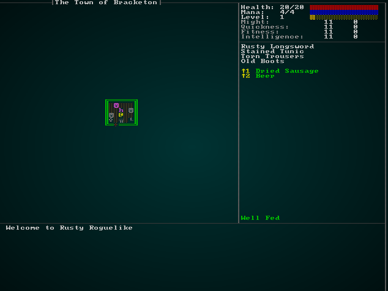
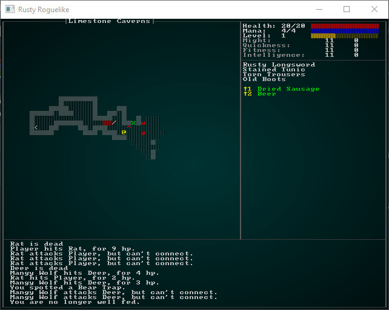
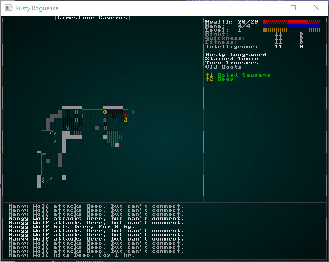
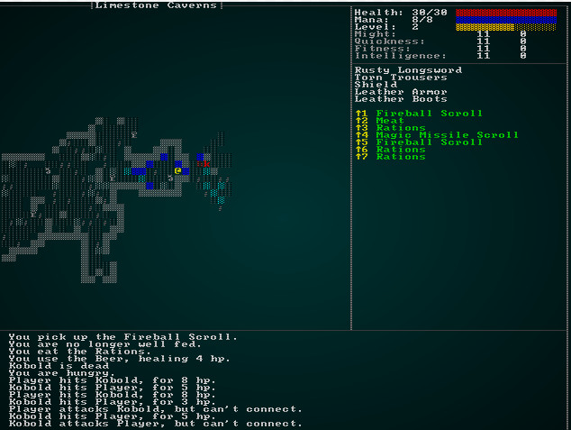
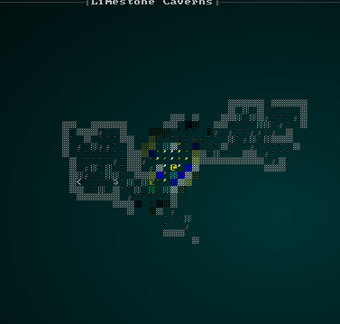
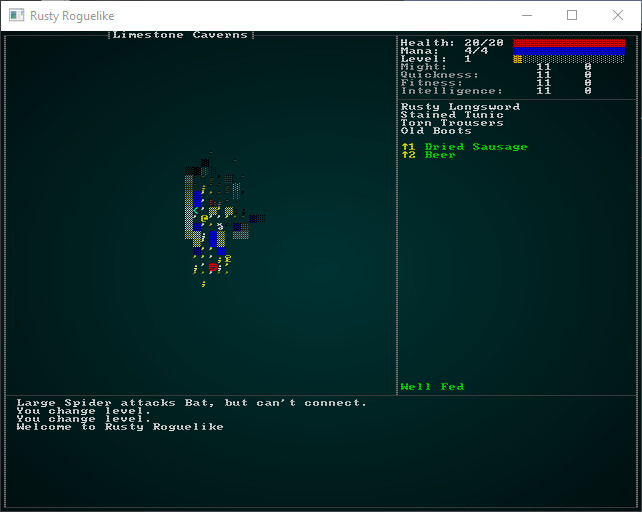

# The Limestone Caverns

---

***About this tutorial***

*This tutorial is free and open source, and all code uses the MIT license - so you are free to do with it as you like. My hope is that you will enjoy the tutorial, and make great games!*

*If you enjoy this and would like me to keep writing, please consider supporting [my Patreon](https://www.patreon.com/blackfuture).*

---

The [design document](./chapter_44.md) talks about the first real dungeon level being a network of limestone caverns. Limestone caves are amazing in real life; [Gaping Gill](https://www.atlasobscura.com/places/gaping-gill) in Yorkshire was one of my favorite places to visit as a kid (you may have seen it in *Monty Python and the Holy Grail* - the vorpal rabbit emerges from its entrance!). A trickle of water, given centuries to do its work, can carve out *amazing* caverns. The caves are predominantly made up of light gray rock, which wears smooth and reflective - giving amazing lighting effects!

## Cheating to help with levels

While working on new levels, it's helpful to have a quick and easy way to get there! So we're going to introduce *cheat mode*, to let you quickly navigate the dungeon to see your creations. This will be a lot like the other UI elements (such as inventory management) we've created, so the first thing we need is to open `main.rs` and add a new `RunState` for showing the cheats menu:

```rust
#[derive(PartialEq, Copy, Clone)]
pub enum RunState { AwaitingInput, 
    ...
    ShowCheatMenu
}
```

Then, add the following to your big `match` statement of game states:

```rust
RunState::ShowCheatMenu => {
    let result = gui::show_cheat_mode(self, ctx);
    match result {
        gui::CheatMenuResult::Cancel => newrunstate = RunState::AwaitingInput,
        gui::CheatMenuResult::NoResponse => {}
        gui::CheatMenuResult::TeleportToExit => {
            self.goto_level(1);
            self.mapgen_next_state = Some(RunState::PreRun);
            newrunstate = RunState::MapGeneration;
        }
    }
}
```

This asks `show_cheat_mode` for a response, and uses the "next level" code (same as if the player activates a staircase) to advance if the user selected `Teleport`. We haven't written that function and enumeration yet, so we open `gui.rs` and add it:

```rust
#[derive(PartialEq, Copy, Clone)]
pub enum CheatMenuResult { NoResponse, Cancel, TeleportToExit }

pub fn show_cheat_mode(_gs : &mut State, ctx : &mut Rltk) -> CheatMenuResult {
    let count = 2;
    let y = (25 - (count / 2)) as i32;
    ctx.draw_box(15, y-2, 31, (count+3) as i32, RGB::named(rltk::WHITE), RGB::named(rltk::BLACK));
    ctx.print_color(18, y-2, RGB::named(rltk::YELLOW), RGB::named(rltk::BLACK), "Cheating!");
    ctx.print_color(18, y+count as i32+1, RGB::named(rltk::YELLOW), RGB::named(rltk::BLACK), "ESCAPE to cancel");

    ctx.set(17, y, RGB::named(rltk::WHITE), RGB::named(rltk::BLACK), rltk::to_cp437('('));
    ctx.set(18, y, RGB::named(rltk::YELLOW), RGB::named(rltk::BLACK), rltk::to_cp437('T'));
    ctx.set(19, y, RGB::named(rltk::WHITE), RGB::named(rltk::BLACK), rltk::to_cp437(')'));

    ctx.print(21, y, "Teleport to exit");

    match ctx.key {
        None => CheatMenuResult::NoResponse,
        Some(key) => {
            match key {
                VirtualKeyCode::T => CheatMenuResult::TeleportToExit,
                VirtualKeyCode::Escape => CheatMenuResult::Cancel,
                _ => CheatMenuResult::NoResponse
            }
        }
    }
}
```

This should look familiar: it displays a cheat menu and offers the letter `T` for "Teleport to Exit".

Lastly, we need to add one more input to `player.rs`:

```rust
// Save and Quit
VirtualKeyCode::Escape => return RunState::SaveGame,

// Cheating!
VirtualKeyCode::Backslash => return RunState::ShowCheatMenu,
```

And there you go! If you `cargo run` now, you can press `\` (backslash), and `T` - and teleport right into the next level. This will make it a lot easier to design our level!



## Carving out the caverns

We're going to do another custom design on the limestone caverns, so open up `map_builders/mod.rs` and find `level_builder` (it should be at the end of the file):

```rust
pub fn level_builder(new_depth: i32, rng: &mut rltk::RandomNumberGenerator, width: i32, height: i32) -> BuilderChain {
    rltk::console::log(format!("Depth: {}", new_depth));
    match new_depth {
        1 => town_builder(new_depth, rng, width, height),
        2 => forest_builder(new_depth, rng, width, height),
        3 => limestone_cavern_builder(new_depth, rng, width, height),
        _ => random_builder(new_depth, rng, width, height)
    }
}
```

Also add this to the top:

```rust
mod limestone_cavern;
use limestone_cavern::limestone_cavern_builder;
```

We've added `limestone_cavern_builder` - so lets go ahead and create it! Make a new file, `map_builders/limestone_cavern.rs` and add the following:

```rust
use super::{BuilderChain, DrunkardsWalkBuilder, XStart, YStart, AreaStartingPosition, 
    CullUnreachable, VoronoiSpawning, MetaMapBuilder, BuilderMap, TileType, DistantExit};
use rltk::RandomNumberGenerator;
use crate::map;

pub fn limestone_cavern_builder(new_depth: i32, _rng: &mut rltk::RandomNumberGenerator, width: i32, height: i32) -> BuilderChain {
    let mut chain = BuilderChain::new(new_depth, width, height, "Limestone Caverns");
    chain.start_with(DrunkardsWalkBuilder::winding_passages());
    chain.with(AreaStartingPosition::new(XStart::CENTER, YStart::CENTER));
    chain.with(CullUnreachable::new());
    chain.with(AreaStartingPosition::new(XStart::LEFT, YStart::CENTER));
    chain.with(VoronoiSpawning::new());
    chain.with(DistantExit::new());
    chain
}
```

This is quite simple: we're building the map with a Drunkard's Walk, in "winding passages" mode. Then we set the start to the center, and cull unreachable areas. Next, we place the entrance on the left center, spawn with the Voronoi algorithm, and place the exit at a distant location.

This gets you a playable map! The monster choices aren't so good, but it works. This is a good example of the flexible map building system we've been using.

## Theming the caverns

The cavern layout is a good start, but it doesn't *look* like a limestone cavern yet. Open up `map/themes.rs` and we'll rectify that! We'll start by modifying `get_tile_glyph` to know about this level:

```rust
pub fn tile_glyph(idx: usize, map : &Map) -> (rltk::FontCharType, RGB, RGB) {
let (glyph, mut fg, mut bg) = match map.depth {
    3 => get_limestone_cavern_glyph(idx, map),
    2 => get_forest_glyph(idx, map),
    _ => get_tile_glyph_default(idx, map)
};
```

Now we need to write `get_limestone_cavern_glyph`. We want it to look like a limestone cavern. Here's what I came up with (maybe the more artistically inclined can help!):

```rust
fn get_limestone_cavern_glyph(idx:usize, map: &Map) -> (rltk::FontCharType, RGB, RGB) {
    let glyph;
    let fg;
    let bg = RGB::from_f32(0., 0., 0.);

    match map.tiles[idx] {
        TileType::Wall => { glyph = rltk::to_cp437('▒'); fg = RGB::from_f32(0.7, 0.7, 0.7); }
        TileType::Bridge => { glyph = rltk::to_cp437('.'); fg = RGB::named(rltk::CHOCOLATE); }
        TileType::Road => { glyph = rltk::to_cp437('≡'); fg = RGB::named(rltk::YELLOW); }
        TileType::Grass => { glyph = rltk::to_cp437('"'); fg = RGB::named(rltk::GREEN); }
        TileType::ShallowWater => { glyph = rltk::to_cp437('░'); fg = RGB::named(rltk::CYAN); }
        TileType::DeepWater => { glyph = rltk::to_cp437('▓'); fg = RGB::named(rltk::BLUE); }
        TileType::Gravel => { glyph = rltk::to_cp437(';'); fg = RGB::from_f32(0.5, 0.5, 0.5); }
        TileType::DownStairs => { glyph = rltk::to_cp437('>'); fg = RGB::from_f32(0., 1.0, 1.0); }
        TileType::UpStairs => { glyph = rltk::to_cp437('<'); fg = RGB::from_f32(0., 1.0, 1.0); }
        _ => { glyph = rltk::to_cp437('░'); fg = RGB::from_f32(0.4, 0.4, 0.4); }
    }

    (glyph, fg, bg)
}
```

Not a bad start! The environment looks quite cave like (and not hewn stone), and the colors are a nice neutral lighter grey but not blindingly bright. It makes the other entities stand out nicely:



## Just add water and gravel

We can further improve the map by adding some water (it's unusual for a cave network like this to not have some), and turn some of the floor tiles into gravel - to show boulders on the map. We could also add in some stalactites and stalagmites (giant rock pillars that form from dripping water slowly depositing calcium over the centuries) for flavor. So we'll first add a new layer to the builder (as the last step):

```rust
chain.with(CaveDecorator::new());
```

Then we need to write it:

```rust
pub struct CaveDecorator {}

impl MetaMapBuilder for CaveDecorator {
    fn build_map(&mut self, rng: &mut rltk::RandomNumberGenerator, build_data : &mut BuilderMap)  {
        self.build(rng, build_data);
    }
}

impl CaveDecorator {
    #[allow(dead_code)]
    pub fn new() -> Box<CaveDecorator> {
        Box::new(CaveDecorator{})
    }

    fn build(&mut self, rng : &mut RandomNumberGenerator, build_data : &mut BuilderMap) {
        let old_map = build_data.map.clone();
        for (idx,tt) in build_data.map.tiles.iter_mut().enumerate() {
            // Gravel Spawning
            if *tt == TileType::Floor && rng.roll_dice(1, 6)==1 {
                *tt = TileType::Gravel;
            } else if *tt == TileType::Floor && rng.roll_dice(1, 10)==1 {
                // Spawn passable pools
                *tt = TileType::ShallowWater;
            } else if *tt == TileType::Wall {
                // Spawn deep pools and stalactites
                let mut neighbors = 0;
                let x = idx as i32 % old_map.width;
                let y = idx as i32 / old_map.width;
                if x > 0 && old_map.tiles[idx-1] == TileType::Wall { neighbors += 1; }
                if x < old_map.width - 2 && old_map.tiles[idx+1] == TileType::Wall { neighbors += 1; }
                if y > 0 && old_map.tiles[idx-old_map.width as usize] == TileType::Wall { neighbors += 1; }
                if y < old_map.height - 2 && old_map.tiles[idx+old_map.width as usize] == TileType::Wall { neighbors += 1; }
                if neighbors == 2 {
                    *tt = TileType::DeepWater;
                } else if neighbors == 1 {
                    let roll = rng.roll_dice(1, 4);
                    match roll {
                        1 => *tt = TileType::Stalactite,
                        2 => *tt = TileType::Stalagmite,
                        _ => {}
                    }
                }
            }
        }
        build_data.take_snapshot();
    }
}
```

This works as follows:

1. We iterate through all the tile types and map indices of the map. It's a mutable iterator - we want to be able to change the tiles.
2. If a tile is a `Floor`, we have a 1 in 6 chance of turning it into gravel.
3. If we didn't do that, we have a 1 in 10 chance of turning it into a shallow pool (still passable).
4. If its a wall, we count how many other walls surround it.
5. If there's 2 neighbors, we replace the tile with `DeepWater` - nice dark water, not passable by the player.
6. If there is 1 neighbor, we roll a 4 sided dice. On a 1, we turn it into a stalactite; on a 2, we turn it into a stalagmite. Otherwise, we don't do anything.

This does require that we open `map/tiletype.rs` and introduce the new tile types:

```rust
#[derive(PartialEq, Eq, Hash, Copy, Clone, Serialize, Deserialize)]
pub enum TileType {
    Wall, 
    Stalactite,
    Stalagmite,
    Floor, 
    DownStairs,
    Road,
    Grass,
    ShallowWater,
    DeepWater,
    WoodFloor,
    Bridge,
    Gravel,
    UpStairs
}
```

We make the new tile types block visibility:

```rust
pub fn tile_opaque(tt : TileType) -> bool {
    match tt {
        TileType::Wall | TileType::Stalactite | TileType::Stalagmite => true,
        _ => false
    }
}
```

And we add them to both the new limestone theme and the default theme in `map/themes.rs`:

```rust
TileType::Stalactite => { glyph = rltk::to_cp437('╨'); fg = RGB::from_f32(0.5, 0.5, 0.5); }
TileType::Stalagmite => { glyph = rltk::to_cp437('╥'); fg = RGB::from_f32(0.5, 0.5, 0.5); }
```

This gives a pretty pleasing looking, quite natural (and damp) cave:



## Populating the caverns

The caverns are pretty playable as-is, but they don't really match what we've described in terms of NPCs. There are a few forest monsters and deer in the cave, which doesn't make a lot of sense! Let's start by opening `spawns.rs` and changing the depths on which some creatures appear to avoid this:

```json
"spawn_table" : [
    { "name" : "Goblin", "weight" : 10, "min_depth" : 3, "max_depth" : 100 },
    { "name" : "Orc", "weight" : 1, "min_depth" : 3, "max_depth" : 100, "add_map_depth_to_weight" : true },
    { "name" : "Health Potion", "weight" : 7, "min_depth" : 0, "max_depth" : 100 },
    { "name" : "Fireball Scroll", "weight" : 2, "min_depth" : 0, "max_depth" : 100, "add_map_depth_to_weight" : true },
    { "name" : "Confusion Scroll", "weight" : 2, "min_depth" : 0, "max_depth" : 100, "add_map_depth_to_weight" : true },
    { "name" : "Magic Missile Scroll", "weight" : 4, "min_depth" : 0, "max_depth" : 100 },
    { "name" : "Dagger", "weight" : 3, "min_depth" : 0, "max_depth" : 100 },
    { "name" : "Shield", "weight" : 3, "min_depth" : 0, "max_depth" : 100 },
    { "name" : "Longsword", "weight" : 1, "min_depth" : 3, "max_depth" : 100 },
    { "name" : "Tower Shield", "weight" : 1, "min_depth" : 3, "max_depth" : 100 },
    { "name" : "Rations", "weight" : 10, "min_depth" : 0, "max_depth" : 100 },
    { "name" : "Magic Mapping Scroll", "weight" : 2, "min_depth" : 0, "max_depth" : 100 },
    { "name" : "Bear Trap", "weight" : 5, "min_depth" : 0, "max_depth" : 100 },
    { "name" : "Battleaxe", "weight" : 1, "min_depth" : 2, "max_depth" : 100 },
    { "name" : "Kobold", "weight" : 15, "min_depth" : 3, "max_depth" : 5 },
    { "name" : "Rat", "weight" : 15, "min_depth" : 2, "max_depth" : 2 },
    { "name" : "Mangy Wolf", "weight" : 13, "min_depth" : 2, "max_depth" : 2 },
    { "name" : "Deer", "weight" : 14, "min_depth" : 2, "max_depth" : 2 },
    { "name" : "Bandit", "weight" : 9, "min_depth" : 2, "max_depth" : 3 }
],
```

We've left bandits in the cave, because they may seek shelter there - but no more wolves, deer or rodents of unusual size (we're probably sick of them by now, anyway!). What else would you find in a cave? The [d20 system encounter tables](https://www.d20pfsrd.com/bestiary/indexes-and-tables/encounter-tables/#TOC-Dungeon-Avg.-CR-2-) suggest a few: 
```
Dire rats, fire beetles, human skeletons, giant centipedes, spider swarms, human zombies, chokers, skeletal champions, goblins, ghouls, giant spiders, cockatrice, gelatinous cube, rust monster, shadow, wight, stirges, darkmantles, troglodytes, bugbears, vargoilles,
gray oozes, mimcs and ogres (oh my)
``` 

That's quite the list! Thinking about *this* layer of the dungeon, a few of these make sense: Spiders will definitely like a nice dark area. "Stirges" are basically evil bats, so we should add bats. We have goblins and kobolds as well as the occasional orc. We already decided that we're sick of rats for now! I'm a big fan of gelatinous cubes, so I'd love to put them in, too! Many of the others are best left for a later level due to difficulty.

So let's add them to the spawn table:

```json
{ "name" : "Bat", "weight" : 15, "min_depth" : 3, "max_depth" : 3 },
{ "name" : "Large Spider", "weight" : 3, "min_depth" : 3, "max_depth" : 3 },
{ "name" : "Gelatinous Cube", "weight" : 3, "min_depth" : 3, "max_depth" : 3 }
```

We're making bats really common, large spiders and gelatinous cubes really rare. Lets go ahead and add them into the `mobs` section of `spawns.json`:

```json
{
    "name" : "Bat",
    "renderable": {
        "glyph" : "b",
        "fg" : "#995555",
        "bg" : "#000000",
        "order" : 1
    },
    "blocks_tile" : true,
    "vision_range" : 6,
    "ai" : "herbivore",
    "attributes" : {
        "Might" : 3,
        "Fitness" : 3
    },
    "skills" : {
        "Melee" : -1,
        "Defense" : -1
    },
    "natural" : {
        "armor_class" : 11,
        "attacks" : [
            { "name" : "bite", "hit_bonus" : 0, "damage" : "1d4" }
        ]   
    }
},

{
    "name" : "Large Spider",
    "level" : 2,
    "attributes" : {},
    "renderable": {
        "glyph" : "s",
        "fg" : "#FF0000",
        "bg" : "#000000",
        "order" : 1
    },
    "blocks_tile" : true,
    "vision_range" : 6,
    "ai" : "carnivore",
    "natural" : {
        "armor_class" : 12,
        "attacks" : [
            { "name" : "bite", "hit_bonus" : 1, "damage" : "1d12" }
        ]   
    }
},

{
    "name" : "Gelatinous Cube",
    "level" : 2,
    "attributes" : {},
    "renderable": {
        "glyph" : "▄",
        "fg" : "#FF0000",
        "bg" : "#000000",
        "order" : 1
    },
    "blocks_tile" : true,
    "vision_range" : 4,
    "ai" : "carnivore",
    "natural" : {
        "armor_class" : 12,
        "attacks" : [
            { "name" : "engulf", "hit_bonus" : 0, "damage" : "1d8" }
        ]   
    }
}
```

So bats are harmless herbivores who largely run away from you. Spiders and cubes will hunt others down and eat them. We've also made them level 2 - so they are worth more experience, and will be harder to kill. It's likely that the player is ready for this challenge. So we can `cargo run` and give it a go!



Not too bad! It's playable, the right monsters appear, and overall not a bad experience at all.

## Lighting!

One of the things that makes limestone caverns so amazing is the lighting; you peer through the marble with the light from your helmet torch, casting shadows and giving everything an eerie look. We can add cosmetic lighting to the game without too much difficulty (it might make its way into a stealth system at some point!)

Let's start by making a new component, `LightSource`. In `components.rs`:

```rust
#[derive(Component, Serialize, Deserialize, Clone)]
pub struct LightSource {
    pub color : RGB,
    pub range: i32
}
```

As always, register your new component in `main.rs` and `saveload_system.rs`! The light source defines two values: `color` (the color of the light) and `range` - which will govern its intensity/fall-off. We also need to add light information to the map. In `map/mod.rs`:

```rust
#[derive(Default, Serialize, Deserialize, Clone)]
pub struct Map {
    pub tiles : Vec<TileType>,
    pub width : i32,
    pub height : i32,
    pub revealed_tiles : Vec<bool>,
    pub visible_tiles : Vec<bool>,
    pub blocked : Vec<bool>,
    pub depth : i32,
    pub bloodstains : HashSet<usize>,
    pub view_blocked : HashSet<usize>,
    pub name : String,
    pub outdoors : bool,
    pub light : Vec<rltk::RGB>,

    #[serde(skip_serializing)]
    #[serde(skip_deserializing)]
    pub tile_content : Vec<Vec<Entity>>
}
```

There are two new values here: `outdoors`, which indicates "there's natural light, don't apply lighting", and `light` - which is a vector of `RGB` colors indicating the light levels on each tile. You'll also need to update the `new` constructor to include these:

```rust
pub fn new<S : ToString>(new_depth : i32, width: i32, height: i32, name: S) -> Map {
    let map_tile_count = (width*height) as usize;
    Map{
        tiles : vec![TileType::Wall; map_tile_count],
        width,
        height,
        revealed_tiles : vec![false; map_tile_count],
        visible_tiles : vec![false; map_tile_count],
        blocked : vec![false; map_tile_count],
        tile_content : vec![Vec::new(); map_tile_count],
        depth: new_depth,
        bloodstains: HashSet::new(),
        view_blocked : HashSet::new(),
        name : name.to_string(),
        outdoors : true,
        light: vec![rltk::RGB::from_f32(0.0, 0.0, 0.0); map_tile_count]
    }
}
```

Notice that we're making `outdoors` the default mode - so lighting won't suddenly apply to all maps (potentially messing up what we've already done; it'd be hard to explain why you woke up in the morning and the sky is dark - well, that might be a story hook for another game!). We also initialize the lighting to all black, one color per tile.

Now, we'll adjust `map/themes.rs` to handle lighting. We're deliberately not darkening entities (so you can still spot them), just the map tiles:

```rust
pub fn tile_glyph(idx: usize, map : &Map) -> (rltk::FontCharType, RGB, RGB) {
    let (glyph, mut fg, mut bg) = match map.depth {
        3 => get_limestone_cavern_glyph(idx, map),
        2 => get_forest_glyph(idx, map),
        _ => get_tile_glyph_default(idx, map)
    };

    if map.bloodstains.contains(&idx) { bg = RGB::from_f32(0.75, 0., 0.); }
    if !map.visible_tiles[idx] { 
        fg = fg.to_greyscale();
        bg = RGB::from_f32(0., 0., 0.); // Don't show stains out of visual range
    } else if !map.outdoors {
        fg = fg * map.light[idx];
        bg = bg * map.light[idx];
    }

    (glyph, fg, bg)
}
```

This is quite simple: if we can't see the tile, we'll still use greyscales. If we *can* see the tile, and `outdoors` is `false` - then we'll multiply the colors by the light intensity.

Next, let's give the player a light source. For now, we'll always give him/her/it a slightly yellow torch. In `spawner.rs` add this to the list of components built for the player:

```rust
.with(LightSource{ color: rltk::RGB::from_f32(1.0, 1.0, 0.5), range: 8 })
```

We'll also update our `map_builders/limestone_caverns.rs` to use lighting in the caves. At the very end of the custom builder, change `take_snapshot` to:

```rust
build_data.take_snapshot();
build_data.map.outdoors = false;
```

Lastly, we need a *system* to actually calculate the lighting. Make a new file, `lighting_system.rs`:

```rust
use specs::prelude::*;
use super::{Viewshed, Position, Map, LightSource};
use rltk::RGB;

pub struct LightingSystem {}

impl<'a> System<'a> for LightingSystem {
    #[allow(clippy::type_complexity)]
    type SystemData = ( WriteExpect<'a, Map>,
                        ReadStorage<'a, Viewshed>, 
                        ReadStorage<'a, Position>,
                        ReadStorage<'a, LightSource>);

    fn run(&mut self, data : Self::SystemData) {
        let (mut map, viewshed, positions, lighting) = data;

        if map.outdoors {
            return;
        }

        let black = RGB::from_f32(0.0, 0.0, 0.0);
        for l in map.light.iter_mut() {
            *l = black;
        }

        for (viewshed, pos, light) in (&viewshed, &positions, &lighting).join() {
            let light_point = rltk::Point::new(pos.x, pos.y);
            let range_f = light.range as f32;
            for t in viewshed.visible_tiles.iter() {
                if t.x > 0 && t.x < map.width && t.y > 0 && t.y < map.height {
                    let idx = map.xy_idx(t.x, t.y);
                    let distance = rltk::DistanceAlg::Pythagoras.distance2d(light_point, *t);                    
                    let intensity = (range_f - distance) / range_f;

                    map.light[idx] = map.light[idx] + (light.color * intensity);
                }
            }
        }
    }
}
```

This is a really simple system! If the map is outdoors, it simply returns. Otherwise:

1. It sets the entire map lighting to be dark.
2. It iterates all entities that have a position, viewshed and light source.
3. For each of these entities, it iterates all visible tiles.
4. It calculates the *distance* to the light source for the visible tile, and inverts it - so further from the light source is darker. This is then divided by the light's range, to scale it into the 0..1 range.
5. This lighting amount if added to the tile's lighting.

Finally, we add the system to `main.rs`'s `run_systems` function (as the last system to run):

```rust
let mut lighting = lighting_system::LightingSystem{};
lighting.run_now(&self.ecs);
```

If you `cargo run` now, you have a functional lighting system!



All that remains is to let NPCs have light, too. In `raws/mob_structs.rs`, add a new class:

```rust
#[derive(Deserialize, Debug)]
pub struct MobLight {
    pub range : i32,
    pub color : String
}
```

And add it into the main mob structure:

```rust
#[derive(Deserialize, Debug)]
pub struct Mob {
    pub name : String,
    pub renderable : Option<Renderable>,
    pub blocks_tile : bool,
    pub vision_range : i32,
    pub ai : String,
    pub quips : Option<Vec<String>>,
    pub attributes : MobAttributes,
    pub skills : Option<HashMap<String, i32>>,
    pub level : Option<i32>,
    pub hp : Option<i32>,
    pub mana : Option<i32>,
    pub equipped : Option<Vec<String>>,
    pub natural : Option<MobNatural>,
    pub loot_table : Option<String>,
    pub light : Option<MobLight>
}
```

Now we can modify `spawn_named_mob` in `raws/rawmaster.rs` to support it:

```rust
if let Some(light) = &mob_template.light {
    eb = eb.with(LightSource{ range: light.range, color : rltk::RGB::from_hex(&light.color).expect("Bad color") });
}
```

Let's modify the gelatinous cube to glow. In `spawns.json`:

```json
{
    "name" : "Gelatinous Cube",
    "level" : 2,
    "attributes" : {},
    "renderable": {
        "glyph" : "▄",
        "fg" : "#FF0000",
        "bg" : "#000000",
        "order" : 1
    },
    "blocks_tile" : true,
    "vision_range" : 4,
    "ai" : "carnivore",
    "natural" : {
        "armor_class" : 12,
        "attacks" : [
            { "name" : "engulf", "hit_bonus" : 0, "damage" : "1d8" }
        ]   
    },
    "light" : {
        "range" : 4,
        "color" : "#550000"
    }
}
```

We'll also give bandits a torch:

```json
{
    "name" : "Bandit",
    "renderable": {
        "glyph" : "☻",
        "fg" : "#FF0000",
        "bg" : "#000000",
        "order" : 1
    },
    "blocks_tile" : true,
    "vision_range" : 6,
    "ai" : "melee",
    "quips" : [ "Stand and deliver!", "Alright, hand it over" ],
    "attributes" : {},
    "equipped" : [ "Dagger", "Shield", "Leather Armor", "Leather Boots" ],
    "light" : {
        "range" : 6,
        "color" : "#FFFF55"
    }
},
```

Now, when you `cargo run` and roam the caverns - you will see light emitted from these entities. Here's a bandit with a torch:



## Wrap Up

In this chapter, we've added a whole new level and theme - and lit the caverns! Not bad progress. The game is really starting to come together.

...

**The source code for this chapter may be found [here](https://github.com/thebracket/rustrogueliketutorial/tree/master/chapter-56-caverns)**


[Run this chapter's example with web assembly, in your browser (WebGL2 required)](https://bfnightly.bracketproductions.com/rustbook/wasm/chapter-56-caverns)
---

Copyright (C) 2019, Herbert Wolverson.

---