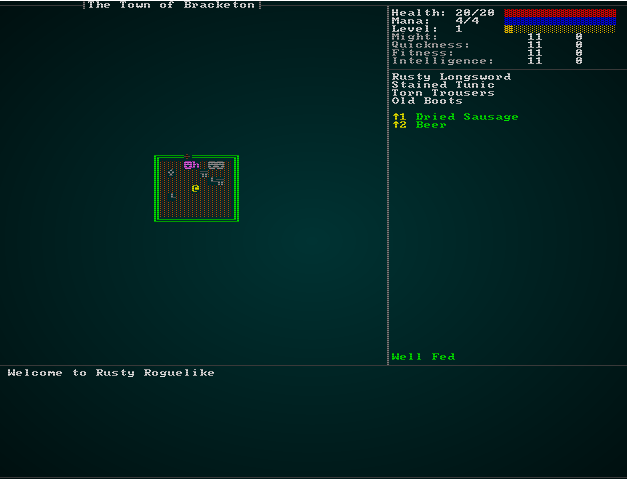

# AI Cleanup and Status Effects

---

***About this tutorial***

*This tutorial is free and open source, and all code uses the MIT license - so you are free to do with it as you like. My hope is that you will enjoy the tutorial, and make great games!*

*If you enjoy this and would like me to keep writing, please consider supporting [my Patreon](https://www.patreon.com/blackfuture).*

---

In the design document, we indicated that we'd like the AI to be smarter than the average rock. We've also added quite a few AI-related systems as we've worked through the chapters and (you may have noticed) some things like consistently applying *confusion* effects (and occasional problems hitting a mob that just moved) have slipped through the cracks!

As we add complexity to our monsters, it would be good to get all of this straightened out, make it easier to support new features, and handle commonalities like movement consistently.

## Chained Systems

Rather than try and do *everything* for an NPC in one system, we could break the process out into several steps. This is more typing, but has the advantage that each step is distinct, clear and does just one thing - making it *much* easier to debug. This is analogous to how we are handling `WantsToMelee` - we're indicating an intent and then handling it in its own step - which let us keep targeting and actually fighting separated.

Let's look at the steps, and see how they can be broken down:

* We determine that it is the NPC's turn.
* We check status effects - such as *Confusion* to determine if they can in fact go.
* The AI module for that AI type scans their surroundings, and determines if they want to move, attack or do nothing.
* Movement occurs, which updates various global statuses.
* Combat occurs, which can kill mobs or render them unable to act in the future.

## Modularizing the AI

We already have quite a few AI systems, and this is just going to add more. So let's move AI into a *module*. Create a new folder, `src/ai` - this will be the new AI module. Create a `mod.rs` file, and put the following into it:

```rust
mod animal_ai_system;
mod bystander_ai_system;
mod monster_ai_system;
pub use animal_ai_system::AnimalAI;
pub use bystander_ai_system::BystanderAI;
pub use monster_ai_system::MonsterAI;
```

This tells it to use the other AI modules and share them all in the `ai` namespace. Now move `animal_ai_system`, `bystander_ai_system` and `monster_ai_system` from your `src` directory into `src\ai`. In the preamble to `main.rs` (where you have all the `mod` and `use` statements), remove the `mod` and `use` statements for these systems. Replace them with a single `mod ai;` line. Finally, you can cleanup `run_systems` to reference these systems via the `ai` namespace:

```rust
impl State {
    fn run_systems(&mut self) {
        let mut mapindex = MapIndexingSystem{};
        mapindex.run_now(&self.ecs);
        let mut vis = VisibilitySystem{};
        vis.run_now(&self.ecs);
        let mut mob = ai::MonsterAI{};
        mob.run_now(&self.ecs);
        let mut animal = ai::AnimalAI{};
        animal.run_now(&self.ecs);
        let mut bystander = ai::BystanderAI{};
        bystander.run_now(&self.ecs);
...
```

In your `ai/X_system` files you have lines that read `use super::{...}`. Replace the `super` with `crate`, to indicate that you want to use the components (and other types) from the parent crate.

If you `cargo run` now, you have exactly the same game as before - your refactor worked!

## Determining Whose Turn It Is - Initiative/Energy Cost

So far, we've handles our turns in a strict but inflexible manner: the player goes, and then *all* the NPCs go. Back and forth, forever. This works pretty well, but it doesn't allow for much variety: you can't have something make an entity faster than the others, all actions take the same amount of time, and it would make things like *haste* and *slow* spells impossible to implement.

*Many* roguelike games use a variant of initiative or initiative cost to determine whose turn it is, so we'll go with something similar. We don't want to be *too* random, so you don't suddenly see things speed up and slow down, but we also want to be more flexible. We also want it to be a *little* random, so that all the NPCs don't act at the same time by default - giving basically what we have already. It would also be good to slow down wearers of heavy armor/weapons, and have users of light equipment go faster (dagger users can strike more frequently than claymore users!).

In `components.rs` (and registered in `main.rs` and `saveload_system.rs`), lets make a new `Initiative` component:

```rust
#[derive(Component, Debug, Serialize, Deserialize, Clone)]
pub struct Initiative {
    pub current : i32
}
```

We want the player to start with an initiative score (we'll go with 0, so they always start first). In `spawners.rs`, we simply add it to the `player` function as another component for the player:

```rust
.with(Initiative{current: 0})
```

We also want all NPCs to start with an initiative score. So in `raws/rawmaster.rs`, we add it to the `spawn_named_mob` function as another always-present component. We'll give mobs a starting initiative of 2 - so on the first turn they will all process just after the player (we'll worry about subsequent turns later).

```rust
// Initiative of 2
eb = eb.with(Initiative{current: 2});
```

That adds the component, but currently it doesn't *do* anything at all. We're going to start by making another new component in `components.rs` (and registering it in `main.rs` and `saveload_system.rs`), called `MyTurn`:

```rust
#[derive(Component, Debug, Serialize, Deserialize, Clone)]
pub struct MyTurn {}
```

The idea behind `MyTurn` components is that if you have the component, then it is your turn to act - and you should be included in AI/turn control (if the player has `MyTurn` then we wait for input). If you *don't* have it, then you don't get to act. We can also use it as a filter: so things like status effects can check to see if it is your turn and you are affected by a status, and they might determine that you have to skip your turn.

Now we should make a new - simple - system for handling initiative rolls. Make a new file, `ai/initiative_system.rs`:

```rust
extern crate specs;
use specs::prelude::*;
use crate::{Initiative, Position, MyTurn, Attributes, RunState};

pub struct InitiativeSystem {}

impl<'a> System<'a> for InitiativeSystem {
    #[allow(clippy::type_complexity)]
    type SystemData = ( WriteStorage<'a, Initiative>,
                        ReadStorage<'a, Position>,
                        WriteStorage<'a, MyTurn>,
                        Entities<'a>,
                        WriteExpect<'a, rltk::RandomNumberGenerator>,
                        ReadStorage<'a, Attributes>,
                        WriteExpect<'a, RunState>,
                        ReadExpect<'a, Entity>);

    fn run(&mut self, data : Self::SystemData) {
        let (mut initiatives, positions, mut turns, entities, mut rng, attributes, 
            mut runstate, player) = data;

        if *runstate != RunState::Ticking { return; } // We'll be adding Ticking in a moment; use MonsterTurn if you want to test in the meantime

        // Clear any remaining MyTurn we left by mistkae
        turns.clear();

        // Roll initiative
        for (entity, initiative, _pos) in (&entities, &mut initiatives, &positions).join() {
            initiative.current -= 1;
            if initiative.current < 1 {
                // It's my turn!
                turns.insert(entity, MyTurn{}).expect("Unable to insert turn");

                // Re-roll
                initiative.current = 6 + rng.roll_dice(1, 6);

                // Give a bonus for quickness
                if let Some(attr) = attributes.get(entity) {
                    initiative.current -= attr.quickness.bonus;
                }

                // TODO: More initiative granting boosts/penalties will go here later

                // If its the player, we want to go to an AwaitingInput state
                if entity == *player {
                    *runstate = RunState::AwaitingInput;
                }
            }
        }
    }
}
```

This is pretty simple:

1. We first clear out any remaining `MyTurn` components, in case we forgot to delete one (so entities don't zoom around).
2. We iterate all entities that have an `Initiative` component (indicating they can go at all) and a `Position` component (which we don't use, but indicates they are on the current map layer and can act).
3. We subtract one from the entity's current initiative.
4. If the current initiative is 0 (or less, in case we messed up!), we apply a `MyTurn` component to them. Then we re-roll their current initiative; we're going with `6 + 1d6 + Quickness Bonus` for now. Notice how we've left a comment indicating that we're going to make this more complicated later!
5. If it is now the player's turn, we change the global `RunState` to `AwaitingInput` - it's time to process the player's instructions.

We're also checking if it is the monster's turn; we'll actually be changing that - but I didn't want the system spinning rolling initiative over and over again if we test it!

Now we need to go into `mod.rs` and add `mod initiative_system.rs; pub use initiative_system::InitiativeSystem;` pair of lines to expose it to the rest of the program. Then we open up `main.rs` and add it to `run_systems`:

```rust
impl State {
    fn run_systems(&mut self) {
        let mut mapindex = MapIndexingSystem{};
        mapindex.run_now(&self.ecs);
        let mut vis = VisibilitySystem{};
        vis.run_now(&self.ecs);
        let mut initiative = ai::InitiativeSystem{};
        initiative.run_now(&self.ecs);
        ...
```

We've added it before the various AI functions run, but after we obtain a map index and visibility - so they have up-to-date data to work with.

## Adjusting the game loop to use initiative

Open up `main.rs` and we'll edit `RunState` to get rid of the `PlayerTurn` and `MonsterTurn` entries - replacing them instead with `Ticking`. This is going to break a *lot* of code - but that's ok, we're actually simplifying AND gaining functionality, which is a win by most standards! Here's the new `RunState`:

```rust
#[derive(PartialEq, Copy, Clone)]
pub enum RunState { 
    AwaitingInput, 
    PreRun, 
    Ticking, 
    ShowInventory, 
    ShowDropItem, 
    ShowTargeting { range : i32, item : Entity},
    MainMenu { menu_selection : gui::MainMenuSelection },
    SaveGame,
    NextLevel,
    PreviousLevel,
    ShowRemoveItem,
    GameOver,
    MagicMapReveal { row : i32 },
    MapGeneration,
    ShowCheatMenu
}
```

In our main loop's `match` function, we can delete the `MonsterTurn` entry completely and adjust `PlayerTurn` to be a more generic `Ticking` state:

```rust
RunState::Ticking => {
    self.run_systems();
    self.ecs.maintain();
    match *self.ecs.fetch::<RunState>() {
        RunState::AwaitingInput => newrunstate = RunState::AwaitingInput,
        RunState::MagicMapReveal{ .. } => newrunstate = RunState::MagicMapReveal{ row: 0 },
        _ => newrunstate = RunState::Ticking
    }                
}
```

You'll also want to search `main.rs` for `PlayerTurn` and `MonsterTurn`; a lot of states return to one of these when they are done. They now want to return to `Ticking`.

Likewise, in `player.rs` there's a lot of places we return `RunState::PlayerTurn` - you'll want to change all of these to `Ticking`.

We'll modify the hunger clock to only tick on your turn. This actually becomes more simple; we simply join on `MyTurn` and can remove the entire "proceed" system:

```rust
use specs::prelude::*;
use super::{HungerClock, RunState, HungerState, SufferDamage, gamelog::GameLog, MyTurn};

pub struct HungerSystem {}

impl<'a> System<'a> for HungerSystem {
    #[allow(clippy::type_complexity)]
    type SystemData = ( 
                        Entities<'a>,
                        WriteStorage<'a, HungerClock>,
                        ReadExpect<'a, Entity>, // The player
                        ReadExpect<'a, RunState>,
                        WriteStorage<'a, SufferDamage>,
                        WriteExpect<'a, GameLog>,
                        ReadStorage<'a, MyTurn>
                      );

    fn run(&mut self, data : Self::SystemData) {
        let (entities, mut hunger_clock, player_entity, runstate, mut inflict_damage, mut log,
            turns) = data;

        for (entity, mut clock, _myturn) in (&entities, &mut hunger_clock, &turns).join() {
            clock.duration -= 1;
            if clock.duration < 1 {
                match clock.state {
                    HungerState::WellFed => {
                        clock.state = HungerState::Normal;
                        clock.duration = 200;
                        if entity == *player_entity {
                            log.entries.push("You are no longer well fed.".to_string());
                        }
                    }
                    HungerState::Normal => {
                        clock.state = HungerState::Hungry;
                        clock.duration = 200;
                        if entity == *player_entity {
                            log.entries.push("You are hungry.".to_string());
                        }
                    }
                    HungerState::Hungry => {
                        clock.state = HungerState::Starving;
                        clock.duration = 200;
                        if entity == *player_entity {
                            log.entries.push("You are starving!".to_string());
                        }
                    }
                    HungerState::Starving => {
                        // Inflict damage from hunger
                        if entity == *player_entity {
                            log.entries.push("Your hunger pangs are getting painful! You suffer 1 hp damage.".to_string());
                        }
                        SufferDamage::new_damage(&mut inflict_damage, entity, 1, false);  
                    }
                }
            }
        }
    }
}
```

That leaves the files in `ai` with errors. We'll make the bare minimum of changes to make these run for now. Delete the lines that check the game state, and add a read storage for `MyTurn`. Add the turn to the join, so the entity only acts if it is their turn. So in `ai/animal_ai_system.rs`:

```rust
impl<'a> System<'a> for AnimalAI {
    #[allow(clippy::type_complexity)]
    type SystemData = ( WriteExpect<'a, Map>,
                        ReadExpect<'a, Entity>,
                        ReadExpect<'a, RunState>,
                        Entities<'a>,
                        WriteStorage<'a, Viewshed>, 
                        ReadStorage<'a, Herbivore>,
                        ReadStorage<'a, Carnivore>,
                        ReadStorage<'a, Item>,
                        WriteStorage<'a, WantsToMelee>,
                        WriteStorage<'a, EntityMoved>,
                        WriteStorage<'a, Position>,
                        ReadStorage<'a, MyTurn> );

    fn run(&mut self, data : Self::SystemData) {
        let (mut map, player_entity, runstate, entities, mut viewshed, 
            herbivore, carnivore, item, mut wants_to_melee, mut entity_moved, 
            mut position, turns) = data;
    ...
    for (entity, mut viewshed, _herbivore, mut pos, _turn) in (&entities, &mut viewshed, &herbivore, &mut position, &turns).join() {
    ...
    for (entity, mut viewshed, _carnivore, mut pos, _turn) in (&entities, &mut viewshed, &carnivore, &mut position, &turns).join() {
```

Likewise, in `bystander_ai_system.rs`:

```rust
impl<'a> System<'a> for BystanderAI {
    #[allow(clippy::type_complexity)]
    type SystemData = ( WriteExpect<'a, Map>,
                        ReadExpect<'a, RunState>,
                        Entities<'a>,
                        WriteStorage<'a, Viewshed>, 
                        ReadStorage<'a, Bystander>,
                        WriteStorage<'a, Position>,
                        WriteStorage<'a, EntityMoved>,
                        WriteExpect<'a, rltk::RandomNumberGenerator>,
                        ReadExpect<'a, Point>,
                        WriteExpect<'a, GameLog>,
                        WriteStorage<'a, Quips>,
                        ReadStorage<'a, Name>,
                        ReadStorage<'a, MyTurn>);

    fn run(&mut self, data : Self::SystemData) {
        let (mut map, runstate, entities, mut viewshed, bystander, mut position,
            mut entity_moved, mut rng, player_pos, mut gamelog, mut quips, names, turns) = data;

        for (entity, mut viewshed,_bystander,mut pos, _turn) in (&entities, &mut viewshed, &bystander, &mut position, &turns).join() {
        ...
```

And again in `monster_ai_system.rs`:

```rust
impl<'a> System<'a> for MonsterAI {
    #[allow(clippy::type_complexity)]
    type SystemData = ( WriteExpect<'a, Map>,
                        ReadExpect<'a, Point>,
                        ReadExpect<'a, Entity>,
                        ReadExpect<'a, RunState>,
                        Entities<'a>,
                        WriteStorage<'a, Viewshed>, 
                        ReadStorage<'a, Monster>,
                        WriteStorage<'a, Position>,
                        WriteStorage<'a, WantsToMelee>,
                        WriteStorage<'a, Confusion>,
                        WriteExpect<'a, ParticleBuilder>,
                        WriteStorage<'a, EntityMoved>,
                        ReadStorage<'a, MyTurn>);

    fn run(&mut self, data : Self::SystemData) {
        let (mut map, player_pos, player_entity, runstate, entities, mut viewshed, 
            monster, mut position, mut wants_to_melee, mut confused, mut particle_builder,
            mut entity_moved, turns) = data;

        for (entity, mut viewshed,_monster,mut pos, _turn) in (&entities, &mut viewshed, &monster, &mut position, &turns).join() {
```

That takes care of the compilation errors! Now `cargo run` the game. It runs as before, just a little more slowly. We'll worry about performance once we have the basics going - so that's great progress, we have an initiative system!

## Handling Status Effects

Right now, we check for *confusion* in the `monster_ai_system` - and actually forgot about it in bystanders, vendors and animals. Rather than copy/pasting the code everywhere, we should use this as an opportunity to create a system to handle status effect turn skipping, and clean up the other systems to benefit. Make a new file, `ai/turn_status.rs`:

```rust
extern crate specs;
use specs::prelude::*;
use crate::{MyTurn, Confusion, RunState};

pub struct TurnStatusSystem {}

impl<'a> System<'a> for TurnStatusSystem {
    #[allow(clippy::type_complexity)]
    type SystemData = ( WriteStorage<'a, MyTurn>,
                        WriteStorage<'a, Confusion>,
                        Entities<'a>,
                        ReadExpect<'a, RunState>);

    fn run(&mut self, data : Self::SystemData) {
        let (mut turns, mut confusion, entities, runstate) = data;

        if *runstate != RunState::Ticking { return; }

        let mut not_my_turn : Vec<Entity> = Vec::new();
        let mut not_confused : Vec<Entity> = Vec::new();
        for (entity, _turn, confused) in (&entities, &mut turns, &mut confusion).join() {
            confused.turns -= 1;
            if confused.turns < 1 {
                not_confused.push(entity);
            } else {
                not_my_turn.push(entity);
            }
        }

        for e in not_my_turn {
            turns.remove(e);
        }

        for e in not_confused {
            confusion.remove(e);
        }
    }
}
```

This is pretty simple: it iterates everyone who is confused, and decrements their turn counter. If they are still confused, it takes away `MyTurn`. If they have recovered, it takes away `Confusion`. You need to add a `mod` and `pub use` statement for it in `ai/mod.rs`, and add it to your `run_systems` function in `main.rs`:

```rust
let mut initiative = ai::InitiativeSystem{};
initiative.run_now(&self.ecs);
let mut turnstatus = ai::TurnStatusSystem{};
turnstatus.run_now(&self.ecs);
```

This shows the new pattern we are using: systems do one thing, and can remove `MyTurn` to prevent future execution. You can also go into `monster_ai_system` and remove everything relating to confusion.

## Quipping NPCs

Remember when we added bandits, we gave them some commentary to say for flavor? You may have noticed that they aren't actually speaking! That's because we handled quipping in the bystander AI - rather than as a general concept. Let's move the quipping into its own system. Make a new file, `ai/quipping.rs`:

```rust
extern crate specs;
use specs::prelude::*;
use crate::{gamelog::GameLog, Quips, Name, MyTurn, Viewshed};

pub struct QuipSystem {}

impl<'a> System<'a> for QuipSystem {
    #[allow(clippy::type_complexity)]
    type SystemData = ( WriteExpect<'a, GameLog>,
        WriteStorage<'a, Quips>,
        ReadStorage<'a, Name>,
        ReadStorage<'a, MyTurn>,
        ReadExpect<'a, rltk::Point>,
        ReadStorage<'a, Viewshed>,
        WriteExpect<'a, rltk::RandomNumberGenerator>);

    fn run(&mut self, data : Self::SystemData) {
        let (mut gamelog, mut quips, names, turns, player_pos, viewsheds, mut rng) = data;

        for (quip, name, viewshed, _turn) in (&mut quips, &names, &viewsheds, &turns).join() {
            if !quip.available.is_empty() && viewshed.visible_tiles.contains(&player_pos) && rng.roll_dice(1,6)==1 {
                let quip_index = 
                    if quip.available.len() == 1 { 0 } 
                    else { (rng.roll_dice(1, quip.available.len() as i32)-1) as usize };
                
                gamelog.entries.push(
                    format!("{} says \"{}\"", name.name, quip.available[quip_index])
                );
                quip.available.remove(quip_index);
            }                
        }
    }
}
```

This is basically the quipping code from `bystander_ai_system`, so we don't really need to go over it in too much detail. You do want to add it into `run_systems` in `main.rs` so it functions (and add a `mod` and `pub use` statement in `ai/mod.rs`):

```rust
turnstatus.run_now(&self.ecs);
let mut quipper = ai::QuipSystem{};
quipper.run_now(&self.ecs);
```

Also go into `bystander_ai_system.rs` and remove all the quip code! It shortens it a *lot*, and if you `cargo run` now, Bandits can insult you. In fact, *any* NPC can be given quip lines now - and will merrily say things to you. Once again, we've made the system smaller *and* gained functionality. Another win!

## Making AIs appear to think

Currently, we have a separate system for every type of AI - and wind up duplicating some code as a result. We also have some pretty unrealistic things going on: monsters remain completely static until they can see you, and forget all about you the moment you round a corner. Villagers move like random drunks, even when sober. Wolves hunt down deer - but again, only when they are visible. You can achieve a considerable increase in *apparent* AI intelligence (it's still quite dumb!) by giving NPCs *goals* - and having the goal last more than one turn. You can then switch the type-based decision making to be goal-based; helping the NPC achieve whatever it is that they want in life.

Let's take a moment to consider what our NPCs really want in life:

* Deer and other herbivores really want to eat grass, be left alone, and run away from things likely to kill them (which is everything, really; not a great place to be on the food chain).
* Monsters want to guard the dungeon, kill players, and otherwise lead a peaceful life.
* Wolves (and other carnivores) want to snack on players and herbivores.
* Gelatinous Cubes aren't really known for thinking much!
* Villagers really want to go about their daily lives, occasionally saying things to passing players.
* Vendors want to stay in their shops and sell you things in a future chapter update!

That doesn't really take into account transient objectives; an injured monster might want to get away from the fight, a monster might want to consider picking up the glowing *Longsword of Doom* that happens to be right next to them, and so on. It's a good start, though.

We can actually boil a lot of this down to a "state machine". You've seen those before: `RunState` makes the whole game a state, and each of the UI boxes returns a current state. In this case, we'll let an NPC have a *state* - which represents *what they are trying to do right now*, and if they have achieved it yet. We should be able to describe an AI's goals in terms of tags in the `json` raw file, and implement smaller sub-systems to make the AI behave somewhat believably.

## Determining how an AI feels about other entities

A lot of decisions facing AIs revolve around: who is that, and how do I feel about them? If they are an enemy, I should either attack or flee (depending upon my personality). If I feel neutral towards them, then I don't really care about their presence. If I like them, I may even want to stick close by! Entering *every* entity's feelings towards *every other* entity would be a huge data-entry chore - every time you added an entity, you'd need to go and add them to every single other entity (and remember to remove/edit them everywhere if you remove them/want to change them). That's not a great idea!

Like a lot of games, we can resolve this with a simple *faction* system. NPCs (and the player) are members of a faction. The faction has *feelings* towards other factions (including a default). We can then do a simple faction lookup to see how an NPC feels about a potential target. We can also include faction information in the user interface, to help players understand what's going on.

We'll start with a faction table in `spawns.json`. Here's a first draft:

```json
"faction_table" : [
    { "name" : "Player", "responses": { }},
    { "name" : "Mindless", "responses": { "Default" : "attack" } },
    { "name" : "Townsfolk", "responses" : { "Default" : "ignore" } },
    { "name" : "Bandits", "responses" : { "Default" : "attack" } },
    { "name" : "Cave Goblins", "responses" : { "Default" : "attack" } },
    { "name" : "Carnivores", "responses" : { "Default" : "attack" } },
    { "name" : "Herbivores", "responses" : { "Default" : "flee" } }
],
```

We'd also need to add an entry to each NPC, e.g.: `"faction" : "Bandit"`.

To make this work, we need to create a new component to store faction membership. As always, it needs registration in `main.rs` and `saveload_system.rs` as well as definition in `components.rs`:

```rust
#[derive(Component, Debug, Serialize, Deserialize, Clone)]
pub struct Faction {
    pub name : String
}
```

Let's start to use this by opening up `spawner.rs` and modifying the `player` function to always add the player to the "Player" faction:

```rust
.with(Faction{name : "Player".to_string() })
```

Now we need to load the faction table while we load the rest of the raw data. We'll make a new file, `raws/faction_structs.rs` to hold this information. Our goal is to mirror what we came up with for the JSON:

```rust
use serde::{Deserialize};
use std::collections::HashMap;

#[derive(Deserialize, Debug)]
pub struct FactionInfo {
    pub name : String,
    pub responses : HashMap<String, String>
}
```

In turn, we add it to the `Raws` structure in `raws/mod.rs`:

```rust
#[derive(Deserialize, Debug)]
pub struct Raws {
    pub items : Vec<Item>,
    pub mobs : Vec<Mob>,
    pub props : Vec<Prop>,    
    pub spawn_table : Vec<SpawnTableEntry>,
    pub loot_tables : Vec<LootTable>,
    pub faction_table : Vec<FactionInfo>
}
```

We also need to add it to the raw constructor in `raws/rawmaster.rs`:

```rust
impl RawMaster {
    pub fn empty() -> RawMaster {
        RawMaster {
            raws : Raws{ 
                items: Vec::new(), 
                mobs: Vec::new(), 
                props: Vec::new(), 
                spawn_table: Vec::new(),
                loot_tables: Vec::new(),
                faction_table : Vec::new(),
            },
            item_index : HashMap::new(),
            mob_index : HashMap::new(),
            prop_index : HashMap::new(),
            loot_index : HashMap::new()
        }
    }
```

We'll also want to add some indexing into `Raws`. We need a better way to represent reactions than a string, so lets add an enum to `faction_structs.rs` first:

```rust
#[derive(PartialEq, Eq, Hash, Copy, Clone)]
pub enum Reaction {
    Ignore, Attack, Flee
}
```

Now we add an index for reactions to `RawMaster`:

```rust
pub struct RawMaster {
    raws : Raws,
    item_index : HashMap<String, usize>,
    mob_index : HashMap<String, usize>,
    prop_index : HashMap<String, usize>,
    loot_index : HashMap<String, usize>,
    faction_index : HashMap<String, HashMap<String, Reaction>>
}
```

Also add it to the `RawMaster` constructor as `faction_index : HashMap::new()`. Finally, we'll setup the index - open the `load` function and add this at the end:

```rust
for faction in self.raws.faction_table.iter() {
    let mut reactions : HashMap<String, Reaction> = HashMap::new();
    for other in faction.responses.iter() {
        reactions.insert(
            other.0.clone(),
            match other.1.as_str() {
                "ignore" => Reaction::Ignore,
                "flee" => Reaction::Flee,
                _ => Reaction::Attack
            }
        );
    }
    self.faction_index.insert(faction.name.clone(), reactions);
}
```

This iterates through all of the factions, and then through their reactions to other factions - building a `HashMap` of how they respond to each faction. These are then stored in the `faction_index` table.

So that *loads* the raw faction information, we still have to turn it into something readily usable in-game. We should also add a faction option to the `mob_structs.rs`:

```rust
#[derive(Deserialize, Debug)]
pub struct Mob {
    pub name : String,
    pub renderable : Option<Renderable>,
    pub blocks_tile : bool,
    pub vision_range : i32,
    pub ai : String,
    pub quips : Option<Vec<String>>,
    pub attributes : MobAttributes,
    pub skills : Option<HashMap<String, i32>>,
    pub level : Option<i32>,
    pub hp : Option<i32>,
    pub mana : Option<i32>,
    pub equipped : Option<Vec<String>>,
    pub natural : Option<MobNatural>,
    pub loot_table : Option<String>,
    pub light : Option<MobLight>,
    pub faction : Option<String>
}
```

And in `spawn_named_mob`, add the component. If there isn't one, we'll automatically apply "mindless" to the mob:

```rust
if let Some(faction) = &mob_template.faction {
    eb = eb.with(Faction{ name: faction.clone() });
} else {
    eb = eb.with(Faction{ name : "Mindless".to_string() })
}
```

Now in `rawmaster.rs`, we'll add one more function: to query the factions table to obtain a reaction about a faction:

```rust
pub fn faction_reaction(my_faction : &str, their_faction : &str, raws : &RawMaster) -> Reaction {
    if raws.faction_index.contains_key(my_faction) {
        let mf = &raws.faction_index[my_faction];
        if mf.contains_key(their_faction) {
            return mf[their_faction];
        } else if mf.contains_key("Default") {
            return mf["Default"];
        } else {
            return Reaction::Ignore;
        }
    }
    Reaction::Ignore
}
```

So, given the name of `my_faction` and the other entity's faction (`their_faction`), we can query the faction table and return a reaction. We default to `Ignore`, if there isn't one (which shouldn't happen, since we default to `Mindless`).

## Common AI task: handling adjacent entities

Pretty much every AI needs to know how to handle an adjacent entity. It might be an enemy (to attack or run away from), someone to ignore, etc. - but it needs to be handled. Rather than handling it separately in every AI module, lets build a common system to handle it. Let's make a new file, `ai/adjacent_ai_system.rs` (and add a `mod` and `pub use` entry for it in `ai/mod.rs` like the others):

```rust
extern crate specs;
use specs::prelude::*;
use crate::{MyTurn, Faction, Position, Map, raws::Reaction, WantsToMelee};

pub struct AdjacentAI {}

impl<'a> System<'a> for AdjacentAI {
    #[allow(clippy::type_complexity)]
    type SystemData = ( 
        WriteStorage<'a, MyTurn>,
        ReadStorage<'a, Faction>,
        ReadStorage<'a, Position>,
        ReadExpect<'a, Map>,
        WriteStorage<'a, WantsToMelee>,
        Entities<'a>,
        ReadExpect<'a, Entity>
    );

    fn run(&mut self, data : Self::SystemData) {
        let (mut turns, factions, positions, map, mut want_melee, entities, player) = data;

        let mut turn_done : Vec<Entity> = Vec::new();
        for (entity, _turn, my_faction, pos) in (&entities, &turns, &factions, &positions).join() {
            if entity != *player {
                let mut reactions : Vec<(Entity, Reaction)> = Vec::new();
                let idx = map.xy_idx(pos.x, pos.y);
                let w = map.width;
                let h = map.height;
                // Add possible reactions to adjacents for each direction
                if pos.x > 0 { evaluate(idx-1, &map, &factions, &my_faction.name, &mut reactions); }
                if pos.x < w-1 { evaluate(idx+1, &map, &factions, &my_faction.name, &mut reactions); }
                if pos.y > 0 { evaluate(idx-w as usize, &map, &factions, &my_faction.name, &mut reactions); }
                if pos.y < h-1 { evaluate(idx+w as usize, &map, &factions, &my_faction.name, &mut reactions); }
                if pos.y > 0 && pos.x > 0 { evaluate((idx-w as usize)-1, &map, &factions, &my_faction.name, &mut reactions); }
                if pos.y > 0 && pos.x < w-1 { evaluate((idx-w as usize)+1, &map, &factions, &my_faction.name, &mut reactions); }
                if pos.y < h-1 && pos.x > 0 { evaluate((idx+w as usize)-1, &map, &factions, &my_faction.name, &mut reactions); }
                if pos.y < h-1 && pos.x < w-1 { evaluate((idx+w as usize)+1, &map, &factions, &my_faction.name, &mut reactions); }

                let mut done = false;
                for reaction in reactions.iter() {
                    if let Reaction::Attack = reaction.1 {
                        want_melee.insert(entity, WantsToMelee{ target: reaction.0 }).expect("Error inserting melee");
                        done = true;
                    }
                }

                if done { turn_done.push(entity); }
            }
        }

        // Remove turn marker for those that are done
        for done in turn_done.iter() {
            turns.remove(*done);
        }
    }
}

fn evaluate(idx : usize, map : &Map, factions : &ReadStorage<Faction>, my_faction : &str, reactions : &mut Vec<(Entity, Reaction)>) {
    for other_entity in map.tile_content[idx].iter() {
        if let Some(faction) = factions.get(*other_entity) {
            reactions.push((
                *other_entity, 
                crate::raws::faction_reaction(my_faction, &faction.name, &crate::raws::RAWS.lock().unwrap())
            ));
        }
    }
}
```

This system works as follows:

1. We query all entities with a faction, a position, and a turn and make sure we aren't modifying the player's behavior by checking the entity with the player entity resource.
2. We query the map for all adjacent tiles, recording reactions to neighboring entities.
3. We iterate the resulting reactions, if it is an `Attack` reaction - we cancel their turn and initiate a `WantsToMelee` result.

To actually *use* this system, add it into `run_systems` in `main.rs`, before the `MonsterAI`:

```rust
let mut adjacent = ai::AdjacentAI{};
adjacent.run_now(&self.ecs);
```

If you `cargo run` the game now, pandemonium erupts! *Everyone* is in the "mindless" faction, and as a result is hostile to everyone else! This is actually a *great* demo of how our engine can perform; despite combat going on from all quarters, it runs pretty well:



## Restoring peace in the town

It's also not at all what we had in mind for a peaceful starting town. It might work for a zombie apocalypse, but that's best left to *Cataclysm: Dark Days Ahead* (an excellent game, by the way)! Fortunately, we can restore peace to the town by adding a `"faction" : "Townsfolk"` line to all of the town NPCs. Here's the barkeep as an example; you need to do the same for all of the towns-people:

```json
{
    "name" : "Barkeep",
    "renderable": {
        "glyph" : "☻",
        "fg" : "#EE82EE",
        "bg" : "#000000",
        "order" : 1
    },
    "blocks_tile" : true,
    "vision_range" : 4,
    "ai" : "vendor",
    "attributes" : {
        "intelligence" : 13
    },
    "skills" : {
        "Melee" : 2
    },
    "equipped" : [ "Cudgel", "Cloth Tunic", "Cloth Pants", "Slippers" ],
    "faction" : "Townsfolk"
},
```

Once you've put those in, you can `cargo run` - and have peace in our time! Well, almost: if you watch the combat log, the rats lay into one another with a vengeance. Again, not quite what we intended. Open up `spawns.json` and lets add a faction for rats - and have them ignore one another. We'll add ignoring one another to a few other factions, too - so bandits aren't slaying one another for no reason:

```json
"faction_table" : [
    { "name" : "Player", "responses": { }},
    { "name" : "Mindless", "responses": { "Default" : "attack" } },
    { "name" : "Townsfolk", "responses" : { "Default" : "ignore" } },
    { "name" : "Bandits", "responses" : { "Default" : "attack", "Bandits" : "ignore" } },
    { "name" : "Cave Goblins", "responses" : { "Default" : "attack", "Cave Goblins" : "ignore" } },
    { "name" : "Carnivores", "responses" : { "Default" : "attack", "Carnivores" : "ignore" } },
    { "name" : "Herbivores", "responses" : { "Default" : "flee", "Herbivores" : "ignore" } },
    { "name" : "Hungry Rodents", "responses": { "Default" : "attack", "Hungry Rodents" : "ignore" }}
],
```

Also, add the `Rat` to the `Hungry Rodents` faction:

```json
{
    "name" : "Rat",
    "renderable": {
        "glyph" : "r",
        "fg" : "#FF0000",
        "bg" : "#000000",
        "order" : 1
    },
    "blocks_tile" : true,
    "vision_range" : 8,
    "ai" : "melee",
    "attributes" : {
        "Might" : 3,
        "Fitness" : 3
    },
    "skills" : {
        "Melee" : -1,
        "Defense" : -1
    },
    "natural" : {
        "armor_class" : 11,
        "attacks" : [
            { "name" : "bite", "hit_bonus" : 0, "damage" : "1d4" }
        ]   
    },
    "faction" : "Hungry Rodents"
},
```

`cargo run` now, and you'll see that the rats are leaving each other alone.

## Responding to more distant entities

Responding to those next to you is a great first step, and actually helps with processing time (since adjacent enemies are processed without a costly search of the entire viewshed) - but if there isn't an adjacent enemy, the AI needs to look for a more distant one. If one is spotted that needs a reaction, we need some components to indicate *intent*. In `components.rs` (and registered in `main.rs` and `saveload_system.rs`): 

```rust
#[derive(Component, Debug, Serialize, Deserialize, Clone)]
pub struct WantsToApproach {
    pub idx : i32
}

#[derive(Component, Debug, Serialize, Deserialize, Clone)]
pub struct WantsToFlee {
    pub indices : Vec<usize>
}
```

These are intended to indicate what the AI would like to do: either approach a tile (an enemy), or flee from a list of enemy tiles.

We'll make another new system, `ai/visible_ai_system.rs` (and add it to `mod` and `pub use` in `ai/mod.rs`):

```rust
extern crate specs;
use specs::prelude::*;
use crate::{MyTurn, Faction, Position, Map, raws::Reaction, Viewshed, WantsToFlee, WantsToApproach};

pub struct VisibleAI {}

impl<'a> System<'a> for VisibleAI {
    #[allow(clippy::type_complexity)]
    type SystemData = ( 
        ReadStorage<'a, MyTurn>,
        ReadStorage<'a, Faction>,
        ReadStorage<'a, Position>,
        ReadExpect<'a, Map>,
        WriteStorage<'a, WantsToApproach>,
        WriteStorage<'a, WantsToFlee>,
        Entities<'a>,
        ReadExpect<'a, Entity>,
        ReadStorage<'a, Viewshed>
    );

    fn run(&mut self, data : Self::SystemData) {
        let (turns, factions, positions, map, mut want_approach, mut want_flee, entities, player, viewsheds) = data;

        for (entity, _turn, my_faction, pos, viewshed) in (&entities, &turns, &factions, &positions, &viewsheds).join() {
            if entity != *player {
                let my_idx = map.xy_idx(pos.x, pos.y);
                let mut reactions : Vec<(usize, Reaction)> = Vec::new();
                let mut flee : Vec<usize> = Vec::new();
                for visible_tile in viewshed.visible_tiles.iter() {
                    let idx = map.xy_idx(visible_tile.x, visible_tile.y);
                    if my_idx != idx {
                        evaluate(idx, &map, &factions, &my_faction.name, &mut reactions);
                    }
                }

                let mut done = false;
                for reaction in reactions.iter() {
                    match reaction.1 {
                        Reaction::Attack => {
                            want_approach.insert(entity, WantsToApproach{ idx: reaction.0 as i32 }).expect("Unable to insert");
                            done = true;
                        }
                        Reaction::Flee => {
                            flee.push(reaction.0);
                        }
                        _ => {}
                    }
                }

                if !done && !flee.is_empty() {
                    want_flee.insert(entity, WantsToFlee{ indices : flee }).expect("Unable to insert");
                }
            }
        }
    }
}

fn evaluate(idx : usize, map : &Map, factions : &ReadStorage<Faction>, my_faction : &str, reactions : &mut Vec<(usize, Reaction)>) {
    for other_entity in map.tile_content[idx].iter() {
        if let Some(faction) = factions.get(*other_entity) {
            reactions.push((
                idx, 
                crate::raws::faction_reaction(my_faction, &faction.name, &crate::raws::RAWS.lock().unwrap())
            ));
        }
    }
}
```

Remember that this won't run at all if we're already dealing with an adjacent enemy - so there's no need to worry about assigning melee. It also doesn't *do* anything - it triggers intent for other systems/services. So we don't have to worry about ending the turn. It simply scans every visible tile, and evaluates the available reactions to the tile's content. If it sees something it would like to attack, it set a `WantsToApproach` component. If it sees things from which it should flee, it populates a `WantsToFlee` structure.

You'll want to add this into `run_systems` in `main.rs` also, after the adjacency check:

```rust
let mut visible = ai::VisibleAI{};
visible.run_now(&self.ecs);
```

### Approaching

Now that we're flagging a desire to approach a tile (for whatever reason; currently because the occupant deserves a whacking), we can write a very simple system to handle this. Make a new file, `ai/approach_ai_system.rs` (and `mod`/`pub use` it in `ai/mod.rs`):

```rust
extern crate specs;
use specs::prelude::*;
use crate::{MyTurn, WantsToApproach, Position, Map, Viewshed, EntityMoved};

pub struct ApproachAI {}

impl<'a> System<'a> for ApproachAI {
    #[allow(clippy::type_complexity)]
    type SystemData = ( 
        WriteStorage<'a, MyTurn>,
        WriteStorage<'a, WantsToApproach>,
        WriteStorage<'a, Position>,
        WriteExpect<'a, Map>,
        WriteStorage<'a, Viewshed>,
        WriteStorage<'a, EntityMoved>,
        Entities<'a>
    );

    fn run(&mut self, data : Self::SystemData) {
        let (mut turns, mut want_approach, mut positions, mut map, 
            mut viewsheds, mut entity_moved, entities) = data;
            
        let mut turn_done : Vec<Entity> = Vec::new();
        for (entity, mut pos, approach, mut viewshed, _myturn) in 
            (&entities, &mut positions, &want_approach, &mut viewsheds, &turns).join() 
        {
            turn_done.push(entity);
            let path = rltk::a_star_search(
                map.xy_idx(pos.x, pos.y) as i32, 
                map.xy_idx(approach.idx % map.width, approach.idx / map.width) as i32, 
                &mut *map
            );
            if path.success && path.steps.len()>1 {
                let mut idx = map.xy_idx(pos.x, pos.y);
                map.blocked[idx] = false;
                pos.x = path.steps[1] as i32 % map.width;
                pos.y = path.steps[1] as i32 / map.width;
                entity_moved.insert(entity, EntityMoved{}).expect("Unable to insert marker");
                idx = map.xy_idx(pos.x, pos.y);
                map.blocked[idx] = true;
                viewshed.dirty = true;
            }
        }

        want_approach.clear();

        // Remove turn marker for those that are done
        for done in turn_done.iter() {
            turns.remove(*done);
        }
    }
}
```

This is basically the same as the approach code from `MonsterAI`, but it applies to *all* approach requests - to any target. It also removes `MyTurn` when done, and removes all approach requests. Add it to `run_systems` in `main.rs`, after the distant AI handler:

```rust
let mut approach = ai::ApproachAI{};
approach.run_now(&self.ecs);
```

### Fleeing

We'll also want to implement a system for fleeing, mostly based on the fleeing code from our Animal AI. Make a new file, `flee_ai_system.rs` (and remember `mod` and `pub use` in `ai/mod.rs`):

```rust
extern crate specs;
use specs::prelude::*;
use crate::{MyTurn, WantsToFlee, Position, Map, Viewshed, EntityMoved};

pub struct FleeAI {}

impl<'a> System<'a> for FleeAI {
    #[allow(clippy::type_complexity)]
    type SystemData = ( 
        WriteStorage<'a, MyTurn>,
        WriteStorage<'a, WantsToFlee>,
        WriteStorage<'a, Position>,
        WriteExpect<'a, Map>,
        WriteStorage<'a, Viewshed>,
        WriteStorage<'a, EntityMoved>,
        Entities<'a>
    );

    fn run(&mut self, data : Self::SystemData) {
        let (mut turns, mut want_flee, mut positions, mut map, 
            mut viewsheds, mut entity_moved, entities) = data;
            
        let mut turn_done : Vec<Entity> = Vec::new();
        for (entity, mut pos, flee, mut viewshed, _myturn) in 
            (&entities, &mut positions, &want_flee, &mut viewsheds, &turns).join() 
        {
            turn_done.push(entity);
            let my_idx = map.xy_idx(pos.x, pos.y);
                map.populate_blocked();
                let flee_map = rltk::DijkstraMap::new(map.width as usize, map.height as usize, &flee.indices, &*map, 100.0);
                let flee_target = rltk::DijkstraMap::find_highest_exit(&flee_map, my_idx, &*map);
                if let Some(flee_target) = flee_target {
                    if !map.blocked[flee_target as usize] {
                        map.blocked[my_idx] = false;
                        map.blocked[flee_target as usize] = true;
                        viewshed.dirty = true;
                        pos.x = flee_target as i32 % map.width;
                        pos.y = flee_target as i32 / map.width;
                        entity_moved.insert(entity, EntityMoved{}).expect("Unable to insert marker");                        
                    }
                }
        }

        want_flee.clear();

        // Remove turn marker for those that are done
        for done in turn_done.iter() {
            turns.remove(*done);
        }
    }
}
```

We also need to register in in `run_systems` (`main.rs`), after the approach system:

```rust
let mut flee = ai::FleeAI{};
flee.run_now(&self.ecs);
```

For added effect, lets make Townsfolk run away from potentially hostile entities. In `spawns.json`:

```json
{ "name" : "Townsfolk", "responses" : { "Default" : "flee", "Player" : "ignore", "Townsfolk" : "ignore" } },
```

If you `cargo run` and play now, monsters will approach and attack - and cowards will flee from hostiles.

## Cleaning up

We're now performing the minimum AI performed by `MonsterAI` and much of the carnivore and herbivore handling in our generic systems, as well as giving townsfolk more intelligence than before! If you look at `MonsterAI` - there's nothing left that isn't performed already! So we can delete `ai/monster_ai_system.rs`, and remove it from `run_systems` (in `main.rs`) altogether! Once deleted, you should `cargo run` to see if the game is unchanged - it should be! 

Likewise, the fleeing and approaching of `ai/animal_ai_system.rs` is now redundant. You can actually delete this system, too!

It would be a good idea to make sure that all NPCs have a faction (except for Gelatinous Cubes, who actually are mindless) now. You can check out the source code of `spawns.json` to see the changes: it's pretty obvious, everything now has a faction.

## The remaining AI: Bystanders

So the remaining distinct AI module is the bystander, and they are doing just the one thing: moving randomly. This is actually a behavior that would fit well for deer, too (rather than just standing around). It would be nice if townsfolk showed *slightly* more intelligence, too.

Let's think about how our AI now works:

* *Initiative* determines if it's an NPC's turn.
* *Status* can take that away, depending upon effects being experienced.
* *Adjacency* determines immediate responses to nearby entities.
* *Vision* determines responses to slightly less nearby entities.
* *Per-AI systems* determine what the entity does now.

We could replace per-AI systems with a more generic set of "move options". These would govern what an NPC does if none of the other systems have caused it to act. Now let's think about how how we'd *like* townsfolk and others to move:

* Vendors stay in their shop.
* Patrons should stay in the shop they are patronizing.
* Drunk should stumble around at random. Deer should probably also move randomly, it just makes sense.
* Regular townsfolk should move between buildings, acting like they have a plan.
* Guards could patrol (we don't have any guards, but they would make sense). It might be nice for other monster types to patrol rather than staying static, also. Maybe bandits should roam the forest in search of victims.
* Hostiles should chase their target beyond visual range, but with some chance of escape.

### Making a movement mode component

Let's make a new component (in `components.rs`, and registered in `main.rs` and `saveload_system.rs`) to capture movement mode. We'll start with the easy ones: static (not going anywhere), and random (wandering like a fool!). Note that you don't need to register the enum - just the component:

```rust
#[derive(Debug, Serialize, Deserialize, Clone, Eq, PartialEq, Hash)]
pub enum Movement { 
    Static, 
    Random
}

#[derive(Component, Debug, Serialize, Deserialize, Clone)]
pub struct MoveMode {
    pub mode : Movement
}
```

Now we'll open up `raws/mob_structs.rs` and edit it to capture a movement mode - and no longer provide an AI tag (since this will let us do-away with them completely):

```rust
#[derive(Deserialize, Debug)]
pub struct Mob {
    pub name : String,
    pub renderable : Option<Renderable>,
    pub blocks_tile : bool,
    pub vision_range : i32,
    pub movement : String,
    pub quips : Option<Vec<String>>,
    pub attributes : MobAttributes,
    pub skills : Option<HashMap<String, i32>>,
    pub level : Option<i32>,
    pub hp : Option<i32>,
    pub mana : Option<i32>,
    pub equipped : Option<Vec<String>>,
    pub natural : Option<MobNatural>,
    pub loot_table : Option<String>,
    pub light : Option<MobLight>,
    pub faction : Option<String>
}
```

(We renamed `ai` to `movement`). This breaks a chunk of `rawmaster`; open up the `spawn_named_mob` function and replace the AI tag selection with:

```rust
match mob_template.movement.as_ref() {
    "random" => eb = eb.with(MoveMode{ mode: Movement::Random }),
    _ => eb = eb.with(MoveMode{ mode: Movement::Static })
}
```

Now, we need a new system to handle "default" (i.e. we've tried everything else) movement. Make a new file, `ai/default_move_system.rs` (don't forget to `mod` and `pub use` it in `ai/mod.rs`!):

```rust
extern crate specs;
use specs::prelude::*;
use crate::{MyTurn, MoveMode, Movement, Position, Map, Viewshed, EntityMoved};

pub struct DefaultMoveAI {}

impl<'a> System<'a> for DefaultMoveAI {
    #[allow(clippy::type_complexity)]
    type SystemData = ( 
        WriteStorage<'a, MyTurn>,
        ReadStorage<'a, MoveMode>,
        WriteStorage<'a, Position>,
        WriteExpect<'a, Map>,
        WriteStorage<'a, Viewshed>,
        WriteStorage<'a, EntityMoved>,
        WriteExpect<'a, rltk::RandomNumberGenerator>,
        Entities<'a>
    );

    fn run(&mut self, data : Self::SystemData) {
        let (mut turns, move_mode, mut positions, mut map, 
            mut viewsheds, mut entity_moved, mut rng, entities) = data;
            
        let mut turn_done : Vec<Entity> = Vec::new();
        for (entity, mut pos, mode, mut viewshed, _myturn) in 
            (&entities, &mut positions, &move_mode, &mut viewsheds, &turns).join() 
        {
            turn_done.push(entity);
            
            match mode.mode {
                Movement::Static => {},
                Movement::Random => {
                    let mut x = pos.x;
                    let mut y = pos.y;
                    let move_roll = rng.roll_dice(1, 5);
                    match move_roll {
                        1 => x -= 1,
                        2 => x += 1,
                        3 => y -= 1,
                        4 => y += 1,
                        _ => {}
                    }

                    if x > 0 && x < map.width-1 && y > 0 && y < map.height-1 {
                        let dest_idx = map.xy_idx(x, y);
                        if !map.blocked[dest_idx] {
                            let idx = map.xy_idx(pos.x, pos.y);
                            map.blocked[idx] = false;
                            pos.x = x;
                            pos.y = y;
                            entity_moved.insert(entity, EntityMoved{}).expect("Unable to insert marker");
                            map.blocked[dest_idx] = true;
                            viewshed.dirty = true;
                        }
                    }
                }
            }
        }

        // Remove turn marker for those that are done
        for done in turn_done.iter() {
            turns.remove(*done);
        }
    }
}
```

Now open up `main.rs`, find `run_systems` and *replace* the call to `BystanderAI` with `DefaultMoveAI`:

```rust
let mut defaultmove = ai::DefaultMoveAI{};
defaultmove.run_now(&self.ecs);
```

Finally, we need to open up `spawns.json` and replace *all* references to `ai=` in mobs with `movement=`. Choose `static` for all of them except for Patrons, herbivores and Drunks.

If you `cargo run` now, you'll see that everyone stands around - except for the random ones, who wander aimlessly.

One last thing for this segment: go ahead and delete the `bystander_ai_system.rs` file, and all references to it. We don't need it anymore!

### Adding in waypoint-based movement

We mentioned that we'd like townsfolk to mill about, but not randomly. Open up `components.rs`, and add a mode to `Movement`:

```rust
#[derive(Debug, Serialize, Deserialize, Clone, Eq, PartialEq, Hash)]
pub enum Movement { 
    Static, 
    Random,
    RandomWaypoint{ path : Option<Vec<usize>> }
}
```

Notice that we're using Rust's feature that `enum` is really a `union` in other languages, to add in an optional `path` for random movement. This represents where the AI is trying to go - or `None` if there isn't a current target (either because they just started, or they got there). We're hoping to not run an expensive A-Star search every turn, so we'll store the path - and keep following it until it is invalid.

Now in `rawmaster.rs`, we'll add it to the list of movement modes:

```rust
match mob_template.movement.as_ref() {
    "random" => eb = eb.with(MoveMode{ mode: Movement::Random }),
    "random_waypoint" => eb = eb.with(MoveMode{ mode: Movement::RandomWaypoint{ path: None } }),
    _ => eb = eb.with(MoveMode{ mode: Movement::Static })
}
```

And in `default_move_system.rs`, we can add in the actual movement logic:

```rust
Movement::RandomWaypoint{path} => {
    if let Some(path) = path {
        // We have a target - go there
        let mut idx = map.xy_idx(pos.x, pos.y);
        if path.len()>1 {
            if !map.blocked[path[1] as usize] {
                map.blocked[idx] = false;
                pos.x = path[1] % map.width;
                pos.y = path[1] / map.width;
                entity_moved.insert(entity, EntityMoved{}).expect("Unable to insert marker");
                idx = map.xy_idx(pos.x, pos.y);
                map.blocked[idx] = true;
                viewshed.dirty = true;
                path.remove(0); // Remove the first step in the path
            }
            // Otherwise we wait a turn to see if the path clears up
        } else {
            mode.mode = Movement::RandomWaypoint{ path : None };
        }
    } else {
        let target_x = rng.roll_dice(1, map.width-2);
        let target_y = rng.roll_dice(1, map.height-2);
        let idx = map.xy_idx(target_x, target_y);
        if tile_walkable(map.tiles[idx]) {
            let path = rltk::a_star_search(
                map.xy_idx(pos.x, pos.y) as i32, 
                map.xy_idx(target_x, target_y) as i32, 
                &mut *map
            );
            if path.success && path.steps.len()>1 {
                mode.mode = Movement::RandomWaypoint{ 
                    path: Some(path.steps)
                };
            }
        }
    }
```

This is a bit convoluted, so let's walk through it:

1. We match on `RandomWaypoint` and capture `path` as a variable (to access it inside the enum).
2. If a path exists:
    1. If it has more than one entry.
        1. If the next step isn't blocked.
            1. Actually perform the move by following the path.
            2. Remove the first entry from the path, so we keep following it.
        2. Wait a turn, the path may clear up
    2. Give up and set no path.
3. If the path doesn't exist:
    1. Pick a random location.
    2. If the random location is walkable, path to it.
    3. If the path succeeded, store it as the AI's `path`.
    4. Otherwise, leave with no path - knowing we'll be back next turn to try another one.

If you `cargo run` now (and set some AI types in `spawns.json` to `random_waypoint`), you'll see that villagers now act like they have a plan - they move along paths. Because A-Star respects our movement costs, they even automatically prefer paths and roads! It looks *much* more realistic now.

## Chasing the target

Our other stated goal is that once an AI starts to chase a target, it shouldn't give up just because it lost line-of-sight. On the other hand, it shouldn't have an omniscient view of the map and perfectly track its target either! It also needs to not be the *default* action - but should occur before defaults if it is an option.

We can accomplish this by creating a new component (in `components.rs`, remembering to register in `main.rs` and `saveload_system.rs`):

```rust
#[derive(Component, Debug, ConvertSaveload, Clone)]
pub struct Chasing {
    pub target : Entity
}
```

Unfortunately, we're storing an `Entity` - so we need some extra boilerplate to make the serialization system happy:

```rust```

Now we can modify our `visible_ai_system.rs` file to add a `Chasing` component whenever it wants to chase after a target. There's a lot of small changes, so I've included the whole file:

```rust
extern crate specs;
use specs::prelude::*;
use crate::{MyTurn, Faction, Position, Map, raws::Reaction, Viewshed, WantsToFlee, 
    WantsToApproach, Chasing};

pub struct VisibleAI {}

impl<'a> System<'a> for VisibleAI {
    #[allow(clippy::type_complexity)]
    type SystemData = ( 
        ReadStorage<'a, MyTurn>,
        ReadStorage<'a, Faction>,
        ReadStorage<'a, Position>,
        ReadExpect<'a, Map>,
        WriteStorage<'a, WantsToApproach>,
        WriteStorage<'a, WantsToFlee>,
        Entities<'a>,
        ReadExpect<'a, Entity>,
        ReadStorage<'a, Viewshed>,
        WriteStorage<'a, Chasing>
    );

    fn run(&mut self, data : Self::SystemData) {
        let (turns, factions, positions, map, mut want_approach, mut want_flee, entities, player, 
            viewsheds, mut chasing) = data;

        for (entity, _turn, my_faction, pos, viewshed) in (&entities, &turns, &factions, &positions, &viewsheds).join() {
            if entity != *player {
                let my_idx = map.xy_idx(pos.x, pos.y);
                let mut reactions : Vec<(usize, Reaction, Entity)> = Vec::new();
                let mut flee : Vec<usize> = Vec::new();
                for visible_tile in viewshed.visible_tiles.iter() {
                    let idx = map.xy_idx(visible_tile.x, visible_tile.y);
                    if my_idx != idx {
                        evaluate(idx, &map, &factions, &my_faction.name, &mut reactions);
                    }
                }

                let mut done = false;
                for reaction in reactions.iter() {
                    match reaction.1 {
                        Reaction::Attack => {
                            want_approach.insert(entity, WantsToApproach{ idx: reaction.0 as i32 }).expect("Unable to insert");
                            chasing.insert(entity, Chasing{ target: reaction.2}).expect("Unable to insert");
                            done = true;
                        }
                        Reaction::Flee => {
                            flee.push(reaction.0);
                        }
                        _ => {}
                    }
                }

                if !done && !flee.is_empty() {
                    want_flee.insert(entity, WantsToFlee{ indices : flee }).expect("Unable to insert");
                }
            }
        }
    }
}

fn evaluate(idx : usize, map : &Map, factions : &ReadStorage<Faction>, my_faction : &str, reactions : &mut Vec<(usize, Reaction, Entity)>) {
    for other_entity in map.tile_content[idx].iter() {
        if let Some(faction) = factions.get(*other_entity) {
            reactions.push((
                idx, 
                crate::raws::faction_reaction(my_faction, &faction.name, &crate::raws::RAWS.lock().unwrap()),
                *other_entity
            ));
        }
    }
}
```

That's a great start: when going after an NPC, we'll automatically start chasing them. Now, lets make a new system to handle chasing; create `ai/chase_ai_system.rs` (and `mod`, `pub use` in `ai/mod.rs`):

```rust
extern crate specs;
use specs::prelude::*;
use crate::{MyTurn, Chasing, Position, Map, Viewshed, EntityMoved};
use std::collections::HashMap;

pub struct ChaseAI {}

impl<'a> System<'a> for ChaseAI {
    #[allow(clippy::type_complexity)]
    type SystemData = ( 
        WriteStorage<'a, MyTurn>,
        WriteStorage<'a, Chasing>,
        WriteStorage<'a, Position>,
        WriteExpect<'a, Map>,
        WriteStorage<'a, Viewshed>,
        WriteStorage<'a, EntityMoved>,
        Entities<'a>
    );

    fn run(&mut self, data : Self::SystemData) {
        let (mut turns, mut chasing, mut positions, mut map, 
            mut viewsheds, mut entity_moved, entities) = data;
        
        let mut targets : HashMap<Entity, (i32, i32)> = HashMap::new();
        let mut end_chase : Vec<Entity> = Vec::new();
        for (entity, _turn, chasing) in (&entities, &turns, &chasing).join() {
            let target_pos = positions.get(chasing.target);
            if let Some(target_pos) = target_pos {
                targets.insert(entity, (target_pos.x, target_pos.y));
            } else {
                end_chase.push(entity);
            }
        }

        for done in end_chase.iter() {
            chasing.remove(*done);
        }
        end_chase.clear();

        let mut turn_done : Vec<Entity> = Vec::new();
        for (entity, mut pos, _chase, mut viewshed, _myturn) in 
            (&entities, &mut positions, &chasing, &mut viewsheds, &turns).join() 
        {
            turn_done.push(entity);
            let target_pos = targets[&entity];
            let path = rltk::a_star_search(
                map.xy_idx(pos.x, pos.y) as i32, 
                map.xy_idx(target_pos.0, target_pos.1) as i32, 
                &mut *map
            );
            if path.success && path.steps.len()>1 && path.steps.len()<15 {
                let mut idx = map.xy_idx(pos.x, pos.y);
                map.blocked[idx] = false;
                pos.x = path.steps[1] as i32 % map.width;
                pos.y = path.steps[1] as i32 / map.width;
                entity_moved.insert(entity, EntityMoved{}).expect("Unable to insert marker");
                idx = map.xy_idx(pos.x, pos.y);
                map.blocked[idx] = true;
                viewshed.dirty = true;
                turn_done.push(entity);
            } else {
                end_chase.push(entity);
            }
        }

        for done in end_chase.iter() {
            chasing.remove(*done);
        }
        for done in turn_done.iter() {
            turns.remove(*done);
        }
    }
}
```

This system ended up being more complicated than I hoped, becuase the borrow checker *really* didn't want me reaching into `Position` storage twice. So we ended up with the following:

1. We iterate all entities that have a `Chasing` component, as well as a turn. We look to see if their target is valid, and if it is - we store it in a temporary HashMap. This gets around needing to look inside `Position` twice. If it isn't valid, we remove the component.
2. We iterate everyone who is still chasing, and path to their target. If the path succeeds, then it follows the path. If if doesn't, we remove the chasing component.
3. We remove everyone who took a turn from the `MyTurn` list.

Add it into `run_systems` before the default movement system:

```rust
let mut approach = ai::ApproachAI{};
approach.run_now(&self.ecs);
```

## Removing per-AI tags

We're no longer using the `Bystander`, `Monster`, `Carnivore`, `Herbivore` and `Vendor` tags! Open up `components.rs` and delete them. You'll also need to delete their registration in `main.rs` and `saveload_system.rs`. Once they are gone, you will still see errors in `player.rs`; why? We used to use these tags to determine if we should attack or trade-places with an NPC. We can replace the failing code in `try_move_player` quite easily. First, remove the references to these components from your `using` statements. Then replace these two lines:

```rust
let bystanders = ecs.read_storage::<Bystander>();
let vendors = ecs.read_storage::<Vendor>();
```

with:

```rust
let factions = ecs.read_storage::<Faction>();
```

Then we replace the tag check with:

```rust
for potential_target in map.tile_content[destination_idx].iter() {
    let mut hostile = true;
    if combat_stats.get(*potential_target).is_some() {
        if let Some(faction) = factions.get(*potential_target) {
            let reaction = crate::raws::faction_reaction(
                &faction.name, 
                "Player", 
                &crate::raws::RAWS.lock().unwrap()
            );
            if reaction != Reaction::Attack { hostile = false; }
        }
    }
    if !hostile {
        // Note that we want to move the bystander
```

Notice that we're using the faction system we made earlier! There's one more fix to `player.rs` - deciding if we can heal because of nearby monsters. It's basically the same change - we check if an entity is hostile, and if it is it prohibits healing (because you are nervous/on-edge!):

```rust
fn skip_turn(ecs: &mut World) -> RunState {
    let player_entity = ecs.fetch::<Entity>();
    let viewshed_components = ecs.read_storage::<Viewshed>();
    let factions = ecs.read_storage::<Faction>();

    let worldmap_resource = ecs.fetch::<Map>();

    let mut can_heal = true;
    let viewshed = viewshed_components.get(*player_entity).unwrap();
    for tile in viewshed.visible_tiles.iter() {
        let idx = worldmap_resource.xy_idx(tile.x, tile.y);
        for entity_id in worldmap_resource.tile_content[idx].iter() {
            let faction = factions.get(*entity_id);
            match faction {
                None => {}
                Some(faction) => { 
                    let reaction = crate::raws::faction_reaction(
                        &faction.name, 
                        "Player", 
                        &crate::raws::RAWS.lock().unwrap()
                    );
                    if reaction == Reaction::Attack {
                        can_heal = false; 
                    }
                }
            }
        }
    }
    ...
```

## Distance Culling AI

We're currently spending a *lot* of CPU cycles on events far from the player. Performance is still ok, but this is sub-optimal for two reasons:

* We may just run around finding dead people if the factions are fighting while we are far away. It tells a better story to arrive as something is happening rather than just finding the aftermath.
* We don't want to waste our precious CPU cycles!

Let's open up `initiative_system.rs` and modify it to check the distance to the player, and not have a turn if they are far away:

```rust
extern crate specs;
use specs::prelude::*;
use crate::{Initiative, Position, MyTurn, Attributes, RunState};

pub struct InitiativeSystem {}

impl<'a> System<'a> for InitiativeSystem {
    #[allow(clippy::type_complexity)]
    type SystemData = ( WriteStorage<'a, Initiative>,
                        ReadStorage<'a, Position>,
                        WriteStorage<'a, MyTurn>,
                        Entities<'a>,
                        WriteExpect<'a, rltk::RandomNumberGenerator>,
                        ReadStorage<'a, Attributes>,
                        WriteExpect<'a, RunState>,
                        ReadExpect<'a, Entity>,
                        ReadExpect<'a, rltk::Point>);

    fn run(&mut self, data : Self::SystemData) {
        let (mut initiatives, positions, mut turns, entities, mut rng, attributes, 
            mut runstate, player, player_pos) = data;

        if *runstate != RunState::Ticking { return; }

        // Clear any remaining MyTurn we left by mistkae
        turns.clear();

        // Roll initiative
        for (entity, initiative, pos) in (&entities, &mut initiatives, &positions).join() {
            initiative.current -= 1;
            if initiative.current < 1 {
                let mut myturn = true;

                // Re-roll
                initiative.current = 6 + rng.roll_dice(1, 6);

                // Give a bonus for quickness
                if let Some(attr) = attributes.get(entity) {
                    initiative.current -= attr.quickness.bonus;
                }

                // TODO: More initiative granting boosts/penalties will go here later

                // If its the player, we want to go to an AwaitingInput state
                if entity == *player {
                    *runstate = RunState::AwaitingInput;
                } else {
                    let distance = rltk::DistanceAlg::Pythagoras.distance2d(*player_pos, rltk::Point::new(pos.x, pos.y));
                    if distance > 20.0 {
                        myturn = false;
                    }
                }

                // It's my turn!
                if myturn {
                    turns.insert(entity, MyTurn{}).expect("Unable to insert turn");
                }

            }
        }
    }
}
```

## Fixing Performance

You may have noticed a performance drop while we worked through this chapter. We've added a lot of functionality, so the systems seemed like the culprit - but they aren't! Our systems are actually running at a really good speed (one advantage of doing one thing per system: your CPU cache is very happy!). If you'd like to prove it, do a debug build, fire up a profiler (I use [Very Sleepy](http://www.codersnotes.com/sleepy/) on Windows) and attach it to the game! 

The culprit is actually *initiative*. Not every entity is moving on the same tick anymore, so it's taking more cycles through the main loop to get to the player's turn. This is a *small* slowdown, but noticeable. Fortunately, you can fix it with a quick change to the main loop in `main.rs`:

```rust
RunState::Ticking => {
    while newrunstate == RunState::Ticking {
        self.run_systems();
        self.ecs.maintain();
        match *self.ecs.fetch::<RunState>() {
            RunState::AwaitingInput => newrunstate = RunState::AwaitingInput,
            RunState::MagicMapReveal{ .. } => newrunstate = RunState::MagicMapReveal{ row: 0 },
            _ => newrunstate = RunState::Ticking
        }                
    }
}
```

This runs all initiative cycles until it's the player's turn. It brings the game back up to full speed.

## Wrap-Up

This has been a *long* chapter, for which I apologize - but it's been a really productive one! Instead of standing around or roaming completely randomly, AI now operates in layers - deciding first on adjacent targets, then visible targets, and then a default action. It can even hunt you down. This has gone a long way to make the AI feel smarter.

If you `cargo run` now, you can enjoy a much richer world!

...

**The source code for this chapter may be found [here](https://github.com/thebracket/rustrogueliketutorial/tree/master/chapter-57-ai)**


[Run this chapter's example with web assembly, in your browser (WebGL2 required)](https://bfnightly.bracketproductions.com/rustbook/wasm/chapter-57-ai)
---

Copyright (C) 2019, Herbert Wolverson.

---