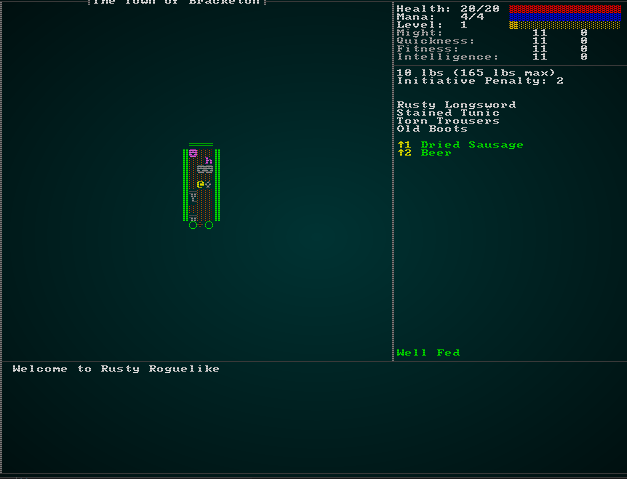
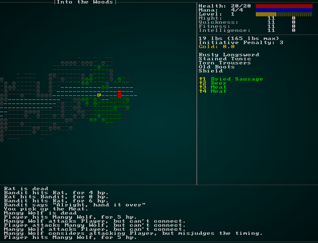
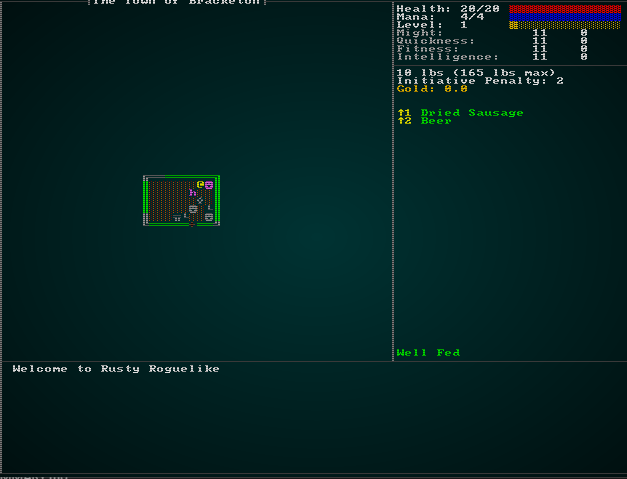

# Item Stats

---

***About this tutorial***

*This tutorial is free and open source, and all code uses the MIT license - so you are free to do with it as you like. My hope is that you will enjoy the tutorial, and make great games!*

*If you enjoy this and would like me to keep writing, please consider supporting [my Patreon](https://www.patreon.com/blackfuture).*

[](https://pragprog.com/titles/hwrust/hands-on-rust/)

---

In the previous chapter we talked about using initiative to make heavy armor have a movement cost, and making some weapons faster than others. The design document also talks about vendors. Finally, what RPG/roguelike is complete without annoying "you are overburdened" messages (and accompanying speed penalties) to make you manage your inventory? These features all point in one direction: additional item statistics, and integrating them into the game systems.

## Defining item information

We already have a component called `Item`; all items have it already, so it seems like the perfect place to add this information! Open up `components.rs`, and we'll edit the `Item` structure to include the information we need for initiative penalties, encumbrance and vendors:

```rust
#[derive(Component, Debug, Serialize, Deserialize, Clone)]
pub struct Item {
    pub initiative_penalty : f32,
    pub weight_lbs : f32,
    pub base_value : f32
}
```

So we're defining an `initiative_penalty` - which will be added to your initiative roll to slow you down when equipped (or used, in the case of weapons); `weight_lbs` - which defines how much the item weighs, in pounds; and `base_value` which is the base price of an item in gold pieces (decimal, so we can allow silver also).

We need a way to enter this information, so we open up `raws/item_structs.rs` and edit the `Item` structure:

```rust
#[derive(Deserialize, Debug)]
pub struct Item {
    pub name : String,
    pub renderable : Option<Renderable>,
    pub consumable : Option<Consumable>,
    pub weapon : Option<Weapon>,
    pub wearable : Option<Wearable>,
    pub initiative_penalty : Option<f32>,
    pub weight_lbs : Option<f32>,
    pub base_value : Option<f32>
}
```

Note that we're making these *optional* - if you don't define them in the `spawns.json` file, they will default to zero. Lastly, we need to fix `raws/rawmaster.rs`'s `spawn_named_item` function to load these values. Replace the line that adds an `Item` with:

```rust
eb = eb.with(crate::components::Item{
    initiative_penalty : item_template.initiative_penalty.unwrap_or(0.0),
    weight_lbs : item_template.weight_lbs.unwrap_or(0.0),
    base_value : item_template.base_value.unwrap_or(0.0)            
});
```

This is taking advantage of `Option`'s `unwrap_or` function - either it returns the wrapped value (if there is one), *or* it returns 0.0. Handy feature to save typing!

These values won't exist until you go into `spawns.json` and start adding them. I've been taking values from [the roll20 compendium](https://roll20.net/compendium/dnd5e/Weapons) for weight and value, and pulling numbers out of the air for initiative penalty. I've entered them [in the source code](https://github.com/thebracket/rustrogueliketutorial/tree/master/chapter-58-itemstats/raws/spawns.json) rather than repeat them all here. Here's an example:

```json
{
    "name" : "Longsword",
    "renderable": {
        "glyph" : "/",
        "fg" : "#FFAAFF",
        "bg" : "#000000",
        "order" : 2
    },
    "weapon" : {
        "range" : "melee",
        "attribute" : "Might",
        "base_damage" : "1d8",
        "hit_bonus" : 0
    },
    "weight_lbs" : 3.0,
    "base_value" : 15.0,
    "initiative_penalty" : 2
},
```

## Calculating encumbrance and initiative penalties

A simple approach would be to loop through every entity and total up their weight and initiative penalty every turn. The problem with this is that it is potentially rather slow; *lots* of entities have equipment (most of them!), and we really only need to recalculate it when something has changed. We use the same approach with visibility by marking it *dirty*. So lets start by extending `Pools` to include two fields for the totals. In `components.rs`:

```rust
#[derive(Component, Debug, Serialize, Deserialize, Clone)]
pub struct Pools {
    pub hit_points : Pool,
    pub mana : Pool,
    pub xp : i32,
    pub level : i32,
    pub total_weight : f32,
    pub total_initiative_penalty : f32
}
```

You'll need to open up `spawner.rs` and add these fields to the initial `Pools` setup for the `Player` (we'll use zeroes and rely on calculating it):

```rust
.with(Pools{
    hit_points : Pool{ 
        current: player_hp_at_level(11, 1), 
        max: player_hp_at_level(11, 1) 
    },
    mana: Pool{
        current: mana_at_level(11, 1),
        max: mana_at_level(11, 1)
    },
    xp: 0,
    level: 1,
    total_weight : 0.0,
    total_initiative_penalty : 0.0
})
```

Likewise, in `rawmaster.rs`, `spawn_named_mob` needs to gain these fields in its `Pools` initialization:

```rust
let pools = Pools{
    level: mob_level,
    xp: 0,
    hit_points : Pool{ current: mob_hp, max: mob_hp },
    mana: Pool{current: mob_mana, max: mob_mana},
    total_weight : 0.0,
    total_initiative_penalty : 0.0
};
eb = eb.with(pools);
```

Now, we need a way to indicate to the game that equipment has changed. This can happen for all sorts of reasons, so we want to be as generic as possible! Open up `components.rs`, and make a new "tag" component (and then register it in `main.rs` and `saveload_system.rs`):

```rust
#[derive(Component, Debug, Serialize, Deserialize, Clone)]
pub struct EquipmentChanged {}
```

Open up `spawner.rs` and we'll *start* the player's life with this tag applied:

```rust
.with(EquipmentChanged{})
```

Likewise, in `rawmaster.rs`'s `spawn_named_mob`, we'll do the same:

```rust
eb = eb.with(EquipmentChanged{});
```

Now, we'll make a new system to calculate this. Make a new file, `ai/encumbrance_system.rs` (and include `mod` and `pub use` statements in `ai/mod.rs`):

```rust
use specs::prelude::*;
use crate::{EquipmentChanged, Item, InBackpack, Equipped, Pools, Attributes, gamelog::GameLog};
use std::collections::HashMap;

pub struct EncumbranceSystem {}

impl<'a> System<'a> for EncumbranceSystem {
    #[allow(clippy::type_complexity)]
    type SystemData = ( 
        WriteStorage<'a, EquipmentChanged>,
        Entities<'a>,
        ReadStorage<'a, Item>,
        ReadStorage<'a, InBackpack>,
        ReadStorage<'a, Equipped>,
        WriteStorage<'a, Pools>,
        ReadStorage<'a, Attributes>,
        ReadExpect<'a, Entity>,
        WriteExpect<'a, GameLog>
    );

    fn run(&mut self, data : Self::SystemData) {
        let (mut equip_dirty, entities, items, backpacks, wielded, 
            mut pools, attributes, player, mut gamelog) = data;

        if equip_dirty.is_empty() { return; }

        // Build the map of who needs updating
        let mut to_update : HashMap<Entity, (f32, f32)> = HashMap::new(); // (weight, intiative)
        for (entity, _dirty) in (&entities, &equip_dirty).join() {
            to_update.insert(entity, (0.0, 0.0));
        }

        // Remove all dirty statements
        equip_dirty.clear();

        // Total up equipped items
        for (item, equipped) in (&items, &wielded).join() {
            if to_update.contains_key(&equipped.owner) {
                let totals = to_update.get_mut(&equipped.owner).unwrap();
                totals.0 += item.weight_lbs;
                totals.1 += item.initiative_penalty;
            }
        }

        // Total up carried items
        for (item, carried) in (&items, &backpacks).join() {
            if to_update.contains_key(&carried.owner) {
                let totals = to_update.get_mut(&carried.owner).unwrap();
                totals.0 += item.weight_lbs;
                totals.1 += item.initiative_penalty;
            }
        }

        // Apply the data to Pools
        for (entity, (weight, initiative)) in to_update.iter() {
            if let Some(pool) = pools.get_mut(*entity) {
                pool.total_weight = *weight;
                pool.total_initiative_penalty = *initiative;

                if let Some(attr) = attributes.get(*entity) {
                    let carry_capacity_lbs = (attr.might.base + attr.might.modifiers) * 15;
                    if pool.total_weight as i32 > carry_capacity_lbs {
                        // Overburdened
                        pool.total_initiative_penalty += 4.0;
                        if *entity == *player {
                            gamelog.entries.push("You are overburdened, and suffering an initiative penalty.".to_string());
                        }
                    }
                }
            }
        }
    }
}
```

Let's walk through what this does:

1. If we aren't in the `Ticking` run state, we return (no need to keep cycling when waiting for input!).
2. If there aren't any `EquipmentChanged` entries, we return (no need to do the extra work if there's nothing to do).
3. We cycle through all entities with an `EquipmentChanged` entry and store them in a `to_update` HashMap, along with zeroes for weight and initiative.
4. We remove all `EquipmentChanged` tags.
5. We cycle through all equipped items. If their owner is in the `to_update` list, we add the weight and penalty of each item to that entity's total in the `to_update` map.
6. We cycle through all the carried items and do the same.
7. We iterate through the `to_update` list, using destructuring to make it easy to access the fields with nice names.
    1. For each updated entity, we try to get their `Pools` component (skipping if we can't).
    2. We set the pool's `total_weight` and `total_initiative_penalty` to the totals we've built.
    3. We look to see if the entity has a `Might` attribute; if they do, we calculate total carry capacity as 15 pounds for each point of might (just like D&D!).
    4. If they have exceeded their carrying capacity, we penalize them with an additional 4 points of initiative penalty (ouch). If it's the player, we announce their over-burdened state in the log file.

We also need to call the system in `run_systems` (in `main.rs`). Place it before the call to initiative:

```rust
let mut encumbrance = ai::EncumbranceSystem{};
encumbrance.run_now(&self.ecs);
```

If you `cargo run` now, it will calculate encumbrance for everyone - once, and only once! We haven't added `EquipmentChanged` tags after changes. We need to update `inventory_system.rs` so that pickup, drop and use of items (which may destroy them) triggers an update.

The system for picking items up is a very simple change:

```rust
impl<'a> System<'a> for ItemCollectionSystem {
    #[allow(clippy::type_complexity)]
    type SystemData = ( ReadExpect<'a, Entity>,
                        WriteExpect<'a, GameLog>,
                        WriteStorage<'a, WantsToPickupItem>,
                        WriteStorage<'a, Position>,
                        ReadStorage<'a, Name>,
                        WriteStorage<'a, InBackpack>,
                        WriteStorage<'a, EquipmentChanged>
                      );

    fn run(&mut self, data : Self::SystemData) {
        let (player_entity, mut gamelog, mut wants_pickup, mut positions, names, 
            mut backpack, mut dirty) = data;

        for pickup in wants_pickup.join() {
            positions.remove(pickup.item);
            backpack.insert(pickup.item, InBackpack{ owner: pickup.collected_by }).expect("Unable to insert backpack entry");
            dirty.insert(pickup.collected_by, EquipmentChanged{}).expect("Unable to insert");

            if pickup.collected_by == *player_entity {
                gamelog.entries.push(format!("You pick up the {}.", names.get(pickup.item).unwrap().name));
            }
        }

        wants_pickup.clear();
    }
}
```

We do pretty much the same for using an item:

```rust
impl<'a> System<'a> for ItemUseSystem {
    #[allow(clippy::type_complexity)]
    type SystemData = ( ReadExpect<'a, Entity>,
                        WriteExpect<'a, GameLog>,
                        WriteExpect<'a, Map>,
                        Entities<'a>,
                        WriteStorage<'a, WantsToUseItem>,
                        ReadStorage<'a, Name>,
                        ReadStorage<'a, Consumable>,
                        ReadStorage<'a, ProvidesHealing>,
                        ReadStorage<'a, InflictsDamage>,
                        WriteStorage<'a, Pools>,
                        WriteStorage<'a, SufferDamage>,
                        ReadStorage<'a, AreaOfEffect>,
                        WriteStorage<'a, Confusion>,
                        ReadStorage<'a, Equippable>,
                        WriteStorage<'a, Equipped>,
                        WriteStorage<'a, InBackpack>,
                        WriteExpect<'a, ParticleBuilder>,
                        ReadStorage<'a, Position>,
                        ReadStorage<'a, ProvidesFood>,
                        WriteStorage<'a, HungerClock>,
                        ReadStorage<'a, MagicMapper>,
                        WriteExpect<'a, RunState>,
                        WriteStorage<'a, EquipmentChanged>
                      );

    #[allow(clippy::cognitive_complexity)]
    fn run(&mut self, data : Self::SystemData) {
        let (player_entity, mut gamelog, map, entities, mut wants_use, names, 
            consumables, healing, inflict_damage, mut combat_stats, mut suffer_damage, 
            aoe, mut confused, equippable, mut equipped, mut backpack, mut particle_builder, positions,
            provides_food, mut hunger_clocks, magic_mapper, mut runstate, mut dirty) = data;

        for (entity, useitem) in (&entities, &wants_use).join() {
            dirty.insert(entity, EquipmentChanged{});
            ...
```

And for dropping an item:

```rust
impl<'a> System<'a> for ItemDropSystem {
    #[allow(clippy::type_complexity)]
    type SystemData = ( ReadExpect<'a, Entity>,
                        WriteExpect<'a, GameLog>,
                        Entities<'a>,
                        WriteStorage<'a, WantsToDropItem>,
                        ReadStorage<'a, Name>,
                        WriteStorage<'a, Position>,
                        WriteStorage<'a, InBackpack>,
                        WriteStorage<'a, EquipmentChanged>
                      );

    fn run(&mut self, data : Self::SystemData) {
        let (player_entity, mut gamelog, entities, mut wants_drop, names, mut positions, 
            mut backpack, mut dirty) = data;

        for (entity, to_drop) in (&entities, &wants_drop).join() {
            let mut dropper_pos : Position = Position{x:0, y:0};
            {
                let dropped_pos = positions.get(entity).unwrap();
                dropper_pos.x = dropped_pos.x;
                dropper_pos.y = dropped_pos.y;
            }
            positions.insert(to_drop.item, Position{ x : dropper_pos.x, y : dropper_pos.y }).expect("Unable to insert position");
            backpack.remove(to_drop.item);
            dirty.insert(entity, EquipmentChanged{}).expect("Unable to insert");

            if entity == *player_entity {
                gamelog.entries.push(format!("You drop the {}.", names.get(to_drop.item).unwrap().name));
            }
        }

        wants_drop.clear();
    }
}
```

If you `cargo run`, you can see in a debugger that modifiers are taking effect.

## Showing the player what's going on

HOWEVER - It's very unlikely that your player has a debugger running! We should let the player see the effects of their actions, so they can plan accordingly. We'll modify the user interface in `gui.rs` (function `draw_ui`) to actually *show* the player what's happening.

First, we'll move the list of equipped items (and hotkeys beneath it) down by four lines (line 99 of the example source code):

```rust
// Equipped
let mut y = 13;
```

Why four? So we can have some whitespace, a line for initiative, a line for weight, and a future line for money when we get there! Let's actually print the information. Before the `// Equipped` comment:

```rust
// Initiative and weight
ctx.print_color(50, 9, white, black, 
    &format!("{:.0} lbs ({} lbs max)", 
        player_pools.total_weight, 
        (attr.might.base + attr.might.modifiers) * 15
    )
);
ctx.print_color(50,10, white, black, &format!("Initiative Penalty: {:.0}", player_pools.total_initiative_penalty));
```

Note that the `format!` macro has `{:.0}` for the placeholder; that's telling Rust to format to zero decimal places (it's a float). If you `cargo run` now, you'll see that we're displaying our totals. If you drop items, the totals change:



## Actually updating initiative

We're missing one rather important step: actually *using* the initiative penalty! Open up `ai/initiative_system.rs` and we'll rectify that. Remember the `TODO` statement we left in there? Now we have something to go there! First, we'll add `Pools` to the available reading resources:

```rust
impl<'a> System<'a> for InitiativeSystem {
    #[allow(clippy::type_complexity)]
    type SystemData = ( WriteStorage<'a, Initiative>,
                        ReadStorage<'a, Position>,
                        WriteStorage<'a, MyTurn>,
                        Entities<'a>,
                        WriteExpect<'a, rltk::RandomNumberGenerator>,
                        ReadStorage<'a, Attributes>,
                        WriteExpect<'a, RunState>,
                        ReadExpect<'a, Entity>,
                        ReadExpect<'a, rltk::Point>,
                        ReadStorage<'a, Pools>);

    fn run(&mut self, data : Self::SystemData) {
        let (mut initiatives, positions, mut turns, entities, mut rng, attributes, 
            mut runstate, player, player_pos, pools) = data;
            ...
```

Then, we add the current total penalty to the initiative value:

```rust
// Apply pool penalty
if let Some(pools) = pools.get(entity) {
    initiative.current += f32::floor(pools.total_initiative_penalty) as i32;
}

// TODO: More initiative granting boosts/penalties will go here later
```

Alright - the initiative penalties take effect! You can play the game for a bit, and see how the values affect gameplay. You've made larger/more damaging weapons incur a speed penalty (along with heavier armor), so now the more equipped an entity is - the slower they go. This applies some balance to the game; fast dagger-wielders get more blows in relative to slower, armored longsword wielders. Equipment choice is no longer just about getting the biggest bonuses - it also affects speed/weight. In other words, it's a balancing act - giving the player multiple ways to optimize "their build" (if you get people posting "builds" about for your game, celebrate: it means they are really enjoying it!).

## All About the Cash

We've added a `base_value` field to items, but aren't doing anything with it. In fact, we have no notion of currency whatsoever. Lets go with a simplified "gold pieces" system; gold is the major number (before the decimal point), silver is the fractional (with 10 silver to the gold). We'll not worry about smaller coinages.

In many ways, currency is a `pool` - just like hit points and similar. You spend it, gain it, and it's best handled as an abstract number rather than trying to track each individual coin (although that's quite possible with an ECS!). So we'll further extend the `Pools` component to specify gold:

```rust
#[derive(Component, Debug, Serialize, Deserialize, Clone)]
pub struct Pools {
    pub hit_points : Pool,
    pub mana : Pool,
    pub xp : i32,
    pub level : i32,
    pub total_weight : f32,
    pub total_initiative_penalty : f32,
    pub gold : f32
}
```

Applying it to pools means that the player, and all NPCs potentially have gold! Open up `spawner.rs`, and modify the `player` function to start the impoverished hero with no money at all:

```rust
.with(Pools{
    hit_points : Pool{ 
        current: player_hp_at_level(11, 1), 
        max: player_hp_at_level(11, 1) 
    },
    mana: Pool{
        current: mana_at_level(11, 1),
        max: mana_at_level(11, 1)
    },
    xp: 0,
    level: 1,
    total_weight : 0.0,
    total_initiative_penalty : 0.0,
    gold : 0.0
})
```

NPCs should also carry gold, so you can liberate them from the burdens of mercantilist thought when slain! Open up `raws/mob_structs.rs` and we'll add a "gold" field to the NPC definition:

```rust
#[derive(Deserialize, Debug)]
pub struct Mob {
    pub name : String,
    pub renderable : Option<Renderable>,
    pub blocks_tile : bool,
    pub vision_range : i32,
    pub movement : String,
    pub quips : Option<Vec<String>>,
    pub attributes : MobAttributes,
    pub skills : Option<HashMap<String, i32>>,
    pub level : Option<i32>,
    pub hp : Option<i32>,
    pub mana : Option<i32>,
    pub equipped : Option<Vec<String>>,
    pub natural : Option<MobNatural>,
    pub loot_table : Option<String>,
    pub light : Option<MobLight>,
    pub faction : Option<String>,
    pub gold : Option<String>
}
```

We've made `gold` an `Option` - so it doesn't have to be present (after all, why would a rat carry cash?). We've also made it a `String` - so it can be a dice roll rather than a specific number. It's dull to have bandits *always* drop one gold! Now we need to modify `rawmaster.rs`'s `spawn_named_mob` function to actually apply gold to NPCs:

```rust
let pools = Pools{
    level: mob_level,
    xp: 0,
    hit_points : Pool{ current: mob_hp, max: mob_hp },
    mana: Pool{current: mob_mana, max: mob_mana},
    total_weight : 0.0,
    total_initiative_penalty : 0.0,
    gold : if let Some(gold) = &mob_template.gold {    
            let mut rng = rltk::RandomNumberGenerator::new();                
            let (n, d, b) = parse_dice_string(&gold);
            (rng.roll_dice(n, d) + b) as f32
        } else {
            0.0
        }
};
```

So we're telling the spawner: if there is no gold specified, use zero. Otherwise, parse the dice string and roll it - and use that number of gold pieces.

Next, when the player kills someone - we should loot their cash. You pretty much *always* want to pick money up, so there's no real need to drop it and make the player remember to collect it. In `damage_system.rs`, first add a new mutable variable next to `xp_gain`:

```rust
let mut xp_gain = 0;
let mut gold_gain = 0.0f32;
```

Then next to where we add XP:

```rust
if stats.hit_points.current < 1 && damage.from_player {
    xp_gain += stats.level * 100;
    gold_gain += stats.gold;
}
```

Then when we update the player's XP, we also update their gold:

```rust
if xp_gain != 0 || gold_gain != 0.0 {
    let mut player_stats = stats.get_mut(*player).unwrap();
    let player_attributes = attributes.get(*player).unwrap();
    player_stats.xp += xp_gain;
    player_stats.gold += gold_gain;
```

Next, we should show the player how much gold they have. Open up `gui.rs` again, and next to where we put in weight and initiative we add one more line:

```rust
ctx.print_color(50,11, rltk::RGB::named(rltk::GOLD), black, &format!("Gold: {:.1}", player_pools.gold));
```

Lastly, we should give Bandits some gold. In `spawns.json`, open up the `Bandit` entry and apply gold:

```json
{
    "name" : "Bandit",
    "renderable": {
        "glyph" : "☻",
        "fg" : "#FF0000",
        "bg" : "#000000",
        "order" : 1
    },
    "blocks_tile" : true,
    "vision_range" : 6,
    "movement" : "random_waypoint",
    "quips" : [ "Stand and deliver!", "Alright, hand it over" ],
    "attributes" : {},
    "equipped" : [ "Dagger", "Shield", "Leather Armor", "Leather Boots" ],
    "light" : {
        "range" : 6,
        "color" : "#FFFF55"
    },
    "faction" : "Bandits",
    "gold" : "1d6"
},
```

(In the [in the source code](https://github.com/thebracket/rustrogueliketutorial/tree/master/chapter-58-itemstats/raws/spawns.json), I've also given gold to goblins, orcs and other humanoids. You should, too!)

If you `cargo run` now, you'll be able to gain gold by slaying enemies (you also see me equipping myself after slaying the bandit, initiative and weights update properly):



## Trading with vendors

Another good way to gain gold (and free up your inventory) is to sell it to vendors. We'd like to keep the interface simple, so we want walking into a vendor to trigger a vendor screen. Let's modify the `Barkeep` entry to include a note that he's a) a vendor, and b) sells food.

```json
{
    "name" : "Barkeep",
    "renderable": {
        "glyph" : "☻",
        "fg" : "#EE82EE",
        "bg" : "#000000",
        "order" : 1
    },
    "blocks_tile" : true,
    "vision_range" : 4,
    "movement" : "static",
    "attributes" : {
        "intelligence" : 13
    },
    "skills" : {
        "Melee" : 2
    },
    "equipped" : [ "Cudgel", "Cloth Tunic", "Cloth Pants", "Slippers" ],
    "faction" : "Townsfolk",
    "gold" : "2d6",
    "vendor" : [ "food" ]
},
```

We need to update `raws/mob_structs.rs` to support vendor tags being an option, that will contain a list of category strings:

```rust
#[derive(Deserialize, Debug)]
pub struct Mob {
    pub name : String,
    pub renderable : Option<Renderable>,
    pub blocks_tile : bool,
    pub vision_range : i32,
    pub movement : String,
    pub quips : Option<Vec<String>>,
    pub attributes : MobAttributes,
    pub skills : Option<HashMap<String, i32>>,
    pub level : Option<i32>,
    pub hp : Option<i32>,
    pub mana : Option<i32>,
    pub equipped : Option<Vec<String>>,
    pub natural : Option<MobNatural>,
    pub loot_table : Option<String>,
    pub light : Option<MobLight>,
    pub faction : Option<String>,
    pub gold : Option<String>,
    pub vendor : Option<Vec<String>>
}
```

We'll also need to make a `Vendor` component. You may remember that we had one before, but it was tied to AI - this time, it's actually designed to handle buying/selling. Add it to `components.rs` (and register in `main.rs` and `saveload_system.rs`):

```rust
#[derive(Component, Debug, Serialize, Deserialize, Clone)]
pub struct Vendor {
    pub categories : Vec<String>
}
```

A quick change to `rawmaster.rs`'s `spawn_named_mob` makes this component attach to vendors:

```rust
if let Some(vendor) = &mob_template.vendor {
    eb = eb.with(Vendor{ categories : vendor.clone() });
}
```

Let's open `main.rs` and add a new state to `RunState`:

```rust
#[derive(PartialEq, Copy, Clone)]
pub enum VendorMode { Buy, Sell }

#[derive(PartialEq, Copy, Clone)]
pub enum RunState { 
    AwaitingInput, 
    PreRun, 
    Ticking, 
    ShowInventory, 
    ShowDropItem, 
    ShowTargeting { range : i32, item : Entity},
    MainMenu { menu_selection : gui::MainMenuSelection },
    SaveGame,
    NextLevel,
    PreviousLevel,
    ShowRemoveItem,
    GameOver,
    MagicMapReveal { row : i32 },
    MapGeneration,
    ShowCheatMenu,
    ShowVendor { vendor: Entity, mode : VendorMode }
}
```

Now we need to update `player.rs`'s `try_move_player` function to trigger vendor mode if we walk into a vendor:

```rust
...
let vendors = ecs.read_storage::<Vendor>();
let mut result = RunState::AwaitingInput;

let mut swap_entities : Vec<(Entity, i32, i32)> = Vec::new();

for (entity, _player, pos, viewshed) in (&entities, &players, &mut positions, &mut viewsheds).join() {
    if pos.x + delta_x < 1 || pos.x + delta_x > map.width-1 || pos.y + delta_y < 1 || pos.y + delta_y > map.height-1 { return RunState::AwaitingInput; }
        let destination_idx = map.xy_idx(pos.x + delta_x, pos.y + delta_y);

        result = crate::spatial::for_each_tile_content_with_gamemode(destination_idx, |potential_target| {
            if let Some(_vendor) = vendors.get(potential_target) {
                return Some(RunState::ShowVendor{ vendor: potential_target, mode : VendorMode::Sell });
            }
...
```

We also need a way to determine what goods the vendor has for sale. In `raws/item_structs.rs`, we'll add a new optional field to item definitions: a vendor category:

```rust
#[derive(Deserialize, Debug)]
pub struct Item {
    pub name : String,
    pub renderable : Option<Renderable>,
    pub consumable : Option<Consumable>,
    pub weapon : Option<Weapon>,
    pub wearable : Option<Wearable>,
    pub initiative_penalty : Option<f32>,
    pub weight_lbs : Option<f32>,
    pub base_value : Option<f32>,
    pub vendor_category : Option<String>
}
```

Go into `spawns.json`, and add a vendor category tag to `Rations`:

```json
{
    "name" : "Rations",
    "renderable": {
        "glyph" : "%",
        "fg" : "#00FF00",
        "bg" : "#000000",
        "order" : 2
    },
    "consumable" : {
        "effects" : { 
            "food" : ""
        }
    },
    "weight_lbs" : 2.0,
    "base_value" : 0.5,
    "vendor_category" : "food"
},
```

Now we can add this function to `raws/rawmaster.rs` to retrieve items for sale in categories:

```rust
pub fn get_vendor_items(categories: &[String], raws : &RawMaster) -> Vec<(String, f32)> {
    let mut result : Vec<(String, f32)> = Vec::new();

    for item in raws.raws.items.iter() {
        if let Some(cat) = &item.vendor_category {
            if categories.contains(cat) && item.base_value.is_some() {
                result.push((
                    item.name.clone(),
                    item.base_value.unwrap()
                ));
            }
        }
    }

    result
}
```

We'll head over to `gui.rs` and create a new function, `show_vendor_menu`, along with two helper functions and an enum! Let's start with the enum:

```rust
#[derive(PartialEq, Copy, Clone)]
pub enum VendorResult { NoResponse, Cancel, Sell, BuyMode, SellMode, Buy }
```

This represents the choices the player may make when talking to a vendor: nothing, cancel the conversation, buy or sell an item, and switch between buy and sell modes.

The function to display items for sale is *very* similar to the UI for dropping an item (it's a modified copy):

```rust
fn vendor_sell_menu(gs : &mut State, ctx : &mut Rltk, _vendor : Entity, _mode : VendorMode) -> (VendorResult, Option<Entity>, Option<String>, Option<f32>) {
    let player_entity = gs.ecs.fetch::<Entity>();
    let names = gs.ecs.read_storage::<Name>();
    let backpack = gs.ecs.read_storage::<InBackpack>();
    let items = gs.ecs.read_storage::<Item>();
    let entities = gs.ecs.entities();

    let inventory = (&backpack, &names).join().filter(|item| item.0.owner == *player_entity );
    let count = inventory.count();

    let mut y = (25 - (count / 2)) as i32;
    ctx.draw_box(15, y-2, 51, (count+3) as i32, RGB::named(rltk::WHITE), RGB::named(rltk::BLACK));
    ctx.print_color(18, y-2, RGB::named(rltk::YELLOW), RGB::named(rltk::BLACK), "Sell Which Item? (space to switch to buy mode)");
    ctx.print_color(18, y+count as i32+1, RGB::named(rltk::YELLOW), RGB::named(rltk::BLACK), "ESCAPE to cancel");

    let mut equippable : Vec<Entity> = Vec::new();
    let mut j = 0;
    for (entity, _pack, name, item) in (&entities, &backpack, &names, &items).join().filter(|item| item.1.owner == *player_entity ) {
        ctx.set(17, y, RGB::named(rltk::WHITE), RGB::named(rltk::BLACK), rltk::to_cp437('('));
        ctx.set(18, y, RGB::named(rltk::YELLOW), RGB::named(rltk::BLACK), 97+j as rltk::FontCharType);
        ctx.set(19, y, RGB::named(rltk::WHITE), RGB::named(rltk::BLACK), rltk::to_cp437(')'));

        ctx.print(21, y, &name.name.to_string());
        ctx.print(50, y, &format!("{:.1} gp", item.base_value * 0.8));
        equippable.push(entity);
        y += 1;
        j += 1;
    }

    match ctx.key {
        None => (VendorResult::NoResponse, None, None, None),
        Some(key) => {
            match key {
                VirtualKeyCode::Space => { (VendorResult::BuyMode, None, None, None) }
                VirtualKeyCode::Escape => { (VendorResult::Cancel, None, None, None) }
                _ => { 
                    let selection = rltk::letter_to_option(key);
                    if selection > -1 && selection < count as i32 {
                        return (VendorResult::Sell, Some(equippable[selection as usize]), None, None);
                    }
                    (VendorResult::NoResponse, None, None, None)
                }
            }
        }
    }
}
```

Buying is also similar, but instead of querying a backpack we use the `get_vendor_items` function we wrote earlier to obtain a list of things to sell:

```rust
fn vendor_buy_menu(gs : &mut State, ctx : &mut Rltk, vendor : Entity, _mode : VendorMode) -> (VendorResult, Option<Entity>, Option<String>, Option<f32>) {
    use crate::raws::*;

    let vendors = gs.ecs.read_storage::<Vendor>();

    let inventory = crate::raws::get_vendor_items(&vendors.get(vendor).unwrap().categories, &RAWS.lock().unwrap());
    let count = inventory.len();

    let mut y = (25 - (count / 2)) as i32;
    ctx.draw_box(15, y-2, 51, (count+3) as i32, RGB::named(rltk::WHITE), RGB::named(rltk::BLACK));
    ctx.print_color(18, y-2, RGB::named(rltk::YELLOW), RGB::named(rltk::BLACK), "Buy Which Item? (space to switch to sell mode)");
    ctx.print_color(18, y+count as i32+1, RGB::named(rltk::YELLOW), RGB::named(rltk::BLACK), "ESCAPE to cancel");

    for (j,sale) in inventory.iter().enumerate() {
        ctx.set(17, y, RGB::named(rltk::WHITE), RGB::named(rltk::BLACK), rltk::to_cp437('('));
        ctx.set(18, y, RGB::named(rltk::YELLOW), RGB::named(rltk::BLACK), 97+j as rltk::FontCharType);
        ctx.set(19, y, RGB::named(rltk::WHITE), RGB::named(rltk::BLACK), rltk::to_cp437(')'));

        ctx.print(21, y, &sale.0);
        ctx.print(50, y, &format!("{:.1} gp", sale.1 * 1.2));
        y += 1;
    }

    match ctx.key {
        None => (VendorResult::NoResponse, None, None, None),
        Some(key) => {
            match key {
                VirtualKeyCode::Space => { (VendorResult::SellMode, None, None, None) }
                VirtualKeyCode::Escape => { (VendorResult::Cancel, None, None, None) }
                _ => {
                    let selection = rltk::letter_to_option(key);
                    if selection > -1 && selection < count as i32 {
                        return (VendorResult::Buy, None, Some(inventory[selection as usize].0.clone()), Some(inventory[selection as usize].1));
                    }
                    (VendorResult::NoResponse, None, None, None)
                }
            }
        }
    }
}
```

Finally, we offer a public function that simply directs to the relevant mode:

```rust
pub fn show_vendor_menu(gs : &mut State, ctx : &mut Rltk, vendor : Entity, mode : VendorMode) -> (VendorResult, Option<Entity>, Option<String>, Option<f32>) {
    match mode {
        VendorMode::Buy => vendor_buy_menu(gs, ctx, vendor, mode),
        VendorMode::Sell => vendor_sell_menu(gs, ctx, vendor, mode)
    }    
}
```

Back in `main.rs`, we need to add vending to the game's overall state machine:

```rust
RunState::ShowVendor{vendor, mode} => {
    let result = gui::show_vendor_menu(self, ctx, vendor, mode);
    match result.0 {
        gui::VendorResult::Cancel => newrunstate = RunState::AwaitingInput,
        gui::VendorResult::NoResponse => {}
        gui::VendorResult::Sell => {
            let price = self.ecs.read_storage::<Item>().get(result.1.unwrap()).unwrap().base_value * 0.8;
            self.ecs.write_storage::<Pools>().get_mut(*self.ecs.fetch::<Entity>()).unwrap().gold += price;
            self.ecs.delete_entity(result.1.unwrap()).expect("Unable to delete");
        }
        gui::VendorResult::Buy => {
            let tag = result.2.unwrap();
            let price = result.3.unwrap();
            let mut pools = self.ecs.write_storage::<Pools>();
            let player_pools = pools.get_mut(*self.ecs.fetch::<Entity>()).unwrap();
            if player_pools.gold >= price {
                player_pools.gold -= price;
                std::mem::drop(pools);
                let player_entity = *self.ecs.fetch::<Entity>();
                crate::raws::spawn_named_item(&RAWS.lock().unwrap(), &mut self.ecs, &tag, SpawnType::Carried{ by: player_entity });
            }
        }
        gui::VendorResult::BuyMode => newrunstate = RunState::ShowVendor{ vendor, mode: VendorMode::Buy },
        gui::VendorResult::SellMode => newrunstate = RunState::ShowVendor{ vendor, mode: VendorMode::Sell }
    }
}
```

You can now buy and sell goods from vendors! The UI could use a little more improvement (for a future chapter!), but the functionality is there. Now you have a reason to pickup useless loot and cash!



Lastly, going through `spawns.json` to add items to vendor categories is a great idea - and setting vendors to sell these categories. You've seen `Rations` as an example - now it's time to go hog-wild on items! [In the source code](https://github.com/thebracket/rustrogueliketutorial/tree/master/chapter-58-itemstats/raws/spawns.json), I've filled out what I think to be reasonable defaults.

## Wrap-Up

The game now has money, buying and selling! That gives a great reason to get back to the town, and pick up otherwise useless items. The game also now has inventory weight and encumbrance, and a benefit to using smaller weapons. This has laid the groundwork for a much deeper game.

...

**The source code for this chapter may be found [here](https://github.com/thebracket/rustrogueliketutorial/tree/master/chapter-58-itemstats)**


[Run this chapter's example with web assembly, in your browser (WebGL2 required)](https://bfnightly.bracketproductions.com/rustbook/wasm/chapter-58-itemstats)
---

Copyright (C) 2019, Herbert Wolverson.

---