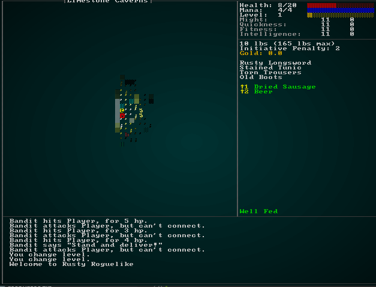
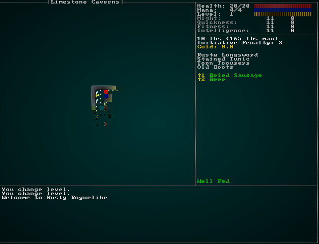
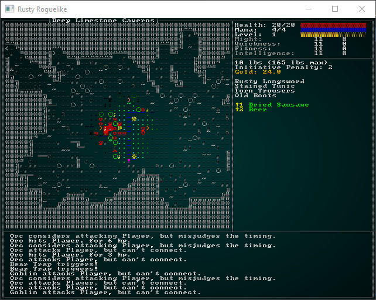
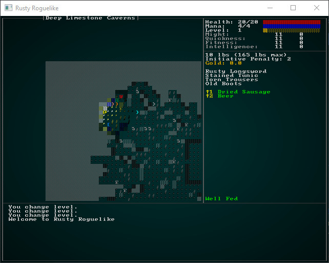

# Deeper Caverns

---

***About this tutorial***

*This tutorial is free and open source, and all code uses the MIT license - so you are free to do with it as you like. My hope is that you will enjoy the tutorial, and make great games!*

*If you enjoy this and would like me to keep writing, please consider supporting [my Patreon](https://www.patreon.com/blackfuture).*

---

We have the first layer of the limestone caverns looking pretty good. We know from the design document that the caverns give way to a dwarven fortress, but it seems reasonable to enjoy our cavern renderer for a little longer. Let's build a deeper caves level, focused on an orc and goblin camp, with peripheral wild monsters.

## More cheating!

Now's a good time to add a little more cheat functionality to make working on later levels easier.

## Heal-on-demand

It sucks when you die, when all you wanted was to check out your new level design! So we'll add a new cheat option: healing. Open up `gui.rs`, and edit `cheat_menu` and the associated result type:

```rust
#[derive(PartialEq, Copy, Clone)]
pub enum CheatMenuResult { NoResponse, Cancel, TeleportToExit, Heal }

pub fn show_cheat_mode(_gs : &mut State, ctx : &mut Rltk) -> CheatMenuResult {
    let count = 2;
    let mut y = (25 - (count / 2)) as i32;
    ctx.draw_box(15, y-2, 31, (count+3) as i32, RGB::named(rltk::WHITE), RGB::named(rltk::BLACK));
    ctx.print_color(18, y-2, RGB::named(rltk::YELLOW), RGB::named(rltk::BLACK), "Cheating!");
    ctx.print_color(18, y+count as i32+1, RGB::named(rltk::YELLOW), RGB::named(rltk::BLACK), "ESCAPE to cancel");

    ctx.set(17, y, RGB::named(rltk::WHITE), RGB::named(rltk::BLACK), rltk::to_cp437('('));
    ctx.set(18, y, RGB::named(rltk::YELLOW), RGB::named(rltk::BLACK), rltk::to_cp437('T'));
    ctx.set(19, y, RGB::named(rltk::WHITE), RGB::named(rltk::BLACK), rltk::to_cp437(')'));
    ctx.print(21, y, "Teleport to next level");

    y += 1;
    ctx.set(17, y, RGB::named(rltk::WHITE), RGB::named(rltk::BLACK), rltk::to_cp437('('));
    ctx.set(18, y, RGB::named(rltk::YELLOW), RGB::named(rltk::BLACK), rltk::to_cp437('H'));
    ctx.set(19, y, RGB::named(rltk::WHITE), RGB::named(rltk::BLACK), rltk::to_cp437(')'));
    ctx.print(21, y, "Heal all wounds");


    match ctx.key {
        None => CheatMenuResult::NoResponse,
        Some(key) => {
            match key {
                VirtualKeyCode::T => CheatMenuResult::TeleportToExit,
                VirtualKeyCode::H => CheatMenuResult::Heal,
                VirtualKeyCode::Escape => CheatMenuResult::Cancel,
                _ => CheatMenuResult::NoResponse
            }
        }
    }
}
```

Then visit `main.rs`, and in the cheat handler add support for healing:

```rust
gui::CheatMenuResult::Heal => {
    let player = self.ecs.fetch::<Entity>();
    let mut pools = self.ecs.write_storage::<Pools>();
    let mut player_pools = pools.get_mut(*player).unwrap();
    player_pools.hit_points.current = player_pools.hit_points.max;
    newrunstate = RunState::AwaitingInput;
}
```

With that in place, you are two keypresses away from free healing whenever you need it! This should make it easier to explore our later levels:



### Reveal All and God Mode

Another handy feature would be to reveal the map, especially if you just want to validate your map building. Turning off death altogether would also be a great way to make sure that all of the map is where you think it should be! So first, we'll add two more menu items and their handlers:

```rust
#[derive(PartialEq, Copy, Clone)]
pub enum CheatMenuResult { NoResponse, Cancel, TeleportToExit, Heal, Reveal, GodMode }

pub fn show_cheat_mode(_gs : &mut State, ctx : &mut Rltk) -> CheatMenuResult {
    let count = 4;
    let mut y = (25 - (count / 2)) as i32;
    ctx.draw_box(15, y-2, 31, (count+3) as i32, RGB::named(rltk::WHITE), RGB::named(rltk::BLACK));
    ctx.print_color(18, y-2, RGB::named(rltk::YELLOW), RGB::named(rltk::BLACK), "Cheating!");
    ctx.print_color(18, y+count as i32+1, RGB::named(rltk::YELLOW), RGB::named(rltk::BLACK), "ESCAPE to cancel");

    ctx.set(17, y, RGB::named(rltk::WHITE), RGB::named(rltk::BLACK), rltk::to_cp437('('));
    ctx.set(18, y, RGB::named(rltk::YELLOW), RGB::named(rltk::BLACK), rltk::to_cp437('T'));
    ctx.set(19, y, RGB::named(rltk::WHITE), RGB::named(rltk::BLACK), rltk::to_cp437(')'));
    ctx.print(21, y, "Teleport to next level");

    y += 1;
    ctx.set(17, y, RGB::named(rltk::WHITE), RGB::named(rltk::BLACK), rltk::to_cp437('('));
    ctx.set(18, y, RGB::named(rltk::YELLOW), RGB::named(rltk::BLACK), rltk::to_cp437('H'));
    ctx.set(19, y, RGB::named(rltk::WHITE), RGB::named(rltk::BLACK), rltk::to_cp437(')'));
    ctx.print(21, y, "Heal all wounds");

    y += 1;
    ctx.set(17, y, RGB::named(rltk::WHITE), RGB::named(rltk::BLACK), rltk::to_cp437('('));
    ctx.set(18, y, RGB::named(rltk::YELLOW), RGB::named(rltk::BLACK), rltk::to_cp437('R'));
    ctx.set(19, y, RGB::named(rltk::WHITE), RGB::named(rltk::BLACK), rltk::to_cp437(')'));
    ctx.print(21, y, "Reveal the map");

    y += 1;
    ctx.set(17, y, RGB::named(rltk::WHITE), RGB::named(rltk::BLACK), rltk::to_cp437('('));
    ctx.set(18, y, RGB::named(rltk::YELLOW), RGB::named(rltk::BLACK), rltk::to_cp437('G'));
    ctx.set(19, y, RGB::named(rltk::WHITE), RGB::named(rltk::BLACK), rltk::to_cp437(')'));
    ctx.print(21, y, "God Mode (No Death)");

    match ctx.key {
        None => CheatMenuResult::NoResponse,
        Some(key) => {
            match key {
                VirtualKeyCode::T => CheatMenuResult::TeleportToExit,
                VirtualKeyCode::H => CheatMenuResult::Heal,
                VirtualKeyCode::R => CheatMenuResult::Reveal,
                VirtualKeyCode::G => CheatMenuResult::GodMode,
                VirtualKeyCode::Escape => CheatMenuResult::Cancel,
                _ => CheatMenuResult::NoResponse
            }
        }
    }
}
```

Now we need to handle this in `main.rs`:

```rust
gui::CheatMenuResult::Reveal => {
    let mut map = self.ecs.fetch_mut::<Map>();
    for v in map.revealed_tiles.iter_mut() {
        *v = true;
    }
    newrunstate = RunState::AwaitingInput;
}
gui::CheatMenuResult::GodMode => {
    let player = self.ecs.fetch::<Entity>();
    let mut pools = self.ecs.write_storage::<Pools>();
    let mut player_pools = pools.get_mut(*player).unwrap();
    player_pools.god_mode = true;
    newrunstate = RunState::AwaitingInput;
}
```

Reveal is really simple: set every tile on the map to revealed. God Mode is setting a variable in the `Pools` component that doesn't exist yet, so open up `components.rs` and we'll add it:

```rust
#[derive(Component, Debug, Serialize, Deserialize, Clone)]
pub struct Pools {
    pub hit_points : Pool,
    pub mana : Pool,
    pub xp : i32,
    pub level : i32,
    pub total_weight : f32,
    pub total_initiative_penalty : f32,
    pub gold : f32,
    pub god_mode : bool
}
```

We need to set `god_mode` to false in `spawner.rs` and `raws/rawmaster.rs` functions that create `Pools` objects. Lastly, a quick tweak to `damage_system.rs` turns off damage for deities:

```rust
...
for (entity, mut stats, damage) in (&entities, &mut stats, &damage).join() {
    if !stats.god_mode {
        stats.hit_points.current -= damage.amount;
    }
    ...
```

Now you can reveal the map at any time, and turn off the ability to suffer damage:



This makes it *much* easier to work on later-game content without having to play through over and over again (it's a good idea to play through from time to time and find bugs, though).

## Deep caverns basic layout

The deep caverns should still look natural, but should also feature a central area in which the goblinoids can camp. The Diffusion-Limited Aggregation algorithm we worked on in a previous chapter, specifically the "central attractor" mode, provides pretty much exactly what we want for basic layout:


In `map_builders/mod.rs`, we'll start by creating a new entry for level 4:

```rust
pub fn level_builder(new_depth: i32, rng: &mut rltk::RandomNumberGenerator, width: i32, height: i32) -> BuilderChain {
    rltk::console::log(format!("Depth: {}", new_depth));
    match new_depth {
        1 => town_builder(new_depth, rng, width, height),
        2 => forest_builder(new_depth, rng, width, height),
        3 => limestone_cavern_builder(new_depth, rng, width, height),
        4 => limestone_deep_cavern_builder(new_depth, rng, width, height),
        _ => random_builder(new_depth, rng, width, height)
    }
}
```

In `map/themes.rs`, we'll tell this level to also be limestone themed:

```rust
pub fn tile_glyph(idx: usize, map : &Map) -> (u8, RGB, RGB) {
let (glyph, mut fg, mut bg) = match map.depth {
    4 => get_limestone_cavern_glyph(idx, map),
    3 => get_limestone_cavern_glyph(idx, map),
    2 => get_forest_glyph(idx, map),
    _ => get_tile_glyph_default(idx, map)
};
```

Then in `map_builders/limestone_cavern.rs` we can add the new function. This is a good start:

```rust
pub fn limestone_deep_cavern_builder(new_depth: i32, _rng: &mut rltk::RandomNumberGenerator, width: i32, height: i32) -> BuilderChain {
    let mut chain = BuilderChain::new(new_depth, width, height, "Deep Limestone Caverns");
    chain.start_with(DLABuilder::central_attractor());
    chain.with(AreaStartingPosition::new(XStart::LEFT, YStart::TOP));
    chain.with(VoronoiSpawning::new());
    chain.with(DistantExit::new());
    chain.with(CaveDecorator::new());
    chain
}
```

This actually gets us a pretty playable level; we could stop here and not be ashamed (although we clearly need to add some more monsters). We're not done yet, though! We'd like there to be an orc camp at the center of the map. This sounds like a job for a prefab! Open up `map_builders/prefab_builder/prefab_sections.rs` and we'll add a new sectional:

```rust
#[allow(dead_code)]
pub const ORC_CAMP : PrefabSection = PrefabSection{
    template : ORC_CAMP_TXT,
    width: 12,
    height: 12,
    placement: ( HorizontalPlacement::Center, VerticalPlacement::Center )
};

#[allow(dead_code)]
const ORC_CAMP_TXT : &str = "
            
 ≈≈≈≈o≈≈≈≈≈ 
 ≈☼      ☼≈ 
 ≈ g      ≈ 
 ≈        ≈ 
 ≈    g   ≈ 
 o   O    o 
 ≈        ≈ 
 ≈ g      ≈ 
 ≈    g   ≈ 
 ≈☼      ☼≈ 
 ≈≈≈≈o≈≈≈≈≈ 
            
";
```

There's some new glyphs in here, so we also need to open up `map_builders/prefab_builder/mod.rs`, find the `char_to_map` function and add them in. The squiggles are meant to be water (providing a guarded moat), the sun symbols watch-fires. The capital `O` is an orc boss. So we add those to the match function:

```rust
'≈' => build_data.map.tiles[idx] = TileType::DeepWater,
'O' => {
    build_data.map.tiles[idx] = TileType::Floor;
    build_data.spawn_list.push((idx, "Orc Leader".to_string()));
}
'☼' => {
    build_data.map.tiles[idx] = TileType::Floor;
    build_data.spawn_list.push((idx, "Watch Fire".to_string()));
}
```

Then we modify the build-chain (in `limestone_deep_cavern_builder`) to include this:

```rust
pub fn limestone_deep_cavern_builder(new_depth: i32, _rng: &mut rltk::RandomNumberGenerator, width: i32, height: i32) -> BuilderChain {
    let mut chain = BuilderChain::new(new_depth, width, height, "Deep Limestone Caverns");
    chain.start_with(DLABuilder::central_attractor());
    chain.with(AreaStartingPosition::new(XStart::LEFT, YStart::TOP));
    chain.with(VoronoiSpawning::new());
    chain.with(DistantExit::new());
    chain.with(CaveDecorator::new());
    chain.with(PrefabBuilder::sectional(super::prefab_builder::prefab_sections::ORC_CAMP));
    chain
}
```

We need to add in the missing entities, also. "Watch Fire" and "Orc Leader" are new. So we open up `spawns.json` and add them in. The `Watch Fire` is a prop:

```json
{
    "name" : "Watch Fire",
    "renderable": {
        "glyph" : "☼",
        "fg" : "#FFFF55",
        "bg" : "#000000",
        "order" : 2
    },
    "hidden" : false,
    "light" : {
        "range" : 6,
        "color" : "#FFFF55"
    },
    "entry_trigger" : {
        "effects" : {
            "damage" : "6"
        }
    }
}
```

The `light` entry is new! We haven't had props generate light before (but it makes sense; a dark watch fire would be quite odd). It also does damage on entry, which makes sense - walking into a fire is rarely good for your health. Supporting the light requires a couple of quick changes. Open up `raws/prop_structs.rs` and add the option for a light entry to props:

```rust
#[derive(Deserialize, Debug)]
pub struct Prop {
    pub name : String,
    pub renderable : Option<Renderable>,
    pub hidden : Option<bool>,
    pub blocks_tile : Option<bool>,
    pub blocks_visibility : Option<bool>,
    pub door_open : Option<bool>,
    pub entry_trigger : Option<EntryTrigger>,
    pub light : Option<super::mob_structs::MobLight>,
}
```

We've reused `MobLight` from mobs, since it's the same thing. Now open up `raws/raw_master.rs` and we'll edit `spawn_named_prop` to include this option:

```rust
if let Some(light) = &prop_template.light {
    eb = eb.with(LightSource{ range: light.range, color : rltk::RGB::from_hex(&light.color).expect("Bad color") });
    eb = eb.with(Viewshed{ range: light.range, dirty: true, visible_tiles: Vec::new() });
}
```

If you remember, our lighting code uses a visibility plot to determine where it can light - so the prop needs a viewshed. That's ok, our ECS has our back and will handle it (and after the first plot, it'll never recalculate - since the prop won't move).

Lastly, our `Orc Leader` goes in the "mobs" section of `spawns.json`:

```json
{
    "name" : "Orc Leader",
    "renderable": {
        "glyph" : "O",
        "fg" : "#FF0000",
        "bg" : "#000000",
        "order" : 1
    },
    "blocks_tile" : true,
    "vision_range" : 8,
    "movement" : "static",
    "attributes" : {},
    "faction" : "Cave Goblins",
    "gold" : "3d8",
    "equipped" : [ "Battleaxe", "Tower Shield", "Leather Armor", "Leather Boots" ],
    "level" : 2
},
```

He should be a challenge, but you get good cash and nice weapons/armor from him if you win.

If you `cargo run` now, you'll see that we have the fort in position (I'm using god mode in the graphic):



So the prefab is there - but there's a real problem: the player is completely overrun with orcs and goblins! While that may be realistic, it gives the player very little chance to survive reaching this level. Even with clever play, that type of onslaught in a relatively open map is likely to prove fatal in no time. So for now, we'll adjust the spawn table in `spawns.json`:

```json
"spawn_table" : [
    { "name" : "Goblin", "weight" : 10, "min_depth" : 3, "max_depth" : 4 },
    { "name" : "Orc", "weight" : 1, "min_depth" : 4, "max_depth" : 100 },
    { "name" : "Health Potion", "weight" : 7, "min_depth" : 0, "max_depth" : 100 },
    { "name" : "Fireball Scroll", "weight" : 2, "min_depth" : 0, "max_depth" : 100, "add_map_depth_to_weight" : true },
    { "name" : "Confusion Scroll", "weight" : 2, "min_depth" : 0, "max_depth" : 100, "add_map_depth_to_weight" : true },
    { "name" : "Magic Missile Scroll", "weight" : 4, "min_depth" : 0, "max_depth" : 100 },
    { "name" : "Dagger", "weight" : 3, "min_depth" : 0, "max_depth" : 100 },
    { "name" : "Shield", "weight" : 3, "min_depth" : 0, "max_depth" : 100 },
    { "name" : "Longsword", "weight" : 1, "min_depth" : 3, "max_depth" : 100 },
    { "name" : "Tower Shield", "weight" : 1, "min_depth" : 3, "max_depth" : 100 },
    { "name" : "Rations", "weight" : 10, "min_depth" : 0, "max_depth" : 100 },
    { "name" : "Magic Mapping Scroll", "weight" : 2, "min_depth" : 0, "max_depth" : 100 },
    { "name" : "Bear Trap", "weight" : 5, "min_depth" : 0, "max_depth" : 100 },
    { "name" : "Battleaxe", "weight" : 1, "min_depth" : 2, "max_depth" : 100 },
    { "name" : "Kobold", "weight" : 15, "min_depth" : 3, "max_depth" : 3 },
    { "name" : "Rat", "weight" : 15, "min_depth" : 2, "max_depth" : 2 },
    { "name" : "Mangy Wolf", "weight" : 13, "min_depth" : 2, "max_depth" : 2 },
    { "name" : "Deer", "weight" : 14, "min_depth" : 2, "max_depth" : 2 },
    { "name" : "Bandit", "weight" : 9, "min_depth" : 2, "max_depth" : 3 },
    { "name" : "Bat", "weight" : 15, "min_depth" : 3, "max_depth" : 3 },
    { "name" : "Large Spider", "weight" : 3, "min_depth" : 3, "max_depth" : 3 },
    { "name" : "Gelatinous Cube", "weight" : 3, "min_depth" : 3, "max_depth" : 3 }
],
```

We've removed the `add_map_depth_to_weight` from Orcs, so they aren't *everywhere*, constrained other critters to not appearing on this level. Since we know we're adding an entire fort in the middle, this makes sense: you are more likely to get helpful drops now, and more open spaces.

There's also a visual problem. The dark-blue deep water is nice, but it's basically invisible in grey-scale mode - and hard to see if your monitor brightness isn't turned up. Lets add a bit of green to it, so it is more visible. In `map/themes.rs` (`get_limestone_cavern_glyph` function):

```rust
TileType::DeepWater => { glyph = rltk::to_cp437('▓'); fg = RGB::from_f32(0.2, 0.2, 1.0); }
```

That's quite a bit better:



## A few more spawns

Let's take a moment to introduce some better armor and weaponry to the level, and make it possible to spawn. The player is starting to face some real challenge, so they need some possible improvements! We'll start by adding chainmail to `spawns.json`:

```json
{
    "name" : "Chainmail Armor",
    "renderable": {
        "glyph" : "[",
        "fg" : "#00FF00",
        "bg" : "#000000",
        "order" : 2
    },
    "wearable" : {
        "slot" : "Torso",
        "armor_class" : 2.0
    },
    "weight_lbs" : 20.0,
    "base_value" : 50.0,
    "initiative_penalty" : 1.0,
    "vendor_category" : "armor"
},

{
    "name" : "Chain Coif",
    "renderable": {
        "glyph" : "[",
        "fg" : "#00FF00",
        "bg" : "#000000",
        "order" : 2
    },
    "wearable" : {
        "slot" : "Head",
        "armor_class" : 1.0
    },
    "weight_lbs" : 5.0,
    "base_value" : 20.0,
    "initiative_penalty" : 0.5,
    "vendor_category" : "armor"
},
```

By including `vendor_category`, these items have become available for sale - so if your player gets enough cash, they can buy them (if they take the time to go home!). Lets also make them drop occasionally from level 4 onwards. In the `spawn_table` of `spawns.json`:

```json
{ "name" : "Leather Armor", "weight" : 1, "min_depth" : 2, "max_depth" : 100 },
{ "name" : "Leather Boots", "weight" : 1, "min_depth" : 2, "max_depth" : 100 },
{ "name" : "Chainmail Armor", "weight" : 1, "min_depth" : 4, "max_depth" : 100 },
{ "name" : "Chain Coif", "weight" : 1, "min_depth" : 4, "max_depth" : 100 },
```

We're also allowing leather armor to appear as a treasure drop. That should help with difficulty!

## Wrap-Up

Another level down (more improvements are possible; they are *always* possible), and the game is taking shape! You can now hew your way through the forest, hack your way through a level of limestone caves, and slash around a deep cave with an orc fortress. That's starting to sound like an adventure!

...

**The source code for this chapter may be found [here](https://github.com/thebracket/rustrogueliketutorial/tree/master/chapter-59-caverns2)**


[Run this chapter's example with web assembly, in your browser (WebGL2 required)](http://bfnightly.bracketproductions.com/rustbook/wasm/chapter-59-caverns2)
---

Copyright (C) 2019, Herbert Wolverson.

---