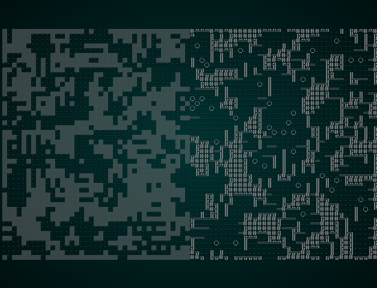
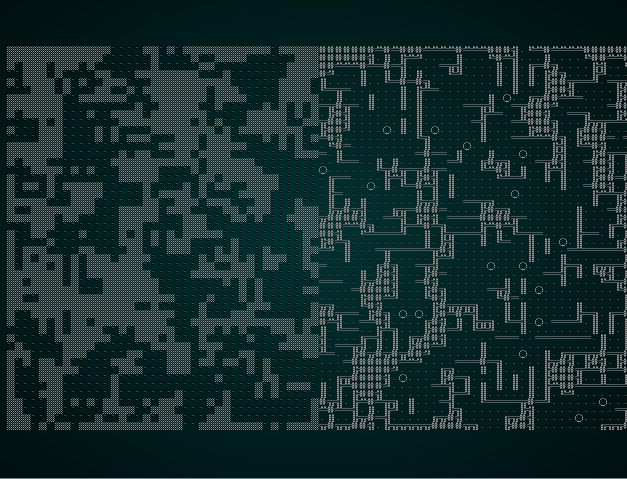

# Transition: Caverns to Dwarf Fortress

---

***About this tutorial***

*This tutorial is free and open source, and all code uses the MIT license - so you are free to do with it as you like. My hope is that you will enjoy the tutorial, and make great games!*

*If you enjoy this and would like me to keep writing, please consider supporting [my Patreon](https://www.patreon.com/blackfuture).*

[](https://pragprog.com/titles/hwrust/hands-on-rust/)

---

The design document talks about the caverns giving way to a carefully hewn dwarven fortress - now occupied by vile beasts and a dragon. It would be very jarring to go down a level and suddenly be inside a boxy dwarven fort - so this level will be all about the transition.

Let's start with the *theme*. We want to split the map between the limestone cavern look, and the dungeon look - so we add a new entry to `themes.rs`'s `tile_glyph` function that does just that:

```rust
pub fn tile_glyph(idx: usize, map : &Map) -> (rltk::FontCharType, RGB, RGB) {
    let (glyph, mut fg, mut bg) = match map.depth {
        5 => {
            let x = idx as i32 % map.width;
            if x < map.width/2 {
                get_limestone_cavern_glyph(idx, map)
            } else {
                get_tile_glyph_default(idx, map)
            }
        }
    ...
```

Now we'll open `map_builders/mod.rs` and call a new build function:

```rust
pub fn level_builder(new_depth: i32, rng: &mut rltk::RandomNumberGenerator, width: i32, height: i32) -> BuilderChain {
    rltk::console::log(format!("Depth: {}", new_depth));
    match new_depth {
        1 => town_builder(new_depth, rng, width, height),
        2 => forest_builder(new_depth, rng, width, height),
        3 => limestone_cavern_builder(new_depth, rng, width, height),
        4 => limestone_deep_cavern_builder(new_depth, rng, width, height),
        5 => limestone_transition_builder(new_depth, rng, width, height),
        _ => random_builder(new_depth, rng, width, height)
    }
}
```

Open up `limestone_cavern.rs` and we'll make a new function:

```rust
pub fn limestone_transition_builder(new_depth: i32, _rng: &mut rltk::RandomNumberGenerator, width: i32, height: i32) -> BuilderChain {
    let mut chain = BuilderChain::new(new_depth, width, height, "Dwarf Fort - Upper Reaches");
    chain.start_with(CellularAutomataBuilder::new());
    chain.with(WaveformCollapseBuilder::new());
    chain.with(AreaStartingPosition::new(XStart::CENTER, YStart::CENTER));
    chain.with(CullUnreachable::new());
    chain.with(AreaStartingPosition::new(XStart::LEFT, YStart::CENTER));
    chain.with(VoronoiSpawning::new());
    chain.with(CaveDecorator::new());
    chain
}
```

This is pretty simple: it makes a cellular automata map, and then convolutes it with waveform collapse; we've covered these in previous chapters, so they should be familiar. It achieves *half* of what we want: an open, natural looking dungeon. But we'll need more work to generate the dwarven half! Let's add some more steps:

```rust
pub fn limestone_transition_builder(new_depth: i32, _rng: &mut rltk::RandomNumberGenerator, width: i32, height: i32) -> BuilderChain {
    let mut chain = BuilderChain::new(new_depth, width, height, "Dwarf Fort - Upper Reaches");
    chain.start_with(CellularAutomataBuilder::new());
    chain.with(WaveformCollapseBuilder::new());
    chain.with(AreaStartingPosition::new(XStart::CENTER, YStart::CENTER));
    chain.with(CullUnreachable::new());
    chain.with(AreaStartingPosition::new(XStart::LEFT, YStart::CENTER));
    chain.with(VoronoiSpawning::new());
    chain.with(CaveDecorator::new());
    chain.with(CaveTransition::new());
    chain.with(AreaStartingPosition::new(XStart::LEFT, YStart::CENTER));
    chain.with(DistantExit::new());
    chain
}
```

So now we go through the same map generation, call an as-yet-unwritten `CaveTransition` builder, and reset start and end points. So what goes into the `CaveTransition`?

```rust
pub struct CaveTransition {}

impl MetaMapBuilder for CaveTransition {
    fn build_map(&mut self, rng: &mut rltk::RandomNumberGenerator, build_data : &mut BuilderMap)  {
        self.build(rng, build_data);
    }
}

impl CaveTransition {
    #[allow(dead_code)]
    pub fn new() -> Box<CaveTransition> {
        Box::new(CaveTransition{})
    }

    fn build(&mut self, rng : &mut RandomNumberGenerator, build_data : &mut BuilderMap) {
        build_data.map.depth = 5;
        build_data.take_snapshot();
        
        // Build a BSP-based dungeon
        let mut builder = BuilderChain::new(5, build_data.width, build_data.height, "New Map");
        builder.start_with(BspDungeonBuilder::new());
        builder.with(RoomDrawer::new());
        builder.with(RoomSorter::new(RoomSort::RIGHTMOST));
        builder.with(NearestCorridors::new());
        builder.with(RoomExploder::new());
        builder.with(RoomBasedSpawner::new());
        builder.build_map(rng);

        // Add the history to our history
        for h in builder.build_data.history.iter() {
            build_data.history.push(h.clone());
        }
        build_data.take_snapshot();

        // Copy the right half of the BSP map into our map
        for x in build_data.map.width / 2 .. build_data.map.width {
            for y in 0 .. build_data.map.height {
                let idx = build_data.map.xy_idx(x, y);
                build_data.map.tiles[idx] = builder.build_data.map.tiles[idx];
            }
        }
        build_data.take_snapshot();

        // Keep Voronoi spawn data from the left half of the map
        let w = build_data.map.width;
        build_data.spawn_list.retain(|s| {
            let x = s.0 as i32 / w;
            x < w / 2
        });

        // Keep room spawn data from the right half of the map
        for s in builder.build_data.spawn_list.iter() {
            let x = s.0 as i32 / w;
            if x > w / 2 {
                build_data.spawn_list.push(s.clone());
            }
        }
    }
}
```

So there's all the usual boilerplate to make a builder, and then we get to the `build` function. Lets walk through it:

1. We start by resetting the level's depth. There's a bug in the Wave Function Collapse that made that necessary (it'll be fixed in a revision to this chapter).
2. Then we make a new builder! It's set to generate a pretty normal BSP-based dungeon with short, direct corridors and then erode the rooms.
3. We run the builder, and *copy* its history onto the end of our history - so we can see the steps it took, as well.
4. We copy the entire right half of the BSP map onto the map we're actually building.
5. We remove all spawns from the current map that are in the right half of the map.
6. We copy all spawns from the BSP map to the current map, if they are in the right half of the map.

The result of all of this? A split dungeon! 



We're relying on the odds of there not being anything connecting the two halves being *very* low. Just to be sure, let's also add an unreachable culling cycle and remove the waveform collapse - it makes the map too likely to not have an exit:

```rust
pub fn limestone_transition_builder(new_depth: i32, _rng: &mut rltk::RandomNumberGenerator, width: i32, height: i32) -> BuilderChain {
    let mut chain = BuilderChain::new(new_depth, width, height, "Dwarf Fort - Upper Reaches");
    chain.start_with(CellularAutomataBuilder::new());
    chain.with(AreaStartingPosition::new(XStart::CENTER, YStart::CENTER));
    chain.with(CullUnreachable::new());
    chain.with(AreaStartingPosition::new(XStart::LEFT, YStart::CENTER));
    chain.with(VoronoiSpawning::new());
    chain.with(CaveDecorator::new());
    chain.with(CaveTransition::new());
    chain.with(AreaStartingPosition::new(XStart::LEFT, YStart::CENTER));
    chain.with(CullUnreachable::new());
    chain.with(AreaEndingPosition::new(XEnd::RIGHT, YEnd::CENTER));
    chain
}
```

Wait - `AreaEndingPosition` is new! I wanted a way to *guarantee* that the exit was in the right side of the map, so I made a new builder layer. It's just like `AreaStartingPosition`, but sets a staircase instead of a starting point. It's in the file `map_builders/area_ending_point.rs`:

```rust
use super::{MetaMapBuilder, BuilderMap, TileType};
use crate::map;
use rltk::RandomNumberGenerator;

#[allow(dead_code)]
pub enum XEnd { LEFT, CENTER, RIGHT }

#[allow(dead_code)]
pub enum YEnd{ TOP, CENTER, BOTTOM }

pub struct AreaEndingPosition {
    x : XEnd, 
    y : YEnd
}

impl MetaMapBuilder for AreaEndingPosition {
    fn build_map(&mut self, rng: &mut rltk::RandomNumberGenerator, build_data : &mut BuilderMap)  {
        self.build(rng, build_data);
    }
}

impl AreaEndingPosition {
    #[allow(dead_code)]
    pub fn new(x : XEnd, y : YEnd) -> Box<AreaEndingPosition> {
        Box::new(AreaEndingPosition{
            x, y
        })
    }

    fn build(&mut self, _rng : &mut RandomNumberGenerator, build_data : &mut BuilderMap) {
        let seed_x;
        let seed_y;

        match self.x {
            XEnd::LEFT => seed_x = 1,
            XEnd::CENTER => seed_x = build_data.map.width / 2,
            XEnd::RIGHT => seed_x = build_data.map.width - 2
        }

        match self.y {
            YEnd::TOP => seed_y = 1,
            YEnd::CENTER => seed_y = build_data.map.height / 2,
            YEnd::BOTTOM => seed_y = build_data.map.height - 2
        }

        let mut available_floors : Vec<(usize, f32)> = Vec::new();
        for (idx, tiletype) in build_data.map.tiles.iter().enumerate() {
            if map::tile_walkable(*tiletype) {
                available_floors.push(
                    (
                        idx,
                        rltk::DistanceAlg::PythagorasSquared.distance2d(
                            rltk::Point::new(idx as i32 % build_data.map.width, idx as i32 / build_data.map.width),
                            rltk::Point::new(seed_x, seed_y)
                        )
                    )
                );
            }
        }
        if available_floors.is_empty() {
            panic!("No valid floors to start on");
        }

        available_floors.sort_by(|a,b| a.1.partial_cmp(&b.1).unwrap());

        build_data.map.tiles[available_floors[0].0] = TileType::DownStairs;
    }
}
```

So putting all of this together and running it - you have a dungeon pretty much in line with what we were aiming for:



## Populating our new level

The level is basically empty, other than various drops such as rations! We limited the drops on the previous level, which is good - we want to start transitioning towards a more "monster" based level here. The fort apparently fell because of a nasty dragon (as opposed to the friendly type!), so more draconic minions make sense. Hopefully, the player will be approaching level 3 or 4 by now, so we can throw some harder mobs at them without making the game impossible.

In `spawns.json`, in the `spawn_table` section - let's add some placeholder spawns for dragon-like things:

```json
{ "name" : "Dragon Wyrmling", "weight" : 1, "min_depth" : 5, "max_depth" : 7 },
{ "name" : "Lizardman", "weight" : 10, "min_depth" : 5, "max_depth" : 7 },
{ "name" : "Giant Lizard", "weight" : 4, "min_depth" : 5, "max_depth" : 7 }
```

Remembering that this used to be a dwarven region, let's also add some things that a dwarf might leave behind:

```json
{ "name" : "Rock Golem", "weight" : 4, "min_depth" : 5, "max_depth" : 7 },
{ "name" : "Stonefall Trap", "weight" : 4, "min_depth" : 5, "max_depth" : 7 },
{ "name" : "Landmine", "weight" : 1, "min_depth" : 5, "max_depth" : 7 }
```

Dwarves are also known for their armor and weaponry, so a few placeholders for their gear sounds good:

```json
{ "name" : "Breastplate", "weight" : 7, "min_depth" : 5, "max_depth" : 7 },
{ "name" : "War Axe", "weight" : 7, "min_depth" : 5, "max_depth" : 7 },
{ "name" : "Dwarf-Steel Shirt", "weight" : 1, "min_depth" : 5, "max_depth" : 7 }
```

That's a good 9 new entities to create! We'll start by building them using the systems we already have, and in a future chapter we'll add some special effects to them. (The "Dwarf-Steel" used to be "mithril" - but the Tolkien Foundation used to be known for being a little lawyer-happy over that word. So Dwarf-Steel it is!)

## Dragon-like creatures

We'll start by giving them a new *faction* in `spawns.json`:

```json
{ "name" : "Wyrm", "responses": { "Default" : "attack", "Wyrm" : "ignore" }}
```

We'll also extrapolate a little and come up with a few things they may drop as loot (for `loot_tables`):

```json
{ "name" : "Wyrms",
    "drops" : [
        { "name" : "Dragon Scale", "weight" : 10 },
        { "name" : "Meat", "weight" : 10 }
    ]
}
```

Now, let's get into the `mobs` section and make our baby dragons:

```json
{
    "name" : "Dragon Wyrmling",
    "renderable": {
        "glyph" : "d",
        "fg" : "#FF0000",
        "bg" : "#000000",
        "order" : 1
    },
    "blocks_tile" : true,
    "vision_range" : 12,
    "movement" : "random_waypoint",
    "attributes" : {
        "might" : 3,
        "fitness" : 3
    },
    "skills" : {
        "Melee" : 15,
        "Defense" : 14
    },
    "natural" : {
        "armor_class" : 15,
        "attacks" : [
            { "name" : "bite", "hit_bonus" : 4, "damage" : "1d10+2" }
        ]   
    },
    "loot_table" : "Wyrms",
    "faction" : "Wyrm",
    "level" : 3,
    "gold" : "3d6"
}
```

Even without special abilities, that's a mighty foe! TODO

We should definitely counteract the awesome nature of the young dragons by making the lizardmen and giant lizards rather weak in comparison (since there are likely to be many more of them):

```json
{
    "name" : "Lizardman",
    "renderable": {
        "glyph" : "l",
        "fg" : "#FF0000",
        "bg" : "#000000",
        "order" : 1
    },
    "blocks_tile" : true,
    "vision_range" : 4,
    "movement" : "random_waypoint",
    "attributes" : {},
    "faction" : "Wyrm",
    "gold" : "1d12",
    "level" : 2
},

{
    "name" : "Giant Lizard",
    "renderable": {
        "glyph" : "l",
        "fg" : "#FFFF00",
        "bg" : "#000000",
        "order" : 1
    },
    "blocks_tile" : true,
    "vision_range" : 4,
    "movement" : "random",
    "attributes" : {},
    "faction" : "Wyrm",
    "level" : 2,
    "loot_table" : "Animal"
}
```

We also need to add "dragon scales" as a nicely rewarding commodity. In the items section of `spawns.json`:

```json
{
    "name" : "Dragon Scale",
    "renderable": {
        "glyph" : "ß",
        "fg" : "#FFD700",
        "bg" : "#000000",
        "order" : 2
    },
    "weight_lbs" : 2.0,
    "base_value" : 75.0
},
```

## Dwarven Spawns

Since the dwarves are dead (presumably they dug too deep, again...), we just have some leftovers of their civilization to deal with. Golems, traps and landmines (oh my!). Lets make a new faction for the golems; they shouldn't like the dragons very much, but lets be nice to the player and have them be ignored:

```json
{ "name" : "Dwarven Remnant", "responses": { "Default" : "attack", "Player" : "ignore", "Dwarven Remnant" : "ignore" }}
```

This lets us build a relatively formidable golem. It can be formidable, because it will be fighting the lizards:

```json
{
    "name" : "Rock Golem",
    "renderable": {
        "glyph" : "g",
        "fg" : "#AAAAAA",
        "bg" : "#000000",
        "order" : 1
    },
    "blocks_tile" : true,
    "vision_range" : 6,
    "movement" : "random_waypoint",
    "attributes" : {},
    "faction" : "Dwarven Remnant",
    "level" : 3
}
```

The stone-fall trap and landmines are like an extra-dangerous bear trap:

```json
{
    "name" : "Stonefall Trap",
    "renderable": {
        "glyph" : "^",
        "fg" : "#FF0000",
        "bg" : "#000000",
        "order" : 2
    },
    "hidden" : true,
    "entry_trigger" : {
        "effects" : {
            "damage" : "12",
            "single_activation" : "1"
        }
    }
},

{
    "name" : "Landmine",
    "renderable": {
        "glyph" : "^",
        "fg" : "#FF0000",
        "bg" : "#000000",
        "order" : 2
    },
    "hidden" : true,
    "entry_trigger" : {
        "effects" : {
            "damage" : "18",
            "single_activation" : "1"
        }
    }
},
```

## Dwarf Loot

These are just more items for the `items` section of `spawns.json`:

```json
{
    "name" : "Breastplate",
    "renderable": {
        "glyph" : "[",
        "fg" : "#00FF00",
        "bg" : "#000000",
        "order" : 2
    },
    "wearable" : {
        "slot" : "Torso",
        "armor_class" : 3.0
    },
    "weight_lbs" : 25.0,
    "base_value" : 100.0,
    "initiative_penalty" : 2.0,
    "vendor_category" : "armor"
},

{
    "name" : "Dwarf-Steel Shirt",
    "renderable": {
        "glyph" : "[",
        "fg" : "#00FF00",
        "bg" : "#000000",
        "order" : 2
    },
    "wearable" : {
        "slot" : "Torso",
        "armor_class" : 3.0
    },
    "weight_lbs" : 5.0,
    "base_value" : 500.0,
    "initiative_penalty" : 0.0,
    "vendor_category" : "armor"
},
```

```json
{
    "name" : "War Axe",
    "renderable": {
        "glyph" : "¶",
        "fg" : "#FF55FF",
        "bg" : "#000000",
        "order" : 2
    },
    "weapon" : {
        "range" : "melee",
        "attribute" : "might",
        "base_damage" : "1d12",
        "hit_bonus" : 0
    },
    "weight_lbs" : 4.0,
    "base_value" : 100.0,
    "initiative_penalty" : 2,
    "vendor_category" : "weapon"
},
```

## Wrap-Up

The level is still a bit too likely to murder you, but it works. We'll be making things a bit easier in the coming chapters, so we'll leave the difficulty at "iron man" for now!

...

**The source code for this chapter may be found [here](https://github.com/thebracket/rustrogueliketutorial/tree/master/chapter-60-caverns3)**


[Run this chapter's example with web assembly, in your browser (WebGL2 required)](https://bfnightly.bracketproductions.com/rustbook/wasm/chapter-60-caverns3)
---

Copyright (C) 2019, Herbert Wolverson.

---