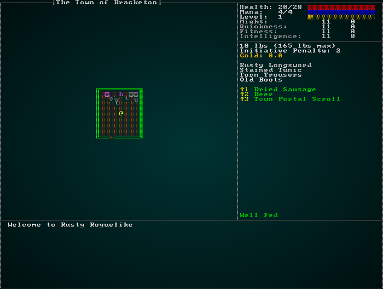
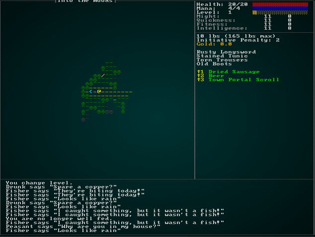
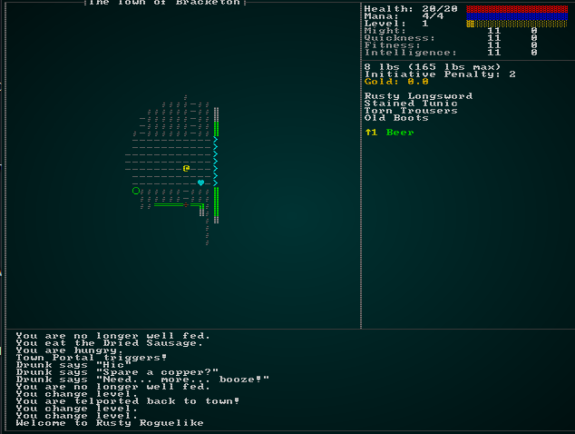

# Town Portals

---

***About this tutorial***

*This tutorial is free and open source, and all code uses the MIT license - so you are free to do with it as you like. My hope is that you will enjoy the tutorial, and make great games!*

*If you enjoy this and would like me to keep writing, please consider supporting [my Patreon](https://www.patreon.com/blackfuture).*

---

We mentioned town portals in the design document, and it's becoming obvious how they would help: it's a real slog to travel back to town to sell your hard-earned loot (and possibly save up for upgrades to help against the itty-bitty draconic murderers!).

The basic idea of a town portal scroll is simple: you cast the spell, a portal opens and takes you back to town. You do your thing in town, and return to the portal - and it teleports you right back to where you were. Depending upon the game, it may heal the monsters on the level while they are gone. Generally, monsters don't follow you through the portal (if they did, you could kill the town with a well-placed portal!).

## Spawning town portal scrolls

We should start by defining them in `spawns.json` as another item:

```json
{
    "name" : "Town Portal Scroll",
    "renderable": {
        "glyph" : ")",
        "fg" : "#AAAAFF",
        "bg" : "#000000",
        "order" : 2
    },
    "consumable" : {
        "effects" : {
            "town_portal" : ""
        }
    },
    "weight_lbs" : 0.5,
    "base_value" : 20.0,
    "vendor_category" : "alchemy"
},
```

We should also make them reasonably common in the spawn table:

```json
{ "name" : "Town Portal Scroll", "weight" : 4, "min_depth" : 0, "max_depth" : 100 },
```

That's enough to get them into the game: they spawn as drops, and are purchasable from the alchemist in town (admittedly that doesn't help you when you need one, but with some planning it can help!).

## Implementing town portals

The next stage is to make town portals *do something*. We already added an "effects" tag, causing it to be consumed on use and look for that tag. The other effects use a component to indicate what happens; so we'll open `components.rs` and make a new component type (and register in `main.rs` and `saveload_system.rs`):

```rust
#[derive(Component, Debug, Serialize, Deserialize, Clone)]
pub struct TownPortal {}
```

We also need to open up `rawmaster.rs`, and edit `spawn_named_item` to add the tag:

```rust
if let Some(consumable) = &item_template.consumable {
    eb = eb.with(crate::components::Consumable{});
    for effect in consumable.effects.iter() {
        let effect_name = effect.0.as_str();
        match effect_name {
            "provides_healing" => { 
                eb = eb.with(ProvidesHealing{ heal_amount: effect.1.parse::<i32>().unwrap() }) 
            }
            "ranged" => { eb = eb.with(Ranged{ range: effect.1.parse::<i32>().unwrap() }) },
            "damage" => { eb = eb.with(InflictsDamage{ damage : effect.1.parse::<i32>().unwrap() }) }
            "area_of_effect" => { eb = eb.with(AreaOfEffect{ radius: effect.1.parse::<i32>().unwrap() }) }
            "confusion" => { eb = eb.with(Confusion{ turns: effect.1.parse::<i32>().unwrap() }) }
            "magic_mapping" => { eb = eb.with(MagicMapper{}) }
            "town_portal" => { eb = eb.with(TownPortal{}) }
            "food" => { eb = eb.with(ProvidesFood{}) }
            _ => {
                println!("Warning: consumable effect {} not implemented.", effect_name);
            }
        }
    }
}
```

All of our level transitions thus far have occurred via `RunState` in `main.rs`. So in `main.rs`, we'll add a new state:

```rust
#[derive(PartialEq, Copy, Clone)]
pub enum RunState { 
    AwaitingInput, 
    PreRun, 
    Ticking, 
    ShowInventory, 
    ShowDropItem, 
    ShowTargeting { range : i32, item : Entity},
    MainMenu { menu_selection : gui::MainMenuSelection },
    SaveGame,
    NextLevel,
    PreviousLevel,
    TownPortal,
    ShowRemoveItem,
    GameOver,
    MagicMapReveal { row : i32 },
    MapGeneration,
    ShowCheatMenu,
    ShowVendor { vendor: Entity, mode : VendorMode }
}
```

So that marks the effect. Now we need to make it function! Open up `inventory_system.rs` and we'll want to edit `ItemUseSystem`. After magic mapping, the following code simply logs an event, consumes the item and changes the game state:

```rust
// If its a town portal...
if let Some(_townportal) = town_portal.get(useitem.item) {
    if map.depth == 1 {
        gamelog.entries.push("You are already in town, so the scroll does nothing.".to_string());
    } else {
        used_item = true;
        gamelog.entries.push("You are telported back to town!".to_string());
        *runstate = RunState::TownPortal;
    }
}
```

That leaves handling the state in `main.rs`:

```rust
RunState::TownPortal => {
    // Spawn the portal
    spawner::spawn_town_portal(&mut self.ecs);

    // Transition
    let map_depth = self.ecs.fetch::<Map>().depth;
    let destination_offset = 0 - (map_depth-1);
    self.goto_level(destination_offset);
    self.mapgen_next_state = Some(RunState::PreRun);
    newrunstate = RunState::MapGeneration;
}
```

So this is relatively straight-forward: it calls the as-yet-unwritten `spawn_town_portal` function, retrieves the depth, and uses the same logic as `NextLevel` and `PreviousLevel` to switch to the town level (the offset calculated to result in a depth of 1). 

We also need to modify the `Ticking` handler to allow `TownPortal` to escape from the loop:

```rust
RunState::Ticking => {
    while newrunstate == RunState::Ticking {
        self.run_systems();
        self.ecs.maintain();
        match *self.ecs.fetch::<RunState>() {
            RunState::AwaitingInput => newrunstate = RunState::AwaitingInput,
            RunState::MagicMapReveal{ .. } => newrunstate = RunState::MagicMapReveal{ row: 0 },
            RunState::TownPortal => newrunstate = RunState::TownPortal,
            _ => newrunstate = RunState::Ticking
        }                
    }
}
```

The rabbit hole naturally leads us to `spawner.rs`, and the `spawn_town_portal` function. Let's write it:

```rust
pub fn spawn_town_portal(ecs: &mut World) {
    // Get current position & depth
    let map = ecs.fetch::<Map>();
    let player_depth = map.depth;
    let player_pos = ecs.fetch::<rltk::Point>();
    let player_x = player_pos.x;
    let player_y = player_pos.y;
    std::mem::drop(player_pos);
    std::mem::drop(map);

    // Find part of the town for the portal
    let dm = ecs.fetch::<MasterDungeonMap>();
    let town_map = dm.get_map(1).unwrap();
    let mut stairs_idx = 0;
    for (idx, tt) in town_map.tiles.iter().enumerate() {
        if *tt == TileType::DownStairs {
            stairs_idx = idx;
        }
    }
    let portal_x = (stairs_idx as i32 % town_map.width)-2;
    let portal_y = stairs_idx as i32 / town_map.width;

    std::mem::drop(dm);

    // Spawn the portal itself
    ecs.create_entity()
        .with(OtherLevelPosition { x: portal_x, y: portal_y, depth: 1 })
        .with(Renderable {
            glyph: rltk::to_cp437('♥'),
            fg: RGB::named(rltk::CYAN),
            bg: RGB::named(rltk::BLACK),
            render_order: 0
        })
        .with(EntryTrigger{})
        .with(TeleportTo{ x: player_x, y: player_y, depth: player_depth, player_only: true })
        .with(Name{ name : "Town Portal".to_string() })
        .with(SingleActivation{})
        .build();
}
```

This is a busy function, so we'll step through it:

1. We retrieve the player's depth and position, and then drop access to the resources (to prevent the borrow from continuing).
2. We look up the town map in the `MasterDungeonMap`, and find the spawn point. We move two tiles to the west, and store that as `portal_x` and `portal_y`. We then drop access to the dungeon map, again to avoid keeping the borrow.
3. We create an entity for the portal. We give it an `OtherLevelPosition`, indicating that it is in the town - at the coordinates we calculated. We give it a `Renderable` (a cyan heart), a `Name` (so it shows up in tooltips). We also give it an `EntryTrigger` - so entering it will trigger an effect. Finally, we give it a `TeleportTo` component; we haven't written that yet, but you can see we're specifying destination coordinates (back to where the player started). There's also a `player_only` setting - if the teleporter works for everyone, town drunks might walk into the portal by mistake leading to the (hilarious) situation where they teleport into dungeons and die horribly. To avoid that, we'll make this teleporter only affect the player!

Since we've used it, we better make `TeleportTo` in `components.rs` (and registered in `main.rs` and `saveload_system.rs`). It's pretty simple:

```rust
#[derive(Component, Debug, Serialize, Deserialize, Clone)]
pub struct TeleportTo {
    pub x: i32,
    pub y: i32,
    pub depth: i32,
    pub player_only : bool
}
```

We'll worry about making teleporters work in a moment.

To help test the systems, we'll start the player with a town portal scroll. In `spawner.rs`, we'll modify `player`:

```rust
spawn_named_entity(&RAWS.lock().unwrap(), ecs, "Town Portal Scroll", SpawnType::Carried{by : player});
```

If you `cargo run` now, you start with a `Town Portal Scroll`. Trying to use it in town gives you a "does nothing" message. Going to another level and then using it teleports you right back to town, with a portal present - exactly what we had in mind (but with no way back, yet):



## Implementing teleporters

Now we need to make the portal go *back* to your point-of-origin in the dungeon. Since we've implemented triggers that can have `TeleportTo`, it's worth taking the time to make teleport triggers more general (so you could have teleport traps, for example - or inter-room teleporters, or even a portal to the final level). There's actually a lot to consider here:

* Teleporters can affect anyone who enters the tile, *unless* you've flagged them as "player only".
* Teleporting could happen across the current level, in which case it's like a regular move.
* Teleporting could also happen across levels, in which case there are two possibilities:
    * The player is teleporting, and we need to adjust game state like other level transitions.
    * Another entity is teleporting, in which case we need to remove its `Position` component and add an `OtherLevelPosition` component so they are in-place when the player goes there.

### Cleaning up movement in general

We're seeing more and more places implement the same basic movement code: clear blocked, move, restore blocked. You can find this all over the place, and adding in teleporting is just going to make it more complicated (as will other systems as we make a bigger game). This makes it far too easy to forget to update something, and also convolutes lots of systems with mutable `position` and `map` access - when movement is the only reason they need write access.

We've used *intent* based components for most other actions - movement should be no different. Open up `components.rs`, and we'll make some new components (and register them in `main.rs` and `saveload_system.rs`):

```rust
#[derive(Component, Debug, Serialize, Deserialize, Clone)]
pub struct ApplyMove {
    pub dest_idx : usize
}

#[derive(Component, Debug, Serialize, Deserialize, Clone)]
pub struct ApplyTeleport {
    pub dest_x : i32,
    pub dest_y : i32,
    pub dest_depth : i32
}
```

To handle these, let's make a new system file - `movement_system.rs`:

```rust
extern crate specs;
use specs::prelude::*;
use super::{Map, Position, BlocksTile, ApplyMove, ApplyTeleport, OtherLevelPosition, EntityMoved,
    Viewshed};

pub struct MovementSystem {}

impl<'a> System<'a> for MovementSystem {
    #[allow(clippy::type_complexity)]
    type SystemData = ( WriteExpect<'a, Map>,
                        WriteStorage<'a, Position>,
                        ReadStorage<'a, BlocksTile>,
                        Entities<'a>,
                        WriteStorage<'a, ApplyMove>,
                        WriteStorage<'a, ApplyTeleport>,
                        WriteStorage<'a, OtherLevelPosition>,
                        WriteStorage<'a, EntityMoved>,
                        WriteStorage<'a, Viewshed>,
                        ReadExpect<'a, Entity>);

    fn run(&mut self, data : Self::SystemData) {
        let (mut map, mut position, blockers, entities, mut apply_move, 
            mut apply_teleport, mut other_level, mut moved,
            mut viewsheds, player_entity) = data;

        // Apply teleports
        for (entity, teleport) in (&entities, &apply_teleport).join() {
            if teleport.dest_depth == map.depth {
                apply_move.insert(entity, ApplyMove{ dest_idx: map.xy_idx(teleport.dest_x, teleport.dest_y) })
                    .expect("Unable to insert");
            } else if entity == *player_entity {
                // It's the player - we have a mess
                println!("Not implemented yet.");
            } else if let Some(pos) = position.get(entity) {
                let idx = map.xy_idx(pos.x, pos.y);
                if blockers.get(entity).is_some() {
                    map.blocked[idx] = false;
                }
                other_level.insert(entity, OtherLevelPosition{ 
                    x: teleport.dest_x, 
                    y: teleport.dest_y, 
                    depth: teleport.dest_depth })
                    .expect("Unable to insert");
                position.remove(entity);
            }
        }
        apply_teleport.clear();

        // Apply broad movement
        for (entity, movement, mut pos) in (&entities, &apply_move, &mut position).join() {
            let start_idx = map.xy_idx(pos.x, pos.y);
            let dest_idx = movement.dest_idx as usize;
            let is_blocking = blockers.get(entity);
            if is_blocking.is_some() {
                map.blocked[start_idx] = false;
                map.blocked[dest_idx] = true;
            }
            pos.x = movement.dest_idx as i32 % map.width;
            pos.y = movement.dest_idx as i32 / map.width;
            if let Some(vs) = viewsheds.get_mut(entity) {
                vs.dirty = true;
            }
            moved.insert(entity, EntityMoved{}).expect("Unable to insert");
        }
        apply_move.clear();        
    }
}
```

This is a meaty system, but should be quite familiar to you - it doesn't do very much that we haven't done before, it just centralizes it in one place. Let's walk through it:

1. We iterate all entities that are marked as teleporting.
    1. If its a teleport on the current depth, we add an `apply_move` component to indicate that we're moving across the map.
    2. If it isn't a local teleport:
        1. If its the player, we give up for now (the code is later in this chapter).
        2. If it *isn't* the player, we remove their `Position` component and add an `OtherLevelPosition` component to move the entity to the teleport destination.
2. We remove all teleport intentions, since we've processed them.
3. We iterate all entities with an `ApplyMove` component.
    1. We obtain the start and destination indices for the move.
    2. If the entity blocks the tile, we clear the blocking in the source tile, and set the blocking status in the destination tile.
    3. We move the entity to the destination.
    4. If the entity has a viewshed, we mark it as dirty.
    5. We apply an `EntityMoved` component.

You'll notice that this is almost exactly what we've been doing in other systems - but it is a little more conditional: an entity without a viewshed can move, an entity that doesn't block tiles won't.

We can then update `ai/approach_system.rs`, `ai/chase_ai_system.rs`, `ai/default_move_system.rs`, and `ai/flee_ai_system.rs` to no longer calculate movement, but instead set an `ApplyMove` component to the entity they are considering. This greatly simplifies the systems, removing a lot of write access and several entire component accesses! The systems haven't changed their *logic* - just their functionality. Rather than copy/pasting them all here, you can [check the source](https://github.com/thebracket/rustrogueliketutorial/tree/master/chapter-61-townportal) - otherwise this will be a chapter of record length!

Finally, we need to add movement into `run_systems` in `main.rs`. Add it after `defaultmove` and before `triggers`:

```rust
defaultmove.run_now(&self.ecs);
let mut moving = movement_system::MovementSystem{};
moving.run_now(&self.ecs);
let mut triggers = trigger_system::TriggerSystem{};
```

Once those changes are made, you can `cargo run` - and see that things behave as they did before.

### Making player teleports work

Instead of just printing "Not Supported Yet!" when the player enters a teleporter, we should actually *teleport* them! The reason this was special-cased in `movement_system.rs` is that we've always handled level transitions in the main loop (because they touch a *lot* of game state). So to make this function, we're going to need another state in `main.rs`:

```rust
#[derive(PartialEq, Copy, Clone)]
pub enum RunState { 
    AwaitingInput, 
    PreRun, 
    Ticking, 
    ShowInventory, 
    ShowDropItem, 
    ShowTargeting { range : i32, item : Entity},
    MainMenu { menu_selection : gui::MainMenuSelection },
    SaveGame,
    NextLevel,
    PreviousLevel,
    TownPortal,
    ShowRemoveItem,
    GameOver,
    MagicMapReveal { row : i32 },
    MapGeneration,
    ShowCheatMenu,
    ShowVendor { vendor: Entity, mode : VendorMode },
    TeleportingToOtherLevel { x: i32, y: i32, depth: i32 }
}
```

Now we can open up `movement_system.rs` and make some simple changes to have the system send out a `RunState` change:

```rust
impl<'a> System<'a> for MovementSystem {
    #[allow(clippy::type_complexity)]
    type SystemData = ( WriteExpect<'a, Map>,
                        WriteStorage<'a, Position>,
                        ReadStorage<'a, BlocksTile>,
                        Entities<'a>,
                        WriteStorage<'a, ApplyMove>,
                        WriteStorage<'a, ApplyTeleport>,
                        WriteStorage<'a, OtherLevelPosition>,
                        WriteStorage<'a, EntityMoved>,
                        WriteStorage<'a, Viewshed>,
                        ReadExpect<'a, Entity>,
                        WriteExpect<'a, RunState>);

    fn run(&mut self, data : Self::SystemData) {
        let (mut map, mut position, blockers, entities, mut apply_move, 
            mut apply_teleport, mut other_level, mut moved,
            mut viewsheds, player_entity, mut runstate) = data;

        // Apply teleports
        for (entity, teleport) in (&entities, &apply_teleport).join() {
            if teleport.dest_depth == map.depth {
                apply_move.insert(entity, ApplyMove{ dest_idx: map.xy_idx(teleport.dest_x, teleport.dest_y) })
                    .expect("Unable to insert");
            } else if entity == *player_entity {
                *runstate = RunState::TeleportingToOtherLevel{ x: teleport.dest_x, y: teleport.dest_y, depth: teleport.dest_depth };
                ...
```

Over in `main.rs`, lets modify the `Ticking` state to also accept `TeleportingToOtherLevel` as an exit condition:

```rust
RunState::Ticking => {
    while newrunstate == RunState::Ticking {
        self.run_systems();
        self.ecs.maintain();
        match *self.ecs.fetch::<RunState>() {
            RunState::AwaitingInput => newrunstate = RunState::AwaitingInput,
            RunState::MagicMapReveal{ .. } => newrunstate = RunState::MagicMapReveal{ row: 0 },
            RunState::TownPortal => newrunstate = RunState::TownPortal,
            RunState::TeleportingToOtherLevel{ x, y, depth } => newrunstate = RunState::TeleportingToOtherLevel{ x, y, depth },
            _ => newrunstate = RunState::Ticking
        }                
    }
}
```

Now in `trigger_system.rs` we need to make a few changes to actually call the teleport when triggered:

```rust
impl<'a> System<'a> for TriggerSystem {
    #[allow(clippy::type_complexity)]
    type SystemData = ( ReadExpect<'a, Map>,
                        WriteStorage<'a, EntityMoved>,
                        ReadStorage<'a, Position>,
                        ReadStorage<'a, EntryTrigger>,
                        WriteStorage<'a, Hidden>,
                        ReadStorage<'a, Name>,
                        Entities<'a>,
                        WriteExpect<'a, GameLog>,
                        ReadStorage<'a, InflictsDamage>,
                        WriteExpect<'a, ParticleBuilder>,
                        WriteStorage<'a, SufferDamage>,
                        ReadStorage<'a, SingleActivation>,
                        ReadStorage<'a, TeleportTo>,
                        WriteStorage<'a, ApplyTeleport>,
                        ReadExpect<'a, Entity>);

    fn run(&mut self, data : Self::SystemData) {
        let (map, mut entity_moved, position, entry_trigger, mut hidden, 
            names, entities, mut log, inflicts_damage, mut particle_builder,
            mut inflict_damage, single_activation, teleporters, 
            mut apply_teleport, player_entity) = data;

        ...

        // If its a teleporter, then do that
        if let Some(teleport) = teleporters.get(*entity_id) {
            if (teleport.player_only && entity == *player_entity) || !teleport.player_only {
                apply_teleport.insert(entity, ApplyTeleport{
                    dest_x : teleport.x,
                    dest_y : teleport.y,
                    dest_depth : teleport.depth
                }).expect("Unable to insert");
            }
        }
```

With that in place, we need to finish up `main.rs` and add `TeleportingToOtherLevel` to the main loop:

```rust
RunState::TeleportingToOtherLevel{x, y, depth} => {
    self.goto_level(depth-1);
    let player_entity = self.ecs.fetch::<Entity>();
    if let Some(pos) = self.ecs.write_storage::<Position>().get_mut(*player_entity) {
        pos.x = x;
        pos.y = y;
    }
    let mut ppos = self.ecs.fetch_mut::<rltk::Point>();
    ppos.x = x;
    ppos.y = y;
    self.mapgen_next_state = Some(RunState::PreRun);
    newrunstate = RunState::MapGeneration;
}
```

So this sends the player to the specified level, updates their `Position` component, and updates the stored player position (overriding stair case finding).

If you `cargo run` now, you have a working town portal!



## Humorous Aside

Let's see what happens when we remove the `player_only` and `SingleActivation` safeguards from a town portal. In `spawner.rs`:

```rust
ecs.create_entity()
    .with(OtherLevelPosition { x: portal_x, y: portal_y, depth: 1 })
    .with(Renderable {
        glyph: rltk::to_cp437('♥'),
        fg: RGB::named(rltk::CYAN),
        bg: RGB::named(rltk::BLACK),
        render_order: 0
    })
    .with(EntryTrigger{})
    .with(TeleportTo{ x: player_x, y: player_y, depth: player_depth, player_only: false })
    // .with(SingleActivation{})
    .with(Name{ name : "Town Portal".to_string() })
    .build();
```

Now `cargo run`, find a dangerous spot, and town portal home. Sit around for a while, until a few innocent townsfolk have fallen into the portal. Then follow the portal back, and the bewildered townspeople suffer horrible deaths!



I included this as an illustration as to why we put the safeguards in!

*Make sure you remove these comment tags when you're done watching what happens!*


## Wrap-Up

In this chapter, we started creating town portals - and wound up with a generic teleport system and a cleaned up movement system. This gives a lot more tactical options for the player, and enables "grab loot, return and sell it" play mechanics (as seen in *Diablo*). We're getting much closer to the game described in the design document!

...

**The source code for this chapter may be found [here](https://github.com/thebracket/rustrogueliketutorial/tree/master/chapter-61-townportal)**


[Run this chapter's example with web assembly, in your browser (WebGL2 required)](http://bfnightly.bracketproductions.com/rustbook/wasm/chapter-61-townportal)
---

Copyright (C) 2019, Herbert Wolverson.

---