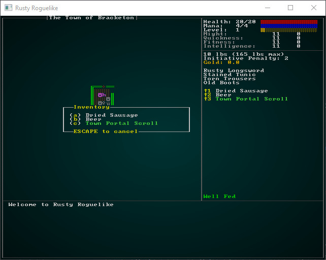
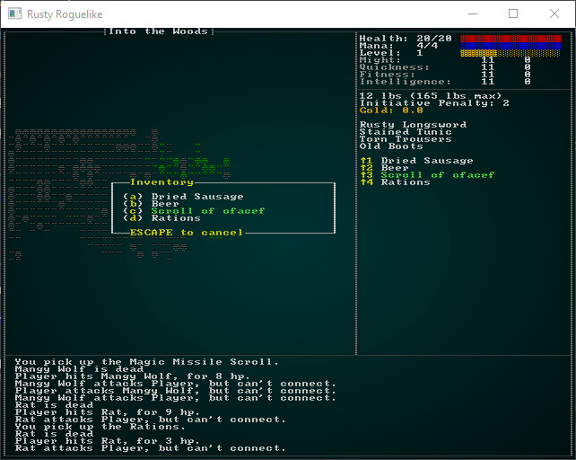
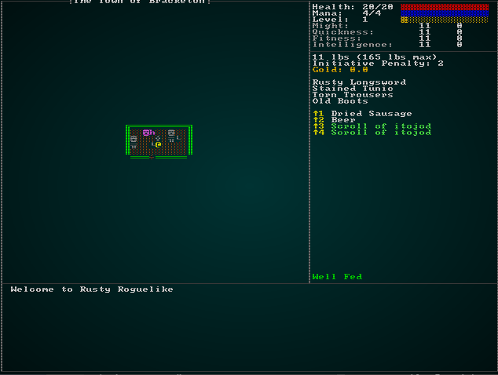

# Magic Items and Item Identification

---

***About this tutorial***

*This tutorial is free and open source, and all code uses the MIT license - so you are free to do with it as you like. My hope is that you will enjoy the tutorial, and make great games!*

*If you enjoy this and would like me to keep writing, please consider supporting [my Patreon](https://www.patreon.com/blackfuture).*

---

Magical items are a mainstay of both D&D and roguelikes. From the humble "Sword +1", to mighty "Holy Avenger" - and back again to "Cursed Backbiter" - items helped to define the genre. In roguelikes, it's also traditional to not automatically know what items are; you find an "Unidentified Longsword", and have no idea what it does (or if is cursed) until you find a way to identify it. You find a "Scroll of *cat walked on keyboard*" (the unpronounceable names seem to be a feature!), and until you identify or read it - you don't know what to expect. Some games turn this into entire meta-games - gambling on frequency, vendor prices and similar to give you clues as to what you just found. Even *Diablo*, the most mainstream roguelike (even if it went real-time!) of them all has retained this play feature - but tends to make Identify scrolls extremely plentiful (as well as helpful old Scotsmen).

## Classes of magic item

It's common in modern games to differentiate magic items as being *magical*, *rare* or *legendary* (along with item sets, which we won't go into yet). These are typically differentiated by color, so you can tell at a glance if an item is even worth considering. This also gives an opportunity to denote that something *is* a magic item - so we'll open up `components.rs` (and register in `main.rs` and `saveload_system.rs`) and make `MagicItem`:

```rust
#[derive(Debug, Serialize, Deserialize, Clone, Eq, PartialEq, Hash)]
pub enum MagicItemClass { Common, Rare, Legendary }

#[derive(Component, Debug, Serialize, Deserialize, Clone)]
pub struct MagicItem {
    pub class : MagicItemClass
}
```

The next step is to let items be denoted as magical, and having one of these classes. Add the following to `raws/item_structs.rs`:

```rust
#[derive(Deserialize, Debug)]
pub struct Item {
    pub name : String,
    pub renderable : Option<Renderable>,
    pub consumable : Option<Consumable>,
    pub weapon : Option<Weapon>,
    pub wearable : Option<Wearable>,
    pub initiative_penalty : Option<f32>,
    pub weight_lbs : Option<f32>,
    pub base_value : Option<f32>,
    pub vendor_category : Option<String>,
    pub magic : Option<MagicItem>
}

#[derive(Deserialize, Debug)]
pub struct MagicItem {
    pub class: String
}
```

Why are we using a full struct here, rather than just a string? We're going to want to specify more information here later in the chapter as we start to flesh out magical items.

You can now decorate items in `spawns.json`, for example:

```json
{
    "name" : "Health Potion",
    "renderable": {
        "glyph" : "!",
        "fg" : "#FF00FF",
        "bg" : "#000000",
        "order" : 2
    },
    "consumable" : {
        "effects" : { "provides_healing" : "8" }
    },
    "weight_lbs" : 0.5,
    "base_value" : 50.0,
    "vendor_category" : "alchemy",
    "magic" : { "class" : "common" }
},
```

I've added the `common` magic tag to the magical scrolls and potions already in the JSON list, see the source for details - it's pretty straightforward at this point. Next up, we need to modify `spawn_named_item` in `raws/rawmaster.rs` to apply the appropriate component tags:

```rust
if let Some(magic) = &item_template.magic {
    let class = match magic.class.as_str() {
        "rare" => MagicItemClass::Rare,
        "legendary" => MagicItemClass::Legendary,
        _ => MagicItemClass::Common
    };
    eb = eb.with(MagicItem{ class });
}
```

Now that we have this data, we need to *use* it. For now, we'll just want to set the display *color* of item names whenever they appear in the GUI - to give a better idea of magic item value (just like all those MMO games!). In `gui.rs`, we'll make a generic function for this purpose:

```rust
pub fn get_item_color(ecs : &World, item : Entity) -> RGB {
    if let Some(magic) = ecs.read_storage::<MagicItem>().get(item) {
        match magic.class {
            MagicItemClass::Common => return RGB::from_f32(0.5, 1.0, 0.5),
            MagicItemClass::Rare => return RGB::from_f32(0.0, 1.0, 1.0),
            MagicItemClass::Legendary => return RGB::from_f32(0.71, 0.15, 0.93)
        }
    }
    RGB::from_f32(1.0, 1.0, 1.0)
}
```

Now we need to go through all of the functions in `gui.rs` that display an item name, and replace the hard-coded color with a call to this function. In `draw_ui` (line 121 of `gui.rs`), expand the equipped list a little:

```rust
// Equipped
let mut y = 13;
let entities = ecs.entities();
let equipped = ecs.read_storage::<Equipped>();
let name = ecs.read_storage::<Name>();
for (entity, equipped_by, item_name) in (&entities, &equipped, &name).join() {
    if equipped_by.owner == *player_entity {
        ctx.print_color(50, y, get_item_color(ecs, entity), black, &item_name.name);
        y += 1;
    }
}
```

The same change in the consumables section:

```rust
ctx.print_color(53, y, get_item_color(ecs, entity), black, &item_name.name);
```

We're going to leave tooltips alone, improving them (and the log) are the subject of a (currently hypothetical) future chapter. In `show_inventory` (around line 321), `drop_item_menu` (around line 373), `remove_item_menu` (around line 417), and `vendor_sell_menu` (around line 660):

```rust
ctx.print_color(21, y, get_item_color(&gs.ecs, entity), RGB::from_f32(0.0, 0.0, 0.0), &name.name.to_string());
```

Be warned: these lines will change *again* once we add item identification!

With that in place, if you `cargo run` you will see your `Town Portal Scroll` is now nicely highlighted as a common magical item:



## Identification: Scrolls

It's pretty common in Roguelikes for potions to have thoroughly unpronounceable names when you don't know what they do. Presumably, this represents some sort of guttural utterings that trigger the magical effect (and as much fun as it would be to build a giant grammar around this, the tutorial would be even bigger!). So a *Scroll of Lorem Ipsum* might be *any* of the scrolls in the game, and it's up to you to decide to identify by using it (a gamble, it may not be what you want at all!), get it identified, or just ignore it because you don't like the risk.

Let's start by opening up `spawner.rs`, going to the `player` function and removing the line that gives a free `Town Portal`. It's overly generous, and would mean you'd have to start knowing what it is!

So here's the fun part: if we were to simply assign an unidentified name to scrolls, players could simply learn the names - and identification would be little more than a memory game. So we need to assign the names *when the game starts* (and not when the raw files load, since you may play more than once per session). Let's start in `raws/item_structs.rs` and add another field to `MagicItem` indicating that "this is a scroll, and should use scroll naming."

```rust
#[derive(Deserialize, Debug)]
pub struct MagicItem {
    pub class: String,
    pub naming: String
}
```

Now we have to go through `spawns.json` and add naming tags to our "magic" entries. I've opted for "scroll" for naming scrolls (and left the others as empty strings for now). For example, here's the magic missile scroll:

```json
{
    "name" : "Magic Missile Scroll",
    "renderable": {
        "glyph" : ")",
        "fg" : "#00FFFF",
        "bg" : "#000000",
        "order" : 2
    },
    "consumable" : {
        "effects" : { 
            "ranged" : "6",
            "damage" : "20"
        }
    },
    "weight_lbs" : 0.5,
    "base_value" : 50.0,
    "vendor_category" : "alchemy",
    "magic" : { "class" : "common", "naming" : "scroll" }
},
```

We already have a structure that persists through the whole game (but remains a global resource), and resets whenever we change level: the `MasterDungeonMap`. It makes some sense to use this to store state about the whole game, since it's already the dungeon master! We're also already serializing it, which helps a lot! So we'll open up `map/dungeon.rs` and add in a couple of structures:

```rust
#[derive(Default, Serialize, Deserialize, Clone)]
pub struct MasterDungeonMap {
    maps : HashMap<i32, Map>,
    identified_items : HashSet<String>,
    scroll_mappings : HashMap<String, String>
}
```

We also have to update the constructor to provide empty values (for now):

```rust
impl MasterDungeonMap {
    pub fn new() -> MasterDungeonMap {
        MasterDungeonMap{ 
            maps: HashMap::new() ,
            pub identified_items : HashSet::new(),
            pub scroll_mappings : HashMap::new()
        }
    }
```

The idea is that when an item is identified, we'll put its name tag into `identified_items`, providing a fast way to tell if an item has been identified yet. `scroll_mappings` is intended to map the actual name of a scroll with a randomized name. These will then persist for the duration of the game session (and be included in save games, automatically!). In order to populate the scroll mappings, we need a way to get hold of the item names tagged as scrolls in the raw files. So in `raws/rawmaster.rs`, we'll make a new function:

```rust
pub fn get_scroll_tags() -> Vec<String> {
    let raws = &super::RAWS.lock().unwrap();
    let mut result = Vec::new();

    for item in raws.raws.items.iter() {
        if let Some(magic) = &item.magic {
            if &magic.naming == "scroll" {
                result.push(item.name.clone());
            }
        }
    }

    result
}
```

This obtains access to the global `raws`, iterates through all items looking for magical items that have the `scroll` naming convention, and returns the names as a vector of strings. We won't be doing it often, so we won't try and be clever with performance (cloning all those strings is a little on the slow side). So now in `map/dungeon.rs` we further extend the constructor to make scroll name mappings:

```rust
impl MasterDungeonMap {
    pub fn new() -> MasterDungeonMap {
        let mut dm = MasterDungeonMap{ 
            maps: HashMap::new() ,
            identified_items : HashSet::new(),
            scroll_mappings : HashMap::new()
        };

        let mut rng = rltk::RandomNumberGenerator::new();
        for scroll_tag in crate::raws::get_scroll_tags().iter() {
            let masked_name = make_scroll_name(&mut rng);
            dm.scroll_mappings.insert(scroll_tag.to_string(), masked_name);
        }

        dm
    }
```

This references a new function, `make_scroll_name` which looks like this:

```rust
fn make_scroll_name(rng: &mut rltk::RandomNumberGenerator) -> String {
    let length = 4 + rng.roll_dice(1, 4);
    let mut name = "Scroll of ".to_string();

    for i in 0..length {
        if i % 2 == 0 {
            name += match rng.roll_dice(1, 5) {
                1 => "a",
                2 => "e",
                3 => "i",
                4 => "o",
                _ => "u"
            }
        } else {
            name += match rng.roll_dice(1, 21) {
                1 => "b",
                2 => "c",
                3 => "d",
                4 => "f",
                5 => "g",
                6 => "h",
                7 => "j",
                8 => "k",
                9 => "l",
                10 => "m",
                11 => "n",
                12 => "p",
                13 => "q",
                14 => "r",
                15 => "s",
                16 => "t",
                17 => "v",
                18 => "w",
                19 => "x",
                20 => "y",
                _ => "z"
            }
        }
    }

    name
}
```

This function starts with the stem "Scroll of ", and then adds random letters. Every other letter is a vowel, with consonants in-between. This gets you nonsense, but it's *pronounceable* nonsense such as `iladi` or `omuruxo`. It doesn't give any clue as to the nature of the underlying scroll.

Next, we need a way to denote that an entity *has* an obfuscated name. We'll make a new component for this task, so in `components.rs` (and register in `main.rs` and `saveload_system.rs`) we add:

```rust
#[derive(Component, Debug, Serialize, Deserialize, Clone)]
pub struct ObfuscatedName {
    pub name : String
}
```

We'll also need to add these tags when we spawn an item, so in `raws/rawmaster.rs` we add the following to `spawn_named_item`. First, up at the top, we copy the name mapping (to avoid borrowing problems):

```rust
let item_template = &raws.raws.items[raws.item_index[key]];
let scroll_names = ecs.fetch::<crate::map::MasterDungeonMap>().scroll_mappings.clone();
let mut eb = ecs.create_entity().marked::<SimpleMarker<SerializeMe>>();
```

Then we extend the `magic` handler:

```rust
if let Some(magic) = &item_template.magic {
    let class = match magic.class.as_str() {
        "rare" => MagicItemClass::Rare,
        "legendary" => MagicItemClass::Legendary,
        _ => MagicItemClass::Common
    };
    eb = eb.with(MagicItem{ class });

    #[allow(clippy::single_match)] // To stop Clippy whining until we add more
    match magic.naming.as_str() {
        "scroll" => {
            eb = eb.with(ObfuscatedName{ name : scroll_names[&item_template.name].clone() });
        }
        _ => {}
    }
}
```

Now, we return to `gui.rs` and make a new function to obtain an item's display name:

```rust
pub fn get_item_display_name(ecs: &World, item : Entity) -> String {
    if let Some(name) = ecs.read_storage::<Name>().get(item) {
        if let Some(_) = ecs.read_storage::<MagicItem>().get(item) {
            let dm = ecs.fetch::<crate::map::MasterDungeonMap>();
            if dm.identified_items.contains(&name.name) {
                name.name.clone()
            } else if let Some(obfuscated) = ecs.read_storage::<ObfuscatedName>().get(item) {
                obfuscated.name.clone()
            } else {
                "Unidentified magic item".to_string()
            }
        } else {
            name.name.clone()
        }

    } else {
        "Nameless item (bug)".to_string()
    }
}
```

And once again, we need to go through all the places in `gui.rs` that reference an item's name and change them to use this function. In `draw_ui`, this actually shortens some code since we don't need the actual `Name` component anymore:

```rust
// Equipped
let mut y = 13;
let entities = ecs.entities();
let equipped = ecs.read_storage::<Equipped>();
for (entity, equipped_by) in (&entities, &equipped).join() {
    if equipped_by.owner == *player_entity {
        ctx.print_color(50, y, get_item_color(ecs, entity), black, &get_item_display_name(ecs, entity));
        y += 1;
    }
}

// Consumables
y += 1;
let yellow = RGB::named(rltk::YELLOW);
let consumables = ecs.read_storage::<Consumable>();
let backpack = ecs.read_storage::<InBackpack>();
let mut index = 1;
for (entity, carried_by, _consumable) in (&entities, &backpack, &consumables).join() {
    if carried_by.owner == *player_entity && index < 10 {
        ctx.print_color(50, y, yellow, black, &format!("↑{}", index));
        ctx.print_color(53, y, get_item_color(ecs, entity), black, &get_item_display_name(ecs, entity));
        y += 1;
        index += 1;
    }
}
```

Once again, we're going to worry about tooltips later (although we will tweak them later to not reveal the actual identity of an object!). The other ones we changed earlier change to `ctx.print_color(21, y, get_item_color(&gs.ecs, entity), RGB::from_f32(0.0, 0.0, 0.0), &get_item_display_name(&gs.ecs, entity));`, and can trim out some of the `name` components also.

Once that's done, if you `cargo run` the project scrolls you find will display obfuscated names:



## Identifying obfuscated scrolls

Now that we're properly hiding them, lets introduce a mechanism for identifying scrolls. The most obvious is if you *use* a scroll, it should be identified - and all existing/future instances of that scroll type become identified. The `identified_items` list handles the future, but we'll have to do some extra work to handle the existing ones. We're going to have quite a few potential identifications occur - when you use an identify magic (eventually), when you use or equip an item, when you buy one (since you know you are buying a Magic Mapping scroll, it makes sense that you identify it) - and probably more as we progress.

We'll handle this with a new component to indicate that an item may have been identified, and a system to process the data. First, in `components.rs` (and register in `main.rs` and `saveload_system.rs`):

```rust
#[derive(Component, Debug, Serialize, Deserialize, Clone)]
pub struct IdentifiedItem {
    pub name : String
}
```

Now we'll go to the various places we already have that can identify an item, and attach this component to the player when they use an item. First, extend `inventory_system.rs` to be able to write to the appropriate storage:

```rust
impl<'a> System<'a> for ItemUseSystem {
    #[allow(clippy::type_complexity)]
    type SystemData = ( ReadExpect<'a, Entity>,
                        WriteExpect<'a, GameLog>,
                        WriteExpect<'a, Map>,
                        Entities<'a>,
                        WriteStorage<'a, WantsToUseItem>,
                        ReadStorage<'a, Name>,
                        ReadStorage<'a, Consumable>,
                        ReadStorage<'a, ProvidesHealing>,
                        ReadStorage<'a, InflictsDamage>,
                        WriteStorage<'a, Pools>,
                        WriteStorage<'a, SufferDamage>,
                        ReadStorage<'a, AreaOfEffect>,
                        WriteStorage<'a, Confusion>,
                        ReadStorage<'a, Equippable>,
                        WriteStorage<'a, Equipped>,
                        WriteStorage<'a, InBackpack>,
                        WriteExpect<'a, ParticleBuilder>,
                        ReadStorage<'a, Position>,
                        ReadStorage<'a, ProvidesFood>,
                        WriteStorage<'a, HungerClock>,
                        ReadStorage<'a, MagicMapper>,
                        WriteExpect<'a, RunState>,
                        WriteStorage<'a, EquipmentChanged>,
                        ReadStorage<'a, TownPortal>,
                        WriteStorage<'a, IdentifiedItem>
                      );

    #[allow(clippy::cognitive_complexity)]
    fn run(&mut self, data : Self::SystemData) {
        let (player_entity, mut gamelog, map, entities, mut wants_use, names, 
            consumables, healing, inflict_damage, mut combat_stats, mut suffer_damage, 
            aoe, mut confused, equippable, mut equipped, mut backpack, mut particle_builder, positions,
            provides_food, mut hunger_clocks, magic_mapper, mut runstate, mut dirty, town_portal,
            mut identified_item) = data;
            ...
```

Then, after targeting (line 113):

```rust
// Identify
if entity == *player_entity {
    identified_item.insert(entity, IdentifiedItem{ name: names.get(useitem.item).unwrap().name.clone() })
        .expect("Unable to insert");
}
```

Also, in `main.rs` where we handle spawning items that were purchased we should identify those, also:

```rust
gui::VendorResult::Buy => {
    let tag = result.2.unwrap();
    let price = result.3.unwrap();
    let mut pools = self.ecs.write_storage::<Pools>();
    let player_entity = self.ecs.fetch::<Entity>();
    let mut identified = self.ecs.write_storage::<IdentifiedItem>();
    identified.insert(*player_entity, IdentifiedItem{ name : tag.clone() }).expect("Unable to insert");
    std::mem::drop(identified);
    let player_pools = pools.get_mut(*player_entity).unwrap();
    std::mem::drop(player_entity);
    if player_pools.gold >= price {
        player_pools.gold -= price;
        std::mem::drop(pools);
        let player_entity = *self.ecs.fetch::<Entity>();
        crate::raws::spawn_named_item(&RAWS.lock().unwrap(), &mut self.ecs, &tag, SpawnType::Carried{ by: player_entity });
    }
}
```

Now that we're adding the components, we need to read them and do something with the knowledge! 

We need one more helper function in `raws/rawmaster.rs` to help this process:

```rust
pub fn is_tag_magic(tag : &str) -> bool {
    let raws = &super::RAWS.lock().unwrap();
    if raws.item_index.contains_key(tag) {
        let item_template = &raws.raws.items[raws.item_index[tag]];
        item_template.magic.is_some()
    } else {
        false
    }
}
```

Since identifying items is purely an inventory matter, we'll add another system into the already-large `inventory_system.rs` (spot the hint that we're going to make it into a module, one day?):

```rust
pub struct ItemIdentificationSystem {}

impl<'a> System<'a> for ItemIdentificationSystem {
    #[allow(clippy::type_complexity)]
    type SystemData = ( 
                        ReadStorage<'a, crate::components::Player>,
                        WriteStorage<'a, IdentifiedItem>,
                        WriteExpect<'a, crate::map::MasterDungeonMap>,
                        ReadStorage<'a, Item>,
                        ReadStorage<'a, Name>,
                        WriteStorage<'a, ObfuscatedName>,
                        Entities<'a>
                      );

    fn run(&mut self, data : Self::SystemData) {
        let (player, mut identified, mut dm, items, names, mut obfuscated_names, entities) = data;

        for (_p, id) in (&player, &identified).join() {
            if !dm.identified_items.contains(&id.name) && crate::raws::is_tag_magic(&id.name) {
                dm.identified_items.insert(id.name.clone());

                for (entity, _item, name) in (&entities, &items, &names).join() {
                    if name.name == id.name {
                        obfuscated_names.remove(entity);
                    }                    
                }
            }
        }

        // Clean up
        identified.clear();
    }
}
```

We'll also want to modify `spawn_named_item` in `raws/rawmaster.rs` to not obfuscate names of items we already recognize. We'll start by also obtaining an identified item list:

```rust
let dm = ecs.fetch::<crate::map::MasterDungeonMap>();
let scroll_names = dm.scroll_mappings.clone();
let identified = dm.identified_items.clone();
std::mem::drop(dm);
```

Then we'll make name obfuscation conditional upon now knowing what the item is:

```rust
if !identified.contains(&item_template.name) {
    #[allow(clippy::single_match)] // To stop Clippy whining until we add more
    match magic.naming.as_str() {
        "scroll" => {
            eb = eb.with(ObfuscatedName{ name : scroll_names[&item_template.name].clone() });
        }
        _ => {}
    }
}
```

Finally, we'll add it to `run_systems` in `main.rs`:

```rust
let mut item_id = inventory_system::ItemIdentificationSystem{};
item_id.run_now(&self.ecs);
```

So if you `cargo run` now, you'll be able to identify items by using or buying them.



## Obfuscating Potions

## Other magic items

## Curses

...

**The source code for this chapter may be found [here](https://github.com/thebracket/rustrogueliketutorial/tree/master/chapter-62-magictems)**


[Run this chapter's example with web assembly, in your browser (WebGL2 required)](http://bfnightly.bracketproductions.com/rustbook/wasm/chapter-62-magicitems)
---

Copyright (C) 2019, Herbert Wolverson.

---