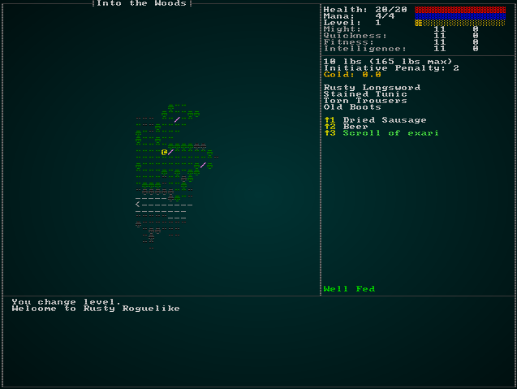
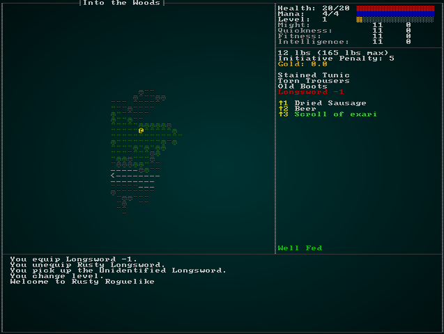
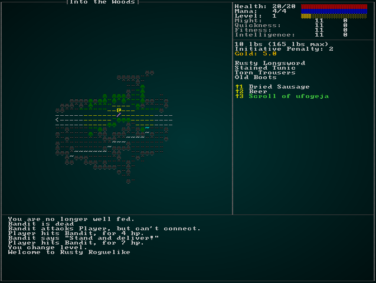
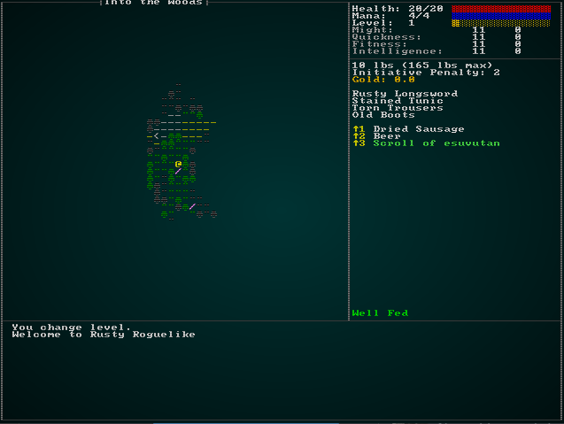

# Cursed Items and Mitigation Thereof

---

***About this tutorial***

*This tutorial is free and open source, and all code uses the MIT license - so you are free to do with it as you like. My hope is that you will enjoy the tutorial, and make great games!*

*If you enjoy this and would like me to keep writing, please consider supporting [my Patreon](https://www.patreon.com/blackfuture).*

---

Now that we have a solid magical items framework, it's time to add in cursed items. These are a mainstay of the Roguelike genre, albeit one that if over-used can really annoy your players! Cursed items are part of the item identification mini-game: they provide a risk to equipping/using an item before you know what it does. If there's no risk to equipping everything you find, the player will do just that to find out what they are - and the mini-game is pointless. On the other hand, if there are *too many* cursed items, the player will become extremely conservative in item use and won't touch things until they know for sure what they are. So, like many things in life, it's a tough balance to strike.

## Your Basic Longsword -1

As a simple example, we'll start by implementing a cursed longsword. We already have a `Longsword +1`, so it's relatively easy to define the JSON (from `spawns.json`) for one that has penalties instead of benefits:

```json
{
    "name" : "Longsword -1",
    "renderable": {
        "glyph" : "/",
        "fg" : "#FFAAFF",
        "bg" : "#000000",
        "order" : 2
    },
    "weapon" : {
        "range" : "melee",
        "attribute" : "might",
        "base_damage" : "1d8-1",
        "hit_bonus" : -1
    },
    "weight_lbs" : 2.0,
    "base_value" : 100.0,
    "initiative_penalty" : 3,
    "vendor_category" : "weapon",
    "magic" : { "class" : "common", "naming" : "Unidentified Longsword", "cursed" : true }
},
```

You'll notice that there's a to-hit and damage penalty, more of an initiative penalty, and we've added `cursed: true` to the `magic` section. Most of this already just works, but the `cursed` part is new. To start supporting this, we open up `raws/item_structs.rs` and add in template support:

```rust
#[derive(Deserialize, Debug)]
pub struct MagicItem {
    pub class: String,
    pub naming: String,
    pub cursed: Option<bool>
}
```

We've made it an `Option` - so you don't have to specify it for non-cursed items. Now we need a new component to indicate that an item is, in fact, cursed. In `components.rs` (and registered in `main.rs` and `saveload_system.rs`):

```rust
#[derive(Component, Debug, Serialize, Deserialize, Clone)]
pub struct CursedItem {}
```

Next up, we'll adjust `spawn_named_item` in `raws/rawmaster.rs` to handle adding the `CursedItem` component to cursed items:

```rust
if let Some(magic) = &item_template.magic {
    let class = match magic.class.as_str() {
        "rare" => MagicItemClass::Rare,
        "legendary" => MagicItemClass::Legendary,
        _ => MagicItemClass::Common
    };
    eb = eb.with(MagicItem{ class });

    if !identified.contains(&item_template.name) {
        match magic.naming.as_str() {
            "scroll" => {
                eb = eb.with(ObfuscatedName{ name : scroll_names[&item_template.name].clone() });
            }
            "potion" => {
                eb = eb.with(ObfuscatedName{ name: potion_names[&item_template.name].clone() });
            }
            _ => {
                eb = eb.with(ObfuscatedName{ name : magic.naming.clone() });
            }
        }
    }

    if let Some(cursed) = magic.cursed {
        if cursed { eb = eb.with(CursedItem{}); }
    }
}
```

Let's pop back to `spawns.json` and give them a chance to spawn. For now, we'll make them appear *everywhere* so it's easy to test them:

```json
{ "name" : "Longsword -1", "weight" : 100, "min_depth" : 1, "max_depth" : 100 },
```

That gets us far enough that you can run the game, and cursed longswords will appear and have poor combat performance. Identification already works, so equipping a cursed sword tells you what it is - but there's absolutely no penalty for doing so, other than it having poor stats when you use it. That's a great start!

## Letting the player know that it's cursed

In `gui.rs`, we carefully color items by class in `get_item_color`. We'd like cursed items to go red - but *only* if you know that they are cursed (so you don't look at your inventory list and see "oh, that's cursed - better not equip it!"). So let's modify that function to provide this functionality:

```rust
pub fn get_item_color(ecs : &World, item : Entity) -> RGB {
    let dm = ecs.fetch::<crate::map::MasterDungeonMap>();
    if let Some(name) = ecs.read_storage::<Name>().get(item) {
        if ecs.read_storage::<CursedItem>().get(item).is_some() && dm.identified_items.contains(&name.name) {
            return RGB::from_f32(1.0, 0.0, 0.0);
        }
    }

    if let Some(magic) = ecs.read_storage::<MagicItem>().get(item) {
        match magic.class {
            MagicItemClass::Common => return RGB::from_f32(0.5, 1.0, 0.5),
            MagicItemClass::Rare => return RGB::from_f32(0.0, 1.0, 1.0),
            MagicItemClass::Legendary => return RGB::from_f32(0.71, 0.15, 0.93)
        }
    }
    RGB::from_f32(1.0, 1.0, 1.0)
}
```



## Preventing the unequipping of cursed items

The easy case for preventing removal is in the `inventory_system/remove_system.rs`: it simply takes an item and puts it into your backpack. We can just make this conditional, and we're good to go! Here's the source code for the system:

```rust
use specs::prelude::*;
use super::{InBackpack, Equipped, WantsToRemoveItem, CursedItem, Name};

pub struct ItemRemoveSystem {}

impl<'a> System<'a> for ItemRemoveSystem {
    #[allow(clippy::type_complexity)]
    type SystemData = (
                        Entities<'a>,
                        WriteStorage<'a, WantsToRemoveItem>,
                        WriteStorage<'a, Equipped>,
                        WriteStorage<'a, InBackpack>,
                        ReadStorage<'a, CursedItem>,
                        WriteExpect<'a, crate::gamelog::GameLog>,
                        ReadStorage<'a, Name>
                      );

    fn run(&mut self, data : Self::SystemData) {
        let (entities, mut wants_remove, mut equipped, mut backpack, cursed, mut gamelog, names) = data;

        for (entity, to_remove) in (&entities, &wants_remove).join() {
            if cursed.get(to_remove.item).is_some() {
                gamelog.entries.push(format!("You cannot remove {}, it is cursed", names.get(to_remove.item).unwrap().name));
            } else {
                equipped.remove(to_remove.item);
                backpack.insert(to_remove.item, InBackpack{ owner: entity }).expect("Unable to insert backpack");
            }
        }

        wants_remove.clear();
    }
}
```

The case of `equip_use.rs` is a bit more complicated. We equip the item, scan for items to replace and unequip the replacement item. We'll have to change this around a bit: look for what to remove, see if its cursed (and cancel if it is, with a message), and then if it is still valid actually perform the swap. We also want to *not* identify the item if you can't equip it, to avoid giving a fun backdoor in which you equip a cursed item and then use it to identify all the other cursed items! We can adjust the system like this:

```rust
use specs::prelude::*;
use super::{Name, InBackpack, gamelog::GameLog, WantsToUseItem, Equippable, Equipped, EquipmentChanged,
    IdentifiedItem, CursedItem};

pub struct ItemEquipOnUse {}

impl<'a> System<'a> for ItemEquipOnUse {
    #[allow(clippy::type_complexity)]
    type SystemData = ( ReadExpect<'a, Entity>,
                        WriteExpect<'a, GameLog>,
                        Entities<'a>,
                        WriteStorage<'a, WantsToUseItem>,
                        ReadStorage<'a, Name>,
                        ReadStorage<'a, Equippable>,
                        WriteStorage<'a, Equipped>,
                        WriteStorage<'a, InBackpack>,
                        WriteStorage<'a, EquipmentChanged>,
                        WriteStorage<'a, IdentifiedItem>,
                        ReadStorage<'a, CursedItem>
                      );

    #[allow(clippy::cognitive_complexity)]
    fn run(&mut self, data : Self::SystemData) {
        let (player_entity, mut gamelog, entities, mut wants_use, names, equippable, 
            mut equipped, mut backpack, mut dirty, mut identified_item, cursed) = data;

        let mut remove_use : Vec<Entity> = Vec::new();
        for (target, useitem) in (&entities, &wants_use).join() {
            // If it is equippable, then we want to equip it - and unequip whatever else was in that slot
            if let Some(can_equip) = equippable.get(useitem.item) {
                let target_slot = can_equip.slot;

                // Remove any items the target has in the item's slot
                let mut can_equip = true;
                let mut log_entries : Vec<String> = Vec::new();
                let mut to_unequip : Vec<Entity> = Vec::new();
                for (item_entity, already_equipped, name) in (&entities, &equipped, &names).join() {
                    if already_equipped.owner == target && already_equipped.slot == target_slot {
                        if cursed.get(item_entity).is_some() {
                            can_equip = false;
                            gamelog.entries.push(format!("You cannot unequip {}, it is cursed.", name.name)); 
                        } else {
                            to_unequip.push(item_entity);
                            if target == *player_entity {
                                log_entries.push(format!("You unequip {}.", name.name));                                
                            }
                        }
                    }
                }

                if can_equip {
                    // Identify the item
                    if target == *player_entity {
                        identified_item.insert(target, IdentifiedItem{ name: names.get(useitem.item).unwrap().name.clone() })
                            .expect("Unable to insert");
                    }
                    

                    for item in to_unequip.iter() {
                        equipped.remove(*item);
                        backpack.insert(*item, InBackpack{ owner: target }).expect("Unable to insert backpack entry");
                    }

                    for le in log_entries.iter() {
                        gamelog.entries.push(le.to_string());
                    }

                    // Wield the item
                    equipped.insert(useitem.item, Equipped{ owner: target, slot: target_slot }).expect("Unable to insert equipped component");
                    backpack.remove(useitem.item);
                    if target == *player_entity {
                        gamelog.entries.push(format!("You equip {}.", names.get(useitem.item).unwrap().name));
                    }
                }

                // Done with item
                remove_use.push(target);
            }
        }

        remove_use.iter().for_each(|e| { 
            dirty.insert(*e, EquipmentChanged{}).expect("Unable to insert");
            wants_use.remove(*e).expect("Unable to remove"); 
        });
    }
}
```

We've moved identification down beneath the item scanning, and added a `can_use` bool; if the switch would result in unequipping a cursed item, we cancel the job. If you `cargo run` the project now, you will find that there's no way to remove cursed equipment once it is wielded:



## Removing Curses

Now that the player can accidentally curse themselves, it would be a good idea to give them a way to recover from their mistake! Let's add the traditional *Scroll of Remove Curse*. In `spawns.json`, we'll start out by defining what we want:

```json
{
    "name" : "Remove Curse Scroll",
    "renderable": {
        "glyph" : ")",
        "fg" : "#FFAAAA",
        "bg" : "#000000",
        "order" : 2
    },
    "consumable" : {
        "effects" : {
            "remove_curse" : ""
        }
    },
    "weight_lbs" : 0.5,
    "base_value" : 50.0,
    "vendor_category" : "alchemy",
    "magic" : { "class" : "common", "naming" : "scroll" }
},
```

We should also allow it to spawn:

```json
{ "name" : "Remove Curse Scroll", "weight" : 4, "min_depth" : 0, "max_depth" : 100 },
```

The only new thing there is the effect: `remove_curse`. We'll handle it like other effects, so we start by making a new component to represent "this X triggers curse removal". In `components.rs` (and registered in `main.rs` and `saveload_system.rs`):

```rust
#[derive(Component, Debug, Serialize, Deserialize, Clone)]
pub struct ProvidesRemoveCurse {}
```

Now in `raws/rawmaster.rs`, we'll add it to the effects spawn list (so it remains a generic ability; you could have a shrine that removes curses for example):

```rust
macro_rules! apply_effects {
    ( $effects:expr, $eb:expr ) => {
        for effect in $effects.iter() {
        let effect_name = effect.0.as_str();
            match effect_name {
                "provides_healing" => $eb = $eb.with(ProvidesHealing{ heal_amount: effect.1.parse::<i32>().unwrap() }),
                "ranged" => $eb = $eb.with(Ranged{ range: effect.1.parse::<i32>().unwrap() }),
                "damage" => $eb = $eb.with(InflictsDamage{ damage : effect.1.parse::<i32>().unwrap() }),
                "area_of_effect" => $eb = $eb.with(AreaOfEffect{ radius: effect.1.parse::<i32>().unwrap() }),
                "confusion" => $eb = $eb.with(Confusion{ turns: effect.1.parse::<i32>().unwrap() }),
                "magic_mapping" => $eb = $eb.with(MagicMapper{}),
                "town_portal" => $eb = $eb.with(TownPortal{}),
                "food" => $eb = $eb.with(ProvidesFood{}),
                "single_activation" => $eb = $eb.with(SingleActivation{}),
                "particle_line" => $eb = $eb.with(parse_particle_line(&effect.1)),
                "particle" => $eb = $eb.with(parse_particle(&effect.1)),
                "remove_curse" => $eb = $eb.with(ProvidesRemoveCurse{}),
                _ => rltk::console::log(format!("Warning: consumable effect {} not implemented.", effect_name))
            }
        }
    };
}
```

Now that we have remove curse items correctly tagged, all the remains is to make them function! When you use the scroll, it should show you all the items that you *know* are cursed, and let you pick one to de-fang. This will require a new `RunState`, so we'll add that in `main.rs` and add a place-holder to the run-loop so the program compiles:

```rust
#[derive(PartialEq, Copy, Clone)]
pub enum RunState {
    AwaitingInput,
    PreRun,
    Ticking,
    ShowInventory,
    ShowDropItem,
    ShowTargeting { range : i32, item : Entity},
    MainMenu { menu_selection : gui::MainMenuSelection },
    SaveGame,
    NextLevel,
    PreviousLevel,
    TownPortal,
    ShowRemoveItem,
    GameOver,
    MagicMapReveal { row : i32 },
    MapGeneration,
    ShowCheatMenu,
    ShowVendor { vendor: Entity, mode : VendorMode },
    TeleportingToOtherLevel { x: i32, y: i32, depth: i32 },
    ShowRemoveCurse
}
...
RunState::ShowRemoveCurse => {}
```

We'll also add it to the `Ticking` escape clauses:

```rust
RunState::Ticking => {
    while newrunstate == RunState::Ticking {
        self.run_systems();
        self.ecs.maintain();
        match *self.ecs.fetch::<RunState>() {
            RunState::AwaitingInput => newrunstate = RunState::AwaitingInput,
            RunState::MagicMapReveal{ .. } => newrunstate = RunState::MagicMapReveal{ row: 0 },
            RunState::TownPortal => newrunstate = RunState::TownPortal,
            RunState::TeleportingToOtherLevel{ x, y, depth } => newrunstate = RunState::TeleportingToOtherLevel{ x, y, depth },
            RunState::ShowRemoveCurse => newrunstate = RunState::ShowRemoveCurse,
            _ => newrunstate = RunState::Ticking
        }
    }
}
```

Now we'll open up `effects/triggers.rs` and support the run-state transition (I put it after magic mapping):

```rust
// Remove Curse
if ecs.read_storage::<ProvidesRemoveCurse>().get(entity).is_some() {
    let mut runstate = ecs.fetch_mut::<RunState>();
    *runstate = RunState::ShowRemoveCurse;
    did_something = true;
}
```

So now we have to go into `gui.rs` and make another item list system. We'll use the item drop/remove systems as a template, but replace the selection list with an iterator that removes non-cursed items and items that are cursed but you don't know it yet:

```rust
pub fn remove_curse_menu(gs : &mut State, ctx : &mut Rltk) -> (ItemMenuResult, Option<Entity>) {
    let player_entity = gs.ecs.fetch::<Entity>();
    let equipped = gs.ecs.read_storage::<Equipped>();
    let backpack = gs.ecs.read_storage::<InBackpack>();
    let entities = gs.ecs.entities();
    let items = gs.ecs.read_storage::<Item>();
    let cursed = gs.ecs.read_storage::<CursedItem>();
    let names = gs.ecs.read_storage::<Name>();
    let dm = gs.ecs.fetch::<MasterDungeonMap>();

    let build_cursed_iterator = || {
        (&entities, &items, &cursed).join().filter(|(item_entity,_item,_cursed)| {
            let mut keep = false;
            if let Some(bp) = backpack.get(*item_entity) {
                if bp.owner == *player_entity {
                    if let Some(name) = names.get(*item_entity) {
                        if dm.identified_items.contains(&name.name) {
                            keep = true;
                        }
                    }
                }
            }
            // It's equipped, so we know it's cursed
            if let Some(equip) = equipped.get(*item_entity) {
                if equip.owner == *player_entity {
                    keep = true;
                }
            }
            keep
        })
    };

    let count = build_cursed_iterator().count();

    let mut y = (25 - (count / 2)) as i32;
    ctx.draw_box(15, y-2, 31, (count+3) as i32, RGB::named(rltk::WHITE), RGB::named(rltk::BLACK));
    ctx.print_color(18, y-2, RGB::named(rltk::YELLOW), RGB::named(rltk::BLACK), "Remove Curse From Which Item?");
    ctx.print_color(18, y+ count as i32+1, RGB::named(rltk::YELLOW), RGB::named(rltk::BLACK), "ESCAPE to cancel");

    let mut equippable : Vec<Entity> = Vec::new();
    for (j, (entity, _item, _cursed)) in build_cursed_iterator().enumerate() {
        ctx.set(17, y, RGB::named(rltk::WHITE), RGB::named(rltk::BLACK), rltk::to_cp437('('));
        ctx.set(18, y, RGB::named(rltk::YELLOW), RGB::named(rltk::BLACK), 97+j as rltk::FontCharType);
        ctx.set(19, y, RGB::named(rltk::WHITE), RGB::named(rltk::BLACK), rltk::to_cp437(')'));

        ctx.print_color(21, y, get_item_color(&gs.ecs, entity), RGB::from_f32(0.0, 0.0, 0.0), &get_item_display_name(&gs.ecs, entity));
        equippable.push(entity);
        y += 1;
    }

    match ctx.key {
        None => (ItemMenuResult::NoResponse, None),
        Some(key) => {
            match key {
                VirtualKeyCode::Escape => { (ItemMenuResult::Cancel, None) }
                _ => {
                    let selection = rltk::letter_to_option(key);
                    if selection > -1 && selection < count as i32 {
                        return (ItemMenuResult::Selected, Some(equippable[selection as usize]));
                    }
                    (ItemMenuResult::NoResponse, None)
                }
            }
        }
    }
}
```

Then in `main.rs`, we just need to finish the logic:

```rust
RunState::ShowRemoveCurse => {
    let result = gui::remove_curse_menu(self, ctx);
    match result.0 {
        gui::ItemMenuResult::Cancel => newrunstate = RunState::AwaitingInput,
        gui::ItemMenuResult::NoResponse => {}
        gui::ItemMenuResult::Selected => {
            let item_entity = result.1.unwrap();
            self.ecs.write_storage::<CursedItem>().remove(item_entity);
            newrunstate = RunState::Ticking;
        }
    }
}
```

You can now `cargo run`, find a cursed sword (they are *everywhere*), equip it, and use a *Remove Curse* scroll to free yourself from its grip.



## Identification Items

It would also be helpful if you could find a humble *Identification Scroll* and use it to identify magical items before you try them! This is almost exactly the same process as remove curse. Let's start by building the item in `spawns.json`:

```json
{
    "name" : "Identify Scroll",
    "renderable": {
        "glyph" : ")",
        "fg" : "#FFAAAA",
        "bg" : "#000000",
        "order" : 2
    },
    "consumable" : {
        "effects" : {
            "identify" : ""
        }
    },
    "weight_lbs" : 0.5,
    "base_value" : 50.0,
    "vendor_category" : "alchemy",
    "magic" : { "class" : "common", "naming" : "scroll" }
},
```

Once again, we need a new component to represent the power. In `components.rs` (and registered in `main.rs` and `saveload_system.rs`):

```rust
#[derive(Component, Debug, Serialize, Deserialize, Clone)]
pub struct ProvidesIdentification {}
```

Just like before, we then need to add it as an effect in `raws/rawmaster.rs`:

```rust
macro_rules! apply_effects {
    ( $effects:expr, $eb:expr ) => {
        for effect in $effects.iter() {
        let effect_name = effect.0.as_str();
            match effect_name {
                "provides_healing" => $eb = $eb.with(ProvidesHealing{ heal_amount: effect.1.parse::<i32>().unwrap() }),
                "ranged" => $eb = $eb.with(Ranged{ range: effect.1.parse::<i32>().unwrap() }),
                "damage" => $eb = $eb.with(InflictsDamage{ damage : effect.1.parse::<i32>().unwrap() }),
                "area_of_effect" => $eb = $eb.with(AreaOfEffect{ radius: effect.1.parse::<i32>().unwrap() }),
                "confusion" => $eb = $eb.with(Confusion{ turns: effect.1.parse::<i32>().unwrap() }),
                "magic_mapping" => $eb = $eb.with(MagicMapper{}),
                "town_portal" => $eb = $eb.with(TownPortal{}),
                "food" => $eb = $eb.with(ProvidesFood{}),
                "single_activation" => $eb = $eb.with(SingleActivation{}),
                "particle_line" => $eb = $eb.with(parse_particle_line(&effect.1)),
                "particle" => $eb = $eb.with(parse_particle(&effect.1)),
                "remove_curse" => $eb = $eb.with(ProvidesRemoveCurse{}),
                "identify" => $eb = $eb.with(ProvidesIdentification{}),
                _ => rltk::console::log(format!("Warning: consumable effect {} not implemented.", effect_name))
            }
        }
    };
}
```

Next, we'll handle it in the `effects/triggers.rs` file:

```rust
// Identify Item
if ecs.read_storage::<ProvidesIdentification>().get(entity).is_some() {
    let mut runstate = ecs.fetch_mut::<RunState>();
    *runstate = RunState::ShowIdentify;
    did_something = true;
}
```

And we'll pop over to `main.rs` and add `ShowIdentify` as a `RunState`:

```rust
#[derive(PartialEq, Copy, Clone)]
pub enum RunState {
    AwaitingInput,
    PreRun,
    Ticking,
    ShowInventory,
    ShowDropItem,
    ShowTargeting { range : i32, item : Entity},
    MainMenu { menu_selection : gui::MainMenuSelection },
    SaveGame,
    NextLevel,
    PreviousLevel,
    TownPortal,
    ShowRemoveItem,
    GameOver,
    MagicMapReveal { row : i32 },
    MapGeneration,
    ShowCheatMenu,
    ShowVendor { vendor: Entity, mode : VendorMode },
    TeleportingToOtherLevel { x: i32, y: i32, depth: i32 },
    ShowRemoveCurse,
    ShowIdentify
}
```

Add it as an escape clause:

```rust
RunState::Ticking => {
    while newrunstate == RunState::Ticking {
        self.run_systems();
        self.ecs.maintain();
        match *self.ecs.fetch::<RunState>() {
            RunState::AwaitingInput => newrunstate = RunState::AwaitingInput,
            RunState::MagicMapReveal{ .. } => newrunstate = RunState::MagicMapReveal{ row: 0 },
            RunState::TownPortal => newrunstate = RunState::TownPortal,
            RunState::TeleportingToOtherLevel{ x, y, depth } => newrunstate = RunState::TeleportingToOtherLevel{ x, y, depth },
            RunState::ShowRemoveCurse => newrunstate = RunState::ShowRemoveCurse,
            RunState::ShowIdentify => newrunstate = RunState::ShowIdentify,
            _ => newrunstate = RunState::Ticking
        }
    }
}
```

And handle it in our tick system:

```rust
RunState::ShowIdentify => {
    let result = gui::identify_menu(self, ctx);
    match result.0 {
        gui::ItemMenuResult::Cancel => newrunstate = RunState::AwaitingInput,
        gui::ItemMenuResult::NoResponse => {}
        gui::ItemMenuResult::Selected => {
            let item_entity = result.1.unwrap();
            if let Some(name) = self.ecs.read_storage::<Name>().get(item_entity) {
                let mut dm = self.ecs.fetch_mut::<MasterDungeonMap>();
                dm.identified_items.insert(name.name.clone());
            }
            newrunstate = RunState::Ticking;
        }
    }
}
```

Finally, open up `gui.rs` and provide the menu function:

```rust
pub fn identify_menu(gs : &mut State, ctx : &mut Rltk) -> (ItemMenuResult, Option<Entity>) {
    let player_entity = gs.ecs.fetch::<Entity>();
    let equipped = gs.ecs.read_storage::<Equipped>();
    let backpack = gs.ecs.read_storage::<InBackpack>();
    let entities = gs.ecs.entities();
    let items = gs.ecs.read_storage::<Item>();
    let names = gs.ecs.read_storage::<Name>();
    let dm = gs.ecs.fetch::<MasterDungeonMap>();
    let obfuscated = gs.ecs.read_storage::<ObfuscatedName>();

    let build_cursed_iterator = || {
        (&entities, &items).join().filter(|(item_entity,_item)| {
            let mut keep = false;
            if let Some(bp) = backpack.get(*item_entity) {
                if bp.owner == *player_entity {
                    if let Some(name) = names.get(*item_entity) {
                        if obfuscated.get(*item_entity).is_some() && !dm.identified_items.contains(&name.name) {
                            keep = true;
                        }
                    }
                }
            }
            // It's equipped, so we know it's cursed
            if let Some(equip) = equipped.get(*item_entity) {
                if equip.owner == *player_entity {
                    if let Some(name) = names.get(*item_entity) {
                        if obfuscated.get(*item_entity).is_some() && !dm.identified_items.contains(&name.name) {
                            keep = true;
                        }
                    }
                }
            }
            keep
        })
    };

    let count = build_cursed_iterator().count();

    let mut y = (25 - (count / 2)) as i32;
    ctx.draw_box(15, y-2, 31, (count+3) as i32, RGB::named(rltk::WHITE), RGB::named(rltk::BLACK));
    ctx.print_color(18, y-2, RGB::named(rltk::YELLOW), RGB::named(rltk::BLACK), "Identify Which Item?");
    ctx.print_color(18, y+ count as i32+1, RGB::named(rltk::YELLOW), RGB::named(rltk::BLACK), "ESCAPE to cancel");

    let mut equippable : Vec<Entity> = Vec::new();
    for (j, (entity, _item)) in build_cursed_iterator().enumerate() {
        ctx.set(17, y, RGB::named(rltk::WHITE), RGB::named(rltk::BLACK), rltk::to_cp437('('));
        ctx.set(18, y, RGB::named(rltk::YELLOW), RGB::named(rltk::BLACK), 97+j as rltk::FontCharType);
        ctx.set(19, y, RGB::named(rltk::WHITE), RGB::named(rltk::BLACK), rltk::to_cp437(')'));

        ctx.print_color(21, y, get_item_color(&gs.ecs, entity), RGB::from_f32(0.0, 0.0, 0.0), &get_item_display_name(&gs.ecs, entity));
        equippable.push(entity);
        y += 1;
    }

    match ctx.key {
        None => (ItemMenuResult::NoResponse, None),
        Some(key) => {
            match key {
                VirtualKeyCode::Escape => { (ItemMenuResult::Cancel, None) }
                _ => {
                    let selection = rltk::letter_to_option(key);
                    if selection > -1 && selection < count as i32 {
                        return (ItemMenuResult::Selected, Some(equippable[selection as usize]));
                    }
                    (ItemMenuResult::NoResponse, None)
                }
            }
        }
    }
}
```

You can now identify items!



## Fixing spawn weightings before we forget

Before we forget, we don't really want to litter the entire landscape with cursed swords. Pop into `spawns.json` and we'll change the cursed longsword to have the same spawn characteristics as the +1 longsword:

```json
{ "name" : "Longsword -1", "weight" : 1, "min_depth" : 3, "max_depth" : 100 },
```

## Wrap-Up

This chapter has added cursed items, remove curse scrolls and item identification scrolls. That's not bad, we're getting pretty close to a completed item system!

...

**The source code for this chapter may be found [here](https://github.com/thebracket/rustrogueliketutorial/tree/master/chapter-64-curses)**


[Run this chapter's example with web assembly, in your browser (WebGL2 required)](https://bfnightly.bracketproductions.com/rustbook/wasm/chapter-64-curses)
---

Copyright (C) 2019, Herbert Wolverson.

---