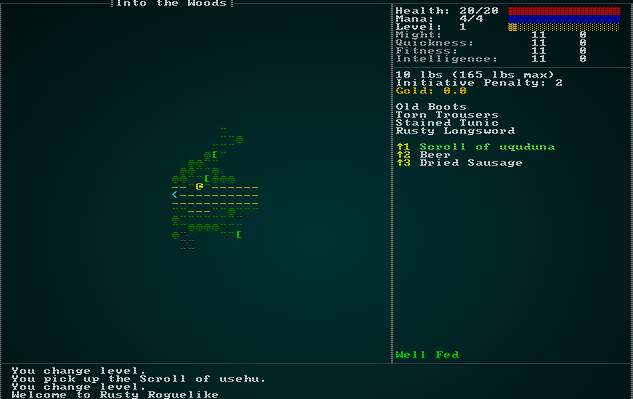
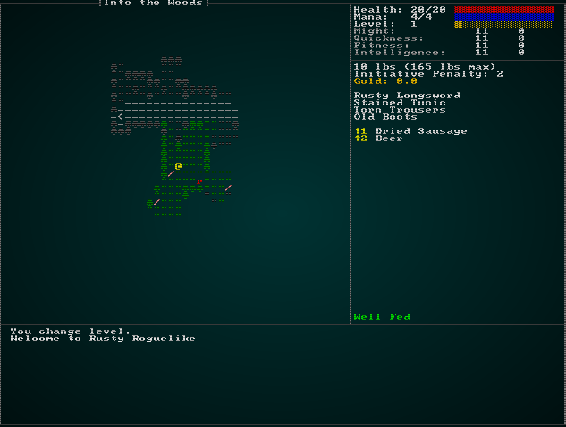
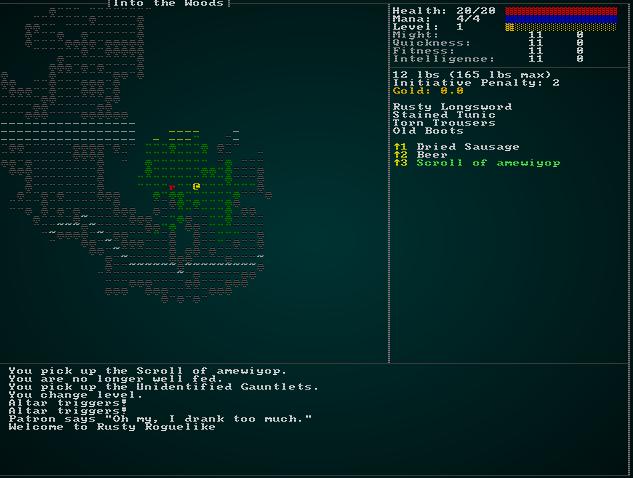
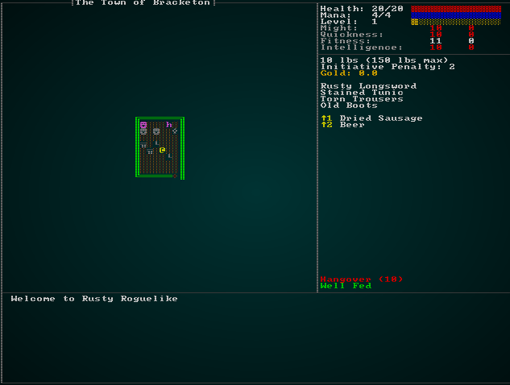
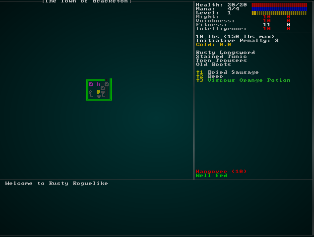

# Items that Affect Attributes, and Better Status Effects

---

***About this tutorial***

*This tutorial is free and open source, and all code uses the MIT license - so you are free to do with it as you like. My hope is that you will enjoy the tutorial, and make great games!*

*If you enjoy this and would like me to keep writing, please consider supporting [my Patreon](https://www.patreon.com/blackfuture).*

---

There are still a few common item types that we aren't supporting, yet. This chapter will finish that up, and lay the framework for spellcasting (in the next chapter).

## Items that improve attributes

A common type of item frequently round in D&D-likes are items that enhance (or reduce!) your attributes. For example, *Gauntlets of Ogre Power* grant a might bonus or a *Hat of Wizardry* grants intelligence. We have most of the framework in place to support these items, so let's go the final mile to make them work! Open up `spawns.json`, and we'll define what the gauntlets might look like:

```json
{
    "name" : "Gauntlets of Ogre Power",
    "renderable": {
        "glyph" : "[",
        "fg" : "#00FF00",
        "bg" : "#000000",
        "order" : 2
    },
    "wearable" : {
        "slot" : "Hands",
        "armor_class" : 0.1,
        "might" : 5
    },
    "weight_lbs" : 1.0,
    "base_value" : 300.0,
    "initiative_penalty" : 0.0,
    "vendor_category" : "armor",
    "magic" : { "class" : "common", "naming" : "Unidentified Gauntlets" },
    "attributes" : { "might" : 5 }
}
```

Why didn't we just add this to "wearable"? We might want to grant an attribute boost to other things! To support loading this - and other attribute boosts - we need to edit `item_structs.rs`:

```rust
#[derive(Deserialize, Debug)]
pub struct Item {
    pub name : String,
    pub renderable : Option<Renderable>,
    pub consumable : Option<Consumable>,
    pub weapon : Option<Weapon>,
    pub wearable : Option<Wearable>,
    pub initiative_penalty : Option<f32>,
    pub weight_lbs : Option<f32>,
    pub base_value : Option<f32>,
    pub vendor_category : Option<String>,
    pub magic : Option<MagicItem>,
    pub attributes : Option<ItemAttributeBonus>
}
...
#[derive(Deserialize, Debug)]
pub struct ItemAttributeBonus {
    pub might : Option<i32>,
    pub fitness : Option<i32>,
    pub quickness : Option<i32>,
    pub intelligence : Option<i32>
}
```

As we've done before, we'll need a component to support this data. In `components.rs` (and registered in `main.rs` and `saveload_system.rs`):

```rust
#[derive(Component, Debug, Serialize, Deserialize, Clone)]
pub struct AttributeBonus {
    pub might : Option<i32>,
    pub fitness : Option<i32>,
    pub quickness : Option<i32>,
    pub intelligence : Option<i32>
}
```

And we'll modify `raws/rawmaster.rs`'s function `spawn_named_item` to support adding this component type:

```rust
if let Some(ab) = &item_template.attributes {
    eb = eb.with(AttributeBonus{
        might : ab.might,
        fitness : ab.fitness,
        quickness : ab.quickness,
        intelligence : ab.intelligence,
    });
}
```

Now that the component can be applied to an item, lets put it into the spawn table as ridiculously common to make testing easy:

```json
{ "name" : "Gauntlets of Ogre Power", "weight" : 100, "min_depth" : 0, "max_depth" : 100 },
```

Finally, we need to make it actually do something. We're doing something very similar in `ai/encumbrance_system.rs` - so that's the natural place to slot it in. We'll add a lot to the system, so here's the whole thing:

```rust
extern crate specs;
use specs::prelude::*;
use crate::{EquipmentChanged, Item, InBackpack, Equipped, Pools, Attributes, gamelog::GameLog, AttributeBonus,
    gamesystem::attr_bonus};
use std::collections::HashMap;

pub struct EncumbranceSystem {}

impl<'a> System<'a> for EncumbranceSystem {
    #[allow(clippy::type_complexity)]
    type SystemData = (
        WriteStorage<'a, EquipmentChanged>,
        Entities<'a>,
        ReadStorage<'a, Item>,
        ReadStorage<'a, InBackpack>,
        ReadStorage<'a, Equipped>,
        WriteStorage<'a, Pools>,
        WriteStorage<'a, Attributes>,
        ReadExpect<'a, Entity>,
        WriteExpect<'a, GameLog>,
        ReadStorage<'a, AttributeBonus>
    );

    fn run(&mut self, data : Self::SystemData) {
        let (mut equip_dirty, entities, items, backpacks, wielded,
            mut pools, mut attributes, player, mut gamelog, attrbonus) = data;

        if equip_dirty.is_empty() { return; }

        struct ItemUpdate {
            weight : f32,
            initiative : f32,
            might : i32,
            fitness : i32,
            quickness : i32,
            intelligence : i32
        }

        // Build the map of who needs updating
        let mut to_update : HashMap<Entity, ItemUpdate> = HashMap::new(); // (weight, intiative)
        for (entity, _dirty) in (&entities, &equip_dirty).join() {
            to_update.insert(entity, ItemUpdate{ weight: 0.0, initiative: 0.0, might: 0, fitness: 0, quickness: 0, intelligence: 0 });
        }

        // Remove all dirty statements
        equip_dirty.clear();

        // Total up equipped items
        for (item, equipped, entity) in (&items, &wielded, &entities).join() {
            if to_update.contains_key(&equipped.owner) {
                let totals = to_update.get_mut(&equipped.owner).unwrap();
                totals.weight += item.weight_lbs;
                totals.initiative += item.initiative_penalty;
                if let Some(attr) = attrbonus.get(entity) {
                    totals.might += attr.might.unwrap_or(0);
                    totals.fitness += attr.fitness.unwrap_or(0);
                    totals.quickness += attr.quickness.unwrap_or(0);
                    totals.intelligence += attr.intelligence.unwrap_or(0);
                }
            }
        }

        // Total up carried items
        for (item, carried, entity) in (&items, &backpacks, &entities).join() {
            if to_update.contains_key(&carried.owner) {
                let totals = to_update.get_mut(&carried.owner).unwrap();
                totals.weight += item.weight_lbs;
                totals.initiative += item.initiative_penalty;
            }
        }

        // Apply the data to Pools
        for (entity, item) in to_update.iter() {
            if let Some(pool) = pools.get_mut(*entity) {
                pool.total_weight = item.weight;
                pool.total_initiative_penalty = item.initiative;

                if let Some(attr) = attributes.get_mut(*entity) {
                    attr.might.modifiers = item.might;
                    attr.fitness.modifiers = item.fitness;
                    attr.quickness.modifiers = item.quickness;
                    attr.intelligence.modifiers = item.intelligence;
                    attr.might.bonus = attr_bonus(attr.might.base + attr.might.modifiers);
                    attr.fitness.bonus = attr_bonus(attr.fitness.base + attr.fitness.modifiers);
                    attr.quickness.bonus = attr_bonus(attr.quickness.base + attr.quickness.modifiers);
                    attr.intelligence.bonus = attr_bonus(attr.intelligence.base + attr.intelligence.modifiers);

                    let carry_capacity_lbs = (attr.might.base + attr.might.modifiers) * 15;
                    if pool.total_weight as i32 > carry_capacity_lbs {
                        // Overburdened
                        pool.total_initiative_penalty += 4.0;
                        if *entity == *player {
                            gamelog.entries.push("You are overburdened, and suffering an initiative penalty.".to_string());
                        }
                    }
                }
            }
        }
    }
}
```

So this is mostly the same logic as before, but we've changed quite a few things:

* Instead of a tuple holding our weight and initiative effects, we've added a `struct` to hold all of the things we want to add up. Rust is nice, you can declare a struct inside a function if you only need it once!
* Just like before, we add up weights for all items, and initiative penalties for equipped items.
* We also add up attribute bonuses/penalties for each item if they have them.
* Then we apply them to the `modifiers` portion of the attributes, and recalculate the bonuses.

The great thing is that because the other systems that use these attributes are already looking at bonuses (and the GUI is looking at modifiers for display), a lot of things *just work* (and not entirely in the Bethesda sense of the phrase... yeah, I actually enjoy *Fallout 76* but it would be nice if things actually did just work!).

Now, if you `cargo run` the project you can find *Gauntlets of Ogre Power* and equip them for the bonus - and then remove them to take it away:



## Charged items

Not all items crumble to dust when you use them. A potion vial might hold more than one dose, a magical rod might cast its effect multiple times (as usual, your imagination is the limit!). Let's make a new item, the *Rod Of Fireballs*. In `spawns.json`, we'll define the basics; it's basically a scroll of fireball, but with charges:

```json
{
    "name" : "Rod of Fireballs",
    "renderable": {
        "glyph" : "/",
        "fg" : "#FFAAAA",
        "bg" : "#000000",
        "order" : 2
    },
    "consumable" : {
        "effects" : { 
            "ranged" : "6",
            "damage" : "20",
            "area_of_effect" : "3",
            "particle" : "▓;#FFA500;200.0"
        },
        "charges" : 5
    },
    "weight_lbs" : 0.5,
    "base_value" : 500.0,
    "vendor_category" : "alchemy",
    "magic" : { "class" : "common", "naming" : "Unidentified Rod" }
}
```

We'll need to extend the item definition in `raws/item_structs.rs` to handle the new data:

```rust
#[derive(Deserialize, Debug)]
pub struct Consumable {
    pub effects : HashMap<String, String>,
    pub charges : Option<i32>
}
```

We'll also extend the `Consumable` component in `components.rs`:

```rust
#[derive(Component, Debug, Serialize, Deserialize, Clone)]
pub struct Consumable {
    pub max_charges : i32,
    pub charges : i32
}
```

Note that we're storing both the max and the current number. That's so we can allow recharging later. We'll need to extend `raws/rawmaster.rs` to apply this information:

```rust
if let Some(consumable) = &item_template.consumable {
    let max_charges = consumable.charges.unwrap_or(1);
    eb = eb.with(crate::components::Consumable{ max_charges, charges : max_charges });
    apply_effects!(consumable.effects, eb);
}
```

Now we need to make consumables with charges make use of them. That means not self-destructing if `max_charges` is greater than 1, only firing if there are charges remaining, and decrementing the charge count after usage. Fortunately, this is an easy change to `effects/triggers.rs`'s `item_trigger` function:

```rust
pub fn item_trigger(creator : Option<Entity>, item: Entity, targets : &Targets, ecs: &mut World) {
    // Check charges
    if let Some(c) = ecs.write_storage::<Consumable>().get_mut(item) {
        if c.charges < 1 {
            // Cancel
            let mut gamelog = ecs.fetch_mut::<GameLog>();
            gamelog.entries.push(format!("{} is out of charges!", ecs.read_storage::<Name>().get(item).unwrap().name));
            return;
        } else {
            c.charges -= 1;
        }
    }

    // Use the item via the generic system
    let did_something = event_trigger(creator, item, targets, ecs);

    // If it was a consumable, then it gets deleted
    if did_something {
        if let Some(c) = ecs.read_storage::<Consumable>().get(item) {
            if c.max_charges == 0 {
                ecs.entities().delete(item).expect("Delete Failed");
            }
        }
    }
}
```

That gets you a multi-use Rod of Fireballs! However, we should have some way to let the player know if charges remain - to help out with item management. After all, it *really sucks* to point your rod at a mighty dragon and hear a "fut" sound as it eats you. We'll go into `gui.rs` and extend `get_item_display_name`:

```rust
pub fn get_item_display_name(ecs: &World, item : Entity) -> String {
    if let Some(name) = ecs.read_storage::<Name>().get(item) {
        if ecs.read_storage::<MagicItem>().get(item).is_some() {
            let dm = ecs.fetch::<crate::map::MasterDungeonMap>();
            if dm.identified_items.contains(&name.name) {
                if let Some(c) = ecs.read_storage::<Consumable>().get(item) {
                    if c.max_charges > 1 {
                        format!("{} ({})", name.name.clone(), c.charges).to_string()
                    } else {
                        name.name.clone()
                    }
                } else {
                    name.name.clone()
                }
            } else if let Some(obfuscated) = ecs.read_storage::<ObfuscatedName>().get(item) {
                obfuscated.name.clone()
            } else {
                "Unidentified magic item".to_string()
            }
        } else {
            name.name.clone()
        }

    } else {
        "Nameless item (bug)".to_string()
    }
}
```

So the function is basically unchanged, but once we've determined that an item is magical AND identified, we look to see if it has charges. If it does, we append the number of charges in parentheses to the item name in the display list.

If you `cargo run` the project now, you can find your *Rod of Fireballs* and blast away until you run out of charges:



## Status Effects

Right now, we're handling status effects on a case-by-base basis, and it's relatively unusual to apply them. Most deep roguelikes have *lots* of possible effects - ranging from hallucinating on mushrooms to moving at super speed after drinking some brown goop! We've left these until now because they dovetail nicely into the other things we've been doing in this chapter.

Up until this chapter, we've added *Confusion* as a tag to the target - and relied upon the tag to store the duration. That's not really in the spirit of an ECS! Rather, *Confusion* is an entity *effect* that applies to a *target* for a *duration* number of turns. As usual, examining the taxonomy is a great way to figure out what entity/component groups something should have. So we'll visit `components.rs` and make two new components (also registering them in `main.rs` and `saveload_system.rs`), and modify the `Confusion` component to match this:

```rust
#[derive(Component, Debug, Serialize, Deserialize, Clone)]
pub struct Confusion {}

#[derive(Component, Debug, Serialize, Deserialize, Clone)]
pub struct Duration {
    pub turns : i32
}

#[derive(Component, Debug, ConvertSaveload, Clone)]
pub struct StatusEffect {
    pub target : Entity
}
```

Also because we're storing an `Entity`, we need to write a wrapper to keep serialization happy:

```rust```

That's all well and good - but we've broken a few things! Everything that expected `Confusion` to have a `turns` field is now complaining.

We'll start in `raws/rawmaster.rs` and separate the effect from the duration:

```rust
"confusion" => {
    $eb = $eb.with(Confusion{});
    $eb = $eb.with(Duration{ turns: effect.1.parse::<i32>().unwrap() });
}
```

In `effects/triggers.rs` we'll make the duration take from the `Duration` component of the effect:

```rust
// Confusion
if let Some(confusion) = ecs.read_storage::<Confusion>().get(entity) {
    if let Some(duration) = ecs.read_storage::<Duration>().get(entity) {
        add_effect(creator, EffectType::Confusion{ turns : duration.turns }, targets.clone());
        did_something = true;
    }
}
```

We'll change `effects/damage.rs`'s confusion function to match the new scheme of things:

```rust
pub fn add_confusion(ecs: &mut World, effect: &EffectSpawner, target: Entity) {
    if let EffectType::Confusion{turns} = &effect.effect_type {
        ecs.create_entity()
            .with(StatusEffect{ target })
            .with(Confusion{})
            .with(Duration{ turns : *turns})
            .with(Name{ name : "Confusion".to_string() })
            .marked::<SimpleMarker<SerializeMe>>()
            .build();
    }
}
```

That leaves `ai/effect_status.rs`. We'll change this to no longer worry about durations at all, and simply check for the presence of an effect - and if its *Confusion*, take away the target's turn:

```rust
extern crate specs;
use specs::prelude::*;
use crate::{MyTurn, Confusion, RunState, StatusEffect};
use std::collections::HashSet;

pub struct TurnStatusSystem {}

impl<'a> System<'a> for TurnStatusSystem {
    #[allow(clippy::type_complexity)]
    type SystemData = ( WriteStorage<'a, MyTurn>,
                        ReadStorage<'a, Confusion>,
                        Entities<'a>,
                        ReadExpect<'a, RunState>,
                        ReadStorage<'a, StatusEffect>
                    );

    fn run(&mut self, data : Self::SystemData) {
        let (mut turns, confusion, entities, runstate, statuses) = data;

        if *runstate != RunState::Ticking { return; }

        // Collect a set of all entities whose turn it is
        let mut entity_turns = HashSet::new();
        for (entity, _turn) in (&entities, &turns).join() {
            entity_turns.insert(entity);
        }

        // Find status effects affecting entities whose turn it is
        let mut not_my_turn : Vec<Entity> = Vec::new();
        for (effect_entity, status_effect) in (&entities, &statuses).join() {
            if entity_turns.contains(&status_effect.target) {
                // Skip turn for confusion
                if confusion.get(effect_entity).is_some() {
                    not_my_turn.push(status_effect.target);
                }
            }
        }

        for e in not_my_turn {
            turns.remove(e);
        }
    }
}
```

If you `cargo run`, this will work - but there's one glaring problem: once confused, you are confused *forever* (or until someone puts you out of your misery). That's not quite what we had in mind. We've de-coupled the effect's duration from the effect taking place (which is a good thing!), but that means we have to handle durations!

Here's an interesting conundrum: status effects are there own entities, but don't have an *Initiative*. Turns are relative, since entities can operate at different speeds. So when do we want to handle duration? The answer is *the player's turn*; time may be relative, but from the player's point of view turns are quite well defined. In effect, the rest of the world is speeding up when you are slowed - because we don't want to force the player to sit and be bored while the world chugs around them. Since we are switching to player control in the `ai/initiative_system.rs` - we'll handle it in there:

```rust
extern crate specs;
use specs::prelude::*;
use crate::{Initiative, Position, MyTurn, Attributes, RunState, Pools, Duration, 
    EquipmentChanged, StatusEffect};

pub struct InitiativeSystem {}

impl<'a> System<'a> for InitiativeSystem {
    #[allow(clippy::type_complexity)]
    type SystemData = ( WriteStorage<'a, Initiative>,
                        ReadStorage<'a, Position>,
                        WriteStorage<'a, MyTurn>,
                        Entities<'a>,
                        WriteExpect<'a, rltk::RandomNumberGenerator>,
                        ReadStorage<'a, Attributes>,
                        WriteExpect<'a, RunState>,
                        ReadExpect<'a, Entity>,
                        ReadExpect<'a, rltk::Point>,
                        ReadStorage<'a, Pools>,
                        WriteStorage<'a, Duration>,
                        WriteStorage<'a, EquipmentChanged>,
                        ReadStorage<'a, StatusEffect>
                    );

    fn run(&mut self, data : Self::SystemData) {
        let (mut initiatives, positions, mut turns, entities, mut rng, attributes,
            mut runstate, player, player_pos, pools, mut durations, mut dirty,
            statuses) = data;

        if *runstate != RunState::Ticking { return; }

        // Clear any remaining MyTurn we left by mistkae
        turns.clear();

        // Roll initiative
        for (entity, initiative, pos) in (&entities, &mut initiatives, &positions).join() {
            initiative.current -= 1;
            if initiative.current < 1 {
                let mut myturn = true;

                // Re-roll
                initiative.current = 6 + rng.roll_dice(1, 6);

                // Give a bonus for quickness
                if let Some(attr) = attributes.get(entity) {
                    initiative.current -= attr.quickness.bonus;
                }

                // Apply pool penalty
                if let Some(pools) = pools.get(entity) {
                    initiative.current += f32::floor(pools.total_initiative_penalty) as i32;
                }

                // TODO: More initiative granting boosts/penalties will go here later

                // If its the player, we want to go to an AwaitingInput state
                if entity == *player {
                    // Give control to the player
                    *runstate = RunState::AwaitingInput;
                } else {
                    let distance = rltk::DistanceAlg::Pythagoras.distance2d(*player_pos, rltk::Point::new(pos.x, pos.y));
                    if distance > 20.0 {
                        myturn = false;
                    }
                }

                // It's my turn!
                if myturn {
                    turns.insert(entity, MyTurn{}).expect("Unable to insert turn");
                }

            }
        }

        // Handle durations
        if *runstate == RunState::AwaitingInput {
            for (effect_entity, duration, status) in (&entities, &mut durations, &statuses).join() {
                duration.turns -= 1;
                if duration.turns < 1 {
                    dirty.insert(status.target, EquipmentChanged{}).expect("Unable to insert");
                    entities.delete(effect_entity).expect("Unable to delete");
                }
            }
        }
    }
}
```

The system is basically unchanged, but we've added a few more accessors into different component storages - and added the "Handle durations" section at the end. This simply joins entities that have a duration and a status effect, and decrements the duration. If the duration is complete, it marks the status's target as dirty (so any recalculation that needs to happen will happen), and deletes the status effect entity.

### Displaying Player Status

Now that we have a generic status effect system, we should modify the UI to show ongoing statuses. Hunger is handled differently, so we'll keep it there - but let's finish that portion of `gui.rs`. In `draw_ui`, replace the *Status* section with:

```rust
// Status
let mut y = 44;
let hunger = ecs.read_storage::<HungerClock>();
let hc = hunger.get(*player_entity).unwrap();
match hc.state {
    HungerState::WellFed => {
        ctx.print_color(50, y, RGB::named(rltk::GREEN), RGB::named(rltk::BLACK), "Well Fed");
        y -= 1;
    }
    HungerState::Normal => {}
    HungerState::Hungry => {
        ctx.print_color(50, y, RGB::named(rltk::ORANGE), RGB::named(rltk::BLACK), "Hungry");
        y -= 1;
    }
    HungerState::Starving => {
        ctx.print_color(50, y, RGB::named(rltk::RED), RGB::named(rltk::BLACK), "Starving");
        y -= 1;
    }
}
let statuses = ecs.read_storage::<StatusEffect>();
let durations = ecs.read_storage::<Duration>();
let names = ecs.read_storage::<Name>();
for (status, duration, name) in (&statuses, &durations, &names).join() {
    if status.target == *player_entity {
        ctx.print_color(
            50, 
            y, 
            RGB::named(rltk::RED), 
            RGB::named(rltk::BLACK), 
            &format!("{} ({})", name.name, duration.turns)
        );
        y -= 1;
    }
}
```

This is very similar to what we had before, but we are storing `y` as a variable - so the list of status effects can grow upwards. Then we query the ECS for entities that have a status, duration and name - and if it is targeting the player, we use that to display the status.

### Displaying Mob Status

It would also be nice to have some indication that status effects are applying to NPCs. There are two levels to this - we can display the status in the tooltip, and also use particles to indicate what's going on in regular play.

To handle tooltips, open up `gui.rs` and go to the `draw_tooltips` function. Underneath "Comment on Pools", add the following:

```rust
// Status effects
let statuses = ecs.read_storage::<StatusEffect>();
let durations = ecs.read_storage::<Duration>();
let names = ecs.read_storage::<Name>();
for (status, duration, name) in (&statuses, &durations, &names).join() {
    if status.target == entity {
        tip.add(format!("{} ({})", name.name, duration.turns));
    }
}
```

So now if you confuse a monster, it displays the effect in the tooltip. That's a good start to explaining why a monster isn't moving!

The other half is to display a particle when a turn is lost to confusion. We'll add a call to the effects system to request a particle! In `ai/turn_status.rs` expand the confusion section:

```rust
// Skip turn for confusion
if confusion.get(effect_entity).is_some() {
    add_effect(
        None, 
        EffectType::Particle{
            glyph : rltk::to_cp437('?'),
            fg : rltk::RGB::named(rltk::CYAN),
            bg : rltk::RGB::named(rltk::BLACK),
            lifespan: 200.0
        },
        Targets::Single{ target:status_effect.target }
    );
    not_my_turn.push(status_effect.target);
}
```

So if you `cargo run` the project now, you can see confusion in action:



### Hangovers

Going back to the design document, we mentioned that you start with a hangover. We can finally implement it! Since you start the game with a hangover, open up `spawner.rs` and add the following to the end of the player spawn to make a hangover entity:

```rust
// Starting hangover
ecs.create_entity()
    .with(StatusEffect{ target : player })
    .with(Duration{ turns:10 })
    .with(Name{ name: "Hangover".to_string() })
    .with(AttributeBonus{
        might : Some(-1),
        fitness : None,
        quickness : Some(-1),
        intelligence : Some(-1)
    })
    .marked::<SimpleMarker<SerializeMe>>()
    .build();
```

Being hungover sucks! You are weaker, slower and less intelligent. Or you will be, once we modify the encumbrance system (it really needs a new name) to handle attribute changes from statuses. The system needs one small improvement:

```rust
// Total up status effect modifiers
for (status, attr) in (&statuses, &attrbonus).join() {
    if to_update.contains_key(&status.target) {
        let totals = to_update.get_mut(&status.target).unwrap();
        totals.might += attr.might.unwrap_or(0);
        totals.fitness += attr.fitness.unwrap_or(0);
        totals.quickness += attr.quickness.unwrap_or(0);
        totals.intelligence += attr.intelligence.unwrap_or(0);
    }
}
```

This shows the *real* reason for having a hangover system: it lets us safely test effects changing your attributes and make sure the expiration works!

If you `cargo run` the game now, you can watch the hangover in effect and wearing off:



### Potion of Strength

Now that we have all of this, let's use it to build a strength potion (I always picture the old *Asterix The Gaul* comics). In `spawns.json`, we define the new potion:

```json
{
    "name" : "Strength Potion",
    "renderable": {
        "glyph" : "!",
        "fg" : "#FF00FF",
        "bg" : "#000000",
        "order" : 2
    },
    "consumable" : {
        "effects" : { "particle" : "!;#FF0000;200.0" }
    },
    "weight_lbs" : 0.5,
    "base_value" : 50.0,
    "vendor_category" : "alchemy",
    "magic" : { "class" : "common", "naming" : "potion" },
    "attributes" : { "might" : 5 }
},
```

There's nothing new here: we're going to show a particle effect, and we've attached an `attributes` section just like the others to the potion. We are going to have to tweak the effects system to know how to apply transient attribute effects, however. In `effects/mod.rs`, we'll add a new effect type:

```rust
#[derive(Debug)]
pub enum EffectType { 
    Damage { amount : i32 },
    Bloodstain,
    Particle { glyph: u8, fg : rltk::RGB, bg: rltk::RGB, lifespan: f32 },
    EntityDeath,
    ItemUse { item: Entity },
    WellFed,
    Healing { amount : i32 },
    Confusion { turns : i32 },
    TriggerFire { trigger: Entity },
    TeleportTo { x:i32, y:i32, depth: i32, player_only : bool },
    AttributeEffect { bonus : AttributeBonus, name : String, duration : i32 }
}
```

We'll mark it as affecting entities:

```rust
fn tile_effect_hits_entities(effect: &EffectType) -> bool {
    match effect {
        EffectType::Damage{..} => true,
        EffectType::WellFed => true,
        EffectType::Healing{..} => true,
        EffectType::Confusion{..} => true,
        EffectType::TeleportTo{..} => true,
        EffectType::AttributeEffect{..} => true,
        _ => false
    }
}
```

And tell it to call a new function we haven't written yet:

```rust
fn affect_entity(ecs: &mut World, effect: &EffectSpawner, target: Entity) {
    match &effect.effect_type {
        EffectType::Damage{..} => damage::inflict_damage(ecs, effect, target),
        EffectType::EntityDeath => damage::death(ecs, effect, target),
        EffectType::Bloodstain{..} => if let Some(pos) = entity_position(ecs, target) { damage::bloodstain(ecs, pos) },
        EffectType::Particle{..} => if let Some(pos) = entity_position(ecs, target) { particles::particle_to_tile(ecs, pos, &effect) },
        EffectType::WellFed => hunger::well_fed(ecs, effect, target),
        EffectType::Healing{..} => damage::heal_damage(ecs, effect, target),
        EffectType::Confusion{..} => damage::add_confusion(ecs, effect, target),
        EffectType::TeleportTo{..} => movement::apply_teleport(ecs, effect, target),
        EffectType::AttributeEffect{..} => damage::attribute_effect(ecs, effect, target),
        _ => {}
    }
}
```

Now we need to go into `effects/damage.rs` and write the new function:

```rust
pub fn attribute_effect(ecs: &mut World, effect: &EffectSpawner, target: Entity) {
    if let EffectType::AttributeEffect{bonus, name, duration} = &effect.effect_type {
        ecs.create_entity()
            .with(StatusEffect{ target })
            .with(bonus.clone())
            .with(Duration { turns : *duration })
            .with(Name { name : name.clone() })
            .marked::<SimpleMarker<SerializeMe>>()
            .build();
        ecs.write_storage::<EquipmentChanged>().insert(target, EquipmentChanged{}).expect("Insert failed");
    }
}
```

All that remains is to open up `effects/triggers.rs` and add attribute bonus effects as a trigger type:

```rust
// Attribute Modifiers
if let Some(attr) = ecs.read_storage::<AttributeBonus>().get(entity) {
    add_effect(
        creator,
        EffectType::AttributeEffect{
            bonus : attr.clone(),
            duration : 10,
            name : ecs.read_storage::<Name>().get(entity).unwrap().name.clone()
        },
        targets.clone()
    );
    did_something = true;
}
```

This is similar to the other triggers - it makes another event fire, this time with the attribute effect in place. You can `cargo run` now, and strength potions are working in the game. Here's a screenshot of drinking one while still hungover, showing you that effects now correctly stack:



## Wrap Up

And there we have it: a status effects system that is nice and generic, and a system to let items fire them - as well as provide attribute bonuses and penalties. That wraps up the items system for now. In the next chapter, we'll move onto magic spells - which will use many of the foundations we've built in these chapters.

...

**The source code for this chapter may be found [here](https://github.com/thebracket/rustrogueliketutorial/tree/master/chapter-65-items)**


[Run this chapter's example with web assembly, in your browser (WebGL2 required)](https://bfnightly.bracketproductions.com/rustbook/wasm/chapter-65-items)
---

Copyright (C) 2019, Herbert Wolverson.

---