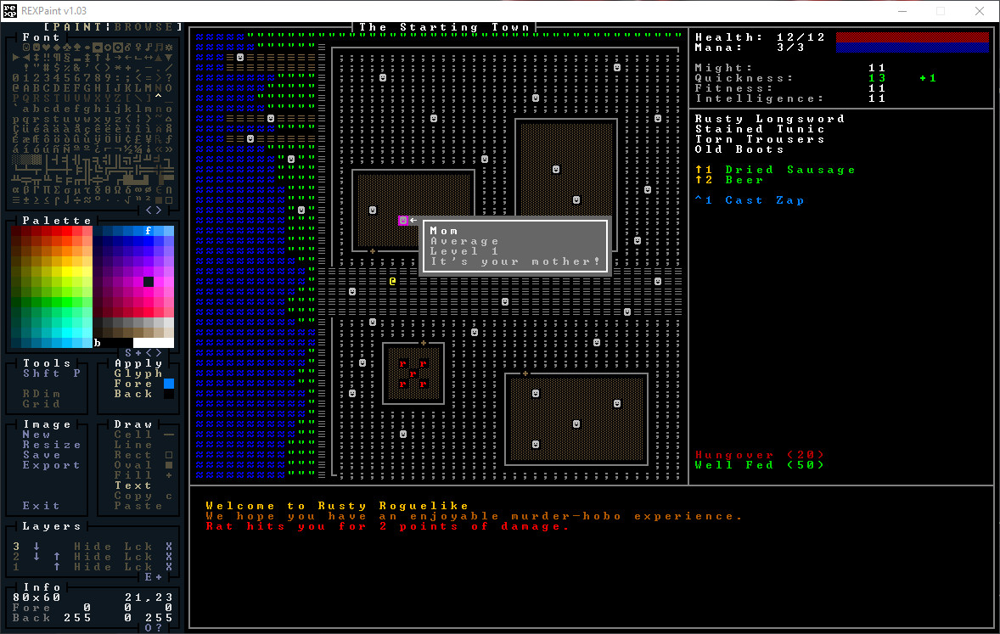
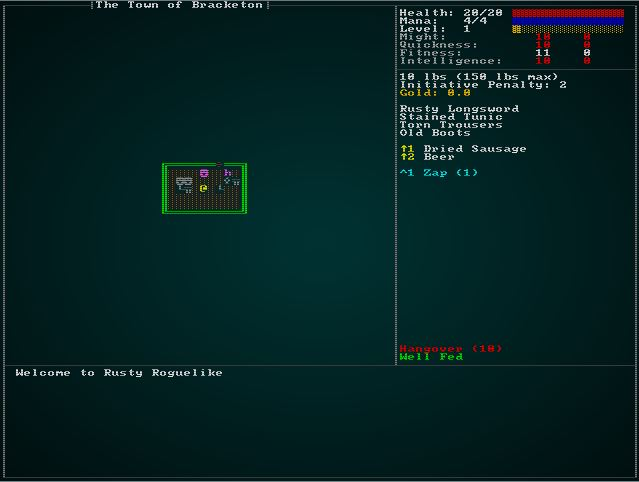
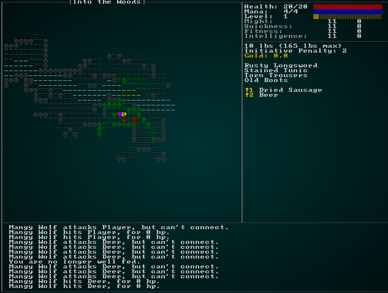
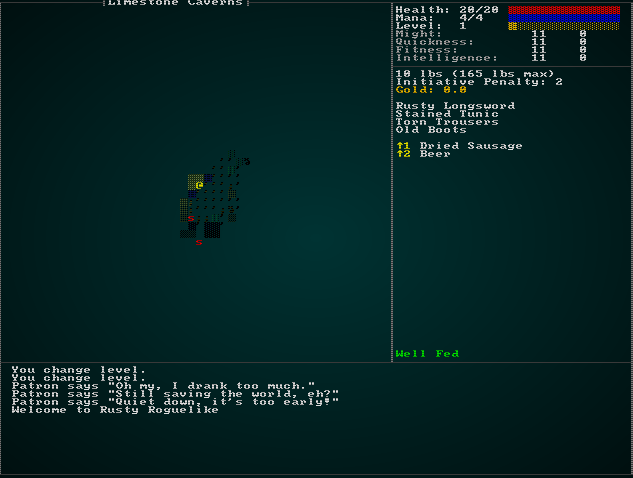

# Magic Spells - or Finally A Use For That Blue Mana Bar

---

***About this tutorial***

*This tutorial is free and open source, and all code uses the MIT license - so you are free to do with it as you like. My hope is that you will enjoy the tutorial, and make great games!*

*If you enjoy this and would like me to keep writing, please consider supporting [my Patreon](https://www.patreon.com/blackfuture).*

---

The last few chapters have been building up to making this one possible: spellcasting. We've had a blue mana bar onscreen for quite a while, now we make it do something useful!

## Knowing Spells

Spellcasting is an optional way to play the game - you can do quite well bashing things if you prefer. It's a common feature in roleplaying games that you can't cast a spell until you know it; you study hard, learn the gestures and incantations and can now unleash your mighty magical powers on the world.

The first implication of this is that an entity needs to be able to *know* spells. A nice side-effect of this is that it gives a convenient way for us to adds special attacks to monsters - we'll cover that later. For now, we'll add a new component to `components.rs` (and register in `main.rs` and `saveload_system.rs`):

```rust
#[derive(Debug, Serialize, Deserialize, Clone)]
pub struct KnownSpell {
    pub display_name : String,
    pub mana_cost : i32
}

#[derive(Component, Debug, Serialize, Deserialize, Clone)]
pub struct KnownSpells {
    pub spells : Vec<KnownSpell>
}
```

We'll also add it to `spawner.rs`'s `player` function. Eventually, we'll blank the spells list (just set it to `Vec::new()`, but for now we're going to add *Zap* as a placeholder):

```rust
.with(KnownSpells{ spells : vec![ KnownSpell{ display_name : "Zap".to_string(), mana_cost: 1 } ] })
```

If you'll remember back in [section 4.9](chapter_52.html), we specified that the user interface should list spells you can cast. Our intended interface looked like this:



Now we have the data required to fill this out! Open up `gui.rs`, and find the part of `draw_ui` that renders consumables. Right underneath it, insert the following code:

```rust
// Spells
y += 1;
let blue = RGB::named(rltk::CYAN);
let known_spells_storage = ecs.read_storage::<KnownSpells>();
let known_spells = &known_spells_storage.get(*player_entity).unwrap().spells;
let mut index = 1;
for spell in known_spells.iter() {
    ctx.print_color(50, y, blue, black, &format!("^{}", index));
    ctx.print_color(53, y, blue, black, &format!("{} ({})", spell.display_name, spell.mana_cost));
    index += 1;
    y += 1;
}
```

This reads the `KnownSpells` component (the player *must* have one), extracts the list and uses it to render spells with hotkey listings. We've made the blue into a cyan for readability, but it looks about right:



## Casting Spells

Displaying the spells is a good start, but we need to be able to actually *cast* (or try to cast) them! You may remember in `player.rs` we handled consumable hotkeys. We'll use a very similar system to handle spell hotkeys. In `player_input`, add the following:

```rust
if ctx.control && ctx.key.is_some() {
    let key : Option<i32> =
        match ctx.key.unwrap() {
            VirtualKeyCode::Key1 => Some(1),
            VirtualKeyCode::Key2 => Some(2),
            VirtualKeyCode::Key3 => Some(3),
            VirtualKeyCode::Key4 => Some(4),
            VirtualKeyCode::Key5 => Some(5),
            VirtualKeyCode::Key6 => Some(6),
            VirtualKeyCode::Key7 => Some(7),
            VirtualKeyCode::Key8 => Some(8),
            VirtualKeyCode::Key9 => Some(9),
            _ => None
        };
    if let Some(key) = key {
        return use_spell_hotkey(gs, key-1);
    }
}
```

That's *just* like the consumable hotkey code (a wise user would refactor some of this into a function, but we'll keep it separated for clarity in the tutorial). It calls `use_spell_hotkey` - which we haven't written yet! Let's go ahead and make a start:

```rust
fn use_spell_hotkey(gs: &mut State, key: i32) -> RunState {
    use super::KnownSpells;

    let player_entity = gs.ecs.fetch::<Entity>();
    let known_spells_storage = gs.ecs.read_storage::<KnownSpells>();
    let known_spells = &known_spells_storage.get(*player_entity).unwrap().spells;

    if (key as usize) < known_spells.len() {
        let pools = gs.ecs.read_storage::<Pools>();
        let player_pools = pools.get(*player_entity).unwrap();
        if player_pools.mana.current >= known_spells[key as usize].mana_cost {
            // TODO: Cast the Spell
        } else {
            let mut gamelog = gs.ecs.fetch_mut::<GameLog>();
            gamelog.entries.push("You don't have enough mana to cast that!".to_string());
        }
    }

    RunState::Ticking
}
```

Notice the big `TODO` in there! We need to put some infrastructure in place before we can actually make the spell-casting happen.

### Defining our Zap Spell

The primary reason we hit a bit of a wall there is that we haven't actually told the engine what a `Zap` spell *does*. We've defined everything else in our raw `spawns.json` file, so lets go ahead and make a new `spells` section:

```json
"spells" : [
    {
        "name" : "Zap",
        "effects" : { 
            "ranged" : "6",
            "damage" : "5",
            "particle_line" : "▓;#00FFFF;200.0"
        }
    }
]
```

Let's extend our `raws` system to be able to read this, and make it available for use in-game. We'll start with a new file, `raws/spell_structs.rs` which will define what a spell looks like to the JSON system:

```rust
use serde::{Deserialize};
use std::collections::HashMap;

#[derive(Deserialize, Debug)]
pub struct Spell {
    pub name : String,
    pub effects : HashMap<String, String>
}
```

Now we'll add `mod spells; pub use spells::Spell;` to `raws/mod.rs` and extend the `Raws` struct to include it:

```rust
mod spell_structs;
pub use spell_structs::Spell;
...
#[derive(Deserialize, Debug)]
pub struct Raws {
    pub items : Vec<Item>,
    pub mobs : Vec<Mob>,
    pub props : Vec<Prop>,
    pub spawn_table : Vec<SpawnTableEntry>,
    pub loot_tables : Vec<LootTable>,
    pub faction_table : Vec<FactionInfo>,
    pub spells : Vec<Spell>
}
```

Now that we've made the field, we should add it to the `empty()` system in `raws/rawmaster.rs`. We'll also add an index, just like the other raw types:

```rust
pub struct RawMaster {
    raws : Raws,
    item_index : HashMap<String, usize>,
    mob_index : HashMap<String, usize>,
    prop_index : HashMap<String, usize>,
    loot_index : HashMap<String, usize>,
    faction_index : HashMap<String, HashMap<String, Reaction>>,
    spell_index : HashMap<String, usize>
}

impl RawMaster {
    pub fn empty() -> RawMaster {
        RawMaster {
            raws : Raws{
                items: Vec::new(),
                mobs: Vec::new(),
                props: Vec::new(),
                spawn_table: Vec::new(),
                loot_tables: Vec::new(),
                faction_table : Vec::new(),
                spells : Vec::new()
            },
            item_index : HashMap::new(),
            mob_index : HashMap::new(),
            prop_index : HashMap::new(),
            loot_index : HashMap::new(),
            faction_index : HashMap::new(),
            spell_index : HashMap::new()
        }
    }
```

And in `load`, we need to populate the index:

```rust
for (i,spell) in self.raws.spells.iter().enumerate() {
    self.spell_index.insert(spell.name.clone(), i);
}
```

We're tying the spell design very heavily to the existing item effects system, but now we hit another minor issue: we're not actually spawning spells as entities - in some cases, they just go straight into the effects system. However, it would be nice to keep using all of the effect code we've written. So we're going to spawn *template* entities for spells. This allows us to find the spell template, and use the existing code to spawn its results. First, in `components.rs` (and registered in `main.rs` and `saveload_system.rs`), we'll make a new `SpellTemplate` component:

```rust
#[derive(Component, Debug, Serialize, Deserialize, Clone)]
pub struct SpellTemplate {
    pub mana_cost : i32
}
```

In `raws/rawmaster.rs` we'll need a new function: `spawn_named_spell`:

```rust
pub fn spawn_named_spell(raws: &RawMaster, ecs : &mut World, key : &str) -> Option<Entity> {
    if raws.spell_index.contains_key(key) {
        let spell_template = &raws.raws.spells[raws.spell_index[key]];

        let mut eb = ecs.create_entity().marked::<SimpleMarker<SerializeMe>>();
        eb = eb.with(SpellTemplate{ mana_cost : spell_template.mana_cost });
        eb = eb.with(Name{ name : spell_template.name.clone() });
        apply_effects!(spell_template.effects, eb);

        return Some(eb.build());
    }
    None
}
```

This is simple: we create a new entity, mark it for serialization and as a spell template, give it a name, and use our existing `effects!` macro to fill out the blanks. Then we return the entity.

We want to do this for *all* spells when a new game starts. We'll start by adding a function to `raws/rawmaster.rs` to call it for all spells:

```rust
pub fn spawn_all_spells(ecs : &mut World) {
    let raws = &super::RAWS.lock().unwrap();
    for spell in raws.raws.spells.iter() {
        spawn_named_spell(raws, ecs, &spell.name);
    }
}
```

Since the player only spawns once, we'll call it at the beginning of `spawner.rs`'s `player` function. That guarantees that it will be present, since not having a player is a fatal bug (and a sad thing!):

```rust
pub fn player(ecs : &mut World, player_x : i32, player_y : i32) -> Entity {
    spawn_all_spells(ecs);
    ...
```

Finally, we're going to add a utility function (to `raws/rawmaster.rs`) to help us find a spell entity. It's pretty straightforward:

```rust
pub fn find_spell_entity(ecs : &World, name : &str) -> Option<Entity> {
    let names = ecs.read_storage::<Name>();
    let spell_templates = ecs.read_storage::<SpellTemplate>();
    let entities = ecs.entities();

    for (entity, sname, _template) in (&entities, &names, &spell_templates).join() {
        if name == sname.name {
            return Some(entity);
        }
    }
    None
}
```

### Enqueueing Zap

Now that we have Zap defined as a spell template, we can finish up the `spell_hotkeys` system we started earlier. First, we'll need a component to indicate a desire to cast a spell. In `components.rs` (and registered in `main.rs` and `saveload_system.rs`):

```rust
#[derive(Component, Debug, ConvertSaveload, Clone)]
pub struct WantsToCastSpell {
    pub spell : Entity,
    pub target : Option<rltk::Point>
}
```

This gives us enough to finish up spellcasting in `player.rs`:

```rust
fn use_spell_hotkey(gs: &mut State, key: i32) -> RunState {
    use super::KnownSpells;
    use super::raws::find_spell_entity;

    let player_entity = gs.ecs.fetch::<Entity>();
    let known_spells_storage = gs.ecs.read_storage::<KnownSpells>();
    let known_spells = &known_spells_storage.get(*player_entity).unwrap().spells;

    if (key as usize) < known_spells.len() {
        let pools = gs.ecs.read_storage::<Pools>();
        let player_pools = pools.get(*player_entity).unwrap();
        if player_pools.mana.current >= known_spells[key as usize].mana_cost {
            if let Some(spell_entity) = find_spell_entity(&gs.ecs, &known_spells[key as usize].display_name) {
                use crate::components::Ranged;
                if let Some(ranged) = gs.ecs.read_storage::<Ranged>().get(spell_entity) {
                    return RunState::ShowTargeting{ range: ranged.range, item: spell_entity };
                };
                let mut intent = gs.ecs.write_storage::<WantsToCastSpell>();
                intent.insert(
                    *player_entity,
                    WantsToCastSpell{ spell: spell_entity, target: None }
                ).expect("Unable to insert intent");
                return RunState::Ticking;
            }
        } else {
            let mut gamelog = gs.ecs.fetch_mut::<GameLog>();
            gamelog.entries.push("You don't have enough mana to cast that!".to_string());
        }
    }

    RunState::Ticking
}
```

You'll notice that we're re-using `ShowTargeting` - but with a spell entity instead of an item. We need to adjust the conditions in `main.rs` to handle this:

```rust
RunState::ShowTargeting{range, item} => {
    let result = gui::ranged_target(self, ctx, range);
    match result.0 {
        gui::ItemMenuResult::Cancel => newrunstate = RunState::AwaitingInput,
        gui::ItemMenuResult::NoResponse => {}
        gui::ItemMenuResult::Selected => {
            if self.ecs.read_storage::<SpellTemplate>().get(item).is_some() {
                let mut intent = self.ecs.write_storage::<WantsToCastSpell>();
                intent.insert(*self.ecs.fetch::<Entity>(), WantsToCastSpell{ spell: item, target: result.1 }).expect("Unable to insert intent");
                newrunstate = RunState::Ticking;
            } else {
                let mut intent = self.ecs.write_storage::<WantsToUseItem>();
                intent.insert(*self.ecs.fetch::<Entity>(), WantsToUseItem{ item, target: result.1 }).expect("Unable to insert intent");
                newrunstate = RunState::Ticking;
            }
        }
    }
}
```

So when a target is selected, it looks at the `item` entity - if it has a spell component, it launches a `WantsToCastSpell` - otherwise it sticks with `WantsToUseItem`.

You've hopefully noticed that we're not actually using `WantsToCastSpell` anywhere! We'll need another system to handle it. It's basically the same as using an item, so we'll add it in next to it. In `inventory_system/use_system.rs`, we'll add a second system:

```rust
use specs::prelude::*;
use super::{Name, WantsToUseItem,Map, AreaOfEffect, EquipmentChanged, IdentifiedItem, WantsToCastSpell};
use crate::effects::*;
...
// The ItemUseSystem goes here
...
pub struct SpellUseSystem {}

impl<'a> System<'a> for SpellUseSystem {
    #[allow(clippy::type_complexity)]
    type SystemData = ( ReadExpect<'a, Entity>,
                        WriteExpect<'a, Map>,
                        Entities<'a>,
                        WriteStorage<'a, WantsToCastSpell>,
                        ReadStorage<'a, Name>,
                        ReadStorage<'a, AreaOfEffect>,
                        WriteStorage<'a, EquipmentChanged>,
                        WriteStorage<'a, IdentifiedItem>
                      );

    #[allow(clippy::cognitive_complexity)]
    fn run(&mut self, data : Self::SystemData) {
        let (player_entity, map, entities, mut wants_use, names,
            aoe, mut dirty, mut identified_item) = data;

        for (entity, useitem) in (&entities, &wants_use).join() {
            dirty.insert(entity, EquipmentChanged{}).expect("Unable to insert");

            // Identify
            if entity == *player_entity {
                identified_item.insert(entity, IdentifiedItem{ name: names.get(useitem.spell).unwrap().name.clone() })
                    .expect("Unable to insert");
            }

            // Call the effects system
            add_effect(
                Some(entity),
                EffectType::SpellUse{ spell : useitem.spell },
                match useitem.target {
                    None => Targets::Single{ target: *player_entity },
                    Some(target) => {
                        if let Some(aoe) = aoe.get(useitem.spell) {
                            Targets::Tiles{ tiles: aoe_tiles(&*map, target, aoe.radius) }
                        } else {
                            Targets::Tile{ tile_idx : map.xy_idx(target.x, target.y) as i32 }
                        }
                    }
                }
            );

        }

        wants_use.clear();
    }
}
```

This is *very* similar to the `ItemUseSystem`, but takes `WantsToCastSpell` as input. It then sends an `EffectType::SpellUse` to the effects system. We haven't written that yet - so let's do that. We'll start by adding it to the `EffectType` enumeration:

```rust
#[derive(Debug)]
pub enum EffectType { 
    Damage { amount : i32 },
    Bloodstain,
    Particle { glyph: u8, fg : rltk::RGB, bg: rltk::RGB, lifespan: f32 },
    EntityDeath,
    ItemUse { item: Entity },
    SpellUse { spell: Entity },
    WellFed,
    Healing { amount : i32 },
    Confusion { turns : i32 },
    TriggerFire { trigger: Entity },
    TeleportTo { x:i32, y:i32, depth: i32, player_only : bool },
    AttributeEffect { bonus : AttributeBonus, name : String, duration : i32 }
}
```

Then we need to add it into the `spell_applicator` function:

```rust
fn target_applicator(ecs : &mut World, effect : &EffectSpawner) {
    if let EffectType::ItemUse{item} = effect.effect_type {
        triggers::item_trigger(effect.creator, item, &effect.targets, ecs);
    } else if let EffectType::SpellUse{spell} = effect.effect_type {
        triggers::spell_trigger(effect.creator, spell, &effect.targets, ecs);
    } else if let EffectType::TriggerFire{trigger} = effect.effect_type {
        triggers::trigger(effect.creator, trigger, &effect.targets, ecs);
    } else {
        match &effect.targets {
            Targets::Tile{tile_idx} => affect_tile(ecs, effect, *tile_idx),
            Targets::Tiles{tiles} => tiles.iter().for_each(|tile_idx| affect_tile(ecs, effect, *tile_idx)),
            Targets::Single{target} => affect_entity(ecs, effect, *target),
            Targets::TargetList{targets} => targets.iter().for_each(|entity| affect_entity(ecs, effect, *entity)),
        }
    }
}
```

This is sending spell-casting to a new trigger function, `spell_trigger`. This is defined in `triggers.rs`:

```rust
pub fn spell_trigger(creator : Option<Entity>, spell: Entity, targets : &Targets, ecs: &mut World) {
    if let Some(template) = ecs.read_storage::<SpellTemplate>().get(spell) {
        let mut pools = ecs.write_storage::<Pools>();
        if let Some(caster) = creator {
            if let Some(pool) = pools.get_mut(caster) {
                if template.mana_cost <= pool.mana.current {
                    pool.mana.current -= template.mana_cost;
                }
            }
        }
    }
    event_trigger(creator, spell, targets, ecs);
}
```

This is relatively simple. It:

* Checks that there is a spell template attached to the input.
* Obtains the caster's pools, to gain access to their mana.
* Reduces the caster's mana by the cost of the spell.
* Sends the spell over to the effects system - which we've already written.

We'll also want to fix a visual issue. Previously, `find_item_position` (in `effects/targeting.rs`) has always sufficed for figuring out where to start some visual effects. Since the item is now a spell template - and has no position - visual effects aren't going to work. We'll add an additional parameter - owner - to the function and it can fall back to the owner's position:

```rust
pub fn find_item_position(ecs: &World, target: Entity, creator: Option<Entity>) -> Option<i32> {
    let positions = ecs.read_storage::<Position>();
    let map = ecs.fetch::<Map>();

    // Easy - it has a position
    if let Some(pos) = positions.get(target) {
        return Some(map.xy_idx(pos.x, pos.y) as i32);
    }

    // Maybe it is carried?
    if let Some(carried) = ecs.read_storage::<InBackpack>().get(target) {
        if let Some(pos) = positions.get(carried.owner) {
            return Some(map.xy_idx(pos.x, pos.y) as i32);
        }
    }

    // Maybe it is equipped?
    if let Some(equipped) = ecs.read_storage::<Equipped>().get(target) {
        if let Some(pos) = positions.get(equipped.owner) {
            return Some(map.xy_idx(pos.x, pos.y) as i32);
        }
    }

    // Maybe the creator has a position?
    if let Some(creator) = creator {
        if let Some(pos) = positions.get(creator) {
            return Some(map.xy_idx(pos.x, pos.y) as i32);
        }
    }

    // No idea - give up
    None
}
```

Then we just need to make a small change in `event_trigger` (in `effects/triggers.rs`):

```rust
// Line particle spawn
if let Some(part) = ecs.read_storage::<SpawnParticleLine>().get(entity) {
    ...
```

And there you have it. If you `cargo run` now, you can press `ctrl+1` to zap people!

## Restoring Mana

You may notice that you never actually get your mana back, right now. You get to zap a few times (4 by default), and then you're done. While that's very 1st Edition D&D-like, it's not a lot of fun for a video game. On the other hand, spells are *powerful* - so we don't want it to be too easy to be the Energizer Bunny of magic!

### Mana Potions

A good start would be to provide *Mana Potions* to restore your magical thirst. In `spawns.json`:

```json
{
    "name" : "Mana Potion",
    "renderable": {
        "glyph" : "!",
        "fg" : "#FF00FF",
        "bg" : "#000000",
        "order" : 2
    },
    "consumable" : {
        "effects" : { "provides_mana" : "4" }
    },
    "weight_lbs" : 0.5,
    "base_value" : 50.0,
    "vendor_category" : "alchemy",
    "magic" : { "class" : "common", "naming" : "potion" }
},
```

And make them a plentiful spawn:

```json
{ "name" : "Mana Potion", "weight" : 7, "min_depth" : 0, "max_depth" : 100 },
```

We don't have support for `provides_mana` yet, so we'll need to make a component for it. In `components.rs` (and `main.rs` and `saveload_system.rs`):

```rust
#[derive(Component, Debug, Serialize, Deserialize, Clone)]
pub struct ProvidesMana {
    pub mana_amount : i32
}
```

And in `raws/rawmaster.rs` we add it as a spawn effect:

```rust
macro_rules! apply_effects {
    ( $effects:expr, $eb:expr ) => {
        for effect in $effects.iter() {
        let effect_name = effect.0.as_str();
            match effect_name {
                "provides_healing" => $eb = $eb.with(ProvidesHealing{ heal_amount: effect.1.parse::<i32>().unwrap() }),
                "provides_mana" => $eb = $eb.with(ProvidesMana{ mana_amount: effect.1.parse::<i32>().unwrap() }),
                "ranged" => $eb = $eb.with(Ranged{ range: effect.1.parse::<i32>().unwrap() }),
                "damage" => $eb = $eb.with(InflictsDamage{ damage : effect.1.parse::<i32>().unwrap() }),
                "area_of_effect" => $eb = $eb.with(AreaOfEffect{ radius: effect.1.parse::<i32>().unwrap() }),
                "confusion" => {
                    $eb = $eb.with(Confusion{});
                    $eb = $eb.with(Duration{ turns: effect.1.parse::<i32>().unwrap() });
                }
                "magic_mapping" => $eb = $eb.with(MagicMapper{}),
                "town_portal" => $eb = $eb.with(TownPortal{}),
                "food" => $eb = $eb.with(ProvidesFood{}),
                "single_activation" => $eb = $eb.with(SingleActivation{}),
                "particle_line" => $eb = $eb.with(parse_particle_line(&effect.1)),
                "particle" => $eb = $eb.with(parse_particle(&effect.1)),
                "remove_curse" => $eb = $eb.with(ProvidesRemoveCurse{}),
                "identify" => $eb = $eb.with(ProvidesIdentification{}),
                _ => rltk::console::log(format!("Warning: consumable effect {} not implemented.", effect_name))
            }
        }
    };
}
```

That creates the component (you should be used to this by now!), so we also need to handle the *effect* of using it. We'll start by making a new `EffectType` in `effects/mod.rs`:

```rust
#[derive(Debug)]
pub enum EffectType { 
    Damage { amount : i32 },
    Bloodstain,
    Particle { glyph: u8, fg : rltk::RGB, bg: rltk::RGB, lifespan: f32 },
    EntityDeath,
    ItemUse { item: Entity },
    SpellUse { spell: Entity },
    WellFed,
    Healing { amount : i32 },
    Mana { amount : i32 },
    Confusion { turns : i32 },
    TriggerFire { trigger: Entity },
    TeleportTo { x:i32, y:i32, depth: i32, player_only : bool },
    AttributeEffect { bonus : AttributeBonus, name : String, duration : i32 }
}
```

We'll mark it as affecting entities:

```rust
fn tile_effect_hits_entities(effect: &EffectType) -> bool {
    match effect {
        EffectType::Damage{..} => true,
        EffectType::WellFed => true,
        EffectType::Healing{..} => true,
        EffectType::Mana{..} => true,
        EffectType::Confusion{..} => true,
        EffectType::TeleportTo{..} => true,
        EffectType::AttributeEffect{..} => true,
        _ => false
    }
}
```

And include it in our `affect_entities` function:

```rust
fn affect_entity(ecs: &mut World, effect: &EffectSpawner, target: Entity) {
    match &effect.effect_type {
        EffectType::Damage{..} => damage::inflict_damage(ecs, effect, target),
        EffectType::EntityDeath => damage::death(ecs, effect, target),
        EffectType::Bloodstain{..} => if let Some(pos) = entity_position(ecs, target) { damage::bloodstain(ecs, pos) },
        EffectType::Particle{..} => if let Some(pos) = entity_position(ecs, target) { particles::particle_to_tile(ecs, pos, &effect) },
        EffectType::WellFed => hunger::well_fed(ecs, effect, target),
        EffectType::Healing{..} => damage::heal_damage(ecs, effect, target),
        EffectType::Mana{..} => damage::restore_mana(ecs, effect, target),
        EffectType::Confusion{..} => damage::add_confusion(ecs, effect, target),
        EffectType::TeleportTo{..} => movement::apply_teleport(ecs, effect, target),
        EffectType::AttributeEffect{..} => damage::attribute_effect(ecs, effect, target),
        _ => {}
    }
}
```

Add the following to the triggers list in `effects/triggers.rs` (right underneath Healing):

```rust
// Mana
if let Some(mana) = ecs.read_storage::<ProvidesMana>().get(entity) {
    add_effect(creator, EffectType::Mana{amount: mana.mana_amount}, targets.clone());
    did_something = true;
}
```

Finally, we need to implement `restore_mana` in `effects/damage.rs`:

```rust
pub fn restore_mana(ecs: &mut World, mana: &EffectSpawner, target: Entity) {
    let mut pools = ecs.write_storage::<Pools>();
    if let Some(pool) = pools.get_mut(target) {
        if let EffectType::Mana{amount} = mana.effect_type {
            pool.mana.current = i32::min(pool.mana.max, pool.mana.current + amount);
            add_effect(None, 
                EffectType::Particle{ 
                    glyph: rltk::to_cp437('‼'),
                    fg : rltk::RGB::named(rltk::BLUE),
                    bg : rltk::RGB::named(rltk::BLACK),
                    lifespan: 200.0
                }, 
                Targets::Single{target}
            );
        }
    }
}
```

This is pretty much the same as our healing effect - but with Mana instead of Hit Points.

So if you `cargo run` now, you have a decent chance of fining potions that restore your mana.

### Mana Over Time

We already support giving the player health over time, if they rest away from enemies. It makes sense to do the same for mana, but we want it to be *much slower*. Mana is powerful - with a ranged *zap*, you can inflict a bunch of damage with relatively little risk (although positioning is still key, since a wounded enemy can still hurt you). So we want to restore the player's mana when they rest - but *very slowly*. In `player.rs`, the `skip_turn` function handles restoring health. Let's expand the healing portion to sometimes restore a bit of Mana as well:

```rust
if can_heal {
    let mut health_components = ecs.write_storage::<Pools>();
    let pools = health_components.get_mut(*player_entity).unwrap();
    pools.hit_points.current = i32::min(pools.hit_points.current + 1, pools.hit_points.max);
    let mut rng = ecs.fetch_mut::<rltk::RandomNumberGenerator>();
    if rng.roll_dice(1,6)==1 {
        pools.mana.current = i32::min(pools.mana.current + 1, pools.mana.max);
    }
}
```

This gives a 1 in 6 chance of restoring some mana when you rest, if you are eligible for healing.

## Learning Spells

The sky really is the limit when it comes to designing spell effects. You can happily play with it all night (I did!). We're going to start by going into `spawner.rs` and removing the starting spell - you don't start with any at all:

```rust
.with(KnownSpells{ spells : Vec::new() })
```

Now we'll introduce our first *spell-book*, and make it a spawnable treasure. Let's define our first book in `spawns.json`:

```json
{
    "name" : "Beginner's Magic",
    "renderable": {
        "glyph" : "¶",
        "fg" : "#FF00FF",
        "bg" : "#000000",
        "order" : 2
    },
    "consumable" : {
        "effects" : { "teach_spell" : "Zap" }
    },
    "weight_lbs" : 0.5,
    "base_value" : 50.0,
    "vendor_category" : "alchemy"
},
```

Once again, 90% of this is already written. The new part is the effect, `teach_spells`. We'll need a component to represent this effect, so once again in `components.rs` (and registered in `main.rs` / `saveload_system.rs`):

```rust
#[derive(Component, Debug, Serialize, Deserialize, Clone)]
pub struct TeachesSpell {
    pub spell : String
}
```

Now we'll add it into the effects system inside `raws/rawmaster.rs`:

```rust
"teach_spell" => $eb = $eb.with(TeachesSpell{ spell: effect.1.to_string() }),
```

Finally, we need to integrate it into our `effects/triggers.rs` system as another effect:

```rust
// Learn spells
    if let Some(spell) = ecs.read_storage::<TeachesSpell>().get(entity) {
        if let Some(known) = ecs.write_storage::<KnownSpells>().get_mut(creator.unwrap()) {
            if let Some(spell_entity) = crate::raws::find_spell_entity(ecs, &spell.spell) {
                if let Some(spell_info) = ecs.read_storage::<SpellTemplate>().get(spell_entity) {
                    let mut already_known = false;
                    known.spells.iter().for_each(|s| if s.display_name == spell.spell { already_known = true });
                    if !already_known {
                        known.spells.push(KnownSpell{ display_name: spell.spell.clone(), mana_cost : spell_info.mana_cost });
                    }
                }
            }
        }
        did_something = true;
    }
```

This is a big chain of `if let`, but it makes sense: we make sure that the item teaches a spell, then we find the student's list of known spells, then we find the spell's template - and if all of that worked, we check to see if they already know the spell, and learn it if they did not. Then we mark `did_something`, so the book destructs.

For testing purposes, open up `spawns.json` and lets make the spell-book appear everywhere:

```json
{ "name" : "A Beginner's Guide to Magic", "weight" : 200, "min_depth" : 0, "max_depth" : 100 },
```

Now `cargo run` the project, you should have no trouble finding a book and learning to `Zap` things!



Remember to lower the weight to something reasonable when you're done.

```json
{ "name" : "A Beginner's Guide to Magic", "weight" : 5, "min_depth" : 0, "max_depth" : 100 },
```

## Putting this all together - Poison

It's been a long road through a few chapters of making a generic effects system. Before we move back to the fun part of finishing our game (maps and monsters!), it would be good to put it all together - combined with one new (small) system - to show what we've achieved. To that end, we're going to add two types of poison - a damage over time (DOT) and a slowing venom. We'll make it available as an unfortunate potion choice (which will become useful in the future!), an attack scroll, a spell, and as something spiders can inflict upon their victims. The amazing part is that now we have a unified system, this really isn't too hard!

### Slow, Hate and Damage Over Time Effects

We'll start by making two new components to represent the effects. In `components.rs` (and registered in `main.rs` and `saveload_system.rs`):

```rust
#[derive(Component, Debug, Serialize, Deserialize, Clone)]
pub struct Slow {
    pub initiative_penalty : f32
}

#[derive(Component, Debug, Serialize, Deserialize, Clone)]
pub struct DamageOverTime {
    pub damage : i32
}
```

Next, we'll open `raws/rawmaster.rs` and add these as loadable effect types:

```rust
macro_rules! apply_effects {
    ( $effects:expr, $eb:expr ) => {
        for effect in $effects.iter() {
        let effect_name = effect.0.as_str();
            match effect_name {
                "provides_healing" => $eb = $eb.with(ProvidesHealing{ heal_amount: effect.1.parse::<i32>().unwrap() }),
                "provides_mana" => $eb = $eb.with(ProvidesMana{ mana_amount: effect.1.parse::<i32>().unwrap() }),
                "teach_spell" => $eb = $eb.with(TeachesSpell{ spell: effect.1.to_string() }),
                "ranged" => $eb = $eb.with(Ranged{ range: effect.1.parse::<i32>().unwrap() }),
                "damage" => $eb = $eb.with(InflictsDamage{ damage : effect.1.parse::<i32>().unwrap() }),
                "area_of_effect" => $eb = $eb.with(AreaOfEffect{ radius: effect.1.parse::<i32>().unwrap() }),
                "confusion" => {
                    $eb = $eb.with(Confusion{});
                    $eb = $eb.with(Duration{ turns: effect.1.parse::<i32>().unwrap() });
                }
                "magic_mapping" => $eb = $eb.with(MagicMapper{}),
                "town_portal" => $eb = $eb.with(TownPortal{}),
                "food" => $eb = $eb.with(ProvidesFood{}),
                "single_activation" => $eb = $eb.with(SingleActivation{}),
                "particle_line" => $eb = $eb.with(parse_particle_line(&effect.1)),
                "particle" => $eb = $eb.with(parse_particle(&effect.1)),
                "remove_curse" => $eb = $eb.with(ProvidesRemoveCurse{}),
                "identify" => $eb = $eb.with(ProvidesIdentification{}),
                "slow" => $eb = $eb.with(Slow{ initiative_penalty : effect.1.parse::<f32>().unwrap() }),
                "damage_over_time" => $eb = $eb.with( DamageOverTime { damage : effect.1.parse::<i32>().unwrap() } ),
                _ => rltk::console::log(format!("Warning: consumable effect {} not implemented.", effect_name))
            }
        }
    };
}
```

So now `Slow` and `DamageOverTime` are recognized as effects in the various raw file entries, and can have their components applied. Next up, we need to teach the effects system to apply it. We'll start in `effects/mod.rs` adding them to the `EffectType` enum:

```rust
#[derive(Debug)]
pub enum EffectType { 
    Damage { amount : i32 },
    Bloodstain,
    Particle { glyph: u8, fg : rltk::RGB, bg: rltk::RGB, lifespan: f32 },
    EntityDeath,
    ItemUse { item: Entity },
    SpellUse { spell: Entity },
    WellFed,
    Healing { amount : i32 },
    Mana { amount : i32 },
    Confusion { turns : i32 },
    TriggerFire { trigger: Entity },
    TeleportTo { x:i32, y:i32, depth: i32, player_only : bool },
    AttributeEffect { bonus : AttributeBonus, name : String, duration : i32 },
    Slow { initiative_penalty : f32 },
    DamageOverTime { damage : i32 }
}
```

In the same file, we need to indicate that they apply to entities:

```rust
fn tile_effect_hits_entities(effect: &EffectType) -> bool {
    match effect {
        EffectType::Damage{..} => true,
        EffectType::WellFed => true,
        EffectType::Healing{..} => true,
        EffectType::Mana{..} => true,
        EffectType::Confusion{..} => true,
        EffectType::TeleportTo{..} => true,
        EffectType::AttributeEffect{..} => true,
        EffectType::Slow{..} => true,
        EffectType::DamageOverTime{..} => true,
        _ => false
    }
}
```

We also need the routing table in `affect_entity` to direct them correctly:

```rust
fn affect_entity(ecs: &mut World, effect: &EffectSpawner, target: Entity) {
    match &effect.effect_type {
        EffectType::Damage{..} => damage::inflict_damage(ecs, effect, target),
        EffectType::EntityDeath => damage::death(ecs, effect, target),
        EffectType::Bloodstain{..} => if let Some(pos) = entity_position(ecs, target) { damage::bloodstain(ecs, pos) },
        EffectType::Particle{..} => if let Some(pos) = entity_position(ecs, target) { particles::particle_to_tile(ecs, pos, &effect) },
        EffectType::WellFed => hunger::well_fed(ecs, effect, target),
        EffectType::Healing{..} => damage::heal_damage(ecs, effect, target),
        EffectType::Mana{..} => damage::restore_mana(ecs, effect, target),
        EffectType::Confusion{..} => damage::add_confusion(ecs, effect, target),
        EffectType::TeleportTo{..} => movement::apply_teleport(ecs, effect, target),
        EffectType::AttributeEffect{..} => damage::attribute_effect(ecs, effect, target),
        EffectType::Slow{..} => damage::slow(ecs, effect, target),
        EffectType::DamageOverTime{..} => damage::damage_over_time(ecs, effect, target),
        _ => {}
    }
}
```

In turn, this requires that we create two new functions in `effects/damage.rs` to match the ones we just called:

```rust
pub fn slow(ecs: &mut World, effect: &EffectSpawner, target: Entity) {
    if let EffectType::Slow{initiative_penalty} = &effect.effect_type {
        ecs.create_entity()
            .with(StatusEffect{ target })
            .with(Slow{ initiative_penalty : *initiative_penalty })
            .with(Duration{ turns : 5})
            .with(
                if *initiative_penalty > 0.0 {
                    Name{ name : "Slowed".to_string() }
                } else {
                    Name{ name : "Hasted".to_string() }
                }
            )
            .marked::<SimpleMarker<SerializeMe>>()
            .build();
    }
}

pub fn damage_over_time(ecs: &mut World, effect: &EffectSpawner, target: Entity) {
    if let EffectType::DamageOverTime{damage} = &effect.effect_type {
        ecs.create_entity()
            .with(StatusEffect{ target })
            .with(DamageOverTime{ damage : *damage })
            .with(Duration{ turns : 5})
            .with(Name{ name : "Damage Over Time".to_string() })
            .marked::<SimpleMarker<SerializeMe>>()
            .build();
    }
}
```

You'll notice that both of these are similar to *Confusion* - they apply a status effect. Now we need to handle the effects in the `effects/triggers.rs` file - in the `event_trigger` function:

```rust
// Slow
if let Some(slow) = ecs.read_storage::<Slow>().get(entity) {
    add_effect(creator, EffectType::Slow{ initiative_penalty : slow.initiative_penalty }, targets.clone());
    did_something = true;
}

// Damage Over Time
if let Some(damage) = ecs.read_storage::<DamageOverTime>().get(entity) {
    add_effect(creator, EffectType::DamageOverTime{ damage : damage.damage }, targets.clone());
    did_something = true;
}
```

Finally, we need the status effects to have their way with the victim! The first `Slow` effect makes sense to handle in the `ai/encumbrance_system.rs` file. Right after we handle attribute effects, add:

```rust
// Total up haste/slow
for (status, slow) in (&statuses, &slowed).join() {
    if to_update.contains_key(&status.target) {
        let totals = to_update.get_mut(&status.target).unwrap();
        totals.initiative += slow.initiative_penalty;
    }
}
```

We'll add `DamageOverTime` support to the duration tick (it could be a separate system, but we're already iterating over the status effects at the right time - so we may as well combine them). Extend the duration check in `ai/initiative_system.rs` to include it:

```rust
impl<'a> System<'a> for InitiativeSystem {
    #[allow(clippy::type_complexity)]
    type SystemData = ( WriteStorage<'a, Initiative>,
                        ReadStorage<'a, Position>,
                        WriteStorage<'a, MyTurn>,
                        Entities<'a>,
                        WriteExpect<'a, rltk::RandomNumberGenerator>,
                        ReadStorage<'a, Attributes>,
                        WriteExpect<'a, RunState>,
                        ReadExpect<'a, Entity>,
                        ReadExpect<'a, rltk::Point>,
                        ReadStorage<'a, Pools>,
                        WriteStorage<'a, Duration>,
                        WriteStorage<'a, EquipmentChanged>,
                        ReadStorage<'a, StatusEffect>,
                        ReadStorage<'a, DamageOverTime>
                    );

    fn run(&mut self, data : Self::SystemData) {
        let (mut initiatives, positions, mut turns, entities, mut rng, attributes,
            mut runstate, player, player_pos, pools, mut durations, mut dirty,
            statuses, dots) = data;
...
// Handle durations
if *runstate == RunState::AwaitingInput {
    use crate::effects::*;
    for (effect_entity, duration, status) in (&entities, &mut durations, &statuses).join() {
        if entities.is_alive(status.target) {
            duration.turns -= 1;
            if let Some(dot) = dots.get(effect_entity) {
                add_effect(
                    None, 
                    EffectType::Damage{ amount : dot.damage }, 
                    Targets::Single{ target : status.target 
                    }
                );
            }
            if duration.turns < 1 {
                dirty.insert(status.target, EquipmentChanged{}).expect("Unable to insert");
                entities.delete(effect_entity).expect("Unable to delete");
            }
        }
    }
}
```

There's one new concept in that code: `is_alive`. Status effects might out-live their target, so we only want to apply them if the target is still a valid entity. Otherwise, the game will crash!

### Just Add Items

That's all that's required to make the two effects functional - now we just need to add them to some items and spells. Lets add three potions that demonstrate what we've just done:

```json
{ "name" : "Poison Potion", "weight" : 100, "min_depth" : 0, "max_depth" : 100 },
{ "name" : "Slow Potion", "weight" : 100, "min_depth" : 0, "max_depth" : 100 },
{ "name" : "Haste Potion", "weight" : 100, "min_depth" : 0, "max_depth" : 100 },
...
{
    "name" : "Poison Potion",
    "renderable": {
        "glyph" : "!",
        "fg" : "#FF00FF",
        "bg" : "#000000",
        "order" : 2
    },
    "consumable" : {
        "effects" : { "damage_over_time" : "2" }
    },
    "weight_lbs" : 0.5,
    "base_value" : 50.0,
    "vendor_category" : "alchemy",
    "magic" : { "class" : "common", "naming" : "potion" }
},

{
    "name" : "Slow Potion",
    "renderable": {
        "glyph" : "!",
        "fg" : "#FF00FF",
        "bg" : "#000000",
        "order" : 2
    },
    "consumable" : {
        "effects" : { "slow" : "2.0" }
    },
    "weight_lbs" : 0.5,
    "base_value" : 50.0,
    "vendor_category" : "alchemy",
    "magic" : { "class" : "common", "naming" : "potion" }
},

{
    "name" : "Haste Potion",
    "renderable": {
        "glyph" : "!",
        "fg" : "#FF00FF",
        "bg" : "#000000",
        "order" : 2
    },
    "consumable" : {
        "effects" : { "slow" : "-2.0" }
    },
    "weight_lbs" : 0.5,
    "base_value" : 100.0,
    "vendor_category" : "alchemy",
    "magic" : { "class" : "common", "naming" : "potion" }
},
```

Notice that we've given them really high spawn chances - we'll correct that once we know they work! If you `cargo run` now, you'll find the potions in the woods - and they will damage/haste/slow you as you'd expect. This demonstrates:

* Our generic potion naming is correctly obfuscating new potions.
* Our slow/damage-over-time effects are applying to self-used items.
* We can make these effects function for potions just by adding them to the `spawns.json` file now. You could even use negative damage for a heal-over-time effect.

Now to show off the system, let's also make a `Scroll of Web` and a `Rod of Venom`:

```json
{
    "name" : "Web Scroll",
    "renderable": {
        "glyph" : ")",
        "fg" : "#FFAAAA",
        "bg" : "#000000",
        "order" : 2
    },
    "consumable" : {
        "effects" : { 
            "ranged" : "6",
            "slow" : "10.0",
            "area_of_effect" : "3",
            "particle_line" : "☼;#FFFFFF;200.0"
        }
    },
    "weight_lbs" : 0.5,
    "base_value" : 500.0,
    "vendor_category" : "alchemy",
    "magic" : { "class" : "common", "naming" : "scroll" }
},

{
    "name" : "Rod of Venom",
    "renderable": {
        "glyph" : "/",
        "fg" : "#FFAAAA",
        "bg" : "#000000",
        "order" : 2
    },
    "consumable" : {
        "effects" : { 
            "ranged" : "6",
            "damage_over_time" : "1",
            "particle_line" : "▓;#00FF00;200.0"
        },
        "charges" : 5
    },
    "weight_lbs" : 0.5,
    "base_value" : 500.0,
    "vendor_category" : "alchemy",
    "magic" : { "class" : "common", "naming" : "Unidentified Rod" }
}
```

We'll make these common spawns and bring the potions down to reasonable values:

```json
{ "name" : "Poison Potion", "weight" : 3, "min_depth" : 0, "max_depth" : 100 },
{ "name" : "Slow Potion", "weight" : 3, "min_depth" : 0, "max_depth" : 100 },
{ "name" : "Haste Potion", "weight" : 3, "min_depth" : 0, "max_depth" : 100 },
{ "name" : "Web Scroll", "weight" : 100, "min_depth" : 0, "max_depth" : 100 },
{ "name" : "Rod of Venom", "weight" : 100, "min_depth" : 0, "max_depth" : 100 },
```

If we `cargo run` now and find the new scroll and rod, we can inflict poison and area-of-effect slowness (which is basically a web!) on our unsuspecting victims! Once again, we've proven the system to be pretty flexible:

* You can also apply the new effects to scrolls and rods, and the naming system continues to work.
* The effects apply to both area-of-effect and single target victims.

To continue demonstrating out flexible effects system, we'll add two spells - `Venom` and `Web`, and a couple of books from which to learn them - `Arachnophilia 101` and `Venom 101`. In the *Spells* section of `spawns.json`, we can add:

```json
{
    "name" : "Web",
    "mana_cost" : 2,
    "effects" : { 
        "ranged" : "6",
        "slow" : "10",
        "area_of_effect" : "3",
        "particle_line" : "☼;#FFFFFF;400.0"
    }
},

{
    "name" : "Venom",
    "mana_cost" : 2,
    "effects" : { 
        "ranged" : "6",
        "damage_over_time" : "4",
        "particle_line" : "▓;#00FF00;400.0"
    }
}
```

We'll add the book just like the beginner's magic book:

```json
{
    "name" : "Arachnophilia 101",
    "renderable": {
        "glyph" : "¶",
        "fg" : "#FF00FF",
        "bg" : "#000000",
        "order" : 2
    },
    "consumable" : {
        "effects" : { "teach_spell" : "Web" }
    },
    "weight_lbs" : 0.5,
    "base_value" : 50.0,
    "vendor_category" : "alchemy"
},

{
    "name" : "Venom 101",
    "renderable": {
        "glyph" : "¶",
        "fg" : "#FF00FF",
        "bg" : "#000000",
        "order" : 2
    },
    "consumable" : {
        "effects" : { "teach_spell" : "Venom" }
    },
    "weight_lbs" : 0.5,
    "base_value" : 50.0,
    "vendor_category" : "alchemy"
    },
```

And we'll fix the spawn probabilities:

```json
{ "name" : "Web Scroll", "weight" : 2, "min_depth" : 0, "max_depth" : 100 },
{ "name" : "Rod of Venom", "weight" : 2, "min_depth" : 0, "max_depth" : 100 },
{ "name" : "Arachnophilia 101", "weight" : 100, "min_depth" : 0, "max_depth" : 100 },
{ "name" : "Venom 101", "weight" : 100, "min_depth" : 0, "max_depth" : 100 },
```

Once again, if you `cargo run` the project - you can run around learning these spells - and inflict them upon your foes! We've validated:

* Our spell learning system is flexible.
* The effects system continues to apply these effects appropriately, this time via spellcasting.

## More effect triggers

The testing we've done in this chapter section has shown us the power of what we've built: a single system can provide effects for items and spells, supporting multiple target types and additional effects on top of them. That's really great, and shows off what you can do with an ECS (and a messaging system on top). It seems like to *really* put the cherry on top of the system there are two more circumstances in which effects should fire:

1. As "proc" effects after a weapon hits (so a "dagger of venom" might poison the target).
2. As special abilities for enemies (I promised you we were getting there! Not quite yet, though...)

### Damage Procs

Let's start with "proc" effects on weapons. Thinking about it, weapon procs can either affect the target or the caster (you might have a sword that heals you when you hit something, for example - or you might want to apply a damage-over-time to the target with your extra-sharp sword). They shouldn't *always* proc - so there needs to be a chance (which could be 100%) for it to happen. And they need to have an effect, which can conveniently use the effect system we've painstakingly defined. Let's put this together in `spawns.json` into a *Dagger of Venom*:

```json
{
    "name" : "Dagger of Venom",
    "renderable": {
        "glyph" : "/",
        "fg" : "#FFAAAA",
        "bg" : "#000000",
        "order" : 2
    },
    "weapon" : {
        "range" : "melee",
        "attribute" : "Quickness",
        "base_damage" : "1d4+1",
        "hit_bonus" : 1,
        "proc_chance" : 0.5,
        "proc_target" : "Target",
        "proc_effects" : { "damage_over_time" : "2" }
    },
    "weight_lbs" : 1.0,
    "base_value" : 2.0,
    "initiative_penalty" : -1,
    "vendor_category" : "weapon",
    "magic" : { "class" : "common", "naming" : "Unidentified Dagger" }
},
```

To make this, I copy/pasted a basic *Dagger* and gave it a hit/damage/initiative bonus. I then added in some new fields: `proc_chance`, `proc_target` and `proc_effects`. The `effects` system can take care of the effects with a little bit of help. First, we need to extend the "weapon" structure in `raws/item_structs.rs` to handle the extra fields:

```rust
#[derive(Deserialize, Debug)]
pub struct Weapon {
    pub range: String,
    pub attribute: String,
    pub base_damage: String,
    pub hit_bonus: i32,
    pub proc_chance : Option<f32>,
    pub proc_target : Option<String>,
    pub proc_effects : Option<HashMap<String, String>>
}
```

Now, we'll add these fields into the `MeleeWeapon` component type (in `components.rs`):

```rust
#[derive(Component, Serialize, Deserialize, Clone)]
pub struct MeleeWeapon {
    pub attribute : WeaponAttribute,
    pub damage_n_dice : i32,
    pub damage_die_type : i32,
    pub damage_bonus : i32,
    pub hit_bonus : i32,
    pub proc_chance : Option<f32>,
    pub proc_target : Option<String>,
}
```

We also need to instantiate that data when we are reading about the weapon. We can extend the *weapon* section of `spawn_named_item` in `raws/rawmaster.rs` quite easily:

```rust
if let Some(weapon) = &item_template.weapon {
    eb = eb.with(Equippable{ slot: EquipmentSlot::Melee });
    let (n_dice, die_type, bonus) = parse_dice_string(&weapon.base_damage);
    let mut wpn = MeleeWeapon{
        attribute : WeaponAttribute::Might,
        damage_n_dice : n_dice,
        damage_die_type : die_type,
        damage_bonus : bonus,
        hit_bonus : weapon.hit_bonus,
        proc_chance : weapon.proc_chance,
        proc_target : weapon.proc_target.clone()
    };
    match weapon.attribute.as_str() {
        "Quickness" => wpn.attribute = WeaponAttribute::Quickness,
        _ => wpn.attribute = WeaponAttribute::Might
    }
    eb = eb.with(wpn);
    if let Some(proc_effects) =& weapon.proc_effects {
        apply_effects!(proc_effects, eb);
    }
}
```

Now we need to make the proc effect happen (or not, it's random!). We have a bit of work to do in `melee_combat_system.rs`. First, when we spawn the default weapon (unarmed), we need the new fields:

```rust
// Define the basic unarmed attack - overridden by wielding check below if a weapon is equipped
let mut weapon_info = MeleeWeapon{
    attribute : WeaponAttribute::Might,
    hit_bonus : 0,
    damage_n_dice : 1,
    damage_die_type : 4,
    damage_bonus : 0,
    proc_chance : None,
    proc_target : None
};
```

Where we find the wielded weapon, we also need to store the entity (so we have access to the effects components):

```rust
let mut weapon_entity : Option<Entity> = None;
for (weaponentity,wielded,melee) in (&entities, &equipped_items, &meleeweapons).join() {
    if wielded.owner == entity && wielded.slot == EquipmentSlot::Melee {
        weapon_info = melee.clone();
        weapon_entity = Some(weaponentity);
    }
}
```

Then, after `add_effect` for a successful hit we add in the weapon "proccing":

```rust
log.entries.push(format!("{} hits {}, for {} hp.", &name.name, &target_name.name, damage));

// Proc effects
if let Some(chance) = &weapon_info.proc_chance {
    if rng.roll_dice(1, 100) <= (chance * 100.0) as i32 {
        let effect_target = if weapon_info.proc_target.unwrap() == "Self" {
            Targets::Single{ target: entity }
        } else {
            Targets::Single { target : wants_melee.target }
        };
        add_effect(
            Some(entity),
            EffectType::ItemUse{ item: weapon_entity.unwrap() },
            effect_target
        )
    }
}
```

This is pretty simple: it rolls a 100 sided dice, and uses the fractional "proc chance" as a percentage chance of it taking place. If it does take place, it sets the effect target to the wielder or target depending upon the proc effect, and calls the `add_effect` system to launch it.

Remember to put `Dagger of Venom` into your spawn table:

```json
{ "name" : "Dagger of Venom", "weight" : 100, "min_depth" : 0, "max_depth" : 100 },
```

If you `cargo run` now, you can find a dagger - and sometimes you can poison your victim. Again, we've really shown off the power of the ECS/messaging system here: with a little extension, our entire effects system also works for weapon procs!

### Enemy Spellcasting/Ability Use

With the exception of magical weapons (which will benefit whomever swings them), the effects system is pretty asymmetrical right now. Mobs can't send most of these effects back at you. It's pretty common in roguelikes for monsters to use the same rules as the player (this is actually a low-value objective in the [Berlin Interpretation](chapter_43.html) we are attempting to implement). We won't attempt to make monsters use whatever items they may spawn with (yet!), but we will give them the ability to cast spells - as *special attacks*. Lets give *Large Spiders* the ability to slow you in a web, with the `Web` spell we defined above. As usual, we'll start in the JSON file deciding what this should look like:

```json
{
    "name" : "Large Spider",
    "level" : 2,
    "attributes" : {},
    "renderable": {
        "glyph" : "s",
        "fg" : "#FF0000",
        "bg" : "#000000",
        "order" : 1
    },
    "blocks_tile" : true,
    "vision_range" : 6,
    "movement" : "static",
    "natural" : {
        "armor_class" : 12,
        "attacks" : [
            { "name" : "bite", "hit_bonus" : 1, "damage" : "1d12" }
        ]
    },
    "abilities" : [
        { "spell" : "Web", "chance" : 0.2, "range" : 6.0, "min_range" : 3.0 }
    ],
    "faction" : "Carnivores"
},
```

This is the same *Large Spider* as before, but we've added an `abilities` section listing that it has a 20% chance of deciding to make a web. We'll need to extend `raws/mob_structs.rs` to support this:

```rust
#[derive(Deserialize, Debug)]
pub struct Mob {
    pub name : String,
    pub renderable : Option<Renderable>,
    pub blocks_tile : bool,
    pub vision_range : i32,
    pub movement : String,
    pub quips : Option<Vec<String>>,
    pub attributes : MobAttributes,
    pub skills : Option<HashMap<String, i32>>,
    pub level : Option<i32>,
    pub hp : Option<i32>,
    pub mana : Option<i32>,
    pub equipped : Option<Vec<String>>,
    pub natural : Option<MobNatural>,
    pub loot_table : Option<String>,
    pub light : Option<MobLight>,
    pub faction : Option<String>,
    pub gold : Option<String>,
    pub vendor : Option<Vec<String>>,
    pub abilities : Option<Vec<MobAbility>>
}

#[derive(Deserialize, Debug)]
pub struct MobAbility {
    pub spell : String,
    pub chance : f32,
    pub range : f32,
    pub min_range : f32
}
```

Let's make a new component to hold this data for monsters (and anything else with special abilities). In `components.rs` (and the usual registration in `main.rs` and `saveload_system.rs`; you only need to register the component `SpecialAbilities`):

```rust
#[derive(Debug, Serialize, Deserialize, Clone)]
pub struct SpecialAbility {
    pub spell : String,
    pub chance : f32,
    pub range : f32,
    pub min_range : f32
}

#[derive(Component, Debug, Serialize, Deserialize, Clone)]
pub struct SpecialAbilities {
    pub abilities : Vec<SpecialAbility>
}
```

Now we go to `raws/rawmaster.rs` to attach the component in the `spawn_named_mob` function. Right before the `build()` call, we can add-in special abilities:

```rust
if let Some(ability_list) = &mob_template.abilities {
    let mut a = SpecialAbilities { abilities : Vec::new() };
    for ability in ability_list.iter() {
        a.abilities.push(
            SpecialAbility{
                chance : ability.chance,
                spell : ability.spell.clone(),
                range : ability.range,
                min_range : ability.min_range
            }
        );
    }
    eb = eb.with(a);
}
```

Now that we've created the component, we should give monsters a chance to use their new-found abilities. The `visible_ai_system` can easily be modified for this:

```rust
use specs::prelude::*;
use crate::{MyTurn, Faction, Position, Map, raws::Reaction, Viewshed, WantsToFlee,
    WantsToApproach, Chasing, SpecialAbilities, WantsToCastSpell, Name, SpellTemplate};

pub struct VisibleAI {}

impl<'a> System<'a> for VisibleAI {
    #[allow(clippy::type_complexity)]
    type SystemData = (
        ReadStorage<'a, MyTurn>,
        ReadStorage<'a, Faction>,
        ReadStorage<'a, Position>,
        ReadExpect<'a, Map>,
        WriteStorage<'a, WantsToApproach>,
        WriteStorage<'a, WantsToFlee>,
        Entities<'a>,
        ReadExpect<'a, Entity>,
        ReadStorage<'a, Viewshed>,
        WriteStorage<'a, Chasing>,
        ReadStorage<'a, SpecialAbilities>,
        WriteExpect<'a, rltk::RandomNumberGenerator>,
        WriteStorage<'a, WantsToCastSpell>,
        ReadStorage<'a, Name>,
        ReadStorage<'a, SpellTemplate>
    );

    fn run(&mut self, data : Self::SystemData) {
        let (turns, factions, positions, map, mut want_approach, mut want_flee, entities, player,
            viewsheds, mut chasing, abilities, mut rng, mut casting, names, spells) = data;

        for (entity, _turn, my_faction, pos, viewshed) in (&entities, &turns, &factions, &positions, &viewsheds).join() {
            if entity != *player {
                let my_idx = map.xy_idx(pos.x, pos.y);
                let mut reactions : Vec<(usize, Reaction, Entity)> = Vec::new();
                let mut flee : Vec<usize> = Vec::new();
                for visible_tile in viewshed.visible_tiles.iter() {
                    let idx = map.xy_idx(visible_tile.x, visible_tile.y);
                    if my_idx != idx {
                        evaluate(idx, &map, &factions, &my_faction.name, &mut reactions);
                    }
                }

                let mut done = false;
                for reaction in reactions.iter() {
                    match reaction.1 {
                        Reaction::Attack => {
                            if let Some(abilities) = abilities.get(entity) {
                                let range = rltk::DistanceAlg::Pythagoras.distance2d(
                                    rltk::Point::new(pos.x, pos.y),
                                    rltk::Point::new(reaction.0 as i32 % map.width, reaction.0 as i32 / map.width)
                                );
                                for ability in abilities.abilities.iter() {
                                    if range >= ability.min_range && range <= ability.range &&
                                        rng.roll_dice(1,100) >= (ability.chance * 100.0) as i32
                                    {
                                        use crate::raws::find_spell_entity_by_name;
                                        casting.insert(
                                            entity,
                                            WantsToCastSpell{
                                                spell : find_spell_entity_by_name(&ability.spell, &names, &spells, &entities).unwrap(),
                                                target : Some(rltk::Point::new(reaction.0 as i32 % map.width, reaction.0 as i32 / map.width))}
                                        ).expect("Unable to insert");
                                        done = true;
                                    }
                                }
                            }

                            if !done {
                                want_approach.insert(entity, WantsToApproach{ idx: reaction.0 as i32 }).expect("Unable to insert");
                                chasing.insert(entity, Chasing{ target: reaction.2}).expect("Unable to insert");
                                done = true;
                            }
                        }
                        Reaction::Flee => {
                            flee.push(reaction.0);
                        }
                        _ => {}
                    }
                }

                if !done && !flee.is_empty() {
                    want_flee.insert(entity, WantsToFlee{ indices : flee }).expect("Unable to insert");
                }
            }
        }
    }
}
```

There's one trick here: `find_spell_entity_by_name`; because we are inside a system, we can't just pass a `World` parameter. So I added an in-system version to `raws/rawmaster.rs`:

```rust
pub fn find_spell_entity_by_name(
    name : &str,
    names : &ReadStorage::<Name>,
    spell_templates : &ReadStorage::<SpellTemplate>,
    entities : &Entities) -> Option<Entity>
{
    for (entity, sname, _template) in (entities, names, spell_templates).join() {
        if name == sname.name {
            return Some(entity);
        }
    }
    None
}
```

Once that's in place, you can `cargo run` - and Spiders can hit you with webs!



## Wrap Up

This is the last of the item effects mini-series: we've accomplished our objectives! There is now a single pipeline for defining effects, and they can be applied by:

* Casting a spell (which you can learn from books)
* Using a scroll
* Drinking a potion
* A weapon "proc" effect on hit
* Monster special abilities

These effects can:

* Target a single tile,
* Target a single entity,
* Target an area of effect,
* Target multiple entities

The effects can also be chained, allowing you to specify visual effects and other things to go off when the effect is triggered. We're down to relatively minimal effort to add new effects to creatures, and only a bit of work to add new effects as they are needed. This will help with the upcoming chapter, which will feature an acid breath-weapon wielding Dragon in his lair.

...

**The source code for this chapter may be found [here](https://github.com/thebracket/rustrogueliketutorial/tree/master/chapter-66-spells)**


[Run this chapter's example with web assembly, in your browser (WebGL2 required)](https://bfnightly.bracketproductions.com/rustbook/wasm/chapter-66-spells)
---

Copyright (C) 2019, Herbert Wolverson.

---