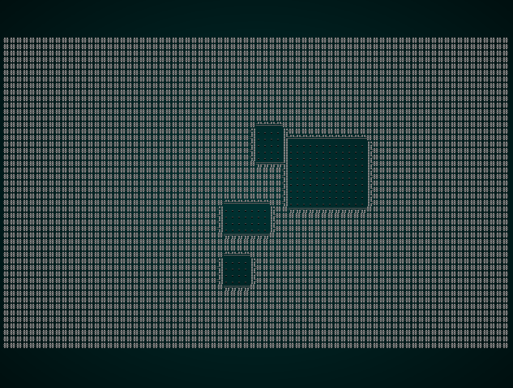
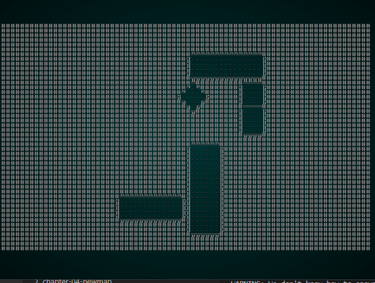
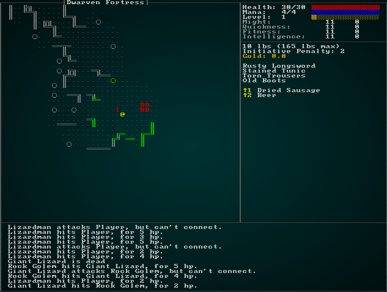
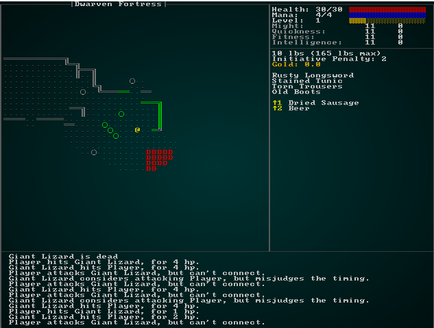

# Enter The Dragon

---

***About this tutorial***

*This tutorial is free and open source, and all code uses the MIT license - so you are free to do with it as you like. My hope is that you will enjoy the tutorial, and make great games!*

*If you enjoy this and would like me to keep writing, please consider supporting [my Patreon](https://www.patreon.com/blackfuture).*

---

Now that we have spells and more advanced item abilities, the player might just be able to survive the first layer of the dwarven fortress we build back in section 4.17! Also, now that NPCs can use special abilities - we should be able to model the evil dragon who (according our design document) occupies the dwarven fortress! This chapter will be all about building the dragon's lair, populating it, and making the dragon a scary - but beatable - foe.

## Building the Lair

According to the design document, level six used to be a mighty Dwarven Fortress - but has been occupied by a nasty black dragon who just loves eating adventurers (and presumably dealt with the dwarves of yore). That implies that what we want is a corridor-based dungeon - Dwarves tend to love that, but eroded and blasted into a dragon's lair.

To assist with this, we'll re-enable watching map generation. In `main.rs`, change the toggle to true:

```rust
const SHOW_MAPGEN_VISUALIZER : bool = true;
```

Next, we'll put together a skeleton to build the level. In `map_builders/mod.rs`, add the following:

```rust
mod dwarf_fort_builder;
use dwarf_fort_builder::*;
```

And update the function at the end:

```rust
pub fn level_builder(new_depth: i32, rng: &mut rltk::RandomNumberGenerator, width: i32, height: i32) -> BuilderChain {
    rltk::console::log(format!("Depth: {}", new_depth));
    match new_depth {
        1 => town_builder(new_depth, rng, width, height),
        2 => forest_builder(new_depth, rng, width, height),
        3 => limestone_cavern_builder(new_depth, rng, width, height),
        4 => limestone_deep_cavern_builder(new_depth, rng, width, height),
        5 => limestone_transition_builder(new_depth, rng, width, height),
        6 => dwarf_fort_builder(new_depth, rng, width, height),
        _ => random_builder(new_depth, rng, width, height)
    }
}
```

Now, we'll make a new file - `map_builders/dwarf_fort.rs` and put a minimal BSP-based room dungeon in it:

```rust
use super::{BuilderChain, XStart, YStart, AreaStartingPosition, RoomSorter, RoomSort,
    CullUnreachable, VoronoiSpawning, BspDungeonBuilder, DistantExit, BspCorridors,
    CorridorSpawner, RoomDrawer};

pub fn dwarf_fort_builder(new_depth: i32, _rng: &mut rltk::RandomNumberGenerator, width: i32, height: i32) -> BuilderChain {
    let mut chain = BuilderChain::new(new_depth, width, height, "Dwarven Fortress");
    chain.start_with(BspDungeonBuilder::new());
    chain.with(RoomSorter::new(RoomSort::CENTRAL));
    chain.with(RoomDrawer::new());
    chain.with(BspCorridors::new());
    chain.with(CorridorSpawner::new());

    chain.with(AreaStartingPosition::new(XStart::LEFT, YStart::TOP));
    chain.with(CullUnreachable::new());
    chain.with(AreaEndingPosition::new(XEnd::RIGHT, YEnd::BOTTOM));
    chain.with(VoronoiSpawning::new());
    chain.with(DistantExit::new());
    chain
}
```

This gets you a very basic room-based dungeon:



That's a good start, but not really what we're looking for. It's obviously man (dwarf!) made, but it doesn't have the "scary dragon lives here" vibe going on. So we'll *also* make a scary looking map with a larger central area, and merge the two together. We want a somewhat sinister feel, so we'll make a custom builder layer to generate a DLA Insectoid map and marge it in:

```rust
pub struct DragonsLair {}

impl MetaMapBuilder for DragonsLair {
    fn build_map(&mut self, rng: &mut rltk::RandomNumberGenerator, build_data : &mut BuilderMap)  {
        self.build(rng, build_data);
    }
}

impl DragonsLair {
    #[allow(dead_code)]
    pub fn new() -> Box<DragonsLair> {
        Box::new(DragonsLair{})
    }

    fn build(&mut self, rng : &mut RandomNumberGenerator, build_data : &mut BuilderMap) {
        build_data.map.depth = 7;
        build_data.take_snapshot();

        let mut builder = BuilderChain::new(6, build_data.width, build_data.height, "New Map");
        builder.start_with(DLABuilder::insectoid());
        builder.build_map(rng);

        // Add the history to our history
        for h in builder.build_data.history.iter() {
            build_data.history.push(h.clone());
        }
        build_data.take_snapshot();

        // Merge the maps
        for (idx, tt) in build_data.map.tiles.iter_mut().enumerate() {
            if *tt == TileType::Wall && builder.build_data.map.tiles[idx] == TileType::Floor {
                *tt = TileType::Floor;
            }
        }
        build_data.take_snapshot();
    }
}
```

And we'll add it into our builder function:

```rust
pub fn dwarf_fort_builder(new_depth: i32, _rng: &mut rltk::RandomNumberGenerator, width: i32, height: i32) -> BuilderChain {
    let mut chain = BuilderChain::new(new_depth, width, height, "Dwarven Fortress");
    chain.start_with(BspDungeonBuilder::new());
    chain.with(RoomSorter::new(RoomSort::CENTRAL));
    chain.with(RoomDrawer::new());
    chain.with(BspCorridors::new());
    chain.with(CorridorSpawner::new());
    chain.with(DragonsLair::new());

    chain.with(AreaStartingPosition::new(XStart::LEFT, YStart::TOP));
    chain.with(CullUnreachable::new());
    chain.with(AreaEndingPosition::new(XEnd::RIGHT, YEnd::BOTTOM));
    chain.with(VoronoiSpawning::new());
    chain.with(DistantExit::new());
    chain
}
```

This gives a much more appropriate map:



You'll notice that we're starting at one diagonal corner, and ending at the other - to make it hard for the player to completely avoid the middle!

## General Spawns

If you `cargo run` right now, you'll notice that the level is mostly full of items - free loot! - and not so many monsters. There's actually two things going on here: we're weighting items and mobs in the same table, and we've added a *lot* of items recently (relative to mobs and props) - and there aren't that many mobs permitted on this level to begin with. As we add more and more items, the issue is only going to get worse! So let's fix it.

Let's start by opening up `raws/rawmaster.rs` and add a new function to determine what type of spawn an entry is:

```rust
pub enum SpawnTableType { Item, Mob, Prop }

pub fn spawn_type_by_name(raws: &RawMaster, key : &str) -> SpawnTableType {
    if raws.item_index.contains_key(key) {
        SpawnTableType::Item
    } else if raws.mob_index.contains_key(key) {
        SpawnTableType::Mob
    } else {
        SpawnTableType::Prop
    }
}
```

We'll add a new `MasterTable` structure to the `random_table.rs` file. This acts as a holder for tables, sorted by item type. We're also going to fix some of the odd layout of the previous version:

```rust
use rltk::RandomNumberGenerator;
use crate::raws::{SpawnTableType, spawn_type_by_name, RawMaster};

pub struct RandomEntry {
    name : String,
    weight : i32
}

impl RandomEntry {
    pub fn new<S:ToString>(name: S, weight: i32) -> RandomEntry {
        RandomEntry{ name: name.to_string(), weight }
    }
}

#[derive(Default)]
pub struct MasterTable {
    items : RandomTable,
    mobs : RandomTable,
    props : RandomTable
}

impl MasterTable {
    pub fn new() -> MasterTable {
        MasterTable{
            items : RandomTable::new(),
            mobs : RandomTable::new(),
            props : RandomTable::new()
        }
    }

    pub fn add<S:ToString>(&mut self, name : S, weight: i32, raws: &RawMaster) {
        match spawn_type_by_name(raws, &name.to_string()) {
            SpawnTableType::Item => self.items.add(name, weight),
            SpawnTableType::Mob => self.mobs.add(name, weight),
            SpawnTableType::Prop => self.props.add(name, weight),
        }
    }

    pub fn roll(&self, rng : &mut RandomNumberGenerator) -> String {
        let roll = rng.roll_dice(1, 4);
        match roll {
            1 => self.items.roll(rng),
            2 => self.props.roll(rng),
            3 => self.mobs.roll(rng),
            _ => "None".to_string()
        }
    }
}

#[derive(Default)]
pub struct RandomTable {
    entries : Vec<RandomEntry>,
    total_weight : i32
}

impl RandomTable {
    pub fn new() -> RandomTable {
        RandomTable{ entries: Vec::new(), total_weight: 0 }
    }

    pub fn add<S:ToString>(&mut self, name : S, weight: i32) {
        if weight > 0 {
            self.total_weight += weight;
            self.entries.push(RandomEntry::new(name.to_string(), weight));
        }
    }

    pub fn roll(&self, rng : &mut RandomNumberGenerator) -> String {
        if self.total_weight == 0 { return "None".to_string(); }
        let mut roll = rng.roll_dice(1, self.total_weight)-1;
        let mut index : usize = 0;

        while roll > 0 {
            if roll < self.entries[index].weight {
                return self.entries[index].name.clone();
            }

            roll -= self.entries[index].weight;
            index += 1;
        }

        "None".to_string()
    }
}
```

As you can see, this divides the available spawns by type - and then rolls for which table to use, before it rolls on the table itself. Now in `rawmaster.rs`, we'll modify the `get_spawn_table_for_depth` function to use the master table:

```rust
pub fn get_spawn_table_for_depth(raws: &RawMaster, depth: i32) -> MasterTable {
    use super::SpawnTableEntry;

    let available_options : Vec<&SpawnTableEntry> = raws.raws.spawn_table
        .iter()
        .filter(|a| depth >= a.min_depth && depth <= a.max_depth)
        .collect();

    let mut rt = MasterTable::new();
    for e in available_options.iter() {
        let mut weight = e.weight;
        if e.add_map_depth_to_weight.is_some() {
            weight += depth;
        }
        rt.add(e.name.clone(), weight, raws);
    }

    rt
}
```

Since we've implemented basically the same interface for the `MasterTable`, we can mostly keep the existing code - and just use the new type instead. In `spawner.rs`, we also need to change one function signature:

```rust
fn room_table(map_depth: i32) -> MasterTable {
    get_spawn_table_for_depth(&RAWS.lock().unwrap(), map_depth)
}
```

If you `cargo run` now, there's a much better balance of monsters and items (on ALL levels!).

## Enter The Dragon

This level is dominated by a black dragon. Checking our D&D rules, these are fearsome *enormous* lizards of incredible physical might, razor-sharp teeth and claws, and a horrible acid breath that burns the flesh from your bones. With an introduction like that, the dragon had better be pretty fearsome! He also needs to be possible to beat, by a player with 5 levels under their belt. Slaying the dragon really should give some pretty amazing rewards, too. It should also be possible to sneak around the dragon if you are careful!

In `spawns.json`, we'll make a start at sketching out what the dragon looks like:

```json
{
    "name" : "Black Dragon",
    "renderable": {
        "glyph" : "D",
        "fg" : "#FF0000",
        "bg" : "#000000",
        "order" : 1
    },
    "blocks_tile" : true,
    "vision_range" : 12,
    "movement" : "static",
    "attributes" : {
        "might" : 13,
        "fitness" : 13
    },
    "skills" : {
        "Melee" : 18,
        "Defense" : 16
    },
    "natural" : {
        "armor_class" : 17,
        "attacks" : [
            { "name" : "bite", "hit_bonus" : 4, "damage" : "1d10+2" },
            { "name" : "left_claw", "hit_bonus" : 2, "damage" : "1d10" },
            { "name" : "right_claw", "hit_bonus" : 2, "damage" : "1d10" }
        ]
    },
    "loot_table" : "Wyrms",
    "faction" : "Wyrm",
    "level" : 6,
    "gold" : "10d6",
    "abilities" : [
        { "spell" : "Acid Breath", "chance" : 0.2, "range" : 8.0, "min_range" : 2.0 }
    ]
},
```

We'll also need to define an *Acid Breath* effect:

```json
{
    "name" : "Acid Breath",
    "mana_cost" : 2,
    "effects" : {
        "ranged" : "6",
        "damage" : "10",
        "area_of_effect" : "3",
        "particle" : "☼;#00FF00;400.0"
    }
}
```

Now we need to actually spawn the dragon. We *don't* want to put the dragon into our spawn table - that would make him appear randomly, and potentially in the wrong level. That ruins his reputation as a boss! We also don't want him to be surrounded by friends - that would be too difficult for the player (and draw focus away from the boss fight).

In `dwarf_fort_builder.rs`, we'll add another layer to the spawn generation:

```rust
pub struct DragonSpawner {}

impl MetaMapBuilder for DragonSpawner {
    fn build_map(&mut self, rng: &mut rltk::RandomNumberGenerator, build_data : &mut BuilderMap)  {
        self.build(rng, build_data);
    }
}

impl DragonSpawner {
    #[allow(dead_code)]
    pub fn new() -> Box<DragonSpawner> {
        Box::new(DragonSpawner{})
    }

    fn build(&mut self, _rng : &mut RandomNumberGenerator, build_data : &mut BuilderMap) {
        // Find a central location that isn't occupied
        let seed_x = build_data.map.width / 2;
        let seed_y = build_data.map.height / 2;
        let mut available_floors : Vec<(usize, f32)> = Vec::new();
        for (idx, tiletype) in build_data.map.tiles.iter().enumerate() {
            if crate::map::tile_walkable(*tiletype) {
                available_floors.push(
                    (
                        idx,
                        rltk::DistanceAlg::PythagorasSquared.distance2d(
                            rltk::Point::new(idx as i32 % build_data.map.width, idx as i32 / build_data.map.width),
                            rltk::Point::new(seed_x, seed_y)
                        )
                    )
                );
            }
        }
        if available_floors.is_empty() {
            panic!("No valid floors to start on");
        }

        available_floors.sort_by(|a,b| a.1.partial_cmp(&b.1).unwrap());

        let start_x = available_floors[0].0 as i32 % build_data.map.width;
        let start_y = available_floors[0].0 as i32 / build_data.map.width;
        let dragon_pt = rltk::Point::new(start_x, start_y);

        // Remove all spawns within 25 tiles of the drake
        let w = build_data.map.width as i32;
        build_data.spawn_list.retain(|spawn| {
            let spawn_pt = rltk::Point::new(
                spawn.0 as i32 % w,
                spawn.0 as i32 / w
            );
            let distance = rltk::DistanceAlg::Pythagoras.distance2d(dragon_pt, spawn_pt);
            distance > 25.0
        });

        // Add the dragon
        let dragon_idx = build_data.map.xy_idx(start_x, start_y);
        build_data.spawn_list.push((dragon_idx, "Black Dragon".to_string()));
    }
}
```

This function is quite straight-forward, and very similar to ones we've written before. We find an open space close to the map's center, and then remove all mob spawns that are less than 25 tiles from the center point (keeping mobs away from the middle). We then spawn the black dragon in the middle.

Let's pop over to `main.rs` and temporarily change one line in the `main` function:

```rust
gs.generate_world_map(6, 0);
```

That starts you on the dragon lair level (remember to change this back when we're done!), so you don't have to navigate the other levels to complete it. Now `cargo run` the project, use the cheat (`backslash` followed by `g`) to enable *God Mode* - and explore the level. It looks pretty good, but the dragon is so powerful that it takes *ages* to slay them - and if you watch the damage log, the player is pretty certain to die! With a bit of practice, though - you can take down the dragon with a combination of spells and item use. So we'll let it stand for now.

Go ahead and change the `main` function back:

```rust
gs.generate_world_map(1, 0);
```

## The Dragon isn't very scary

If you play the game, the dragon is quite lethal. He doesn't, however, have much of a visceral impact - he's just a red `D` symbol that sometimes fires a green cloud at you. That's a decent imagination trigger, and you can even look at his tooltip to know that `D` is for `Dragon` - but it seems like we can do better than that. Also, Dragons are really rather large - and it's a bit odd that a Dragon takes up the same amount of map space as a sheep.

We'll start by adding a new component to represent larger entities:

```rust
#[derive(Component, ConvertSaveload, Clone)]
pub struct TileSize {
    pub x: i32,
    pub y: i32,
}
```

As usual, we won't forget to register it in `main.rs` and `saveload_system.rs`! We'll also allow you to specify a size for entities in the JSON file. In `raws/item_structs.rs`, we'll extend `Renderable` (remember, we re-use it for other types):

```rust
#[derive(Deserialize, Debug)]
pub struct Renderable {
    pub glyph: String,
    pub fg : String,
    pub bg : String,
    pub order: i32,
    pub x_size : Option<i32>,
    pub y_size : Option<i32>
}
```

We've made the new fields *optional* - so our existing code will work. Now in `raws/rawmaster.rs`, find the `spawn_named_mob` function section that adds a `Renderable` component to the entity (it's around line 418 in my source code). If a size was specified, we need to add a `TileSize` component:

```rust
// Renderable
if let Some(renderable) = &mob_template.renderable {
    eb = eb.with(get_renderable_component(renderable));
    if renderable.x_size.is_some() || renderable.y_size.is_some() {
        eb = eb.with(TileSize{ x : renderable.x_size.unwrap_or(1), y : renderable.y_size.unwrap_or(1) });
    }
}
```

Now, we'll go into `spawns.json` and add the extra size to the dragon:

```json
{
    "name" : "Black Dragon",
    "renderable": {
        "glyph" : "D",
        "fg" : "#FF0000",
        "bg" : "#000000",
        "order" : 1,
        "x_size" : 2,
        "y_size" : 2
    },
    ...
```

With the housekeeping taken care of, we need to be able to *render* larger entities to the map. Open up `camera.rs` and we'll amend the rendering like this:

```rust
// Render entities
let positions = ecs.read_storage::<Position>();
let renderables = ecs.read_storage::<Renderable>();
let hidden = ecs.read_storage::<Hidden>();
let map = ecs.fetch::<Map>();
let sizes = ecs.read_storage::<TileSize>();
let entities = ecs.entities();

let mut data = (&positions, &renderables, &entities, !&hidden).join().collect::<Vec<_>>();
data.sort_by(|&a, &b| b.1.render_order.cmp(&a.1.render_order) );
for (pos, render, entity, _hidden) in data.iter() {
    if let Some(size) = sizes.get(*entity) {
        for cy in 0 .. size.y {
            for cx in 0 .. size.x {
                let tile_x = cx + pos.x;
                let tile_y = cy + pos.y;
                let idx = map.xy_idx(tile_x, tile_y);
                if map.visible_tiles[idx] {
                    let entity_screen_x = (cx + pos.x) - min_x;
                    let entity_screen_y = (cy + pos.y) - min_y;
                    if entity_screen_x > 0 && entity_screen_x < map_width && entity_screen_y > 0 && entity_screen_y < map_height {
                        ctx.set(entity_screen_x + 1, entity_screen_y + 1, render.fg, render.bg, render.glyph);
                    }
                }
            }
        }
    } else {
        let idx = map.xy_idx(pos.x, pos.y);
        if map.visible_tiles[idx] {
            let entity_screen_x = pos.x - min_x;
            let entity_screen_y = pos.y - min_y;
            if entity_screen_x > 0 && entity_screen_x < map_width && entity_screen_y > 0 && entity_screen_y < map_height {
                ctx.set(entity_screen_x + 1, entity_screen_y + 1, render.fg, render.bg, render.glyph);
            }
        }
    }
}
```

So how does this work? We check to see if the entity we are rendering has a `TileSize` component, using the `if let` syntax for match assignment. If it does, we render each tile individually for their specified size. If it doesn't, we render exactly as before. Note that we're bounds and visibility checking each tile; that's not the fastest approach, but does guaranty that if you can see *part* of the Dragon, it will be rendered.

If you `cargo run` now, you'll find yourself facing off with a much bigger Dragon:



### Selecting the Dragon

If you actually engage with the dragon in combat, a bunch of problems appear:

* For ranged attacks, you can only target the top-left tile of the dragon. That includes area-of-effect.
* Melee also only affects the Dragon's top-left tile.
* You can actually walk *through* the other dragon tiles.
* The Dragon can clip through terrain and still walk down narrow hallways. He might be good at folding up his wings!

Fortunately, we can solve a *lot* of this with the `map_indexing_system`. The system needs to be expanded to take into account multi-tile entities, and store an entry for *each tile* occupied by the entity:

```rust
use specs::prelude::*;
use super::{Map, Position, BlocksTile, TileSize};

pub struct MapIndexingSystem {}

impl<'a> System<'a> for MapIndexingSystem {
    type SystemData = ( WriteExpect<'a, Map>,
                        ReadStorage<'a, Position>,
                        ReadStorage<'a, BlocksTile>,
                        ReadStorage<'a, TileSize>,
                        Entities<'a>,);

    fn run(&mut self, data : Self::SystemData) {
        let (mut map, position, blockers, sizes, entities) = data;

        map.populate_blocked();
        map.clear_content_index();
        for (entity, position) in (&entities, &position).join() {
            let idx = map.xy_idx(position.x, position.y);

            if let Some(size) = sizes.get(entity) {
                // Multi-tile
                for y in position.y .. position.y + size.y {
                    for x in position.x .. position.x + size.x {
                        if x > 0 && x < map.width-1 && y > 0 && y < map.height-1 {
                            let idx = map.xy_idx(x, y);
                            if blockers.get(entity).is_some() {
                                map.blocked[idx] = true;
                            }

                            // Push the entity to the appropriate index slot. It's a Copy
                            // type, so we don't need to clone it (we want to avoid moving it out of the ECS!)
                            map.tile_content[idx].push(entity);
                        }
                    }
                }
            } else {
                // Single Tile
                if blockers.get(entity).is_some() {
                    map.blocked[idx] = true;
                }

                // Push the entity to the appropriate index slot. It's a Copy
                // type, so we don't need to clone it (we want to avoid moving it out of the ECS!)
                map.tile_content[idx].push(entity);
            }
        }
    }
}
```

This solves several problems: you can now attack any part of the dragon, all of the dragon's body blocks others from moving through it, and ranged targeting works against any of its tiles. Tool-tips however, stubbornly still don't work - you can only get information from the Dragon's top left tile. Fortunately, it's easy to switch the tooltips system to use the `map.tile_content` structure rather than repeatedly iterating positions. It probably performs better, too. In `gui.rs`, replace the start of the function with:

```rust
fn draw_tooltips(ecs: &World, ctx : &mut Rltk) {
    use rltk::to_cp437;
    use rltk::Algorithm2D;

    let (min_x, _max_x, min_y, _max_y) = camera::get_screen_bounds(ecs, ctx);
    let map = ecs.fetch::<Map>();
    let hidden = ecs.read_storage::<Hidden>();
    let attributes = ecs.read_storage::<Attributes>();
    let pools = ecs.read_storage::<Pools>();

    let mouse_pos = ctx.mouse_pos();
    let mut mouse_map_pos = mouse_pos;
    mouse_map_pos.0 += min_x - 1;
    mouse_map_pos.1 += min_y - 1;
    if mouse_pos.0 < 1 || mouse_pos.0 > 49 || mouse_pos.1 < 1 || mouse_pos.1 > 40 {
        return;
    }
    if mouse_map_pos.0 >= map.width-1 || mouse_map_pos.1 >= map.height-1 || mouse_map_pos.0 < 1 || mouse_map_pos.1 < 1
    {
        return;
    }
    if !map.in_bounds(rltk::Point::new(mouse_map_pos.0, mouse_map_pos.1)) { return; }
    let mouse_idx = map.xy_idx(mouse_map_pos.0, mouse_map_pos.1);
    if !map.visible_tiles[mouse_idx] { return; }

    let mut tip_boxes : Vec<Tooltip> = Vec::new();
    for entity in map.tile_content[mouse_idx].iter().filter(|e| hidden.get(**e).is_none()) {
        ...
```

Now you can use tooltips to identify the Dragon, and target any part of it. Just to show how generic the code is, here's a screenshot with a truly enormous drake:



You probably noticed the dragon died really easily. What happened?

* The dragon isn't immune to his own breath weapon, so being in the breath radius inflicted damage upon the poor beast.
* The area-of-effect system meant that the Dragon was hit repeatedly - several tiles were within the radius, so *for each tile* - the Dragon took damage. That's not entirely unrealistic (you'd expect a *fireball* to hit more surface area on a large target), but is definitely an unexpected consequence! Area-of-effect poison or web would stack one status effect per tile on the poor victim, also.

It's an interesting question as to whether we want area-of-effect to hit the caster in general; it makes for a good balance on *Fireball* (and is an old D&D saw - careful not to hit yourself), but it can definitely lead to unexpected effects.

Fortunately, we can cure the first part - attacking yourself - with a simple change to `effects/damage.rs`:

```rust
pub fn inflict_damage(ecs: &mut World, damage: &EffectSpawner, target: Entity) {
    let mut pools = ecs.write_storage::<Pools>();
    if let Some(pool) = pools.get_mut(target) {
        if !pool.god_mode {
            if let Some(creator) = damage.creator {
                if creator == target { 
                    return; 
                }
            }
            ...
```

Area-of-effect spells no longer obliterate the caster, but can still hit friendlies. That's a decent compromise! We'll also add de-duplication to our `effects` system. It's probably a good idea, anyway. Open up `effects/mod.rs` and we'll get started. First, we need to include `HashSet` as an imported type:

```rust
use std::collections::{HashSet, VecDeque};
```

Next, we'll add a `dedupe` field to the `EffectSpawner` type:

```rust
#[derive(Debug)]
pub struct EffectSpawner {
    pub creator : Option<Entity>,
    pub effect_type : EffectType,
    pub targets : Targets,
    dedupe : HashSet<Entity>
}
```

And modify the `add_effect` function to include one:

```rust
pub fn add_effect(creator : Option<Entity>, effect_type: EffectType, targets : Targets) {
    EFFECT_QUEUE
        .lock()
        .unwrap()
        .push_back(EffectSpawner{
            creator,
            effect_type,
            targets,
            dedupe : HashSet::new()
        });
}
```

Next, we need to modify a bunch of locations to make the referenced effect *mutable* - as in, it can be changed:

```rust
pub fn run_effects_queue(ecs : &mut World) {
    loop {
        let effect : Option<EffectSpawner> = EFFECT_QUEUE.lock().unwrap().pop_front();
        if let Some(mut effect) = effect {
            target_applicator(ecs, &mut effect);
        } else {
            break;
        }
    }
}

fn target_applicator(ecs : &mut World, effect : &mut EffectSpawner) {
    if let EffectType::ItemUse{item} = effect.effect_type {
        triggers::item_trigger(effect.creator, item, &effect.targets, ecs);
    } else if let EffectType::SpellUse{spell} = effect.effect_type {
        triggers::spell_trigger(effect.creator, spell, &effect.targets, ecs);
    } else if let EffectType::TriggerFire{trigger} = effect.effect_type {
        triggers::trigger(effect.creator, trigger, &effect.targets, ecs);
    } else {
        match &effect.targets.clone() {
            Targets::Tile{tile_idx} => affect_tile(ecs, effect, *tile_idx),
            Targets::Tiles{tiles} => tiles.iter().for_each(|tile_idx| affect_tile(ecs, effect, *tile_idx)),
            Targets::Single{target} => affect_entity(ecs, effect, *target),
            Targets::TargetList{targets} => targets.iter().for_each(|entity| affect_entity(ecs, effect, *entity)),
        }
    }
}

fn affect_tile(ecs: &mut World, effect: &mut EffectSpawner, tile_idx : i32) {
    ...
}
```

Finally, let's add duplicate prevention to `affect_entity`:

```rust
fn affect_entity(ecs: &mut World, effect: &mut EffectSpawner, target: Entity) {
    if effect.dedupe.contains(&target) { 
        return; 
    }
    effect.dedupe.insert(target);
    match &effect.effect_type {
        EffectType::Damage{..} => damage::inflict_damage(ecs, effect, target),
        EffectType::EntityDeath => damage::death(ecs, effect, target),
        EffectType::Bloodstain{..} => if let Some(pos) = entity_position(ecs, target) { damage::bloodstain(ecs, pos) },
        EffectType::Particle{..} => if let Some(pos) = entity_position(ecs, target) { particles::particle_to_tile(ecs, pos, &effect) },
        EffectType::WellFed => hunger::well_fed(ecs, effect, target),
        EffectType::Healing{..} => damage::heal_damage(ecs, effect, target),
        EffectType::Mana{..} => damage::restore_mana(ecs, effect, target),
        EffectType::Confusion{..} => damage::add_confusion(ecs, effect, target),
        EffectType::TeleportTo{..} => movement::apply_teleport(ecs, effect, target),
        EffectType::AttributeEffect{..} => damage::attribute_effect(ecs, effect, target),
        EffectType::Slow{..} => damage::slow(ecs, effect, target),
        EffectType::DamageOverTime{..} => damage::damage_over_time(ecs, effect, target),
        _ => {}
    }
}
```

If you `cargo run` now, the dragon won't affect themselves at all. If you launch fireballs at the dragon (I modified `spawner.rs` temporarily to start with a *Rod of Fireballs* to test it!), it affects the Dragon just the once. Excellent!

### Letting the dragon attack from any tile

Another issue that you may have noticed is that the dragon can only attack you from its "head" (the top-left tile). I like to think of Dragons as having catlike agility (I tend to think of them being a lot like cats in general!), so that won't work! We'll start out with a helper function. Open up the venerable `rect.rs` (we haven't touched it since the beginning!), and we'll add a new function to it:

```rust
use std::collections::HashSet;
...
pub fn get_all_tiles(&self) -> HashSet<(i32,i32)> {
    let mut result = HashSet::new();
    for y in self.y1 .. self.y2 {
        for x in self.x1 .. self.x2 {
            result.insert((x,y));
        }
    }
    result
}
```

This returns a `HashSet` of tiles that are within the rectangle. Very simple, and hopefully optimizes into quite a fast function! Now we go into `ai/adjacent_ai_system.rs`. We'll modify the system to also query `TileSize`:

```rust
impl<'a> System<'a> for AdjacentAI {
    #[allow(clippy::type_complexity)]
    type SystemData = (
        WriteStorage<'a, MyTurn>,
        ReadStorage<'a, Faction>,
        ReadStorage<'a, Position>,
        ReadExpect<'a, Map>,
        WriteStorage<'a, WantsToMelee>,
        Entities<'a>,
        ReadExpect<'a, Entity>,
        ReadStorage<'a, TileSize>
    );

    fn run(&mut self, data : Self::SystemData) {
        let (mut turns, factions, positions, map, mut want_melee, entities, player, sizes) = data;
```

Then we'll check to see if there's an irregular size (and use the old code if there isn't) - and do some rectangle math to find the adjacent tiles otherwise:

```rust
fn run(&mut self, data : Self::SystemData) {
    let (mut turns, factions, positions, map, mut want_melee, entities, player, sizes) = data;

    let mut turn_done : Vec<Entity> = Vec::new();
    for (entity, _turn, my_faction, pos) in (&entities, &turns, &factions, &positions).join() {
        if entity != *player {
            let mut reactions : Vec<(Entity, Reaction)> = Vec::new();
            let idx = map.xy_idx(pos.x, pos.y);
            let w = map.width;
            let h = map.height;

            if let Some(size) = sizes.get(entity) {
                use crate::rect::Rect;
                let mob_rect = Rect::new(pos.x, pos.y, size.x, size.y).get_all_tiles();
                let parent_rect = Rect::new(pos.x -1, pos.y -1, size.x+2, size.y + 2);
                parent_rect.get_all_tiles().iter().filter(|t| !mob_rect.contains(t)).for_each(|t| {
                    if t.0 > 0 && t.0 < w-1 && t.1 > 0 && t.1 < h-1 {
                        let target_idx = map.xy_idx(t.0, t.1);
                        evaluate(target_idx, &map, &factions, &my_faction.name, &mut reactions);
                    }
                });
            } else {

                // Add possible reactions to adjacents for each direction
                if pos.x > 0 { evaluate(idx-1, &map, &factions, &my_faction.name, &mut reactions); }
                if pos.x < w-1 { evaluate(idx+1, &map, &factions, &my_faction.name, &mut reactions); }
                if pos.y > 0 { evaluate(idx-w as usize, &map, &factions, &my_faction.name, &mut reactions); }
                if pos.y < h-1 { evaluate(idx+w as usize, &map, &factions, &my_faction.name, &mut reactions); }
                if pos.y > 0 && pos.x > 0 { evaluate((idx-w as usize)-1, &map, &factions, &my_faction.name, &mut reactions); }
                if pos.y > 0 && pos.x < w-1 { evaluate((idx-w as usize)+1, &map, &factions, &my_faction.name, &mut reactions); }
                if pos.y < h-1 && pos.x > 0 { evaluate((idx+w as usize)-1, &map, &factions, &my_faction.name, &mut reactions); }
                if pos.y < h-1 && pos.x < w-1 { evaluate((idx+w as usize)+1, &map, &factions, &my_faction.name, &mut reactions); }

            }
            ...
```

Walking through this:

1. We start with the same setup as before.
2. We use `if let` to obtain a tile size if there is one.
3. We setup a `mob_rect` that is equal to the position and dimensions of the mob, and obtain the *Set* of tiles it covers.
4. We setup a `parent_rect` that is one tile larger in all directions.
5. We call `parent_rect.get_all_tiles()` and transform it into an iterator. Then we `filter` it to only include tiles that aren't in `mob_rect` - so we have all adjacent tiles.
6. Then we use `for_each` on the resultant set of tiles, make sure that the tiles are within the map, and add them to call `evaluate` on them.

If you `cargo run` now, the dragon can attack you as you walk around it.

### Clipping The Dragon's Wings

Another issue is that Dragon can follow you down narrow corridors, even though it doesn't fit. Path-finding for large entities is often problematic in games; Dwarf Fortress ended up with a nasty completely separate system for wagons! Let's hope we can do better than that. Our movement system largely relies upon the `blocked` structure inside maps, so we need a way to add blockage information for entities larger than one tile. In `map/mod.rs`, we add the following:

```rust
pub fn populate_blocked_multi(&mut self, width : i32, height : i32) {
    self.populate_blocked();
    for y in 1 .. self.height-1 {
        for x in 1 .. self.width - 1 {
            let idx = self.xy_idx(x, y);
            if !self.blocked[idx] {
                for cy in 0..height {
                    for cx in 0..width {
                        let tx = x + cx;
                        let ty = y + cy;
                        if tx < self.width-1 && ty < self.height-1 {
                            let tidx = self.xy_idx(tx, ty);
                            if self.blocked[tidx] {
                                self.blocked[idx] = true;
                            }
                        } else {
                            self.blocked[idx] = true;
                        }
                    }
                }
            }
        }
    }
}
```

I'd caution against that many nested loops, but at least it has escape clauses! So what does this do:

1. It starts by building the `blocked` information for all tiles, using the existing `populate_blocked` function.
2. It then iterates the map, and if a tile *isn't* blocked:
    1. It iterates each tile within the size of the entity, added to the current coordinate.
    2. If any of those tiles are blocked, it sets the tile to be examined as blocked also.

So the net result is that you get a map of places the large entity can stand. Now we need to plug that into `ai/chase_ai_system.rs`:

```rust
...
turn_done.push(entity);
let target_pos = targets[&entity];
let path;

if let Some(size) = sizes.get(entity) {
    let mut map_copy = map.clone();
    map_copy.populate_blocked_multi(size.x, size.y);
    path = rltk::a_star_search(
        map_copy.xy_idx(pos.x, pos.y) as i32,
        map_copy.xy_idx(target_pos.0, target_pos.1) as i32,
        &mut map_copy
    );
} else {
    path = rltk::a_star_search(
        map.xy_idx(pos.x, pos.y) as i32,
        map.xy_idx(target_pos.0, target_pos.1) as i32,
        &mut *map
    );
}
if path.success && path.steps.len()>1 && path.steps.len()<15 {
    ...
```

So we've changed the value of `path` to be the same code as before for 1x1 entities, but to take a *clone* of the map for large entities and use the new `populate_blocked_multi` function to add blocks appropriate for a creature of this size.

If you `cargo run` now, you can escape from the dragon by taking narrow passageways.

## So why this much work?

So why *did* we spend so much time making irregular sized objects work so generically, when we could have special cased the black dragon? It's so that we can make more big things later. :-)

A word of caution: it's always tempting to do this for *everything*, but remember the `YAGNI` rule: `You Ain't Gonna Need It`. If you don't really have a good reason to implement a feature, hold off until you either need it or it makes sense! (Fun aside: I first heard of this rule by a fellow with the username of `TANSAAFL`. Took me ages to realize he "there ain't no such thing as a free lunch.")

## Worrying about balance / Playtesting

Now for the *hard* part. It's a good time to play through levels 1 through 6 a few times, see how far you get, and see what problems you encounter. Here's a few things I noticed:

* I ran into *deer* being far more annoying than intended, so for now I've removed them from the spawn table.
* *Rats* can't actually damage you! Changing their might to 7 gives a minimal penalty, but makes them occasionally do some damage.
* Healing potions need to spawn a lot more frequently! I changed their spawn weight to 15. I encountered several occasions in which I really needed an emergency heal.
* The game is a little too hard; you are really at the mercy of the Random Number Generator. You can be doing really well, and a bandit with good dice rolls slaughters you mercilessly - even after you've managed to get some armor on and leveled up! I decided to do two things to rectify this:

I gave the player 20 hit points per level instead of 10, by changing `player_hp_per_level` and `player_hp_at_level` in `gamessytem.rs`:

```rust
pub fn player_hp_per_level(fitness: i32) -> i32 {
    15 + attr_bonus(fitness)
}

pub fn player_hp_at_level(fitness:i32, level:i32) -> i32 {
    15 + (player_hp_per_level(fitness) * level)
}
```

In `effects/damage.rs` where we handle leveling up, I gave the player some more reason to level up! A random attribute and all skills improve. So leveling up makes you faster, stronger and more damaging. It also makes you harder to hit. Here's the code:

```rust
if xp_gain != 0 || gold_gain != 0.0 {
    let mut log = ecs.fetch_mut::<GameLog>();
    let mut player_stats = pools.get_mut(source).unwrap();
    let mut player_attributes = attributes.get_mut(source).unwrap();
    player_stats.xp += xp_gain;
    player_stats.gold += gold_gain;
    if player_stats.xp >= player_stats.level * 1000 {
        // We've gone up a level!
        player_stats.level += 1;
        log.entries.push(format!("Congratulations, you are now level {}", player_stats.level));

        // Improve a random attribute
        let mut rng = ecs.fetch_mut::<rltk::RandomNumberGenerator>();
        let attr_to_boost = rng.roll_dice(1, 4);
        match attr_to_boost {
            1 => {
                player_attributes.might.base += 1;
                log.entries.push("You feel stronger!".to_string());
            }
            2 => {
                player_attributes.fitness.base += 1;
                log.entries.push("You feel healthier!".to_string());
            }
            3 => {
                player_attributes.quickness.base += 1;
                log.entries.push("You feel quicker!".to_string());
            }
            _ => {
                player_attributes.intelligence.base += 1;
                log.entries.push("You feel smarter!".to_string());
            }
        }

        // Improve all skills
        let mut skills = ecs.write_storage::<Skills>();
        let player_skills = skills.get_mut(*ecs.fetch::<Entity>()).unwrap();
        for sk in player_skills.skills.iter_mut() {
            *sk.1 += 1;
        }

        ecs.write_storage::<EquipmentChanged>()
            .insert(
                *ecs.fetch::<Entity>(),
                EquipmentChanged{})
            .expect("Insert Failed");

        player_stats.hit_points.max = player_hp_at_level(
            player_attributes.fitness.base + player_attributes.fitness.modifiers,
            player_stats.level
        );
        player_stats.hit_points.current = player_stats.hit_points.max;
        player_stats.mana.max = mana_at_level(
            player_attributes.intelligence.base + player_attributes.intelligence.modifiers,
            player_stats.level
        );
        player_stats.mana.current = player_stats.mana.max;

        let player_pos = ecs.fetch::<rltk::Point>();
        let map = ecs.fetch::<Map>();
        for i in 0..10 {
            if player_pos.y - i > 1 {
                add_effect(None, 
                    EffectType::Particle{ 
                        glyph: rltk::to_cp437('░'),
                        fg : rltk::RGB::named(rltk::GOLD),
                        bg : rltk::RGB::named(rltk::BLACK),
                        lifespan: 400.0
                    }, 
                    Targets::Tile{ tile_idx : map.xy_idx(player_pos.x, player_pos.y - i) as i32 }
                );
            }
        }
    }
}
```

Playing again after these changes made for a much easier game - and one in which I felt like I could progress (but still faced a real risk of death). The dragon still beat me, but it was a *very* close fight - and I nearly won! So I played a few more times, and was victorious once I found a strategy of spell and item use that rewarded me. That's great - that's the type of play a roguelike should have!

I also found that in the earlier levels, I would die if I didn't pay attention - but would generally be victorious if I put my mind to it.

## Wrap Up

So in this chapter, we've built a dragon's lair - and populated it with a nasty dragon. He's just about beatable, but you'll really have to put your mind to it.

...

**The source code for this chapter may be found [here](https://github.com/thebracket/rustrogueliketutorial/tree/master/chapter-67-dragon)**


[Run this chapter's example with web assembly, in your browser (WebGL2 required)](https://bfnightly.bracketproductions.com/rustbook/wasm/chapter-67-dragon)
---

Copyright (C) 2019, Herbert Wolverson.

---