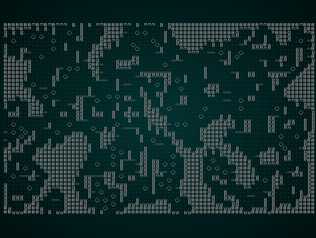
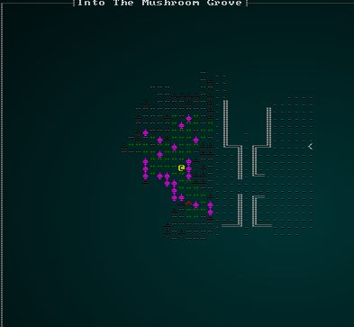
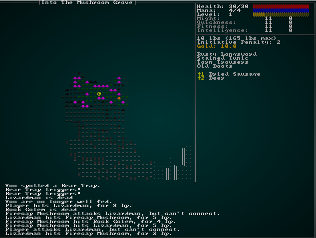
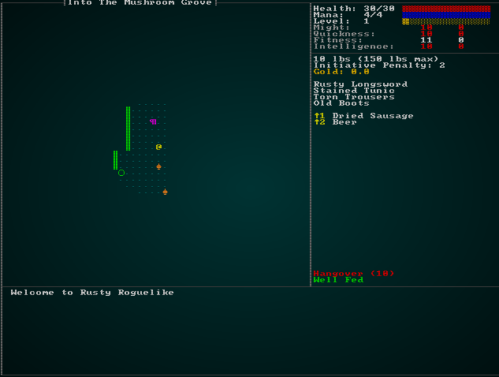

# Mushroom Forest

---

***About this tutorial***

*This tutorial is free and open source, and all code uses the MIT license - so you are free to do with it as you like. My hope is that you will enjoy the tutorial, and make great games!*

*If you enjoy this and would like me to keep writing, please consider supporting [my Patreon](https://www.patreon.com/blackfuture).*

---

The design document says that once you've conquered the dragon in the fortress, you proceed into a vast mushroom forest. This is an interesting transition: we've done forests before, but we want to make the mushroom forest different from the *Into The Woods* level. On this level, we also want to transition between the fortress and the forest - so we'll need another layered approach.

We'll start by adding a new function to the level builder in `map_builder/mod.rs`:

```rust
mod mushroom_forest;
use mushroom_forest::*;
...
pub fn level_builder(new_depth: i32, rng: &mut rltk::RandomNumberGenerator, width: i32, height: i32) -> BuilderChain {
    println!("Depth: {}", new_depth);
    match new_depth {
        1 => town_builder(new_depth, rng, width, height),
        2 => forest_builder(new_depth, rng, width, height),
        3 => limestone_cavern_builder(new_depth, rng, width, height),
        4 => limestone_deep_cavern_builder(new_depth, rng, width, height),
        5 => limestone_transition_builder(new_depth, rng, width, height),
        6 => dwarf_fort_builder(new_depth, rng, width, height),
        7 => mushroom_entrance(new_depth, rng, width, height),
        _ => random_builder(new_depth, rng, width, height)
    }
}
```

Now we'll make a new file, `map_builder/mushroom_forest.rs`:

```rust
use super::{BuilderChain, XStart, YStart, AreaStartingPosition, 
    CullUnreachable, VoronoiSpawning,
    AreaEndingPosition, XEnd, YEnd, CellularAutomataBuilder, PrefabBuilder, WaveformCollapseBuilder};
use crate::map_builders::prefab_builder::prefab_sections::UNDERGROUND_FORT;

pub fn mushroom_entrance(new_depth: i32, _rng: &mut rltk::RandomNumberGenerator, width: i32, height: i32) -> BuilderChain {
    let mut chain = BuilderChain::new(new_depth, width, height, "Into The Mushroom Grove");
    chain.start_with(CellularAutomataBuilder::new());
    chain.with(WaveformCollapseBuilder::new());
    chain.with(AreaStartingPosition::new(XStart::CENTER, YStart::CENTER));
    chain.with(CullUnreachable::new());
    chain.with(AreaStartingPosition::new(XStart::RIGHT, YStart::CENTER));
    chain.with(AreaEndingPosition::new(XEnd::LEFT, YEnd::CENTER));
    chain.with(VoronoiSpawning::new());
    chain.with(PrefabBuilder::sectional(UNDERGROUND_FORT));
    chain
}
```

This should look familiar: we're using the cellular automata again - but mixing it up with some wave function collapse, and then adding a fort edge on top of it. This gives a pretty decent start for a forest template, albeit one that needs visual work (and a population):



## Theming the mushroom grove

We've used split themes before (for entering the fortress), so it shouldn't be a surprise that we'll be opening up `map/themes.rs` and adding another one! In this case, we want the fortress theme to apply to the fortifications on the East of the map, and a new mushroom grove look to apply to the rest.

We can update `tile_glyph` to look like this:

```rust
pub fn tile_glyph(idx: usize, map : &Map) -> (u8, RGB, RGB) {
    let (glyph, mut fg, mut bg) = match map.depth {
        7 => {
            let x = idx as i32 % map.width;
            if x > map.width-16 {
                get_tile_glyph_default(idx, map)
            } else {
                get_mushroom_glyph(idx, map)
            }
        }
        5 => {
            let x = idx as i32 % map.width;
            if x < map.width/2 {
                get_limestone_cavern_glyph(idx, map)
            } else {
                get_tile_glyph_default(idx, map)
            }
        }
        4 => get_limestone_cavern_glyph(idx, map),
        3 => get_limestone_cavern_glyph(idx, map),
        2 => get_forest_glyph(idx, map),
        _ => get_tile_glyph_default(idx, map)
    };
    ...
```

The `get_mushroom_glyph` function is basically the same as `get_forest_glyph`, but changed to look more like a mushroom grove from the game Dwarf Fortress (yay, Plump Helmets!):

```rust
fn get_mushroom_glyph(idx:usize, map: &Map) -> (u8, RGB, RGB) {
    let glyph;
    let fg;
    let bg = RGB::from_f32(0., 0., 0.);

    match map.tiles[idx] {
        TileType::Wall => { glyph = rltk::to_cp437('♠'); fg = RGB::from_f32(1.0, 0.0, 1.0); }
        TileType::Bridge => { glyph = rltk::to_cp437('.'); fg = RGB::named(rltk::GREEN); }
        TileType::Road => { glyph = rltk::to_cp437('≡'); fg = RGB::named(rltk::CHOCOLATE); }
        TileType::Grass => { glyph = rltk::to_cp437('"'); fg = RGB::named(rltk::GREEN); }
        TileType::ShallowWater => { glyph = rltk::to_cp437('~'); fg = RGB::named(rltk::CYAN); }
        TileType::DeepWater => { glyph = rltk::to_cp437('~'); fg = RGB::named(rltk::BLUE); }
        TileType::Gravel => { glyph = rltk::to_cp437(';'); fg = RGB::from_f32(0.5, 0.5, 0.5); }
        TileType::DownStairs => { glyph = rltk::to_cp437('>'); fg = RGB::from_f32(0., 1.0, 1.0); }
        TileType::UpStairs => { glyph = rltk::to_cp437('<'); fg = RGB::from_f32(0., 1.0, 1.0); }
        _ => { glyph = rltk::to_cp437('"'); fg = RGB::from_f32(0.0, 0.6, 0.0); }
    }

    (glyph, fg, bg)
}
```

This gives a slightly trippy but quite nice world view:



## Populating the mushroom groves

I started by editing `spawns.json` to remove `dragon wyrmlings` from this level; the lizardmen and giant lizards can stay, but we're switching gears away from lizardmen now! What *do* you expect to find in a mystical, subterranean mushroom forest? Since they don't exist in real life, that's a bit of an open-ended question! I'd like to focus on a few natural hazards, a new type of monster, and a bit more in the way of loot. The player just finished a major boss fight, so it's a good idea to lower the gear a bit and give them some time to recuperate.

### Natural Hazards

Let's start by adding some hazards. Mushrooms frequently give off spores, and it's a common theme for the spores to have interesting effects on the player (and anyone else who triggers them!). It's actually an interesting question as to whether these are props or NPCs; they react to spotting a player in an NPC-like fashion, but don't really move or do much other than set off effects - more like a prop (but unlike a prop, you don't have to stand on them for them to take effect).

#### Exploding Fire-cap Mushrooms

Let's start by adding an exploding mushroom. In `spawns.json` (in the monsters section):

```json
{
    "name" : "Firecap Mushroom",
    "renderable": {
        "glyph" : "♠",
        "fg" : "#FFAA50",
        "bg" : "#000000",
        "order" : 1
    },
    "blocks_tile" : true,
    "vision_range" : 3,
    "movement" : "static",
    "attributes" : {},
    "faction" : "Fungi",
    "level" : 1,
    "abilities" : [
        { "spell" : "Explode", "chance" : 1.0, "range" : 3.0, "min_range" : 0.0 }
    ]
}
```

So we've given it a nice mushroom glyph, and made it orange (which seems appropriate). It has a short visual range, since I've never pictured fungi as having the best eyesight (or even eyes, really). It's in a faction `Fungi`, which doesn't exist yet, and has a spell ability to `Explode`, which also doesn't exist yet! 

Let's go ahead and add it to the faction table:

```json
{ "name" : "Fungi", "responses": { "Default" : "attack", "Fungi" : "ignore" }}
```

We'll also make a start at defining the `Explode` power. In the spells section of `spawns.json`:

```json
{
    "name" : "Explode",
    "mana_cost" : 1,
    "effects" : {
        "ranged" : "3",
        "damage" : "20",
        "area_of_effect" : "3",
        "particle" : "▒;#FFAA50;400.0",
        "single_activation" : "1"
    }
}
```

Almost all of this is stuff we've already built into the effects system: it has a range of 3, an area of effect and `single_activation`. We've not used this tag for anything other than trap props before, but it gets the message across - the mushroom can explode just the once, and will be destroyed in the process. We already support attaching the tag in `raws/rawmaster.rs` - so nothing to do there. We do need to extend the effects system to allow the self-destruct sequence to operate. In `effects/triggers.rs`, we need to extend `spell_trigger` to support self-destruction:

```rust
pub fn spell_trigger(creator : Option<Entity>, spell: Entity, targets : &Targets, ecs: &mut World) {
    let mut self_destruct = false;
    if let Some(template) = ecs.read_storage::<SpellTemplate>().get(spell) {
        let mut pools = ecs.write_storage::<Pools>();
        if let Some(caster) = creator {
            if let Some(pool) = pools.get_mut(caster) {
                if template.mana_cost <= pool.mana.current {
                    pool.mana.current -= template.mana_cost;
                }
            }
        }
        if let Some(_destruct) = ecs.read_storage::<SingleActivation>().get(spell) {
            self_destruct = true;
        }
    }
    event_trigger(creator, spell, targets, ecs);
    if self_destruct && creator.is_some() {
        ecs.entities().delete(creator.unwrap()).expect("Unable to delete owner");
    }
}
```

So this is pretty much the previous code, but with an addition check to see if the spell deletes the caster - and if it does, it removes the caster immediately after the explosion goes off.

We should also make them spawn on the mushroom levels. In the spawn table section of `spawns.json`:

```json
{ "name" : "Firecap Mushroom", "weight" : 10, "min_depth" : 7, "max_depth" : 9 },
```

If you `cargo run` now, the mushrooms detonate when you approach:



There's a slight problem that the lizardmen and the fungi are fighting, which doesn't make a lot of sense. So we'll update their factions to prevent this:

```json
{ "name" : "Wyrm", "responses": { "Default" : "attack", "Wyrm" : "ignore", "Fungi" : "ignore" }},
{ "name" : "Fungi", "responses": { "Default" : "attack", "Fungi" : "ignore", "Wyrm" : "ignore" }}
```

It would also be really nice if the fungi exploded on death; if you have some together, this could give a really fun chain reaction (and could be extended to exploding barrels on another level!). We'll add an annotation to the mushroom:

```json
{
    "name" : "Firecap Mushroom",
    "renderable": {
        "glyph" : "♠",
        "fg" : "#FFAA50",
        "bg" : "#000000",
        "order" : 1
    },
    "blocks_tile" : true,
    "vision_range" : 3,
    "movement" : "static",
    "attributes" : {},
    "faction" : "Fungi",
    "level" : 1
    "abilities" : [
        { "spell" : "Explode", "chance" : 1.0, "range" : 3.0, "min_range" : 0.0 }
    ],
    "on_death" : [
        { "spell" : "Explode", "chance" : 1.0, "range" : 0.0, "min_range" : 0.0 }
    ]
}
```

So, now we have an `on_death` trigger to implement. We'll start in `raws/mob_structs.rs` in order to support this JSON tag. We're re-using the spell tag, even though range is meaningless - just to help keep things consistent. So we just need to add the one line to the raw structure:

```rust
#[derive(Deserialize, Debug)]
pub struct Mob {
    pub name : String,
    pub renderable : Option<Renderable>,
    pub blocks_tile : bool,
    pub vision_range : i32,
    pub movement : String,
    pub quips : Option<Vec<String>>,
    pub attributes : MobAttributes,
    pub skills : Option<HashMap<String, i32>>,
    pub level : Option<i32>,
    pub hp : Option<i32>,
    pub mana : Option<i32>,
    pub equipped : Option<Vec<String>>,
    pub natural : Option<MobNatural>,
    pub loot_table : Option<String>,
    pub light : Option<MobLight>,
    pub faction : Option<String>,
    pub gold : Option<String>,
    pub vendor : Option<Vec<String>>,
    pub abilities : Option<Vec<MobAbility>>,
    pub on_death : Option<Vec<MobAbility>>
}
```

We'll also need a new component in which to store `on_death` event triggers. We can re-use some of the `SpecialAbilities` code to keep it simple. In `components.rs` (and registered in `main.rs` and `saveload_system.rs`):

```rust
#[derive(Component, Debug, Serialize, Deserialize, Clone)]
pub struct OnDeath {
    pub abilities : Vec<SpecialAbility>
}
```

Then we add some code to `raws/rawmaster.rs`'s `spawn_named_mob` to instantiate it. It's just like the special abilities code - so place it next to it:

```rust
if let Some(ability_list) = &mob_template.on_death {
    let mut a = OnDeath{ abilities : Vec::new() };
    for ability in ability_list.iter() {
        a.abilities.push(
            SpecialAbility{
                chance : ability.chance,
                spell : ability.spell.clone(),
                range : ability.range,
                min_range : ability.min_range
            }
        );
    }
    eb = eb.with(a);
}
```

Finally, we need to make `on_death` events actually fire. If you add this to the end of the `delete_the_dead` function in `damage_system.rs` (right before the final entity deletion), you get a nice staggered effect with a boom right *after* a mushroom is slain:

```rust
// Fire death events
use crate::effects::*;
use crate::Map;
use crate::components::{OnDeath, AreaOfEffect};
for victim in dead.iter() {
    let death_effects = ecs.read_storage::<OnDeath>();
    if let Some(death_effect) = death_effects.get(*victim) {
        let mut rng = ecs.fetch_mut::<rltk::RandomNumberGenerator>();
        for effect in death_effect.abilities.iter() {
            if rng.roll_dice(1,100) <= (effect.chance * 100.0) as i32 {
                let map = ecs.fetch::<Map>();
                if let Some(pos) = ecs.read_storage::<Position>().get(*victim) {
                    let spell_entity = crate::raws::find_spell_entity(ecs, &effect.spell).unwrap();
                    let tile_idx = map.xy_idx(pos.x, pos.y);
                    let target = 
                        if let Some(aoe) = ecs.read_storage::<AreaOfEffect>().get(spell_entity) {
                            Targets::Tiles { tiles : aoe_tiles(&map, rltk::Point::new(pos.x, pos.y), aoe.radius) }
                        } else {
                            Targets::Tile{ tile_idx : tile_idx as i32 }
                        };
                    add_effect(
                        None,
                        EffectType::SpellUse{ spell: crate::raws::find_spell_entity( ecs, &effect.spell ).unwrap() },
                        target
                    );
                }
            }
        }
    }
}
```

There's one other problem evident; when the mushroom explodes, the explosion is centered on the *player* not the mushroom. Let's make a new component to represent overriding spell targeting to always target self. In `components.rs` (and, as always, registered in `main.rs` and `saveload_system.rs`):

```rust
#[derive(Component, Debug, Serialize, Deserialize, Clone)]
pub struct AlwaysTargetsSelf {}
```

We'll add it into the `effects` macro in `raws/rawmaster.rs`:

```rust
"target_self" => $eb = $eb.with( AlwaysTargetsSelf{} ),
```

We should apply it to the `Explode` ability in `spawns.json`:

```json
{
    "name" : "Explode",
    "mana_cost" : 1,
    "effects" : {
        "ranged" : "3",
        "damage" : "20",
        "area_of_effect" : "3",
        "particle" : "▒;#FFAA50;400.0",
        "single_activation" : "1",
        "target_self" : "1"
    }
}
```

Lastly, we need to modify the `spell_trigger` in `effects/triggers.rs` to be able to modify the targeting choice:

```rust
pub fn spell_trigger(creator : Option<Entity>, spell: Entity, targets : &Targets, ecs: &mut World) {
    let mut targeting = targets.clone();
    let mut self_destruct = false;
    if let Some(template) = ecs.read_storage::<SpellTemplate>().get(spell) {
        let mut pools = ecs.write_storage::<Pools>();
        if let Some(caster) = creator {
            if let Some(pool) = pools.get_mut(caster) {
                if template.mana_cost <= pool.mana.current {
                    pool.mana.current -= template.mana_cost;
                }
            }

            // Handle self-targeting override
            if ecs.read_storage::<AlwaysTargetsSelf>().get(spell).is_some() {
                if let Some(pos) = ecs.read_storage::<Position>().get(caster) {
                    let map = ecs.fetch::<Map>();
                    targeting = if let Some(aoe) = ecs.read_storage::<AreaOfEffect>().get(spell) {
                        Targets::Tiles { tiles : aoe_tiles(&map, rltk::Point::new(pos.x, pos.y), aoe.radius) }
                    } else {
                        Targets::Tile{ tile_idx : map.xy_idx(pos.x, pos.y) as i32 }
                    }
                }
            }
        }
        if let Some(_destruct) = ecs.read_storage::<SingleActivation>().get(spell) {
            self_destruct = true;
        }
    }
    event_trigger(creator, spell, &targeting, ecs);
    if self_destruct && creator.is_some() {
        ecs.entities().delete(creator.unwrap()).expect("Unable to delete owner");
    }
}
```

To demonstrate the monster we just created, I upped the mushroom's spawn density to 300 - and changed the explosion radius to 6. Here goes:



Changing the settings back is probably a good idea! It's really tempting to make a level of chained-mushrooms for a domino-like explosion rippling throughout the level at this point - but that's probably more fun to watch than to play!

#### Confusion Shrooms

Another obvious effect is mushrooms whose spores sow confusion. We have everything we need to implement them!

In the monsters section of `spawns.json`, we define the basic mushroom:

```json
{
    "name" : "Sporecap Mushroom",
    "renderable": {
        "glyph" : "♠",
        "fg" : "#00AAFF",
        "bg" : "#000000",
        "order" : 1
    },
    "blocks_tile" : true,
    "vision_range" : 3,
    "movement" : "static",
    "attributes" : {},
    "faction" : "Fungi",
    "level" : 1,
    "abilities" : [
        { "spell" : "ConfusionCloud", "chance" : 1.0, "range" : 3.0, "min_range" : 0.0 }
    ],
    "on_death" : [
        { "spell" : "ConfusionCloud", "chance" : 1.0, "range" : 0.0, "min_range" : 0.0 }
    ]
}
```

In the spawn weights, we make them common in the fungal grove:

```json
{ "name" : "Sporecap Mushroom", "weight" : 10, "min_depth" : 7, "max_depth" : 9 },
```

And we can define the spell as follows:

```json
{
    "name" : "ConfusionCloud",
    "mana_cost" : 1,
    "effects" : {
        "ranged" : "3",
        "confusion" : "4",
        "area_of_effect" : "3",
        "particle" : "?;#FFFF00;400.0",
        "single_activation" : "1",
        "target_self" : "1"
    }
}
```

No additional code required! If you `cargo run` now, you'll get blue mushrooms exploding in confusing goodness:


#### Poison gas mushrooms

We'll add one more mushroom type: a death-cap mushroom that spreads poisonous spores! Once again, we have everything we need for this. We define the mushroom as a monster in `spawns.json`:

```json
{
    "name" : "Deathcap Mushroom",
    "renderable": {
        "glyph" : "♠",
        "fg" : "#55FF55",
        "bg" : "#000000",
        "order" : 1
    },
    "blocks_tile" : true,
    "vision_range" : 3,
    "movement" : "static",
    "attributes" : {},
    "faction" : "Fungi",
    "level" : 1,
    "abilities" : [
        { "spell" : "PoisonCloud", "chance" : 1.0, "range" : 3.0, "min_range" : 0.0 }
    ],
    "on_death" : [
        { "spell" : "PoisonCloud", "chance" : 1.0, "range" : 0.0, "min_range" : 0.0 }
    ]
}
```

Make it spawn:

```json
{ "name" : "Deathcap Mushroom", "weight" : 7, "min_depth" : 7, "max_depth" : 9 },
```

And define the spell effect:

```json
{
    "name" : "PoisonCloud",
    "mana_cost" : 1,
    "effects" : {
        "ranged" : "3",
        "damage_over_time" : "4",
        "area_of_effect" : "3",
        "particle" : "*;#00FF00;400.0",
        "single_activation" : "1",
        "target_self" : "1"
    }
}
```

And voila - you have poisonous mushroom spore clouds.

### Fungus grove monsters

We don't *just* want to cover the player in spores. There's some lizardmen to worry about, but it would make sense for a few monsters to also dwell in the groves. A couple sprang to mind: fungus men, with whom you can do battle - and eat their corpses, and a beast that roams around chewing on fungus (or players) all day long. We could also introduce "spore zombies" - people whose brain have been overtaken by the fungus and seek only to slay its foes (there are some disturbing parasites that take over their hosts in similar manners, so it's not as unrealistic as it sounds!).

#### Fungus Men

Let's start with the fungus people. In `spawns.json`, we can define them as a regular class of foe:

```json
{
    "name" : "Fungus Man",
    "renderable": {
        "glyph" : "f",
        "fg" : "#FF0000",
        "bg" : "#000000",
        "order" : 1
    },
    "blocks_tile" : true,
    "vision_range" : 8,
    "movement" : "random_waypoint",
    "attributes" : {},
    "faction" : "Fungi",
    "gold" : "2d8",
    "level" : 4,
    "loot_table" : "Animal"
}
```

We'll also make them spawn:

```json
{ "name" : "Fungus Man", "weight" : 8, "min_depth" : 7, "max_depth" : 9 },
```

This adds in fungus people, who drop meat. You probably don't want to think too much about the flavor.

#### Spore Zombies

Again, we'll start with a basic mob definition. We can't have *everything* doing funky things - that'd overwhelm the player:

```json
{
    "name" : "Spore Zombie",
    "renderable": {
        "glyph" : "z",
        "fg" : "#FF0000",
        "bg" : "#000000",
        "order" : 1
    },
    "blocks_tile" : true,
    "vision_range" : 8,
    "movement" : "random_waypoint",
    "attributes" : {},
    "faction" : "Fungi",
    "gold" : "2d8",
    "level" : 5
}
```

We also need to make them spawn:

```json
{ "name" : "Spore Zombie", "weight" : 7, "min_depth" : 7, "max_depth" : 9 },
```

#### Fungus Beasts

We'll pattern the beasts after other animals, but put them in the "Fungi" faction:

```json
{
    "name" : "Fungal Beast",
    "renderable": {
        "glyph" : "F",
        "fg" : "#995555",
        "bg" : "#000000",
        "order" : 1
    },
    "blocks_tile" : true,
    "vision_range" : 6,
    "movement" : "random",
    "attributes" : {},
    "natural" : {
        "armor_class" : 11,
        "attacks" : [
            { "name" : "bite", "hit_bonus" : 0, "damage" : "1d4" }
        ]
    },
    "faction" : "Fungi"
}
```

We also need to make them spawn:

```json
{ "name" : "Fungal Beast", "weight" : 9, "min_depth" : 7, "max_depth" : 9 },
```

If you `cargo run` now, you have a level teeming with life and things that go boom!

### A handful of items

As a reward for being perpetually gassed, gnawed on by zombies and chewed up by beats, it's about time to introduce some new items to the grove! Let's consider a few new items the player may encounter.

A simple boost is a better longsword:

```json
{
    "name" : "Longsword +2",
    "renderable": {
        "glyph" : "/",
        "fg" : "#FFAAFF",
        "bg" : "#000000",
        "order" : 2
    },
    "weapon" : {
        "range" : "melee",
        "attribute" : "might",
        "base_damage" : "1d8+2",
        "hit_bonus" : 2
    },
    "weight_lbs" : 1.0,
    "base_value" : 100.0,
    "initiative_penalty" : 0,
    "vendor_category" : "weapon",
    "magic" : { "class" : "common", "naming" : "Unidentified Longsword" }
},

{ "name" : "Longsword +2", "weight" : 1, "min_depth" : 7, "max_depth" : 100 },
```

Another easy one is a magical breastplate:

```json
{
    "name" : "Breastplate +1",
    "renderable": {
        "glyph" : "[",
        "fg" : "#00FF00",
        "bg" : "#000000",
        "order" : 2
    },
    "wearable" : {
        "slot" : "Torso",
        "armor_class" : 4.0
    },
    "weight_lbs" : 20.0,
    "base_value" : 200.0,
    "initiative_penalty" : 1.0,
    "vendor_category" : "armor",
    "magic" : { "class" : "common", "naming" : "Unidentified Breastplate" }
},

{ "name" : "Breastplate +1", "weight" : 1, "min_depth" : 7, "max_depth" : 100 },
```

```json
{
    "name" : "Tower Shield +1",
    "renderable": {
        "glyph" : "[",
        "fg" : "#00FFFF",
        "bg" : "#000000",
        "order" : 2
    },
    "wearable" : {
        "slot" : "Shield",
        "armor_class" : 3.0
    },
    "weight_lbs" : 45.0,
    "base_value" : 30.0,
    "initiative_penalty" : 0.0,
    "vendor_category" : "armor"
},

{ "name" : "Tower Shield +1", "weight" : 1, "min_depth" : 7, "max_depth" : 100 },
```

We should also consider filling some of the unused equipment slots.
: Head, Torso, Legs, Feet, Hands


## Wrap Up

...

**The source code for this chapter may be found [here](https://github.com/thebracket/rustrogueliketutorial/tree/master/chapter-68-mushrooms)**


[Run this chapter's example with web assembly, in your browser (WebGL2 required)](http://bfnightly.bracketproductions.com/rustbook/wasm/chapter-68-mushrooms)
---

Copyright (C) 2019, Herbert Wolverson.

---