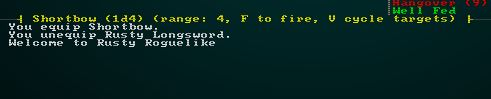
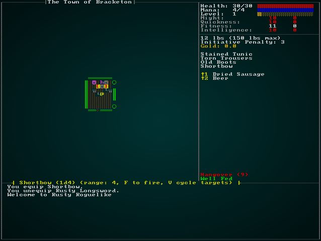
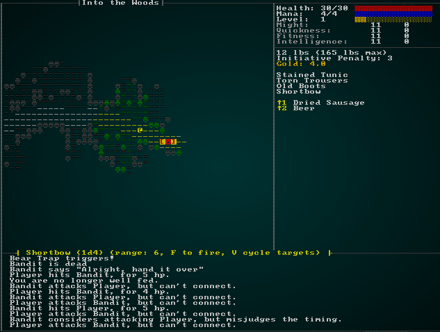

# Missiles and Ranged Attacks

---

***About this tutorial***

*This tutorial is free and open source, and all code uses the MIT license - so you are free to do with it as you like. My hope is that you will enjoy the tutorial, and make great games!*

*If you enjoy this and would like me to keep writing, please consider supporting [my Patreon](https://www.patreon.com/blackfuture).*

---

When you read fiction involving dark elves, they typically sneakily fire missile weapons from the darkness. That's actually why they were included in this tutorial book: they give a great excuse to branch into the wonderful world of ranged combat. We already have a bit of that: spell effects can happen at range, but the targeting system is a little clunky - and not at all ergonomic for an archery duel. So in this chapter, we're going to introduce ranged weaponry and make the dark elves a little scarier. We're also going to try and make the particle effects for missiles better, so the player can see what's going on.

## Introducing ranged weapons

We're going to cheat a little and not worry about ammunition; some games count every arrow, and for a ranged-combat character there can be a heavy emphasis on keeping one's quiver full. We're going to focus on the ranged weaponry side, and assume that ammunition is plentiful; that's not the most realistic option, but it keeps things manageable!

### Defining the Shortbow

Let's start by opening up `spawns.json` and making a an entry for a shortbow:

```json
{
    "name" : "Shortbow",
    "renderable": {
        "glyph" : ")",
        "fg" : "#FFAAAA",
        "bg" : "#000000",
        "order" : 2
    },
    "weapon" : {
        "range" : "4",
        "attribute" : "Quickness",
        "base_damage" : "1d4",
        "hit_bonus" : 0
    },
    "weight_lbs" : 2.0,
    "base_value" : 5.0,
    "initiative_penalty" : 1,
    "vendor_category" : "weapon"
},
```

You'll notice that this is very similar to the dagger entry; in fact, I copy/pasted it, and then changed "range" from "melee" to "4"! I also removed the templated magic section for now, to keep things straightforward. Now we open up `components.rs`, and take a look at `MeleeWeapon` - with a view to making a ranged weapon. Unfortunately, we see a design mistake! The damage is all inside the weapon, so if we make a generic `RangedWeapon` component, we'll be repeating ourselves. It's generally a good idea not to type the same thing twice, so we'll change the name of `MeleeWeapon` to `Weapon` - and add in a `range` field. If it doesn't have a range (it's an `Option`), then it's melee-only:

```rust
#[derive(Component, Serialize, Deserialize, Clone)]
pub struct Weapon {
    pub range : Option<i32>,
    pub attribute : WeaponAttribute,
    pub damage_n_dice : i32,
    pub damage_die_type : i32,
    pub damage_bonus : i32,
    pub hit_bonus : i32,
    pub proc_chance : Option<f32>,
    pub proc_target : Option<String>,
}
```

You'll need to open up `main.rs`, `saveload_system.rs` and change `MeleeWeapon` to `Weapon`. A few other bits of code just broke, too. In `melee_combat_system.rs`, simply replace all instances of `MeleeWeapon` with `Weapon`. You'll also need to add `range` to the dummy weapon created to handle natural attacks:

```rust
let mut weapon_info = Weapon{
    range: None,
    attribute : WeaponAttribute::Might,
    hit_bonus : 0,
    damage_n_dice : 1,
    damage_die_type : 4,
    damage_bonus : 0,
    proc_chance : None,
    proc_target : None
};
```

To make it compile and run as before, you can change one section of `raws/rawmaster.rs`:

```rust
let mut wpn = Weapon{
    range : None,
    attribute : WeaponAttribute::Might,
    damage_n_dice : n_dice,
    damage_die_type : die_type,
    damage_bonus : bonus,
    hit_bonus : weapon.hit_bonus,
    proc_chance : weapon.proc_chance,
    proc_target : weapon.proc_target.clone()
};
```

That's enough to get the old code running once again, and has a significant virtue: we've kept the weapon code basically the same, so all of the "trait" and "magic template" systems still work. There's one significant limitation, though: shortbows are still a melee weapon!

We can open up `raws/rawmaster.rs` and change the same piece of code to instantiate a `range` if there is one. That's a good start - at least the game has the option of knowing that it's a ranged weapon!

```rust
let mut wpn = Weapon{
    range : if weapon.range == "melee" { None } else { Some(weapon.range.parse::<i32>().expect("Not a number")) },
    attribute : WeaponAttribute::Might,
    damage_n_dice : n_dice,
    damage_die_type : die_type,
    damage_bonus : bonus,
    hit_bonus : weapon.hit_bonus,
    proc_chance : weapon.proc_chance,
    proc_target : weapon.proc_target.clone()
};
```

## Letting the player shoot things

So now we know that a weapon *is* a ranged weapon, which is a great start. Let's go into `spawner.rs` and start the player with a short bow. We probably won't keep it, but it gives a good basis on which to build:

```rust
spawn_named_entity(&RAWS.lock().unwrap(), ecs, "Rusty Longsword", SpawnType::Equipped{by : player});
spawn_named_entity(&RAWS.lock().unwrap(), ecs, "Dried Sausage", SpawnType::Carried{by : player} );
spawn_named_entity(&RAWS.lock().unwrap(), ecs, "Beer", SpawnType::Carried{by : player});
spawn_named_entity(&RAWS.lock().unwrap(), ecs, "Stained Tunic", SpawnType::Equipped{by : player});
spawn_named_entity(&RAWS.lock().unwrap(), ecs, "Torn Trousers", SpawnType::Equipped{by : player});
spawn_named_entity(&RAWS.lock().unwrap(), ecs, "Old Boots", SpawnType::Equipped{by : player});
spawn_named_entity(&RAWS.lock().unwrap(), ecs, "Shortbow", SpawnType::Carried{by : player});
```

We've started with it in the backpack, so the player still has to make a conscious decision to switch to using ranged weaponry (we've done enough melee work that shooting things shouldn't be the default!) - but this saves us from having to run around looking for one while we test the system we're building. Go ahead and `cargo run` to quickly test that you can equip your new bow. You can't shoot anything yet, but you can at least equip it (and be confident that we didn't break too much with the component change).

The hardest part of ranged weaponry is that it has a *target*: something you are shooting at. We want target selection to be easy, lest the player not figure out how to shoot things! Let's start by showing the player information about the weapon they have equipped - and if it has a range, we'll include that. In `gui.rs`, find the part where we iterate through equipped items and display them (it's around line 162 in my version). We'll extend it a bit:

```rust
// Equipped
let mut y = 13;
let entities = ecs.entities();
let equipped = ecs.read_storage::<Equipped>();
let weapon = ecs.read_storage::<Weapon>();
for (entity, equipped_by) in (&entities, &equipped).join() {
    if equipped_by.owner == *player_entity {
        let name = get_item_display_name(ecs, entity);
        ctx.print_color(50, y, get_item_color(ecs, entity), black, &name);
        y += 1;

        if let Some(weapon) = weapon.get(entity) {
            let mut weapon_info = if weapon.damage_bonus < 0 {
                format!("┤ {} ({}d{}{})", &name, weapon.damage_n_dice, weapon.damage_die_type, weapon.damage_bonus)
            } else if weapon.damage_bonus == 0 {
                format!("┤ {} ({}d{})", &name, weapon.damage_n_dice, weapon.damage_die_type)
            } else {
                format!("┤ {} ({}d{}+{})", &name, weapon.damage_n_dice, weapon.damage_die_type, weapon.damage_bonus)
            };

            if let Some(range) = weapon.range {
                weapon_info += &format!(" (range: {}, F to fire)", range);
            }
            weapon_info += " ├";
            ctx.print_color(3, 45, yellow, black, &weapon_info);
        }
    }
}
```

This is a good start, because now we're telling the user that they have a ranged weapon (and generally showing immediate results of a weapon upgrade is good!):



So, now to let the player easily target enemies! We'll start by making a `Target` component. In `components.rs` (and, as usual, registered in `main.rs` and `saveload_system.rs`):

```rust
#[derive(Component, Debug, Serialize, Deserialize, Clone)]
pub struct Target {}
```

The idea is simple: we'll attach a `Target` to whomever we are currently targeting. We should highlight the target on the map; so we go over to `camera.rs` and add the following to the entity render code:

```rust
// Render entities
let positions = ecs.read_storage::<Position>();
let renderables = ecs.read_storage::<Renderable>();
let hidden = ecs.read_storage::<Hidden>();
let map = ecs.fetch::<Map>();
let sizes = ecs.read_storage::<TileSize>();
let entities = ecs.entities();
let targets = ecs.read_storage::<Target>();

let mut data = (&positions, &renderables, &entities, !&hidden).join().collect::<Vec<_>>();
data.sort_by(|&a, &b| b.1.render_order.cmp(&a.1.render_order) );
for (pos, render, entity, _hidden) in data.iter() {
    if let Some(size) = sizes.get(*entity) {
        for cy in 0 .. size.y {
            for cx in 0 .. size.x {
                let tile_x = cx + pos.x;
                let tile_y = cy + pos.y;
                let idx = map.xy_idx(tile_x, tile_y);
                if map.visible_tiles[idx] {
                    let entity_screen_x = (cx + pos.x) - min_x;
                    let entity_screen_y = (cy + pos.y) - min_y;
                    if entity_screen_x > 0 && entity_screen_x < map_width && entity_screen_y > 0 && entity_screen_y < map_height {
                        ctx.set(entity_screen_x + 1, entity_screen_y + 1, render.fg, render.bg, render.glyph);
                    }
                }
            }
        }
    } else {
        let idx = map.xy_idx(pos.x, pos.y);
        if map.visible_tiles[idx] {
            let entity_screen_x = pos.x - min_x;
            let entity_screen_y = pos.y - min_y;
            if entity_screen_x > 0 && entity_screen_x < map_width && entity_screen_y > 0 && entity_screen_y < map_height {
                ctx.set(entity_screen_x + 1, entity_screen_y + 1, render.fg, render.bg, render.glyph);
            }
        }
    }

    if targets.get(*entity).is_some() {
        let entity_screen_x = pos.x - min_x;
        let entity_screen_y = pos.y - min_y;
        ctx.set(entity_screen_x , entity_screen_y + 1, rltk::RGB::named(rltk::RED), rltk::RGB::named(rltk::YELLOW), rltk::to_cp437('['));
        ctx.set(entity_screen_x +2, entity_screen_y + 1, rltk::RGB::named(rltk::RED), rltk::RGB::named(rltk::YELLOW), rltk::to_cp437(']'));
    }
}
```

This code is checking each entity we render to see if it is being targeted, and renders brightly colored brackets around it if it is. We should also provide some hints as to how to use the targeting system, so over in `gui.rs` we amend our ranged weapon code as follows:

```rust
if let Some(weapon) = weapon.get(entity) {
    let mut weapon_info = if weapon.damage_bonus < 0 {
        format!("┤ {} ({}d{}{})", &name, weapon.damage_n_dice, weapon.damage_die_type, weapon.damage_bonus)
    } else if weapon.damage_bonus == 0 {
        format!("┤ {} ({}d{})", &name, weapon.damage_n_dice, weapon.damage_die_type)
    } else {
        format!("┤ {} ({}d{}+{})", &name, weapon.damage_n_dice, weapon.damage_die_type, weapon.damage_bonus)
    };

    if let Some(range) = weapon.range {
        weapon_info += &format!(" (range: {}, F to fire, V cycle targets)", range);
    }
    weapon_info += " ├";
    ctx.print_color(3, 45, yellow, black, &weapon_info);
}
```

We're telling the user to press `V` to change targets, so we need to implement that functionality! Before we do that, we need to come up with a default targeting scheme. Since we're worrying about the *player's* target, we'll head to `player.rs` and add some new functions. The first determines what entities are eligible for targeting:

```rust
fn get_player_target_list(ecs : &mut World) -> Vec<(f32,Entity)> {
    let mut possible_targets : Vec<(f32,Entity)> = Vec::new();
    let viewsheds = ecs.read_storage::<Viewshed>();
    let player_entity = ecs.fetch::<Entity>();
    let equipped = ecs.read_storage::<Equipped>();
    let weapon = ecs.read_storage::<Weapon>();
    let map = ecs.fetch::<Map>();
    let positions = ecs.read_storage::<Position>();
    let factions = ecs.read_storage::<Faction>();
    for (equipped, weapon) in (&equipped, &weapon).join() {
        if equipped.owner == *player_entity && weapon.range.is_some() {
            let range = weapon.range.unwrap();

            if let Some(vs) = viewsheds.get(*player_entity) {
                let player_pos = positions.get(*player_entity).unwrap();
                for tile_point in vs.visible_tiles.iter() {
                    let tile_idx = map.xy_idx(tile_point.x, tile_point.y);
                    let distance_to_target = rltk::DistanceAlg::Pythagoras.distance2d(*tile_point, rltk::Point::new(player_pos.x, player_pos.y));
                    if distance_to_target < range as f32 {
                        for possible_target in map.tile_content[tile_idx].iter() {
                            if *possible_target != *player_entity && factions.get(*possible_target).is_some() {
                                possible_targets.push((distance_to_target, *possible_target));
                            }
                        }
                    }
                }
            }
        }
    }

    possible_targets.sort_by(|a,b| a.0.partial_cmp(&b.0).unwrap());
    possible_targets
}
```

This is a slightly convoluted function, so let's step through it:

1. We make an empty results list, containing targetable entities and their distance from the player.
2. We iterate through equipped weapons, looking to see if the player has a ranged weapon.
3. If they do, we note down its range.
4. Then we look at their viewshed, and check that each tile is in range of the weapon.
5. If it is in range, we look at entities in that tile via the `tile_content` system. If the entity is, in fact, a valid target (they have a `Faction` membership), we add them to the possible targets list.
6. We sort the possible targets list by range.

Now we need to select a new target when the player moves. We'll pick the closest, on the basis that you are more likely to target an immediate threat. The following function accomplishes this:

```rust
pub fn end_turn_targeting(ecs: &mut World) {
    let possible_targets = get_player_target_list(ecs);
    let mut targets = ecs.write_storage::<Target>();
    targets.clear();

    if !possible_targets.is_empty() {
        targets.insert(possible_targets[0].1, Target{}).expect("Insert fail");
    }
}
```

We want the *start* of a new turn to call this function. So we head over into `main.rs`, and amend the game loop to catch the start of new turns and call this function:

```rust
RunState::Ticking => {
    let mut should_change_target = false;
    while newrunstate == RunState::Ticking {
        self.run_systems();
        self.ecs.maintain();
        match *self.ecs.fetch::<RunState>() {
            RunState::AwaitingInput => {
                newrunstate = RunState::AwaitingInput;
                should_change_target = true;
            }
            RunState::MagicMapReveal{ .. } => newrunstate = RunState::MagicMapReveal{ row: 0 },
            RunState::TownPortal => newrunstate = RunState::TownPortal,
            RunState::TeleportingToOtherLevel{ x, y, depth } => newrunstate = RunState::TeleportingToOtherLevel{ x, y, depth },
            RunState::ShowRemoveCurse => newrunstate = RunState::ShowRemoveCurse,
            RunState::ShowIdentify => newrunstate = RunState::ShowIdentify,
            _ => newrunstate = RunState::Ticking
        }
    }
    if should_change_target {
        player::end_turn_targeting(&mut self.ecs);
    }
}
```

Now we'll return to `player.rs` and add another function to cycle targets:

```rust
fn cycle_target(ecs: &mut World) {
    let possible_targets = get_player_target_list(ecs);
    let mut targets = ecs.write_storage::<Target>();
    let entities = ecs.entities();
    let mut current_target : Option<Entity> = None;

    for (e,_t) in (&entities, &targets).join() {
        current_target = Some(e);
    }

    targets.clear();
    if let Some(current_target) = current_target {
        if !possible_targets.len() > 1 {
            let mut index = 0;
            for (i, target) in possible_targets.iter().enumerate() {
                if target.1 == current_target {
                    index = i;
                }
            }

            if index > possible_targets.len()-2 {
                targets.insert(possible_targets[0].1, Target{});
            } else {
                targets.insert(possible_targets[index+1].1, Target{});
            }
        }
    }
}
```

This is a long function, but I left it long for clarity. It finds the index of the current target in the current targeting list. If there are multiple targets, it selects the next one in the list. If it was at the end of the list, it moves back to the beginning. Now we need to capture presses of `V` and call this function. In the `player_input` function, we'll add a new section:

```rust
// Ranged
VirtualKeyCode::V => {
    cycle_target(&mut gs.ecs);
    return RunState::AwaitingInput;
}
```

If you `cargo run` now, you can equip your bow and start targeting:



### Shooting Things

We have a well-established pattern for combat: flag the action with a `WantsToMelee` component, and then it is picked up in the `MeleeCombatSystem`. We've used a similar pattern for wanting to approach, use skills or items - so it just makes sense that we'll do the same again for wanting to shoot. In `components.rs` (and registered in `main.rs` and `saveload_system.rs`), we'll add the following:

```rust
#[derive(Component, Debug, ConvertSaveload, Clone)]
pub struct WantsToShoot {
    pub target : Entity
}
```

We'll also want to make a new system, and store it in `ranged_combat_system.rs`. It's basically a cut-and-paste of the `melee_combat_system`, but looking for `WantsToShoot` instead:

```rust
extern crate specs;
use specs::prelude::*;
use super::{Attributes, Skills, WantsToShoot, Name, gamelog::GameLog,
    HungerClock, HungerState, Pools, skill_bonus,
    Skill, Equipped, Weapon, EquipmentSlot, WeaponAttribute, Wearable, NaturalAttackDefense,
    effects::*, Map, Position};
use rltk::{to_cp437, RGB, Point};

pub struct RangedCombatSystem {}

impl<'a> System<'a> for RangedCombatSystem {
    #[allow(clippy::type_complexity)]
    type SystemData = ( Entities<'a>,
                        WriteExpect<'a, GameLog>,
                        WriteStorage<'a, WantsToShoot>,
                        ReadStorage<'a, Name>,
                        ReadStorage<'a, Attributes>,
                        ReadStorage<'a, Skills>,
                        ReadStorage<'a, HungerClock>,
                        ReadStorage<'a, Pools>,
                        WriteExpect<'a, rltk::RandomNumberGenerator>,
                        ReadStorage<'a, Equipped>,
                        ReadStorage<'a, Weapon>,
                        ReadStorage<'a, Wearable>,
                        ReadStorage<'a, NaturalAttackDefense>,
                        ReadStorage<'a, Position>,
                        ReadExpect<'a, Map>
                      );

    fn run(&mut self, data : Self::SystemData) {
        let (entities, mut log, mut wants_shoot, names, attributes, skills,
            hunger_clock, pools, mut rng, equipped_items, weapon, wearables, natural,
            positions, map) = data;

        for (entity, wants_shoot, name, attacker_attributes, attacker_skills, attacker_pools) in (&entities, &wants_shoot, &names, &attributes, &skills, &pools).join() {
            // Are the attacker and defender alive? Only attack if they are
            let target_pools = pools.get(wants_shoot.target).unwrap();
            let target_attributes = attributes.get(wants_shoot.target).unwrap();
            let target_skills = skills.get(wants_shoot.target).unwrap();
            if attacker_pools.hit_points.current > 0 && target_pools.hit_points.current > 0 {
                let target_name = names.get(wants_shoot.target).unwrap();

                // Fire projectile effect
                let apos = positions.get(entity).unwrap();
                let dpos = positions.get(wants_shoot.target).unwrap();
                add_effect(
                    None, 
                    EffectType::ParticleProjectile{ 
                        glyph: to_cp437('*'),
                        fg : RGB::named(rltk::CYAN), 
                        bg : RGB::named(rltk::BLACK), 
                        lifespan : 300.0, 
                        speed: 50.0, 
                        path: rltk::line2d(
                            rltk::LineAlg::Bresenham, 
                            Point::new(apos.x, apos.y), 
                            Point::new(dpos.x, dpos.y)
                        )
                     }, 
                    Targets::Tile{tile_idx : map.xy_idx(apos.x, apos.y) as i32}
                );

                // Define the basic unarmed attack - overridden by wielding check below if a weapon is equipped
                let mut weapon_info = Weapon{
                    range: None,
                    attribute : WeaponAttribute::Might,
                    hit_bonus : 0,
                    damage_n_dice : 1,
                    damage_die_type : 4,
                    damage_bonus : 0,
                    proc_chance : None,
                    proc_target : None
                };

                if let Some(nat) = natural.get(entity) {
                    if !nat.attacks.is_empty() {
                        let attack_index = if nat.attacks.len()==1 { 0 } else { rng.roll_dice(1, nat.attacks.len() as i32) as usize -1 };
                        weapon_info.hit_bonus = nat.attacks[attack_index].hit_bonus;
                        weapon_info.damage_n_dice = nat.attacks[attack_index].damage_n_dice;
                        weapon_info.damage_die_type = nat.attacks[attack_index].damage_die_type;
                        weapon_info.damage_bonus = nat.attacks[attack_index].damage_bonus;
                    }
                }

                let mut weapon_entity : Option<Entity> = None;
                for (weaponentity,wielded,melee) in (&entities, &equipped_items, &weapon).join() {
                    if wielded.owner == entity && wielded.slot == EquipmentSlot::Melee {
                        weapon_info = melee.clone();
                        weapon_entity = Some(weaponentity);
                    }
                }

                let natural_roll = rng.roll_dice(1, 20);
                let attribute_hit_bonus = if weapon_info.attribute == WeaponAttribute::Might
                    { attacker_attributes.might.bonus }
                    else { attacker_attributes.quickness.bonus};
                let skill_hit_bonus = skill_bonus(Skill::Melee, &*attacker_skills);
                let weapon_hit_bonus = weapon_info.hit_bonus;
                let mut status_hit_bonus = 0;
                if let Some(hc) = hunger_clock.get(entity) { // Well-Fed grants +1
                    if hc.state == HungerState::WellFed {
                        status_hit_bonus += 1;
                    }
                }
                let modified_hit_roll = natural_roll + attribute_hit_bonus + skill_hit_bonus
                    + weapon_hit_bonus + status_hit_bonus;
                //println!("Natural roll: {}", natural_roll);
                //println!("Modified hit roll: {}", modified_hit_roll);

                let mut armor_item_bonus_f = 0.0;
                for (wielded,armor) in (&equipped_items, &wearables).join() {
                    if wielded.owner == wants_shoot.target {
                        armor_item_bonus_f += armor.armor_class;
                    }
                }
                let base_armor_class = match natural.get(wants_shoot.target) {
                    None => 10,
                    Some(nat) => nat.armor_class.unwrap_or(10)
                };
                let armor_quickness_bonus = target_attributes.quickness.bonus;
                let armor_skill_bonus = skill_bonus(Skill::Defense, &*target_skills);
                let armor_item_bonus = armor_item_bonus_f as i32;
                let armor_class = base_armor_class + armor_quickness_bonus + armor_skill_bonus
                    + armor_item_bonus;

                //println!("Armor class: {}", armor_class);
                if natural_roll != 1 && (natural_roll == 20 || modified_hit_roll > armor_class) {
                    // Target hit! Until we support weapons, we're going with 1d4
                    let base_damage = rng.roll_dice(weapon_info.damage_n_dice, weapon_info.damage_die_type);
                    let attr_damage_bonus = attacker_attributes.might.bonus;
                    let skill_damage_bonus = skill_bonus(Skill::Melee, &*attacker_skills);
                    let weapon_damage_bonus = weapon_info.damage_bonus;

                    let damage = i32::max(0, base_damage + attr_damage_bonus + 
                        skill_damage_bonus + weapon_damage_bonus);

                    /*println!("Damage: {} + {}attr + {}skill + {}weapon = {}",
                        base_damage, attr_damage_bonus, skill_damage_bonus,
                        weapon_damage_bonus, damage
                    );*/
                    add_effect(
                        Some(entity),
                        EffectType::Damage{ amount: damage },
                        Targets::Single{ target: wants_shoot.target }
                    );
                    log.entries.insert(0, format!("{} hits {}, for {} hp.", &name.name, &target_name.name, damage));

                    // Proc effects
                    if let Some(chance) = &weapon_info.proc_chance {
                        let roll = rng.roll_dice(1, 100);
                        //println!("Roll {}, Chance {}", roll, chance);
                        if roll <= (chance * 100.0) as i32 {
                            //println!("Proc!");
                            let effect_target = if weapon_info.proc_target.unwrap() == "Self" {
                                Targets::Single{ target: entity }
                            } else {
                                Targets::Single { target : wants_shoot.target }
                            };
                            add_effect(
                                Some(entity),
                                EffectType::ItemUse{ item: weapon_entity.unwrap() },
                                effect_target
                            )
                        }
                    }

                } else  if natural_roll == 1 {
                    // Natural 1 miss
                    log.entries.insert(0, format!("{} considers attacking {}, but misjudges the timing.", name.name, target_name.name));
                    add_effect(
                        None,
                        EffectType::Particle{ glyph: rltk::to_cp437('‼'), fg: rltk::RGB::named(rltk::BLUE), bg : rltk::RGB::named(rltk::BLACK), lifespan: 200.0 },
                        Targets::Single{ target: wants_shoot.target }
                    );
                } else {
                    // Miss
                    log.entries.insert(0, format!("{} attacks {}, but can't connect.", name.name, target_name.name));
                    add_effect(
                        None,
                        EffectType::Particle{ glyph: rltk::to_cp437('‼'), fg: rltk::RGB::named(rltk::CYAN), bg : rltk::RGB::named(rltk::BLACK), lifespan: 200.0 },
                        Targets::Single{ target: wants_shoot.target }
                    );
                }
            }
        }

        wants_shoot.clear();
    }
}
```

Most of this is straight out of the previous system. You'll also want to add in into `run_systems` in `main.rs`; right after melee is a good spot:

```rust
let mut ranged = RangedCombatSystem{};
ranged.run_now(&self.ecs);
```

The eagle-eyed reader will have noticed that we also snuck in an extra `add_effect` call, this time invoking an `EffectType::ParticleProjectile`. This isn't essential, but displaying a flying projectile really brings out the flavor in a ranged battle. So far, our particles have been stationary, so lets add in some "juice" to them!

In `components.rs`, we'll update the `ParticleLifetime` component to include an optional animation:

```rust
#[derive(Serialize, Deserialize, Clone)]
pub struct ParticleAnimation {
    pub step_time : f32,
    pub path : Vec<Point>,
    pub current_step : usize,
    pub timer : f32
}

#[derive(Component, Serialize, Deserialize, Clone)]
pub struct ParticleLifetime {
    pub lifetime_ms : f32,
    pub animation : Option<ParticleAnimation>
}
```

This adds a `step_time` - how long should the particle dwell on each step. A `path` - a vector of `Point`s listing each step along the way. `current_step` and `timer` will be used to track the projectile's progress.

You'll want to go into `particle_system.rs` and modify the particle spawning to include `None` by default:

```rust
particles.insert(p, ParticleLifetime{ lifetime_ms: new_particle.lifetime, animation: None }).expect("Unable to insert lifetime");
```

While we're here, we'll rename the culling function (`cull_dead_particles`) to `update_particles` - better reflecting what it does. We'll also add in some logic to see if there is animation, and have it update its position along the animation track:

```rust
pub fn update_particles(ecs : &mut World, ctx : &Rltk) {
    let mut dead_particles : Vec<Entity> = Vec::new();
    {
        // Age out particles
        let mut particles = ecs.write_storage::<ParticleLifetime>();
        let entities = ecs.entities();
        let map = ecs.fetch::<Map>();
        for (entity, mut particle) in (&entities, &mut particles).join() {
            if let Some(animation) = &mut particle.animation {
                animation.timer += ctx.frame_time_ms;
                if animation.timer > animation.step_time && animation.current_step < animation.path.len()-2 {
                    animation.current_step += 1;

                    if let Some(pos) = ecs.write_storage::<Position>().get_mut(entity) {
                        pos.x = animation.path[animation.current_step].x;
                        pos.y = animation.path[animation.current_step].y;
                    }
                }
            }

            particle.lifetime_ms -= ctx.frame_time_ms;
            if particle.lifetime_ms < 0.0 {
                dead_particles.push(entity);
            }
        }
    }
    for dead in dead_particles.iter() {
        ecs.delete_entity(*dead).expect("Particle will not die");
    }
}
```

Open up `main.rs` again, and search for `cull_dead_particles` and replace it with `update_particles`.

That's enough to actually animate the particles and still have them vanish when done, but we need to update the `Effects` system to spawn the new type of particle. In `effects/mod.rs`, we'll extend the `EffectType` enum to include the new one:

```rust
#[derive(Debug)]
pub enum EffectType { 
    ...
    ParticleProjectile { glyph: u8, fg : rltk::RGB, bg: rltk::RGB, lifespan: f32, speed: f32, path: Vec<Point> },
    ...
```

We also have to update `affect_tile` in the same file:

```rust
fn affect_tile(ecs: &mut World, effect: &mut EffectSpawner, tile_idx : i32) {
    if tile_effect_hits_entities(&effect.effect_type) {
        let content = ecs.fetch::<Map>().tile_content[tile_idx as usize].clone();
        content.iter().for_each(|entity| affect_entity(ecs, effect, *entity));
    }

    match &effect.effect_type {
        EffectType::Bloodstain => damage::bloodstain(ecs, tile_idx),
        EffectType::Particle{..} => particles::particle_to_tile(ecs, tile_idx, &effect),
        EffectType::ParticleProjectile{..} => particles::projectile(ecs, tile_idx, &effect),
        _ => {}
    }
}
```

This calls into `particles::projectile`, so open up `effects/particles.rs` and we'll add the function:

```rust
pub fn projectile(ecs: &mut World, tile_idx : i32, effect: &EffectSpawner) {
    if let EffectType::ParticleProjectile{ glyph, fg, bg, 
        lifespan, speed, path } = &effect.effect_type 
    {
        let map = ecs.fetch::<Map>();
        let x = tile_idx % map.width;
        let y = tile_idx / map.width;
        std::mem::drop(map);
        ecs.create_entity()
            .with(Position{ x, y })
            .with(Renderable{ fg: *fg, bg: *bg, glyph: *glyph, render_order: 0 })
            .with(ParticleLifetime{
                lifetime_ms: path.len() as f32 * speed,
                animation: Some(ParticleAnimation{
                    step_time: *speed,
                    path: path.to_vec(),
                    current_step: 0,
                    timer: 0.0
                })
            })
            .build();
    }
}
```

If you `cargo run` the project now, you can target and shoot things - and enjoy a bit of animation:



## Making Monsters Shoot Back

Only the player having a bow is more than a little unfair. It also takes a lot of challenge out of the game: you can shoot things as they approach you, but they can't fire back. Let's add a new monster, the *Bandit Archer*. It's mostly a copy of the *Bandit*, but they have a short bow instead of a dagger. In `spawns.json`:

```json
{ "name" : "Bandit Archer", "weight" : 9, "min_depth" : 2, "max_depth" : 3 },
...
{
    "name" : "Bandit Archer",
    "renderable": {
        "glyph" : "☻",
        "fg" : "#FF5500",
        "bg" : "#000000",
        "order" : 1
    },
    "blocks_tile" : true,
    "vision_range" : 6,
    "movement" : "random_waypoint",
    "quips" : [ "Stand and deliver!", "Alright, hand it over" ],
    "attributes" : {},
    "equipped" : [ "Shortbow", "Shield", "Leather Armor", "Leather Boots" ],
    "light" : {
        "range" : 6,
        "color" : "#FFFF55"
    },
    "faction" : "Bandits",
    "gold" : "1d6"
},
```

We've changed their color slightly, and added a `Shortbow` to their equipment list. We already support equipment spawning, so that should be enough for the bow to appear in their equipment - but they don't know how to use it. We already handle spellcasting (and things like dragon breath) in `ai/visible_ai_systems.rs` - so that's a logical place to consider adding shooting. We can add it quite simply: check to see if there is a ranged weapon equipped, and if there is - check range and generate a `WantsToShoot`. We'll modify the reaction `Attack`:

```rust
Reaction::Attack => {
    let range = rltk::DistanceAlg::Pythagoras.distance2d(
        rltk::Point::new(pos.x, pos.y),
        rltk::Point::new(reaction.0 as i32 % map.width, reaction.0 as i32 / map.width)
    );
    if let Some(abilities) = abilities.get(entity) {
        for ability in abilities.abilities.iter() {
            if range >= ability.min_range && range <= ability.range &&
                rng.roll_dice(1,100) <= (ability.chance * 100.0) as i32
            {
                use crate::raws::find_spell_entity_by_name;
                casting.insert(
                    entity,
                    WantsToCastSpell{
                        spell : find_spell_entity_by_name(&ability.spell, &names, &spells, &entities).unwrap(),
                        target : Some(rltk::Point::new(reaction.0 as i32 % map.width, reaction.0 as i32 / map.width))}
                ).expect("Unable to insert");
                done = true;
            }
        }
    }

    if !done {
        for (weapon, equip) in (&weapons, &equipped).join() {
            if let Some(wrange) = weapon.range {
                if equip.owner == entity {
                    rltk::console::log(format!("Owner found. Ranges: {}/{}", wrange, range));
                    if wrange >= range as i32 {
                        rltk::console::log("Inserting shoot");
                        wants_shoot.insert(entity, WantsToShoot{ target: reaction.2 }).expect("Insert fail");
                        done = true;
                    }
                }
            }
        }
    }
    ...
```

If you `cargo run` now, the bandits shoot back!

## Templating magical bows

Add the shortbow to your spawn list:

```json
{ "name" : "Shortbow", "weight" : 2, "min_depth" : 3, "max_depth" : 100 },
```

You can also add magical templating to it:

```json
{
    "name" : "Shortbow",
    "renderable": {
        "glyph" : ")",
        "fg" : "#FFAAAA",
        "bg" : "#000000",
        "order" : 2
    },
    "weapon" : {
        "range" : "4",
        "attribute" : "Quickness",
        "base_damage" : "1d4",
        "hit_bonus" : 0
    },
    "weight_lbs" : 2.0,
    "base_value" : 5.0,
    "initiative_penalty" : 1,
    "vendor_category" : "weapon",
    "template_magic" : {
        "unidentified_name" : "Unidentified Shortbow",
        "bonus_min" : 1,
        "bonus_max" : 5,
        "include_cursed" : true
    }
},
```

## Making Dark Elves Scarier

So now we can introduce some goblin archers, to make the caves a little scarier. We won't introduce any ranged weapons in the dragon/lizard levels, to even the odds a little (the game just got easier!). We can cut-and-paste a goblin just like we did for the bandit:

```json
{
    "name" : "Goblin Archer",
    "renderable": {
        "glyph" : "g",
        "fg" : "#FFFF00",
        "bg" : "#000000",
        "order" : 1
    },
    "blocks_tile" : true,
    "vision_range" : 8,
    "movement" : "static",
    "attributes" : {},
    "faction" : "Cave Goblins",
    "gold" : "1d6",
    "equipped" : [ "Shortbow", "Leather Armor", "Leather Boots" ],
},
```

And that brings us to our goal when we started the chapter. We wanted to give Dark Elves hand-crossbows. We'll start by generating the new weapon type in `spawns.json`:

```json
{
    "name" : "Hand Crossbow",
    "renderable": {
        "glyph" : ")",
        "fg" : "#FFAAAA",
        "bg" : "#000000",
        "order" : 2
    },
    "weapon" : {
        "range" : "6",
        "attribute" : "Quickness",
        "base_damage" : "1d6",
        "hit_bonus" : 0
    },
    "weight_lbs" : 2.0,
    "base_value" : 5.0,
    "initiative_penalty" : 1,
    "vendor_category" : "weapon",
    "template_magic" : {
        "unidentified_name" : "Unidentified Hand Crossbow",
        "bonus_min" : 1,
        "bonus_max" : 5,
        "include_cursed" : true
    }
},
```

We should also add it to the spawns table, but only for dark elf levels:

```json
{ "name" : "Hand Crossbow", "weight" : 2, "min_depth" : 9, "max_depth" : 11 }
```

Finally, we give it to the dark elves:

```json
{
    "name" : "Dark Elf",
    "renderable": {
        "glyph" : "e",
        "fg" : "#FF0000",
        "bg" : "#000000",
        "order" : 1
    },
    "blocks_tile" : true,
    "vision_range" : 8,
    "movement" : "random_waypoint",
    "attributes" : {},
    "equipped" : [ "Hand Crossbow", "Scimitar", "Buckler", "Drow Chain", "Drow Leggings", "Drow Boots" ],
    "faction" : "DarkElf",
    "gold" : "3d6",
    "level" : 6
},
```

And that's it! When you reach the Dark Elves guarding the entrance to their city - they can now shoot you. We'll flesh out the city in the next chapter.

...

**The source code for this chapter may be found [here](https://github.com/thebracket/rustrogueliketutorial/tree/master/chapter-70-missiles)**


[Run this chapter's example with web assembly, in your browser (WebGL2 required)](http://bfnightly.bracketproductions.com/rustbook/wasm/chapter-70-missiles)
---

Copyright (C) 2019, Herbert Wolverson.

---