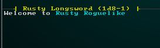
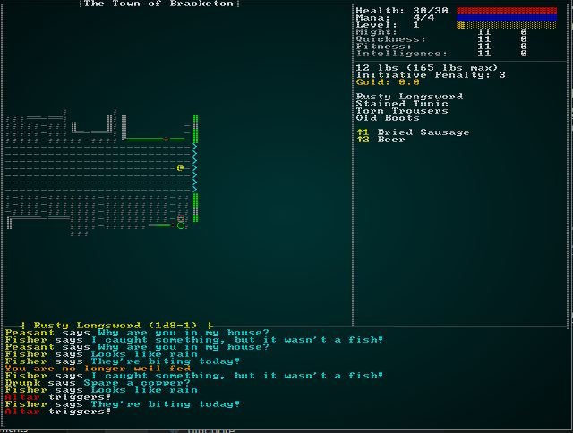

# Improved Logging and Achievements

---

***About this tutorial***

*This tutorial is free and open source, and all code uses the MIT license - so you are free to do with it as you like. My hope is that you will enjoy the tutorial, and make great games!*

*If you enjoy this and would like me to keep writing, please consider supporting [my Patreon](https://www.patreon.com/blackfuture).*

---

Most Roguelikes make a big deal of the game log. It gets rolled into the *morgue file* at the end (detailed description of how your run went), it is used to show what's going on in the world, and is invaluable to the hardcore player. We've been using a pretty simple logging setup (thanks to Mark McCaskey's hard work, it's no longer horribly slow). In this chapter, we'll build a good logging system - and use it as the basis for an achievements and progress tracking system. We'll also make the logging GUI a little better.

Currently, we add to the game log with a direct call to the data structure. It looks something like this:

```rust
log.entries.push(format!("{} hits {}, for {} hp.", &name.name, &target_name.name, damage));
```

This isn't a great way to do it: it requires that you *have* direct access to the log, doesn't provide any formatting whatsoever, and requires that systems know about how the log works internally. We are also not serializing the log as part of saving the game (and de-serializing when we load). Lastly, there's a lot of things we're not logging but could be; that's because including the log as a resource is quite annoying. Like the effects system, it should be seamless, easy, and thread-safe (if you aren't using WASM!).

This chapter will correct these flaws.

## Building an API

We'll start by making a new directory, `src/gamelog`. We'll move the contents of `src/gamelog.rs` into it and rename the file `mod.rs` - in other words, we make a new module. This should continue to function - the module hasn't changed name.

Append the following to `mod.rs`:

```rust
pub struct LogFragment {
    pub color : RGB,
    pub text : String
}
```

The new `LogFragment` type will store *pieces* of a log entry. Each piece can have some text and a color, allowing for rich, colorful log entries. A group of them together can make up a log line.

Next, we'll make another new file - this time named `src/gamelog/logstore.rs`. Paste the following into it:

```rust
use std::sync::Mutex;
use super::LogFragment;
use rltk::prelude::*;

lazy_static! {
    static ref LOG : Mutex<Vec<Vec<LogFragment>>> = Mutex::new(Vec::new());
}

pub fn append_fragment(fragment : LogFragment) {
    LOG.lock().unwrap().push(vec![fragment]);
}

pub fn append_entry(fragments : Vec<LogFragment>) {
    LOG.lock().unwrap().push(fragments);
}

pub fn clear_log() {
    LOG.lock().unwrap().clear();
}

pub fn log_display() -> TextBuilder {
    let mut buf = TextBuilder::empty();

    LOG.lock().unwrap().iter().rev().take(12).for_each(|log| {
        log.iter().for_each(|frag| {
            buf.fg(frag.color);
            buf.line_wrap(&frag.text);
        });
        buf.ln();
    });

    buf
}
```

There's quite a bit to digest here:

* At the core, we're using `lazy_static` to define a *global* log entry store. It's a vector of vectors, this time making up fragments. So the outer vector is *lines* in the log, the inner vector constitutes the *fragments* that make up the log. It's protected by a `Mutex`, making it safe to use in a threaded environment.
* `append_fragment` locks the log, and appends a single fragment as a new line.
* `append_entry` locks the log, and appends a vector of fragments (a new line).
* `clear_log` does what it says on the label: it empties the log.
* `log_display` builds an RLTK `TextBuilder` object, which is a safe way to build lots of text together for rendering, taking into account things like line wrapping. It takes 12 entries, because that's the largest log we can display.

In `mod.rs`, add the following three lines to take care of using the module and exporting parts of it:

```rust
mod logstore;
use logstore::*;
pub use logstore::{clear_log, log_display};
```

That lets us greatly simplify displaying the log. Open `gui.rs`, and find the log drawing code (it's line 248 on the example). Replace the log drawing with:

```rust
// Draw the log
let mut block = TextBlock::new(1, 46, 79, 58);
block.print(&gamelog::log_display());
block.render(&mut ctx.consoles[0].console);
```

This specifies the exact location of the log text block, as an RLTK `TextBlock` object. Then it prints the results of `log_display()` to the block, and renders it onto console zero (the console we are using).

Now, we need a way to add text to the log. The builder pattern is a natural fit; most of the time, we are gradually building up detail in a log entry. Create another file, `src/gamelog/builder.rs`:

```rust
use rltk::prelude::*;
use super::{LogFragment, append_entry};

pub struct Logger {
    current_color : RGB,
    fragments : Vec<LogFragment>
}

impl Logger {
    pub fn new() -> Self {
        Logger{
            current_color : RGB::named(rltk::WHITE),
            fragments : Vec::new()
        }
    }

    pub fn color(mut self, color: (u8, u8, u8)) -> Self {
        self.current_color = RGB::named(color);
        self
    }

    pub fn append<T: ToString>(mut self, text : T) -> Self {
        self.fragments.push(
            LogFragment{
                color : self.current_color,
                text : text.to_string()
            }
        );
        self
    }

    pub fn log(self) {
        append_entry(self.fragments)
    }
}
```

This defines a new type, `Logger`. It keeps track of the current output color, and current list of fragments that make up a log entry. The `new` function makes a new one, while `log` submits it to the mutex-protected global variable. You can call `color` to change the current writing color, and `append` to add a string (we're using `ToString`, so no more messy `to_string()` calls everywhere!).

In `gamelog/mod.rs`, we want to use and export this module:

```rust
mod builder;
pub use builder::*;
```

To see it in action, open `main.rs` and find the lines where we add a new log file to the resources list, along with the line "Welcome to Rusty Roguelike". For now, we'll keep the original - and make use of the new setup to start the log:

```rust
gs.ecs.insert(gamelog::GameLog{ entries : vec!["Welcome to Rusty Roguelike".to_string()] });
gamelog::clear_log();
gamelog::Logger::new()
    .append("Welcome to")
    .color(rltk::CYAN)
    .append("Rusty Roguelike")
    .log();
```

That's nice and clean: no need to obtain a resource, and the text/color appending is easy to read! If you `cargo run` now, you'll see a single log entry displayed in color:



## Enforcing API usage

Now it's time to break things. In `src/gamelog/mod.rs`, **delete** the following:

```rust
pub struct GameLog {
    pub entries : Vec<String>
}
```

If you're using an IDE, your project just became a sea of red! We just erased the old way of logging - so *every* reference to the old log is now a compilation failure. That's ok, because we want to transition to the new system.

Starting with `main.rs`, we can delete the references to the old log. Delete the new log line, as well as all of the logging information we added before. Find the `generate_world_map` function, and move the initial log clearing/setup there:

```rust
fn generate_world_map(&mut self, new_depth : i32, offset: i32) {
    self.mapgen_index = 0;
    self.mapgen_timer = 0.0;
    self.mapgen_history.clear();
    let map_building_info = map::level_transition(&mut self.ecs, new_depth, offset);
    if let Some(history) = map_building_info {
        self.mapgen_history = history;
    } else {
        map::thaw_level_entities(&mut self.ecs);
    }

    gamelog::clear_log();
    gamelog::Logger::new()
        .append("Welcome to")
        .color(rltk::CYAN)
        .append("Rusty Roguelike")
        .log();
}
```

If you `cargo build` the project now, you'll have lots of errors. We need to work our way through and update *all* of the logging references to use the new system.

## Using the API

Open `src/inventory_system/collection_system.rs`. In the `use` statement, remove the reference to `gamelog::GameLog` (it doesn't exist anymore). Remove the `WriteExpect` looking for a the game log (and the matching `mut gamelog` in the tuple). Replace the `gamelog.push` statement with:

```rust
crate::gamelog::Logger::new()
    .append("You pick up the")
    .color(rltk::CYAN)
    .append(
        super::obfuscate_name(pickup.item, &names, &magic_items, &obfuscated_names, &dm)
    )
    .log();
```

You need to make basically the same changes to `src/inventory_system/drop_system.rs`. After deleting the import and resource, the log message system becomes:

```rust
if entity == *player_entity {
    crate::gamelog::Logger::new()
        .append("You drop the")
        .color(rltk::CYAN)
        .append(
            super::obfuscate_name(to_drop.item, &names, &magic_items, &obfuscated_names, &dm)
        )
        .log();
}
```

Likewise, in `src/inventory_system/equip_use.rs`, delete the `gamelog`. Also delete the `log_entries` variable and the loop appending it. There's quite a few log entries to clean up:

```rust
// Cursed item unequipping
crate::gamelog::Logger::new()
    .append("You cannot unequip")
    .color(rltk::CYAN)
    .append(&name.name)
    .color(rltk::WHITE)
    .append("- it is cursed!")
    .log();
can_equip = false;
...
// Unequipped item
crate::gamelog::Logger::new()
    .append("You unequip")
    .color(rltk::CYAN)
    .append(&name.name)
    .log();
...
// Wield
crate::gamelog::Logger::new()
    .append("You equip")
    .color(rltk::CYAN)
    .append(&names.get(useitem.item).unwrap().name)
    .log();
```

Likewise, the file `src/hunger_system.rs` needs updating. Once again, remove the `gamelog` and replace the `log.push` lines with equivalents using the new system.

```rust
crate::gamelog::Logger::new()
    .color(rltk::ORANGE)
    .append("You are no longer well fed")
    .log();
...
crate::gamelog::Logger::new()
    .color(rltk::ORANGE)
    .append("You are hungry")
    .log();
...
crate::gamelog::Logger::new()
    .color(rltk::RED)
    .append("You are starving!")
    .log();
...
crate::gamelog::Logger::new()
    .color(rltk::RED)
    .append("Your hunger pangs are getting painful! You suffer 1 hp damage.")
    .log();
```

`src/trigger_system.rs` needs the same treatment. Once again, remove `gamelog` and replace the log entries. We'll use a bit of color highlighting to emphasize traps:

```rust
crate::gamelog::Logger::new()
    .color(rltk::RED)
    .append(&name.name)
    .color(rltk::WHITE)
    .append("triggers!")
    .log();
```

`src/ai/quipping.rs` needs the exact same treatment. Remove `gamelog`, and replace the logging call with:

```rust
crate::gamelog::Logger::new()
    .color(rltk::YELLOW)
    .append(&name.name)
    .color(rltk::WHITE)
    .append("says")
    .color(rltk::CYAN)
    .append(&quip.available[quip_index])
    .log();
```

`src/ai/encumbrance_system.rs` has the same changes. Once again, `gamelog` must go away - and the log append is replaced with:

```rust
crate::gamelog::Logger::new()
    .color(rltk::ORANGE)
    .append("You are overburdened, and suffering an initiative penalty.")
    .log();
```

`src/effects/damage.rs` logs slightly differently, but we can unify the mechanism now. Start by removing the `use crate::gamelog::GameLog;` line. Then replace all of the `log_entries.push` lines with lines that use the new `Logger` interface:

```rust
crate::gamelog::Logger::new()
    .color(rltk::MAGENTA)
    .append("Congratulations, you are now level")
    .append(format!("{}", player_stats.level))
    .log();
...
crate::gamelog::Logger::new().color(rltk::GREEN).append("You feel stronger!").log();
...
crate::gamelog::Logger::new().color(rltk::GREEN).append("You feel healthier!").log();
...
crate::gamelog::Logger::new().color(rltk::GREEN).append("You feel quicker!").log();
...
crate::gamelog::Logger::new().color(rltk::GREEN).append("You feel smarter!").log();
```

It is the same again in `src\effects\trigger.rs`; remove `GameLog` and replace the log code with:

```rust
crate::gamelog::Logger::new()
    .color(rltk::CYAN)
    .append(&ecs.read_storage::<Name>().get(item).unwrap().name)
    .color(rltk::WHITE)
    .append("is out of charges!")
    .log();
...
crate::gamelog::Logger::new()
    .append("You eat the")
    .color(rltk::CYAN)
    .append(&names.get(entity).unwrap().name)
    .log();
...
crate::gamelog::Logger::new().append("The map is revealed to you!").log();
...
crate::gamelog::Logger::new().append("You are already in town, so the scroll does nothing.").log();
...
crate::gamelog::Logger::new().append("You are telported back to town!").log();
...

Once again, `src/player.rs` is more of the same. Remove `GameLog`, and replace the log entries with the new builder syntax:

```rust
crate::gamelog::Logger::new()
    .append("You fire at")
    .color(rltk::CYAN)
    .append(&name.name)
    .log();
...
crate::gamelog::Logger::new().append("There is no way down from here.").log();
...
crate::gamelog::Logger::new().append("There is no way up from here.").log();
...
None => crate::gamelog::Logger::new().append("There is nothing here to pick up.").log(),
...
crate::gamelog::Logger::new().append("You don't have enough mana to cast that!").log();
```

It's the same again in `visibility_system.rs`. Once again, delete `GameLog` and replace log pushes with:

```rust
crate::gamelog::Logger::new()
    .append("You spotted:")
    .color(rltk::RED)
    .append(&name.name)
    .log();
```

Once again, `melee_combat_system.rs` needs the same changes: no more `GameLog`, and update the text output to use the new building system:

```rust
crate::gamelog::Logger::new()
    .color(rltk::YELLOW)
    .append(&name.name)
    .color(rltk::WHITE)
    .append("hits")
    .color(rltk::YELLOW)
    .append(&target_name.name)
    .color(rltk::WHITE)
    .append("for")
    .color(rltk::RED)
    .append(format!("{}", damage))
    .color(rltk::WHITE)
    .append("hp.")
    .log();
...
crate::gamelog::Logger::new()
    .color(rltk::CYAN)
    .append(&name.name)
    .color(rltk::WHITE)
    .append("considers attacking")
    .color(rltk::CYAN)
    .append(&target_name.name)
    .color(rltk::WHITE)
    .append("but misjudges the timing!")
    .log();
...
crate::gamelog::Logger::new()
    .color(rltk::CYAN)
    .append(&name.name)
    .color(rltk::WHITE)
    .append("attacks")
    .color(rltk::CYAN)
    .append(&target_name.name)
    .color(rltk::WHITE)
    .append("but can't connect.")
    .log();
```

You should have a pretty good understanding of the changes requires by now. If you check the [source code](https://github.com/thebracket/rustrogueliketutorial/tree/master/chapter-71-logging), I've made the changes to all the other instances of `gamelog`.

Once you've made all the changes, you can `cargo run` your game - and see a brightly colored log:



## Making common logging tasks easier

While going through the code, upading log entries - a lot of commonalities appeared. It would be good to enforce some style consistency (and reduce the amount of typing required). We'll add some methods to our log builder (in `src/gamelog/builder.rs`) to help:

```rust
pub fn npc_name<T: ToString>(mut self, text : T) -> Self {
    self.fragments.push(
        LogFragment{
            color : RGB::named(rltk::YELLOW),
            text : text.to_string()
        }
    );
    self
}

pub fn item_name<T: ToString>(mut self, text : T) -> Self {
    self.fragments.push(
        LogFragment{
            color : RGB::named(rltk::CYAN),
            text : text.to_string()
        }
    );
    self
}

pub fn damage(mut self, damage: i32) -> Self {
    self.fragments.push(
        LogFragment{
            color : RGB::named(rltk::RED),
            text : format!("{}", damage).to_string()
        }
    );
    self
}
```

Now we can go through and update some of the log entry code again, using the easier syntax. For example, in `src\ai\quipping.rs` we can replace:

```rust
crate::gamelog::Logger::new()
    .color(rltk::YELLOW)
    .append(&name.name)
    .color(rltk::WHITE)
    .append("says")
    .color(rltk::CYAN)
    .append(&quip.available[quip_index])
    .log();
```

with:

```rust
crate::gamelog::Logger::new()
    .npc_name(&name.name)
    .append("says")
    .npc_name(&quip.available[quip_index])
    .log();
```

Or in `melee_combat_system.rs`, one can greatly shorted the damage announcement:

```rust
crate::gamelog::Logger::new()
    .npc_name(&name.name)
    .append("hits")
    .npc_name(&target_name.name)
    .append("for")
    .damage(damage)
    .append("hp.")
    .log();
```

Once again, I've gone through the project source code and applied these enhancements.

---

**The source code for this chapter may be found [here](https://github.com/thebracket/rustrogueliketutorial/tree/master/chapter-71-logging)**


[Run this chapter's example with web assembly, in your browser (WebGL2 required)](http://bfnightly.bracketproductions.com/rustbook/wasm/chapter-71-logging)
---

Copyright (C) 2019, Herbert Wolverson.

---